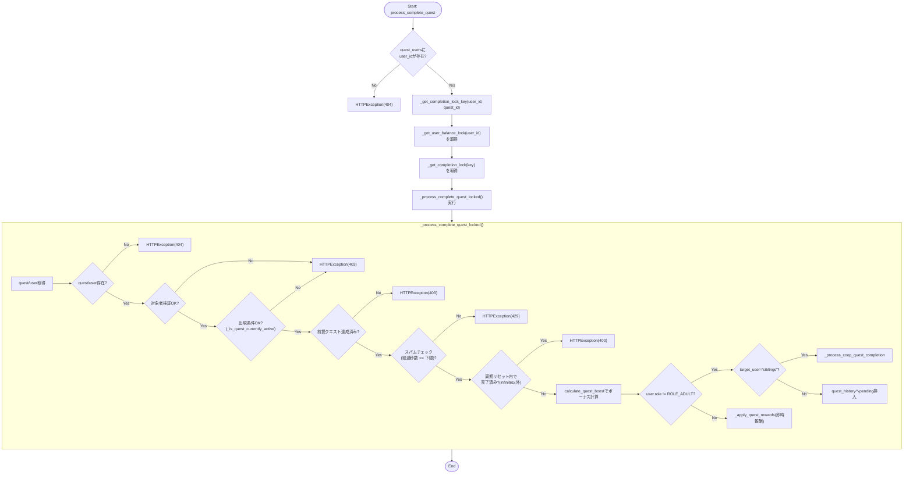
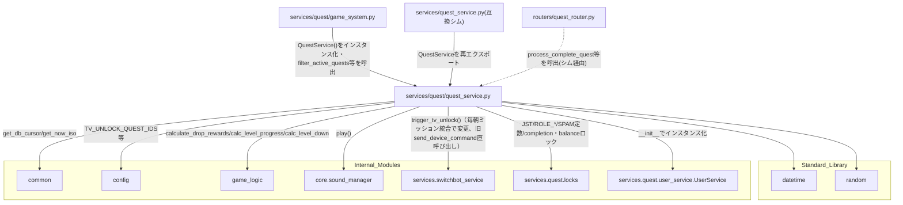

## 1. 解析メタ情報

| 項目 | 内容 |
| --- | --- |
| 対象ファイル | `MY_HOME_SYSTEM/services/quest/quest_service.py`（フルパス, disambiguation目的） |
| 言語 | Python (FastAPI関連) |
| 解析対象 | 提供されたコードのみ |
| 推測・補完 | 一切なし |
| 解析基準コミット | `a1d2738` |

同名衝突の注意: 本ファイル(`services/quest/quest_service.py`)は、下位互換シムである`services/quest_service.py`と基底名`quest_service`が完全に衝突する。既存の[quest_service.md](./quest_service.md)は歴史的経緯によりシム移行前の旧`services/quest_service.py`（1572行の巨大モジュール）を文書化していたが、Issue #550の分割後は同名がシム自身を指すようになったため、本ファイルの実体である`services/quest/quest_service.py`は`<親ディレクトリ名>_<stem>.md`という規約（`dashboard_common.md`の前例）に従い`quest_quest_service.md`という一見冗長な二重語の名前で区別する。「`quest`ディレクトリ配下の`quest_service.py`」という命名がそのまま反映された結果であり、誤字ではない。

## 関連ドキュメント

* [quest_service.md](./quest_service.md) - `services/quest_service.py`（Issue #550後の下位互換シム）。`from services.quest.quest_service import QuestService`として本ファイルのクラスを再エクスポートする。実体はここに存在しないため、`QuestService`の詳細を読む際は必ず本ファイルを参照すること
* [quest_locks.md](./quest_locks.md) - `JST`/`ROLE_ADULT`/`ROLE_CHILD`/`SPAM_CHECK_INTERVAL_SECONDS`/`INFINITE_QUEST_COOLDOWN_SECONDS`/`_acquire_user_balance_locks`/`_get_completion_lock`/`_get_user_balance_lock`/`_seconds_since_iso_timestamp`/`logger`の提供元
* [quest_user_service.md](./quest_user_service.md) - `QuestService.__init__`が`UserService()`インスタンスを`self.user_service`として保持する（ただし本ファイル内で`self.user_service`を実際に参照する箇所は無い）
* [quest_game_system.md](./quest_game_system.md) - `GameSystem.__init__`が`QuestService()`インスタンスを保持し、`filter_active_quests`/`_compute_boost_from_last_completed`/`is_within_reset_period`を呼び出す最大の利用元
* [quest_shop_service.md](./quest_shop_service.md) - 同じ`_get_user_balance_lock`（[quest_locks.md](./quest_locks.md)）を取得し、`quest_users`を書き換えうる経路として本ファイルの各メソッドと直列化の対象を共有する
* [common.md](./common.md) — **Issue #664 で `common.py` ごと廃止された Deprecated Facade**（本ファイルは実体を直importするようになった。仕様書は履歴として残っている）
* [config.md](./config.md) - `TV_UNLOCK_QUEST_IDS`/`TV_PLUG_DEVICE_ID`/`LINE_PARENTS_GROUP_ID`の提供元
* [game_logic.md](./game_logic.md) - `game_logic.GameLogic.calculate_drop_rewards`/`calc_level_progress`/`calc_level_down`の実装
* [sound_manager.md](./sound_manager.md) - `core.sound_manager.play`の実体
* [switchbot_service.md](./switchbot_service.md) - `services.switchbot_service.trigger_tv_unlock`の実体（TVロック解除。**毎朝ミッション統合で変更**: 以前は本ファイル内の`_trigger_tv_unlock`が`send_device_command`を直接呼び失敗時通知も自前で行っていたが、`services/routine_service.py`との共有のため`switchbot_service.trigger_tv_unlock`へ切り出され、失敗時の`notification_service.send_push`呼び出しも同関数内に移った）
* [quest_router.md](./quest_router.md) - 本ファイルの各メソッドを呼び出すFastAPIルーター（下位互換シム経由でimportしている）

## 2. ファイルの概要

Issue #550の分割で`services/quest_service.py`（旧1572行モノリス）から切り出された、クエスト完了・承認・却下・取消のドメインロジックを担う`QuestService`クラス1つを定義するファイル。周期リセット判定(`is_within_reset_period`)、連続達成ボーナス計算(`_compute_boost_from_last_completed`/`calculate_quest_boost`)、クエスト完了の実処理(`process_complete_quest`系)、兄妹連携クエスト(`target_user == 'siblings'`)の完了・承認・却下・取消のカスケード処理、TVロック解除の非同期トリガー呼び出し(`switchbot_service.trigger_tv_unlock`。**毎朝ミッション統合で変更**: 以前は本クラスのプライベートメソッド`_trigger_tv_unlock`だったが、`services/routine_service.py`と共有するため`switchbot_service`側の関数へ切り出された)、クエストの出現条件判定(`_is_quest_currently_active`/`filter_active_quests`)を含む。クエスト完了処理(`process_complete_quest`)は、`user_id`単位の`_get_user_balance_lock`と、`_get_completion_lock_key`が算出するキー（通常は`(user_id, quest_id)`、兄妹連携クエストは`('__coop__', quest_id)`）への`_get_completion_lock`を常に(balance lock→completion lock)の順にネストして取得し、二重加算と経路間のlost updateを防ぐ。承認(`process_approve_quest`)・却下(`process_reject_quest`)・取消(`process_cancel_quest`)はいずれも`_get_lock_user_ids_for_history`で対象ユーザーと連結された相方(兄妹連携クエストの場合)を特定し、`_acquire_user_balance_locks`で複数ユーザー分のロックをまとめて取得したうえで実処理に委譲する薄いラッパー構造を共有する。
根拠: `class QuestService:` (行番号: 28)、`def process_complete_quest(self, user_id: str, quest_id: int) -> Dict[str, Any]:` (行番号: 158〜181)、`with _get_user_balance_lock(user_id):\n            with _get_completion_lock(self._get_completion_lock_key(user_id, quest_id)):\n                return self._process_complete_quest_locked(user_id, quest_id)` (行番号: 179〜181)
根拠: `def _get_lock_user_ids_for_history(\n        self, history_id: int, primary_user_id: Optional[str] = None\n    ) -> List[str]:` (行番号: 350〜386)、`lock_user_ids = self._get_lock_user_ids_for_history(history_id)\n        with _acquire_user_balance_locks(lock_user_ids):\n            return self._process_approve_quest_locked(approver_id, history_id)` (行番号: 393〜395)

## 3. 外部依存関係

### インポート一覧

| 名称 | 種類 | 用途 | 根拠 |
| --- | --- | --- | --- |
| `datetime` | 標準ライブラリ | 日付や時刻の操作・比較 | `import datetime` (行番号: 2) |
| `random` | 標準ライブラリ | `random`型クエストの出現抽選(`random.Random(seed)`) | `import random` (行番号: 3) |
| `typing` (`Any`, `Dict`, `List`, `Optional`, `Tuple`) | 標準ライブラリ | 型ヒント | `from typing import Any, Dict, List, Optional, Tuple` (行番号: 4) |
| `fastapi.HTTPException` | 外部ライブラリ | エラーレスポンス生成 | `from fastapi import HTTPException` (行番号: 6) |
| `core.utils.get_now_iso` | ローカルモジュール | **（Issue #664 で変更）** 以前は Deprecated Facade である `common` 経由で参照していた。`common.py` の廃止に伴い実体を直接importする | 根拠: `from core.utils import get_now_iso` (行番号: 8 / 抜粋: "from core.utils import get_now_iso") |
| `core.database.get_db_cursor` | ローカルモジュール | **（Issue #664 で変更）** 以前は Deprecated Facade である `common` 経由で参照していた。`common.py` の廃止に伴い実体を直接importする | 根拠: `from core.database import get_db_cursor` (行番号: 9 / 抜粋: "from core.database import get_db_cursor") |
| `config` | 内部モジュール | `TV_UNLOCK_QUEST_IDS`/`TV_PLUG_DEVICE_ID`/`LINE_PARENTS_GROUP_ID`の参照 | `import config` (行番号: 9) |
| `game_logic` | 内部モジュール | `GameLogic.calculate_drop_rewards`/`calc_level_progress`/`calc_level_down`の呼び出し | `import game_logic` (行番号: 10) |
| `core.sound_manager` | 内部モジュール | 音声再生イベント発行 | `from core import sound_manager` (行番号: 11) |
| `services.switchbot_service` | 内部モジュール | TVプラグのON操作コマンド送信(`trigger_tv_unlock`。**毎朝ミッション統合で変更**: 以前は本クラスのプライベートメソッド`_trigger_tv_unlock`が`threading`/`services.notification_service`を直接importして`switchbot_service.send_device_command`を呼んでいたが、`services/routine_service.py`（朝の準備チェックリスト完了時）でも同じTV解錠処理が必要になったため`switchbot_service.trigger_tv_unlock`という共有関数へ切り出され、本ファイルは`threading`/`services.notification_service`を直接importする必要がなくなった) | `from services import switchbot_service` (行番号: 12) |
| `services.quest.locks` (`INFINITE_QUEST_COOLDOWN_SECONDS`, `JST`, `ROLE_ADULT`, `ROLE_CHILD`, `SPAM_CHECK_INTERVAL_SECONDS`, `_acquire_user_balance_locks`, `_get_completion_lock`, `_get_user_balance_lock`, `_seconds_since_iso_timestamp`, `logger`) | 内部モジュール | 定数・ロックヘルパー・ロガーの共有基盤（詳細は[quest_locks.md](./quest_locks.md)参照） | `from services.quest.locks import (\n    INFINITE_QUEST_COOLDOWN_SECONDS,\n    JST,\n    ROLE_ADULT,\n    ROLE_CHILD,\n    SPAM_CHECK_INTERVAL_SECONDS,\n    _acquire_user_balance_locks,\n    _get_completion_lock,\n    _get_user_balance_lock,\n    _seconds_since_iso_timestamp,\n    logger,\n)` (行番号: 13〜24) |
| `services.quest.user_service.UserService` | 内部モジュール | `QuestService.__init__`が保持する`self.user_service`の型 | `from services.quest.user_service import UserService` (行番号: 25) |

### ブラックボックスとなる外部要素

| 名称 | 理由 | 根拠 |
| --- | --- | --- |
| `core.database.get_db_cursor()` / `core.utils.get_now_iso()` | トランザクションスコープや接続の詳細、生成されるISO文字列のフォーマットが本ファイルからは不明 | `with core.database.get_db_cursor(commit=True) as cur:` (行番号: 200) |
| `game_logic.GameLogic.*` | `calculate_drop_rewards`, `calc_level_progress`, `calc_level_down`の計算式・詳細仕様が不明 | `game_logic.GameLogic.calculate_drop_rewards(base_gold, base_exp)` (行番号: 530) |
| `config.*` | `TV_UNLOCK_QUEST_IDS`, `TV_PLUG_DEVICE_ID`, `LINE_PARENTS_GROUP_ID`の実際の設定値が不明 | `config.TV_UNLOCK_QUEST_IDS` (行番号: 447) |
| `switchbot_service.trigger_tv_unlock`（毎朝ミッション統合で変更。旧`switchbot_service.send_device_command`直接呼び出し） | 非同期スレッド起動・失敗時のFail-Soft通知処理の完全な仕様が本ファイルからは不明（詳細は[switchbot_service.md](./switchbot_service.md)参照） | `switchbot_service.trigger_tv_unlock(f"quest_id={tv_unlock_quest_id}")` (行番号: 454) |
| `sound_manager.play` | 再生される音声の実体・失敗時の挙動が不明 | `sound_manager.play("submit")` (行番号: 294) |
| DBの各テーブルスキーマ | カラムの型、制約(UNIQUE, NOT NULL等)、外部キー設定などが不明。特に`quest_history.linked_history_id`/`medals_earned`の型・制約は本ファイルからは確認できない | `hist['linked_history_id']` (行番号: 436), `medals_earned=?` (行番号: 555) |

## 4. 主要要素の定義（関数 / エンドポイント / コンポーネント）

### `QuestService.__init__`

* **役割**: インスタンス初期化時に`UserService`のインスタンスを生成し`self.user_service`へ格納する。本ファイル内で`self.user_service`が実際に参照される箇所は無い。
* 根拠: `def __init__(self):\n        self.user_service = UserService()` (行番号: 73〜74)
* **引数/リクエスト**: なし
* 根拠: (行番号: 73)
* **戻り値/レスポンス**: なし
* **副作用**: インスタンスプロパティの割り当て（`self.user_service`）
* 根拠: (行番号: 74)
* **エラーハンドリング**: なし

### `QuestService.is_within_reset_period`

* **役割**: 完了日時文字列(`completed_at_str`)とリセット周期文字列(`reset_period`)から、現在の期間内に完了しているかを判定する。`completed_at_str`をISOパースし、`tzinfo`が無ければ保存規約(`core.utils.get_now_iso`)に合わせてJSTとみなして`JST`へ変換する。変換に失敗した場合は`"%Y-%m-%d"`形式でのパースにフォールバックし、それも失敗すれば`False`を返す。`reset_period == 'daily'`なら当日一致、`'weekly'`なら当該週(月曜起点)以降か、`'monthly'`なら`(year, month)`の一致で判定する。上記いずれにも一致しない値（空文字・`NULL`・想定外の文字列）の場合は、警告ログを出力したうえで`False`を返す。
* 根拠: `def is_within_reset_period(self, completed_at_str: str, reset_period: str) -> bool:` (行番号: 29〜71)
* 根拠: `if dt.tzinfo is None:\n                dt = dt.replace(tzinfo=JST)` (行番号: 44〜45)
* 根拠: `if reset_period == 'daily':\n            return completed_date == today_jst\n        elif reset_period == 'weekly':\n            ...\n        elif reset_period == 'monthly':\n            ...\n            return (completed_date.year, completed_date.month) == (today_jst.year, today_jst.month)` (行番号: 54〜65)
* 根拠: `logger.warning(f"⚠️ is_within_reset_period: 未知のreset_period値 ({reset_period!r}) のため常にFalseを返します。")\n        return False` (行番号: 70〜71)
* **引数/リクエスト**: `completed_at_str: str`, `reset_period: str`
* 根拠: (行番号: 29)
* **戻り値/レスポンス**: `bool`
* 根拠: (行番号: 29)
* **副作用**: 想定外の`reset_period`値を受け取った場合の警告ログ出力のみ
* 根拠: (行番号: 70)
* **エラーハンドリング**: `completed_at_str`が空なら早期`False`。ISOパース失敗時は`"%Y-%m-%d"`形式でリトライし、それも失敗すれば`False`を返す（例外は送出しない）。
* 根拠: `if not completed_at_str:\n            return False` (行番号: 30〜31)、`except Exception:\n            try:\n                completed_date = datetime.datetime.strptime(...)\n            except Exception:\n                return False` (行番号: 48〜52)

### `QuestService._compute_boost_from_last_completed`

* **役割**: 対象クエストが`quest_type == 'daily'`かつ`day_of_week`が未設定(曜日限定でない)かつ`reset_period`が(未設定時のデフォルトの)`'daily'`の場合のみ、最終完了日(`last_completed_at`)からの経過日数に応じて取得経験値・ゴールドのボーナスを計算する(`missed_days × 10%`、最大100%)。DBアクセスを伴わない純粋関数として`calculate_quest_boost`から切り出されており、`GameSystem.get_all_view_data`のようにクエスト×ユーザーの組合せ数だけボーナスを算出する場面で、呼び出し側が全組合せ分の直近完了日時を1クエリでまとめて取得し本関数へ直接渡すことでN+1クエリを避けられる。
* 根拠: `def _compute_boost_from_last_completed(self, quest: Any, last_completed_at: Optional[str]) -> Dict[str, int]:` (行番号: 76〜135)
* 根拠: `if quest['quest_type'] != 'daily':\n            return {"gold": 0, "exp": 0}` (行番号: 88〜89)、`if quest['day_of_week']:\n            return {"gold": 0, "exp": 0}` (行番号: 95〜96)、`if (quest['reset_period'] or 'daily') != 'daily':\n            return {"gold": 0, "exp": 0}` (行番号: 104〜105)
* 根拠: `now_jst = datetime.datetime.now(JST)` (行番号: 111)
* **引数/リクエスト**: `quest: Any`（`sqlite3.Row`または`dict`を想定）, `last_completed_at: Optional[str]`
* 根拠: (行番号: 76)
* **戻り値/レスポンス**: `Dict[str, int]`（`gold`, `exp`の追加ボーナス）
* 根拠: (行番号: 76,128〜135)
* **副作用**: なし（純粋な計算）
* 根拠: (行番号: 76〜135)
* **エラーハンドリング**: `last_completed_at`のISOパース失敗時は`except Exception: pass`で無視しボーナスなし扱いとする
* 根拠: `except Exception:\n                pass` (行番号: 118〜119)

### `QuestService.calculate_quest_boost`

* **役割**: `_compute_boost_from_last_completed`のDBアクセス付きラッパー。対象外と分かっているクエスト(daily以外・曜日限定・`reset_period≠daily`)は`_compute_boost_from_last_completed`側の早期returnガードに先立って自ら早期returnし、無駄なSELECTを避ける。対象クエストの直近の非`rejected`完了日時(`status != 'rejected'`)を`quest_history`へ1回問い合わせてから`_compute_boost_from_last_completed`に委譲する。`status = 'approved'`ではなく`status != 'rejected'`を条件とするのは、承認待ち(`pending`)の日を「サボり」と誤判定しないためである。
* 根拠: `def calculate_quest_boost(self, cur, user_id: str, quest: Any) -> Dict[str, int]:` (行番号: 137〜156)
* 根拠: `if quest['quest_type'] != 'daily' or quest['day_of_week'] or (quest['reset_period'] or 'daily') != 'daily':\n            return {"gold": 0, "exp": 0}` (行番号: 143〜144)
* 根拠: `last_hist = cur.execute("""\n            SELECT completed_at FROM quest_history\n            WHERE user_id = ? AND quest_id = ? AND status != 'rejected'\n            ORDER BY completed_at DESC LIMIT 1\n        """, (user_id, quest['quest_id'])).fetchone()` (行番号: 149〜153)
* **引数/リクエスト**: `cur`, `user_id: str`, `quest: Any`
* 根拠: (行番号: 137)
* **戻り値/レスポンス**: `Dict[str, int]`（`gold`, `exp`）
* 根拠: (行番号: 137,156)
* **副作用**: DB参照（`quest_history`）
* 根拠: (行番号: 149〜153)
* **エラーハンドリング**: なし（`_compute_boost_from_last_completed`側の例外処理に委ねる）
* 根拠: (行番号: 137〜156)

### `QuestService.process_complete_quest`

* **役割**: `user_id`単位の`_get_user_balance_lock`と、`_get_completion_lock_key(user_id, quest_id)`で算出したキーの`_get_completion_lock`を、常にこの順(balance lock→completion lock)でネストして取得したうえで、実処理を`_process_complete_quest_locked`に委譲する薄いラッパー。ロック取得前に`quest_users`の存在を確認し、存在しない`user_id`では404を返してロック辞書にエントリを作らない。
* 根拠: `def process_complete_quest(self, user_id: str, quest_id: int) -> Dict[str, Any]:` (行番号: 158〜181)
* 根拠: `with core.database.get_db_cursor() as cur:\n            exists = cur.execute("SELECT 1 FROM quest_users WHERE user_id = ?", (user_id,)).fetchone()\n        if not exists:\n            raise HTTPException(status_code=404, detail="User not found")` (行番号: 174〜177)
* 根拠: `with _get_user_balance_lock(user_id):\n            with _get_completion_lock(self._get_completion_lock_key(user_id, quest_id)):\n                return self._process_complete_quest_locked(user_id, quest_id)` (行番号: 179〜181)
* **引数/リクエスト**: `user_id: str`, `quest_id: int`
* 根拠: (行番号: 158)
* **戻り値/レスポンス**: `Dict[str, Any]`（`_process_complete_quest_locked`の戻り値をそのまま返却）
* 根拠: (行番号: 181)
* **副作用**: `quest_users`存在確認のDB参照、`_get_completion_lock_key`によるDB参照（`quest_master`）、2種類のロック(user balance lock, completion lock)の取得・解放
* 根拠: (行番号: 175,179〜181)
* **エラーハンドリング**: `user_id`が`quest_users`に存在しない場合`HTTPException(status_code=404, detail="User not found")`。それ以外の内部の例外はそのまま伝播。
* 根拠: (行番号: 176〜177)

### `QuestService._get_completion_lock_key`

* **役割**: `process_complete_quest`が使用する完了ロックのキーを算出する。対象クエストの`target_user`をDBから参照し、`'siblings'`(兄妹連携クエスト)であれば`user_id`に依存しない共通キー`('__coop__', quest_id)`を返し、それ以外は`(user_id, quest_id)`を返す。この問い合わせは、実際のロック取得より前・かつ`process_complete_quest`本体とは別の`get_db_cursor`トランザクションとして実行される。
* 根拠: `def _get_completion_lock_key(self, user_id: str, quest_id: int) -> Tuple[str, int]:` (行番号: 183〜197)
* 根拠: `with core.database.get_db_cursor() as cur:\n            quest = cur.execute(\n                "SELECT target_user FROM quest_master WHERE quest_id = ?", (quest_id,)\n            ).fetchone()\n        if quest and quest['target_user'] == 'siblings':\n            return ('__coop__', quest_id)\n        return (user_id, quest_id)` (行番号: 191〜197)
* **引数/リクエスト**: `user_id: str`, `quest_id: int`
* 根拠: (行番号: 183)
* **戻り値/レスポンス**: `Tuple[str, int]`
* 根拠: (行番号: 183,196〜197)
* **副作用**: DB参照（`quest_master`から`target_user`のみSELECT）
* 根拠: (行番号: 191〜194)
* **エラーハンドリング**: なし。対象`quest_id`がマスタに存在しない場合は`quest`が`None`となり`(user_id, quest_id)`にフォールバックする。
* 根拠: (行番号: 195〜197)

### `QuestService._process_complete_quest_locked`

* **役割**: クエスト完了の実処理。クエスト・ユーザーの存在確認後、対象者検証（`target_user`が`'all'`・本人の`user_id`・`'siblings'`(かつ`user['role'] == ROLE_CHILD`)のいずれでもなければ403）と出現条件検証（`_is_quest_currently_active(quest)`が`False`なら403）を行う。続いて前提クエスト(`pre_requisite_quest_id`)の達成チェック（前提クエスト自身の`reset_period`内に`status='approved'`の履歴が無ければ403）、直近の非`rejected`完了履歴からのスパムチェック（経過秒数が`quest_type`に応じた下限(`INFINITE_QUEST_COOLDOWN_SECONDS`または`SPAM_CHECK_INTERVAL_SECONDS`)未満なら429）、`quest_type != 'infinite'`の場合の周期リセットガード（`is_within_reset_period`が`True`なら400）を順に行う。ガードを通過後`calculate_quest_boost`でボーナスを計算し、`user['role'] != ROLE_ADULT`なら（`target_user == 'siblings'`の場合は`_process_coop_quest_completion`に委譲、それ以外は`quest_history`に`'pending'`で挿入して承認待ちレスポンスを返す）、`ROLE_ADULT`の場合のみ`_apply_quest_rewards`で即時に報酬を適用する。
* 根拠: `def _process_complete_quest_locked(self, user_id: str, quest_id: int) -> Dict[str, Any]:` (行番号: 199〜306)
* 根拠: `is_sibling_target = quest['target_user'] == 'siblings'\n            if quest['target_user'] not in ('all', user_id) and not (\n                is_sibling_target and user['role'] == ROLE_CHILD\n            ):\n                raise HTTPException(status_code=403, detail="This quest is not available for you")\n            if not self._is_quest_currently_active(quest):\n                raise HTTPException(status_code=403, detail="This quest is not currently available")` (行番号: 217〜223)
* 根拠: `prereq_id = quest['pre_requisite_quest_id'] if 'pre_requisite_quest_id' in quest.keys() else None\n            if prereq_id:\n                ...\n                if not (prereq_hist and prereq_hist['completed_at']\n                        and self.is_within_reset_period(prereq_hist['completed_at'], prereq_period)):\n                    raise HTTPException(status_code=403, detail="前提クエストがまだ達成されていません")` (行番号: 230〜243)
* 根拠: `min_interval_seconds = INFINITE_QUEST_COOLDOWN_SECONDS if quest['quest_type'] == 'infinite' else SPAM_CHECK_INTERVAL_SECONDS\n                if elapsed is not None and elapsed < min_interval_seconds:\n                    raise HTTPException(status_code=429, detail="少し時間を空けてから実行してください")` (行番号: 258〜260)
* 根拠: `if quest['quest_type'] != 'infinite' and last_hist and last_hist['completed_at']:\n                reset_period = quest['reset_period'] or 'daily'\n                if self.is_within_reset_period(last_hist['completed_at'], reset_period):\n                    period_label = {"weekly": "今週", "monthly": "今月"}.get(reset_period, "本日")\n                    raise HTTPException(status_code=400, detail=f"{period_label}はこのクエストを完了済みです")` (行番号: 267〜271)
* 根拠: `if user['role'] != ROLE_ADULT:\n                if quest['target_user'] == 'siblings':\n                    return self._process_coop_quest_completion(cur, user, quest, now_iso, total_exp, total_gold)\n                cur.execute("""\n                    INSERT INTO quest_history (...)\n                    VALUES (?, ?, ?, ?, ?, ?, 'pending')\n                """, ...)` (行番号: 284〜291)
* 根拠: `result = self._apply_quest_rewards(cur, user, quest, now_iso, override_rewards={"gold": total_gold, "exp": total_exp})` (行番号: 304)
* **引数/リクエスト**: `user_id: str`, `quest_id: int`
* 根拠: (行番号: 199)
* **戻り値/レスポンス**: `Dict[str, Any]`（`status`、`leveledUp`、`newLevel`、`earnedGold`、`earnedExp`、`earnedMedals`、`message`（pending時のみ））
* 根拠: (行番号: 296〜301,304〜306)
* **副作用**: DB参照/更新（`quest_master`, `quest_users`, `quest_history`）、`sound_manager.play("submit")`呼び出し（pending時）、`_apply_quest_rewards`/`_process_coop_quest_completion`の呼び出し、ログ出力
* 根拠: (行番号: 201〜202,288〜291,294,304,293,305)
* **エラーハンドリング**: クエスト・ユーザー不在時`HTTPException(404)`。対象者不一致または出現条件不成立時`HTTPException(403)`。前提クエスト未達成時`HTTPException(403, "前提クエストがまだ達成されていません")`。スパムチェック未達時`HTTPException(429)`。周期リセットガード抵触時`HTTPException(400)`。
* 根拠: (行番号: 204〜205,221〜223,243,260,271)

### `QuestService._get_sibling_partner_id`

* **役割**: 兄妹連携クエスト(`target_user == 'siblings'`)の完了報告者に対する「相方」の`user_id`を返す。`quest_users.role = ROLE_CHILD`のユーザーがちょうど2人（兄・妹）いることを前提とし、報告者自身を除いたもう一方のIDを返す。
* 根拠: `def _get_sibling_partner_id(self, cur, user_id: str) -> str:` (行番号: 308〜317)
* 根拠: `rows = cur.execute("SELECT user_id FROM quest_users WHERE role = ?", (ROLE_CHILD,)).fetchall()\n        child_ids = [row['user_id'] for row in rows]\n        if user_id not in child_ids or len(child_ids) != 2:\n            raise HTTPException(status_code=400, detail="兄妹クエストの対象ユーザー構成が不正です")\n        return next(uid for uid in child_ids if uid != user_id)` (行番号: 313〜317)
* **引数/リクエスト**: `cur`, `user_id: str`
* 根拠: (行番号: 308)
* **戻り値/レスポンス**: `str`（相方の`user_id`）
* 根拠: (行番号: 308,317)
* **副作用**: DB参照（`quest_users`）
* 根拠: (行番号: 313)
* **エラーハンドリング**: `role_child`のユーザーが対象ユーザーに含まれない、または人数がちょうど2人でない場合は`HTTPException(400)`
* 根拠: (行番号: 315〜316)

### `QuestService._process_coop_quest_completion`

* **役割**: 兄妹連携クエストの完了報告処理。`_get_sibling_partner_id`で相方を特定し、報告者・相方双方の`pending`な`quest_history`行を作成、後から報告者側の行に`linked_history_id`を`UPDATE`で設定して相互連結する。呼び出し元`process_complete_quest`が兄妹連携クエストを共通ロックキーで直列化するため、兄・妹がほぼ同時に完了報告しても本関数は排他的に1回ずつしか実行されない。
* 根拠: `def _process_coop_quest_completion(self, cur, user, quest, now_iso: str, total_exp: int, total_gold: int) -> Dict[str, Any]:` (行番号: 319〜348)
* 根拠: `reporter_history_id = cur.lastrowid` (行番号: 330)、`cur.execute("UPDATE quest_history SET linked_history_id = ? WHERE id = ?", (partner_history_id, reporter_history_id))` (行番号: 338)
* **引数/リクエスト**: `cur`, `user`, `quest`, `now_iso: str`, `total_exp: int`, `total_gold: int`
* 根拠: (行番号: 319)
* **戻り値/レスポンス**: `Dict[str, Any]`（`status: "pending"`、`message`に「兄妹クエスト」の旨を含む）
* 根拠: (行番号: 343〜348)
* **副作用**: DB挿入・更新（`quest_history`に2行挿入、うち1行を`UPDATE`）、`sound_manager.play("submit")`呼び出し、ログ出力
* 根拠: (行番号: 326〜338,341)
* **エラーハンドリング**: なし（`_get_sibling_partner_id`から送出される`HTTPException`はそのまま伝播）
* 根拠: (行番号: 319〜348)

### `QuestService._get_lock_user_ids_for_history`

* **役割**: `history_id`に対応する`quest_history`行から、ユーザー単位ロックの対象とすべき`user_id`一覧を求める共通ヘルパー。連結履歴(`linked_history_id`)がある場合は相方の`user_id`も含める。`process_approve_quest`/`process_reject_quest`/`process_cancel_quest`がそれぞれ実装していたロジックを一元化したもの。`primary_user_id`を渡さない場合は`quest_history.user_id`を主対象として使い、対象履歴が存在しなければ`HTTPException(404)`を送出する（`process_approve_quest`/`process_reject_quest`の挙動）。`primary_user_id`を渡した場合はそれを主対象としてそのまま使い、対象履歴が存在しなくても404は送出しない（`process_cancel_quest`の挙動）。
* 根拠: `def _get_lock_user_ids_for_history(\n        self, history_id: int, primary_user_id: Optional[str] = None\n    ) -> List[str]:` (行番号: 350〜386)
* 根拠: `if primary_user_id is not None:\n            lock_user_ids = [primary_user_id]\n        else:\n            if not hist_peek:\n                raise HTTPException(status_code=404, detail="History not found")\n            lock_user_ids = [hist_peek['user_id']]` (行番号: 371〜376)
* 根拠: `if hist_peek and hist_peek['linked_history_id'] is not None:\n            with core.database.get_db_cursor() as cur:\n                linked_peek = cur.execute(\n                    "SELECT user_id FROM quest_history WHERE id = ?", (hist_peek['linked_history_id'],)\n                ).fetchone()\n            if linked_peek:\n                lock_user_ids.append(linked_peek['user_id'])` (行番号: 378〜384)
* **引数/リクエスト**: `history_id: int`, `primary_user_id: Optional[str] = None`
* 根拠: (行番号: 350〜352)
* **戻り値/レスポンス**: `List[str]`
* 根拠: (行番号: 352,386)
* **副作用**: DB参照（`quest_history`から`user_id`・`linked_history_id`をSELECT。連結履歴がある場合は相方の`user_id`もSELECT）
* 根拠: (行番号: 367〜369,380〜382)
* **エラーハンドリング**: `primary_user_id`未指定かつ対象履歴が見つからない場合のみ`HTTPException(404, "History not found")`を送出する。
* 根拠: (行番号: 374〜375)

### `QuestService.process_approve_quest`

* **役割**: `_get_lock_user_ids_for_history`でロック対象ユーザー（`quest_history`の本来の完了者）と連結された相方（存在する場合）を特定し、`_acquire_user_balance_locks`でそれら全員分のユーザー単位ロックをまとめて取得したうえで、実処理を`_process_approve_quest_locked`に委譲する薄いラッパー。連結履歴がある場合に相方のIDも合わせてロックするのは、`_process_approve_quest_locked`が`_approve_linked_history`経由で相方の`quest_users`もカスケード更新するためである。
* 根拠: `def process_approve_quest(self, approver_id: str, history_id: int) -> Dict[str, Any]:` (行番号: 388〜395)
* 根拠: `lock_user_ids = self._get_lock_user_ids_for_history(history_id)\n        with _acquire_user_balance_locks(lock_user_ids):\n            return self._process_approve_quest_locked(approver_id, history_id)` (行番号: 393〜395)
* **引数/リクエスト**: `approver_id: str`, `history_id: int`
* 根拠: (行番号: 388)
* **戻り値/レスポンス**: `Dict[str, Any]`（`_process_approve_quest_locked`の戻り値をそのまま返却）
* 根拠: (行番号: 395)
* **副作用**: `_get_lock_user_ids_for_history`経由の軽量な参照クエリ、複数ユーザー分のロックの取得・解放
* 根拠: (行番号: 393〜394)
* **エラーハンドリング**: 参照クエリで該当履歴が見つからない場合`HTTPException(404)`（`_get_lock_user_ids_for_history`が送出）
* 根拠: (行番号: 393)

### `QuestService._process_approve_quest_locked`

* **役割**: `ROLE_ADULT`のユーザーが子供のクエスト完了を承認する実処理。TV解錠(SwitchBot API経由の副作用)は`with core.database.get_db_cursor(commit=True)`ブロックの**外**（コミット完了後）で行われる。ブロック内では該当時に`tv_unlock_quest_id`へ`quest['quest_id']`を記録するだけにし、ブロックを抜けた後`tv_unlock_quest_id is not None`なら`switchbot_service.trigger_tv_unlock`を呼ぶ（**毎朝ミッション統合で変更**: 以前は本クラスのプライベートメソッド`_trigger_tv_unlock`を`self._trigger_tv_unlock(tv_unlock_quest_id)`として呼んでいたが、`services/routine_service.py`側の朝の準備チェックリスト完了処理とも共有するため、`switchbot_service`モジュールの関数として切り出された。呼び出し時に渡す文字列はログ識別用の`context`引数（例: `f"quest_id={tv_unlock_quest_id}"`）に変わっている）。`override_rewards`の`gold`/`exp`は`hist['gold_earned'] or 0`/`hist['exp_earned'] or 0`として`NULL`を0扱いにする。TVロック判定の`quest`は`sync_master_data`のマスタ削除後も`quest_history`の`pending`行が残るケースで`None`になり得るため`if quest and ...`でガードされている。`_approve_linked_history`が返す相方の報酬情報を`result`辞書へ`partnerUserId`/`partnerLeveledUp`/`partnerNewLevel`/`partnerEarnedMedals`として格納する。
* 根拠: `def _process_approve_quest_locked(self, approver_id: str, history_id: int) -> Dict[str, Any]:` (行番号: 397〜455)
* 根拠: `tv_unlock_quest_id: Optional[int] = None\n        with core.database.get_db_cursor(commit=True) as cur:` (行番号: 402〜403)、`if tv_unlock_quest_id is not None:\n            switchbot_service.trigger_tv_unlock(f"quest_id={tv_unlock_quest_id}")\n        return result` (行番号: 453〜455)
* 根拠: `override_rewards = {\n                "gold": hist['gold_earned'] or 0,\n                "exp": hist['exp_earned'] or 0\n            }` (行番号: 423〜426)
* 根拠: `if quest and quest['quest_id'] in config.TV_UNLOCK_QUEST_IDS and config.TV_PLUG_DEVICE_ID:\n                if user['role'] == ROLE_CHILD:\n                    tv_unlock_quest_id = quest['quest_id']` (行番号: 447〜449)
* 根拠: `if hist['linked_history_id'] is not None:\n                partner_result = self._approve_linked_history(cur, hist['linked_history_id'])\n                if partner_result:\n                    result['partnerUserId'] = partner_result['user_id']\n                    result['partnerLeveledUp'] = partner_result['leveledUp']\n                    result['partnerNewLevel'] = partner_result['newLevel']\n                    result['partnerEarnedMedals'] = partner_result['earnedMedals']` (行番号: 436〜442)
* **引数/リクエスト**: `approver_id: str`, `history_id: int`
* 根拠: (行番号: 397)
* **戻り値/レスポンス**: `Dict[str, Any]`（連結された相方履歴が無い場合は`partnerUserId`等のキー自体が含まれない）
* 根拠: (行番号: 428,455)
* **副作用**: DB参照/更新、`_approve_linked_history`の呼び出し（トランザクション内）、`switchbot_service.trigger_tv_unlock`の呼び出し（トランザクションのコミット後）、ログ出力
* 根拠: (行番号: 428,436〜442,447〜449,451,453〜454)
* **エラーハンドリング**: 承認者が`role_adult`でない場合`HTTPException(403)`、履歴なし`HTTPException(404)`、承認待ちでない場合`HTTPException(400)`、履歴のユーザーがマスタから消えている場合`HTTPException(404, "User of this history not found")`
* 根拠: (行番号: 404〜406,408〜412,415〜418)

### `QuestService._approve_linked_history`

* **役割**: 兄妹連携クエストで連結された相方側の`quest_history`行を承認済みに確定する。対象行が存在しない、または既に`pending`でない、または対象ユーザーが存在しない場合は何もしない冪等な実装。相方の`user_id`と`_apply_quest_rewards`の戻り値をひとつの辞書にまとめて呼び出し元へ返す。`override_rewards`の`gold`/`exp`は`linked_hist['gold_earned'] or 0`/`linked_hist['exp_earned'] or 0`として`NULL`を0扱いにする。
* 根拠: `def _approve_linked_history(self, cur, linked_history_id: int) -> Optional[Dict[str, Any]]:` (行番号: 457〜477)
* 根拠: `if not linked_hist or linked_hist['status'] != 'pending':\n            return None` (行番号: 466〜467)、`if not linked_user:\n            return None` (行番号: 471〜472)
* 根拠: `override_rewards = {"gold": linked_hist['gold_earned'] or 0, "exp": linked_hist['exp_earned'] or 0}` (行番号: 474)
* **引数/リクエスト**: `cur`, `linked_history_id: int`
* 根拠: (行番号: 457)
* **戻り値/レスポンス**: `Optional[Dict[str, Any]]`。正常時は`{"user_id": ..., "status": "success", "leveledUp": ..., "newLevel": ..., "earnedGold": ..., "earnedExp": ..., "earnedMedals": ...}`
* 根拠: (行番号: 475,477)
* **副作用**: DB参照/更新（`_apply_quest_rewards`経由）、ログ出力
* 根拠: (行番号: 475〜476)
* **エラーハンドリング**: 対象履歴が存在しない・`pending`でない、または対象ユーザーが存在しない場合は早期`return None`（例外を送出しない）
* 根拠: (行番号: 466〜467,471〜472)

### `QuestService._trigger_tv_unlock`（廃止・毎朝ミッション統合で削除）

* **役割**: 本メソッドは廃止された。以前は別スレッドでTVプラグのON操作をSwitchBot API経由でリクエストする非同期処理（メインスレッド＝APIルーティングをブロックしない）を本クラスのプライベートメソッドとして実装していたが、`services/routine_service.py`（朝の準備チェックリスト全項目達成時）でも同一の処理が必要になったため、`services/switchbot_service.py`の`trigger_tv_unlock(context: str)`という共有関数へロジックがそのまま切り出され、本メソッド自体は削除された。呼び出し元（`_process_approve_quest_locked`）は`self._trigger_tv_unlock(tv_unlock_quest_id)`の代わりに`switchbot_service.trigger_tv_unlock(f"quest_id={tv_unlock_quest_id}")`を呼ぶよう変更されている。実装の詳細（スレッド生成、Fail-Soft通知、エラーハンドリング）は[switchbot_service.md](./switchbot_service.md)の`trigger_tv_unlock`セクションを参照。
* 根拠: 本ファイルの`git diff`で確認（`services/quest/quest_service.py`から`_trigger_tv_unlock`メソッド定義24行が削除され、呼び出し元1行が`switchbot_service.trigger_tv_unlock(...)`へ置換された）、切り出し先 `def trigger_tv_unlock(context: str) -> None:` (`services/switchbot_service.py`側、行番号: 94〜125)

### `QuestService.process_reject_quest`

* **役割**: `_get_lock_user_ids_for_history`で対象ユーザーと連結された相方（存在する場合）を特定し、`_acquire_user_balance_locks`でそれら全員分のユーザー単位ロックをまとめて取得したうえで、実処理を`_process_reject_quest_locked`に委譲する薄いラッパー。`process_approve_quest`/`process_cancel_quest`と同じロックに参加させることで、承認と却下がほぼ同時に実行された場合の不整合を防ぐ。
* 根拠: `def process_reject_quest(self, approver_id: str, history_id: int, reason: Optional[str] = None) -> Dict[str, str]:` (行番号: 479〜490)
* 根拠: `lock_user_ids = self._get_lock_user_ids_for_history(history_id)\n        with _acquire_user_balance_locks(lock_user_ids):\n            return self._process_reject_quest_locked(approver_id, history_id, reason)` (行番号: 488〜490)
* **引数/リクエスト**: `approver_id: str`, `history_id: int`, `reason: Optional[str] = None`
* 根拠: (行番号: 479)
* **戻り値/レスポンス**: `Dict[str, str]`（`_process_reject_quest_locked`の戻り値をそのまま返却）
* 根拠: (行番号: 490)
* **副作用**: `_get_lock_user_ids_for_history`経由の軽量な参照クエリ、複数ユーザー分のロックの取得・解放
* 根拠: (行番号: 488〜489)
* **エラーハンドリング**: 参照クエリで該当履歴が見つからない場合`HTTPException(404)`
* 根拠: (行番号: 488)

### `QuestService._process_reject_quest_locked`

* **役割**: `ROLE_ADULT`のユーザーが子供のクエスト完了を却下する実処理。`quest_history`該当行の`status`列を`'rejected'`へ`UPDATE`することで却下履歴を残す（`DELETE`はしない）。主対象・連結相方いずれのUPDATEも`AND status = 'pending'`を条件に含める。連結された相方の履歴が`pending`であれば、同一トランザクション内で相方側の`status`も同様に`'rejected'`へカスケード更新する。
* 根拠: `def _process_reject_quest_locked(self, approver_id: str, history_id: int, reason: Optional[str] = None) -> Dict[str, str]:` (行番号: 492〜520)
* 根拠: `cur.execute("UPDATE quest_history SET status = 'rejected' WHERE id = ? AND status = 'pending'", (history_id,))` (行番号: 512)
* 根拠: `if hist['linked_history_id'] is not None:\n                cur.execute("UPDATE quest_history SET status = 'rejected' WHERE id = ? AND status = 'pending'", (hist['linked_history_id'],))\n                logger.info(f"Coop Partner Rejected: HistoryID={hist['linked_history_id']}")` (行番号: 515〜517)
* **引数/リクエスト**: `approver_id: str`, `history_id: int`, `reason: Optional[str] = None`
* 根拠: (行番号: 492)
* **戻り値/レスポンス**: `Dict[str, str]`（`{"status": "rejected"}`）
* 根拠: (行番号: 520)
* **副作用**: DB更新（`quest_history.status`を`'rejected'`へUPDATE。連結された相方の`pending`行も含む）、ログ出力
* 根拠: (行番号: 512,515〜517,519)
* **エラーハンドリング**: 承認者が`role_adult`でない場合`HTTPException(403)`、履歴なし`HTTPException(404)`、承認待ちでない場合`HTTPException(400)`
* 根拠: (行番号: 494〜496,498〜500,501〜502)

### `QuestService._apply_quest_rewards`

* **役割**: `game_logic.GameLogic.calculate_drop_rewards`でゴールド・経験値・メダル・ラッキー判定を計算し、`calc_level_progress`でレベル・経験値・レベルアップ有無を求め、`quest_users`を更新する。`history_id`が指定されていれば既存の`quest_history`行を`'approved'`に更新（`completed_at`は書き換えない）、なければ新規挿入する。レベルアップ・ラッキー(メダル獲得)・通常クリア(新規挿入時のみ)に応じて対応するサウンドを再生する。
* 根拠: `def _apply_quest_rewards(self, cur, user, quest, now_iso, history_id=None, override_rewards=None) -> Dict[str, Any]:` (行番号: 522〜574)
* 根拠: `if history_id:\n            cur.execute("UPDATE quest_history SET status='approved', gold_earned=?, exp_earned=?, medals_earned=? WHERE id=?", ...)\n        else:\n            cur.execute("""\n                INSERT INTO quest_history (...)\n                VALUES (?, ?, ?, ?, ?, ?, ?, 'approved')\n            """, ...)` (行番号: 550〜561)
* 根拠: `if leveled_up:\n            sound_manager.play("level_up")\n        elif is_lucky:\n            sound_manager.play("medal_get")\n        elif not history_id:\n            sound_manager.play("quest_clear")` (行番号: 563〜568)
* **引数/リクエスト**: `cur`, `user`, `quest`, `now_iso`, `history_id=None`, `override_rewards=None`
* 根拠: (行番号: 522)
* **戻り値/レスポンス**: `Dict[str, Any]`（`status`, `leveledUp`, `newLevel`, `earnedGold`, `earnedExp`, `earnedMedals`）
* 根拠: (行番号: 570〜574)
* **副作用**: DB更新（`quest_users`, `quest_history`）、`sound_manager.play`呼び出し
* 根拠: (行番号: 542〜546,550〜561,563〜568)
* **エラーハンドリング**: なし
* 根拠: (行番号: 522〜574)

### `QuestService.process_cancel_quest`

* **役割**: `_get_lock_user_ids_for_history`（`primary_user_id=user_id`を渡す）で対象ユーザーと連結された相方（存在する場合）を特定し、`_acquire_user_balance_locks`でそれら全員分のユーザー単位ロックをまとめて取得したうえで、実処理を`_process_cancel_quest_locked`に委譲する薄いラッパー。
* 根拠: `def process_cancel_quest(self, user_id: str, history_id: int) -> Dict[str, str]:` (行番号: 576〜583)
* 根拠: `lock_user_ids = self._get_lock_user_ids_for_history(history_id, primary_user_id=user_id)\n        with _acquire_user_balance_locks(lock_user_ids):\n            return self._process_cancel_quest_locked(user_id, history_id)` (行番号: 581〜583)
* **引数/リクエスト**: `user_id: str`, `history_id: int`
* 根拠: (行番号: 576)
* **戻り値/レスポンス**: `Dict[str, str]`（`_process_cancel_quest_locked`の戻り値をそのまま返却）
* 根拠: (行番号: 583)
* **副作用**: `_get_lock_user_ids_for_history`経由の軽量な参照クエリ、複数ユーザー分のロックの取得・解放
* 根拠: (行番号: 581〜582)
* **エラーハンドリング**: なし（内部の例外はそのまま伝播。`history_id`が不正な場合や`user_id`不一致は`_process_cancel_quest_locked`側で検出される）
* 根拠: (行番号: 576〜583)

### `QuestService._process_cancel_quest_locked`

* **役割**: 対象履歴が本人のものであることを確認したうえで、`_revert_and_delete_history`で報酬をロールバックしつつ`quest_history`行を削除する。連結された相方の履歴があれば、同一トランザクション内で相方側も`_revert_and_delete_history`でカスケード取り消しする。
* 根拠: `def _process_cancel_quest_locked(self, user_id: str, history_id: int) -> Dict[str, str]:` (行番号: 585〜610)
* 根拠: `if hist['user_id'] != user_id:\n                raise HTTPException(status_code=403, detail="User mismatch")` (行番号: 590〜591)
* 根拠: `linked_id = hist['linked_history_id']\n            if linked_id is not None:\n                linked_hist = cur.execute(...).fetchone()\n                if linked_hist:\n                    linked_user = cur.execute(...).fetchone()\n                    if linked_user:\n                        self._revert_and_delete_history(cur, linked_hist, linked_user)` (行番号: 600〜606)
* **引数/リクエスト**: `user_id: str`, `history_id: int`
* 根拠: (行番号: 585)
* **戻り値/レスポンス**: `Dict[str, str]`（`{"status": "cancelled"}`）
* 根拠: (行番号: 610)
* **副作用**: DB参照/更新/削除（`_revert_and_delete_history`経由）、ログ出力
* 根拠: (行番号: 597,606〜609)
* **エラーハンドリング**: 履歴なし`HTTPException(404)`、`user_id`不一致`HTTPException(403)`、ユーザー不在`HTTPException(404)`
* 根拠: (行番号: 588〜589,590〜591,593〜595)

### `QuestService._revert_and_delete_history`

* **役割**: `quest_history`1行を取り消す。`approved`であれば付与済みの経験値・ゴールドをロールバックしてから削除する。`pending`/`rejected`は報酬がまだ付与されていないため、残高には触れず単純に削除する。付与済みゴールドを既に消費している(現在の残高 < 付与額)場合は取り消し自体を拒否し、キャンセルが常に「付与の完全な巻き戻し」になることを保証する。
* 根拠: `def _revert_and_delete_history(self, cur, hist, user) -> None:` (行番号: 612〜646)
* 根拠: `if hist['status'] != 'approved':\n            cur.execute("DELETE FROM quest_history WHERE id = ?", (hist['id'],))\n            return` (行番号: 620〜622)
* 根拠: `gold_earned = hist['gold_earned'] or 0\n        current_gold = user['gold'] or 0\n        if current_gold < gold_earned:\n            raise HTTPException(\n                status_code=400,\n                detail="獲得したゴールドを既に使用しているため、このクエストは取り消せません",\n            )` (行番号: 629〜635)
* **引数/リクエスト**: `cur`, `hist`, `user`
* 根拠: (行番号: 612)
* **戻り値/レスポンス**: なし（`-> None`）
* 根拠: (行番号: 612)
* **副作用**: DB更新/削除（`quest_users`のlevel/exp/gold/medal_countをUPDATE、`quest_history`行をDELETE）
* 根拠: (行番号: 644〜646)
* **エラーハンドリング**: 付与済みゴールドを既に消費している場合`HTTPException(400)`
* 根拠: (行番号: 631〜635)

### `QuestService._is_quest_currently_active`

* **役割**: `quest_master`1行（`dict`または`sqlite3.Row`。いずれも`[]`でのアクセスに対応）を受け取り、「今」出現・実行可能な条件を満たすかを`bool`で返す。`start_date`/`end_date`のいずれかが設定されていれば（`quest_type`を問わず）`YYYY-MM-DD`形式（`split('-')`でパース）による期間チェック、`quest_type == 'random'`の場合は`f"{今日の日付}_{quest_id}"`をシードとした`random.Random(seed).random()`が`occurrence_chance`を超えていないかの出現抽選チェックを行う。`occurrence_chance`が`None`の場合は`1.0`（常に出現）にフォールバックする。`start_time`と`end_time`が両方設定されていれば現在時刻(JST)がその範囲内か（`start_time > end_time`の場合は日付をまたぐ範囲として扱う）、`day_of_week`が設定されていれば現在の曜日がその一覧に含まれるかを判定する。`filter_active_quests`と`_process_complete_quest_locked`の両方から呼ばれる共通ロジック。
* 根拠: `def _is_quest_currently_active(self, quest, now: Optional[datetime.datetime] = None) -> bool:` (行番号: 648〜701)
* 根拠: `start_date = quest['start_date'] if 'start_date' in quest.keys() else None\n        end_date = quest['end_date'] if 'end_date' in quest.keys() else None\n        if start_date or end_date:` (行番号: 663〜665)
* 根拠: `occurrence_chance = quest['occurrence_chance'] if quest['occurrence_chance'] is not None else 1.0\n            if random.Random(seed).random() > occurrence_chance:\n                return False` (行番号: 684〜686)
* 根拠: `if quest['start_time'] and quest['end_time']:\n            if quest['start_time'] <= quest['end_time']:\n                if not (quest['start_time'] <= current_time_str <= quest['end_time']):\n                    return False\n            else:\n                if not (current_time_str >= quest['start_time'] or current_time_str <= quest['end_time']):\n                    return False` (行番号: 688〜694)
* **引数/リクエスト**: `quest`（`quest_master`1行）, `now: Optional[datetime.datetime]`（省略時は`datetime.datetime.now(JST)`）
* 根拠: (行番号: 648,655)
* **戻り値/レスポンス**: `bool`
* 根拠: `return True` (行番号: 701) / 各分岐の`return False`
* **副作用**: なし（ログ出力を除く）。`start_date`/`end_date`の日付パース失敗時のみ`logger.warning`
* 根拠: `logger.warning(f"Date parse error for quest {quest['quest_id']}: {e}")` (行番号: 676)
* **エラーハンドリング**: `start_date`/`end_date`のパース失敗(`ValueError`)を捕捉し`False`を返す。`occurrence_chance`が`None`の場合も例外を送出せず`1.0`として扱う。
* 根拠: `except ValueError as e:\n                logger.warning(...)\n                return False` (行番号: 675〜677)

### `QuestService.filter_active_quests`

* **役割**: クエスト一覧(`List[dict]`)を受け取り、`_is_quest_currently_active`で「今」出現しているクエストのみに絞り込む。各クエストに`days`フィールド（`day_of_week`をカンマ区切りで`int`のリストへ変換したもの、未設定なら`None`）を追加する。
* 根拠: `def filter_active_quests(self, quests: List[dict]) -> List[dict]:` (行番号: 703〜716)
* 根拠: `for q in quests:\n            if not self._is_quest_currently_active(q, now):\n                continue\n            q['days'] = [int(d) for d in q['day_of_week'].split(',')] if q['day_of_week'] else None\n            filtered.append(q)` (行番号: 707〜715)
* **引数/リクエスト**: `quests: List[dict]`
* 根拠: (行番号: 703)
* **戻り値/レスポンス**: `List[dict]`（フィルタ後のクエスト一覧、各要素に`days`フィールドが追加される）
* 根拠: (行番号: 703,716)
* **副作用**: 引数`quests`の各要素`dict`へ`days`キーを追加（ミューテーション）
* 根拠: (行番号: 714)
* **エラーハンドリング**: なし
* 根拠: (行番号: 703〜716)

## 5. 処理フロー図

以下は主要な関数である`process_complete_quest`(ロック取得部)と`_process_complete_quest_locked`(実処理)のフローチャートです。

## 6. 依存関係図

## 7. 次のステップ（リバースエンジニアリングの提案）

| 優先度 | ファイル名 | 理由 | 根拠 |
| --- | --- | --- | --- |
| 高 | `common.py`（[common.md](./common.md)） | トランザクションスコープの境界や`get_now_iso`の日時フォーマットが、データの整合性・タイムゾーン判定の正しさに強く影響するため。 | `with core.database.get_db_cursor(commit=True) as cur:` (行番号: 200) |
| 高 | `game_logic.py`（[game_logic.md](./game_logic.md)） | 報酬やレベルアップ等のコアドメインロジック（`calculate_drop_rewards`, `calc_level_progress`, `calc_level_down`）を含むため。 | `game_logic.GameLogic.calc_level_progress(...)` (行番号: 536〜538) |
| 高 | `services/quest/locks.py`（[quest_locks.md](./quest_locks.md)） | 本ファイルが多用するロック取得順序(balance lock→completion lock)とレースコンディション対策の全体像を理解するため。 | `from services.quest.locks import (...)` (行番号: 13〜24) |
| 中 | `services/switchbot_service.py`（[switchbot_service.md](./switchbot_service.md)） | 非同期のTVロック解除に失敗した場合の影響範囲・再送ロジックの有無を確認するため（`trigger_tv_unlock`の実装は本ファイルには存在しない）。 | `switchbot_service.trigger_tv_unlock(f"quest_id={tv_unlock_quest_id}")` (行番号: 454) |
| 中 | マイグレーション定義ファイル | `quest_history.linked_history_id`/`medals_earned`カラムの型・制約・追加時期が本ファイルからは確認できないため。 | `hist['linked_history_id']` (行番号: 436) |

## 8. 保守上の注意点

* **`is_within_reset_period`が扱うリセット周期は`'daily'`・`'weekly'`・`'monthly'`の3値のみ**: `reset_period`にこれら以外の任意の値が入ったクエストは、いずれの分岐にも一致せず常に`False`（未完了扱い）となる（警告ログは出力される）。
* 根拠: (行番号: 54〜71)
* **`process_complete_quest`の二重加算防止ロックはプロセス内限定**: `_get_completion_lock`/`_get_user_balance_lock`は`services.quest.locks`の`RefCountedLockRegistry`ベースであり、複数プロセス/複数ワーカー構成では別プロセスからの同時リクエストまでは防げない（詳細は[quest_locks.md](./quest_locks.md)参照）。
* 根拠: `from services.quest.locks import (... _get_completion_lock, _get_user_balance_lock ...)` (行番号: 13〜24)
* **`quest_users`を書き換える4経路のロック体系は3つの独立したレジストリに分かれている**: `process_complete_quest`/`process_approve_quest`/`process_reject_quest`/`process_cancel_quest`（本ファイル）と`ShopService.process_purchase_reward`（[quest_shop_service.md](./quest_shop_service.md)）はいずれも`_get_user_balance_lock`を(自身の専用ロックより外側で)取得するが、この設計自体は各呼び出し元が個別に実装しており、本ファイルにこれを強制する仕組みはない。
* 根拠: (行番号: 179〜181,394,489,582)
* **`_get_completion_lock_key`はロック取得前にDBへ1回問い合わせる**: 兄妹連携クエストかどうかを判定するために`quest_master`をSELECTする処理が、ロック取得より前・かつ別の`get_db_cursor`トランザクションとして実行される。判定対象は更新されることがほぼ無い`target_user`であるため、実害あるレースを生む経路は確認できていない。
* 根拠: (行番号: 183〜197)
* **冗長なローカルインポートは無い**: 旧`services/quest_service.py`にあった関数内ローカル`import datetime`/`import threading`等の冗長インポートは、分割時のリファクタリングで既に本ファイルには存在しない（モジュール冒頭のインポートのみ）。
* 根拠: (行番号: 2〜25、ファイル全体を通じてローカルimport文は見当たらない)
* **`_is_quest_currently_active`の日付フォーマット依存**: 日付文字列を`split('-')`で分割しており、`YYYY-MM-DD`フォーマットに厳密に依存している。
* 根拠: `y, m, d = map(int, start_date.split('-'))` (行番号: 668)
* **`switchbot_service.trigger_tv_unlock`のスレッド管理は本ファイルの外**: TV解錠処理自体の`threading.Thread`起動（プロセス終了時の明示的な待機・キャンセルは実装されていない点も含む）は、**毎朝ミッション統合**で`services/switchbot_service.py`側へ切り出されたため、本ファイルにはスレッド生成コード自体が存在しない（詳細は[switchbot_service.md](./switchbot_service.md)参照）。
* **兄妹連携クエストの前提条件**: `_get_sibling_partner_id`は`quest_users.role = ROLE_CHILD`のユーザーが「ちょうど2人」であることを前提としており、子供が1人または3人以上の家族構成では常に`HTTPException(400)`が送出される。
* 根拠: `if user_id not in child_ids or len(child_ids) != 2:` (行番号: 315)
* **兄妹連携クエストのカスケード処理は3箇所に個別実装**: 承認（`_process_approve_quest_locked`内、`_approve_linked_history`呼び出し）・却下（`_process_reject_quest_locked`内）・取消（`_process_cancel_quest_locked`内）のそれぞれで`hist['linked_history_id']`の有無を個別にチェックしており、共通ヘルパーに統合されていない。
* 根拠: (行番号: 436,515,600〜606)

## 9. 不明事項一覧

| 項目 | 理由 | 必要なファイル |
| --- | --- | --- |
| DB各テーブルのスキーマ | 生SQLによるクエリが記述されているが、各カラムの型、主キーや外部キー等の制約が不明。特に`quest_history.linked_history_id`カラムがいつ・どのマイグレーションで追加されたか、外部キー制約の有無は本ファイルからは不明。 | DBのDDL(CREATE TABLE文)、マイグレーション定義ファイル |
| `core.utils.get_now_iso`の形式 | 現在時刻として保存する文字列表現における、ミリ秒やタイムゾーン情報の有無が不明。 | `common.py` |
| 各種定数の値 | `TV_UNLOCK_QUEST_IDS`, `TV_PLUG_DEVICE_ID`, `LINE_PARENTS_GROUP_ID`の実際の値が不明。 | `config.py` |
| ゲーム計算ロジック | レベルアップ閾値や獲得報酬量、`calculate_max_hp`/`calculate_next_level_exp`の計算式が不明。 | `game_logic.py` |
| 非同期通信のエラー処理 | `switchbot_service.trigger_tv_unlock`（旧`send_device_command`直接呼び出し）が内部で呼ぶAPIのレスポンス構造・スレッド管理・Fail-Soft通知の詳細が本ファイルからは不明。 | `services/switchbot_service.py` |
| 兄妹連携クエストの対象ユーザー拡張時の挙動 | `_get_sibling_partner_id`は`role_child`がちょうど2人であることを前提としているが、3人以上に拡張する場合の相方選択ロジックの仕様は本ファイルには存在しない。 | 将来的な仕様変更に関するドキュメントまたは`quest_data.py`のtarget値設計 |

## 相互参照による補足情報

| 元の不明事項 | 判明した内容 | 参照元ドキュメント |
| --- | --- | --- |
| DB各テーブルのスキーマ | スキーマの唯一の定義元である`MY_HOME_SYSTEM/migrations/`から生成された`MY_HOME_SYSTEM/current_schema.sql`を直接確認した。`quest_history(id INTEGER PRIMARY KEY AUTOINCREMENT, user_id TEXT, quest_id INTEGER, quest_title TEXT, status TEXT DEFAULT 'approved', completed_at DATETIME NOT NULL, exp_earned INTEGER, gold_earned INTEGER, linked_history_id INTEGER DEFAULT NULL, medals_earned INTEGER DEFAULT 0)`。懸案の`linked_history_id`は**ベースライン(`migrations/0000_baseline_schema.sql`)ではなく後続の`ALTER TABLE ... ADD COLUMN`で追加された列**であり(`current_schema.sql`上も末尾にカンマ区切りで連結された形で現れる)、`DEFAULT NULL`のみで**外部キー制約は付いていない**。したがって兄妹連携クエストの相互リンク(自分のidに相方のidを入れる)の整合性はアプリ層(`_process_coop_quest_completion`)が保証する必要があり、DBはカスケード削除もNULL化も行わない。同様に`quest_users(user_id TEXT PRIMARY KEY, name, job_class, level INTEGER DEFAULT 1, exp INTEGER DEFAULT 0, gold INTEGER DEFAULT 0, medal_count INTEGER DEFAULT 0, avatar TEXT DEFAULT '🙂', updated_at DATETIME, role TEXT)`・`quest_master(quest_id INTEGER PRIMARY KEY AUTOINCREMENT, title TEXT NOT NULL, description TEXT, quest_type TEXT DEFAULT 'daily', exp_gain INTEGER DEFAULT 10, gold_gain INTEGER DEFAULT 5, icon_key TEXT, day_of_week TEXT, target_user TEXT DEFAULT 'all', start_date TEXT, end_date TEXT, occurrence_chance REAL DEFAULT 1.0, start_time TEXT, end_time TEXT, days TEXT, pre_requisite_quest_id INTEGER DEFAULT NULL, reset_period TEXT DEFAULT 'daily')`にも`role`/`target_user`/`status`のCHECK制約は無い。 | 直接ソース確認: `MY_HOME_SYSTEM/current_schema.sql`（`MY_HOME_SYSTEM/migrations/`から`python init_unified_db.py --dump-schema`で生成。参考: [init_unified_db.md](./init_unified_db.md)） |
| `core.utils.get_now_iso`の形式 | `MY_HOME_SYSTEM/common.py`16行目の`from core.utils import get_now_iso`による再エクスポートであり、実体は`MY_HOME_SYSTEM/core/utils.py`14〜15行目の`return datetime.datetime.now(pytz.timezone("Asia/Tokyo")).isoformat()`である。戻り値は**JSTのタイムゾーン情報付き(`+09:00`)・マイクロ秒6桁を含むISO 8601文字列**(例: `2026-09-16T07:30:00.123456+09:00`)。固定長・ゼロ埋めのため文字列比較・`MAX()`が時系列順と一致し、`_seconds_since_iso_timestamp`が`fromisoformat`でそのままパースできる。 | 直接ソース確認: `MY_HOME_SYSTEM/core/utils.py:14-15`, `MY_HOME_SYSTEM/common.py:16`（参考: [utils.md](./utils.md)・[common.md](./common.md)） |
| 各種定数の値 | `MY_HOME_SYSTEM/config.py`を直接確認した。`TV_UNLOCK_QUEST_IDS`は環境変数`TV_UNLOCK_QUEST_IDS`のカンマ区切り文字列(**既定値は空文字**)を`List[int]`へパースしたもので、未設定なら空リスト=TV解錠対象クエストが1件も無い状態になる(482〜489行目)。`TV_PLUG_DEVICE_ID: Optional[str] = os.getenv("TV_PLUG_DEVICE_ID")`(491行目)も既定`None`で、`None`のままなら呼び出し側のガードによりTV解錠処理自体が起動しない。`LINE_PARENTS_GROUP_ID: str = os.getenv("LINE_PARENTS_GROUP_ID", "")`(213行目)も既定は空文字で、空ならFail-Soft通知の送信がスキップされる。いずれも**リポジトリ内に実値を持たず`.env`でのみ設定される運用値**であり、未設定時は該当機能が無効化される(例外は送出されない)ことが確認できた。 | 直接ソース確認: `MY_HOME_SYSTEM/config.py:213, 482-491`（参考: [config.md](./config.md)） |
| ゲーム計算ロジック | `MY_HOME_SYSTEM/game_logic.py`を直接確認した。`GameLogic.calculate_next_level_exp(level)`は`math.floor(100 * math.pow(1.2, level - 1))`(13〜15行目)＝Lv1で100、以降レベルごとに1.2倍の指数曲線。`GameLogic.calculate_max_hp(level)`は`level * 20 + 5`(18〜20行目)＝線形。`GameLogic.calc_level_progress(current_level, current_exp, added_exp)`(23行目〜)は`total_exp = current_exp + added_exp`から必要経験値を繰り返し差し引いてレベルアップ判定を行い、`(new_level, new_exp, is_leveled_up)`のタプルを返す。獲得報酬量そのもの(exp/gold)は計算式ではなく`quest_master.exp_gain`/`gold_gain`(＝`quest_data.QUESTS`の`exp`/`gold`)に格納された固定値である。 | 直接ソース確認: `MY_HOME_SYSTEM/game_logic.py:13-30`（参考: [game_logic.md](./game_logic.md)） |
| 非同期通信のエラー処理 | `MY_HOME_SYSTEM/services/switchbot_service.py`の`trigger_tv_unlock(context: str) -> None`(94〜125行目)を直接確認した。内部関数`unlock_task`が`send_device_command(config.TV_PLUG_DEVICE_ID, "turnOn")`を呼び、レスポンスが`res.get("statusCode") == 100`ならINFOログのみ、それ以外は`raise Exception(f"API returned error: {res}")`で自ら例外を起こす(105〜112行目)。`except Exception`でERRORログを出し、`config.LINE_PARENTS_GROUP_ID`が設定されていれば親グループへ手動操作を促すテキストメッセージを`notification_service.send_push`で送る**Fail-Soft**設計(113〜121行目)。この`unlock_task`は`threading.Thread(target=unlock_task, daemon=True)`として別スレッドで起動される(124行目)ため、**本ファイル(クエスト完了・承認経路)は例外を一切受け取らず、TV解錠の成否がクエスト処理の結果に影響しない**。なお`trigger_tv_unlock`自身は`TV_PLUG_DEVICE_ID`未設定のガードを持たない(docstring 101〜102行目が呼び出し元の責務と明記)ため、本ファイル側の`if config.TV_PLUG_DEVICE_ID:`チェックが必須である。 | 直接ソース確認: `MY_HOME_SYSTEM/services/switchbot_service.py:94-125`（参考: [switchbot_service.md](./switchbot_service.md)・[notification_service.md](./notification_service.md)） |

## 10. 自己検証結果

* [x] 完了: 推測・外部ファイルの仕様を一切含んでいない
* [x] 完了: 全関数・全クラス・全メソッドを列挙した
* [x] 完了: 全てのインポート要素を列挙した
* [x] 完了: すべての仕様説明に「根拠（行番号・抜粋）」を明記した
* [x] 完了: 根拠漏れが0件である
* [x] 完了: Mermaid構文にエラーの原因となる記号（エスケープ漏れ）がない
* [x] 完了: 不明事項を漏れなく列挙した
