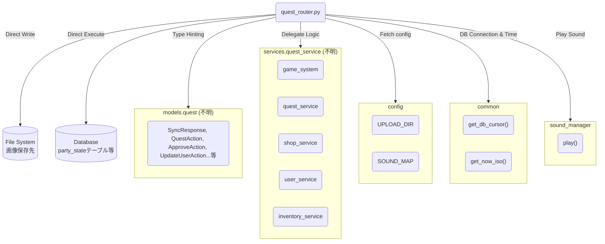

## 1. 解析メタ情報

| 項目 | 内容 |
| --- | --- |
| 対象ファイル | `quest_router.py` |
| 言語 | Python / FastAPI |
| 解析対象 | 提供されたコードのみ |
| 推測・補完 | 一切なし |

## 2. ファイルの概要

* FastAPIを使用したクエスト管理システム（MY_HOME_SYSTEM）のルーティング定義（コントローラー）ファイル。
* ゲームデータ同期、クエストの完了・承認・却下・キャンセル、報酬や装備の購入・変更、画像アップロード、音声テスト、ボスのステータス更新、ファミリーマイレージ管理、インベントリ管理、分析データ取得などの各エンドポイントを提供する。
* ビジネスロジックの大部分を外部サービス（`services.quest_service` など）に委譲しているが、画像アップロードのファイル検証・保存や、管理者権限によるボスのステータス更新（DBへの直接のSQL実行）などは本ファイル内に実装されている。

## 3. 外部依存関係

### インポート一覧

| 名称 | 種類 | 用途 | 根拠 |
| --- | --- | --- | --- |
| `fastapi.APIRouter` | クラス | ルーターの作成 | インポート (行番号: 2 / 抜粋: "from fastapi import APIRouter") |
| `fastapi.HTTPException` | クラス | HTTPエラーレスポンスの生成 | インポート (行番号: 2 / 抜粋: "from fastapi import ...") |
| `fastapi.File` | 関数 | ファイルアップロードの受信 | インポート (行番号: 2 / 抜粋: "from fastapi import ... File") |
| `fastapi.UploadFile` | 型/クラス | アップロードファイルの型定義 | インポート (行番号: 2 / 抜粋: "from fastapi import ...") |
| `typing.Dict` | 型 | 型アノテーション（辞書） | インポート (行番号: 3 / 抜粋: "from typing import Dict") |
| `typing.Any` | 型 | 型アノテーション（任意） | インポート (行番号: 3 / 抜粋: "from typing import ... Any") |
| `os` | モジュール | パス操作、拡張子取得 | インポート (行番号: 4 / 抜粋: "import os") |
| `uuid` | モジュール | 画像ファイル名の一意な生成 | インポート (行番号: 5 / 抜粋: "import uuid") |
| `sys` | モジュール | モジュール検索パスの追加 | インポート (行番号: 6 / 抜粋: "import sys") |
| `aiofiles` | モジュール | 非同期でのファイル保存 | インポート (行番号: 7 / 抜粋: "import aiofiles") |
| `common` | モジュール | DBカーソル取得、現在時刻取得 | インポート (行番号: 9 / 抜粋: "import common") |
| `config` | モジュール | アップロード先パス、音声マップ設定 | インポート (行番号: 10 / 抜粋: "import config") |
| `sound_manager` | モジュール | 音声の再生処理 | インポート (行番号: 11 / 抜粋: "import sound_manager") |
| `core.logger.setup_logging` | 関数 | ロガーのセットアップ | インポート (行番号: 12 / 抜粋: "from core.logger import ...") |
| `models.quest.*` | Pydanticモデル | リクエスト/レスポンスの型定義 | インポート (行番号: 15-18 / 抜粋: "from models.quest import (") |
| `services.quest_service.*` | サービスモジュール | 各ビジネスロジックの実行 | インポート (行番号: 20-22 / 抜粋: "from services.quest_service") |

### ブラックボックスとなる外部要素

| 名称 | 理由 | 根拠 |
| --- | --- | --- |
| `models.quest` 内の全モデル | 内部のプロパティ（スキーマ）が不明なため。 | インポート (行番号: 15-18 / 抜粋: "from models.quest import ...") |
| `services.quest_service` 内の各サービス | 内部の実装ロジックや副作用、戻り値の型が不明なため。 | インポート (行番号: 20-22 / 抜粋: "from services.quest_service") |
| `common.get_db_cursor` | DB接続の詳細仕様や、返されるカーソルオブジェクトのメソッド仕様が不明なため。 | メソッド呼び出し (行番号: 139 / 抜粋: "with common.get_db_cursor") |
| `common.get_now_iso` | 返却される日時の形式（タイムゾーンなど）が不明なため。 | メソッド呼び出し (行番号: 159 / 抜粋: "common.get_now_iso()") |
| `config.UPLOAD_DIR` | 保存先ディレクトリの具体的なパスが不明なため。 | 変数参照 (行番号: 113 / 抜粋: "config.UPLOAD_DIR") |
| `config.SOUND_MAP` | 許可されている音声キーのリスト（マップの内容）が不明なため。 | 変数参照 (行番号: 130 / 抜粋: "req.sound_key not in ...") |
| `sound_manager.play` | 音声再生の具体的な手段やエラー発生有無が不明なため。 | メソッド呼び出し (行番号: 133 / 抜粋: "sound_manager.play(") |
| `party_state` テーブル | ボスのステータスを格納しているテーブルの全体スキーマが不明なため。 | SQLクエリ (行番号: 161 / 抜粋: "UPDATE party_state SET ...") |

## 4. 主要要素の定義（関数 / エンドポイント / コンポーネント）

### `sync_master_data`

* **役割**: マスターデータの同期処理を実行するエンドポイント。
* 根拠: ルーティング定義 (行番号: 34-36 / 抜粋: "@router.post("/sync_master")")

* **引数/リクエスト**: なし
* 根拠: 関数定義 (行番号: 35 / 抜粋: "def sync_master_data():")

* **戻り値/レスポンス**: `SyncResponse`（`game_system.sync_master_data()` の戻り値）
* 根拠: レスポンス型指定 (行番号: 34 / 抜粋: "response_model=SyncResponse")

* **副作用**: 不明（外部関数 `game_system.sync_master_data()` に依存）
* 根拠: メソッド呼び出し (行番号: 36 / 抜粋: "game_system.sync_master_data()")

* **エラーハンドリング**: なし
* 根拠: 該当関数 (行番号: 34-36 / 抜粋: "def sync_master_data():")

### `get_all_data`

* **役割**: ビュー描画に必要な全データを取得するエンドポイント。
* 根拠: ルーティング定義 (行番号: 38-44 / 抜粋: "@router.get("/data")")

* **引数/リクエスト**: なし
* 根拠: 関数定義 (行番号: 39 / 抜粋: "def get_all_data() -> Dict")

* **戻り値/レスポンス**: `Dict[str, Any]`（`game_system.get_all_view_data()` の戻り値）
* 根拠: 型アノテーション (行番号: 39 / 抜粋: "-> Dict[str, Any]:")

* **副作用**: 不明（外部関数 `game_system.get_all_view_data()` に依存）
* 根拠: メソッド呼び出し (行番号: 41 / 抜粋: "return game_system.get_all_view")

* **エラーハンドリング**: 内部で発生した例外をキャッチし、ログにエラーを出力後、HTTP 500エラーを送出する。
* 根拠: 例外処理 (行番号: 42-44 / 抜粋: "except Exception as e:")

### `complete_quest`

* **役割**: クエストを完了させるエンドポイント。
* 根拠: ルーティング定義 (行番号: 46-48 / 抜粋: "@router.post("/complete")")

* **引数/リクエスト**: `QuestAction` (フィールドとして `user_id`, `quest_id` を持つ)
* 根拠: 引数定義 (行番号: 47-48 / 抜粋: "action: QuestAction")

* **戻り値/レスポンス**: `CompleteResponse`
* 根拠: レスポンス型指定 (行番号: 46 / 抜粋: "response_model=CompleteResponse")

* **副作用**: 不明（外部関数 `quest_service.process_complete_quest()` に依存）
* 根拠: メソッド呼び出し (行番号: 48 / 抜粋: "return quest_service.process_")

* **エラーハンドリング**: なし
* 根拠: 該当関数 (行番号: 46-48 / 抜粋: "def complete_quest")

### `approve_quest`

* **役割**: 完了したクエストを承認するエンドポイント。
* 根拠: ルーティング定義 (行番号: 50-52 / 抜粋: "@router.post("/approve")")

* **引数/リクエスト**: `ApproveAction` (フィールドとして `approver_id`, `history_id` を持つ)
* 根拠: 引数定義 (行番号: 51-52 / 抜粋: "action: ApproveAction")

* **戻り値/レスポンス**: `CompleteResponse`
* 根拠: レスポンス型指定 (行番号: 50 / 抜粋: "response_model=CompleteResponse")

* **副作用**: 不明（外部関数 `quest_service.process_approve_quest()` に依存）
* 根拠: メソッド呼び出し (行番号: 52 / 抜粋: "return quest_service.process_")

* **エラーハンドリング**: なし
* 根拠: 該当関数 (行番号: 50-52 / 抜粋: "def approve_quest")

### `reject_quest`

* **役割**: 完了したクエストを却下するエンドポイント。
* 根拠: ルーティング定義 (行番号: 54-56 / 抜粋: "@router.post("/reject")")

* **引数/リクエスト**: `ApproveAction` (フィールドとして `approver_id`, `history_id` を持つ)
* 根拠: 引数定義 (行番号: 55-56 / 抜粋: "action: ApproveAction")

* **戻り値/レスポンス**: `CancelResponse`
* 根拠: レスポンス型指定 (行番号: 54 / 抜粋: "response_model=CancelResponse")

* **副作用**: 不明（外部関数 `quest_service.process_reject_quest()` に依存）
* 根拠: メソッド呼び出し (行番号: 56 / 抜粋: "return quest_service.process_")

* **エラーハンドリング**: なし
* 根拠: 該当関数 (行番号: 54-56 / 抜粋: "def reject_quest")

### `cancel_quest`

* **役割**: クエスト履歴をキャンセルするエンドポイント。
* 根拠: ルーティング定義 (行番号: 58-60 / 抜粋: "@router.post("/quest/cancel")")

* **引数/リクエスト**: `HistoryAction` (フィールドとして `user_id`, `history_id` を持つ)
* 根拠: 引数定義 (行番号: 59-60 / 抜粋: "action: HistoryAction")

* **戻り値/レスポンス**: `CancelResponse`
* 根拠: レスポンス型指定 (行番号: 58 / 抜粋: "response_model=CancelResponse")

* **副作用**: 不明（外部関数 `quest_service.process_cancel_quest()` に依存）
* 根拠: メソッド呼び出し (行番号: 60 / 抜粋: "return quest_service.process_")

* **エラーハンドリング**: なし
* 根拠: 該当関数 (行番号: 58-60 / 抜粋: "def cancel_quest")

### `purchase_reward`

* **役割**: 報酬を購入するエンドポイント。
* 根拠: ルーティング定義 (行番号: 62-64 / 抜粋: "@router.post("/reward/purchase")")

* **引数/リクエスト**: `RewardAction` (フィールドとして `user_id`, `reward_id` を持つ)
* 根拠: 引数定義 (行番号: 63-64 / 抜粋: "action: RewardAction")

* **戻り値/レスポンス**: `PurchaseResponse`
* 根拠: レスポンス型指定 (行番号: 62 / 抜粋: "response_model=PurchaseResponse")

* **副作用**: 不明（外部関数 `shop_service.process_purchase_reward()` に依存）
* 根拠: メソッド呼び出し (行番号: 64 / 抜粋: "return shop_service.process_")

* **エラーハンドリング**: なし
* 根拠: 該当関数 (行番号: 62-64 / 抜粋: "def purchase_reward")

### `purchase_equipment`

* **役割**: 装備品を購入するエンドポイント。
* 根拠: ルーティング定義 (行番号: 66-68 / 抜粋: "@router.post("/equip/purchase")")

* **引数/リクエスト**: `EquipAction` (フィールドとして `user_id`, `equipment_id` を持つ)
* 根拠: 引数定義 (行番号: 67-68 / 抜粋: "action: EquipAction")

* **戻り値/レスポンス**: `PurchaseResponse`
* 根拠: レスポンス型指定 (行番号: 66 / 抜粋: "response_model=PurchaseResponse")

* **副作用**: 不明（外部関数 `shop_service.process_purchase_equipment()` に依存）
* 根拠: メソッド呼び出し (行番号: 68 / 抜粋: "return shop_service.process_")

* **エラーハンドリング**: なし
* 根拠: 該当関数 (行番号: 66-68 / 抜粋: "def purchase_equipment")

### `change_equipment`

* **役割**: 装備品を変更するエンドポイント。
* 根拠: ルーティング定義 (行番号: 70-72 / 抜粋: "@router.post("/equip/change")")

* **引数/リクエスト**: `EquipAction` (フィールドとして `user_id`, `equipment_id` を持つ)
* 根拠: 引数定義 (行番号: 71-72 / 抜粋: "action: EquipAction")

* **戻り値/レスポンス**: 不明（外部関数の戻り値）
* 根拠: メソッド呼び出し (行番号: 72 / 抜粋: "return shop_service.process_")

* **副作用**: 不明（外部関数 `shop_service.process_change_equipment()` に依存）
* 根拠: メソッド呼び出し (行番号: 72 / 抜粋: "return shop_service.process_")

* **エラーハンドリング**: なし
* 根拠: 該当関数 (行番号: 70-72 / 抜粋: "def change_equipment")

### `get_family_chronicle`

* **役割**: ファミリーのクロニクル（年代記・履歴情報）を取得するエンドポイント。
* 根拠: ルーティング定義 (行番号: 74-76 / 抜粋: "@router.get("/family/chronicle")")

* **引数/リクエスト**: なし
* 根拠: 関数定義 (行番号: 75 / 抜粋: "def get_family_chronicle():")

* **戻り値/レスポンス**: 不明（外部関数の戻り値）
* 根拠: メソッド呼び出し (行番号: 76 / 抜粋: "return user_service.get_family_")

* **副作用**: 不明（外部関数 `user_service.get_family_chronicle()` に依存）
* 根拠: メソッド呼び出し (行番号: 76 / 抜粋: "return user_service.get_family_")

* **エラーハンドリング**: なし
* 根拠: 該当関数 (行番号: 74-76 / 抜粋: "def get_family_chronicle():")

### `seed_data`

* **役割**: `sync_master_data` のエイリアス。マスターデータを同期する内部関数。
* 根拠: 関数定義 (行番号: 78-80 / 抜粋: "def seed_data():")

* **引数/リクエスト**: なし
* 根拠: 関数定義 (行番号: 79 / 抜粋: "def seed_data():")

* **戻り値/レスポンス**: 不明（`game_system.sync_master_data()` の戻り値）
* 根拠: メソッド呼び出し (行番号: 80 / 抜粋: "return game_system.sync_master")

* **副作用**: 不明（外部関数に依存）
* 根拠: メソッド呼び出し (行番号: 80 / 抜粋: "game_system.sync_master_data()")

* **エラーハンドリング**: なし
* 根拠: 該当関数 (行番号: 78-80 / 抜粋: "def seed_data():")

### `seed_data_endpoint`

* **役割**: データをシードする（マスターデータを同期する）エンドポイント。
* 根拠: ルーティング定義 (行番号: 82-84 / 抜粋: "@router.post("/seed")")

* **引数/リクエスト**: なし
* 根拠: 関数定義 (行番号: 83 / 抜粋: "def seed_data_endpoint():")

* **戻り値/レスポンス**: `SyncResponse`
* 根拠: レスポンス型指定 (行番号: 82 / 抜粋: "response_model=SyncResponse")

* **副作用**: 不明（外部関数 `game_system.sync_master_data()` に依存）
* 根拠: メソッド呼び出し (行番号: 84 / 抜粋: "return game_system.sync_master")

* **エラーハンドリング**: なし
* 根拠: 該当関数 (行番号: 82-84 / 抜粋: "def seed_data_endpoint():")

### `update_user_avatar`

* **役割**: ユーザーのアバター情報を更新するエンドポイント。
* 根拠: ルーティング定義 (行番号: 86-88 / 抜粋: "@router.post("/user/update")")

* **引数/リクエスト**: `UpdateUserAction` (フィールドとして `user_id`, `avatar_url` を持つ)
* 根拠: 引数定義 (行番号: 87-88 / 抜粋: "action: UpdateUserAction")

* **戻り値/レスポンス**: 不明（外部関数の戻り値）
* 根拠: メソッド呼び出し (行番号: 88 / 抜粋: "return user_service.update_avatar")

* **副作用**: 不明（外部関数 `user_service.update_avatar()` に依存）
* 根拠: メソッド呼び出し (行番号: 88 / 抜粋: "return user_service.update_avatar")

* **エラーハンドリング**: なし
* 根拠: 該当関数 (行番号: 86-88 / 抜粋: "def update_user_avatar")

### `validate_image_header`

* **役割**: ファイルのヘッダー情報（マジックナンバー）から画像ファイルかどうかを判定するヘルパー関数。JPEG、PNG、GIF、WEBPを許可する。
* 根拠: 関数定義と条件分岐 (行番号: 90-96 / 抜粋: "if header.startswith(b'\xff...")

* **引数/リクエスト**: `header` (`bytes` 型)
* 根拠: 引数定義 (行番号: 91 / 抜粋: "def validate_image_header(header: bytes)")

* **戻り値/レスポンス**: `bool` (画像フォーマットに一致すれば `True`、それ以外は `False`)
* 根拠: 型アノテーション (行番号: 91 / 抜粋: "-> bool:")

* **副作用**: なし
* 根拠: 関数定義 (行番号: 90-96 / 抜粋: "def validate_image_header")

* **エラーハンドリング**: なし
* 根拠: 該当関数 (行番号: 90-96 / 抜粋: "def validate_image_header")

### `upload_image`

* **役割**: 画像ファイルをサーバーにアップロードし、保存するエンドポイント。拡張子チェックとマジックナンバー検証を行う。
* 根拠: ルーティング定義 (行番号: 98-126 / 抜粋: "@router.post("/upload")")

* **引数/リクエスト**: `file` (`UploadFile` 型、FastAPIの `File(...)` によりフォームデータとして受信)
* 根拠: 引数定義 (行番号: 99 / 抜粋: "file: UploadFile = File(...)")

* **戻り値/レスポンス**: アップロードされた画像のURL（`{"url": "/uploads/<新しいファイル名>"}`）
* 根拠: 戻り値 (行番号: 120 / 抜粋: "return {"url": f"/uploads/...")

* **副作用**:
* `config.UPLOAD_DIR` に指定されたディレクトリへのファイル書き込み（非同期ストリームチャンク書き込み）。
* ロガーへの情報・警告・エラーログの書き込み。
* 根拠: ファイル操作 (行番号: 115-117 / 抜粋: "async with aiofiles.open(file_path, "wb")")

* **エラーハンドリング**:
* 拡張子が許可リスト外の場合、HTTP 400エラー送出。
* ヘッダー検証（`validate_image_header`）に失敗した場合、HTTP 400エラー送出。
* ファイル保存中の予期せぬ例外はキャッチし、HTTP 500エラー送出。
* 根拠: 例外処理 (行番号: 104, 109, 122-126 / 抜粋: "raise HTTPException(status_code=400...")

### `test_sound`

* **役割**: 指定されたキーに基づく音声再生テストを行うエンドポイント。
* 根拠: ルーティング定義 (行番号: 128-134 / 抜粋: "@router.post("/test_sound")")

* **引数/リクエスト**: `SoundTestRequest` (フィールドとして `sound_key` を持つ)
* 根拠: 引数定義 (行番号: 129-130 / 抜粋: "req: SoundTestRequest")

* **戻り値/レスポンス**: 再生ステータスと再生キー（`{"status": "playing", "key": <指定キー>}`）
* 根拠: 戻り値 (行番号: 134 / 抜粋: "return {"status": "playing"...")

* **副作用**: 外部関数 `sound_manager.play()` による音声の再生。
* 根拠: メソッド呼び出し (行番号: 133 / 抜粋: "sound_manager.play(req.sound_")

* **エラーハンドリング**: `req.sound_key` が `config.SOUND_MAP` に存在しない場合、HTTP 400エラーを送出。
* 根拠: 例外処理 (行番号: 130-131 / 抜粋: "raise HTTPException(status_code=400")

### `admin_update_boss`

* **役割**: 管理画面からボスのステータス（最大HP、現在HP、討伐状態）をデータベースへ直接変更するエンドポイント。
* 根拠: ルーティング定義 (行番号: 136-166 / 抜粋: "@router.post("/admin/boss/update")")

* **引数/リクエスト**: `AdminBossUpdate` (フィールドとして `max_hp`, `current_hp`, `is_defeated` を持つ。いずれもオプショナル)
* 根拠: 引数定義 (行番号: 137 / 抜粋: "action: AdminBossUpdate")

* **戻り値/レスポンス**: 更新が行われた場合は `{"status": "updated"}`、変更項目がない場合は `{"status": "no_change"}`
* 根拠: 戻り値 (行番号: 156, 166 / 抜粋: "return {"status": "updated"}")

* **副作用**:
* `party_state` テーブルの `id = 1` のレコードに対して、指定された項目のみ動的に `UPDATE` 文を生成しSQLを実行・コミットする。
* `updated_at` に現在時刻（`common.get_now_iso()`）を記録する。
* ロガーへの情報ログ書き込み。
* 根拠: SQL実行 (行番号: 161-162 / 抜粋: "cur.execute(sql, tuple(params))")

* **エラーハンドリング**: なし
* 根拠: 該当関数 (行番号: 136-166 / 抜粋: "def admin_update_boss")

### `get_family_mileage`

* **役割**: ファミリーマイレージを取得するエンドポイント。
* 根拠: ルーティング定義 (行番号: 168-170 / 抜粋: "@router.get("/family-mileage")")

* **引数/リクエスト**: なし
* 根拠: 関数定義 (行番号: 169 / 抜粋: "def get_family_mileage():")

* **戻り値/レスポンス**: 不明（外部関数の戻り値）
* 根拠: メソッド呼び出し (行番号: 170 / 抜粋: "return quest_service.get_family")

* **副作用**: 不明（外部関数 `quest_service.get_family_mileage()` に依存）
* 根拠: メソッド呼び出し (行番号: 170 / 抜粋: "return quest_service.get_family")

* **エラーハンドリング**: なし
* 根拠: 該当関数 (行番号: 168-170 / 抜粋: "def get_family_mileage():")

### `update_family_mileage`

* **役割**: ファミリーマイレージを更新するエンドポイント。
* 根拠: ルーティング定義 (行番号: 172-174 / 抜粋: "@router.put("/family-mileage")")

* **引数/リクエスト**: `FamilyMileageUpdate` (フィールドとして `target_name`, `target_exp` を持つ)
* 根拠: 引数定義 (行番号: 173-174 / 抜粋: "action: FamilyMileageUpdate")

* **戻り値/レスポンス**: 不明（外部関数の戻り値）
* 根拠: メソッド呼び出し (行番号: 174 / 抜粋: "return quest_service.update_")

* **副作用**: 不明（外部関数 `quest_service.update_family_mileage()` に依存）
* 根拠: メソッド呼び出し (行番号: 174 / 抜粋: "return quest_service.update_")

* **エラーハンドリング**: なし
* 根拠: 該当関数 (行番号: 172-174 / 抜粋: "def update_family_mileage")

### `get_inventory`

* **役割**: 特定ユーザーのインベントリ（所持品）情報を取得するエンドポイント。
* 根拠: ルーティング定義 (行番号: 176-178 / 抜粋: "@router.get("/inventory/{user_id}")")

* **引数/リクエスト**: `user_id` (`str` 型, パスパラメータ)
* 根拠: 引数定義 (行番号: 177-178 / 抜粋: "def get_inventory(user_id: str):")

* **戻り値/レスポンス**: 不明（外部関数の戻り値）
* 根拠: メソッド呼び出し (行番号: 178 / 抜粋: "return inventory_service.get_user")

* **副作用**: 不明（外部関数 `inventory_service.get_user_inventory()` に依存）
* 根拠: メソッド呼び出し (行番号: 178 / 抜粋: "return inventory_service.get_user")

* **エラーハンドリング**: なし
* 根拠: 該当関数 (行番号: 176-178 / 抜粋: "def get_inventory")

### `use_item`

* **役割**: アイテムを使用するエンドポイント。
* 根拠: ルーティング定義 (行番号: 180-182 / 抜粋: "@router.post("/inventory/use")")

* **引数/リクエスト**: `UseItemAction` (フィールドとして `user_id`, `inventory_id` を持つ)
* 根拠: 引数定義 (行番号: 181-182 / 抜粋: "action: UseItemAction")

* **戻り値/レスポンス**: `UseItemResponse`
* 根拠: レスポンス型指定 (行番号: 180 / 抜粋: "response_model=UseItemResponse")

* **副作用**: 不明（外部関数 `inventory_service.use_item()` に依存）
* 根拠: メソッド呼び出し (行番号: 182 / 抜粋: "return inventory_service.use_item")

* **エラーハンドリング**: なし
* 根拠: 該当関数 (行番号: 180-182 / 抜粋: "def use_item")

### `consume_item`

* **役割**: アイテムを消費（承認者が処理）するエンドポイント。
* 根拠: ルーティング定義 (行番号: 184-186 / 抜粋: "@router.post("/inventory/consume")")

* **引数/リクエスト**: `ConsumeItemAction` (フィールドとして `approver_id`, `inventory_id` を持つ)
* 根拠: 引数定義 (行番号: 185-186 / 抜粋: "action: ConsumeItemAction")

* **戻り値/レスポンス**: 不明（外部関数の戻り値）
* 根拠: メソッド呼び出し (行番号: 186 / 抜粋: "return inventory_service.consume_")

* **副作用**: 不明（外部関数 `inventory_service.consume_item()` に依存）
* 根拠: メソッド呼び出し (行番号: 186 / 抜粋: "return inventory_service.consume_")

* **エラーハンドリング**: なし
* 根拠: 該当関数 (行番号: 184-186 / 抜粋: "def consume_item")

### `cancel_item_usage`

* **役割**: アイテムの使用をキャンセルするエンドポイント。
* 根拠: ルーティング定義 (行番号: 188-190 / 抜粋: "@router.post("/inventory/cancel")")

* **引数/リクエスト**: `UseItemAction` (フィールドとして `user_id`, `inventory_id` を持つ)
* 根拠: 引数定義 (行番号: 189-190 / 抜粋: "action: UseItemAction")

* **戻り値/レスポンス**: 不明（外部関数の戻り値）
* 根拠: メソッド呼び出し (行番号: 190 / 抜粋: "return inventory_service.cancel_")

* **副作用**: 不明（外部関数 `inventory_service.cancel_usage()` に依存）
* 根拠: メソッド呼び出し (行番号: 190 / 抜粋: "return inventory_service.cancel_")

* **エラーハンドリング**: なし
* 根拠: 該当関数 (行番号: 188-190 / 抜粋: "def cancel_item_usage")

### `get_admin_pending_inventory`

* **役割**: 管理者向けに、承認待ちのインベントリアイテム一覧を取得するエンドポイント。
* 根拠: ルーティング定義 (行番号: 192-194 / 抜粋: "@router.get("/inventory/admin/pending")")

* **引数/リクエスト**: なし
* 根拠: 関数定義 (行番号: 193 / 抜粋: "def get_admin_pending_inventory():")

* **戻り値/レスポンス**: 不明（外部関数の戻り値）
* 根拠: メソッド呼び出し (行番号: 194 / 抜粋: "return inventory_service.get_")

* **副作用**: 不明（外部関数 `inventory_service.get_pending_items()` に依存）
* 根拠: メソッド呼び出し (行番号: 194 / 抜粋: "return inventory_service.get_")

* **エラーハンドリング**: なし
* 根拠: 該当関数 (行番号: 192-194 / 抜粋: "def get_admin_pending_inventory():")

### `get_weekly_analytics`

* **役割**: 週間分析データを取得するエンドポイント。
* 根拠: ルーティング定義 (行番号: 196-198 / 抜粋: "@router.get("/analytics/weekly")")

* **引数/リクエスト**: なし
* 根拠: 関数定義 (行番号: 197 / 抜粋: "def get_weekly_analytics():")

* **戻り値/レスポンス**: 不明（外部関数の戻り値）
* 根拠: メソッド呼び出し (行番号: 198 / 抜粋: "return quest_service.get_weekly")

* **副作用**: 不明（外部関数 `quest_service.get_weekly_analytics()` に依存）
* 根拠: メソッド呼び出し (行番号: 198 / 抜粋: "return quest_service.get_weekly")

* **エラーハンドリング**: なし
* 根拠: 該当関数 (行番号: 196-198 / 抜粋: "def get_weekly_analytics():")

---

## 5. 処理フロー図

※ファイル内に実装されている複雑なロジックである `upload_image` および `admin_update_boss` のフローチャートを作成。

```mermaid
flowchart TD
    %% upload_image flow
    subgraph upload_image [POST /upload の処理フロー]
        A(Start) --> B{"ファイル拡張子<br>は許可リスト内か?"}
        B -- Yes --> C(ファイル先頭12バイトを読み込み)
        B -- No --> E("HTTP 400エラー(拡張子)")
        C --> D{"外部: validate_image_header<br>の判定結果"}
        D -- True --> F(シーク位置を0に戻す)
        D -- False --> G("HTTP 400エラー(画像として認識不可)")
        F --> H("UUIDで新しいファイル名を生成")
        H --> I("保存先パス(config.UPLOAD_DIR)を作成")
        I --> J("チャンク(1MB)単位で<br>非同期書き込み")
        J --> K(ロガーに書き込み)
        K --> L(画像のURLを返却)
        L --> M(End: upload_image)
        E --> M
        G --> M
    end

    %% admin_update_boss flow
    subgraph admin_update_boss [POST /admin/boss/update の処理フロー]
        S(Start) --> T(外部: DBカーソル取得<br>common.get_db_cursor)
        T --> U{"max_hpが存在するか?"}
        U -- Yes --> V(UPDATE句とパラメータに追加)
        U -- No --> W{"current_hpが存在するか?"}
        V --> W
        W -- Yes --> X(UPDATE句とパラメータに追加)
        W -- No --> Y{"is_defeatedが存在するか?"}
        X --> Y
        Y -- Yes --> Z(UPDATE句とパラメータに追加)
        Y -- No --> AA{"更新項目が1つ以上あるか?"}
        Z --> AA
        AA -- No --> AB("返却: status: no_change")
        AA -- Yes --> AC(外部: common.get_now_iso<br>をupdated_atに追加)
        AC --> AD("UPDATE party_state ...<br>クエリを実行")
        AD --> AE(ロガーに書き込み)
        AE --> AF("返却: status: updated")
        AB --> AG(End: admin_update_boss)
        AF --> AG
    end

```

## 6. 依存関係図

## 7. 次のステップ（リバースエンジニアリングの提案）

| 優先度 | ファイル名(推測可) | 理由 | 根拠 |
| --- | --- | --- | --- |
| 高 | `services/quest_service.py` | ルーターの各エンドポイントの大部分がこのファイル内のサービス（`game_system`, `quest_service` など）に処理を委譲しており、実際のビジネスロジックや副作用、DBへの書き込み処理を特定するために必須であるため。 | インポート (行番号: 20-22) および各メソッドの呼び出し |
| 高 | `models/quest.py` | エンドポイントの引数と戻り値の型定義（Pydanticモデル）が含まれており、APIが要求するペイロード構造と返却するレスポンス構造を明確にするために必要なため。 | インポート (行番号: 15-18) |
| 中 | `common.py` | `admin_update_boss` で直接SQLを実行する際に使用するDB接続関数（`get_db_cursor`）のトランザクション管理や仕様を把握するため。 | インポート (行番号: 9) および利用 (行番号: 139) |
| 中 | `config.py` | 画像の保存先パス（`UPLOAD_DIR`）や、テスト可能な音声キー（`SOUND_MAP`）の具体的な内容を確認するため。 | インポート (行番号: 10) および利用 (行番号: 113, 130) |

## 8. 保守上の注意点

* `get_all_data` において広範な `Exception` でエラーをキャッチしており、捕捉した例外をそのままHTTP 500エラーとして送出している。
* `upload_image` において、`File(...)` を使用してメモリと一時ファイル間でストリーミング書き込み（`1024 * 1024` バイトのチャンクサイズ）を行っている。
* `admin_update_boss` において、文字列結合を用いてSQL文を動的に生成している（プレースホルダは使用されている）。
* `admin_update_boss` において、ORマッパーなどを介さず直接 `UPDATE party_state SET ... WHERE id = 1` を実行している。

## 9. 不明事項一覧

| 項目 | 理由 | 必要なファイル |
| --- | --- | --- |
| APIリクエスト/レスポンスのスキーマ | `QuestAction` や `SyncResponse` などのプロパティ構造がファイル内に定義されていないため。 | `models/quest.py` |
| ビジネスロジックの詳細 | 各エンドポイントにおけるDB操作や外部連携などの実際の処理が別モジュールに委譲されているため。 | `services/quest_service.py` および内部で利用されているモジュール |
| 画像アップロード先のパス | 保存先ディレクトリが変数で指定されているため。 | `config.py` |
| 許可されている音声キー一覧 | サウンドマップが別ファイルで定義されているため。 | `config.py` |
| 音声再生処理の挙動 | 再生時のエラー有無や非同期・同期の挙動が不明なため。 | `sound_manager.py` |
| `party_state` テーブルの構造 | ボス状態を管理するテーブルの全体像が不明なため。 | DBスキーマ定義ファイル または `common.py` |

## 10. 自己検証結果

* [x] 推測・外部ファイルの仕様を一切含んでいない
* [x] 全関数・全クラス・全コンポーネントを列挙した
* [x] 全てのインポート要素を列挙した
* [x] すべての仕様説明に「根拠（行番号・抜粋）」を明記した
* [x] 根拠漏れが0件である
* [x] Mermaid構文にエラーの原因となる記号（エスケープ漏れ）がない
* [x] 不明事項を漏れなく列挙した

完了