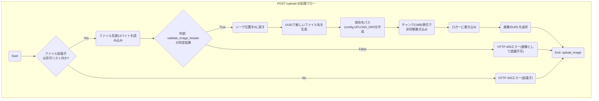
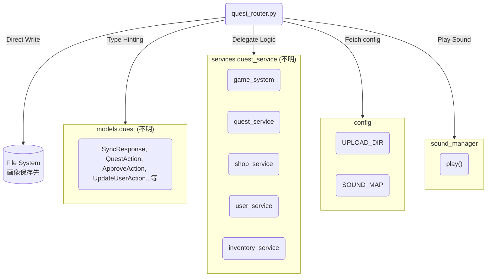

## 1. 解析メタ情報

| 項目 | 内容 |
| --- | --- |
| 対象ファイル | `quest_router.py` |
| 言語 | Python / FastAPI |
| 解析対象 | 提供されたコードのみ |
| 推測・補完 | 一切なし |

## 関連ドキュメント

* [quest.md](./quest.md) - 本ファイルが使用するRequest/Responseモデル(`SyncResponse`, `CompleteResponse`, `QuestAction`等)の定義
* [quest_service.md](./quest_service.md) - `game_system`, `quest_service`, `shop_service`, `user_service`, `inventory_service`の実装本体
* [config.md](./config.md) - `UPLOAD_DIR`, `SOUND_MAP`等の設定値を提供
* [sound_manager.md](./sound_manager.md) - `sound_manager.play()`の実体(`sound_manager.md`側にも本ファイルが呼び出し元として記載済み)
* [unified_server.md](./unified_server.md) - 本ルーターを`/api/quest`プレフィックスで`include_router`する呼び出し元

## 2. ファイルの概要

* FastAPIを使用したクエスト管理システム（MY_HOME_SYSTEM）のルーティング定義（コントローラー）ファイル。
* ゲームデータ同期、クエストの完了・承認・却下・キャンセル、報酬の購入、画像アップロード、音声テスト、インベントリ管理などの各エンドポイントを提供する。
* ビジネスロジックの大部分を外部サービス（`services.quest_service` など）に委譲しているが、画像アップロードのファイル検証・保存などは本ファイル内に実装されている。
* 装備品の購入・変更、ボスのステータス直接更新（DBへのSQL実行）、ファミリーマイレージの取得・更新、週間分析データ取得の各エンドポイントは、ボス戦闘・装備・ファミリーマイレージ・週間ランキング機能の廃止に伴い削除されている。これに伴い、本ファイルが直接DBアクセスを行う`common`モジュールへの依存も無くなっている。

## 3. 外部依存関係

### インポート一覧

| 名称 | 種類 | 用途 | 根拠 |
| --- | --- | --- | --- |
| `fastapi.APIRouter` | クラス | ルーターの作成 | インポート (行番号: 2 / 抜粋: "from fastapi import APIRouter") |
| `fastapi.HTTPException` | クラス | HTTPエラーレスポンスの生成 | インポート (行番号: 2 / 抜粋: "from fastapi import ...") |
| `fastapi.File` | 関数 | ファイルアップロードの受信 | インポート (行番号: 2 / 抜粋: "from fastapi import ... File") |
| `fastapi.UploadFile` | 型/クラス | アップロードファイルの型定義 | インポート (行番号: 2 / 抜粋: "from fastapi import ...") |
| `typing.Dict` | 型 | 型アノテーション（辞書） | インポート (行番号: 3 / 抜粋: "from typing import Dict") |
| `typing.Any` | 型 | 型アノテーション（任意） | インポート (行番号: 3 / 抜粋: "from typing import ... Any") |
| `os` | モジュール | パス操作、拡張子取得 | インポート (行番号: 4 / 抜粋: "import os") |
| `uuid` | モジュール | 画像ファイル名の一意な生成 | インポート (行番号: 5 / 抜粋: "import uuid") |
| `sys` | モジュール | モジュール検索パスの追加 | インポート (行番号: 6 / 抜粋: "import sys") |
| `aiofiles` | モジュール | 非同期でのファイル保存 | インポート (行番号: 7 / 抜粋: "import aiofiles") |
| `config` | モジュール | アップロード先パス、音声マップ設定 | インポート (行番号: 9 / 抜粋: "import config") |
| `sound_manager` | モジュール | 音声の再生処理 | インポート (行番号: 10 / 抜粋: "import sound_manager") |
| `core.logger.setup_logging` | 関数 | ロガーのセットアップ | インポート (行番号: 11 / 抜粋: "from core.logger import ...") |
| `models.quest.*` (`SyncResponse`, `CompleteResponse`, `CancelResponse`, `PurchaseResponse`, `UseItemResponse`, `QuestAction`, `ApproveAction`, `HistoryAction`, `RewardAction`, `UpdateUserAction`, `SoundTestRequest`, `UseItemAction`, `ConsumeItemAction`) | Pydanticモデル | リクエスト/レスポンスの型定義 | インポート (行番号: 14-18 / 抜粋: "from models.quest import (") |
| `services.quest_service.*` (`game_system`, `quest_service`, `shop_service`, `user_service`, `inventory_service`) | サービスモジュール | 各ビジネスロジックの実行 | インポート (行番号: 19-21 / 抜粋: "from services.quest_service") |

### ブラックボックスとなる外部要素

| 名称 | 理由 | 根拠 |
| --- | --- | --- |
| `models.quest` 内の全モデル | 内部のプロパティ（スキーマ）が不明なため。 | インポート (行番号: 14-18 / 抜粋: "from models.quest import ...") |
| `services.quest_service` 内の各サービス | 内部の実装ロジックや副作用、戻り値の型が不明なため。 | インポート (行番号: 19-21 / 抜粋: "from services.quest_service") |
| `config.UPLOAD_DIR` | 保存先ディレクトリの具体的なパスが不明なため。 | 変数参照 (行番号: 104 / 抜粋: "config.UPLOAD_DIR") |
| `config.SOUND_MAP` | 許可されている音声キーのリスト（マップの内容）が不明なため。 | 変数参照 (行番号: 121 / 抜粋: "req.sound_key not in ...") |
| `sound_manager.play` | 音声再生の具体的な手段やエラー発生有無が不明なため。 | メソッド呼び出し (行番号: 124 / 抜粋: "sound_manager.play(") |

## 4. 主要要素の定義（関数 / エンドポイント / コンポーネント）

### `sync_master_data`

* **役割**: マスターデータの同期処理を実行するエンドポイント。
* 根拠: ルーティング定義 (行番号: 33-35 / 抜粋: "@router.post("/sync_master")")

* **引数/リクエスト**: なし
* 根拠: 関数定義 (行番号: 34 / 抜粋: "def sync_master_data():")

* **戻り値/レスポンス**: `SyncResponse`（`game_system.sync_master_data()` の戻り値）
* 根拠: レスポンス型指定 (行番号: 33 / 抜粋: "response_model=SyncResponse")

* **副作用**: 不明（外部関数 `game_system.sync_master_data()` に依存）
* 根拠: メソッド呼び出し (行番号: 35 / 抜粋: "game_system.sync_master_data()")

* **エラーハンドリング**: なし
* 根拠: 該当関数 (行番号: 33-35 / 抜粋: "def sync_master_data():")

### `get_all_data`

* **役割**: ビュー描画に必要な全データを取得するエンドポイント。
* 根拠: ルーティング定義 (行番号: 37-43 / 抜粋: "@router.get("/data")")

* **引数/リクエスト**: なし
* 根拠: 関数定義 (行番号: 38 / 抜粋: "def get_all_data() -> Dict")

* **戻り値/レスポンス**: `Dict[str, Any]`（`game_system.get_all_view_data()` の戻り値）
* 根拠: 型アノテーション (行番号: 38 / 抜粋: "-> Dict[str, Any]:")

* **副作用**: 不明（外部関数 `game_system.get_all_view_data()` に依存）
* 根拠: メソッド呼び出し (行番号: 40 / 抜粋: "return game_system.get_all_view")

* **エラーハンドリング**: 内部で発生した例外をキャッチし、ログにエラーを出力後、HTTP 500エラーを送出する。
* 根拠: 例外処理 (行番号: 41-43 / 抜粋: "except Exception as e:")

### `complete_quest`

* **役割**: クエストを完了させるエンドポイント。
* 根拠: ルーティング定義 (行番号: 45-47 / 抜粋: "@router.post("/complete")")

* **引数/リクエスト**: `QuestAction` (フィールドとして `user_id`, `quest_id` を持つ)
* 根拠: 引数定義 (行番号: 46-47 / 抜粋: "action: QuestAction")

* **戻り値/レスポンス**: `CompleteResponse`
* 根拠: レスポンス型指定 (行番号: 45 / 抜粋: "response_model=CompleteResponse")

* **副作用**: 不明（外部関数 `quest_service.process_complete_quest()` に依存）
* 根拠: メソッド呼び出し (行番号: 47 / 抜粋: "return quest_service.process_")

* **エラーハンドリング**: なし
* 根拠: 該当関数 (行番号: 45-47 / 抜粋: "def complete_quest")

### `approve_quest`

* **役割**: 完了したクエストを承認するエンドポイント。
* 根拠: ルーティング定義 (行番号: 49-51 / 抜粋: "@router.post("/approve")")

* **引数/リクエスト**: `ApproveAction` (フィールドとして `approver_id`, `history_id` を持つ)
* 根拠: 引数定義 (行番号: 50-51 / 抜粋: "action: ApproveAction")

* **戻り値/レスポンス**: `CompleteResponse`
* 根拠: レスポンス型指定 (行番号: 49 / 抜粋: "response_model=CompleteResponse")

* **副作用**: 不明（外部関数 `quest_service.process_approve_quest()` に依存）
* 根拠: メソッド呼び出し (行番号: 51 / 抜粋: "return quest_service.process_")

* **エラーハンドリング**: なし
* 根拠: 該当関数 (行番号: 49-51 / 抜粋: "def approve_quest")

### `reject_quest`

* **役割**: 完了したクエストを却下するエンドポイント。
* 根拠: ルーティング定義 (行番号: 53-55 / 抜粋: "@router.post("/reject")")

* **引数/リクエスト**: `ApproveAction` (フィールドとして `approver_id`, `history_id` を持つ)
* 根拠: 引数定義 (行番号: 54-55 / 抜粋: "action: ApproveAction")

* **戻り値/レスポンス**: `CancelResponse`
* 根拠: レスポンス型指定 (行番号: 53 / 抜粋: "response_model=CancelResponse")

* **副作用**: 不明（外部関数 `quest_service.process_reject_quest()` に依存）
* 根拠: メソッド呼び出し (行番号: 55 / 抜粋: "return quest_service.process_")

* **エラーハンドリング**: なし
* 根拠: 該当関数 (行番号: 53-55 / 抜粋: "def reject_quest")

### `cancel_quest`

* **役割**: クエスト履歴をキャンセルするエンドポイント。
* 根拠: ルーティング定義 (行番号: 57-59 / 抜粋: "@router.post("/quest/cancel")")

* **引数/リクエスト**: `HistoryAction` (フィールドとして `user_id`, `history_id` を持つ)
* 根拠: 引数定義 (行番号: 58-59 / 抜粋: "action: HistoryAction")

* **戻り値/レスポンス**: `CancelResponse`
* 根拠: レスポンス型指定 (行番号: 57 / 抜粋: "response_model=CancelResponse")

* **副作用**: 不明（外部関数 `quest_service.process_cancel_quest()` に依存）
* 根拠: メソッド呼び出し (行番号: 59 / 抜粋: "return quest_service.process_")

* **エラーハンドリング**: なし
* 根拠: 該当関数 (行番号: 57-59 / 抜粋: "def cancel_quest")

### `purchase_reward`

* **役割**: 報酬を購入するエンドポイント。
* 根拠: ルーティング定義 (行番号: 61-63 / 抜粋: "@router.post("/reward/purchase")")

* **引数/リクエスト**: `RewardAction` (フィールドとして `user_id`, `reward_id` を持つ)
* 根拠: 引数定義 (行番号: 62-63 / 抜粋: "action: RewardAction")

* **戻り値/レスポンス**: `PurchaseResponse`
* 根拠: レスポンス型指定 (行番号: 61 / 抜粋: "response_model=PurchaseResponse")

* **副作用**: 不明（外部関数 `shop_service.process_purchase_reward()` に依存）
* 根拠: メソッド呼び出し (行番号: 63 / 抜粋: "return shop_service.process_")

* **エラーハンドリング**: なし
* 根拠: 該当関数 (行番号: 61-63 / 抜粋: "def purchase_reward")

### `get_family_chronicle`

* **役割**: ファミリーのクロニクル（年代記・履歴情報）を取得するエンドポイント。
* 根拠: ルーティング定義 (行番号: 65-67 / 抜粋: "@router.get("/family/chronicle")")

* **引数/リクエスト**: なし
* 根拠: 関数定義 (行番号: 66 / 抜粋: "def get_family_chronicle():")

* **戻り値/レスポンス**: 不明（外部関数の戻り値）
* 根拠: メソッド呼び出し (行番号: 67 / 抜粋: "return user_service.get_family_")

* **副作用**: 不明（外部関数 `user_service.get_family_chronicle()` に依存）
* 根拠: メソッド呼び出し (行番号: 67 / 抜粋: "return user_service.get_family_")

* **エラーハンドリング**: なし
* 根拠: 該当関数 (行番号: 65-67 / 抜粋: "def get_family_chronicle():")

### `seed_data`

* **役割**: `sync_master_data` のエイリアス。マスターデータを同期する内部関数。
* 根拠: 関数定義 (行番号: 70-71 / 抜粋: "def seed_data():")

* **引数/リクエスト**: なし
* 根拠: 関数定義 (行番号: 70 / 抜粋: "def seed_data():")

* **戻り値/レスポンス**: 不明（`game_system.sync_master_data()` の戻り値）
* 根拠: メソッド呼び出し (行番号: 71 / 抜粋: "return game_system.sync_master")

* **副作用**: 不明（外部関数に依存）
* 根拠: メソッド呼び出し (行番号: 71 / 抜粋: "game_system.sync_master_data()")

* **エラーハンドリング**: なし
* 根拠: 該当関数 (行番号: 70-71 / 抜粋: "def seed_data():")

### `seed_data_endpoint`

* **役割**: データをシードする（マスターデータを同期する）エンドポイント。
* 根拠: ルーティング定義 (行番号: 73-75 / 抜粋: "@router.post("/seed")")

* **引数/リクエスト**: なし
* 根拠: 関数定義 (行番号: 74 / 抜粋: "def seed_data_endpoint():")

* **戻り値/レスポンス**: `SyncResponse`
* 根拠: レスポンス型指定 (行番号: 73 / 抜粋: "response_model=SyncResponse")

* **副作用**: 不明（外部関数 `game_system.sync_master_data()` に依存）
* 根拠: メソッド呼び出し (行番号: 75 / 抜粋: "return game_system.sync_master")

* **エラーハンドリング**: なし
* 根拠: 該当関数 (行番号: 73-75 / 抜粋: "def seed_data_endpoint():")

### `update_user_avatar`

* **役割**: ユーザーのアバター情報を更新するエンドポイント。
* 根拠: ルーティング定義 (行番号: 77-79 / 抜粋: "@router.post("/user/update")")

* **引数/リクエスト**: `UpdateUserAction` (フィールドとして `user_id`, `avatar_url` を持つ)
* 根拠: 引数定義 (行番号: 78-79 / 抜粋: "action: UpdateUserAction")

* **戻り値/レスポンス**: 不明（外部関数の戻り値）
* 根拠: メソッド呼び出し (行番号: 79 / 抜粋: "return user_service.update_avatar")

* **副作用**: 不明（外部関数 `user_service.update_avatar()` に依存）
* 根拠: メソッド呼び出し (行番号: 79 / 抜粋: "return user_service.update_avatar")

* **エラーハンドリング**: なし
* 根拠: 該当関数 (行番号: 77-79 / 抜粋: "def update_user_avatar")

### `validate_image_header`

* **役割**: ファイルのヘッダー情報（マジックナンバー）から画像ファイルかどうかを判定するヘルパー関数。JPEG、PNG、GIF、WEBPを許可する。
* 根拠: 関数定義と条件分岐 (行番号: 82-87 / 抜粋: "if header.startswith(b'\xff...")

* **引数/リクエスト**: `header` (`bytes` 型)
* 根拠: 引数定義 (行番号: 82 / 抜粋: "def validate_image_header(header: bytes)")

* **戻り値/レスポンス**: `bool` (画像フォーマットに一致すれば `True`、それ以外は `False`)
* 根拠: 型アノテーション (行番号: 82 / 抜粋: "-> bool:")

* **副作用**: なし
* 根拠: 関数定義 (行番号: 82-87 / 抜粋: "def validate_image_header")

* **エラーハンドリング**: なし
* 根拠: 該当関数 (行番号: 82-87 / 抜粋: "def validate_image_header")

### `upload_image`

* **役割**: 画像ファイルをサーバーにアップロードし、保存するエンドポイント。拡張子チェックとマジックナンバー検証を行う。
* 根拠: ルーティング定義 (行番号: 89-117 / 抜粋: "@router.post("/upload")")

* **引数/リクエスト**: `file` (`UploadFile` 型、FastAPIの `File(...)` によりフォームデータとして受信)
* 根拠: 引数定義 (行番号: 90 / 抜粋: "file: UploadFile = File(...)")

* **戻り値/レスポンス**: アップロードされた画像のURL（`{"url": "/uploads/<新しいファイル名>"}`）
* 根拠: 戻り値 (行番号: 111 / 抜粋: "return {"url": f"/uploads/...")

* **副作用**:
* `config.UPLOAD_DIR` に指定されたディレクトリへのファイル書き込み（非同期ストリームチャンク書き込み）。
* ロガーへの情報・警告・エラーログの書き込み。
* 根拠: ファイル操作 (行番号: 106-108 / 抜粋: "async with aiofiles.open(file_path, "wb")")

* **エラーハンドリング**:
* 拡張子が許可リスト外の場合、HTTP 400エラー送出。
* ヘッダー検証（`validate_image_header`）に失敗した場合、HTTP 400エラー送出。
* ファイル保存中の予期せぬ例外はキャッチし、HTTP 500エラー送出。
* 根拠: 例外処理 (行番号: 95, 100, 113-117 / 抜粋: "raise HTTPException(status_code=400...")

### `test_sound`

* **役割**: 指定されたキーに基づく音声再生テストを行うエンドポイント。
* 根拠: ルーティング定義 (行番号: 119-125 / 抜粋: "@router.post("/test_sound")")

* **引数/リクエスト**: `SoundTestRequest` (フィールドとして `sound_key` を持つ)
* 根拠: 引数定義 (行番号: 120 / 抜粋: "req: SoundTestRequest")

* **戻り値/レスポンス**: 再生ステータスと再生キー（`{"status": "playing", "key": <指定キー>}`）
* 根拠: 戻り値 (行番号: 125 / 抜粋: "return {"status": "playing"...")

* **副作用**: 外部関数 `sound_manager.play()` による音声の再生。
* 根拠: メソッド呼び出し (行番号: 124 / 抜粋: "sound_manager.play(req.sound_")

* **エラーハンドリング**: `req.sound_key` が `config.SOUND_MAP` に存在しない場合、HTTP 400エラーを送出。
* 根拠: 例外処理 (行番号: 121-122 / 抜粋: "raise HTTPException(status_code=400")

### `get_inventory`

* **役割**: 特定ユーザーのインベントリ（所持品）情報を取得するエンドポイント。
* 根拠: ルーティング定義 (行番号: 127-129 / 抜粋: "@router.get("/inventory/{user_id}")")

* **引数/リクエスト**: `user_id` (`str` 型, パスパラメータ)
* 根拠: 引数定義 (行番号: 128 / 抜粋: "def get_inventory(user_id: str):")

* **戻り値/レスポンス**: 不明（外部関数の戻り値）
* 根拠: メソッド呼び出し (行番号: 129 / 抜粋: "return inventory_service.get_user")

* **副作用**: 不明（外部関数 `inventory_service.get_user_inventory()` に依存）
* 根拠: メソッド呼び出し (行番号: 129 / 抜粋: "return inventory_service.get_user")

* **エラーハンドリング**: なし
* 根拠: 該当関数 (行番号: 127-129 / 抜粋: "def get_inventory")

### `use_item`

* **役割**: アイテムを使用するエンドポイント。
* 根拠: ルーティング定義 (行番号: 131-133 / 抜粋: "@router.post("/inventory/use")")

* **引数/リクエスト**: `UseItemAction` (フィールドとして `user_id`, `inventory_id` を持つ)
* 根拠: 引数定義 (行番号: 132-133 / 抜粋: "action: UseItemAction")

* **戻り値/レスポンス**: `UseItemResponse`
* 根拠: レスポンス型指定 (行番号: 131 / 抜粋: "response_model=UseItemResponse")

* **副作用**: 不明（外部関数 `inventory_service.use_item()` に依存）
* 根拠: メソッド呼び出し (行番号: 133 / 抜粋: "return inventory_service.use_item")

* **エラーハンドリング**: なし
* 根拠: 該当関数 (行番号: 131-133 / 抜粋: "def use_item")

### `consume_item`

* **役割**: アイテムを消費（承認者が処理）するエンドポイント。
* 根拠: ルーティング定義 (行番号: 135-137 / 抜粋: "@router.post("/inventory/consume")")

* **引数/リクエスト**: `ConsumeItemAction` (フィールドとして `approver_id`, `inventory_id` を持つ)
* 根拠: 引数定義 (行番号: 136-137 / 抜粋: "action: ConsumeItemAction")

* **戻り値/レスポンス**: 不明（外部関数の戻り値）
* 根拠: メソッド呼び出し (行番号: 137 / 抜粋: "return inventory_service.consume_")

* **副作用**: 不明（外部関数 `inventory_service.consume_item()` に依存）
* 根拠: メソッド呼び出し (行番号: 137 / 抜粋: "return inventory_service.consume_")

* **エラーハンドリング**: なし
* 根拠: 該当関数 (行番号: 135-137 / 抜粋: "def consume_item")

### `cancel_item_usage`

* **役割**: アイテムの使用をキャンセルするエンドポイント。
* 根拠: ルーティング定義 (行番号: 139-141 / 抜粋: "@router.post("/inventory/cancel")")

* **引数/リクエスト**: `UseItemAction` (フィールドとして `user_id`, `inventory_id` を持つ)
* 根拠: 引数定義 (行番号: 140-141 / 抜粋: "action: UseItemAction")

* **戻り値/レスポンス**: 不明（外部関数の戻り値）
* 根拠: メソッド呼び出し (行番号: 141 / 抜粋: "return inventory_service.cancel_")

* **副作用**: 不明（外部関数 `inventory_service.cancel_usage()` に依存）
* 根拠: メソッド呼び出し (行番号: 141 / 抜粋: "return inventory_service.cancel_")

* **エラーハンドリング**: なし
* 根拠: 該当関数 (行番号: 139-141 / 抜粋: "def cancel_item_usage")

### `get_admin_pending_inventory`

* **役割**: 管理者向けに、承認待ちのインベントリアイテム一覧を取得するエンドポイント。
* 根拠: ルーティング定義 (行番号: 143-145 / 抜粋: "@router.get("/inventory/admin/pending")")

* **引数/リクエスト**: なし
* 根拠: 関数定義 (行番号: 144 / 抜粋: "def get_admin_pending_inventory():")

* **戻り値/レスポンス**: 不明（外部関数の戻り値）
* 根拠: メソッド呼び出し (行番号: 145 / 抜粋: "return inventory_service.get_")

* **副作用**: 不明（外部関数 `inventory_service.get_pending_items()` に依存）
* 根拠: メソッド呼び出し (行番号: 145 / 抜粋: "return inventory_service.get_")

* **エラーハンドリング**: なし
* 根拠: 該当関数 (行番号: 143-145 / 抜粋: "def get_admin_pending_inventory():")

---

## 5. 処理フロー図

※ファイル内に実装されている複雑なロジックである `upload_image` のフローチャートを作成。

```mermaid
flowchart TD
    %% upload_image flow
    subgraph upload_image [POST /upload の処理フロー]
        A(Start) --> B{"ファイル拡張子<br>は許可リスト内か?"}
        B -- Yes --> C(ファイル先頭12バイトを読み込み)
        B -- No --> E("HTTP 400エラー(拡張子)")
        C --> D{"外部: validate_image_header<br>の判定結果"}
        D -- True --> F(シーク位置を0に戻す)
        D -- False --> G("HTTP 400エラー(画像として認識不可)")
        F --> H("UUIDで新しいファイル名を生成")
        H --> I("保存先パス(config.UPLOAD_DIR)を作成")
        I --> J("チャンク(1MB)単位で<br>非同期書き込み")
        J --> K(ロガーに書き込み)
        K --> L(画像のURLを返却)
        L --> M(End: upload_image)
        E --> M
        G --> M
    end

```

## 6. 依存関係図

```mermaid
graph TD
    Router("quest_router.py")

    %% Models
    subgraph Models ["models.quest (不明)"]
        M1("SyncResponse, QuestAction, <br>ApproveAction, UpdateUserAction...等")
    end

    %% Services
    subgraph Services ["services.quest_service (不明)"]
        S1("game_system")
        S2("quest_service")
        S3("shop_service")
        S4("user_service")
        S5("inventory_service")
    end

    subgraph Config ["config"]
        CF1("UPLOAD_DIR")
        CF2("SOUND_MAP")
    end

    subgraph Sound ["sound_manager"]
        SM1("play()")
    end

    %% File System
    FS[("File System<br>画像保存先")]

    %% Relations
    Router -->|Type Hinting| Models
    Router -->|Delegate Logic| Services
    Router -->|Fetch config| Config
    Router -->|Play Sound| Sound
    
    Router -->|Direct Write| FS

```

## 7. 次のステップ（リバースエンジニアリングの提案）

| 優先度 | ファイル名(推測可) | 理由 | 根拠 |
| --- | --- | --- | --- |
| 高 | `services/quest_service.py` | ルーターの各エンドポイントの大部分がこのファイル内のサービス（`game_system`, `quest_service` など）に処理を委譲しており、実際のビジネスロジックや副作用、DBへの書き込み処理を特定するために必須であるため。 | インポート (行番号: 19-21) および各メソッドの呼び出し |
| 高 | `models/quest.py` | エンドポイントの引数と戻り値の型定義（Pydanticモデル）が含まれており、APIが要求するペイロード構造と返却するレスポンス構造を明確にするために必要なため。 | インポート (行番号: 14-18) |
| 中 | `config.py` | 画像の保存先パス（`UPLOAD_DIR`）や、テスト可能な音声キー（`SOUND_MAP`）の具体的な内容を確認するため。 | インポート (行番号: 9) および利用 (行番号: 104, 121) |

## 8. 保守上の注意点

* `get_all_data` において広範な `Exception` でエラーをキャッチしており、捕捉した例外をそのままHTTP 500エラーとして送出している。
* `upload_image` において、`File(...)` を使用してメモリと一時ファイル間でストリーミング書き込み（`1024 * 1024` バイトのチャンクサイズ）を行っている。
* かつて存在した `purchase_equipment` (`POST /equip/purchase`), `change_equipment` (`POST /equip/change`), `admin_update_boss` (`POST /admin/boss/update`), `get_family_mileage` (`GET /family-mileage`), `update_family_mileage` (`PUT /family-mileage`), `get_weekly_analytics` (`GET /analytics/weekly`) の各エンドポイントは、ボス戦闘・装備・ファミリーマイレージ・週間ランキング機能の廃止に伴い削除されている。特に `admin_update_boss` は本ファイル内で `common.get_db_cursor` を用いて `party_state` テーブルへ直接SQLを実行する唯一の箇所だったため、これに伴い `common` モジュールへのインポートも削除されている。

## 9. 不明事項一覧

| 項目 | 理由 | 必要なファイル |
| --- | --- | --- |
| APIリクエスト/レスポンスのスキーマ | `QuestAction` や `SyncResponse` などのプロパティ構造がファイル内に定義されていないため。 | `models/quest.py` |
| ビジネスロジックの詳細 | 各エンドポイントにおけるDB操作や外部連携などの実際の処理が別モジュールに委譲されているため。 | `services/quest_service.py` および内部で利用されているモジュール |
| 画像アップロード先のパス | 保存先ディレクトリが変数で指定されているため。 | `config.py` |
| 許可されている音声キー一覧 | サウンドマップが別ファイルで定義されているため。 | `config.py` |
| 音声再生処理の挙動 | 再生時のエラー有無や非同期・同期の挙動が不明なため。 | `sound_manager.py` |

## 相互参照による補足情報

| 元の不明事項 | 判明した内容 | 参照元ドキュメント |
| --- | --- | --- |
| APIリクエスト/レスポンスのスキーマ | `quest.md`の解析によれば、`QuestAction`(`user_id`, `quest_id`)、`SyncResponse`(`status`, `message`)等、本ファイルがインポートする全モデルのフィールド構成が判明した。 | quest.md |
| ビジネスロジックの詳細 | `quest_service.md`の解析によれば、`quest_service.process_complete_quest`はプロセス内ロックで二重加算を防止し、子供ユーザーの完了報告は`pending`状態で保存(兄妹連携クエストの場合はカスケード処理)、大人ユーザーは即時報酬適用となる設計であることが判明した。 | quest_service.md |
| 画像アップロード先のパス / 許可されている音声キー一覧 | `config.md`の解析によれば、`config.py`はディレクトリ検証・作成を行う`verify_and_initialize_storage`等の関数を持つモジュールであることが判明したが、`UPLOAD_DIR`や`SOUND_MAP`個々の実際の値は`config.md`自体でも確認できていない。 | config.md |
| 音声再生処理の挙動 | `sound_manager.md`の解析によれば、`sound_manager.play`は`subprocess.Popen`による非同期再生を行い、`OSError`/`Exception`発生時もログ出力のみでシステムを停止させないFail-Soft設計であることが判明した。 | sound_manager.md |

## 10. 自己検証結果

* [x] 完了: 推測・外部ファイルの仕様を一切含んでいない
* [x] 完了: 全関数・全クラス・全コンポーネントを列挙した
* [x] 完了: 全てのインポート要素を列挙した
* [x] 完了: すべての仕様説明に「根拠（行番号・抜粋）」を明記した
* [x] 完了: 根拠漏れが0件である
* [x] 完了: Mermaid構文にエラーの原因となる記号（エスケープ漏れ）がない
* [x] 完了: 不明事項を漏れなく列挙した
