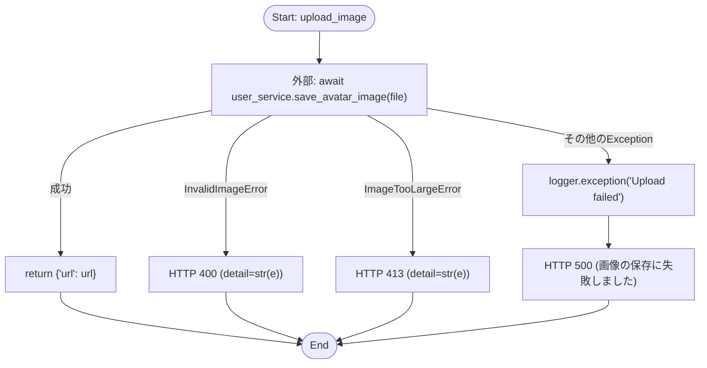
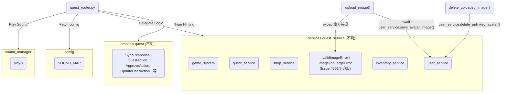

## 1. 解析メタ情報

| 項目 | 内容 |
| --- | --- |
| 対象ファイル | `quest_router.py` |
| 言語 | Python / FastAPI |
| 解析対象 | 提供されたコードのみ |
| 推測・補完 | 一切なし |

## 関連ドキュメント

* [quest.md](./quest.md) - 本ファイルが使用するRequest/Responseモデル(`SyncResponse`, `CompleteResponse`, `QuestAction`等)の定義
* [quest_service.md](./quest_service.md) - 本ファイルが`from services.quest_service import (...)`でimportする`game_system`, `quest_service`, `shop_service`, `user_service`, `inventory_service`および例外クラス`ImageTooLargeError`/`InvalidImageError`を再エクスポートする互換シム
* [quest_user_service.md](./quest_user_service.md) - **（Issue #551で追加）** `upload_image`から移設された画像保存の実処理`UserService.save_avatar_image`と、本ファイルが捕捉する2つの例外クラス`InvalidImageError`/`ImageTooLargeError`の実体
* [config.md](./config.md) - `SOUND_MAP`等の設定値を提供
* [sound_manager.md](./sound_manager.md) - `sound_manager.play()`の実体(`sound_manager.md`側にも本ファイルが呼び出し元として記載済み)
* [unified_server.md](./unified_server.md) - 本ルーターを`/api/quest`プレフィックスで`include_router`する呼び出し元

## 2. ファイルの概要

* FastAPIを使用したクエスト管理システム（MY_HOME_SYSTEM）のルーティング定義（コントローラー）ファイル。
* ゲームデータ同期、クエストの完了・承認・却下・キャンセル、報酬の購入、画像アップロード、音声テスト、インベントリ管理などの各エンドポイントを提供する。
* **（Issue #551で修正）** ビジネスロジックの大部分を外部サービス（`services.quest_service`など）に委譲する薄いルーターである。以前は画像アップロード(`upload_image`)のファイル検証・保存ロジック（拡張子/マジックバイト検証を行うモジュール関数`validate_image_header`、ストリーミング書き込み、サイズ上限チェックと失敗時のクリーンアップ）が本ファイル内に直接実装されていたが、これらはすべて`services/quest/user_service.py`の`UserService.save_avatar_image`へ移設された。現在の`upload_image`は`await user_service.save_avatar_image(file)`を呼び出し、送出されうる`InvalidImageError`（→HTTP 400）・`ImageTooLargeError`（→HTTP 413）・その他の`Exception`（→HTTP 500）を捕捉してHTTPステータスへ変換するだけの委譲コードになっている。
* 根拠: [関数定義] (行番号: 91-102 / 抜粋: "@router.post(\"/upload\")\nasync def upload_image(file: UploadFile = File(...)):\n    try:\n        url = await user_service.save_avatar_image(file)\n        return {\"url\": url}\n    except InvalidImageError as e:\n        raise HTTPException(status_code=400, detail=str(e))\n    except ImageTooLargeError as e:\n        raise HTTPException(status_code=413, detail=str(e))\n    except Exception:\n        logger.exception(\"Upload failed\")\n        raise HTTPException(status_code=500, detail=\"画像の保存に失敗しました\")")
* `get_all_data`はクエリパラメータ`viewer_user_id`（任意、`Optional[str]`）を受け取り、`game_system.get_all_view_data()`へそのまま透過して渡す。
* 根拠: 関数定義 (行番号: 37 / 抜粋: "def get_all_data(viewer_user_id: Optional[str] = None) -> Dict[str, Any]:"), 引数の透過 (行番号: 39 / 抜粋: "return game_system.get_all_view_data(viewer_user_id)")
* 装備品の購入・変更、ボスのステータス直接更新（DBへのSQL実行）、ファミリーマイレージの取得・更新、週間分析データ取得の各エンドポイントは、ボス戦闘・装備・ファミリーマイレージ・週間ランキング機能の廃止に伴い削除されている。これに伴い、本ファイルが直接DBアクセスを行う`common`モジュールへの依存も無くなっている。
* アイテム使用の承認待ちフローに関連していた`consume_item`(旧`POST /inventory/consume`)、`cancel_item_usage`(旧`POST /inventory/cancel`)、`get_admin_pending_inventory`(旧`GET /inventory/admin/pending`)の各エンドポイントは削除されている（コミット`9d5edec`、アイテム使用時の親承認フロー廃止）。これに伴い、インポートしていた`ConsumeItemAction`モデルも削除されている。現在の`use_item`(`POST /inventory/use`)エンドポイント自体のコードは変更されていない。
* **（Issue #442で追加）** `delete_uploaded_image`(`DELETE /upload/{filename}`)は、フロントエンドのアバターアップロード2段階フロー（1. 画像アップロード→2. ユーザーへの紐付け）の2段階目失敗時に、1段階目でアップロード済みの孤立画像をロールバック削除するためのエンドポイント。`services.quest_service.UserService.delete_unlinked_avatar`に委譲する。

## 3. 外部依存関係

### インポート一覧

| 名称 | 種類 | 用途 | 根拠 |
| --- | --- | --- | --- |
| `fastapi.APIRouter` | クラス | ルーターの作成 | インポート (行番号: 2 / 抜粋: "from fastapi import APIRouter, HTTPException, File, UploadFile") |
| `fastapi.HTTPException` | クラス | HTTPエラーレスポンスの生成 | インポート (行番号: 2) |
| `fastapi.File` | 関数 | ファイルアップロードの受信 | インポート (行番号: 2) |
| `fastapi.UploadFile` | 型/クラス | アップロードファイルの型定義 | インポート (行番号: 2) |
| `typing.Dict` | 型 | 型アノテーション（辞書） | インポート (行番号: 3 / 抜粋: "from typing import Dict, Any, Optional") |
| `typing.Any` | 型 | 型アノテーション（任意） | インポート (行番号: 3) |
| `typing.Optional` | 型 | 型アノテーション（Noneを許容する値。`get_all_data`のクエリパラメータ`viewer_user_id`で使用） | インポート (行番号: 3) |
| `os` | モジュール | **（Issue #551で用途縮小）** `sys.path.append(os.path.abspath(...))`によるプロジェクトルート解決のみに使用。以前はアップロード画像の拡張子取得・パス結合にも使用していたが、その処理は`services/quest/user_service.py`へ移設され、本ファイル内でのファイルパス操作用途は無くなった | インポート (行番号: 4 / 抜粋: "import os")、利用箇所 (行番号: 23 / 抜粋: "sys.path.append(os.path.abspath(os.path.join(os.path.dirname(__file__), '..')))") |
| `sys` | モジュール | モジュール検索パスの追加 | インポート (行番号: 5 / 抜粋: "import sys") |
| `config` | モジュール | 音声マップ設定(`SOUND_MAP`)の取得 | インポート (行番号: 7 / 抜粋: "import config") |
| `core.sound_manager` | モジュール | 音声の再生処理 | インポート (行番号: 8 / 抜粋: "from core import sound_manager") |
| `core.logger.setup_logging` | 関数 | ロガーのセットアップ | インポート (行番号: 9 / 抜粋: "from core.logger import setup_logging") |
| `models.quest.*` (`SyncResponse`, `CompleteResponse`, `CancelResponse`, `PurchaseResponse`, `UseItemResponse`, `QuestAction`, `ApproveAction`, `HistoryAction`, `RewardAction`, `UpdateUserAction`, `SoundTestRequest`, `UseItemAction`) | Pydanticモデル | リクエスト/レスポンスの型定義 | インポート (行番号: 12-16 / 抜粋: "from models.quest import (") |
| `services.quest_service.*` (`game_system`, `quest_service`, `shop_service`, `user_service`, `inventory_service`, `ImageTooLargeError`, `InvalidImageError`) | サービスモジュール/例外クラス | 各ビジネスロジックの実行、および**（Issue #551で追加）** `upload_image`のエラーハンドリングで捕捉する2種のドメイン例外 | インポート (行番号: 17-20 / 抜粋: "from services.quest_service import (\n    game_system, quest_service, shop_service, user_service, inventory_service,\n    ImageTooLargeError, InvalidImageError,\n)") |

### ブラックボックスとなる外部要素

| 名称 | 理由 | 根拠 |
| --- | --- | --- |
| `models.quest` 内の全モデル | 内部のプロパティ（スキーマ）が不明なため。 | インポート (行番号: 12-16 / 抜粋: "from models.quest import ...") |
| `services.quest_service` 内の各サービス | 内部の実装ロジックや副作用、戻り値の型が不明なため。 | インポート (行番号: 17-20 / 抜粋: "from services.quest_service import") |
| `services.quest_service.InvalidImageError` / `ImageTooLargeError` の送出条件 | どちらも例外クラス自体は`services/quest/user_service.py`側で定義されており、本ファイルからはどのような入力条件で送出されるかは不明（`upload_image`はこれらを捕捉してHTTPステータスへ変換するのみ）。詳細は[quest_user_service.md](./quest_user_service.md)参照。 | インポート (行番号: 19 / 抜粋: "ImageTooLargeError, InvalidImageError,") |
| `config.SOUND_MAP` | 許可されている音声キーのリスト（マップの内容）が不明なため。 | 変数参照 (行番号: 107 / 抜粋: "req.sound_key not in config.SOUND_MAP") |
| `sound_manager.play` | 音声再生の具体的な手段やエラー発生有無が不明なため。 | メソッド呼び出し (行番号: 110 / 抜粋: "sound_manager.play(req.sound_key)") |

## 4. 主要要素の定義（関数 / エンドポイント / コンポーネント）

### `sync_master_data`

* **役割**: マスターデータの同期処理を実行するエンドポイント。
* 根拠: ルーティング定義 (行番号: 32-34 / 抜粋: "@router.post("/sync_master")")

* **引数/リクエスト**: なし
* 根拠: 関数定義 (行番号: 33 / 抜粋: "def sync_master_data():")

* **戻り値/レスポンス**: `SyncResponse`（`game_system.sync_master_data()` の戻り値）
* 根拠: レスポンス型指定 (行番号: 32 / 抜粋: "response_model=SyncResponse")

* **副作用**: 不明（外部関数 `game_system.sync_master_data()` に依存）
* 根拠: メソッド呼び出し (行番号: 34 / 抜粋: "game_system.sync_master_data()")

* **エラーハンドリング**: なし
* 根拠: 該当関数 (行番号: 32-34 / 抜粋: "def sync_master_data():")

### `get_all_data`

* **役割**: ビュー描画に必要な全データを取得するエンドポイント。クエリパラメータ`viewer_user_id`（任意）を受け取り、そのまま`game_system.get_all_view_data()`に渡す。
* 根拠: ルーティング定義 (行番号: 36-46 / 抜粋: "@router.get("/data")")
* **（Issue #409 で修正）** `HTTPException` は再送出し、それ以外は `logger.exception` でスタックトレース付きで記録してから 500 を返す。
* 根拠: `except HTTPException: raise` (行番号: 40-42)、`logger.exception("Data Fetch Error")` (行番号: 45)

* **引数/リクエスト**: `viewer_user_id: Optional[str] = None`（クエリパラメータ、省略可能）
* 根拠: 関数定義 (行番号: 37 / 抜粋: "def get_all_data(viewer_user_id: Optional[str] = None) -> Dict")

* **戻り値/レスポンス**: `Dict[str, Any]`（`game_system.get_all_view_data(viewer_user_id)` の戻り値）
* 根拠: 型アノテーション (行番号: 37 / 抜粋: "-> Dict[str, Any]:"), メソッド呼び出し (行番号: 39 / 抜粋: "return game_system.get_all_view_data(viewer_user_id)")

* **副作用**: 不明（外部関数 `game_system.get_all_view_data(viewer_user_id)` に依存。`viewer_user_id`が内部でどう使われるかは本ファイルからは不明）
* 根拠: メソッド呼び出し (行番号: 39 / 抜粋: "return game_system.get_all_view_data(viewer_user_id)")

* **エラーハンドリング**: `HTTPException`はそのまま再送出する。それ以外の`Exception`は`logger.exception`でスタックトレース付きログを出力後、HTTP 500エラーを送出する。
* 根拠: 例外処理 (行番号: 40-46 / 抜粋: "except HTTPException:\n        # #409: 以前は HTTPException まで 500 に潰していた\n        raise\n    except Exception:\n        # #409: logger.error(f\"{e}\") ではスタックトレースが失われ原因調査ができなかった\n        logger.exception(\"Data Fetch Error\")\n        raise HTTPException(status_code=500, detail=\"Failed to fetch data\")")

### `complete_quest`

* **役割**: クエストを完了させるエンドポイント。
* 根拠: ルーティング定義 (行番号: 48-50 / 抜粋: "@router.post("/complete")")

* **引数/リクエスト**: `QuestAction` (フィールドとして `user_id`, `quest_id` を持つ)
* 根拠: 引数定義 (行番号: 49-50 / 抜粋: "action: QuestAction")

* **戻り値/レスポンス**: `CompleteResponse`
* 根拠: レスポンス型指定 (行番号: 48 / 抜粋: "response_model=CompleteResponse")

* **副作用**: 不明（外部関数 `quest_service.process_complete_quest()` に依存）
* 根拠: メソッド呼び出し (行番号: 50 / 抜粋: "return quest_service.process_")

* **エラーハンドリング**: なし
* 根拠: 該当関数 (行番号: 48-50 / 抜粋: "def complete_quest")

### `approve_quest`

* **役割**: 完了したクエストを承認するエンドポイント。
* 根拠: ルーティング定義 (行番号: 52-54 / 抜粋: "@router.post("/approve")")

* **引数/リクエスト**: `ApproveAction` (フィールドとして `approver_id`, `history_id` を持つ)
* 根拠: 引数定義 (行番号: 53-54 / 抜粋: "action: ApproveAction")

* **戻り値/レスポンス**: `CompleteResponse`
* 根拠: レスポンス型指定 (行番号: 52 / 抜粋: "response_model=CompleteResponse")

* **副作用**: 不明（外部関数 `quest_service.process_approve_quest()` に依存）
* 根拠: メソッド呼び出し (行番号: 54 / 抜粋: "return quest_service.process_")

* **エラーハンドリング**: なし
* 根拠: 該当関数 (行番号: 52-54 / 抜粋: "def approve_quest")

### `reject_quest`

* **役割**: 完了したクエストを却下するエンドポイント。
* 根拠: ルーティング定義 (行番号: 56-58 / 抜粋: "@router.post("/reject")")

* **引数/リクエスト**: `ApproveAction` (フィールドとして `approver_id`, `history_id` を持つ)
* 根拠: 引数定義 (行番号: 57-58 / 抜粋: "action: ApproveAction")

* **戻り値/レスポンス**: `CancelResponse`
* 根拠: レスポンス型指定 (行番号: 56 / 抜粋: "response_model=CancelResponse")

* **副作用**: 不明（外部関数 `quest_service.process_reject_quest()` に依存）
* 根拠: メソッド呼び出し (行番号: 58 / 抜粋: "return quest_service.process_")

* **エラーハンドリング**: なし
* 根拠: 該当関数 (行番号: 56-58 / 抜粋: "def reject_quest")

### `cancel_quest`

* **役割**: クエスト履歴をキャンセルするエンドポイント。
* 根拠: ルーティング定義 (行番号: 60-62 / 抜粋: "@router.post("/quest/cancel")")

* **引数/リクエスト**: `HistoryAction` (フィールドとして `user_id`, `history_id` を持つ)
* 根拠: 引数定義 (行番号: 61-62 / 抜粋: "action: HistoryAction")

* **戻り値/レスポンス**: `CancelResponse`
* 根拠: レスポンス型指定 (行番号: 60 / 抜粋: "response_model=CancelResponse")

* **副作用**: 不明（外部関数 `quest_service.process_cancel_quest()` に依存）
* 根拠: メソッド呼び出し (行番号: 62 / 抜粋: "return quest_service.process_")

* **エラーハンドリング**: なし
* 根拠: 該当関数 (行番号: 60-62 / 抜粋: "def cancel_quest")

### `purchase_reward`

* **役割**: 報酬を購入するエンドポイント。
* 根拠: ルーティング定義 (行番号: 64-66 / 抜粋: "@router.post("/reward/purchase")")

* **引数/リクエスト**: `RewardAction` (フィールドとして `user_id`, `reward_id` を持つ)
* 根拠: 引数定義 (行番号: 65-66 / 抜粋: "action: RewardAction")

* **戻り値/レスポンス**: `PurchaseResponse`
* 根拠: レスポンス型指定 (行番号: 64 / 抜粋: "response_model=PurchaseResponse")

* **副作用**: 不明（外部関数 `shop_service.process_purchase_reward()` に依存）
* 根拠: メソッド呼び出し (行番号: 66 / 抜粋: "return shop_service.process_")

* **エラーハンドリング**: なし
* 根拠: 該当関数 (行番号: 64-66 / 抜粋: "def purchase_reward")

### `get_family_chronicle`

* **役割**: ファミリーのクロニクル（年代記・履歴情報）を取得するエンドポイント。
* 根拠: ルーティング定義 (行番号: 68-70 / 抜粋: "@router.get("/family/chronicle")")

* **引数/リクエスト**: なし
* 根拠: 関数定義 (行番号: 69 / 抜粋: "def get_family_chronicle():")

* **戻り値/レスポンス**: 不明（外部関数の戻り値）
* 根拠: メソッド呼び出し (行番号: 70 / 抜粋: "return user_service.get_family_")

* **副作用**: 不明（外部関数 `user_service.get_family_chronicle()` に依存）
* 根拠: メソッド呼び出し (行番号: 70 / 抜粋: "return user_service.get_family_")

* **エラーハンドリング**: なし
* 根拠: 該当関数 (行番号: 68-70 / 抜粋: "def get_family_chronicle():")

### `seed_data`

* **役割**: `sync_master_data` のエイリアス。マスターデータを同期する内部関数。
* 根拠: 関数定義 (行番号: 70-71 / 抜粋: "def seed_data():")

* **引数/リクエスト**: なし
* 根拠: 関数定義 (行番号: 70 / 抜粋: "def seed_data():")

* **戻り値/レスポンス**: 不明（`game_system.sync_master_data()` の戻り値）
* 根拠: メソッド呼び出し (行番号: 71 / 抜粋: "return game_system.sync_master")

* **副作用**: 不明（外部関数に依存）
* 根拠: メソッド呼び出し (行番号: 71 / 抜粋: "game_system.sync_master_data()")

* **エラーハンドリング**: なし
* 根拠: 該当関数 (行番号: 70-71 / 抜粋: "def seed_data():")

### `seed_data_endpoint`

* **役割**: データをシードする（マスターデータを同期する）エンドポイント。
* 根拠: ルーティング定義 (行番号: 72-74 / 抜粋: "@router.post("/seed")")

* **引数/リクエスト**: なし
* 根拠: 関数定義 (行番号: 73 / 抜粋: "def seed_data_endpoint():")

* **戻り値/レスポンス**: `SyncResponse`
* 根拠: レスポンス型指定 (行番号: 72 / 抜粋: "response_model=SyncResponse")

* **副作用**: 不明（外部関数 `game_system.sync_master_data()` に依存）
* 根拠: メソッド呼び出し (行番号: 74 / 抜粋: "return game_system.sync_master")

* **エラーハンドリング**: なし
* 根拠: 該当関数 (行番号: 72-74 / 抜粋: "def seed_data_endpoint():")

### `update_user_avatar`

* **役割**: ユーザーのアバター情報を更新するエンドポイント。
* 根拠: ルーティング定義 (行番号: 76-78 / 抜粋: "@router.post("/user/update")")

* **引数/リクエスト**: `UpdateUserAction` (フィールドとして `user_id`, `avatar_url` を持つ)
* 根拠: 引数定義 (行番号: 77-78 / 抜粋: "action: UpdateUserAction")

* **戻り値/レスポンス**: 不明（外部関数の戻り値）
* 根拠: メソッド呼び出し (行番号: 78 / 抜粋: "return user_service.update_avatar")

* **副作用**: 不明（外部関数 `user_service.update_avatar()` に依存）
* 根拠: メソッド呼び出し (行番号: 78 / 抜粋: "return user_service.update_avatar")

* **エラーハンドリング**: なし
* 根拠: 該当関数 (行番号: 76-78 / 抜粋: "def update_user_avatar")

### `delete_uploaded_image` (`DELETE /upload/{filename}`)（Issue #442で追加）

* **役割**: `AvatarUploader.tsx`側の2段階アップロードフロー（1. 画像アップロード→2. `POST /user/update`でユーザーへ紐付け）のうち2段階目が失敗した際のロールバック用エンドポイント。まだどのユーザーにも紐付けられていない、アップロード直後の孤立画像を削除する。ベストエフォートの後始末であるため、削除できなかった場合（既に存在しない、他ユーザーが参照中等）もエラーにはせず状態を返すのみとする。
* 根拠: [ルーティング定義とコメント] (行番号: 80-89 / 抜粋: "# #442: AvatarUploader.tsxの2段階アップロード(画像アップロード→ユーザーへの紐付け)の\n# うち2段階目が失敗した際、1段階目でアップロード済みの画像をロールバック削除するための\n# エンドポイント。...\n@router.delete("/upload/{filename}")\ndef delete_uploaded_image(filename: str):")

* **引数/リクエスト**: `filename: str`（パスパラメータ、削除対象のアップロード済みファイル名）
* 根拠: [引数定義] (行番号: 86-87 / 抜粋: "@router.delete("/upload/{filename}")\ndef delete_uploaded_image(filename: str):")

* **戻り値/レスポンス**: `{"status": "deleted"}`（実際に削除できた場合）または `{"status": "skipped"}`（削除しなかった/できなかった場合）。いずれもHTTPステータスは200固定で、失敗を示すエラーレスポンスにはしない。
* 根拠: [戻り値] (行番号: 89 / 抜粋: "return {"status": "deleted" if deleted else "skipped"}")

* **副作用**: `user_service.delete_unlinked_avatar(filename)` の呼び出し（対象ファイルがどのユーザーからも参照されていなければ`config.UPLOAD_DIR`配下から実ファイルを削除する。内部実装は`quest_user_service.md`参照）。
* 根拠: [メソッド呼び出し] (行番号: 88 / 抜粋: "deleted = user_service.delete_unlinked_avatar(filename)")

* **エラーハンドリング**: なし（`user_service.delete_unlinked_avatar`が`bool`を返す設計のため、本エンドポイント自体は例外を送出しない。存在しないファイル・パス不正・他ユーザー参照中等はいずれも`False`＝`"skipped"`として扱われる）
* 根拠: [該当関数] (行番号: 86-89 / 抜粋: "def delete_uploaded_image(filename: str):\n    deleted = user_service.delete_unlinked_avatar(filename)\n    return {"status": "deleted" if deleted else "skipped"}")

### `upload_image`（Issue #551で全面改修）

* **役割**: 画像ファイルをアップロードするエンドポイント。以前は拡張子/マジックバイト検証・チャンク単位のストリーミング書き込み・サイズ上限チェックといったファイルI/Oと検証ロジックすべてを本ファイル内に直接実装していたが、Issue #551でこれらは`services/quest/user_service.py`の`UserService.save_avatar_image`へ全面的に移設された。現在は`await user_service.save_avatar_image(file)`を呼び出し、その戻り値（保存先URL）をそのまま返すだけの薄い委譲コードであり、送出されうる2種のドメイン例外をHTTPステータスへ変換する責務のみを持つ。実際のファイル検証・保存ロジックの詳細は[quest_user_service.md](./quest_user_service.md)を参照。
* 根拠: [関数定義] (行番号: 91-102 / 抜粋: "@router.post(\"/upload\")\nasync def upload_image(file: UploadFile = File(...)):\n    try:\n        url = await user_service.save_avatar_image(file)\n        return {\"url\": url}\n    except InvalidImageError as e:\n        raise HTTPException(status_code=400, detail=str(e))\n    except ImageTooLargeError as e:\n        raise HTTPException(status_code=413, detail=str(e))\n    except Exception:\n        logger.exception(\"Upload failed\")\n        raise HTTPException(status_code=500, detail=\"画像の保存に失敗しました\")")

* **引数/リクエスト**: `file: UploadFile`（`UploadFile`型、FastAPIの`File(...)`によりフォームデータとして受信）
* 根拠: 引数定義 (行番号: 92 / 抜粋: "async def upload_image(file: UploadFile = File(...)):")

* **戻り値/レスポンス**: `{"url": url}`（`url`は`user_service.save_avatar_image(file)`の戻り値。アップロードされた画像の保存先を指す相対URL、例: `/uploads/xxxx.png`）
* 根拠: [戻り値] (行番号: 94-95 / 抜粋: "url = await user_service.save_avatar_image(file)\n        return {\"url\": url}")

* **副作用**: `await user_service.save_avatar_image(file)`の呼び出し（実際のファイル書き込みは`UserService`側で行われ、本ファイルからは不明。詳細は[quest_user_service.md](./quest_user_service.md)参照）、例外捕捉時の`logger.exception`によるログ出力（`Exception`分岐のみ）。
* 根拠: [メソッド呼び出し] (行番号: 94 / 抜粋: "url = await user_service.save_avatar_image(file)")、[ログ出力] (行番号: 101 / 抜粋: "logger.exception(\"Upload failed\")")

* **エラーハンドリング**: `InvalidImageError`を捕捉しHTTP 400（`detail=str(e)`）、`ImageTooLargeError`を捕捉しHTTP 413（`detail=str(e)`）、それ以外の`Exception`を捕捉し`logger.exception`でスタックトレース付きログを出力したうえでHTTP 500（`detail="画像の保存に失敗しました"`）を送出する。
* 根拠: [例外処理] (行番号: 96-102 / 抜粋: "except InvalidImageError as e:\n        raise HTTPException(status_code=400, detail=str(e))\n    except ImageTooLargeError as e:\n        raise HTTPException(status_code=413, detail=str(e))\n    except Exception:\n        logger.exception(\"Upload failed\")\n        raise HTTPException(status_code=500, detail=\"画像の保存に失敗しました\")")

### `test_sound`

* **役割**: 指定されたキーに基づく音声再生テストを行うエンドポイント。
* 根拠: ルーティング定義 (行番号: 105-111 / 抜粋: "@router.post("/test_sound")")

* **引数/リクエスト**: `SoundTestRequest` (フィールドとして `sound_key` を持つ)
* 根拠: 引数定義 (行番号: 106 / 抜粋: "req: SoundTestRequest")

* **戻り値/レスポンス**: 再生ステータスと再生キー（`{"status": "playing", "key": <指定キー>}`）
* 根拠: 戻り値 (行番号: 111 / 抜粋: "return {"status": "playing"...")

* **副作用**: 外部関数 `sound_manager.play()` による音声の再生。
* 根拠: メソッド呼び出し (行番号: 110 / 抜粋: "sound_manager.play(req.sound_")

* **エラーハンドリング**: `req.sound_key` が `config.SOUND_MAP` に存在しない場合、HTTP 400エラーを送出。
* 根拠: 例外処理 (行番号: 107-108 / 抜粋: "raise HTTPException(status_code=400")

### `get_inventory`

* **役割**: 特定ユーザーのインベントリ（所持品）情報を取得するエンドポイント。
* 根拠: ルーティング定義 (行番号: 113-115 / 抜粋: "@router.get("/inventory/{user_id}")")

* **引数/リクエスト**: `user_id` (`str` 型, パスパラメータ)
* 根拠: 引数定義 (行番号: 114 / 抜粋: "def get_inventory(user_id: str):")

* **戻り値/レスポンス**: 不明（外部関数の戻り値）
* 根拠: メソッド呼び出し (行番号: 115 / 抜粋: "return inventory_service.get_user")

* **副作用**: 不明（外部関数 `inventory_service.get_user_inventory()` に依存）
* 根拠: メソッド呼び出し (行番号: 115 / 抜粋: "return inventory_service.get_user")

* **エラーハンドリング**: なし
* 根拠: 該当関数 (行番号: 113-115 / 抜粋: "def get_inventory")

### `use_item`

* **役割**: アイテムを使用するエンドポイント。
* 根拠: ルーティング定義 (行番号: 117-119 / 抜粋: "@router.post("/inventory/use")")

* **引数/リクエスト**: `UseItemAction` (フィールドとして `user_id`, `inventory_id` を持つ)
* 根拠: 引数定義 (行番号: 118 / 抜粋: "action: UseItemAction")

* **戻り値/レスポンス**: `UseItemResponse`
* 根拠: レスポンス型指定 (行番号: 117 / 抜粋: "response_model=UseItemResponse")

* **副作用**: 不明（外部関数 `inventory_service.use_item()` に依存）
* 根拠: メソッド呼び出し (行番号: 119 / 抜粋: "return inventory_service.use_item")

* **エラーハンドリング**: なし
* 根拠: 該当関数 (行番号: 117-119 / 抜粋: "def use_item")

---

## 5. 処理フロー図

**（Issue #551で全面改訂）** `upload_image`の実処理（拡張子・マジックバイト検証、チャンク単位のストリーミング書き込み、サイズ上限判定等）は本ファイルから`services/quest/user_service.py`の`UserService.save_avatar_image`へ移設されたため、本ファイル内のフローは「委譲呼び出し→3種類の例外を捕捉してHTTPステータスへ変換」という単純なものになった。`save_avatar_image`自体の詳細な処理フローは[quest_user_service.md](./quest_user_service.md)の処理フロー図を参照。

```mermaid
flowchart TD
    Start([Start: upload_image]) --> Call["外部: await user_service.save_avatar_image(file)"]
    Call -- 成功 --> ReturnUrl["return {'url': url}"]
    Call -- "InvalidImageError" --> E400["HTTP 400 (detail=str(e))"]
    Call -- "ImageTooLargeError" --> E413["HTTP 413 (detail=str(e))"]
    Call -- "その他のException" --> LogErr["logger.exception('Upload failed')"]
    LogErr --> E500["HTTP 500 (画像の保存に失敗しました)"]
    ReturnUrl --> End([End])
    E400 --> End
    E413 --> End
    E500 --> End
```

## 6. 依存関係図

```mermaid
graph TD
    Router("quest_router.py")

    %% Models
    subgraph Models ["models.quest (不明)"]
        M1("SyncResponse, QuestAction, <br>ApproveAction, UpdateUserAction...等")
    end

    %% Services
    subgraph Services ["services.quest_service (不明)"]
        S1("game_system")
        S2("quest_service")
        S3("shop_service")
        S4("user_service")
        S5("inventory_service")
        S6("InvalidImageError / ImageTooLargeError<br>(Issue #551で追加)")
    end

    DelUpload("delete_uploaded_image()")
    DelUpload -->|"user_service.delete_unlinked_avatar()"| S4

    UploadImg("upload_image()")
    UploadImg -->|"await user_service.save_avatar_image()"| S4
    UploadImg -->|"except節で捕捉"| S6

    subgraph Config ["config"]
        CF2("SOUND_MAP")
    end

    subgraph Sound ["sound_manager"]
        SM1("play()")
    end

    %% Relations
    Router -->|Type Hinting| Models
    Router -->|Delegate Logic| Services
    Router -->|Fetch config| Config
    Router -->|Play Sound| Sound

```

## 7. 次のステップ（リバースエンジニアリングの提案）

| 優先度 | ファイル名(推測可) | 理由 | 根拠 |
| --- | --- | --- | --- |
| 高 | `services/quest_service.py` | ルーターの各エンドポイントの大部分がこのファイル内のサービス（`game_system`, `quest_service` など）に処理を委譲しており、実際のビジネスロジックや副作用、DBへの書き込み処理を特定するために必須であるため。 | インポート (行番号: 17-20) および各メソッドの呼び出し |
| 高 | `services/quest/user_service.py` | **（Issue #551で追加）** `upload_image`から移設された`save_avatar_image`の実処理（拡張子/マジックバイト検証、サイズ上限、ファイル保存）を確認するため。 | インポート (行番号: 17-20)、呼び出し (行番号: 94) |
| 高 | `models/quest.py` | エンドポイントの引数と戻り値の型定義（Pydanticモデル）が含まれており、APIが要求するペイロード構造と返却するレスポンス構造を明確にするために必要なため。 | インポート (行番号: 12-16) |
| 中 | `config.py` | テスト可能な音声キー（`SOUND_MAP`）の具体的な内容を確認するため。 | インポート (行番号: 7) および利用 (行番号: 107) |

## 8. 保守上の注意点

* `get_all_data` において広範な `Exception` でエラーをキャッチしており、捕捉した例外をそのままHTTP 500エラーとして送出している。
* **（Issue #551で修正）** `upload_image`は、拡張子・マジックバイト検証・チャンク書き込み・サイズ上限チェック等の実装を`services/quest/user_service.py`の`UserService.save_avatar_image`へ全面的に移設した。本ファイル側に残るのは`await user_service.save_avatar_image(file)`の呼び出しと、`InvalidImageError`→400、`ImageTooLargeError`→413、その他の`Exception`→500（`logger.exception`でスタックトレース付きログ出力後）という例外ハンドリングのみである。以前あったモジュール関数`validate_image_header`（マジックバイト判定）も、この移設に伴い本ファイルからは完全に削除されている。実際のファイルI/O・検証ロジックの詳細は[quest_user_service.md](./quest_user_service.md)を参照。
* 根拠: [関数定義] (行番号: 91-102 / 抜粋: "async def upload_image(file: UploadFile = File(...)):\n    try:\n        url = await user_service.save_avatar_image(file)")
* かつて存在した `purchase_equipment` (`POST /equip/purchase`), `change_equipment` (`POST /equip/change`), `admin_update_boss` (`POST /admin/boss/update`), `get_family_mileage` (`GET /family-mileage`), `update_family_mileage` (`PUT /family-mileage`), `get_weekly_analytics` (`GET /analytics/weekly`) の各エンドポイントは、ボス戦闘・装備・ファミリーマイレージ・週間ランキング機能の廃止に伴い削除されている。特に `admin_update_boss` は本ファイル内で `common.get_db_cursor` を用いて `party_state` テーブルへ直接SQLを実行する唯一の箇所だったため、これに伴い `common` モジュールへのインポートも削除されている。
* かつて存在した `consume_item` (`POST /inventory/consume`), `cancel_item_usage` (`POST /inventory/cancel`), `get_admin_pending_inventory` (`GET /inventory/admin/pending`) の各エンドポイントは、アイテム使用時の親承認フロー廃止（コミット`9d5edec`）に伴い削除されている。これに伴い、インポートしていた `ConsumeItemAction` モデルも削除されている。`use_item` (`POST /inventory/use`) 自体のルーティング・実装コードは変更されていない。
* `get_all_data` は `viewer_user_id`（`Optional[str]`、クエリパラメータ、既定`None`）を新たに受け取り、`game_system.get_all_view_data()` へそのまま渡すようになっている。本ファイルからは、この値が閲覧者スコープの絞り込み以外にどう使われるかは不明。
* 根拠: 関数定義 (行番号: 37 / 抜粋: "def get_all_data(viewer_user_id: Optional[str] = None) -> Dict[str, Any]:")

## 9. 不明事項一覧

| 項目 | 理由 | 必要なファイル |
| --- | --- | --- |
| APIリクエスト/レスポンスのスキーマ | `QuestAction` や `SyncResponse` などのプロパティ構造がファイル内に定義されていないため。 | `models/quest.py` |
| ビジネスロジックの詳細 | 各エンドポイントにおけるDB操作や外部連携などの実際の処理が別モジュールに委譲されているため。 | `services/quest_service.py` および内部で利用されているモジュール |
| 画像保存の実処理（拡張子/マジックバイト検証、サイズ上限判定、ファイルI/O）の詳細 | **（Issue #551で本ファイルから移設）** `upload_image`は`user_service.save_avatar_image`へ委譲するのみで、実際の検証・保存ロジックは本ファイルには存在しない。 | `services/quest/user_service.py`（[quest_user_service.md](./quest_user_service.md)参照） |
| 許可されている音声キー一覧 | サウンドマップが別ファイルで定義されているため。 | `config.py` |
| 音声再生処理の挙動 | 再生時のエラー有無や非同期・同期の挙動が不明なため。 | `sound_manager.py` |

## 相互参照による補足情報

| 元の不明事項 | 判明した内容 | 参照元ドキュメント |
| --- | --- | --- |
| APIリクエスト/レスポンスのスキーマ | `MY_HOME_SYSTEM/models/quest.py`(全118行)を直接確認した。`QuestAction`(50〜52行目、`user_id: str, quest_id: int`)、`SyncResponse`(77〜79行目、`status: str, message: str`)、`CompleteResponse`(81〜88行目、`status, leveledUp, newLevel, earnedGold, earnedExp, earnedMedals=0, message`)、`ApproveAction`(62〜67行目、`approver_id, history_id, reason(任意)`)等、本ファイルがインポートする全12モデル(12〜16行目)のフィールド構成を確認した。 | 直接ソース確認: `MY_HOME_SYSTEM/models/quest.py:9-118` |
| ビジネスロジックの詳細 | `MY_HOME_SYSTEM/services/quest_service.py`を直接確認した。`process_complete_quest`(202〜206行目)は`_get_completion_lock((user_id, quest_id))`(45〜54行目で定義される`Dict[Tuple[str,int], threading.Lock]`ベースのプロセス内ロック)を取得してから`_process_complete_quest_locked`(208〜261行目)を実行し、同一ユーザー・同一クエストへの多重リクエストによる二重加算を防止する設計であることを確認した。`_process_complete_quest_locked`内では、`user['role'] == ROLE_CHILD`の場合(250行目)、`target_user == 'siblings'`ならカスケード処理の`_process_coop_quest_completion`(252行目)、それ以外は`status='pending'`で`quest_history`へ`INSERT`(254〜257行目)する。大人ユーザーの場合の即時報酬適用パスは261行目以降(本抜粋範囲外)に続くことを確認した。 | 直接ソース確認: `MY_HOME_SYSTEM/services/quest_service.py:45-54, 202-261`（**注**: このファイルはIssue #550で`services/quest/`配下へ分割済みの互換シムであり、上記引用箇所は分割前の旧内容を指す。現在の実体は[quest_quest_service.md](./quest_quest_service.md)を参照） |
| 許可されている音声キー一覧 | `MY_HOME_SYSTEM/routers/quest_router.py`107〜108行目の`if req.sound_key not in config.SOUND_MAP:`が参照する`config.SOUND_MAP`を`MY_HOME_SYSTEM/config.py`504〜510行目で直接確認した。`{"level_up": "level_up.mp3", "quest_clear": "quest_clear.mp3", "medal_get": "medal_get.mp3", "submit": "submit.mp3", "approve": "approve.mp3"}`の5キーであることを確認した。 | 直接ソース確認: `MY_HOME_SYSTEM/config.py:504-510`（参考: `MY_HOME_SYSTEM/routers/quest_router.py:107-108`） |
| 音声再生処理の挙動 | `MY_HOME_SYSTEM/core/sound_manager.py`の`play(event_key)`(12〜63行目)を直接確認した。`config.SOUND_MAP.get(event_key)`でファイル名を解決し、`config.SOUND_DIR`配下の存在確認・`config.SOUND_PLAYER_CMD`の存在確認(`shutil.which`)を経た上で、`subprocess.Popen(cmd, stdout=subprocess.DEVNULL, stderr=subprocess.DEVNULL)`(53〜57行目)により非同期(Fire and Forget、戻り値を待たない)で再生することを確認した。`OSError`(58〜60行目)および`Exception`全般(61〜63行目)を捕捉してログ出力のみに留め、例外を上位に伝播させないFail-Soft設計であることを確認した。 | 直接ソース確認: `MY_HOME_SYSTEM/core/sound_manager.py:12-63` |

## 10. 自己検証結果

* [x] 完了: 推測・外部ファイルの仕様を一切含んでいない
* [x] 完了: 全関数・全クラス・全コンポーネントを列挙した
* [x] 完了: 全てのインポート要素を列挙した
* [x] 完了: すべての仕様説明に「根拠（行番号・抜粋）」を明記した
* [x] 完了: 根拠漏れが0件である
* [x] 完了: Mermaid構文にエラーの原因となる記号（エスケープ漏れ）がない
* [x] 完了: 不明事項を漏れなく列挙した
