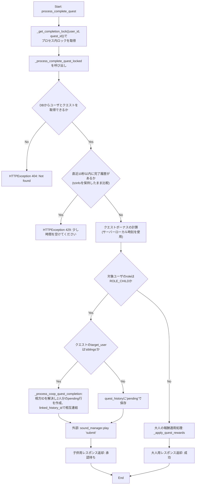
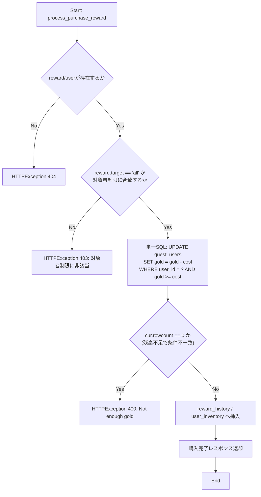
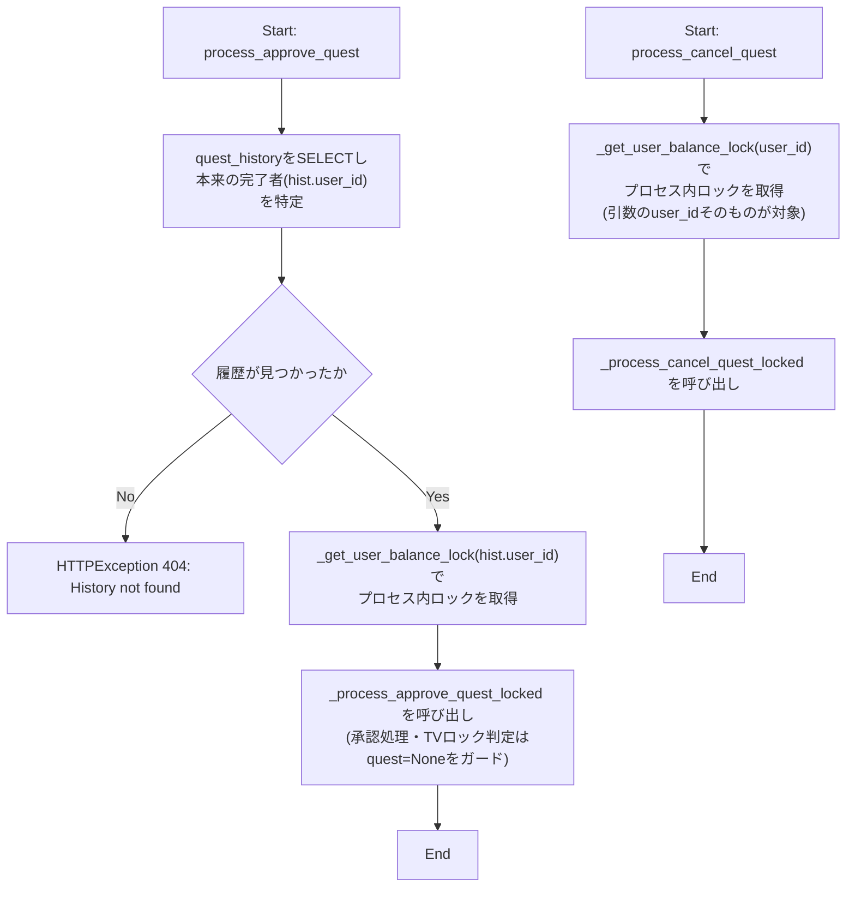
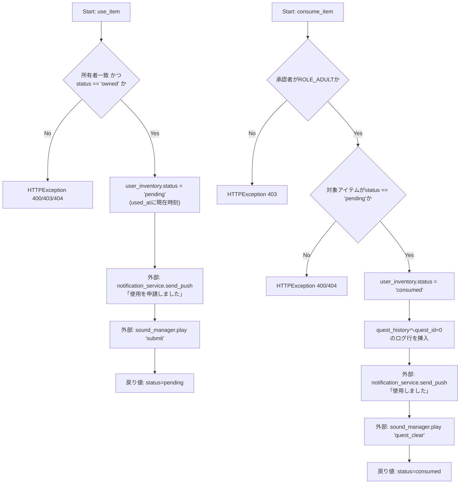

## 1. 解析メタ情報

| 項目 | 内容 |
| --- | --- |
| 対象ファイル | `quest_service.py` |
| 言語 | Python (FastAPI関連) |
| 解析対象 | 提供されたコードのみ |
| 推測・補完 | 一切なし |

## 関連ドキュメント

* [quest.md](./quest.md) - `MasterUser`/`MasterQuest`/`MasterReward`モデル定義
* [quest_data.md](./quest_data.md) - `sync_master_data`が読み込むマスターデータ(`USERS`/`QUESTS`/`REWARDS`)の実体
* [quest_router.md](./quest_router.md) - 本ファイルの各サービスを呼び出すFastAPIルーター(呼び出し元と推測される)
* [common.md](./common.md) - `common.get_db_cursor`/`common.get_now_iso`を提供するモジュール
* [game_logic.md](./game_logic.md) - `GameLogic.calc_level_progress`/`calc_level_down`/`calculate_drop_rewards`の実装
* [sound_manager.md](./sound_manager.md) - `sound_manager.play`の実体(`core.sound_manager`)
* [notification_service.md](./notification_service.md) - `notification_service.send_push`の実体(`services.notification_service`)
* [switchbot_service.md](./switchbot_service.md) - `switchbot_service.send_device_command`の実体(TVロック解除、`_trigger_tv_unlock`内でローカルインポート)
* [config.md](./config.md) - `TV_UNLOCK_QUEST_IDS`/`TV_PLUG_DEVICE_ID`/`LINE_PARENTS_GROUP_ID`/`LINE_USER_ID`等の設定値の提供元
* [fix_quest_reset_period.md](./fix_quest_reset_period.md) - `quest_master.reset_period`列の値(`'weekly_monday'`→`'daily'`)を一括修正するワンショットスクリプト。本ファイルの`is_within_reset_period`が`'daily'`/`'weekly'`の2値しか扱わないことと関連が疑われる

## 2. ファイルの概要

データベースクエリを用いて、ユーザー情報、クエスト、アイテム（ごほうび）、インベントリの状態管理と操作を行うサービス群を定義したファイル。また、マスターデータファイル（`quest_data`）とデータベースの同期や、画面表示用の集約データ生成を担う。親権限の判定は `quest_users.role` カラム（モジュール定数 `ROLE_ADULT` / `ROLE_CHILD` の2値）を唯一の基準として行われ、`target_user == 'siblings'` のクエストについては兄妹どちらか一方の完了報告で双方の履歴を連結（`linked_history_id`）して同時に承認・却下・取消（カスケード）する「兄妹連携クエスト」機構を持つ。クエスト完了処理（`process_complete_quest`）は同一`(user_id, quest_id)`へのプロセス内`threading.Lock`による直列化で、報酬購入処理（`process_purchase_reward`）はDBレベルの単一アトミックUPDATE（`WHERE gold >= ?`＋`rowcount`判定）で、それぞれ同時多重リクエストによる二重加算・二重購入のレースコンディションを防ぐ設計になっている。
* 根拠: (行番号: 40〜46 / 抜粋: "同一(user_id, quest_id)への同時リクエスト（クライアントのリトライ・二重タップ等）\n# 別スレッドでほぼ同時に到達すると、どちらも「直近の完了履歴なし」を読んでしまい、\n# 経験値・ゴールド・ボスダメージが二重に加算されるレースコンディションが発生しうる。")
* 根拠: (行番号: 600〜602 / 抜粋: "# 残高チェックと減算を単一のアトミックなUPDATEにすることで、\n# 同時多重リクエストによる read-then-write のレースコンディション\n# (二重購入でゴールドが1回分しか減らない不具合) を防ぐ。")

H-3の修正により、`process_approve_quest`/`process_cancel_quest`（`quest_users`のgold/exp/levelをread-modify-writeで更新する経路）も、対象ユーザー単位のプロセス内ロック（`_get_user_balance_lock`）で直列化され、同一ユーザーへの承認×承認・承認×取消の並行実行によるgold/exp消失レースを防ぐようになった。また`InventoryService`のアイテム使用は、H-5の修正により即時消費（`'consumed'`）ではなく`'pending'`状態での申請とし、`ROLE_ADULT`による`consume_item`の承認で初めて消費を確定する2段階の承認フローに変更された（子供のクエスト完了が`ROLE_ADULT`の承認を要する仕組みと同様のパターン）。
* 根拠: (行番号: 59〜66 / 抜粋: "process_approve_quest / process_cancel_quest は「quest_usersをSELECT →")
* 根拠: (行番号: 645〜649 / 抜粋: "アイテム使用を「申請」する。即時消費はせず status='pending' にし、")

## 3. 外部依存関係

### インポート一覧

| 名称 | 種類 | 用途 | 根拠 |
| --- | --- | --- | --- |
| `datetime` | 標準ライブラリ | 日付や時刻の操作・比較 | `import datetime` (行番号: 1) |
| `importlib` | 標準ライブラリ | マスターデータモジュールのリロード | `import importlib` (行番号: 2) |
| `random` | 標準ライブラリ | ランダムクエスト発生判定(`random.Random(seed)`) | `import random` (行番号: 3) |
| `math` | 標準ライブラリ | インポートされているが、本ファイル内では`math.`の呼び出しは一切確認できない(未使用) | `import math` (行番号: 4) |
| `threading` | 標準ライブラリ | `process_complete_quest`の二重実行防止用ロック(`threading.Lock`)の生成・管理、および`_trigger_tv_unlock`内での非同期スレッド実行(ローカル再インポートあり) | `import threading` (行番号: 5) |
| `pytz` | 外部ライブラリ | タイムゾーン(`Asia/Tokyo`)の設定 | `import pytz` (行番号: 6) |
| `typing` (`List`, `Dict`, `Any`, `Optional`, `Tuple`) | 標準ライブラリ | 型ヒント（`Tuple`は`_completion_locks`のキー型`Tuple[str, int]`に使用） | `from typing import List, Dict, Any, Optional, Tuple` (行番号: 7) |
| `fastapi` (`HTTPException`) | 外部ライブラリ | エラーレスポンス生成 | `from fastapi import HTTPException` (行番号: 9) |
| `common` | 内部モジュール | DBカーソル取得、現在時刻(ISO)取得 | `import common` (行番号: 10) |
| `config` | 内部モジュール | 環境変数・定数の参照 | `import config` (行番号: 11) |
| `game_logic` | 内部モジュール | ゲームレベルや報酬の計算ロジック呼び出し | `import game_logic` (行番号: 12) |
| `core.sound_manager` | 内部モジュール | 音声再生イベント発行 | `from core import sound_manager` (行番号: 13) |
| `services.notification_service` | 内部モジュール | LINEなどへのプッシュ通知 | `from services import notification_service` (行番号: 14) |
| `core.logger` (`setup_logging`) | 内部モジュール | ロガー設定 | `from core.logger import setup_logging` (行番号: 15) |
| `models.quest` (`MasterUser`, `MasterQuest`, `MasterReward`) | 内部モジュール | マスターデータの型定義(モデル) | `from models.quest import MasterUser, MasterQuest, MasterReward` (行番号: 18) |
| `quest_data` | 内部モジュール(例外処理付きインポート) | マスターデータのハードコードリスト(`USERS`/`QUESTS`/`REWARDS`) | `import quest_data` / `from .. import quest_data` (行番号: 29, 32) |
| `datetime` (ローカル再インポート) | 標準ライブラリ | `is_within_reset_period`内でトップレベルの`datetime`を再度インポート(冗長) | `import datetime` (行番号: 144) |
| `threading` (ローカル再インポート) | 標準ライブラリ | `_trigger_tv_unlock`内でトップレベルの`threading`を再度インポート(冗長) | `import threading` (行番号: 407) |
| `services.switchbot_service` | 内部モジュール(関数内ローカルインポート) | TVプラグのON操作コマンド送信 | `from services import switchbot_service` (行番号: 408) |
| `services.notification_service` (ローカル再インポート) | 内部モジュール | `_trigger_tv_unlock`内でモジュールレベルと同じものを再度インポート(冗長) | `from services import notification_service` (行番号: 409) |

### ブラックボックスとなる外部要素

| 名称 | 理由 | 根拠 |
| --- | --- | --- |
| `common.get_db_cursor()` / `common.get_now_iso()` | トランザクションスコープや接続の詳細、生成されるISO文字列のフォーマット(ミリ秒・タイムゾーンの有無)が不明 | `with common.get_db_cursor() as cur:` (行番号: 86) |
| `game_logic.GameLogic.*` | `calculate_drop_rewards`, `calc_level_progress`, `calc_level_down`, `calculate_next_level_exp`, `calculate_max_hp` の計算式・詳細仕様が不明 | `game_logic.GameLogic.calculate_drop_rewards(base_gold, base_exp)` (行番号: 461) |
| `config.*` | `TV_UNLOCK_QUEST_IDS`, `TV_PLUG_DEVICE_ID`, `LINE_PARENTS_GROUP_ID`, `LINE_USER_ID` の実際の設定値が不明 | `config.TV_UNLOCK_QUEST_IDS and config.TV_PLUG_DEVICE_ID` (行番号: 384) |
| `switchbot_service.send_device_command` | 引数の完全な仕様、通信エラー時の挙動、戻り値の構造が不明 | `switchbot_service.send_device_command(config.TV_PLUG_DEVICE_ID, "turnOn")` (行番号: 414) |
| `notification_service.send_push` | 送信先・ペイロード形式以外のリトライ仕様等が不明 | `notification_service.send_push(user_id=config.LINE_PARENTS_GROUP_ID, ...)` (行番号: 424〜427) |
| `sound_manager.play` | 再生される音声の実体・失敗時の挙動が不明 | `sound_manager.play("submit")` (行番号: 286) |
| `quest_data.USERS` / `.QUESTS` / `.REWARDS` の構造 | 定義ファイルが提供されておらず、辞書のキー構成が本ファイルの参照(`q_data['start_time']`等)からのみ推測可能 | `valid_users = [MasterUser(**u) for u in quest_data.USERS]` (行番号: 760) |
| `models.quest.MasterUser` / `MasterQuest` / `MasterReward` | フィールドのバリデーションルールが不明 | `MasterQuest(**q_data)` (行番号: 766) |
| DBの各テーブルスキーマ | カラムの型、制約(UNIQUE, NOT NULL等)、外部キー設定などが不明。特に `quest_history.linked_history_id` の型・制約は本ファイルからは確認できない | `cur.execute("SELECT level, gold FROM quest_users")` (行番号: 87), `hist['linked_history_id']` (行番号: 378) |

## 4. 主要要素の定義（関数 / エンドポイント / コンポーネント）

### `ROLE_ADULT` / `ROLE_CHILD` (モジュールレベル定数)

* **役割**: `quest_users.role` カラムに格納される値のうち、親権限（`role_adult`）と子供権限（`role_child`）を表す文字列定数。本ファイル内の全ての権限判定（クエスト完了時の即時反映/承認待ち分岐、承認・却下・アイテム消費承認の権限チェック）はこの2値を唯一の基準として行われる。
* 根拠: `ROLE_ADULT = 'role_adult'` / `ROLE_CHILD = 'role_child'` (行番号: 24〜25)
* **引数/リクエスト・戻り値/レスポンス・副作用・エラーハンドリング**: 該当なし（モジュールレベルの文字列定数）
* 根拠: (行番号: 23〜25 / 抜粋: "# quest_users.role の値 (親権限判定はこの2値のみを唯一の判定基準とする)")

### `_get_completion_lock` (モジュールレベル関数) と `_completion_locks` / `_completion_locks_guard` (モジュールレベル変数)

* **役割**: `(user_id, quest_id)` のタプルをキーとして `threading.Lock` を管理する簡易レジストリ。同一キーに対して常に同一の`Lock`インスタンスを返す（初回アクセス時に`_completion_locks_guard`で保護しつつ生成）。`process_complete_quest`が「直近履歴を読む→報酬を書く」という手順のため、同一(user_id, quest_id)への同時リクエストが競合すると報酬が二重加算されるレースコンディションがあり、それを防ぐために処理全体をプロセス内で直列化する目的で導入されている。
* 根拠: `_completion_locks: Dict[Tuple[str, int], threading.Lock] = {}` (行番号: 45), `def _get_completion_lock(key: Tuple[str, int]) -> threading.Lock:` (行番号: 49〜55)
* **引数/リクエスト**: `key: Tuple[str, int]` (`user_id`と`quest_id`の組)
* 根拠: (行番号: 49)
* **戻り値/レスポンス**: `threading.Lock`
* 根拠: (行番号: 49, 55 / 抜粋: "return lock")
* **副作用**: `_completion_locks`辞書への書き込み（キー未登録時のみ）。エントリを削除する処理は存在せず、辞書は増え続ける。
* 根拠: (行番号: 52〜54 / 抜粋: "_completion_locks[key] = lock")
* **エラーハンドリング**: なし
* 根拠: (行番号: 49〜55)

### `_get_user_balance_lock` (モジュールレベル関数) と `_user_balance_locks` / `_user_balance_locks_guard` (モジュールレベル変数)

* **役割**: `user_id`をキーとして`threading.Lock`を管理する簡易レジストリ（`_get_completion_lock`と同様の構造）。`process_approve_quest`/`process_cancel_quest`は「`quest_users`をSELECT→Pythonでgold/exp/levelを計算→UPDATE」というread-modify-write処理のため、同一ユーザーへの承認×承認・承認×取消が並行実行される（例: 親が承認一覧を連続タップする`handleApproveAll`）と一方の更新が消失するレースコンディションが起こりうる（H-3）。`quest_users`(gold/exp/level)を書き換える処理を対象ユーザー単位でプロセス内直列化するために導入された。
* 根拠: `_user_balance_locks: Dict[str, threading.Lock] = {}` (行番号: 67), `def _get_user_balance_lock(user_id: str) -> threading.Lock:` (行番号: 71〜77)
* **引数/リクエスト**: `user_id: str`
* 根拠: (行番号: 71)
* **戻り値/レスポンス**: `threading.Lock`
* 根拠: (行番号: 71, 77 / 抜粋: "return lock")
* **副作用**: `_user_balance_locks`辞書への書き込み（キー未登録時のみ）。`_completion_locks`と同様、エントリを削除する処理は存在せず辞書は増え続ける。
* 根拠: (行番号: 74〜76 / 抜粋: "_user_balance_locks[user_id] = lock")
* **エラーハンドリング**: なし
* 根拠: (行番号: 71〜77)

### `UserService.get_family_chronicle`

* **役割**: `quest_users`の合計レベル・合計ゴールド、`quest_history`の総件数から家族のランク（4段階のしきい値）を判定し、`_fetch_full_adventure_logs`で取得した冒険ログとともに返す。
* 根拠: `def get_family_chronicle(self) -> Dict[str, Any]:` (行番号: 85〜103)
* **引数/リクエスト**: なし（`self`のみ）
* 根拠: (行番号: 85)
* **戻り値/レスポンス**: `Dict[str, Any]`（`stats: {totalLevel, totalGold, totalQuests, partyRank}` と `chronicle`）
* 根拠: (行番号: 85, 100〜103 / 抜粋: "return {\n            \"stats\": {\"totalLevel\": total_level,")
* **副作用**: DB参照（`quest_users`, `quest_history`）
* 根拠: (行番号: 87, 90 / 抜粋: "users = cur.execute(\"SELECT level, gold FROM quest_users\").fetchall()")
* **エラーハンドリング**: なし
* 根拠: (行番号: 85〜103)

### `UserService._fetch_full_adventure_logs`

* **役割**: `quest_history`（`status='approved'`、最大100件）と`reward_history`（最大100件）を取得しマージ、`ts`降順で先頭100件に切り詰めたうえで、各ユーザーの名前・アバターを付与し、種別ごとの表示テキストと日付文字列を整形して返す。
* 根拠: `def _fetch_full_adventure_logs(self, cur) -> List[dict]:` (行番号: 105〜125)
* **引数/リクエスト**: `cur`
* 根拠: (行番号: 105)
* **戻り値/レスポンス**: `List[dict]`（各要素は`type`, `userId`, `userName`, `userAvatar`, `title`, `text`, `gold`, `exp`, `timestamp`, `dateStr`）
* 根拠: (行番号: 105, 112〜125)
* **副作用**: DB参照（`quest_history`, `reward_history`, `quest_users`）
* 根拠: (行番号: 106〜107, 110)
* **エラーハンドリング**: なし
* 根拠: (行番号: 105〜125)

### `UserService.update_avatar`

* **役割**: ユーザーが存在することを確認したうえで、アバターURLを更新する。
* 根拠: `def update_avatar(self, user_id: str, avatar_url: str) -> Dict[str, Any]:` (行番号: 127〜137)
* **引数/リクエスト**: `user_id: str`, `avatar_url: str`
* 根拠: (行番号: 127)
* **戻り値/レスポンス**: `Dict[str, Any]`（`{"status": "updated", "avatar": avatar_url}`）
* 根拠: (行番号: 127, 137)
* **副作用**: DB更新（`quest_users`）、ログ出力
* 根拠: (行番号: 133〜136)
* **エラーハンドリング**: ユーザー不在時に `HTTPException(status_code=404)`
* 根拠: (行番号: 130〜131 / 抜粋: "raise HTTPException(status_code=404, detail=\"User not found\")")

### `QuestService.is_within_reset_period`

* **役割**: 完了日時文字列とリセット周期文字列から、現在の期間内に完了しているかを判定する。JST（UTC+9）を標準ライブラリのみで定義して基準にし、`completed_at_str`をISOパースして`tzinfo`が無ければ**JSTとみなして**変換する（M-1-4: 以前はtzinfo無しの値をUTCとみなしていたが、保存規約(`common.get_now_iso`)は常にJSTで記録するためこの解釈は誤りであり、同ファイル内のスパムチェック(`_process_complete_quest_locked`)がtzinfo無しの値をJSTとみなす実装と矛盾していた。誤ったUTC解釈により、日付境界付近（夜遅く）のレガシー完了時刻で日付跨ぎの誤判定が起きていた。変換に失敗した場合は`"%Y-%m-%d"`形式でのパースにフォールバックし、それも失敗すれば`False`を返す）。`reset_period`が`'daily'`の場合は当日一致、`'weekly'`の場合は当該週の月曜日以降かを判定する。`'daily'`/`'weekly'`以外の文字列（例えば`sync_master_data`がデフォルト値として設定する`'weekly_monday'`）が渡された場合は、いずれの分岐にも一致せず末尾の`return False`に到達する。
* 根拠: `def is_within_reset_period(self, completed_at_str: str, reset_period: str) -> bool:` (行番号: 141〜175)
* 根拠: `if dt.tzinfo is None: dt = dt.replace(tzinfo=JST)` (行番号: 153〜159 / 抜粋: "M-1-4: タイムゾーン情報がない場合、以前はUTCとして記録されている")
* 根拠: `if reset_period == 'daily': ... elif reset_period == 'weekly': ... return False` (行番号: 168〜175)
* **引数/リクエスト**: `completed_at_str: str`, `reset_period: str`
* 根拠: (行番号: 141)
* **戻り値/レスポンス**: `bool`
* 根拠: (行番号: 141)
* **副作用**: なし
* 根拠: (行番号: 141〜175、DBアクセスや外部呼び出しなし)
* **エラーハンドリング**: `completed_at_str`が空なら早期`False`。ISOパース失敗時は`"%Y-%m-%d"`形式でリトライし、それも失敗すれば`False`を返す（例外は送出しない）。
* 根拠: (行番号: 142, 162〜166 / 抜粋: "except Exception:\n            try:\n                completed_date = datetime.datetime.strptime(...)\n            except:\n                return False")

### `QuestService.__init__`

* **役割**: インスタンス初期化時に `UserService` のインスタンスを生成する。
* 根拠: `def __init__(self):` (行番号: 177〜178)
* **引数/リクエスト**: なし
* 根拠: (行番号: 177)
* **戻り値/レスポンス**: なし
* **副作用**: インスタンスプロパティの割り当て（`self.user_service`）
* 根拠: (行番号: 178 / 抜粋: "self.user_service = UserService()")
* **エラーハンドリング**: なし

### `QuestService.calculate_quest_boost`

* **役割**: 対象クエストが`quest_type == 'daily'`かつ`day_of_week`が未設定（曜日限定でない）の場合のみ、最終完了日からの経過日数に応じて取得経験値・ゴールドのボーナスを計算する（`missed_days × 10%`、最大100%）。判定に用いる「現在時刻」はサーバーのローカル時刻（`datetime.datetime.now()`）であり、`is_within_reset_period`のようなJST変換は行われない。
* 根拠: `def calculate_quest_boost(self, cur, user_id: str, quest: Any) -> Dict[str, int]:` (行番号: 180〜226)
* 根拠: `if quest['quest_type'] != 'daily': return {"gold": 0, "exp": 0}` (行番号: 185〜186), `if quest['day_of_week']: return {"gold": 0, "exp": 0}` (行番号: 192〜193)
* 根拠: `now = datetime.datetime.now()` (行番号: 202)
* **引数/リクエスト**: `cur`, `user_id: str`, `quest: Any`（`sqlite3.Row`を想定）
* 根拠: (行番号: 180〜181 / 抜粋: "# 修正: 型ヒントを dict から Any (sqlite3.Row) へ変更し、実態に合わせる")
* **戻り値/レスポンス**: `Dict[str, int]`（`gold`, `exp`の追加ボーナス）
* 根拠: (行番号: 180, 226)
* **副作用**: DB参照（`quest_history`）
* 根拠: (行番号: 196〜200)
* **エラーハンドリング**: 日時パースエラー時に`pass`で無視し、ボーナスなし扱いとする。
* 根拠: (行番号: 209〜210 / 抜粋: "except Exception:\n                pass")

### `QuestService.process_complete_quest`

* **役割**: `_get_completion_lock((user_id, quest_id))`でプロセス内ロックを取得したうえで、実処理を`_process_complete_quest_locked`に委譲する薄いラッパー。
* 根拠: `def process_complete_quest(self, user_id: str, quest_id: int) -> Dict[str, Any]:` (行番号: 228〜232)
* **引数/リクエスト**: `user_id: str`, `quest_id: int`
* 根拠: (行番号: 228)
* **戻り値/レスポンス**: `Dict[str, Any]`（`_process_complete_quest_locked`の戻り値をそのまま返却）
* 根拠: (行番号: 232 / 抜粋: "return self._process_complete_quest_locked(user_id, quest_id)")
* **副作用**: ロックの取得・解放（`with`文）
* 根拠: (行番号: 231)
* **エラーハンドリング**: なし（内部の例外はそのまま伝播）
* 根拠: (行番号: 228〜232)

### `QuestService._process_complete_quest_locked`

* **役割**: クエスト完了の実処理。クエスト・ユーザーの存在確認後、直近10秒以内の完了履歴があれば`429`エラーとするスパムチェックを行い、`calculate_quest_boost`でボーナスを計算する。対象ユーザーが`ROLE_CHILD`の場合、対象クエストの`target_user`が`'siblings'`なら`_process_coop_quest_completion`に委譲、それ以外は`quest_history`に`'pending'`ステータスで挿入し承認待ちレスポンスを返す。`ROLE_ADULT`の場合は`_apply_quest_rewards`で即時に報酬を適用する。
* 根拠: `def _process_complete_quest_locked(self, user_id: str, quest_id: int) -> Dict[str, Any]:` (行番号: 234〜298)
* **引数/リクエスト**: `user_id: str`, `quest_id: int`
* 根拠: (行番号: 234)
* **戻り値/レスポンス**: `Dict[str, Any]`（ステータスや報酬情報）
* 根拠: (行番号: 234, 288〜293, 298)
* **副作用**: DB参照/更新（`quest_master`, `quest_users`, `quest_history`）、`sound_manager.play("submit")`呼び出し、ログ出力、`_apply_quest_rewards`/`_process_coop_quest_completion`の呼び出し
* 根拠: (行番号: 236〜237, 280〜286, 296)
* **エラーハンドリング**: クエスト・ユーザー不在時 `HTTPException(404)`。直近10秒以内の完了履歴がある場合 `HTTPException(429)`（`completed_at`の`tzinfo`を保持したまま`datetime.datetime.now(last_time.tzinfo)`と比較することで、サーバーのOSタイムゾーンに依存せず実時間10秒経過を判定する。`tzinfo`が無い古いデータはJST(+9時間)とみなす）。この時間ベースのチェックに加え、呼び出し元`process_complete_quest`のプロセス内ロックにより、ほぼ同時到達した複数リクエストが直列化される。
* 根拠: (行番号: 239〜240, 249〜265 / 抜粋: "if (now_check - last_time).total_seconds() < 10:\n                        raise HTTPException(status_code=429, ...)")

### `QuestService._get_sibling_partner_id`

* **役割**: 兄妹連携クエスト（`target_user == 'siblings'`）の完了報告者に対する「相方」の`user_id`を返す。`quest_users.role = ROLE_CHILD`のユーザーがちょうど2人（兄・妹）いることを前提とし、報告者自身を除いたもう一方のIDを返す。
* 根拠: `def _get_sibling_partner_id(self, cur, user_id: str) -> str:` (行番号: 300〜309 / 抜粋: "現状の家族構成では role_child のユーザーがちょうど2人")
* **引数/リクエスト**: `cur`, `user_id: str`
* 根拠: (行番号: 300)
* **戻り値/レスポンス**: `str`（相方の`user_id`）
* 根拠: (行番号: 300, 309)
* **副作用**: DB参照（`quest_users`）
* 根拠: (行番号: 305)
* **エラーハンドリング**: `role_child`のユーザーが対象ユーザーに含まれない、または人数がちょうど2人でない場合は`HTTPException(400)`
* 根拠: (行番号: 307〜308 / 抜粋: "raise HTTPException(status_code=400, detail=\"兄妹クエストの対象ユーザー構成が不正です\")")

### `QuestService._process_coop_quest_completion`

* **役割**: 兄妹連携クエストの完了報告処理。`_get_sibling_partner_id`で相方を特定し、報告者・相方双方の`pending`な`quest_history`行を作成、後から報告者側の行に`linked_history_id`を`UPDATE`で設定して相互連結する。
* 根拠: `def _process_coop_quest_completion(self, cur, user, quest, now_iso: str, total_exp: int, total_gold: int) -> Dict[str, Any]:` (行番号: 311〜340)
* **引数/リクエスト**: `cur`, `user`, `quest`, `now_iso: str`, `total_exp: int`, `total_gold: int`
* 根拠: (行番号: 311)
* **戻り値/レスポンス**: `Dict[str, Any]`（`status: "pending"`、`message`に「兄妹クエスト」の旨を含む）
* 根拠: (行番号: 335〜340)
* **副作用**: DB挿入・更新（`quest_history`に2行挿入、うち1行を`UPDATE`）、`sound_manager.play("submit")`呼び出し、ログ出力
* 根拠: (行番号: 318〜333)
* **エラーハンドリング**: なし（`_get_sibling_partner_id`から送出される`HTTPException`はそのまま伝播）
* 根拠: (行番号: 311〜340)

### `QuestService.process_approve_quest`

* **役割**: ロック対象ユーザー（`quest_history`の本来の完了者。gold/exp更新の対象であり、承認者`approver_id`とは別人）を、`history_id`から軽量な参照クエリで先に特定し、そのユーザー単位のロック（`_get_user_balance_lock`）を取得したうえで、実処理を`_process_approve_quest_locked`に委譲する薄いラッパー（H-3）。
* 根拠: 関数冒頭のコメント (行番号: 343〜344 / 抜粋: "ロック対象ユーザー(quest_historyの本来の完了者。gold/exp更新の対象)を")
* **引数/リクエスト**: `approver_id: str`, `history_id: int`
* 根拠: (行番号: 342)
* **戻り値/レスポンス**: `Dict[str, Any]`（`_process_approve_quest_locked`の戻り値をそのまま返却）
* 根拠: (行番号: 353 / 抜粋: "return self._process_approve_quest_locked(approver_id, history_id)")
* **副作用**: 軽量な参照クエリ（`quest_history`から`user_id`のみSELECT）、ロックの取得・解放
* 根拠: (行番号: 345〜348, 352)
* **エラーハンドリング**: 参照クエリで該当履歴が見つからない場合 `HTTPException(404)`（内部の`_process_approve_quest_locked`の例外はそのまま伝播）
* 根拠: (行番号: 349〜350 / 抜粋: "if not hist_peek:\n            raise HTTPException(status_code=404, detail=\"History not found\")")

### `QuestService._process_approve_quest_locked`

* **役割**: `ROLE_ADULT`のユーザーが子供のクエスト完了を承認する実処理（`process_approve_quest`が取得したユーザー単位ロック内で実行されることを前提とする）。`_apply_quest_rewards`で報酬を確定し、連結された相方履歴があれば`_approve_linked_history`でカスケード承認、TVロック解除対象クエストかつ子供のクエストであれば`_trigger_tv_unlock`を呼ぶ。TVロック判定の`quest`は、`sync_master_data`のマスタ削除(`DELETE ... NOT IN`)後も`quest_history`の`pending`行が残るケースで`None`になり得るため、`if quest and ...`で`None`ガードされている（M-1-1: 以前はこのガードが無く、マスタ削除済みクエストのpending履歴を承認しようとすると`quest['quest_id']`が無条件に評価され`TypeError`で500になり承認が恒久的に失敗していた）。
* 根拠: `def _process_approve_quest_locked(self, approver_id: str, history_id: int) -> Dict[str, Any]:` (行番号: 355〜389)
* 根拠: `if quest and quest['quest_id'] in config.TV_UNLOCK_QUEST_IDS and config.TV_PLUG_DEVICE_ID:` (行番号: 382〜384 / 抜粋: "quest はマスタから削除された quest_id の pending 履歴を承認する場合 None になり得る")
* **引数/リクエスト**: `approver_id: str`, `history_id: int`
* 根拠: (行番号: 355)
* **戻り値/レスポンス**: `Dict[str, Any]`
* 根拠: (行番号: 355, 389)
* **副作用**: DB参照/更新、`_approve_linked_history`/`_trigger_tv_unlock`の呼び出し、ログ出力
* 根拠: (行番号: 378〜379, 384〜386, 388)
* **エラーハンドリング**: 承認者が`role_adult`でない場合 `HTTPException(403)`、履歴なし `HTTPException(404)`、承認待ちでない場合 `HTTPException(400)`
* 根拠: (行番号: 358〜359, 362, 363)

### `QuestService._approve_linked_history`

* **役割**: 兄妹連携クエストで連結された相方側の`quest_history`行を承認済みに確定する。対象行が存在しない、または既に`pending`でない場合は何もしない冪等な実装。
* 根拠: `def _approve_linked_history(self, cur, linked_history_id: int) -> None:` (行番号: 391〜404 / 抜粋: "相方側 quest_history 行を承認済みに確定する(冪等)")
* **引数/リクエスト**: `cur`, `linked_history_id: int`
* 根拠: (行番号: 391)
* **戻り値/レスポンス**: なし（`-> None`）
* 根拠: (行番号: 391)
* **副作用**: DB参照/更新（`_apply_quest_rewards`経由）、ログ出力
* 根拠: (行番号: 403〜404)
* **エラーハンドリング**: 対象履歴が存在しない・`pending`でない、または対象ユーザーが存在しない場合は早期`return`（例外を送出しない）
* 根拠: (行番号: 394〜395, 399〜400)

### `QuestService._trigger_tv_unlock`

* **役割**: 別スレッドでTVプラグのON操作をSwitchBot API経由でリクエストする。メインスレッド（APIルーティング）をブロックしないための非同期実行。
* 根拠: `def _trigger_tv_unlock(self, quest_id: int):` (行番号: 406〜431)
* **引数/リクエスト**: `quest_id: int`
* 根拠: (行番号: 406)
* **戻り値/レスポンス**: なし（`return`文なし）
* 根拠: (行番号: 406〜431)
* **副作用**: `threading`・`switchbot_service`・`notification_service`のローカル再インポート、別スレッド生成（`daemon=True`）、外部API呼び出し、失敗時はLINE通知
* 根拠: (行番号: 407〜409, 429〜431, 414, 424〜427)
* **エラーハンドリング**: API呼び出しの例外・非成功レスポンス(`statusCode != 100`)を`Exception`としてまとめて捕捉し、ログ出力のうえ`config.LINE_PARENTS_GROUP_ID`が設定されていれば親グループへ失敗通知を送る（Fail-Soft）
* 根拠: (行番号: 419〜427 / 抜粋: "except Exception as e:\n                logger.error(f\"❌ TV Unlock failed: {e}\")")

### `QuestService.process_reject_quest`

* **役割**: `ROLE_ADULT`のユーザーが子供のクエスト完了を却下し、履歴を削除する。連結された相方の履歴が`pending`であればカスケードして削除する。
* 根拠: `def process_reject_quest(self, approver_id: str, history_id: int, reason: Optional[str] = None) -> Dict[str, str]:` (行番号: 433〜451)
* **引数/リクエスト**: `approver_id: str`, `history_id: int`, `reason: Optional[str] = None`
* 根拠: (行番号: 433)
* **戻り値/レスポンス**: `Dict[str, str]`（`{"status": "rejected"}`）
* 根拠: (行番号: 433, 451)
* **副作用**: DB削除（`quest_history`。連結された相方の`pending`行も含む）、ログ出力
* 根拠: (行番号: 443, 446〜448, 450)
* **エラーハンドリング**: 承認者が`role_adult`でない場合 `HTTPException(403)`、履歴なし `HTTPException(404)`、承認待ちでない場合 `HTTPException(400)`
* 根拠: (行番号: 436〜437, 440, 441)

### `QuestService._apply_quest_rewards`

* **役割**: `game_logic.GameLogic.calculate_drop_rewards`でゴールド・経験値・メダル・ラッキー判定を計算し、`calc_level_progress`でレベル・経験値・レベルアップ有無を求め、`quest_users`を更新する。`history_id`が指定されていれば既存の`quest_history`行を`'approved'`に更新、なければ新規挿入する。レベルアップ・ラッキー(メダル獲得)・通常クリア(新規挿入時のみ)に応じて対応するサウンドを再生する。既存行更新時（`history_id`指定時）は`status`/`gold_earned`/`exp_earned`のみを更新し、`completed_at`は書き換えない（#93: 以前は`completed_at`を承認時刻`now_iso`で上書きしていたため、子供が前日(weeklyなら前週)に完了報告したクエストを親が翌日に承認すると、`_process_complete_quest_locked`のスパムチェック/`is_within_reset_period`による周期リセット判定が承認当日を基準に「本日(今週)完了済み」と誤判定し、承認当日いっぱいそのクエストが完了不能になっていた。この不具合は`calculate_quest_boost`が参照する連続日ボーナスの基準日にも影響していた）。
* 根拠: `def _apply_quest_rewards(self, cur, user, quest, now_iso, history_id=None, override_rewards=None) -> Dict[str, Any]:` (行番号: 469〜515)
* **引数/リクエスト**: `cur`, `user`, `quest`, `now_iso`, `history_id=None`, `override_rewards=None`
* 根拠: (行番号: 469)
* **戻り値/レスポンス**: `Dict[str, Any]`（`status`, `leveledUp`, `newLevel`, `earnedGold`, `earnedExp`, `earnedMedals`）
* 根拠: (行番号: 511〜515)
* **副作用**: DB更新（`quest_users`, `quest_history`）、`sound_manager.play`呼び出し
* 根拠: (行番号: 489〜493, 495〜502, 504〜509)
* **エラーハンドリング**: なし
* 根拠: (行番号: 469〜515)

### `QuestService.process_cancel_quest`

* **役割**: 対象ユーザー単位のロック（`_get_user_balance_lock`）を取得したうえで、実処理を`_process_cancel_quest_locked`に委譲する薄いラッパー（H-3）。`process_approve_quest`とは異なり、ロック対象は引数の`user_id`そのものであるため事前の参照クエリは不要。
* 根拠: `def process_cancel_quest(self, user_id: str, history_id: int) -> Dict[str, str]:` (行番号: 501〜503)
* **引数/リクエスト**: `user_id: str`, `history_id: int`
* 根拠: (行番号: 501)
* **戻り値/レスポンス**: `Dict[str, str]`（`_process_cancel_quest_locked`の戻り値をそのまま返却）
* 根拠: (行番号: 503 / 抜粋: "return self._process_cancel_quest_locked(user_id, history_id)")
* **副作用**: ロックの取得・解放（`with`文）
* 根拠: (行番号: 502)
* **エラーハンドリング**: なし（内部の例外はそのまま伝播）
* 根拠: (行番号: 501〜503)

### `QuestService._process_cancel_quest_locked`

* **役割**: クエストの完了を取り消す実処理（`process_cancel_quest`が取得したユーザー単位ロック内で実行されることを前提とする）。所有者確認後、`_revert_and_delete_history`に本体処理を委譲し、連結された相方の履歴が存在すればカスケードして取り消す。
* 根拠: `def _process_cancel_quest_locked(self, user_id: str, history_id: int) -> Dict[str, str]:` (行番号: 505〜527)
* **引数/リクエスト**: `user_id: str`, `history_id: int`
* 根拠: (行番号: 505)
* **戻り値/レスポンス**: `Dict[str, str]`（`{"status": "cancelled"}`）
* 根拠: (行番号: 505, 527)
* **副作用**: DB削除/更新（`_revert_and_delete_history`経由。連結された相方分も含む）、ログ出力
* 根拠: (行番号: 514, 517〜524, 526)
* **エラーハンドリング**: 履歴不在 `HTTPException(404)`、`user_id`不一致 `HTTPException(403)`、ユーザー不在 `HTTPException(404)`
* 根拠: (行番号: 508, 509, 512)

### `QuestService._revert_and_delete_history`

* **役割**: `quest_history`1行を取り消すヘルパー。`pending`であれば単純に削除するのみ、`approved`であれば`game_logic.GameLogic.calc_level_down`で経験値・ゴールドをロールバックしたうえで削除する（ゴールドは`max(0, ...)`で負値化を防止）。
* 根拠: `def _revert_and_delete_history(self, cur, hist, user) -> None:` (行番号: 529〜545 / 抜粋: "quest_history 1行を取り消す。pending であれば単純に削除")
* **引数/リクエスト**: `cur`, `hist`, `user`
* 根拠: (行番号: 529)
* **戻り値/レスポンス**: なし（`-> None`）
* 根拠: (行番号: 529)
* **副作用**: DB更新（`quest_users`。`approved`時のみ）、DB削除（`quest_history`）
* 根拠: (行番号: 543〜545)
* **エラーハンドリング**: なし
* 根拠: (行番号: 529〜545)

### `QuestService.filter_active_quests`

* **役割**: クエストの期間（`limited`型の`start_date`/`end_date`）、曜日（`day_of_week`）、時間帯（`start_time`/`end_time`）、出現確率（`random`型、日付とクエストIDから決定的シードで判定）をもとに、現在有効なクエスト一覧に絞り込み、各クエストへ`icon`/`type`/`target`/`days`のエイリアスフィールドを付与する。
* 根拠: `def filter_active_quests(self, quests: List[dict]) -> List[dict]:` (行番号: 547〜588)
* **引数/リクエスト**: `quests: List[dict]`
* 根拠: (行番号: 547)
* **戻り値/レスポンス**: `List[dict]`
* 根拠: (行番号: 547, 588)
* **副作用**: リストの書き換え・フィルタリングのみ（DBや外部通信なし）
* 根拠: (行番号: 587 / 抜粋: "filtered.append(q)")
* **エラーハンドリング**: `limited`型の日付文字列パースに失敗した場合、ログを出力してそのクエストをスキップ（`continue`）
* 根拠: (行番号: 565〜567 / 抜粋: "except ValueError as e:\n                    logger.warning(...)\n                    continue")

### `ShopService.process_purchase_reward`

* **役割**: ユーザーがごほうび(アイテム)を購入する。`reward_master.target`が`'all'`以外の場合は対象者制限のサーバー側チェックを行い、`target == 'children'`なら`role_child`のみ、`target == 'adults'`なら`role_adult`のみ、それ以外（`'mom'`/`'dad'`等）は`target == user_id`の場合のみ購入を許可し、該当しなければ`HTTPException(403)`を返す（Issue #95: 以前はこのチェックが存在せず、フロントエンドの表示フィルタのみに依存していたため、API直叩きで対象者制限をバイパスして誰でも購入できた）。ゴールド残高チェックと減算は、`UPDATE quest_users SET gold = gold - ? ... WHERE user_id = ? AND gold >= ?`という単一のアトミックなSQL文にまとめ、`cur.rowcount`で成否を判定する。これにより「残高を読む→比較する→書く」という複数ステップに分割された処理では発生し得た、同時多重リクエストによる read-then-write レースコンディション（二重購入でもゴールドが1回分しか減らない不具合）を防いでいる。成功時は`reward_history`・`user_inventory`へ挿入する。
* 根拠: `def process_purchase_reward(self, user_id: str, reward_id: int) -> Dict[str, Any]:` (行番号: 612〜658)
* 根拠: `target = reward['target'] or 'all'` から `raise HTTPException(status_code=403, detail="This reward is not available for you")` まで (行番号: 620〜629)
* 根拠: `cur.execute("UPDATE quest_users SET gold = gold - ?, updated_at = ? WHERE user_id = ? AND gold >= ?", ...)` および `if cur.rowcount == 0: raise HTTPException(status_code=400, detail="Not enough gold")` (行番号: 634〜639)
* **引数/リクエスト**: `user_id: str`, `reward_id: int`
* 根拠: (行番号: 612)
* **戻り値/レスポンス**: `Dict[str, Any]`（`{"status": "purchased", "newGold": new_gold}`）
* 根拠: (行番号: 612, 658)
* **副作用**: DB更新/挿入（`quest_users`, `reward_history`, `user_inventory`）、ログ出力
* 根拠: (行番号: 646〜656)
* **エラーハンドリング**: 報酬マスター不在・ユーザー不在 `HTTPException(404)`、対象者制限に合致しない `HTTPException(403)`、ゴールド不足（`UPDATE`の`rowcount == 0`） `HTTPException(400)`
* 根拠: (行番号: 617, 618, 629, 638〜639)

### `InventoryService.get_user_inventory`

* **役割**: 指定ユーザーの`'owned'`または`'pending'`状態のインベントリアイテム一覧を、`reward_master`と結合し購入日時降順で取得する。
* 根拠: `def get_user_inventory(self, user_id: str) -> List[dict]:` (行番号: 631〜642)
* **引数/リクエスト**: `user_id: str`
* 根拠: (行番号: 631)
* **戻り値/レスポンス**: `List[dict]`
* 根拠: (行番号: 631, 642)
* **副作用**: DB参照（`user_inventory`, `reward_master`）
* 根拠: (行番号: 641)
* **エラーハンドリング**: なし
* 根拠: (行番号: 631〜642)

### `InventoryService.use_item`

* **役割**: アイテム使用を「申請」する（H-5）。所有者・状態(`'owned'`)を確認したうえで、対象アイテムの状態を即座に`'consumed'`にはせず`'pending'`へ更新し（`used_at`に現在時刻を記録）、`config.LINE_USER_ID`宛に「使用を申請しました。承認をお願いします。」というLINE通知を送り、`"submit"`サウンドを再生する。消費の確定（`quest_history`への記録・LINE通知・効果音）は`consume_item`による承認時に行われる（H-5: 以前は即座に`'consumed'`にしその場で`quest_history`へ記録・通知していたため、`consume_item`/`cancel_usage`/`get_pending_items`やフロントのpending UI・ポーリングが到達不能なデッドコードになっていた）。
* 根拠: 関数Docstring (行番号: 645〜649 / 抜粋: "アイテム使用を「申請」する。即時消費はせず status='pending' にし、")
* **引数/リクエスト**: `user_id: str`, `inventory_id: int`
* 根拠: (行番号: 644)
* **戻り値/レスポンス**: `Dict[str, str]`（`{"status": "pending", "message": "使用を申請しました！おうちの人の確認を待とう。"}`）
* 根拠: (行番号: 644, 680)
* **副作用**: DB参照（`reward_master`/`quest_users`とのJOIN）/更新（`user_inventory`の状態を`'pending'`に）、`notification_service.send_push`、`sound_manager.play("submit")`
* 根拠: (行番号: 667〜671, 674〜678)
* **エラーハンドリング**: アイテム不在 `HTTPException(404)`、所有者不一致 `HTTPException(403)`、状態が`'owned'`でない `HTTPException(400)`
* 根拠: (行番号: 661〜663)

### `InventoryService.consume_item`

* **役割**: `ROLE_ADULT`のユーザーが、保留中（`pending`）のアイテム使用申請を承認し消費を確定する（H-5）。承認者の`role`検証、対象アイテムが`'pending'`であることの確認後、状態を`'consumed'`に更新し、`quest_history`への記録（`quest_id=0`のログ行）・`config.LINE_USER_ID`宛のLINE通知・`"quest_clear"`サウンド再生を行う（これらの確定処理は元々`use_item`内で即時消費時に行われていたが、承認フロー復活に伴い`consume_item`側に移設された）。
* 根拠: 関数Docstring (行番号: 683 / 抜粋: "親がアイテム使用申請を承認し、消費を確定する。")
* **引数/リクエスト**: `approver_id: str`, `inventory_id: int`
* 根拠: (行番号: 682)
* **戻り値/レスポンス**: `Dict[str, str]`（`{"status": "consumed", "message": "承認しました"}`）
* 根拠: (行番号: 682, 721)
* **副作用**: DB参照（`role`および`reward_master`/`quest_users`とのJOINでアイテム取得）/更新（`user_inventory`を`'consumed'`に）、`quest_history`への新規INSERT、`notification_service.send_push`、`sound_manager.play("quest_clear")`
* 根拠: (行番号: 702〜706, 709〜712, 715〜719)
* **エラーハンドリング**: 承認者が`role_adult`でない場合 `HTTPException(403)`、アイテム不在 `HTTPException(404)`、`'pending'`でない場合 `HTTPException(400)`
* 根拠: (行番号: 686〜687, 697, 698)

### `InventoryService.cancel_usage`

* **役割**: 保留中（`pending`）のアイテム使用申請をキャンセルし、所有(`'owned'`)状態に戻す（`used_at`をクリア）。
* 根拠: `def cancel_usage(self, user_id: str, inventory_id: int) -> Dict[str, str]:` (行番号: 723〜731)
* **引数/リクエスト**: `user_id: str`, `inventory_id: int`
* 根拠: (行番号: 723)
* **戻り値/レスポンス**: `Dict[str, str]`（`{"status": "owned", "message": "リュックに戻しました"}`）
* 根拠: (行番号: 723, 731)
* **副作用**: DB更新（`user_inventory`）
* 根拠: (行番号: 730)
* **エラーハンドリング**: アイテム不在 `HTTPException(404)`、所有者不一致 `HTTPException(403)`、`pending`でない場合 `HTTPException(400)`
* 根拠: (行番号: 726〜728)

### `InventoryService.get_pending_items`

* **役割**: 全ユーザーの`pending`状態のアイテムを、使用申請日時の昇順で取得する（承認待ちキュー用）。
* 根拠: `def get_pending_items(self) -> List[dict]:` (行番号: 733〜746)
* **引数/リクエスト**: なし（`self`のみ）
* 根拠: (行番号: 733)
* **戻り値/レスポンス**: `List[dict]`
* 根拠: (行番号: 733, 746)
* **副作用**: DB参照
* 根拠: (行番号: 745)
* **エラーハンドリング**: なし
* 根拠: (行番号: 733〜746)

### `GameSystem.__init__`

* **役割**: `QuestService`, `UserService`, `ShopService`のインスタンスを生成し保持する。
* 根拠: `def __init__(self):` (行番号: 750〜753)
* **引数/リクエスト**: なし
* 根拠: (行番号: 750)
* **戻り値/レスポンス**: なし
* **副作用**: インスタンス変数の割り当て（`self.quest_service`, `self.user_service`, `self.shop_service`）
* 根拠: (行番号: 751〜753)
* **エラーハンドリング**: なし

### `GameSystem.sync_master_data`

* **役割**: `quest_data`モジュールを`importlib.reload`で再読み込みし、`MasterUser`/`MasterQuest`/`MasterReward`でバリデーションしたうえで、DBスキーマの簡易マイグレーション（`quest_users.role`列、`quest_master.reset_period`列(デフォルト値`'weekly_monday'`)、`reward_master.description`列を、存在しなければ`ALTER TABLE`で追加）を行い、`quest_users`/`quest_master`を`ON CONFLICT ... DO UPDATE`によるUPSERTと、マスターに存在しないIDの`DELETE`で同期する。`reward_master`へのUPSERTは`target`列(対象者制限。`MasterReward.target`、デフォルト`'all'`)を含み、`ON CONFLICT DO UPDATE`でも`target = excluded.target`により更新する（Issue #95: 以前はINSERT/UPDATE列リストに`target`が含まれておらず、`reward_master.target`は列DEFAULTの`'all'`に固定されたまま`quest_data.REWARDS`側の`target`指定（`'children'`/`'mom'`/`'adults'`等）が一切反映されなかったため、フロントエンドの対象者フィルタが常に素通しになり、対象者制限のある報酬が全ユーザーに表示・購入可能になっていた）。`reward_master`の同期については、削除候補を一括`DELETE`せず`SELECT`で取得したうえで1件ずつ検討し、`user_inventory`に参照が残っている（所有中/申請中/使用済問わず）報酬は削除をスキップして警告ログのみ出す（M-1-2: `user_inventory`は`reward_master(reward_id)`へのFK(`PRAGMA foreign_keys=ON`)を持つため、以前のように対象を一括`DELETE`すると所持者がいる報酬の削除時に`IntegrityError`となり`sync_master_data`全体が失敗していた）。
* 根拠: `def sync_master_data(self) -> Dict[str, str]:` (行番号: 723〜850)
* 根拠: `cur.execute("ALTER TABLE quest_master ADD COLUMN reset_period TEXT DEFAULT 'daily'")` (行番号: 759)
* 根拠: `INSERT INTO reward_master (reward_id, title, category, cost_gold, icon_key, description, target) ... ON CONFLICT(reward_id) DO UPDATE SET ... target = excluded.target` (行番号: 836〜847)
* 根拠: `user_inventory は reward_master(reward_id) へのFK(PRAGMA foreign_keys=ON)を持つため、` (行番号: 819〜822), `if still_referenced: ... continue` (行番号: 828〜834)
* **引数/リクエスト**: なし（`self`のみ）
* 根拠: (行番号: 723)
* **戻り値/レスポンス**: `Dict[str, str]`（`{"status": "synced", "message": "Master data updated."}`）
* 根拠: (行番号: 723, 850)
* **副作用**: DBテーブルのスキーマ変更（`ALTER TABLE`）、`SELECT`による削除候補の抽出と1件ずつの条件付き`DELETE`、`INSERT ... ON CONFLICT DO UPDATE`（`target`列含む）、`importlib.reload`、ログ出力
* 根拠: (行番号: 759, 810〜834, 836〜847)
* **エラーハンドリング**: `quest_data`未読込または`MasterUser`/`MasterQuest`/`MasterReward`のバリデーション失敗時に例外を捕捉し`HTTPException(status_code=500)`
* 根拠: (行番号: 774 / 抜粋: "raise HTTPException(status_code=500, detail=f\"Master Data Error: {str(e)}\")")

### `GameSystem.get_all_view_data`

* **役割**: フロントエンド描画に必要な状態（ユーザー、フィルタ済みクエスト、報酬、直近1ヶ月の完了履歴、承認待ち履歴、直近ログ）を一括で取得・整形する。ユーザーには`nextLevelExp`/`maxHp`/`hp`を付与し、各クエストには`bonus_gold`/`bonus_exp`（`target_user`が`'all'`以外の場合のみ`calculate_quest_boost`で算出）を付与する。直近1ヶ月の閾値算出はJST（`pytz`）で行い、失敗時はサーバーのローカル時刻にフォールバックする。`quest_type == 'infinite'`のクエストは条件を満たす全履歴を、それ以外はユーザーごとに最新1件のみを評価して`is_within_reset_period`で有効性判定する。`target_user`が`'role_'`で始まる共有クエストについては、誰かが完了済み/承認待ちであればそのユーザー情報を`is_shared_completed_by`等のフィールドに付与する。
* 根拠: `def get_all_view_data(self) -> Dict[str, Any]:` (行番号: 883〜977)
* 根拠: `if q['target_user'] and q['target_user'] != 'all':` (行番号: 895〜901)
* 根拠: `try:\n                now_jst = datetime.datetime.now(pytz.timezone(\"Asia/Tokyo\"))` ... `except Exception as jst_err:` (行番号: 910〜917)
* **引数/リクエスト**: なし（`self`のみ）
* 根拠: (行番号: 883)
* **戻り値/レスポンス**: `Dict[str, Any]`（`users`, `quests`, `rewards`, `completedQuests`, `logs`, `pendingQuests`）
* 根拠: (行番号: 973〜977)
* **副作用**: DB参照、`filter_active_quests`/`calculate_quest_boost`/`is_within_reset_period`/`_fetch_recent_logs`の呼び出し
* 根拠: (行番号: 892, 896, 942, 971)
* **エラーハンドリング**: JST基準日時の算出に失敗した場合、サーバーのローカル時刻へフォールバックする局所的な`try-except`（防御的処理、ログに`logger.error`）
* 根拠: (行番号: 910〜917 / 抜粋: "except Exception as jst_err:\n                logger.error(f\"❌ Failed to calculate JST time for analytics: {jst_err}\")")

### `GameSystem._fetch_recent_logs`

* **役割**: `quest_history`（`status='approved'`、`id`降順で20件）と`reward_history`（`id`降順で20件）を取得・マージし、`ts`降順に並べ替えて先頭20件に絞り、ユーザー名と表示テキスト・日付文字列を付与する。
* 根拠: `def _fetch_recent_logs(self, cur) -> List[dict]:` (行番号: 979〜997)
* **引数/リクエスト**: `cur`
* 根拠: (行番号: 979)
* **戻り値/レスポンス**: `List[dict]`
* 根拠: (行番号: 979, 997)
* **副作用**: DB参照（`quest_history`, `reward_history`, `quest_users`）
* 根拠: (行番号: 980〜987, 989)
* **エラーハンドリング**: なし
* 根拠: (行番号: 979〜997)

### モジュールレベルのシングルトンインスタンス

* **役割**: `GameSystem`を1つだけインスタンス化し、その内部で保持される`quest_service`/`shop_service`/`user_service`と、別途生成する`inventory_service`を、モジュールレベルの変数として外部（呼び出し元モジュール）へ公開する。
* 根拠: `game_system = GameSystem()` / `quest_service = game_system.quest_service` / `shop_service = game_system.shop_service` / `user_service = game_system.user_service` / `inventory_service = InventoryService()` (行番号: 1002〜1006)
* **引数/リクエスト・戻り値/レスポンス**: 該当なし（モジュール実行時の代入文）
* **副作用**: モジュールインポート時に各サービスクラスのインスタンスが1つずつ生成される
* 根拠: (行番号: 1002〜1006)
* **エラーハンドリング**: なし
* 根拠: (行番号: 1002〜1006)

## 5. 処理フロー図

以下は、クエストの完了処理（`process_complete_quest`）を中心とした処理フローです。兄妹連携クエスト（`target_user == 'siblings'`）の分岐を含みます。

```mermaid
flowchart TD
    Start[Start: process_complete_quest] --> AcquireLock["_get_completion_lock((user_id, quest_id))で<br>プロセス内ロックを取得"]
    AcquireLock --> CallLocked["_process_complete_quest_locked を呼び出し"]
    CallLocked --> DB_Select{"DBからユーザとクエストを取得できるか"}
    DB_Select -- No --> Err404[HTTPException 404: Not found]
    DB_Select -- Yes --> SpamCheck{"直近10秒以内に完了履歴があるか<br>(tzinfoを保持したまま比較)"}
    SpamCheck -- Yes --> Err429[HTTPException 429: 少し時間を空けてください]
    SpamCheck -- No --> CalcBoost["クエストボーナスの計算<br>(サーバーローカル時刻を使用)"]
    CalcBoost --> CheckChild{"対象ユーザのroleはROLE_CHILDか"}

    CheckChild -- Yes --> CheckSiblings{"クエストのtarget_userは'siblings'か"}
    CheckSiblings -- Yes --> CoopFlow["_process_coop_quest_completion:<br>相方IDを解決し2人分のpending行を作成、<br>linked_history_idで相互連結"]
    CoopFlow --> PlaySoundSubmit
    CheckSiblings -- No --> InsertPending["quest_historyに'pending'で保存"]
    InsertPending --> PlaySoundSubmit["外部: sound_manager.play 'submit'"]
    PlaySoundSubmit --> ReturnPending[子供用レスポンス返却: 承認待ち]
    ReturnPending --> End

    CheckChild -- No --> ApplyReward["大人の報酬適用処理: _apply_quest_rewards"]
    ApplyReward --> ReturnAdult[大人用レスポンス返却: 成功]
    ReturnAdult --> End

```

以下は、ごほうび購入処理（`process_purchase_reward`）の、アトミックUPDATEによる二重購入防止に着目したフローです。

```mermaid
flowchart TD
    PStart[Start: process_purchase_reward] --> PSelect{"reward/userが存在するか"}
    PSelect -- No --> PErr404[HTTPException 404]
    PSelect -- Yes --> PTargetCheck{"reward.target == 'all' か<br>対象者制限に合致するか"}
    PTargetCheck -- No --> PErr403[HTTPException 403: 対象者制限に非該当]
    PTargetCheck -- Yes --> PAtomicUpdate["単一SQL: UPDATE quest_users<br>SET gold = gold - cost<br>WHERE user_id = ? AND gold >= cost"]
    PAtomicUpdate --> PRowCheck{"cur.rowcount == 0 か<br>(残高不足で条件不一致)"}
    PRowCheck -- Yes --> PErr400[HTTPException 400: Not enough gold]
    PRowCheck -- No --> PInsertHistory["reward_history / user_inventory へ挿入"]
    PInsertHistory --> PReturn["購入完了レスポンス返却"]
    PReturn --> PEnd[End]

```

以下は、`process_approve_quest`/`process_cancel_quest`におけるユーザー単位ロック取得の流れです（H-3）。

```mermaid
flowchart TD
    AStart[Start: process_approve_quest] --> APeek["quest_historyをSELECTし<br>本来の完了者(hist.user_id)を特定"]
    APeek --> AFound{"履歴が見つかったか"}
    AFound -- No --> AErr404[HTTPException 404: History not found]
    AFound -- Yes --> AAcquireLock["_get_user_balance_lock(hist.user_id)で<br>プロセス内ロックを取得"]
    AAcquireLock --> ACallLocked["_process_approve_quest_locked を呼び出し<br>(承認処理・TVロック判定はquest=Noneをガード)"]
    ACallLocked --> AEnd[End]

    CStart[Start: process_cancel_quest] --> CAcquireLock["_get_user_balance_lock(user_id)で<br>プロセス内ロックを取得<br>(引数のuser_idそのものが対象)"]
    CAcquireLock --> CCallLocked["_process_cancel_quest_locked を呼び出し"]
    CCallLocked --> CEnd[End]
```

以下は、アイテム使用の承認フロー（`use_item` → `consume_item`、H-5で復活）です。

```mermaid
flowchart TD
    UStart[Start: use_item] --> UCheck{"所有者一致 かつ<br>status == 'owned' か"}
    UCheck -- No --> UErr[HTTPException 400/403/404]
    UCheck -- Yes --> USetPending["user_inventory.status = 'pending'<br>(used_atに現在時刻)"]
    USetPending --> UNotify["外部: notification_service.send_push<br>「使用を申請しました」"]
    UNotify --> UPlaySound["外部: sound_manager.play 'submit'"]
    UPlaySound --> UReturn["戻り値: status=pending"]

    CoStart[Start: consume_item] --> CoAuth{"承認者がROLE_ADULTか"}
    CoAuth -- No --> CoErr403[HTTPException 403]
    CoAuth -- Yes --> CoCheck{"対象アイテムがstatus == 'pending'か"}
    CoCheck -- No --> CoErr[HTTPException 400/404]
    CoCheck -- Yes --> CoSetConsumed["user_inventory.status = 'consumed'"]
    CoSetConsumed --> CoInsertHistory["quest_historyへquest_id=0のログ行を挿入"]
    CoInsertHistory --> CoNotify["外部: notification_service.send_push<br>「使用しました」"]
    CoNotify --> CoPlaySound["外部: sound_manager.play 'quest_clear'"]
    CoPlaySound --> CoReturn["戻り値: status=consumed"]
```

## 6. 依存関係図

ファイル内の主要クラスと外部モジュール、DBの依存関係を示します。

```mermaid
graph TD
    subgraph quest_service.py
        UserService
        QuestService
        ShopService
        InventoryService
        GameSystem
        game_system_inst["game_system / quest_service / shop_service /<br>user_service / inventory_service (モジュール変数)"]
        get_completion_lock["_get_completion_lock()"]
        completion_locks["_completion_locks (dict)"]
        get_user_balance_lock["_get_user_balance_lock()"]
        user_balance_locks["_user_balance_locks (dict)"]
        role_consts["ROLE_ADULT / ROLE_CHILD"]
    end

    game_system_inst --> GameSystem
    game_system_inst --> InventoryService
    GameSystem --> QuestService
    GameSystem --> UserService
    GameSystem --> ShopService
    QuestService --> UserService
    QuestService -->|process_complete_quest| get_completion_lock
    get_completion_lock --> completion_locks
    QuestService -->|"process_approve_quest /<br>process_cancel_quest"| get_user_balance_lock
    get_user_balance_lock --> user_balance_locks
    QuestService -.-> role_consts
    InventoryService -.-> role_consts

    subgraph External Modules
        common
        config
        game_logic
        core_sound_manager["core.sound_manager"]
        services_notification["services.notification_service"]
        services_switchbot["services.switchbot_service"]
        models_quest["models.quest"]
        quest_data
        threading_lib["threading (Lock)"]
    end

    get_completion_lock --> threading_lib
    get_user_balance_lock --> threading_lib
    QuestService -->|"_trigger_tv_unlock内でローカルインポート"| services_switchbot

    subgraph Database/Tables
        quest_users
        quest_master
        quest_history
        reward_master
        reward_history
        user_inventory
    end

    UserService -.-> quest_users
    UserService -.-> quest_history
    UserService -.-> reward_history

    QuestService -.-> quest_master
    QuestService -.-> quest_users
    QuestService -.-> quest_history

    ShopService -.-> quest_users
    ShopService -.-> user_inventory
    ShopService -.-> reward_history

    InventoryService -.-> user_inventory
    InventoryService -.-> quest_history
    InventoryService -.-> quest_users

    UserService -.-> common
    QuestService -.-> common
    ShopService -.-> common
    InventoryService -.-> common
    GameSystem -.-> common

    QuestService -.-> game_logic
    GameSystem -.-> game_logic

    QuestService -.-> core_sound_manager
    InventoryService -.-> core_sound_manager

    QuestService -.-> services_switchbot
    QuestService -.-> services_notification
    InventoryService -.-> services_notification

    GameSystem -.-> quest_data
    GameSystem -.-> models_quest

```

## 7. 次のステップ（リバースエンジニアリングの提案）

| 優先度 | ファイル名(推測可) | 理由 | 根拠 |
| --- | --- | --- | --- |
| 高 | `common.py` | トランザクションスコープの境界や`get_now_iso`の日時フォーマットが、データの整合性・タイムゾーン判定の正しさに強く影響するため。 | `with common.get_db_cursor(commit=True) as cur:` (行番号: 235) |
| 高 | `game_logic.py` | 報酬やレベルアップ等のコアドメインロジック（`calculate_drop_rewards`, `calc_level_progress`, `calc_level_down`）を含むため。 | `game_logic.GameLogic.calc_level_progress(...)` (行番号: 467) |
| 高 | `quest_data.py` | `sync_master_data`で読み込まれる`USERS`/`QUESTS`/`REWARDS`の実データの型・値が、DBテーブルの各カラム仕様と`reset_period`の実際の分布に直接影響するため。特に`reset_period`列のデフォルト値`'weekly_monday'`が実データにどの程度残っているかを確認する必要がある。 | `import quest_data` (行番号: 29), `cur.execute("ALTER TABLE quest_master ADD COLUMN reset_period TEXT DEFAULT 'weekly_monday'")` (行番号: 791) |
| 中 | `fix_quest_reset_period.py` | `quest_master.reset_period`が`'weekly_monday'`から`'daily'`へ一括変換されるワンショットスクリプトであり、`is_within_reset_period`が`'daily'`/`'weekly'`のみを扱う設計との整合性（未実行環境や`'boss_'`接頭辞クエストでの挙動）を確認するため。 | `is_within_reset_period`の`if reset_period == 'daily': ... elif reset_period == 'weekly': ...` (行番号: 168〜173) |
| 中 | `services/switchbot_service.py` | 非同期のTVロック解除に失敗した場合の影響範囲・再送ロジックの有無を確認するため。 | `switchbot_service.send_device_command(config.TV_PLUG_DEVICE_ID, "turnOn")` (行番号: 414) |
| 中 | マイグレーション定義ファイル (例: `core/migrations.py` またはその配下のスクリプト) | `quest_history.linked_history_id`カラムの型・制約・追加時期が本ファイルからは確認できないため。 | `hist['linked_history_id']` (行番号: 378) |
| 低 | `models/quest.py` | `MasterUser`/`MasterQuest`/`MasterReward`のバリデーションルール（`role`フィールドの扱い等）を確認するため。 | `role_val = getattr(u, 'role', None)` (行番号: 794) |

## 8. 保守上の注意点

* **`is_within_reset_period`が扱うリセット周期は`'daily'`と`'weekly'`のみ**: `sync_master_data`が`quest_master.reset_period`列を新規追加する際のデフォルト値は`'weekly_monday'`だが、`is_within_reset_period`はこの文字列を判定条件に含んでいない。そのため、`reset_period`が`'weekly_monday'`のまま（または`'daily'`/`'weekly'`以外の任意の値）であるクエストは、`get_all_view_data`内での有効性判定で常に`False`を返し、`completedQuests`（および共有クエストの他者完了状況）へ反映されない可能性がある。
* 根拠: `if reset_period == 'daily': ... elif reset_period == 'weekly': ... return False` (行番号: 168〜175), `cur.execute("ALTER TABLE quest_master ADD COLUMN reset_period TEXT DEFAULT 'weekly_monday'")` (行番号: 791)
* **`calculate_quest_boost`と`is_within_reset_period`で「現在時刻」の基準が異なる**: `is_within_reset_period`はJST（+9時間、標準ライブラリのみで定義）に厳密に変換して比較する一方、`calculate_quest_boost`は`datetime.datetime.now()`（サーバーのOSローカル時刻）をそのまま使用している。サーバーのOSタイムゾーンがJST以外（例: UTC環境）の場合、連続日ボーナスの判定基準日がずれる可能性がある（M-1-4は`is_within_reset_period`のtzinfo無し値の解釈をUTCからJSTへ修正したのみで、この2関数間の基準不一致自体は解消されていない）。
* 根拠: `now_jst = datetime.datetime.now(JST)` (行番号: 147), `now = datetime.datetime.now()` (行番号: 202)
* **`process_complete_quest`の二重加算防止ロックはプロセス内限定**: `_get_completion_lock`は`threading.Lock`のみを対象としており、複数プロセス/複数ワーカーで稼働する構成では別プロセスからの同時リクエストまでは防げない。`_completion_locks`辞書はエントリを削除する処理を持たず、キーの組み合わせが増え続ける設計である。H-3で追加された`_get_user_balance_lock`（`process_approve_quest`/`process_cancel_quest`用）も同様に`threading.Lock`のみを対象とし、`_user_balance_locks`辞書もエントリを削除しない同じ設計である。
* 根拠: `_completion_locks: Dict[Tuple[str, int], threading.Lock] = {}` (行番号: 45), `_completion_locks[key] = lock` (行番号: 54), `_user_balance_locks: Dict[str, threading.Lock] = {}` (行番号: 67), `_user_balance_locks[user_id] = lock` (行番号: 76)
* **`process_purchase_reward`はDBレベルのアトミックUPDATEで二重購入を防ぐ**: `process_complete_quest`/`process_approve_quest`/`process_cancel_quest`のプロセス内ロックとは異なり、`WHERE user_id = ? AND gold >= ?`条件付きの単一`UPDATE`文と`rowcount`判定によって、複数プロセス/複数ワーカー構成でも成立する形でレースコンディションを防いでいる。同じ「gold/expを扱う」処理群の中で採用している防御の粒度・方式が異なる点に留意が必要。
* 根拠: `cur.execute("UPDATE quest_users SET gold = gold - ? , updated_at = ? WHERE user_id = ? AND gold >= ?", ...)` および `if cur.rowcount == 0: raise HTTPException(status_code=400, detail="Not enough gold")` (行番号: 603〜608)
* **冗長なローカルインポート**: `is_within_reset_period`内の`import datetime`（行144）、`_trigger_tv_unlock`内の`import threading`（行407）と`from services import notification_service`（行409）は、いずれもモジュール冒頭で既にインポート済みのモジュールを関数内で再度インポートしており、実害はないが冗長である。
* 根拠: (行番号: 144, 407, 409)
* **`filter_active_quests`の日付フォーマット依存**: 日付文字列を`split('-')`で分割しており、対象フォーマット(`YYYY-MM-DD`)に厳密に依存している。
* 根拠: `y, m, d = map(int, q['start_date'].split('-'))` (行番号: 558)
* **`_trigger_tv_unlock`のスレッド管理**: `threading.Thread`による非同期実行が行われているが、プロセス終了時のスレッド制御（明示的な待機やキャンセル）は実装されていない（`daemon=True`によりプロセス終了時に強制終了される前提と見られる）。
* 根拠: `t = threading.Thread(target=unlock_task, daemon=True)` (行番号: 430)
* **兄妹連携クエストの前提条件**: `_get_sibling_partner_id`は`quest_users.role = ROLE_CHILD`のユーザーが「ちょうど2人」であることを前提としており、子供が1人または3人以上の家族構成では常に`HTTPException(400)`が送出される。
* 根拠: `if user_id not in child_ids or len(child_ids) != 2: raise HTTPException(status_code=400, ...)` (行番号: 307〜308)
* **兄妹連携クエストのカスケード処理は3箇所に個別実装**: 承認（`_process_approve_quest_locked`内、`_approve_linked_history`呼び出し）・却下（`process_reject_quest`内）・取消（`_process_cancel_quest_locked`内、`_revert_and_delete_history`経由）のそれぞれで`hist['linked_history_id']`の有無を個別にチェックしており、共通ヘルパーに統合されていない（H-3による`process_approve_quest`/`process_cancel_quest`のロック委譲分割後も、この重複自体は解消されていない）。
* 根拠: (行番号: 378, 446〜448, 516〜524)
* **アイテム使用申請・承認は共に`LINE_USER_ID`宛へ通知される（H-5で対称化）**: `use_item`は「使用を申請しました」、`consume_item`は「使用しました」という通知をいずれも`config.LINE_USER_ID`宛に送信するようになった（H-5以前は`consume_item`側に対応する通知呼び出しが無く非対称だったが、承認フロー復活に伴い解消された）。ただし承認権限を持つ`ROLE_ADULT`ユーザー個別への「承認待ちがある」というプッシュ通知は無く、`get_pending_items`のポーリングに依存する設計のままである。
* 根拠: `notification_service.send_push(user_id=config.LINE_USER_ID, ...)` (行番号: 674〜677、`use_item`内), (行番号: 715〜718、`consume_item`内)

## 9. 不明事項一覧

| 項目 | 理由 | 必要なファイル |
| --- | --- | --- |
| DB各テーブルのスキーマ | 生SQLによるクエリが記述されているが、各カラムの型、主キーや外部キー等の制約が不明。特に`quest_history.linked_history_id`カラムがいつ・どのマイグレーションで追加されたか、外部キー制約の有無は本ファイルからは不明。 | DBのDDL(CREATE TABLE文)、マイグレーション定義ファイル |
| `common.get_now_iso`の形式 | 現在時刻として保存する文字列表現における、ミリ秒やタイムゾーン情報の有無が不明。 | `common.py` |
| 各種定数の値 | `TV_UNLOCK_QUEST_IDS`, `TV_PLUG_DEVICE_ID`, `LINE_PARENTS_GROUP_ID`, `LINE_USER_ID`の実際の値が不明。 | `config.py` |
| ゲーム計算ロジック | レベルアップ閾値や獲得報酬量、`calculate_max_hp`/`calculate_next_level_exp`の計算式が不明。 | `game_logic.py` |
| 非同期通信のエラー処理 | `switchbot_service.send_device_command`が返すレスポンス構造が不明。 | `services/switchbot_service.py` |
| `reset_period`が`'weekly_monday'`のクエストの実運用上の扱い | `is_within_reset_period`がこの値を判定条件に含まない理由（実データが既に`'daily'`へ移行済みで実害がないのか、未対応の不具合なのか）が本ファイルからは不明。 | `fix_quest_reset_period.py`の実行履歴、`quest_data.py`の`reset_period`実データ |
| 兄妹連携クエストの対象ユーザー拡張時の挙動 | `_get_sibling_partner_id`は`role_child`がちょうど2人であることを前提としているが、3人以上に拡張する場合の相方選択ロジックの仕様は本ファイルには存在しない。（リポジトリ内を検索したが、3人以上への拡張を扱う仕様ドキュメントは存在せず、`MY_HOME_SYSTEM/tests/test_coop_quest_router.py`にも1人のみ登録時に400エラーになるテストがあるのみで3人以上のケースのテストはなく、解消不可。ソースコード上は`len(child_ids) != 2`という条件により1人・3人以上のいずれも同じ`HTTPException(400)`になることのみ確認できた） | 将来的な仕様変更に関するドキュメントまたは`quest_data.py`のtarget値設計 |

## 相互参照による補足情報

| 元の不明事項 | 判明した内容 | 参照元ドキュメント |
| --- | --- | --- |
| DB各テーブルのスキーマ / `quest_history.linked_history_id`の追加経緯 | `MY_HOME_SYSTEM/current_schema.sql`187〜194行目の`CREATE TABLE quest_history`を直接確認した。`id INTEGER PRIMARY KEY AUTOINCREMENT, user_id TEXT, quest_id INTEGER, quest_title TEXT, exp_earned INTEGER, gold_earned INTEGER, completed_at DATETIME NOT NULL, status TEXT DEFAULT 'approved', linked_history_id INTEGER DEFAULT NULL`という9カラム構成であり、`linked_history_id`に外部キー制約(`REFERENCES`句)は付与されていない(単なる`INTEGER DEFAULT NULL`)ことを確認した。追加経緯については`MY_HOME_SYSTEM/migrations/0004_add_coop_quest_link.sql`(全5行)を直接確認し、`-- 兄妹連携クエスト用に、quest_history同士を相互に連結するカラムを追加する。`というコメントとともに`ALTER TABLE quest_history ADD COLUMN linked_history_id INTEGER DEFAULT NULL;`という単純な`ALTER TABLE`文であり、こちらも外部キー制約は付与されていないことを確認した。 | 直接ソース確認: `MY_HOME_SYSTEM/current_schema.sql:187-194`, `MY_HOME_SYSTEM/migrations/0004_add_coop_quest_link.sql:1-5` |
| `common.get_now_iso`の形式 | `MY_HOME_SYSTEM/core/utils.py`12〜13行目の`def get_now_iso() -> str: return datetime.datetime.now(pytz.timezone("Asia/Tokyo")).isoformat()`を直接確認した。`common.get_now_iso`は`common.py`16行目で`from core.utils import get_now_iso, ...`によりこれをそのまま再エクスポートするFacadeであることも確認した。`datetime.isoformat()`はタイムゾーン情報を`+09:00`のオフセット付きで含み、マイクロ秒が0でない場合のみマイクロ秒部分を含む(Pythonの標準仕様どおり、`datetime.now()`は通常マイクロ秒非ゼロのためほぼ常に含まれる)ミリ秒単位ではなくマイクロ秒単位の精度であることを確認した。 | 直接ソース確認: `MY_HOME_SYSTEM/core/utils.py:12-13`, `MY_HOME_SYSTEM/common.py:16` |
| 各種定数の値 | `MY_HOME_SYSTEM/config.py`を直接確認した。`LINE_USER_ID`(185行目)は`os.getenv("LINE_USER_ID")`、`LINE_PARENTS_GROUP_ID`(186行目)は`os.getenv("LINE_PARENTS_GROUP_ID", "")`(既定は空文字列)であり、いずれも実際の値は`.env`(gitignore対象)依存のため確認できなかった。`TV_UNLOCK_QUEST_IDS`(536〜542行目)は`os.getenv("TV_UNLOCK_QUEST_IDS", "")`をカンマ区切りで`int`変換したリストであり、環境変数未設定時は既定で空リスト`[]`になることを確認した。`TV_PLUG_DEVICE_ID`(544行目)は`os.getenv("TV_PLUG_DEVICE_ID")`(既定`None`)であることを確認した。いずれも実際にセットされている値そのものは`.env`ファイルがリポジトリ内に存在しない(`.gitignore:13`)ため確認できなかった。 | 直接ソース確認: `MY_HOME_SYSTEM/config.py:185-186, 536-544` |
| ゲーム計算ロジック | `MY_HOME_SYSTEM/game_logic.py`を直接確認した。`calculate_next_level_exp(level)`(13〜15行目)は`math.floor(100 * math.pow(1.2, level - 1))`。`calculate_max_hp(level)`(18〜20行目)は`level * 20 + 5`。`calc_level_progress(current_level, current_exp, added_exp)`(23〜40行目)は`total_exp = current_exp + added_exp`を起点に`calculate_next_level_exp`が返す閾値と比較しながら`while`ループでレベルアップを繰り返し判定し`(new_level, new_exp, leveled_up)`を返す。`calc_level_down(current_level, current_exp, removed_exp)`(43〜61行目)は経験値がマイナスになった場合にレベルを1まで下げつつ前レベルの必要経験値を繰り戻す。`calculate_drop_rewards(base_gold, base_exp)`(64〜79行目)はメダルドロップ率5%(`medal_chance = 0.05`)のランダム抽選を行うことを確認した。 | 直接ソース確認: `MY_HOME_SYSTEM/game_logic.py:13-79` |
| 非同期通信のエラー処理 | `MY_HOME_SYSTEM/services/switchbot_service.py`を直接確認した。`send_device_command(device_id, command, parameter="default", command_type="command")`(58〜76行目)は`post_switchbot_api(url, headers, payload)`(51〜56行目、`response.raise_for_status()`でHTTPエラー時に例外を送出し、成功時は`response.json()`をそのまま返す)を`try`で呼び出し、`Exception`発生時はログ出力の上で`None`を返す(74〜76行目)設計であることを確認した。呼び出し元の`MY_HOME_SYSTEM/services/quest_service.py`414〜415行目では`res = switchbot_service.send_device_command(config.TV_PLUG_DEVICE_ID, "turnOn")`の後`if res and res.get("statusCode") == 100:`で成功判定しており、`None`または`statusCode`が100以外の場合は失敗として扱われることを確認した。 | 直接ソース確認: `MY_HOME_SYSTEM/services/switchbot_service.py:51-76`, `MY_HOME_SYSTEM/services/quest_service.py:414-415` |
| `reset_period`が`'weekly_monday'`のクエストの実運用上の扱い | `MY_HOME_SYSTEM/old/fix_quest_reset_period.py`(全29行)を直接確認した。`fix_reset_period()`関数は`UPDATE quest_master SET reset_period = 'daily' WHERE reset_period = 'weekly_monday' AND quest_id NOT LIKE 'boss_%'`(15〜19行目)を実行する一回限りのDB修正スクリプトであり、既存の`'weekly_monday'`データを`'daily'`へ一括移行することを目的として作成されたことが判明した。また`MY_HOME_SYSTEM/quest_data.py`のQUESTS配列(53〜183行目)を直接確認したところ、個々のクエスト定義には`reset_period`キーが一切設定されておらず、`models/quest.py`35行目の`MasterQuest.reset_period: Optional[str] = 'daily'`という既定値がそのまま適用される設計であることを確認した。したがって現在の運用データ上は`'daily'`のみが使われており、`'weekly_monday'`は`quest_master`テーブルのカラム既定値(`current_schema.sql`194行目`reset_period TEXT DEFAULT 'weekly_monday'`)としてのみ残存するレガシーな値であり、`is_within_reset_period`が対応しないのは既に無害化された経緯によるものであることが判明した。 | 直接ソース確認: `MY_HOME_SYSTEM/old/fix_quest_reset_period.py:1-29`, `MY_HOME_SYSTEM/quest_data.py:53-183`, `MY_HOME_SYSTEM/models/quest.py:35`, `MY_HOME_SYSTEM/current_schema.sql:194` |

## 10. 自己検証結果

* [x] 完了: 推測・外部ファイルの仕様を一切含んでいない
* [x] 完了: 全関数・全クラス・全コンポーネントを列挙した
* [x] 完了: 全てのインポート要素を列挙した
* [x] 完了: すべての仕様説明に「根拠（行番号・抜粋）」を明記した
* [x] 完了: 根拠漏れが0件である
* [x] 完了: Mermaid構文にエラーの原因となる記号（エスケープ漏れ）がない
* [x] 完了: 不明事項を漏れなく列挙した
