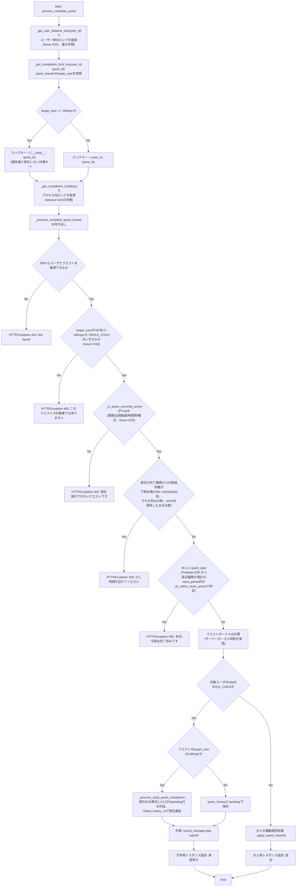
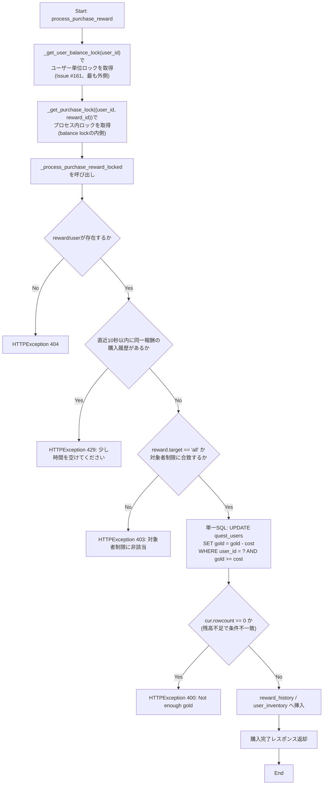
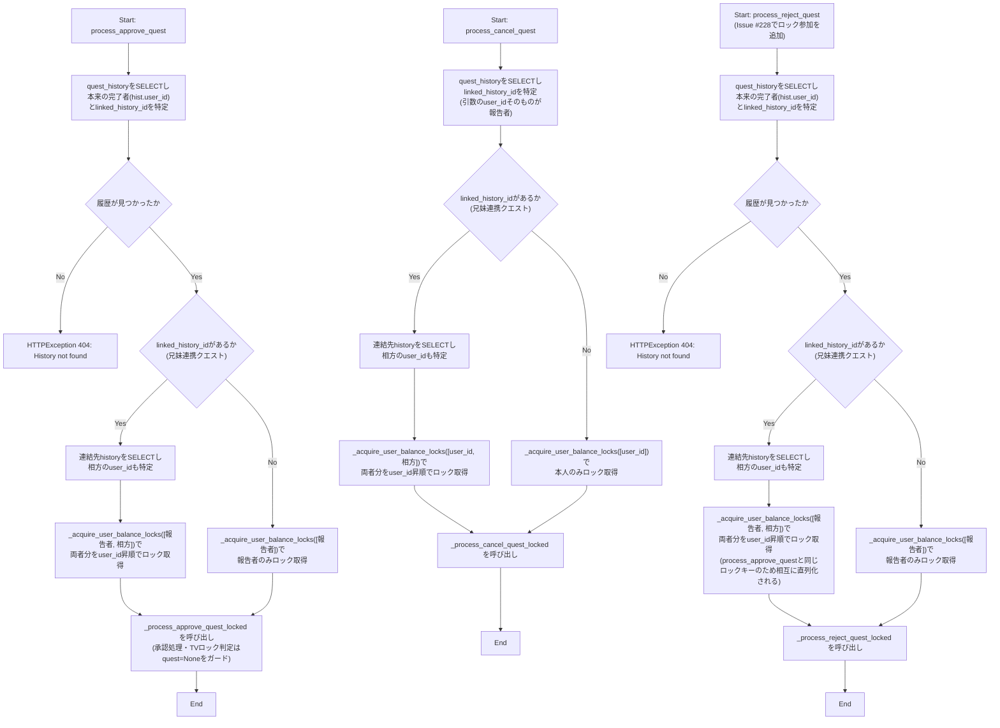
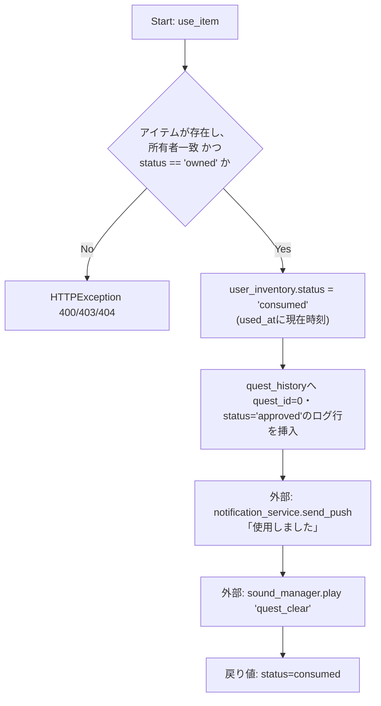

## 1. 解析メタ情報

| 項目 | 内容 |
| --- | --- |
| 対象ファイル | `quest_service.py` |
| 言語 | Python (FastAPI関連) |
| 解析対象 | 提供されたコードのみ |
| 推測・補完 | 一切なし |
| 解析基準コミット | `a599ef5` |

## 関連ドキュメント

* [quest.md](./quest.md) - `MasterUser`/`MasterQuest`/`MasterReward`モデル定義
* [quest_data.md](./quest_data.md) - `sync_master_data`が読み込むマスターデータ(`USERS`/`QUESTS`/`REWARDS`)の実体
* [quest_router.md](./quest_router.md) - 本ファイルの各サービスを呼び出すFastAPIルーター(呼び出し元と推測される)
* [common.md](./common.md) - `common.get_db_cursor`/`common.get_now_iso`を提供するモジュール
* [game_logic.md](./game_logic.md) - `GameLogic.calc_level_progress`/`calc_level_down`/`calculate_drop_rewards`の実装
* [sound_manager.md](./sound_manager.md) - `sound_manager.play`の実体(`core.sound_manager`)
* [notification_service.md](./notification_service.md) - `notification_service.send_push`の実体(`services.notification_service`)
* [switchbot_service.md](./switchbot_service.md) - `switchbot_service.send_device_command`の実体(TVロック解除、`_trigger_tv_unlock`内でローカルインポート)
* [config.md](./config.md) - `TV_UNLOCK_QUEST_IDS`/`TV_PLUG_DEVICE_ID`/`LINE_PARENTS_GROUP_ID`/`LINE_USER_ID`/`UPLOAD_DIR`（B6で追加、`_delete_orphaned_avatar`が参照）等の設定値の提供元
* `fix_quest_reset_period.py`（本リポジトリに実体なし。実機デプロイ先にのみ存在すると見られる） - `quest_master.reset_period`列の値(`'weekly_monday'`→`'daily'`)を一括修正するワンショットスクリプト。本ファイルの`is_within_reset_period`が`'daily'`/`'weekly'`の2値しか扱わないことと関連が疑われる

## 2. ファイルの概要

データベースクエリを用いて、ユーザー情報、クエスト、アイテム（ごほうび）、インベントリの状態管理と操作を行うサービス群を定義したファイル。また、マスターデータファイル（`quest_data`）とデータベースの同期や、画面表示用の集約データ生成を担う。親権限の判定は `quest_users.role` カラム（モジュール定数 `ROLE_ADULT` / `ROLE_CHILD` の2値）を唯一の基準として行われ、`target_user == 'siblings'` のクエストについては兄妹どちらか一方の完了報告で双方の履歴を連結（`linked_history_id`）して同時に承認・却下・取消（カスケード）する「兄妹連携クエスト」機構を持つ。クエスト完了処理（`process_complete_quest`）は`_get_completion_lock_key`が算出するキーへのプロセス内`threading.Lock`による直列化で二重加算を防ぐ。このキーは通常`(user_id, quest_id)`だが、対象クエストの`target_user`が`'siblings'`（兄妹連携クエスト）の場合は報告者(`user_id`)に依存しない共通キー`('__coop__', quest_id)`になる（Issue #96: 以前は兄妹連携クエストでも`(user_id, quest_id)`のままだったため、兄の報告は`(兄, quest_id)`、妹の報告は`(妹, quest_id)`と別ロックとなって直列化されず、ほぼ同時報告で`_process_coop_quest_completion`によるpendingペア生成が二重に走り、承認時に報酬が2倍になる不具合があった）。加えて、大人の即時完了パス(`_apply_quest_rewards`)による`quest_users`更新を対象ユーザー単位で直列化するため、`process_complete_quest`は`_get_user_balance_lock`も取得する(Issue #161、詳細は32行目以降を参照)。報酬購入処理（`process_purchase_reward`）は、DBレベルの単一アトミックUPDATE（`WHERE gold >= ?`＋`rowcount`判定）による残高減算の同時多重リクエスト対策に加え、`(user_id, reward_id)`単位のプロセス内ロック（`_get_purchase_lock`）と直近10秒以内の同一報酬購入を拒否するスパムチェック、さらに`_get_user_balance_lock`を持つ（Issue #101: アトミックUPDATEは「残高を読む→比較する→書く」の分割による二重減算は防いでいたが、購入確認モーダルの連打で1回目のレスポンス前に届いた2回目のリクエストは、サーバー側では独立した正当な購入として扱われてしまい、残高が足りる限り2回とも成立して二重購入が起こり得た）。
* 根拠: (行番号: 67〜71 / 抜粋: "同一(user_id, quest_id)への同時リクエスト（クライアントのリトライ・二重タップ等）\n# 別スレッドでほぼ同時に到達すると、どちらも「直近の完了履歴なし」を読んでしまい、\n# 経験値・ゴールド・ボスダメージが二重に加算されるレースコンディションが発生しうる。")
* 根拠: `def _get_completion_lock_key(self, user_id: str, quest_id: int) -> Tuple[str, int]:` (行番号: 317〜331 / 抜粋: "if quest and quest['target_user'] == 'siblings':\n            return ('__coop__', quest_id)\n        return (user_id, quest_id)")
* 根拠: `with _get_user_balance_lock(user_id):\n            with _get_completion_lock(...)` (行番号: 313〜315)
* 根拠: (行番号: 764〜766 / 抜粋: "# 残高チェックと減算を単一のアトミックなUPDATEにすることで、\n# 同時多重リクエストによる read-then-write のレースコンディション\n# (二重購入でゴールドが1回分しか減らない不具合) を防ぐ。")
* 根拠: `_purchase_locks: Dict[Tuple[str, int], threading.Lock] = {}` (行番号: 132), `if elapsed is not None and elapsed < 10:\n                    raise HTTPException(status_code=429, ...)` (行番号: 748〜751), `with _get_user_balance_lock(user_id):\n            with _get_purchase_lock(...)` (行番号: 739〜741)

H-3の修正により、`process_approve_quest`/`process_cancel_quest`（`quest_users`のgold/exp/levelをread-modify-writeで更新する経路）も、対象ユーザー単位のプロセス内ロック（`_get_user_balance_lock`）で直列化され、同一ユーザーへの承認×承認・承認×取消の並行実行によるgold/exp消失レースを防ぐようになった。ただしIssue #161発覚時点では、`process_complete_quest`(completion lock)と`process_purchase_reward`(purchase lock)はこの`_get_user_balance_lock`を取得しておらず、quest_usersを書き換えうる4経路(完了・承認・取消・購入)が3つの独立したロックレジストリ(`_completion_locks`/`_user_balance_locks`/`_purchase_locks`)に分断されたままだった。具体的には (1) 大人が異なるquest_idのクエストをほぼ同時に完了すると、completion lockのキーが異なるため並行実行され、`_apply_quest_rewards`のread-modify-writeが競合してgold/expのlost updateが起こり得た。(2) 購入(アトミック減算)と承認/取消(絶対値SET)が別ロック系統のため並行実行可能で、承認/取消のSELECT後に購入の減算が確定すると、承認/取消の絶対値UPDATEがその減算を上書きし購入代金が実質返金され得た。この修正で`process_complete_quest`/`process_purchase_reward`も`_get_user_balance_lock`を(既存のcompletion/purchase lockより外側で)取得するようになり、4経路すべてが対象ユーザー単位で直列化される。ロック取得順序を常に balance lock → completion/purchase lock に統一しているのは、経路間のデッドロックを防ぐため。また`InventoryService.use_item`によるアイテム使用は、`'pending'`状態での申請と`ROLE_ADULT`による承認を経る2段階フローではなく、所有者・状態(`'owned'`)確認後に即座に消費を確定する（親の承認は不要な）単一ステップの処理である（アイテム使用時の親承認フローはコミット`9d5edec`で廃止された）。
* 根拠: (行番号: 88〜91 / 抜粋: "process_approve_quest / process_cancel_quest は「quest_usersをSELECT →")
* 根拠: (行番号: 301〜312, 724〜738 / 抜粋: "quest_users を書き換えうる全経路(承認・取消・完了)が対象ユーザー単位で\n        # 直列化されるよう、completion lock とは独立に user balance lock も取得する。")
* 根拠: `def use_item(self, user_id: str, inventory_id: int) -> Dict[str, str]:` (行番号: 822〜825 / 抜粋: "アイテムを使用し、即座に消費を確定する(親の承認は不要)。")

## 3. 外部依存関係

### インポート一覧

| 名称 | 種類 | 用途 | 根拠 |
| --- | --- | --- | --- |
| `datetime` | 標準ライブラリ | 日付や時刻の操作・比較 | `import datetime` (行番号: 1) |
| `importlib` | 標準ライブラリ | マスターデータモジュールのリロード | `import importlib` (行番号: 2) |
| `os` | 標準ライブラリ | **（B6で追加）** `UserService._delete_orphaned_avatar`が旧アバターファイルのファイル名抽出(`os.path.basename`)・パス結合(`os.path.join`)・パストラバーサル対策(`os.path.dirname`/`os.path.normpath`)・存在確認と削除(`os.path.exists`/`os.remove`)に使用 | `import os` (行番号: 3) |
| `random` | 標準ライブラリ | ランダムクエスト発生判定(`random.Random(seed)`) | `import random` (行番号: 4) |
| `math` | 標準ライブラリ | インポートされているが、本ファイル内では`math.`の呼び出しは一切確認できない(未使用) | `import math` (行番号: 5) |
| `threading` | 標準ライブラリ | `process_complete_quest`の二重実行防止用ロック(`threading.Lock`)の生成・管理、および`_trigger_tv_unlock`内での非同期スレッド実行 | `import threading` (行番号: 6) |
| `contextlib.ExitStack` | 標準ライブラリ | `_acquire_user_balance_locks`が複数ユーザー分の`threading.Lock`をまとめて取得・解放するためのコンテキストマネージャ（Issue #98で追加） | `from contextlib import ExitStack` (行番号: 7) |
| `typing` (`List`, `Dict`, `Any`, `Optional`, `Tuple`) | 標準ライブラリ | 型ヒント（`Tuple`は`_completion_locks`のキー型`Tuple[str, int]`に使用） | `from typing import List, Dict, Any, Optional, Tuple` (行番号: 8) |
| `fastapi` (`HTTPException`) | 外部ライブラリ | エラーレスポンス生成 | `from fastapi import HTTPException` (行番号: 10) |
| `common` | 内部モジュール | DBカーソル取得、現在時刻(ISO)取得 | `import common` (行番号: 11) |
| `config` | 内部モジュール | 環境変数・定数の参照 | `import config` (行番号: 12) |
| `game_logic` | 内部モジュール | ゲームレベルや報酬の計算ロジック呼び出し | `import game_logic` (行番号: 13) |
| `core.sound_manager` | 内部モジュール | 音声再生イベント発行 | `from core import sound_manager` (行番号: 14) |
| `services.notification_service` | 内部モジュール | LINEなどへのプッシュ通知 | `from services import notification_service, switchbot_service` (行番号: 15) |
| `services.switchbot_service` | 内部モジュール | TVプラグのON操作コマンド送信(`_trigger_tv_unlock`)。**（Issue #293で修正）** 以前は`_trigger_tv_unlock`内のローカルimportのみでモジュールレベルには無かったが、`notification_service`と同じ行でモジュールレベルへ統合した。 | `from services import notification_service, switchbot_service` (行番号: 15) |
| `core.logger` (`setup_logging`) | 内部モジュール | ロガー設定 | `from core.logger import setup_logging` (行番号: 16) |
| `models.quest` (`MasterUser`, `MasterQuest`, `MasterReward`) | 内部モジュール | マスターデータの型定義(モデル) | `from models.quest import MasterUser, MasterQuest, MasterReward` (行番号: 19) |
| `quest_data` | 内部モジュール(例外処理付きインポート) | マスターデータのハードコードリスト(`USERS`/`QUESTS`/`REWARDS`) | `import quest_data` / `from .. import quest_data` |

**（Issue #293で削除）** `pytz`(外部ライブラリ、`Asia/Tokyo`タイムゾーン用)は、モジュールレベル定数`JST`(標準ライブラリの固定オフセット版、後述)への一本化に伴い本ファイルから完全に不要になったため削除した。同様に、`is_within_reset_period`内のローカル`import datetime`(冗長)、`_trigger_tv_unlock`内のローカル`import threading`・`from services import notification_service`(いずれも冗長、モジュールレベルで既にインポート済み)も削除した。

### ブラックボックスとなる外部要素

| 名称 | 理由 | 根拠 |
| --- | --- | --- |
| `common.get_db_cursor()` / `common.get_now_iso()` | トランザクションスコープや接続の詳細、生成されるISO文字列のフォーマット(ミリ秒・タイムゾーンの有無)が不明 | `with common.get_db_cursor() as cur:` (行番号: 86) |
| `game_logic.GameLogic.*` | `calculate_drop_rewards`, `calc_level_progress`, `calc_level_down`, `calculate_next_level_exp`, `calculate_max_hp` の計算式・詳細仕様が不明 | `game_logic.GameLogic.calculate_drop_rewards(base_gold, base_exp)` (行番号: 461) |
| `config.*` | `TV_UNLOCK_QUEST_IDS`, `TV_PLUG_DEVICE_ID`, `LINE_PARENTS_GROUP_ID`, `LINE_USER_ID` の実際の設定値が不明 | `config.TV_UNLOCK_QUEST_IDS and config.TV_PLUG_DEVICE_ID` (行番号: 384) |
| `switchbot_service.send_device_command` | 引数の完全な仕様、通信エラー時の挙動、戻り値の構造が不明 | `switchbot_service.send_device_command(config.TV_PLUG_DEVICE_ID, "turnOn")` (行番号: 414) |
| `notification_service.send_push` | 送信先・ペイロード形式以外のリトライ仕様等が不明 | `notification_service.send_push(user_id=config.LINE_PARENTS_GROUP_ID, ...)` (行番号: 424〜427) |
| `sound_manager.play` | 再生される音声の実体・失敗時の挙動が不明 | `sound_manager.play("submit")` (行番号: 286) |
| `quest_data.USERS` / `.QUESTS` / `.REWARDS` の構造 | 定義ファイルが提供されておらず、辞書のキー構成が本ファイルの参照(`q_data['start_time']`等)からのみ推測可能 | `valid_users = [MasterUser(**u) for u in quest_data.USERS]` (行番号: 760) |
| `models.quest.MasterUser` / `MasterQuest` / `MasterReward` | フィールドのバリデーションルールが不明 | `MasterQuest(**q_data)` (行番号: 766) |
| DBの各テーブルスキーマ | カラムの型、制約(UNIQUE, NOT NULL等)、外部キー設定などが不明。特に `quest_history.linked_history_id` の型・制約は本ファイルからは確認できない | `cur.execute("SELECT level, gold FROM quest_users")` (行番号: 87), `hist['linked_history_id']` (行番号: 378) |

## 4. 主要要素の定義（関数 / エンドポイント / コンポーネント）

### `ROLE_ADULT` / `ROLE_CHILD` (モジュールレベル定数)

* **役割**: `quest_users.role` カラムに格納される値のうち、親権限（`role_adult`）と子供権限（`role_child`）を表す文字列定数。本ファイル内の全ての権限判定（クエスト完了時の即時反映/承認待ち分岐、クエスト完了の承認・却下の権限チェック）はこの2値を唯一の基準として行われる。`InventoryService`のアイテム使用（`use_item`）は所有者・所有状態の確認のみで完結し、この2値による権限チェックは経由しない。
* 根拠: `ROLE_ADULT = 'role_adult'` / `ROLE_CHILD = 'role_child'` (行番号: 24〜25)
* **引数/リクエスト・戻り値/レスポンス・副作用・エラーハンドリング**: 該当なし（モジュールレベルの文字列定数）
* 根拠: (行番号: 23〜25 / 抜粋: "# quest_users.role の値 (親権限判定はこの2値のみを唯一の判定基準とする)")

### `JST` (モジュールレベル定数)

* **役割**: **（Issue #293で新規追加）** JST(日本標準時、UTC+9固定・DSTなし)を表す`datetime.timezone`インスタンス。以前は`_seconds_since_iso_timestamp`/`is_within_reset_period`/`calculate_quest_boost`/`_is_quest_currently_active`/`filter_active_quests`/`get_all_view_data`がそれぞれ独立に、`datetime.timezone(datetime.timedelta(hours=9))`(標準ライブラリ)または`pytz.timezone("Asia/Tokyo")`(pytz)という2通りの異なる方法でJSTを組み立てていたため、この定数へ一本化した。標準ライブラリの固定オフセット版を採用したのは、`is_within_reset_period`内に`dt.replace(tzinfo=JST)`という`.replace()`呼び出しがあり、pytzのtimezoneオブジェクトを`.replace(tzinfo=...)`に直接使うと不正なオフセット(この地域ではLMT起源の+09:19)を返す既知の落とし穴があるため。一本化に伴い、本ファイルは`pytz`への依存自体が不要になり`import pytz`を削除した。
* 根拠: `JST = datetime.timezone(datetime.timedelta(hours=9), 'JST')` (行番号: 33)
* **引数/リクエスト・戻り値/レスポンス・副作用・エラーハンドリング**: 該当なし（モジュールレベルの定数）

### `SPAM_CHECK_INTERVAL_SECONDS` / `INFINITE_QUEST_COOLDOWN_SECONDS` (モジュールレベル定数、B2で追加)

* **役割**: `_process_complete_quest_locked`のスパムチェックが用いる完了間隔の下限(秒)。`SPAM_CHECK_INTERVAL_SECONDS`(10)はdaily/weekly等の通常クエスト向け、`INFINITE_QUEST_COOLDOWN_SECONDS`(60)は`quest_type == 'infinite'`のクエスト専用の下限値。フロントエンド(`family-quest`の`QuestList.tsx`)がinfiniteクエストに60秒のクールダウン表示を出す一方、以前のサーバー側は全クエスト共通の10秒間隔しか強制しておらず、リロードやAPI直叩きで実質10秒間隔まで周回できてしまっていたため、infiniteクエストのみサーバー側の下限もフロントの意図(60秒)に合わせて引き上げる目的で追加された。daily/weeklyクエストの10秒間隔自体は変更されていない。
* 根拠: `SPAM_CHECK_INTERVAL_SECONDS = 10` / `INFINITE_QUEST_COOLDOWN_SECONDS = 60` (行番号: 52-53 / 抜粋: "# _process_complete_quest_locked のスパムチェック間隔(秒)。infiniteクエストのみ\n# フロントエンド(family-quest QuestList.tsx)のクールダウン表示(60秒)と揃える(B2)。\nSPAM_CHECK_INTERVAL_SECONDS = 10\nINFINITE_QUEST_COOLDOWN_SECONDS = 60")
* **引数/リクエスト・戻り値/レスポンス・副作用・エラーハンドリング**: 該当なし（モジュールレベルの整数定数）
* 根拠: (行番号: 52-53)

### `_seconds_since_iso_timestamp` (モジュールレベル関数)

* **役割**: `common.get_now_iso()`で保存されたISOタイムスタンプ文字列(JST付き)から、現在までの経過秒数(実時間)を返す。パース失敗時・空文字/Noneの場合は`None`を返す。`tzinfo`が無い古いデータは保存規約に合わせてJSTとみなす。サーバーのOSタイムゾーンに依存せず常に「実時間で何秒経過したか」を正しく判定できるよう`tzinfo`を保持したまま比較するのは、`_process_complete_quest_locked`のスパムチェックで修正済みだったロジック(タイムゾーン起因の誤判定バグの修正)を、`_process_purchase_reward_locked`のスパムチェック(Issue #101)でも再利用するために、共通ヘルパーとして抽出したもの。
* 根拠: `def _seconds_since_iso_timestamp(timestamp_str: Optional[str]) -> Optional[float]:` (行番号: 46〜68)
* **引数/リクエスト**: `timestamp_str: Optional[str]`
* 根拠: (行番号: 46)
* **戻り値/レスポンス**: `Optional[float]`（経過秒数。パース失敗/空文字/None時は`None`）
* 根拠: (行番号: 58〜59, 67〜68)
* **副作用**: なし（純粋な日時計算）
* 根拠: (行番号: 46〜68)
* **エラーハンドリング**: `datetime.datetime.fromisoformat`等での例外は`except Exception:`で捕捉し`None`を返す（呼び出し元には送出しない）
* 根拠: (行番号: 67〜68 / 抜粋: "except Exception:\n        return None")

### `_get_completion_lock` (モジュールレベル関数) と `_completion_locks` / `_completion_locks_guard` (モジュールレベル変数)

* **役割**: `Tuple[str, int]` のキーを受け取り `threading.Lock` を管理する簡易レジストリ。同一キーに対して常に同一の`Lock`インスタンスを返す（初回アクセス時に`_completion_locks_guard`で保護しつつ生成）。`process_complete_quest`が「直近履歴を読む→報酬を書く」という手順のため、同一キーへの同時リクエストが競合すると報酬が二重加算されるレースコンディションがあり、それを防ぐために処理全体をプロセス内で直列化する目的で導入されている。渡されるキー自体は本関数の関知するところではなく、呼び出し元`process_complete_quest`が`_get_completion_lock_key`で算出する（通常クエストは`(user_id, quest_id)`、兄妹連携クエストは`('__coop__', quest_id)`）。
* 根拠: `_completion_locks: Dict[Tuple[str, int], threading.Lock] = {}` (行番号: 72), `def _get_completion_lock(key: Tuple[str, int]) -> threading.Lock:` (行番号: 76〜82)
* **引数/リクエスト**: `key: Tuple[str, int]` (`user_id`と`quest_id`の組)
* 根拠: (行番号: 76)
* **戻り値/レスポンス**: `threading.Lock`
* 根拠: (行番号: 76, 82 / 抜粋: "return lock")
* **副作用**: `_completion_locks`辞書への書き込み（キー未登録時のみ）。エントリを削除する処理は存在せず、辞書は増え続ける。
* 根拠: (行番号: 79〜81 / 抜粋: "_completion_locks[key] = lock")
* **エラーハンドリング**: なし
* 根拠: (行番号: 76〜82)

### `_get_user_balance_lock` (モジュールレベル関数) と `_user_balance_locks` / `_user_balance_locks_guard` (モジュールレベル変数)

* **役割**: `user_id`をキーとして`threading.Lock`を管理する簡易レジストリ（`_get_completion_lock`と同様の構造）。`process_approve_quest`/`process_cancel_quest`は「`quest_users`をSELECT→Pythonでgold/exp/levelを計算→UPDATE」というread-modify-write処理のため、同一ユーザーへの承認×承認・承認×取消が並行実行される（例: 親が承認一覧を連続タップする`handleApproveAll`）と一方の更新が消失するレースコンディションが起こりうる（H-3）。`quest_users`(gold/exp/level)を書き換える処理を対象ユーザー単位でプロセス内直列化するために導入された。導入当初は`process_approve_quest`/`process_cancel_quest`のみが取得しており、`process_complete_quest`(大人の即時完了パス)と`process_purchase_reward`は別系統の`_completion_locks`/`_purchase_locks`しか取得していなかったため、完了×完了(異なるquest_id)や購入×承認/取消といった経路をまたぐ並行実行ではquest_usersのlost updateを防げていなかった。Issue #161でこれら2箇所からも(既存のcompletion/purchase lockより外側で)取得するよう修正され、quest_usersを書き換えうる4経路(完了・承認・取消・購入)すべてが対象ユーザー単位で直列化されるようになった。
* 根拠: `_user_balance_locks: Dict[str, threading.Lock] = {}` (行番号: 94), `def _get_user_balance_lock(user_id: str) -> threading.Lock:` (行番号: 98〜104)
* **引数/リクエスト**: `user_id: str`
* 根拠: (行番号: 98)
* **戻り値/レスポンス**: `threading.Lock`
* 根拠: (行番号: 98, 104 / 抜粋: "return lock")
* **副作用**: `_user_balance_locks`辞書への書き込み（キー未登録時のみ）。`_completion_locks`と同様、エントリを削除する処理は存在せず辞書は増え続ける。
* 根拠: (行番号: 101〜103 / 抜粋: "_user_balance_locks[user_id] = lock")
* **エラーハンドリング**: なし
* 根拠: (行番号: 98〜104)

### `_acquire_user_balance_locks` (モジュールレベル関数)

* **役割**: 複数の`user_id`に対する`_get_user_balance_lock`のロックをまとめて取得し、`ExitStack`として返す。兄妹連携クエストの承認（`_approve_linked_history`）・取消（カスケード経由の`_revert_and_delete_history`）は、呼び出し元(報告者)だけでなく連結された相方の`quest_users`も同一トランザクション内で書き換えるため、報告者のロックのみでは相方を対象とする別の承認/取消操作と並行実行された場合にlost updateが起こりうる（Issue #98）。複数ユーザーを同時にロックする際は常に`user_id`の昇順で取得することで、双方向のカスケード処理同士（例: 兄の承認が妹をロック待ちし、同時に妹の承認が兄をロック待ちする）が互いのロックを取り合うデッドロックを防いでいる。
* 根拠: `def _acquire_user_balance_locks(user_ids) -> ExitStack:` (行番号: 107〜118 / 抜粋: "for uid in sorted(set(user_ids)):\n        stack.enter_context(_get_user_balance_lock(uid))")
* **引数/リクエスト**: `user_ids`（`str`のイテラブル。`process_approve_quest`/`process_cancel_quest`からは報告者と、連結履歴があればその相方のリストとして渡される）
* 根拠: (行番号: 107)
* **戻り値/レスポンス**: `ExitStack`（`with`文で使うコンテキストマネージャ。ブロック終了時に取得した全ロックを解放する）
* 根拠: (行番号: 115〜118)
* **副作用**: `_get_user_balance_lock`経由での`_user_balance_locks`辞書への書き込み（キー未登録時のみ）
* 根拠: (行番号: 116〜117)
* **エラーハンドリング**: なし
* 根拠: (行番号: 107〜118)

### `_get_purchase_lock` (モジュールレベル関数) と `_purchase_locks` / `_purchase_locks_guard` (モジュールレベル変数)

* **役割**: `Tuple[str, int]`(`user_id`と`reward_id`の組)のキーを受け取り`threading.Lock`を管理する簡易レジストリ（`_get_completion_lock`と同一の構造）。`process_purchase_reward`は残高チェックと減算を単一のアトミックな`UPDATE`で行うためread-then-writeのレースコンディション自体は起きないが、`_process_purchase_reward_locked`が行う「直近の購入履歴を読む→履歴を書く」というスパムチェックは他のスパムチェックと同様のTOCTOU(check-then-act間のズレ)を持つ。購入確認モーダルの「はい」連打で、1回目のレスポンス前に2回目のリクエストがほぼ同時に到達すると、ロックが無ければどちらも「直近の購入履歴なし」を読んでしまいスパムチェックをすり抜け、残高が足りる限り2回とも独立した正当な購入として成立してしまう（ゴールド二重消費+アイテム二重取得。Issue #101）。同一(`user_id`, `reward_id`)への処理をプロセス内で直列化することでこれを防ぐ。
* 根拠: `_purchase_locks: Dict[Tuple[str, int], threading.Lock] = {}` (行番号: 132), `def _get_purchase_lock(key: Tuple[str, int]) -> threading.Lock:` (行番号: 136〜142)
* **引数/リクエスト**: `key: Tuple[str, int]` (`user_id`と`reward_id`の組)
* 根拠: (行番号: 136)
* **戻り値/レスポンス**: `threading.Lock`
* 根拠: (行番号: 136, 142 / 抜粋: "return lock")
* **副作用**: `_purchase_locks`辞書への書き込み（キー未登録時のみ）。他の2つのロックレジストリと同様、エントリを削除する処理は存在せず辞書は増え続ける。
* 根拠: (行番号: 139〜141 / 抜粋: "_purchase_locks[key] = lock")
* **エラーハンドリング**: なし
* 根拠: (行番号: 136〜142)

### `UserService.get_family_chronicle`

* **役割**: `quest_users`の合計レベル・合計ゴールド、`quest_history`の総件数から家族のランク（4段階のしきい値）を判定し、`_fetch_full_adventure_logs`で取得した冒険ログとともに返す。
* 根拠: `def get_family_chronicle(self) -> Dict[str, Any]:` (行番号: 85〜103)
* **引数/リクエスト**: なし（`self`のみ）
* 根拠: (行番号: 85)
* **戻り値/レスポンス**: `Dict[str, Any]`（`stats: {totalLevel, totalGold, totalQuests, partyRank}` と `chronicle`）
* 根拠: (行番号: 85, 100〜103 / 抜粋: "return {\n            \"stats\": {\"totalLevel\": total_level,")
* **副作用**: DB参照（`quest_users`, `quest_history`）
* 根拠: (行番号: 87, 90 / 抜粋: "users = cur.execute(\"SELECT level, gold FROM quest_users\").fetchall()")
* **エラーハンドリング**: なし
* 根拠: (行番号: 85〜103)

### `UserService._fetch_full_adventure_logs`

* **役割**: `quest_history`（`status='approved'`、最大100件）と`reward_history`（最大100件）を取得しマージ、`ts`降順で先頭100件に切り詰めたうえで、各ユーザーの名前・アバターを付与し、種別ごとの表示テキストと日付文字列を整形して返す。
* 根拠: `def _fetch_full_adventure_logs(self, cur) -> List[dict]:` (行番号: 105〜125)
* **引数/リクエスト**: `cur`
* 根拠: (行番号: 105)
* **戻り値/レスポンス**: `List[dict]`（各要素は`type`, `userId`, `userName`, `userAvatar`, `title`, `text`, `gold`, `exp`, `timestamp`, `dateStr`）
* 根拠: (行番号: 105, 112〜125)
* **副作用**: DB参照（`quest_history`, `reward_history`, `quest_users`）
* 根拠: (行番号: 106〜107, 110)
* **エラーハンドリング**: なし
* 根拠: (行番号: 105〜125)

### `UserService.update_avatar`

* **役割**: ユーザーが存在することを確認したうえで、アバターURLを更新する。**（B6で修正）** 更新前の`avatar`列の値を`old_avatar`として保持しておき、DB更新のトランザクション(`get_db_cursor(commit=True)`)を抜けた後に`_delete_orphaned_avatar`を呼び出して、差し替えにより不要になった旧アバターファイルの削除を試みる。以前はDBの`avatar`列を更新するのみで、`UPLOAD_DIR`配下の旧アバターファイル自体は削除されず、再アップロードのたびにディスクへ蓄積し続けていた。
* 根拠: `def update_avatar(self, user_id: str, avatar_url: str) -> Dict[str, Any]:` (行番号: 201〜215 / 抜粋: "old_avatar = user['avatar']")、`self._delete_orphaned_avatar(old_avatar, avatar_url)` (行番号: 214)
* **引数/リクエスト**: `user_id: str`, `avatar_url: str`
* 根拠: (行番号: 201)
* **戻り値/レスポンス**: `Dict[str, Any]`（`{"status": "updated", "avatar": avatar_url}`）
* 根拠: (行番号: 201, 215)
* **副作用**: DB更新（`quest_users`）、ログ出力、（B6で追加）`_delete_orphaned_avatar`の呼び出しによるローカルファイルシステムからの旧アバターファイル削除の試行（DBコミット後、`get_db_cursor`のトランザクション外で実行される）
* 根拠: (行番号: 209〜212, 214)
* **エラーハンドリング**: ユーザー不在時に `HTTPException(status_code=404)`
* 根拠: (行番号: 204〜205 / 抜粋: "raise HTTPException(status_code=404, detail=\"User not found\")")

### `UserService._delete_orphaned_avatar` (メソッド、B6で追加)

* **役割**: アップロード済みの旧アバターファイルが、アバター差し替え後にディスクへ残り続けるのを防ぐため、条件を満たす場合のみ`config.UPLOAD_DIR`配下の旧ファイルを削除する。対象は`/uploads/`配下のパス（絵文字などアップロードファイル以外のavatar値や、他ユーザーと共有され得ないファイル）に限定し、`old_avatar`が空文字/`None`の場合、または新旧のURLが同一の場合は何もしない。パストラバーサル対策として、`old_avatar`から`os.path.basename`でファイル名部分のみを取り出し、`config.UPLOAD_DIR`と結合したうえで、結合結果の親ディレクトリが正規化済み`UPLOAD_DIR`と一致することを確認してから削除する。
* 根拠: `def _delete_orphaned_avatar(self, old_avatar: Optional[str], new_avatar: str) -> None:` (行番号: 217〜237 / 抜粋: "アップロード済みの旧アバターファイルが差し替え後にディスクへ残り続けるのを防ぐ。")
* **引数/リクエスト**: `old_avatar: Optional[str]`（更新前のavatar列の値）, `new_avatar: str`（更新後のavatar URL）
* 根拠: (行番号: 217)
* **戻り値/レスポンス**: なし（`-> None`）
* 根拠: (行番号: 217)
* **副作用**: 条件を満たす場合、ローカルファイルシステムから旧アバターファイルを削除（`os.remove`）。削除成功時はログ出力。
* 根拠: `os.remove(file_path)` (行番号: 234 / 抜粋: "os.remove(file_path)")、ログ出力 (行番号: 235 / 抜粋: "logger.info(f\"Orphaned avatar removed: {file_path}\")")
* **エラーハンドリング**: `old_avatar`が空/`None`、新旧URLが同一、`/uploads/`配下でない、またはパストラバーサル対策の一致チェックに失敗した場合はいずれも早期`return`（何もしない）。`os.remove`が`OSError`を送出した場合は`except OSError`で捕捉し、警告ログを出力するのみで例外を再送出しない（アバター更新自体は既に成功しているため、削除失敗はユーザーへのレスポンスに影響しない）。
* 根拠: 早期return群 (行番号: 222〜225 / 抜粋: "if not old_avatar or old_avatar == new_avatar:\n            return\n        if not old_avatar.startswith(\"/uploads/\"):\n            return")、パストラバーサル対策 (行番号: 229〜230 / 抜粋: "if os.path.dirname(file_path) != os.path.normpath(config.UPLOAD_DIR):\n            return")、例外処理 (行番号: 236〜237 / 抜粋: "except OSError as e:\n            logger.warning(f\"Failed to remove orphaned avatar {file_path}: {e}\")")

### `QuestService.is_within_reset_period`

* **役割**: 完了日時文字列とリセット周期文字列から、現在の期間内に完了しているかを判定する。JST（UTC+9）を標準ライブラリのみで定義して基準にし、`completed_at_str`をISOパースして`tzinfo`が無ければ**JSTとみなして**変換する（M-1-4: 以前はtzinfo無しの値をUTCとみなしていたが、保存規約(`common.get_now_iso`)は常にJSTで記録するためこの解釈は誤りであり、同ファイル内のスパムチェック(`_process_complete_quest_locked`)がtzinfo無しの値をJSTとみなす実装と矛盾していた。誤ったUTC解釈により、日付境界付近（夜遅く）のレガシー完了時刻で日付跨ぎの誤判定が起きていた。変換に失敗した場合は`"%Y-%m-%d"`形式でのパースにフォールバックし、それも失敗すれば`False`を返す）。`reset_period`が`'daily'`の場合は当日一致、`'weekly'`の場合は当該週の月曜日以降かを判定する。`'daily'`/`'weekly'`以外の文字列が渡された場合は、いずれの分岐にも一致せず末尾の`return False`に到達する（`'weekly_monday'`はこれに該当する値の一例。かつて`quest_master`のテーブル定義側`reset_period`列DEFAULTとして残存していたが、Issue #330以降、列の供給はmigrations側に一本化され（DEFAULTはIssue #329対応の`migrations/0008`で`'daily'`へ修正済み）、`sync_master_data`自身が`'weekly_monday'`を設定することはない。詳細は8節を参照）。**（Issue #293で修正）** 以前はこの関数内でローカルに`import datetime`し(ファイル冒頭で既にモジュールレベルimport済みで完全に無駄な再インポートだった)、`JST`変数もこの関数内で毎回組み立てていたが、`calculate_quest_boost`/`_is_quest_currently_active`/`filter_active_quests`/`get_all_view_data`がそれぞれ独立に(一部はpytzベースで)同じJSTを組み立てていた重複を解消するため、ファイル冒頭のモジュールレベル定数`JST`(`datetime.timezone(datetime.timedelta(hours=9), 'JST')`)へ一本化した。`dt.replace(tzinfo=JST)`という`.replace()`呼び出しがこの関数内にあるため、`pytz.timezone("Asia/Tokyo")`ではなく標準ライブラリの固定オフセット版を統一先として採用している(pytzのtimezoneオブジェクトを`.replace(tzinfo=...)`に直接使うと、この地域ではLMT起源の不正なオフセット+09:19になる既知の落とし穴があるため)。
* 根拠: `def is_within_reset_period(self, completed_at_str: str, reset_period: str) -> bool:` (行番号: 208〜242)
* 根拠: `if dt.tzinfo is None:\n                dt = dt.replace(tzinfo=JST)` (行番号: 225〜226 / 抜粋: "M-1-4: タイムゾーン情報がない場合、以前はUTCとして記録されている")
* 根拠: `if reset_period == 'daily': ... elif reset_period == 'weekly': ... return False` (行番号: 235〜242)
* **引数/リクエスト**: `completed_at_str: str`, `reset_period: str`
* 根拠: (行番号: 208)
* **戻り値/レスポンス**: `bool`
* 根拠: (行番号: 208)
* **副作用**: なし
* 根拠: (行番号: 208〜242、DBアクセスや外部呼び出しなし)
* **エラーハンドリング**: `completed_at_str`が空なら早期`False`。ISOパース失敗時は`"%Y-%m-%d"`形式でリトライし、それも失敗すれば`False`を返す（例外は送出しない）。
* 根拠: (行番号: 209, 229〜233 / 抜粋: "except Exception:\n            try:\n                completed_date = datetime.datetime.strptime(...)\n            except:\n                return False")

### `QuestService.__init__`

* **役割**: インスタンス初期化時に `UserService` のインスタンスを生成する。
* 根拠: `def __init__(self):` (行番号: 177〜178)
* **引数/リクエスト**: なし
* 根拠: (行番号: 177)
* **戻り値/レスポンス**: なし
* **副作用**: インスタンスプロパティの割り当て（`self.user_service`）
* 根拠: (行番号: 178 / 抜粋: "self.user_service = UserService()")
* **エラーハンドリング**: なし

### `QuestService.calculate_quest_boost`

* **役割**: 対象クエストが`quest_type == 'daily'`かつ`day_of_week`が未設定（曜日限定でない）の場合のみ、最終完了日からの経過日数に応じて取得経験値・ゴールドのボーナスを計算する（`missed_days × 10%`、最大100%）。判定に用いる「現在時刻」は、Issue #108の修正により`is_within_reset_period`と同じJST基準（`datetime.timezone(+9時間)`）に統一された（以前はサーバーのローカル時刻`datetime.datetime.now()`を使っており、サーバーOSのタイムゾーンがJST以外だとJST 0時〜9時の間の判定で`days_diff`が1小さくなる不具合があった）。
* 根拠: `def calculate_quest_boost(self, cur, user_id: str, quest: Any) -> Dict[str, int]:` (行番号: 247〜298)
* 根拠: `if quest['quest_type'] != 'daily': return {"gold": 0, "exp": 0}` (行番号: 252〜253), `if quest['day_of_week']: return {"gold": 0, "exp": 0}` (行番号: 259〜260)
* 根拠: `JST = datetime.timezone(datetime.timedelta(hours=9), 'JST')\n        now_jst = datetime.datetime.now(JST)` (行番号: 273〜274)
* **引数/リクエスト**: `cur`, `user_id: str`, `quest: Any`（`sqlite3.Row`を想定）
* 根拠: (行番号: 247〜248 / 抜粋: "# 修正: 型ヒントを dict から Any (sqlite3.Row) へ変更し、実態に合わせる")
* **戻り値/レスポンス**: `Dict[str, int]`（`gold`, `exp`の追加ボーナス）
* 根拠: (行番号: 247, 298)
* **副作用**: DB参照（`quest_history`）
* 根拠: (行番号: 263〜267)
* **エラーハンドリング**: 日時パースエラー時に`pass`で無視し、ボーナスなし扱いとする。
* 根拠: (行番号: 281〜282 / 抜粋: "except Exception:\n                pass")

### `QuestService.process_complete_quest`

* **役割**: `user_id`単位の`_get_user_balance_lock`と、`_get_completion_lock_key(user_id, quest_id)`で算出したキーの`_get_completion_lock`を、常にこの順(balance lock→completion lock)でネストして取得したうえで、実処理を`_process_complete_quest_locked`に委譲する薄いラッパー(Issue #161)。completion lockは`(user_id, quest_id)`単位のため、同一ユーザーが異なる`quest_id`をほぼ同時に完了すると別々のロックキーとなり並行実行されてしまい、大人の即時完了パス(`_apply_quest_rewards`)が行う`quest_users`(gold/exp/level)へのread-modify-writeがこれだけでは保護されず、対象ユーザーの残高更新でlost updateが起こり得た。`process_approve_quest`/`process_cancel_quest`が既に使っている`_get_user_balance_lock`をここでも取得することで、`quest_users`を書き換えうる全経路(完了・承認・取消)が対象ユーザー単位で直列化される。ロック取得順序を常に balance lock → completion/purchase lock に統一しているのは、経路間のデッドロックを防ぐため。
* 根拠: `def process_complete_quest(self, user_id: str, quest_id: int) -> Dict[str, Any]:` (行番号: 300〜315)
* 根拠: `with _get_user_balance_lock(user_id):\n            with _get_completion_lock(self._get_completion_lock_key(user_id, quest_id)):\n                return self._process_complete_quest_locked(user_id, quest_id)` (行番号: 313〜315)
* **引数/リクエスト**: `user_id: str`, `quest_id: int`
* 根拠: (行番号: 300)
* **戻り値/レスポンス**: `Dict[str, Any]`（`_process_complete_quest_locked`の戻り値をそのまま返却）
* 根拠: (行番号: 315 / 抜粋: "return self._process_complete_quest_locked(user_id, quest_id)")
* **副作用**: `_get_completion_lock_key`によるDB参照（`quest_master`）、2種類のロック(user balance lock, completion lock)の取得・解放（`with`文のネスト）
* 根拠: (行番号: 313〜315)
* **エラーハンドリング**: なし（内部の例外はそのまま伝播）
* 根拠: (行番号: 300〜315)

### `QuestService._get_completion_lock_key`

* **役割**: `process_complete_quest`が使用する完了ロックのキーを算出する。対象クエストの`target_user`をDBから参照し、`'siblings'`（兄妹連携クエスト）であれば`user_id`に依存しない共通キー`('__coop__', quest_id)`を返し、それ以外は従来どおり`(user_id, quest_id)`を返す。兄妹連携クエストは「どちらが報告しても2人分のpending行を作成する」ため、報告者ごとに異なるキーで直列化すると兄・妹の同時報告がどちらもロック未取得のまま`_process_coop_quest_completion`まで進み、pendingペアが二重生成されてしまう（Issue #96）。共通キーにすることで、兄妹どちらの報告であっても同一ロックで直列化され、先に処理された側が作成した相方分のpending行を、後から来た側が`_process_complete_quest_locked`内のスパムチェック（直近の完了履歴からの経過秒数が下限未満か。B2以降、下限はinfiniteクエストのみ60秒・それ以外は10秒）または周期リセット判定で検出してブロックする。
* 根拠: `def _get_completion_lock_key(self, user_id: str, quest_id: int) -> Tuple[str, int]:` (行番号: 301〜315)
* 根拠: (行番号: 313〜315 / 抜粋: "if quest and quest['target_user'] == 'siblings':\n            return ('__coop__', quest_id)\n        return (user_id, quest_id)")
* **引数/リクエスト**: `user_id: str`, `quest_id: int`
* 根拠: (行番号: 301)
* **戻り値/レスポンス**: `Tuple[str, int]`
* 根拠: (行番号: 301, 314〜315)
* **副作用**: DB参照（`quest_master`から`target_user`のみSELECT。`process_complete_quest`本体のロック取得より前に、別トランザクションとして実行される）
* 根拠: (行番号: 309〜312 / 抜粋: "with common.get_db_cursor() as cur:\n            quest = cur.execute(\n                \"SELECT target_user FROM quest_master WHERE quest_id = ?\", (quest_id,)\n            ).fetchone()")
* **エラーハンドリング**: なし。対象`quest_id`がマスタに存在しない場合は`quest`が`None`となり`(user_id, quest_id)`にフォールバックする（クエスト不在自体は後続の`_process_complete_quest_locked`で`HTTPException(404)`として扱われる）。
* 根拠: (行番号: 313 / 抜粋: "if quest and quest['target_user'] == 'siblings':")

### `QuestService._process_complete_quest_locked`

* **役割**: クエスト完了の実処理。クエスト・ユーザーの存在確認後、まず対象者・出現条件のサーバー側検証を行う(Issue #163)。`target_user`が`'all'`・本人の`user_id`・`'siblings'`(かつ`user['role'] == ROLE_CHILD`)のいずれでもなければ`403`。続けて`_is_quest_currently_active(quest)`が`False`(limited型の期間外・random型の未出現抽選・時間帯外・曜日外のいずれか)であれば`403`とする。これらの検証は、以前`filter_active_quests`(GET /dataの表示整形専用)にしか存在せず、API直叩きで他人向けクエスト・時間帯外・曜日外・未出現のrandomクエストを完了できてしまっていた穴を塞ぐために追加された(報酬購入側は`_process_purchase_reward_locked`内のtargetチェックとしてIssue #95で追加済みだったが、完了側には未展開のまま残っていた)。続いて直近の完了履歴があれば経過秒数を`_seconds_since_iso_timestamp`で算出し、その間隔が下限未満であれば`429`エラーとするスパムチェックを行う。**（B2で修正）** この下限は`quest['quest_type'] == 'infinite'`かどうかで`min_interval_seconds`として動的に決まり、infiniteクエストは`INFINITE_QUEST_COOLDOWN_SECONDS`(60秒)、それ以外は従来どおり`SPAM_CHECK_INTERVAL_SECONDS`(10秒)を用いる。以前は全クエスト共通で10秒間隔しか強制しておらず、フロントエンド(`QuestList.tsx`)がinfiniteクエストに提示する60秒のクールダウン表示と食い違い、リロードやAPI直叩きで実質10秒間隔まで周回できてしまっていた。さらに、`quest['quest_type']`が`'infinite'`以外かつ直近の完了履歴がある場合、`is_within_reset_period`でその履歴が現在の`reset_period`（`quest_master.reset_period`が未設定なら`'daily'`）の期間内かどうかを判定し、期間内であれば`400`エラーとするサーバー側の周期リセットガード（M-1-3）を行う。このガードは、`is_within_reset_period`が元々`get_all_view_data`の表示専用（`completedQuests`算出）にしか使われておらず、上記スパムチェックだけではAPI直叩き等で同一クエストを周期内に何度でも完了・多重報酬できてしまっていたことへの対策として追加された。`'infinite'`タイプ（「何回でも挑戦しよう」等）は仕様上多重完了が前提のため、このガードの対象外。ガードを通過後、`calculate_quest_boost`でボーナスを計算する。対象ユーザーが`ROLE_CHILD`の場合、対象クエストの`target_user`が`'siblings'`なら`_process_coop_quest_completion`に委譲、それ以外は`quest_history`に`'pending'`ステータスで挿入し承認待ちレスポンスを返す。`ROLE_ADULT`の場合は`_apply_quest_rewards`で即時に報酬を適用する。スパムチェックの経過秒数判定は、`_process_purchase_reward_locked`と共通の`_seconds_since_iso_timestamp`ヘルパーを使う形にIssue #101でリファクタリングされた。
* 根拠: `def _process_complete_quest_locked(self, user_id: str, quest_id: int) -> Dict[str, Any]:` (行番号: 366〜)
* 根拠: `is_sibling_target = quest['target_user'] == 'siblings'\n            if quest['target_user'] not in ('all', user_id) and not (\n                is_sibling_target and user['role'] == ROLE_CHILD\n            ):\n                raise HTTPException(status_code=403, ...)\n            if not self._is_quest_currently_active(quest):\n                raise HTTPException(status_code=403, ...)` (行番号: 384〜390)
* 根拠: `# M-1-3: daily/weekly の周期リセットをサーバー側でも強制する。` (行番号: 409), `if quest['quest_type'] != 'infinite' and last_hist and last_hist['completed_at']:\n                reset_period = quest['reset_period'] or 'daily'\n                if self.is_within_reset_period(last_hist['completed_at'], reset_period):\n                    period_label = "今週" if reset_period == 'weekly' else "本日"\n                    raise HTTPException(status_code=400, detail=f"{period_label}はこのクエストを完了済みです")` (行番号: 414〜418)
* **引数/リクエスト**: `user_id: str`, `quest_id: int`
* 根拠: (行番号: 366)
* **戻り値/レスポンス**: `Dict[str, Any]`（ステータスや報酬情報）
* 根拠: (行番号: 366, 427, 437〜442, 447)
* **副作用**: DB参照/更新（`quest_master`, `quest_users`, `quest_history`）、`sound_manager.play("submit")`呼び出し、ログ出力、`_apply_quest_rewards`/`_process_coop_quest_completion`の呼び出し
* 根拠: (行番号: 368〜369, 427, 429〜432, 435, 445)
* **エラーハンドリング**: クエスト・ユーザー不在時 `HTTPException(404)`。対象者不一致(`target_user`不整合)または`_is_quest_currently_active`が`False`の場合は`HTTPException(403)`(Issue #163)。**（B2で修正）** 直近の完了履歴からの経過秒数が、infiniteクエストは60秒(`INFINITE_QUEST_COOLDOWN_SECONDS`)・それ以外は10秒(`SPAM_CHECK_INTERVAL_SECONDS`)未満の場合 `HTTPException(429)`（`_seconds_since_iso_timestamp`で`tzinfo`を保持したまま経過秒数を算出することで、サーバーのOSタイムゾーンに依存せず実時間での経過を判定する）。この時間ベースのチェックに加え、`quest_type`が`'infinite'`以外のクエストが現在の`reset_period`内に既に完了済みの場合は`HTTPException(400)`（M-1-3の周期リセットガード）。さらに呼び出し元`process_complete_quest`が`_get_completion_lock_key`で算出したキー（兄妹連携クエストなら報告者に依存しない共通キー）に基づくプロセス内ロックにより、ほぼ同時到達した複数リクエストが直列化される。
* 根拠: (行番号: 384〜390), `elapsed = _seconds_since_iso_timestamp(last_hist['completed_at'])\n                min_interval_seconds = INFINITE_QUEST_COOLDOWN_SECONDS if quest['quest_type'] == 'infinite' else SPAM_CHECK_INTERVAL_SECONDS\n                if elapsed is not None and elapsed < min_interval_seconds:\n                    raise HTTPException(status_code=429, ...)` (行番号: 399〜407), (行番号: 414〜418 / 抜粋: "if quest['quest_type'] != 'infinite' and last_hist and last_hist['completed_at']:\n                reset_period = quest['reset_period'] or 'daily'\n                if self.is_within_reset_period(last_hist['completed_at'], reset_period):")

### `QuestService._is_quest_currently_active`

* **役割**: `quest_master`1行(`dict`または`sqlite3.Row`。いずれも`[]`でのアクセスに対応)を受け取り、「今」出現・実行可能な条件を満たすかを`bool`で返す。`quest_type == 'limited'`の場合は`start_date`/`end_date`(`YYYY-MM-DD`形式、`split('-')`でパース)による期間チェック(パース失敗時は`ValueError`を捕捉しログ出力のうえ`False`)、`quest_type == 'random'`の場合は`f"{今日の日付}_{quest_id}"`をシードとした`random.Random(seed).random()`が`occurrence_chance`を超えていないかの出現抽選チェックを行う。**（Issue #241で修正）** `occurrence_chance`が`None`の場合は、`quest_master`のDBスキーマ(`DEFAULT 1.0`)・`models/quest.py`の既定値(`Optional[float] = 1.0`)と同じ「常に出現」扱いとして`1.0`にフォールバックする。`start_time`と`end_time`が両方設定されていれば現在時刻(JST、`"%H:%M"`形式の文字列比較)がその範囲内か(`start_time > end_time`の場合は日付をまたぐ範囲として扱う)、`day_of_week`(カンマ区切りの整数文字列)が設定されていれば現在の曜日(`date.weekday()`、月曜=0)がその一覧に含まれるかを判定する。いずれか1つでも条件を満たさなければ`False`を返す。Issue #163で`filter_active_quests`から切り出され、`_process_complete_quest_locked`のサーバー側検証と共用されるようになった(表示上出現していないクエストがAPI直叩きで完了できてしまう食い違いを防ぐため、判定基準を完全に一致させる目的)。
* 根拠: `def _is_quest_currently_active(self, quest, now: Optional[datetime.datetime] = None) -> bool:` (行番号: 744〜791)、`occurrence_chance`のNoneフォールバック (行番号: 769〜776 / 抜粋: "occurrence_chance = quest['occurrence_chance'] if quest['occurrence_chance'] is not None else 1.0")
* **引数/リクエスト**: `quest`(`quest_master`1行、`dict`または`sqlite3.Row`), `now: Optional[datetime.datetime]`（省略時は`datetime.datetime.now(pytz.timezone("Asia/Tokyo"))`で現在時刻を取得）
* 根拠: (行番号: 744, 750)
* **戻り値/レスポンス**: `bool`
* 根拠: `return True` (行番号: 791) / 各分岐の `return False`
* **副作用**: なし(ログ出力を除く)。`quest_type == 'limited'`の日付パース失敗時のみ`logger.warning`
* 根拠: (行番号: 766 / 抜粋: "logger.warning(f\"Date parse error for quest {quest['quest_id']}: {e}\")")
* **エラーハンドリング**: `start_date`/`end_date`のパース失敗(`ValueError`)を捕捉し`False`を返す。**（Issue #241で修正）** `occurrence_chance`が`None`の場合も例外を送出せず`1.0`(常に出現)として扱う(以前は`float > None`の比較で未捕捉の`TypeError`となり呼び出し元(`filter_active_quests`/`_process_complete_quest_locked`)へ伝播していた)。
* 根拠: (行番号: 764〜767 / 抜粋: "except ValueError as e:\n                logger.warning(...)\n                return False")、(行番号: 769〜776)

### `QuestService._get_sibling_partner_id`

* **役割**: 兄妹連携クエスト（`target_user == 'siblings'`）の完了報告者に対する「相方」の`user_id`を返す。`quest_users.role = ROLE_CHILD`のユーザーがちょうど2人（兄・妹）いることを前提とし、報告者自身を除いたもう一方のIDを返す。
* 根拠: `def _get_sibling_partner_id(self, cur, user_id: str) -> str:` (行番号: 377〜386 / 抜粋: "現状の家族構成では role_child のユーザーがちょうど2人")
* **引数/リクエスト**: `cur`, `user_id: str`
* 根拠: (行番号: 377)
* **戻り値/レスポンス**: `str`（相方の`user_id`）
* 根拠: (行番号: 377, 386)
* **副作用**: DB参照（`quest_users`）
* 根拠: (行番号: 382)
* **エラーハンドリング**: `role_child`のユーザーが対象ユーザーに含まれない、または人数がちょうど2人でない場合は`HTTPException(400)`
* 根拠: (行番号: 384〜385 / 抜粋: "raise HTTPException(status_code=400, detail=\"兄妹クエストの対象ユーザー構成が不正です\")")

### `QuestService._process_coop_quest_completion`

* **役割**: 兄妹連携クエストの完了報告処理。`_get_sibling_partner_id`で相方を特定し、報告者・相方双方の`pending`な`quest_history`行を作成、後から報告者側の行に`linked_history_id`を`UPDATE`で設定して相互連結する。呼び出し元`process_complete_quest`が兄妹連携クエストを共通ロックキーで直列化するため、兄・妹がほぼ同時に完了報告しても本関数は排他的に1回ずつしか実行されない（Issue #96）。
* 根拠: `def _process_coop_quest_completion(self, cur, user, quest, now_iso: str, total_exp: int, total_gold: int) -> Dict[str, Any]:` (行番号: 388〜417)
* **引数/リクエスト**: `cur`, `user`, `quest`, `now_iso: str`, `total_exp: int`, `total_gold: int`
* 根拠: (行番号: 388)
* **戻り値/レスポンス**: `Dict[str, Any]`（`status: "pending"`、`message`に「兄妹クエスト」の旨を含む）
* 根拠: (行番号: 412〜417)
* **副作用**: DB挿入・更新（`quest_history`に2行挿入、うち1行を`UPDATE`）、`sound_manager.play("submit")`呼び出し、ログ出力
* 根拠: (行番号: 395〜410)
* **エラーハンドリング**: なし（`_get_sibling_partner_id`から送出される`HTTPException`はそのまま伝播）
* 根拠: (行番号: 388〜417)

### `QuestService._get_lock_user_ids_for_history`

* **役割**: **（Issue #293で新規追加）** `history_id`に対応する`quest_history`行から、ユーザー単位ロックの対象とすべきuser_id一覧を求める共通ヘルパー。連結履歴(`linked_history_id`)がある場合は相方のuser_idも含める(#98)。`process_approve_quest`/`process_reject_quest`/`process_cancel_quest`がそれぞれ個別に実装していた「対象履歴をpeekして相方を辿り、ロック対象ユーザーをまとめる」ほぼ同一のロジック(前2者はコード上完全に同一)を一元化したもので、挙動そのものは変更していない純粋なリファクタリング。
* 根拠: `def _get_lock_user_ids_for_history(self, history_id: int, primary_user_id: Optional[str] = None) -> List[str]:`
* **引数/リクエスト**: `history_id: int`, `primary_user_id: Optional[str] = None`
* **戻り値/レスポンス**: `List[str]`。`primary_user_id`を渡さない場合は`quest_history.user_id`を主対象として使い、対象履歴が存在しなければ`HTTPException(404)`を送出する(`process_approve_quest`/`process_reject_quest`の従来の挙動)。`primary_user_id`を渡した場合はそれを主対象としてそのまま使い、対象履歴が存在しなくても404は送出しない(`process_cancel_quest`の従来の挙動。存在確認自体は`_process_cancel_quest_locked`側に委ねる)。いずれの場合も連結履歴があれば相方のuser_idをリストへ追加する。
* **副作用**: 軽量な参照クエリ（`quest_history`から`user_id`・`linked_history_id`をSELECT。連結履歴がある場合は相方の`user_id`もSELECT）
* **エラーハンドリング**: `primary_user_id`未指定かつ対象履歴が見つからない場合のみ`HTTPException(404, "History not found")`を送出する。

### `QuestService.process_approve_quest`

* **役割**: `_get_lock_user_ids_for_history`(Issue #293で追加された共通ヘルパー)でロック対象ユーザー（`quest_history`の本来の完了者。gold/exp更新の対象であり、承認者`approver_id`とは別人）と連結された相方（存在する場合）を特定し、`_acquire_user_balance_locks`でそれら全員分のユーザー単位ロックをまとめて取得したうえで、実処理を`_process_approve_quest_locked`に委譲する薄いラッパー（H-3）。連結履歴がある場合に相方のIDも合わせてロックするのは、`_process_approve_quest_locked`が`_approve_linked_history`経由で相方の`quest_users`もカスケード更新するためで、報告者のロックのみでは相方を対象とする別の並行承認/取消とのlost updateを防げなかった（Issue #98）。
* 根拠: 関数冒頭のコメント (抜粋: "兄妹連携クエスト\n        # (linked_history_id あり)の場合は、承認時に相方の quest_users も\n        # カスケードして書き換えるため、相方のユーザーIDも合わせてロックする(#98)。")
* **引数/リクエスト**: `approver_id: str`, `history_id: int`
* **戻り値/レスポンス**: `Dict[str, Any]`（`_process_approve_quest_locked`の戻り値をそのまま返却）
* 根拠: (抜粋: "return self._process_approve_quest_locked(approver_id, history_id)")
* **副作用**: `_get_lock_user_ids_for_history`経由の軽量な参照クエリ、複数ユーザー分のロックの取得・解放
* **エラーハンドリング**: 参照クエリで該当履歴が見つからない場合 `HTTPException(404)`(`_get_lock_user_ids_for_history`が送出。内部の`_process_approve_quest_locked`の例外はそのまま伝播)

### `QuestService._process_approve_quest_locked`

* **役割**: `ROLE_ADULT`のユーザーが子供のクエスト完了を承認する実処理（`process_approve_quest`が取得したユーザー単位ロック内で実行されることを前提とする）。`_apply_quest_rewards`で報酬を確定し、連結された相方履歴があれば`_approve_linked_history`でカスケード承認、TVロック解除対象クエストかつ子供のクエストであれば`_trigger_tv_unlock`を呼ぶ。TVロック判定の`quest`は、`sync_master_data`のマスタ削除(`DELETE ... NOT IN`)後も`quest_history`の`pending`行が残るケースで`None`になり得るため、`if quest and ...`で`None`ガードされている（M-1-1: 以前はこのガードが無く、マスタ削除済みクエストのpending履歴を承認しようとすると`quest['quest_id']`が無条件に評価され`TypeError`で500になり承認が恒久的に失敗していた）。**（Issue #238で修正）** `_approve_linked_history`が返す相方の報酬情報（`user_id`/`leveledUp`/`newLevel`/`earnedMedals`）を、`result`辞書へ`partnerUserId`/`partnerLeveledUp`/`partnerNewLevel`/`partnerEarnedMedals`として格納するようになった。以前は`_approve_linked_history`の戻り値が無く(`-> None`)、相方の報酬情報はDB上には正しく反映されるもののAPIレスポンスには一切含まれず、フロント側が相方（自分でタップしなかった方の子ども）のレベルアップ/メダル獲得演出を出す手段が無かった。
* 根拠: `def _process_approve_quest_locked(self, approver_id: str, history_id: int) -> Dict[str, Any]:` (行番号: 477〜519)
* 根拠: `if quest and quest['quest_id'] in config.TV_UNLOCK_QUEST_IDS and config.TV_PLUG_DEVICE_ID:` (行番号: 508〜510 / 抜粋: "quest はマスタから削除された quest_id の pending 履歴を承認する場合 None になり得る")、相方報酬情報の格納 (行番号: 500〜506 / 抜粋: "partner_result = self._approve_linked_history(cur, hist['linked_history_id'])")
* **引数/リクエスト**: `approver_id: str`, `history_id: int`
* 根拠: (行番号: 477)
* **戻り値/レスポンス**: `Dict[str, Any]`（連結された相方履歴が無い場合は`partnerUserId`等のキー自体が含まれない。ルーター側の`response_model=CompleteResponse`により未設定時は既定値で埋められる）
* 根拠: (行番号: 477, 519)
* **副作用**: DB参照/更新、`_approve_linked_history`/`_trigger_tv_unlock`の呼び出し、ログ出力
* 根拠: (行番号: 500〜506, 508〜510, 517)
* **エラーハンドリング**: 承認者が`role_adult`でない場合 `HTTPException(403)`、履歴なし `HTTPException(404)`、承認待ちでない場合 `HTTPException(400)`
* 根拠: (行番号: 480〜481, 484, 485)

### `QuestService._approve_linked_history`

* **役割**: 兄妹連携クエストで連結された相方側の`quest_history`行を承認済みに確定する。対象行が存在しない、または既に`pending`でない場合は何もしない冪等な実装。呼び出し元`process_approve_quest`が`_acquire_user_balance_locks`で相方のロックも取得済みであることを前提としており、本関数自身はロックを取得しない。**（Issue #238で修正）** 相方の`user_id`と`_apply_quest_rewards`の戻り値（`leveledUp`/`newLevel`/`earnedGold`/`earnedExp`/`earnedMedals`）を1つの辞書にまとめて呼び出し元へ返すようになった（以前は`-> None`で常に何も返していなかった）。
* 根拠: `def _approve_linked_history(self, cur, linked_history_id: int) -> Optional[Dict[str, Any]]:` (行番号: 521〜541 / 抜粋: "相方側 quest_history 行を承認済みに確定する(冪等)")
* **引数/リクエスト**: `cur`, `linked_history_id: int`
* 根拠: (行番号: 521)
* **戻り値/レスポンス**: `Optional[Dict[str, Any]]`。対象行が存在しない/`pending`でない/対象ユーザーが存在しない場合は`None`。正常時は`{"user_id": ..., "status": "success", "leveledUp": ..., "newLevel": ..., "earnedGold": ..., "earnedExp": ..., "earnedMedals": ...}`（`_apply_quest_rewards`の戻り値に`user_id`を加えたもの）。
* 根拠: (行番号: 521, 528, 535, 541)
* **副作用**: DB参照/更新（`_apply_quest_rewards`経由）、ログ出力
* 根拠: (行番号: 539〜540)
* **エラーハンドリング**: 対象履歴が存在しない・`pending`でない、または対象ユーザーが存在しない場合は早期`return None`（例外を送出しない）
* 根拠: (行番号: 528〜529, 534〜535)

### `QuestService._trigger_tv_unlock`

* **役割**: 別スレッドでTVプラグのON操作をSwitchBot API経由でリクエストする。メインスレッド（APIルーティング）をブロックしないための非同期実行。
* 根拠: `def _trigger_tv_unlock(self, quest_id: int):` (行番号: 406〜431)
* **引数/リクエスト**: `quest_id: int`
* 根拠: (行番号: 406)
* **戻り値/レスポンス**: なし（`return`文なし）
* 根拠: (行番号: 406〜431)
* **副作用**: 別スレッド生成（`daemon=True`）、外部API呼び出し、失敗時はLINE通知。**（Issue #293で修正）** 以前は`threading`・`switchbot_service`・`notification_service`をこの関数内でローカル再インポートしていたが、`threading`と`notification_service`はファイル冒頭で既にモジュールレベルimport済みであり完全に無駄な再インポートだった。`switchbot_service`はモジュールレベルに無かったため、一貫性のため`from services import notification_service, switchbot_service`としてモジュールレベルへ統合し、この関数内のローカルimport 3行は削除した。
* 根拠: (抜粋: "外部API呼び出し、失敗時はLINE通知")
* **エラーハンドリング**: API呼び出しの例外・非成功レスポンス(`statusCode != 100`)を`Exception`としてまとめて捕捉し、ログ出力のうえ`config.LINE_PARENTS_GROUP_ID`が設定されていれば親グループへ失敗通知を送る（Fail-Soft）
* 根拠: (行番号: 419〜427 / 抜粋: "except Exception as e:\n                logger.error(f\"❌ TV Unlock failed: {e}\")")

### `QuestService.process_reject_quest`

* **役割**: `_get_lock_user_ids_for_history`(Issue #293で追加された共通ヘルパー)で対象ユーザーと連結された相方（存在する場合）を特定し、`_acquire_user_balance_locks`でそれら全員分のユーザー単位ロックをまとめて取得したうえで、実処理を`_process_reject_quest_locked`に委譲する薄いラッパー。**（Issue #228で追加）** 以前は`process_reject_quest`がこのロックに一切参加していなかったため、同一`history_id`に対する承認(`process_approve_quest`)と却下がほぼ同時に実行されると、承認側が先に`quest_users`へgold/expを加算・コミットした後に却下の`UPDATE`がコミットされ、`quest_history.status`は`'rejected'`になるのに付与済みの報酬は一切ロールバックされないという不整合が実機で確認されていた。`process_approve_quest`/`process_cancel_quest`と同じロックに参加させることでこれら3操作を相互に直列化し、この不整合を防ぐ。連結履歴がある場合に相方のIDも合わせてロックする理由は`process_approve_quest`/`process_cancel_quest`と同じ（Issue #98）。
* 根拠: `def process_reject_quest(self, approver_id: str, history_id: int, reason: Optional[str] = None) -> Dict[str, str]:`
* **引数/リクエスト**: `approver_id: str`, `history_id: int`, `reason: Optional[str] = None`
* **戻り値/レスポンス**: `Dict[str, str]`（`_process_reject_quest_locked`の戻り値をそのまま返却）
* 根拠: (抜粋: "return self._process_reject_quest_locked(approver_id, history_id, reason)")
* **副作用**: `_get_lock_user_ids_for_history`経由の軽量な参照クエリ、複数ユーザー分のロックの取得・解放
* **エラーハンドリング**: 参照クエリで該当履歴が見つからない場合 `HTTPException(404)`(`_get_lock_user_ids_for_history`が送出。内部の`_process_reject_quest_locked`の例外はそのまま伝播)

### `QuestService._process_reject_quest_locked`

* **役割**: `ROLE_ADULT`のユーザーが子供のクエスト完了を却下する実処理（`process_reject_quest`が取得したユーザー単位ロック内で実行されることを前提とする）。履歴は`DELETE`せず、`quest_history`該当行の`status`列を`'rejected'`へ`UPDATE`することで却下履歴を残す（ソースコメントには、以前はDELETEしていたため`status='rejected'`という値自体が実際には生成されず、`process_complete_quest`のスパムチェック`status != 'rejected'`が常に成立する死に条件になっていた、という経緯が記されている）。連結された相方の履歴が`pending`であれば、同一トランザクション内で相方側の`status`も同様に`'rejected'`へカスケード更新する。**（Issue #228で修正）** 主対象のUPDATEにも`AND status = 'pending'`の再チェックを追加した（連結相方向けの更新には元々付いていたが主対象には無い非対称な実装だった）。呼び出し元がユーザー単位ロックを取得済みであるため、この行自体の承認/却下は既にロックにより直列化されており、直前の`if hist['status'] != 'pending']`チェックとUPDATEの間で状態が変化することは実質的に無いが、UPDATE自体を条件付きにすることで一貫性を保っている。
* 根拠: `def _process_reject_quest_locked(self, approver_id: str, history_id: int, reason: Optional[str] = None) -> Dict[str, str]:` (行番号: 583〜609)
* 根拠: `# 却下履歴を残す(以前はDELETEしていたため status='rejected' が実際には\n            # 生成されず、...)` ... `cur.execute("UPDATE quest_history SET status = 'rejected' WHERE id = ? AND status = 'pending'", (history_id,))` (行番号: 593〜601)
* 根拠: `if hist['linked_history_id'] is not None:\n                cur.execute("UPDATE quest_history SET status = 'rejected' WHERE id = ? AND status = 'pending'", (hist['linked_history_id'],))` (行番号: 604〜605)
* **引数/リクエスト**: `approver_id: str`, `history_id: int`, `reason: Optional[str] = None`
* 根拠: (行番号: 583)
* **戻り値/レスポンス**: `Dict[str, str]`（`{"status": "rejected"}`）
* 根拠: (行番号: 583, 609)
* **副作用**: DB更新（`quest_history`の`status`列を`'rejected'`へ`UPDATE`。連結された相方の`pending`行も含む）、ログ出力
* 根拠: (行番号: 601, 604〜606, 608)
* **エラーハンドリング**: 承認者が`role_adult`でない場合 `HTTPException(403)`、履歴なし `HTTPException(404)`、承認待ちでない場合 `HTTPException(400)`
* 根拠: (行番号: 586〜587, 590, 591)

### `QuestService._apply_quest_rewards`

* **役割**: `game_logic.GameLogic.calculate_drop_rewards`でゴールド・経験値・メダル・ラッキー判定を計算し、`calc_level_progress`でレベル・経験値・レベルアップ有無を求め、`quest_users`を更新する。`history_id`が指定されていれば既存の`quest_history`行を`'approved'`に更新、なければ新規挿入する。レベルアップ・ラッキー(メダル獲得)・通常クリア(新規挿入時のみ)に応じて対応するサウンドを再生する。既存行更新時（`history_id`指定時）は`status`/`gold_earned`/`exp_earned`のみを更新し、`completed_at`は書き換えない（#93: 以前は`completed_at`を承認時刻`now_iso`で上書きしていたため、子供が前日(weeklyなら前週)に完了報告したクエストを親が翌日に承認すると、`_process_complete_quest_locked`のスパムチェック/`is_within_reset_period`による周期リセット判定が承認当日を基準に「本日(今週)完了済み」と誤判定し、承認当日いっぱいそのクエストが完了不能になっていた。この不具合は`calculate_quest_boost`が参照する連続日ボーナスの基準日にも影響していた）。
* 根拠: `def _apply_quest_rewards(self, cur, user, quest, now_iso, history_id=None, override_rewards=None) -> Dict[str, Any]:` (行番号: 469〜515)
* **引数/リクエスト**: `cur`, `user`, `quest`, `now_iso`, `history_id=None`, `override_rewards=None`
* 根拠: (行番号: 469)
* **戻り値/レスポンス**: `Dict[str, Any]`（`status`, `leveledUp`, `newLevel`, `earnedGold`, `earnedExp`, `earnedMedals`）
* 根拠: (行番号: 511〜515)
* **副作用**: DB更新（`quest_users`, `quest_history`）、`sound_manager.play`呼び出し
* 根拠: (行番号: 489〜493, 495〜502, 504〜509)
* **エラーハンドリング**: なし
* 根拠: (行番号: 469〜515)

### `QuestService.process_cancel_quest`

* **役割**: `_get_lock_user_ids_for_history`(Issue #293で追加された共通ヘルパー。`primary_user_id=user_id`を渡す)で対象ユーザーと連結された相方（存在する場合）を特定し、`_acquire_user_balance_locks`でそれら全員分のユーザー単位ロックをまとめて取得したうえで、実処理を`_process_cancel_quest_locked`に委譲する薄いラッパー（H-3）。`process_approve_quest`/`process_reject_quest`とは異なり報告者側のロック対象は引数の`user_id`そのものであるため、`_get_lock_user_ids_for_history`には`primary_user_id`を明示的に渡し、対象履歴が存在しなくても404を送出させない(`history_id`が不正な場合や`user_id`不一致の検出は従来どおり`_process_cancel_quest_locked`側に委ねる)。連結履歴がある場合に相方のIDも合わせてロックするのは、`_process_cancel_quest_locked`が`_revert_and_delete_history`経由で相方の`quest_users`もカスケード更新するためで、報告者のロックのみでは相方を対象とする別の並行承認/取消とのlost updateを防げなかった（Issue #98）。
* 根拠: `def process_cancel_quest(self, user_id: str, history_id: int) -> Dict[str, str]:`
* **引数/リクエスト**: `user_id: str`, `history_id: int`
* **戻り値/レスポンス**: `Dict[str, str]`（`_process_cancel_quest_locked`の戻り値をそのまま返却）
* 根拠: (抜粋: "return self._process_cancel_quest_locked(user_id, history_id)")
* **副作用**: `_get_lock_user_ids_for_history`経由の軽量な参照クエリ（連結履歴がある場合、相方の`user_id`をSELECT）、複数ユーザー分のロックの取得・解放
* **エラーハンドリング**: なし（内部の例外はそのまま伝播。`history_id`が不正な場合や`user_id`不一致は`_process_cancel_quest_locked`側で検出される）

### `QuestService._process_cancel_quest_locked`

* **役割**: クエストの完了を取り消す実処理（`process_cancel_quest`が取得したユーザー単位ロック内で実行されることを前提とする）。所有者確認後、`_revert_and_delete_history`に本体処理を委譲し、連結された相方の履歴が存在すればカスケードして取り消す。
* 根拠: `def _process_cancel_quest_locked(self, user_id: str, history_id: int) -> Dict[str, str]:` (行番号: 584〜606)
* **引数/リクエスト**: `user_id: str`, `history_id: int`
* 根拠: (行番号: 584)
* **戻り値/レスポンス**: `Dict[str, str]`（`{"status": "cancelled"}`）
* 根拠: (行番号: 584, 606)
* **副作用**: DB削除/更新（`_revert_and_delete_history`経由。連結された相方分も含む）、ログ出力
* 根拠: (行番号: 593, 596〜603, 605)
* **エラーハンドリング**: 履歴不在 `HTTPException(404)`、`user_id`不一致 `HTTPException(403)`、ユーザー不在 `HTTPException(404)`
* 根拠: (行番号: 587, 588, 591)

### `QuestService._revert_and_delete_history`

* **役割**: `quest_history`1行を取り消すヘルパー。`approved`であれば`game_logic.GameLogic.calc_level_down`で経験値・ゴールドをロールバックしたうえで削除し、`approved`以外（`pending`・`rejected`）は報酬が付与されていないため残高には触れず単純に削除する（Issue #97: 以前は`status == 'pending'`以外を一律「付与済み」とみなしてロールバックしていたため、`rejected`履歴を`cancel`すると、もらっていない経験値・ゴールドが残高から減算される不具合があった）。呼び出し元`process_cancel_quest`が`_acquire_user_balance_locks`で相方のロックも取得済みであることを前提としており、本関数自身はロックを取得しない（Issue #98）。
**（Issue #356で修正）** ゴールドの巻き戻しは以前`max(0, gold - gold_earned)`で0に飽和させていたため、付与されたゴールドを報酬購入で使い切った後に履歴をキャンセルすると残高が減らず、再完了で再び付与される「無限ゴールド」が成立していた。現在は残高(`quest_users.gold`)が付与額(`quest_history.gold_earned`)未満の場合は`HTTPException(400)`を送出して取り消し自体を拒否し（`get_db_cursor`の例外時ロールバックにより履歴・残高とも変化しない）、残高が十分な場合のみ`gold - gold_earned`をそのまま書き戻す。
* 根拠: `def _revert_and_delete_history(self, cur, hist, user) -> None:` (行番号: 767〜796 / 抜粋: "if hist['status'] != 'approved':\n            cur.execute(\"DELETE FROM quest_history WHERE id = ?\", (hist['id'],))\n            return")、`if current_gold < gold_earned:\n            raise HTTPException(` (行番号: 786〜790)、`new_gold = current_gold - gold_earned` (行番号: 795)
* **引数/リクエスト**: `cur`, `hist`, `user`
* 根拠: (行番号: 608)
* **戻り値/レスポンス**: なし（`-> None`）
* 根拠: (行番号: 608)
* **副作用**: DB更新（`quest_users`。`approved`時のみ）、DB削除（`quest_history`）
* 根拠: (行番号: 625〜627)
* **エラーハンドリング**: なし
* 根拠: (行番号: 608〜627)

### `QuestService.filter_active_quests`

* **役割**: クエストの期間（`limited`型の`start_date`/`end_date`）、曜日（`day_of_week`）、時間帯（`start_time`/`end_time`）、出現確率（`random`型、日付とクエストIDから決定的シードで判定）をもとに、現在有効なクエスト一覧に絞り込み、各クエストへ`days`（`day_of_week`をカンマ区切りの整数リストへ変換した派生フィールド）を付与する。Issue #163で、期間・曜日・時間帯・出現確率の判定本体は`_is_quest_currently_active`へ切り出され、本関数はそれを1件ずつ呼び出して`False`ならスキップするだけの薄いループになった（`_process_complete_quest_locked`のサーバー側検証と判定基準を完全に一致させるため）。**（#291で修正）** 以前ここで付与していた`icon`/`type`/`target`という`icon_key`/`quest_type`/`target_user`の別名（重複フィールド名。フロントエンドの`useGameData.ts`起点の調査で発覚）は廃止され、`quest_master`由来のフィールド名（`icon_key`/`quest_type`/`target_user`）がそのままレスポンスの正となる。
* 根拠: `def filter_active_quests(self, quests: List[dict]) -> List[dict]:` (行番号: 831〜843)
* 根拠: `if not self._is_quest_currently_active(q, now):\n                continue` (行番号: 836〜837)
* 根拠: エイリアス廃止のコメントと`days`付与 (行番号: 839〜842 / 抜粋: "# #291: quest_master由来の値そのまま(icon_key/quest_type/target_user)を\n            # 正とし、以前ここで追加していた icon/type/target というフィールド名の\n            # 二重化(useGameData.tsからの起点調査で発覚)は廃止した。\n            q['days'] = [int(d) for d in q['day_of_week'].split(',')] if q['day_of_week'] else None")
* **引数/リクエスト**: `quests: List[dict]`
* 根拠: (行番号: 741)
* **戻り値/レスポンス**: `List[dict]`
* 根拠: (行番号: 741, 754)
* **副作用**: リストの書き換え・フィルタリングのみ（DBや外部通信なし）
* 根拠: (行番号: 753 / 抜粋: "filtered.append(q)")
* **エラーハンドリング**: `limited`型の日付文字列パースに失敗した場合、`_is_quest_currently_active`内でログを出力し`False`を返す（結果として本関数の絞り込みからは除外される）
* 根拠: (行番号: 746〜747), `_is_quest_currently_active`側の該当箇所は本節上部の当該関数の項を参照

### `ShopService.process_purchase_reward`

* **役割**: `user_id`単位の`_get_user_balance_lock`と`_get_purchase_lock((user_id, reward_id))`を、常にこの順(balance lock→purchase lock)でネストして取得したうえで、実処理を`_process_purchase_reward_locked`に委譲する薄いラッパー（Issue #101, #161）。購入はゴールド残高の減算をアトミックな`UPDATE ... SET gold = gold - ?`で行うためread-modify-writeのレース自体は起きないが、`process_approve_quest`/`process_cancel_quest`は「SELECT→Pythonで計算→絶対値でSET」で`quest_users`を更新するため、purchase lockだけでは経路が独立したままだった。承認/取消のSELECT後に購入の減算UPDATEが確定すると、承認/取消側の絶対値SETがその減算を上書きし、購入代金が実質返金される不整合が起こり得た。`process_approve_quest`/`process_cancel_quest`が既に使っている`_get_user_balance_lock`をここでも取得することで、`quest_users`を書き換えうる全経路(完了・承認・取消・購入)が対象ユーザー単位で直列化される。ロック取得順序を常に balance lock → completion/purchase lock に統一しているのは、経路間のデッドロックを防ぐため。
* 根拠: `def process_purchase_reward(self, user_id: str, reward_id: int) -> Dict[str, Any]:` (行番号: 723〜741)
* 根拠: `with _get_user_balance_lock(user_id):\n            with _get_purchase_lock((user_id, reward_id)):\n                return self._process_purchase_reward_locked(user_id, reward_id)` (行番号: 739〜741)
* **引数/リクエスト**: `user_id: str`, `reward_id: int`
* 根拠: (行番号: 723)
* **戻り値/レスポンス**: `Dict[str, Any]`（`_process_purchase_reward_locked`の戻り値をそのまま返却）
* 根拠: (行番号: 741 / 抜粋: "return self._process_purchase_reward_locked(user_id, reward_id)")
* **副作用**: 2種類のロック(user balance lock, purchase lock)の取得・解放（`with`文のネスト）
* 根拠: (行番号: 739〜741)
* **エラーハンドリング**: なし（内部の例外はそのまま伝播）
* 根拠: (行番号: 723〜741)

### `ShopService._process_purchase_reward_locked`

* **役割**: ごほうび(アイテム)購入の実処理（`process_purchase_reward`が取得したロック内で実行されることを前提とする）。直近10秒以内に同一(`user_id`, `reward_id`)の購入履歴があれば`HTTPException(429)`とするスパムチェックを行う（Issue #101）。`reward_master.target`が`'all'`以外の場合は対象者制限のサーバー側チェックを行い、`target == 'children'`なら`role_child`のみ、`target == 'adults'`なら`role_adult`のみ、それ以外（`'mom'`/`'dad'`等）は`target == user_id`の場合のみ購入を許可し、該当しなければ`HTTPException(403)`を返す（Issue #95: 以前はこのチェックが存在せず、フロントエンドの表示フィルタのみに依存していたため、API直叩きで対象者制限をバイパスして誰でも購入できた）。ゴールド残高チェックと減算は、`UPDATE quest_users SET gold = gold - ? ... WHERE user_id = ? AND gold >= ?`という単一のアトミックなSQL文にまとめ、`cur.rowcount`で成否を判定する。これにより「残高を読む→比較する→書く」という複数ステップに分割された処理では発生し得た、同時多重リクエストによる read-then-write レースコンディション（二重購入でもゴールドが1回分しか減らない不具合）を防いでいる。成功時は`reward_history`・`user_inventory`へ挿入する。
* 根拠: `def _process_purchase_reward_locked(self, user_id: str, reward_id: int) -> Dict[str, Any]:` (行番号: 714〜776)
* 根拠: `last_purchase = cur.execute("""\n                SELECT redeemed_at FROM reward_history\n                WHERE user_id = ? AND reward_id = ?\n                ORDER BY redeemed_at DESC LIMIT 1\n            """, ...)` および `if elapsed is not None and elapsed < 10:\n                    raise HTTPException(status_code=429, ...)` (行番号: 727〜736)
* 根拠: `target = reward['target'] or 'all'` から `raise HTTPException(status_code=403, detail="This reward is not available for you")` まで (行番号: 738〜747)
* 根拠: `cur.execute("UPDATE quest_users SET gold = gold - ?, updated_at = ? WHERE user_id = ? AND gold >= ?", ...)` および `if cur.rowcount == 0: raise HTTPException(status_code=400, detail="Not enough gold")` (行番号: 781〜786)
* **引数/リクエスト**: `user_id: str`, `reward_id: int`
* 根拠: (行番号: 714)
* **戻り値/レスポンス**: `Dict[str, Any]`（`{"status": "purchased", "newGold": new_gold}`）
* 根拠: (行番号: 714, 776)
* **副作用**: DB参照（`reward_history`の直近購入時刻）、DB更新/挿入（`quest_users`, `reward_history`, `user_inventory`）、ログ出力
* 根拠: (行番号: 727〜731, 764〜774)
* **エラーハンドリング**: 報酬マスター不在・ユーザー不在 `HTTPException(404)`、直近10秒以内の同一報酬購入履歴がある場合 `HTTPException(429)`、対象者制限に合致しない `HTTPException(403)`、ゴールド不足（`UPDATE`の`rowcount == 0`） `HTTPException(400)`
* 根拠: (行番号: 719, 720, 735〜736, 747, 756〜757)

### `InventoryService.get_user_inventory`

* **役割**: 指定ユーザーの`'owned'`状態のインベントリアイテム一覧を、`reward_master`と結合し購入日時降順で取得する（`reward_master.description`を`desc`として、`reward_master.icon_key`を`icon`として別名取得する）。Issue #116で修正: 以前はSQLのフィルタ条件に`'pending'`も含まれていたが、アイテム使用時の親承認フロー廃止（コミット`9d5edec`）に伴い`ShopService.process_purchase_reward`は`'owned'`でのみ挿入し`InventoryService.use_item`は`'owned'`から直接`'consumed'`へ更新するため、`'pending'`は新規購入では到達しない値になっていた。しかし廃止前の旧承認フロー由来で`'pending'`のまま残っている既存データが存在する環境では、この行が一覧に含まれてしまい、タップすると`use_item`が`status != 'owned'`により`HTTPException(400)`を返す「押せないアイテム」としてUIに表示されてしまう不具合があったため、`'pending'`をフィルタから除外し`'owned'`のみを返すよう修正した。あわせて、以前はSELECT対象に`reward_master.description`が含まれておらず、レスポンスに`desc`キー自体が存在しなかった（フロントエンドが常に「説明はありません」というフォールバック文言を表示していた）ため、`rm.description as desc`を追加した。
* 根拠: `def get_user_inventory(self, user_id: str) -> List[dict]:` (行番号: 780〜791)
* **引数/リクエスト**: `user_id: str`
* 根拠: (行番号: 780)
* **戻り値/レスポンス**: `List[dict]`
* 根拠: (行番号: 780, 791)
* **副作用**: DB参照（`user_inventory`, `reward_master`）
* 根拠: (行番号: 782〜790)
* **エラーハンドリング**: なし
* 根拠: (行番号: 780〜791)

### `InventoryService.use_item`

* **役割**: アイテムを使用し、即座に消費を確定する（親の承認は不要）。所有者(`user_id`)・所有状態(`'owned'`)を確認したうえで、対象`user_inventory`行の`status`を直ちに`'consumed'`へ更新し（`used_at`に現在時刻を記録）、`quest_history`へ`quest_id=0`・`status='approved'`のログ行を挿入する。**（Issue #369で修正）** UPDATEは`WHERE id = ? AND status = 'owned'`の条件付きで行い、`cur.rowcount == 0`（SELECT後に別リクエストが先に消費していた）なら`HTTPException(400)`を送出する。以前はSELECT→Python判定→無条件UPDATEだったため、連打された2リクエストがWALで両方`'owned'`を読み、両方が消費・履歴INSERT・通知を実行する二重使用が起きていた。LINE通知（`config.LINE_USER_ID`宛）と`"quest_clear"`サウンド再生は、以前はトランザクション内で実行されLINE API往復中もSQLiteの書き込みロックを保持していたが、現在は`get_db_cursor`ブロックを抜けたコミット後に実行する。`'pending'`状態を経由し`ROLE_ADULT`が承認する2段階の承認フローは存在しない（アイテム使用時の親承認フローはコミット`9d5edec`で廃止された）。
* 根拠: 関数Docstring `def use_item(self, user_id: str, inventory_id: int) -> Dict[str, str]:` (行番号: 966〜969 / 抜粋: "アイテムを使用し、即座に消費を確定する(親の承認は不要)。")、`WHERE id = ? AND status = 'owned'` (行番号: 993)、`if cur.rowcount == 0:` (行番号: 995〜996)、コミット後の`notification_service.send_push`/`sound_manager.play` (行番号: 1009〜1013)
* **引数/リクエスト**: `user_id: str`, `inventory_id: int`
* 根拠: (行番号: 793)
* **戻り値/レスポンス**: `Dict[str, str]`（`{"status": "consumed", "message": "つかいました！"}`）
* 根拠: (行番号: 793, 832)
* **副作用**: DB参照（`reward_master`/`quest_users`とのJOINでアイテム取得）/更新（`user_inventory`の状態を`'consumed'`に）、`quest_history`への新規INSERT、`notification_service.send_push`、`sound_manager.play("quest_clear")`
* 根拠: (行番号: 813〜817, 819〜823, 826〜829, 830)
* **エラーハンドリング**: アイテム不在 `HTTPException(404)`、所有者不一致 `HTTPException(403)`、状態が`'owned'`でない場合 `HTTPException(400)`、条件付きUPDATEの`rowcount == 0`（並行リクエストが先に消費済み）の場合も `HTTPException(400)`
* 根拠: (行番号: 980〜982 / 抜粋: "if not item: raise HTTPException(404, \"Item not found\")\n            if item['user_id'] != user_id: raise HTTPException(403, \"Not your item\")\n            if item['status'] != 'owned': raise HTTPException(400, \"Cannot use this item\")")、(行番号: 995〜996 / 抜粋: "if cur.rowcount == 0:\n                raise HTTPException(400, \"Cannot use this item\")")

### `GameSystem.__init__`

* **役割**: `QuestService`, `UserService`, `ShopService`のインスタンスを生成し保持する。
* 根拠: `def __init__(self):` (行番号: 750〜753)
* **引数/リクエスト**: なし
* 根拠: (行番号: 750)
* **戻り値/レスポンス**: なし
* **副作用**: インスタンス変数の割り当て（`self.quest_service`, `self.user_service`, `self.shop_service`）
* 根拠: (行番号: 751〜753)
* **エラーハンドリング**: なし

### `GameSystem.sync_master_data`

* **役割**: `quest_data`モジュールを`importlib.reload`で再読み込みし、`MasterUser`/`MasterQuest`/`MasterReward`でバリデーションしたうえで、**（Issue #330で変更）** 以前ここで行っていたDBスキーマの簡易マイグレーション（`quest_users.role`列、`quest_master.reset_period`列、`reward_master.description`列を存在しなければ`ALTER TABLE`で追加する「SELECTを試して失敗したらALTER」式のレガシー分岐）は完全退役し、これらのカラムは`migrations/`配下（0000ベースライン+0001〜0003等）が供給する前提となった（`unified_server`のlifespanと`init_db()`の双方が起動時に`apply_pending_migrations()`を適用するため、本メソッド到達時点でカラムは必ず存在する）。そのうえで`quest_users`/`quest_master`を`ON CONFLICT ... DO UPDATE`によるUPSERTと、マスターに存在しないIDの`DELETE`で同期する。**（Issue #242で修正）** `quest_master`側の削除は、`quest_data.QUESTS`から得た有効なquest_idリスト(`active_q_ids`)が1件以上あれば`DELETE ... WHERE quest_id NOT IN (...)`で絞り込み削除するが、`active_q_ids`が空（`quest_data.QUESTS`が空リストになるコーディングミス等）の場合は、以前のように`DELETE FROM quest_master`で全件削除する代わりに、警告ログを出力して削除自体をスキップし既存行を保持する（`reward_master`側の`user_inventory`参照チェックと同種の、意図しない全消去を防ぐ安全弁）。`reward_master`へのUPSERTは`target`列(対象者制限。`MasterReward.target`、デフォルト`'all'`)を含み、`ON CONFLICT DO UPDATE`でも`target = excluded.target`により更新する（Issue #95: 以前はINSERT/UPDATE列リストに`target`が含まれておらず、`reward_master.target`は列DEFAULTの`'all'`に固定されたまま`quest_data.REWARDS`側の`target`指定（`'children'`/`'mom'`/`'adults'`等）が一切反映されなかったため、フロントエンドの対象者フィルタが常に素通しになり、対象者制限のある報酬が全ユーザーに表示・購入可能になっていた）。`reward_master`の同期については、削除候補を一括`DELETE`せず`SELECT`で取得したうえで1件ずつ検討し、`user_inventory`に参照が残っている（所有中/申請中/使用済問わず）報酬は削除をスキップして警告ログのみ出す（M-1-2: `user_inventory`は`reward_master(reward_id)`へのFK(`PRAGMA foreign_keys=ON`)を持つため、以前のように対象を一括`DELETE`すると所持者がいる報酬の削除時に`IntegrityError`となり`sync_master_data`全体が失敗していた）。ただし`reward_master`側は`active_r_ids`(`quest_data.REWARDS`由来)が空の場合、`quest_master`とは異なりテーブル全件が削除候補になる点は変わらない（個々の行はuser_inventory参照があれば個別にスキップされる）。なお、`quest_master.reset_period`列のテーブル定義側DEFAULTはIssue #329（`migrations/0008`のテーブル再作成）で`'daily'`へ修正済みである。
* 根拠: `def sync_master_data(self) -> Dict[str, str]:` (行番号: 957〜1084)
* 根拠: レガシー実行時マイグレーション退役のコメント (抜粋: "Issue #330: 以前ここにあった「SELECTを試して失敗したらALTER TABLE」式の\n            # レガシー実行時マイグレーション(role/reset_period/descriptionカラムの追加)は\n            # 完全退役した。")
* 根拠: `quest_master`削除の安全弁 (行番号: 1006〜1017 / 抜粋: "active_q_ids = [q.id for q in valid_quests]\n            if active_q_ids:\n                ...\n            else:\n                logger.warning(...)")
* 根拠: `INSERT INTO reward_master (reward_id, title, category, cost_gold, icon_key, description, target) ... ON CONFLICT(reward_id) DO UPDATE SET ... target = excluded.target` (行番号: 1071〜1081)
* 根拠: `# user_inventory は reward_master(reward_id) へのFK(PRAGMA foreign_keys=ON)を持つため、` (行番号: 1053〜1056), `if still_referenced: ... continue` (行番号: 1062〜1067)
* **引数/リクエスト**: なし（`self`のみ）
* 根拠: (行番号: 957)
* **戻り値/レスポンス**: `Dict[str, str]`（`{"status": "synced", "message": "Master data updated."}`）
* 根拠: (行番号: 957, 1084)
* **副作用**: `quest_master`の絞り込み`DELETE`(または安全弁による削除スキップ)、`reward_master`の`SELECT`による削除候補抽出と1件ずつの条件付き`DELETE`、`INSERT ... ON CONFLICT DO UPDATE`（`target`列含む）、`importlib.reload`、ログ出力
* 根拠: (行番号: 993, 1006〜1017, 1057〜1067, 1071〜1081)
* **エラーハンドリング**: `quest_data`未読込または`MasterUser`/`MasterQuest`/`MasterReward`のバリデーション失敗時に例外を捕捉し`HTTPException(status_code=500)`
* 根拠: (行番号: 976 / 抜粋: "raise HTTPException(status_code=500, detail=f\"Master Data Error: {str(e)}\")")

### `GameSystem.get_all_view_data`

* **役割**: フロントエンド描画に必要な状態（ユーザー、フィルタ済みクエスト、報酬、直近1ヶ月の完了履歴、承認待ち履歴、直近ログ）を一括で取得・整形する。**（回帰修正）** `users`は`"SELECT * FROM quest_users"`（`ORDER BY`句なし）で取得した直後、`quest_data.USERS`の宣言順（`dad, mom, son, daughter`）に`list.sort`で並べ替える。これは、`user_id`がTEXT PRIMARY KEYであるため`ORDER BY`無しのSQLiteがしばしば主キーのアルファベット順（`dad, daughter, mom, son`）で行を返すことがあり、family-quest側の`App.tsx`が`users[currentUserIdx]`という配列インデックスでタブと現在のユーザーを対応づけているため、この順序の食い違いがあるとタブの位置と実際に表示される家族が入れ替わってしまう不具合（例: 「son」のタブに`target_user='mom'`/`'dad'`向けクエストが表示される）への対策。`quest_data`が読み込めていない場合（インポート失敗時）は並べ替えをスキップし、DBが返した順のまま返す。ユーザーには`nextLevelExp`/`maxHp`/`hp`を付与し、各クエストには`bonus_gold`/`bonus_exp`（`target_user`が`'all'`以外の場合のみ`calculate_quest_boost`で算出）を付与する。`quest_master.target_user`は実際の`quest_users.user_id`（例: `'dad'`）の他に`'siblings'`のようなグループ指定も取りうるため、`target_user`が実在の`user_id`（`known_user_ids`に含まれる）でない場合は、引数`viewer_user_id`（閲覧中のユーザーのID。省略可能で既定は`None`）を代表ユーザーとして`calculate_quest_boost`に渡す。`viewer_user_id`も指定されなければボーナスは`0`固定になる。`reward_master`から取得した各報酬については、**（#291で修正）** 以前ここで付与していた`icon`/`cost`という`icon_key`/`cost_gold`の別名（重複フィールド名）は廃止され、DBの実カラム名（`icon_key`/`cost_gold`）がそのまま正となる。あわせて、`description`の同期用レガシー列である`reward_master.desc`（`sync_strict.py`が書き込む）はこのビュー応答からは`dict.pop`で除去され、`description`のみが公開される。直近1ヶ月の閾値算出はJST（`pytz`）で行い、失敗時はサーバーのローカル時刻にフォールバックする。`quest_type == 'infinite'`のクエストは条件を満たす全履歴を、それ以外はユーザーごとに最新1件のみを評価して`is_within_reset_period`で有効性判定する。`target_user`が`'role_'`で始まる共有クエストについては、誰かが完了済み/承認待ちであればそのユーザー情報を`is_shared_completed_by`等のフィールドに付与する。
* 根拠: `def get_all_view_data(self, viewer_user_id: Optional[str] = None) -> Dict[str, Any]:` (行番号: 1128), `users = [dict(row) for row in cur.execute("SELECT * FROM quest_users")]` (行番号: 1130), 並べ替え処理 (行番号: 1141〜1143 / 抜粋: "if quest_data:\n                canonical_order = {u['user_id']: i for i, u in enumerate(quest_data.USERS)}\n                users.sort(key=lambda u: canonical_order.get(u['user_id'], len(canonical_order)))")
* 根拠: `known_user_ids = {u['user_id'] for u in users}` (行番号: 1147), `boost_user_id = q['target_user'] if q['target_user'] in known_user_ids else viewer_user_id` (行番号: 1151)
* 根拠: 報酬フィールドの一本化 (行番号: 1164〜1170 / 抜粋: "rewards = [dict(row) for row in cur.execute(\"SELECT * FROM reward_master\")]\n            for r in rewards:\n                # #291: icon/cost という重複フィールド名の付与(icon_key/cost_gold\n                # の別名)を廃止し、DBの実カラム名に一本化する。desc は\n                # description の同期用レガシー列(sync_strict.py参照)であり、\n                # このビュー応答では description のみを正としてdesc自体を落とす。\n                r.pop('desc', None)")
* 根拠: `try:\n                now_jst = datetime.datetime.now(pytz.timezone(\"Asia/Tokyo\"))` ... `except Exception as jst_err:` (行番号: 1173〜1177)
* **引数/リクエスト**: `viewer_user_id: Optional[str] = None`（省略時は`None`。`target_user`が実在ユーザーでない共有クエストのボーナス計算で、閲覧中ユーザーの代表IDとして使われる）
* 根拠: (行番号: 970)
* **戻り値/レスポンス**: `Dict[str, Any]`（`users`, `quests`, `rewards`, `completedQuests`, `logs`, `pendingQuests`）
* 根拠: (行番号: 1073〜1077)
* **副作用**: DB参照、`filter_active_quests`/`calculate_quest_boost`/`is_within_reset_period`/`_fetch_recent_logs`の呼び出し
* 根拠: (行番号: 979, 993, 1042, 1051, 1071)
* **エラーハンドリング**: JST基準日時の算出に失敗した場合、サーバーのローカル時刻へフォールバックする局所的な`try-except`（防御的処理、ログに`logger.error`）
* 根拠: (行番号: 1010〜1017 / 抜粋: "except Exception as jst_err:\n                logger.error(f\"❌ Failed to calculate JST time for analytics: {jst_err}\")")

### `GameSystem._fetch_recent_logs`

* **役割**: `quest_history`（`status='approved'`、`id`降順で20件）と`reward_history`（`id`降順で20件）を取得・マージし、`ts`降順に並べ替えて先頭20件に絞り、ユーザー名と表示テキスト・日付文字列を付与する。
* 根拠: `def _fetch_recent_logs(self, cur) -> List[dict]:` (行番号: 979〜997)
* **引数/リクエスト**: `cur`
* 根拠: (行番号: 979)
* **戻り値/レスポンス**: `List[dict]`
* 根拠: (行番号: 979, 997)
* **副作用**: DB参照（`quest_history`, `reward_history`, `quest_users`）
* 根拠: (行番号: 980〜987, 989)
* **エラーハンドリング**: なし
* 根拠: (行番号: 979〜997)

### モジュールレベルのシングルトンインスタンス

* **役割**: `GameSystem`を1つだけインスタンス化し、その内部で保持される`quest_service`/`shop_service`/`user_service`と、別途生成する`inventory_service`を、モジュールレベルの変数として外部（呼び出し元モジュール）へ公開する。
* 根拠: `game_system = GameSystem()` / `quest_service = game_system.quest_service` / `shop_service = game_system.shop_service` / `user_service = game_system.user_service` / `inventory_service = InventoryService()` (行番号: 1002〜1006)
* **引数/リクエスト・戻り値/レスポンス**: 該当なし（モジュール実行時の代入文）
* **副作用**: モジュールインポート時に各サービスクラスのインスタンスが1つずつ生成される
* 根拠: (行番号: 1002〜1006)
* **エラーハンドリング**: なし
* 根拠: (行番号: 1002〜1006)

## 5. 処理フロー図

以下は、クエストの完了処理（`process_complete_quest`）を中心とした処理フローです。兄妹連携クエスト（`target_user == 'siblings'`）の分岐を含みます。

```mermaid
flowchart TD
    Start[Start: process_complete_quest] --> AcquireBalanceLock["_get_user_balance_lock(user_id)で<br>ユーザー単位ロックを取得(Issue #161、最も外側)"]
    AcquireBalanceLock --> ResolveKey["_get_completion_lock_key(user_id, quest_id):<br>quest_masterのtarget_userを参照"]
    ResolveKey --> IsCoop{"target_user == 'siblings'か"}
    IsCoop -- Yes --> CoopKey["ロックキー = ('__coop__', quest_id)<br>(報告者に依存しない共通キー)"]
    IsCoop -- No --> NormalKey["ロックキー = (user_id, quest_id)"]
    CoopKey --> AcquireLock["_get_completion_lock(key)で<br>プロセス内ロックを取得(balance lockの内側)"]
    NormalKey --> AcquireLock
    AcquireLock --> CallLocked["_process_complete_quest_locked を呼び出し"]
    CallLocked --> DB_Select{"DBからユーザとクエストを取得できるか"}
    DB_Select -- No --> Err404[HTTPException 404: Not found]
    DB_Select -- Yes --> TargetCheck{"target_userが'all'/本人/<br>'siblings'かつROLE_CHILDのいずれかか<br>(Issue #163)"}
    TargetCheck -- No --> Err403T[HTTPException 403: このクエストの対象者ではありません]
    TargetCheck -- Yes --> ActiveCheck{"_is_quest_currently_activeがTrueか<br>(期間/出現抽選/時間帯/曜日、Issue #163)"}
    ActiveCheck -- No --> Err403A[HTTPException 403: 現在実行できないクエストです]
    ActiveCheck -- Yes --> SpamCheck{"直近の完了履歴からの経過秒数が<br>下限未満か(B2: infiniteは60秒、<br>それ以外は10秒。tzinfoを保持したまま比較)"}
    SpamCheck -- Yes --> Err429[HTTPException 429: 少し時間を空けてください]
    SpamCheck -- No --> ResetGuard{"M-1-3: quest_typeが'infinite'以外 かつ<br>直近履歴が現在のreset_period内か<br>(is_within_reset_periodで判定)"}
    ResetGuard -- Yes --> Err400G[HTTPException 400: 本日/今週は完了済みです]
    ResetGuard -- No --> CalcBoost["クエストボーナスの計算<br>(サーバーローカル時刻を使用)"]
    CalcBoost --> CheckChild{"対象ユーザのroleはROLE_CHILDか"}

    CheckChild -- Yes --> CheckSiblings{"クエストのtarget_userは'siblings'か"}
    CheckSiblings -- Yes --> CoopFlow["_process_coop_quest_completion:<br>相方IDを解決し2人分のpending行を作成、<br>linked_history_idで相互連結"]
    CoopFlow --> PlaySoundSubmit
    CheckSiblings -- No --> InsertPending["quest_historyに'pending'で保存"]
    InsertPending --> PlaySoundSubmit["外部: sound_manager.play 'submit'"]
    PlaySoundSubmit --> ReturnPending[子供用レスポンス返却: 承認待ち]
    ReturnPending --> End

    CheckChild -- No --> ApplyReward["大人の報酬適用処理: _apply_quest_rewards"]
    ApplyReward --> ReturnAdult[大人用レスポンス返却: 成功]
    ReturnAdult --> End

```

以下は、ごほうび購入処理（`process_purchase_reward`）の、ロック取得・スパムチェック・アトミックUPDATEによる二重購入防止に着目したフローです（Issue #101でロック取得とスパムチェックの分岐を追加。Issue #161でuser balance lockの取得を追加し、承認/取消とのquest_users更新の競合を防ぐ）。

```mermaid
flowchart TD
    PStart[Start: process_purchase_reward] --> PAcquireBalanceLock["_get_user_balance_lock(user_id)で<br>ユーザー単位ロックを取得(Issue #161、最も外側)"]
    PAcquireBalanceLock --> PAcquireLock["_get_purchase_lock((user_id, reward_id))で<br>プロセス内ロックを取得(balance lockの内側)"]
    PAcquireLock --> PCallLocked["_process_purchase_reward_locked を呼び出し"]
    PCallLocked --> PSelect{"reward/userが存在するか"}
    PSelect -- No --> PErr404[HTTPException 404]
    PSelect -- Yes --> PSpamCheck{"直近10秒以内に同一報酬の<br>購入履歴があるか"}
    PSpamCheck -- Yes --> PErr429[HTTPException 429: 少し時間を空けてください]
    PSpamCheck -- No --> PTargetCheck{"reward.target == 'all' か<br>対象者制限に合致するか"}
    PTargetCheck -- No --> PErr403[HTTPException 403: 対象者制限に非該当]
    PTargetCheck -- Yes --> PAtomicUpdate["単一SQL: UPDATE quest_users<br>SET gold = gold - cost<br>WHERE user_id = ? AND gold >= cost"]
    PAtomicUpdate --> PRowCheck{"cur.rowcount == 0 か<br>(残高不足で条件不一致)"}
    PRowCheck -- Yes --> PErr400[HTTPException 400: Not enough gold]
    PRowCheck -- No --> PInsertHistory["reward_history / user_inventory へ挿入"]
    PInsertHistory --> PReturn["購入完了レスポンス返却"]
    PReturn --> PEnd[End]

```

以下は、`process_approve_quest`/`process_cancel_quest`/`process_reject_quest`におけるユーザー単位ロック取得の流れです（H-3、および連結相方も合わせてロックするIssue #98対応。`process_reject_quest`のロック参加はIssue #228で追加）。

```mermaid
flowchart TD
    AStart[Start: process_approve_quest] --> APeek["quest_historyをSELECTし<br>本来の完了者(hist.user_id)とlinked_history_idを特定"]
    APeek --> AFound{"履歴が見つかったか"}
    AFound -- No --> AErr404[HTTPException 404: History not found]
    AFound -- Yes --> ALinked{"linked_history_idがあるか<br>(兄妹連携クエスト)"}
    ALinked -- Yes --> APeekPartner["連結先historyをSELECTし<br>相方のuser_idも特定"]
    APeekPartner --> AAcquireLock["_acquire_user_balance_locks([報告者, 相方])で<br>両者分をuser_id昇順でロック取得"]
    ALinked -- No --> AAcquireLock2["_acquire_user_balance_locks([報告者])で<br>報告者のみロック取得"]
    AAcquireLock --> ACallLocked["_process_approve_quest_locked を呼び出し<br>(承認処理・TVロック判定はquest=Noneをガード)"]
    AAcquireLock2 --> ACallLocked
    ACallLocked --> AEnd[End]

    CStart[Start: process_cancel_quest] --> CPeek["quest_historyをSELECTし<br>linked_history_idを特定<br>(引数のuser_idそのものが報告者)"]
    CPeek --> CLinked{"linked_history_idがあるか<br>(兄妹連携クエスト)"}
    CLinked -- Yes --> CPeekPartner["連結先historyをSELECTし<br>相方のuser_idも特定"]
    CPeekPartner --> CAcquireLock["_acquire_user_balance_locks([user_id, 相方])で<br>両者分をuser_id昇順でロック取得"]
    CLinked -- No --> CAcquireLock2["_acquire_user_balance_locks([user_id])で<br>本人のみロック取得"]
    CAcquireLock --> CCallLocked["_process_cancel_quest_locked を呼び出し"]
    CAcquireLock2 --> CCallLocked
    CCallLocked --> CEnd[End]

    RStart["Start: process_reject_quest<br>(Issue #228でロック参加を追加)"] --> RPeek["quest_historyをSELECTし<br>本来の完了者(hist.user_id)とlinked_history_idを特定"]
    RPeek --> RFound{"履歴が見つかったか"}
    RFound -- No --> RErr404[HTTPException 404: History not found]
    RFound -- Yes --> RLinked{"linked_history_idがあるか<br>(兄妹連携クエスト)"}
    RLinked -- Yes --> RPeekPartner["連結先historyをSELECTし<br>相方のuser_idも特定"]
    RPeekPartner --> RAcquireLock["_acquire_user_balance_locks([報告者, 相方])で<br>両者分をuser_id昇順でロック取得<br>(process_approve_questと同じロックキーのため相互に直列化される)"]
    RLinked -- No --> RAcquireLock2["_acquire_user_balance_locks([報告者])で<br>報告者のみロック取得"]
    RAcquireLock --> RCallLocked["_process_reject_quest_locked を呼び出し"]
    RAcquireLock2 --> RCallLocked
    RCallLocked --> REnd[End]
```

以下は、アイテム使用処理（`use_item`）のフローです。親の承認は不要で、単一トランザクション内で即座に消費が確定します（アイテム使用時の親承認フローはコミット`9d5edec`で廃止されました）。

```mermaid
flowchart TD
    UStart[Start: use_item] --> UCheck{"アイテムが存在し、<br>所有者一致 かつ<br>status == 'owned' か"}
    UCheck -- No --> UErr[HTTPException 400/403/404]
    UCheck -- Yes --> USetConsumed["user_inventory.status = 'consumed'<br>(used_atに現在時刻)"]
    USetConsumed --> UInsertHistory["quest_historyへ quest_id=0・<br>status='approved'のログ行を挿入"]
    UInsertHistory --> UNotify["外部: notification_service.send_push<br>「使用しました」"]
    UNotify --> UPlaySound["外部: sound_manager.play 'quest_clear'"]
    UPlaySound --> UReturn["戻り値: status=consumed"]
```

## 6. 依存関係図

ファイル内の主要クラスと外部モジュール、DBの依存関係を示します。

```mermaid
graph TD
    subgraph quest_service.py
        UserService
        QuestService
        ShopService
        InventoryService
        GameSystem
        game_system_inst["game_system / quest_service / shop_service /<br>user_service / inventory_service (モジュール変数)"]
        get_completion_lock["_get_completion_lock()"]
        get_completion_lock_key["_get_completion_lock_key()"]
        completion_locks["_completion_locks (dict)"]
        get_user_balance_lock["_get_user_balance_lock()"]
        acquire_user_balance_locks["_acquire_user_balance_locks()"]
        user_balance_locks["_user_balance_locks (dict)"]
        get_purchase_lock["_get_purchase_lock()"]
        purchase_locks["_purchase_locks (dict)"]
        seconds_since_iso_timestamp["_seconds_since_iso_timestamp()"]
        role_consts["ROLE_ADULT / ROLE_CHILD"]
        spam_check_consts["SPAM_CHECK_INTERVAL_SECONDS /<br>INFINITE_QUEST_COOLDOWN_SECONDS(B2で追加)"]
        delete_orphaned_avatar["_delete_orphaned_avatar()(B6で追加)"]
    end

    game_system_inst --> GameSystem
    game_system_inst --> InventoryService
    GameSystem --> QuestService
    GameSystem --> UserService
    GameSystem --> ShopService
    QuestService --> UserService
    QuestService -->|process_complete_quest| get_completion_lock_key
    get_completion_lock_key -.->|target_userを参照| quest_master
    QuestService -->|process_complete_quest| get_completion_lock
    get_completion_lock --> completion_locks
    QuestService -->|"process_approve_quest /<br>process_cancel_quest /<br>process_reject_quest(#228)<br>(報告者+連結相方)"| acquire_user_balance_locks
    acquire_user_balance_locks -.->|linked_history_id経由で<br>相方のuser_idを参照| quest_history
    acquire_user_balance_locks --> get_user_balance_lock
    get_user_balance_lock --> user_balance_locks
    ShopService -->|process_purchase_reward| get_purchase_lock
    get_purchase_lock --> purchase_locks
    QuestService -.->|スパムチェックの経過秒数判定| seconds_since_iso_timestamp
    ShopService -.->|スパムチェックの経過秒数判定| seconds_since_iso_timestamp
    QuestService -.-> role_consts
    QuestService -->|"_process_complete_quest_locked<br>のスパムチェック下限(B2)"| spam_check_consts
    UserService -->|"update_avatar(B6)"| delete_orphaned_avatar
    delete_orphaned_avatar -.-> os_lib

    subgraph External Modules
        common
        config
        game_logic
        core_sound_manager["core.sound_manager"]
        services_notification["services.notification_service"]
        services_switchbot["services.switchbot_service"]
        models_quest["models.quest"]
        quest_data
        threading_lib["threading (Lock)"]
        os_lib["os(B6で追加)"]
    end

    get_completion_lock --> threading_lib
    get_user_balance_lock --> threading_lib
    QuestService -->|"_trigger_tv_unlock内でローカルインポート"| services_switchbot

    subgraph Database/Tables
        quest_users
        quest_master
        quest_history
        reward_master
        reward_history
        user_inventory
    end

    UserService -.-> quest_users
    UserService -.-> quest_history
    UserService -.-> reward_history

    QuestService -.-> quest_master
    QuestService -.-> quest_users
    QuestService -.-> quest_history

    ShopService -.-> quest_users
    ShopService -.-> user_inventory
    ShopService -.-> reward_history

    InventoryService -.-> user_inventory
    InventoryService -.-> quest_history
    InventoryService -.-> quest_users

    UserService -.-> common
    delete_orphaned_avatar -.->|"UPLOAD_DIR(B6)"| config
    QuestService -.-> common
    ShopService -.-> common
    InventoryService -.-> common
    GameSystem -.-> common

    QuestService -.-> game_logic
    GameSystem -.-> game_logic

    QuestService -.-> core_sound_manager
    InventoryService -.-> core_sound_manager

    QuestService -.-> services_switchbot
    QuestService -.-> services_notification
    InventoryService -.-> services_notification

    GameSystem -.-> quest_data
    GameSystem -.-> models_quest

```

## 7. 次のステップ（リバースエンジニアリングの提案）

| 優先度 | ファイル名(推測可) | 理由 | 根拠 |
| --- | --- | --- | --- |
| 高 | `common.py` | トランザクションスコープの境界や`get_now_iso`の日時フォーマットが、データの整合性・タイムゾーン判定の正しさに強く影響するため。 | `with common.get_db_cursor(commit=True) as cur:` (行番号: 235) |
| 高 | `game_logic.py` | 報酬やレベルアップ等のコアドメインロジック（`calculate_drop_rewards`, `calc_level_progress`, `calc_level_down`）を含むため。 | `game_logic.GameLogic.calc_level_progress(...)` (行番号: 467) |
| 高 | `quest_data.py` | `sync_master_data`で読み込まれる`USERS`/`QUESTS`/`REWARDS`の実データの型・値が、DBテーブルの各カラム仕様と`reset_period`の実際の分布に直接影響するため。`reset_period`列の供給はIssue #330以降migrations側（0002/0008、DEFAULT `'daily'`）に一本化されており、個々のクエスト定義に`reset_period`キーが無い場合に`quest_data.py`側で実際にどの値が使われているかを確認する必要がある。 | `import quest_data` (行番号: 30, 33) |
| 中 | `fix_quest_reset_period.py` | `quest_master.reset_period`が`'weekly_monday'`から`'daily'`へ一括変換されるワンショットスクリプトであり、`is_within_reset_period`が`'daily'`/`'weekly'`のみを扱う設計との整合性（未実行環境や`'boss_'`接頭辞クエストでの挙動）を確認するため。 | `is_within_reset_period`の`if reset_period == 'daily': ... elif reset_period == 'weekly': ...` (行番号: 235〜241) |
| 中 | `services/switchbot_service.py` | 非同期のTVロック解除に失敗した場合の影響範囲・再送ロジックの有無を確認するため。 | `switchbot_service.send_device_command(config.TV_PLUG_DEVICE_ID, "turnOn")` (行番号: 414) |
| 中 | マイグレーション定義ファイル (例: `core/migrations.py` またはその配下のスクリプト) | `quest_history.linked_history_id`カラムの型・制約・追加時期が本ファイルからは確認できないため。 | `hist['linked_history_id']` (行番号: 378) |
| 低 | `models/quest.py` | `MasterUser`/`MasterQuest`/`MasterReward`のバリデーションルール（`role`フィールドの扱い等）を確認するため。 | `role_val = getattr(u, 'role', None)` (行番号: 794) |

## 8. 保守上の注意点

* **`is_within_reset_period`が扱うリセット周期は`'daily'`と`'weekly'`のみ**: `reset_period`列の供給はIssue #330以降migrations側に一本化されており（0002で追加・Issue #329対応の0008でテーブル再作成によりカラムDEFAULTも`'daily'`へ修正済み）、`sync_master_data`内のレガシー列追加分岐は退役した。デフォルト値の食い違い問題は解消済みだが、`reset_period`に`'daily'`/`'weekly'`以外の任意の値が入ったクエストは、`is_within_reset_period`のいずれの分岐にも一致せず`get_all_view_data`内での有効性判定で常に`False`を返し、`completedQuests`（および共有クエストの他者完了状況）へ反映されない可能性が残る。
* 根拠: `if reset_period == 'daily': ... elif reset_period == 'weekly': ... return False` (行番号: 235〜242)
* **`calculate_quest_boost`と`is_within_reset_period`の「現在時刻」基準不一致（Issue #108で解消済み）**: 以前は`is_within_reset_period`がJST（+9時間、標準ライブラリのみで定義）に厳密に変換して比較する一方、`calculate_quest_boost`は`datetime.datetime.now()`（サーバーのOSローカル時刻）をそのまま使用しており、サーバーのOSタイムゾーンがJST以外（例: UTC環境）の場合、JST 0時〜9時の間の判定で連続日ボーナスの`days_diff`が1小さくなる不具合があった（M-1-4は`is_within_reset_period`のtzinfo無し値の解釈をUTCからJSTへ修正したのみで、この2関数間の基準不一致自体は未解消のまま残っていた）。Issue #108で`calculate_quest_boost`も同じJST基準（`datetime.timezone(+9時間)`）に統一され解消済み。
* 根拠: `now_jst = datetime.datetime.now(JST)` (行番号: 214, 274)
* **`process_complete_quest`の二重加算防止ロックはプロセス内限定**: `_get_completion_lock`は`threading.Lock`のみを対象としており、複数プロセス/複数ワーカーで稼働する構成では別プロセスからの同時リクエストまでは防げない。`_completion_locks`辞書はエントリを削除する処理を持たず、キーの組み合わせが増え続ける設計である。H-3で追加された`_get_user_balance_lock`（`process_approve_quest`/`process_cancel_quest`用）、Issue #101で追加された`_get_purchase_lock`（`process_purchase_reward`用）も同様に`threading.Lock`のみを対象とし、それぞれ`_user_balance_locks`/`_purchase_locks`辞書もエントリを削除しない同じ設計である。
* 根拠: `_completion_locks: Dict[Tuple[str, int], threading.Lock] = {}` (行番号: 72), `_completion_locks[key] = lock` (行番号: 81), `_user_balance_locks: Dict[str, threading.Lock] = {}` (行番号: 94), `_user_balance_locks[user_id] = lock` (行番号: 103), `_purchase_locks: Dict[Tuple[str, int], threading.Lock] = {}` (行番号: 132), `_purchase_locks[key] = lock` (行番号: 141)
* **quest_usersを書き換える4経路のロック体系は依然3レジストリに分かれたまま(Issue #161で経路間のlost updateのみ解消)**: `_completion_locks`/`_user_balance_locks`/`_purchase_locks`という3つの独立したロックレジストリ自体は統合されておらず、`process_complete_quest`/`process_purchase_reward`が`_get_user_balance_lock`を(それぞれcompletion/purchase lockより外側で)追加取得するようになっただけである。取得順序は常に balance lock → completion/purchase lock に統一されており、いずれの経路も balance lock を取得してから自分専用のロックを取得するだけで、balance lock 取得後に他の経路のロック(completion/purchase)を待つことはない。そのため経路間の循環待ちは生じずデッドロックの心配はないが、レジストリが3つに分かれている構造自体は残っているため、新しく`quest_users`を書き換える経路を追加する際は、この`_get_user_balance_lock`を(自身の専用ロックより外側で)取得することを個別に判断・実装する必要があり、忘れると同種のlost updateが再発し得る。
* 根拠: (行番号: 300〜315, 723〜741 / 抜粋: "ロック取得順序は常に balance lock → completion/purchase lock に統一し、\n        # 経路間のデッドロックを防ぐ。")
* **`_get_completion_lock_key`はロック取得前にDBへ1回問い合わせる**: 兄妹連携クエストかどうかを判定するために`quest_master`をSELECTする処理が、ロック取得そのものより前・かつ別の`get_db_cursor`トランザクションとして実行される。この問い合わせと実際のロック取得の間にはわずかな非アトミックな隙間があるが、判定対象は`target_user`という更新されることがほぼ無いマスタ値であり、ここでのTOCTOU（read-then-lock間のズレ）が実害あるレースを生む経路は確認できていない（Issue #96の修正で導入）。
* 根拠: `def _get_completion_lock_key(self, user_id: str, quest_id: int) -> Tuple[str, int]:` (行番号: 251〜265)
* **`process_purchase_reward`は現在プロセス内ロック(#101)とDBレベルのアトミックUPDATEを併用する**: 残高チェックと減算自体は、`process_complete_quest`/`process_approve_quest`/`process_cancel_quest`のプロセス内ロックとは異なり、`WHERE user_id = ? AND gold >= ?`条件付きの単一`UPDATE`文と`rowcount`判定によって、複数プロセス/複数ワーカー構成でも成立する形でレースコンディションを防いでいる。一方、Issue #101で追加された「直近10秒以内の同一購入を拒否する」スパムチェック自体は他の`_get_completion_lock`等と同じ`threading.Lock`ベース（`_get_purchase_lock`）であり、複数プロセス/複数ワーカー構成では別プロセスからの同時リクエストまでは防げない（このスパムチェックが無かった以前は、購入確認モーダルの連打で2回とも独立した正当な購入として成立し、アトミックUPDATE自体は正しく機能していても二重購入自体は防げていなかった）。
* 根拠: `cur.execute("UPDATE quest_users SET gold = gold - ?, updated_at = ? WHERE user_id = ? AND gold >= ?", ...)` および `if cur.rowcount == 0: raise HTTPException(status_code=400, detail="Not enough gold")` (行番号: 781〜786)
* **冗長なローカルインポート**: `is_within_reset_period`内の`import datetime`（行144）、`_trigger_tv_unlock`内の`import threading`（行407）と`from services import notification_service`（行409）は、いずれもモジュール冒頭で既にインポート済みのモジュールを関数内で再度インポートしており、実害はないが冗長である。
* 根拠: (行番号: 144, 407, 409)
* **`_is_quest_currently_active`(旧`filter_active_quests`内)の日付フォーマット依存**: 日付文字列を`split('-')`で分割しており、対象フォーマット(`YYYY-MM-DD`)に厳密に依存している。Issue #163でこの判定は`filter_active_quests`から`_is_quest_currently_active`へ切り出され、`_process_complete_quest_locked`のサーバー側検証からも呼ばれるようになったため、この依存は完了APIにも及ぶ。
* 根拠: `y, m, d = map(int, quest['start_date'].split('-'))` (行番号: 710)
* **`_is_quest_currently_active`の`occurrence_chance`が`None`の場合の未捕捉`TypeError`（Issue #241で修正）**: `quest_type == 'random'`の判定で`random.Random(seed).random() > quest['occurrence_chance']`を評価する際、`occurrence_chance`列が`None`だと比較で`TypeError`が送出されていた。`filter_active_quests`(表示専用)と`_process_complete_quest_locked`(完了APIのサーバー側検証、Issue #163)の両方がこの関数を共用しているため、`occurrence_chance`が`None`のrandom型クエストが存在すると表示・完了の両方が失敗しうる状態だった。`quest_data.py`には現状`quest_type: 'random'`のクエスト定義が無く、DBスキーマ側も`DEFAULT 1.0`のため通常運用では到達しない潜在バグだったが、`None`の場合は同じ既定値`1.0`(常に出現)にフォールバックすることで解消した。
* 根拠: `occurrence_chance = quest['occurrence_chance'] if quest['occurrence_chance'] is not None else 1.0` (行番号: 774)
* **`_trigger_tv_unlock`のスレッド管理**: `threading.Thread`による非同期実行が行われているが、プロセス終了時のスレッド制御（明示的な待機やキャンセル）は実装されていない（`daemon=True`によりプロセス終了時に強制終了される前提と見られる）。
* 根拠: `t = threading.Thread(target=unlock_task, daemon=True)` (行番号: 430)
* **兄妹連携クエストの前提条件**: `_get_sibling_partner_id`は`quest_users.role = ROLE_CHILD`のユーザーが「ちょうど2人」であることを前提としており、子供が1人または3人以上の家族構成では常に`HTTPException(400)`が送出される。
* 根拠: `if user_id not in child_ids or len(child_ids) != 2: raise HTTPException(status_code=400, ...)` (行番号: 307〜308)
* **兄妹連携クエストのカスケード処理は3箇所に個別実装**: 承認（`_process_approve_quest_locked`内、`_approve_linked_history`呼び出し）・却下（`_process_reject_quest_locked`内）・取消（`_process_cancel_quest_locked`内、`_revert_and_delete_history`経由）のそれぞれで`hist['linked_history_id']`の有無を個別にチェックしており、共通ヘルパーに統合されていない（H-3による`process_approve_quest`/`process_cancel_quest`のロック委譲分割、およびIssue #228による`process_reject_quest`の同様のロック委譲分割後も、この重複自体は解消されていない）。
* 根拠: (行番号: 378, 446〜448, 516〜524)
* **`_process_complete_quest_locked`は以前、対象者・出現条件のサーバー側検証を持たなかった(Issue #163で解消)**: `target_user`による対象者制限や`day_of_week`/`start_time`/`end_time`/`start_date`/`end_date`/`occurrence_chance`による出現条件は、以前`filter_active_quests`(`GET /data`の表示整形専用)にしか判定が無く、API直叩きで他人向けクエスト・時間帯外・曜日外・未出現のrandomクエストを完了・報酬取得できてしまっていた。また`target_user == 'siblings'`をrole_adultが完了すると、`_process_coop_quest_completion`を経由せず単独即時報酬になってしまう(兄妹連携クエストの前提を破る)問題もあった。報酬購入側は`_process_purchase_reward_locked`内のtargetチェックとしてIssue #95で同種の対策が追加済みだったが、完了側には未展開のまま残っていた。修正では、`filter_active_quests`が使っていた出現条件判定を`_is_quest_currently_active`として切り出し、`_process_complete_quest_locked`のtarget_user検証と合わせて、クエスト・ユーザーの存在確認(404)の直後・スパムチェック(429)より前に呼び出すことで、表示と完了可否の判定基準を一致させた。
* 根拠: (行番号: 341〜357 / 抜粋: "# 対象者・出現条件のサーバー側検証(Issue #163)。")
* **アイテム使用の通知は`LINE_USER_ID`宛に1回のみ**: `use_item`はアイテム使用を即座に消費として確定し、`config.LINE_USER_ID`宛に「使用しました」という通知を1回送信する。アイテム使用に親の承認は不要なため、承認待ちを知らせる通知や、承認権限を持つユーザー個別への「承認待ちがある」というプッシュ通知は存在しない（アイテム使用時の親承認フローはコミット`9d5edec`で廃止された）。
* 根拠: `notification_service.send_push(user_id=config.LINE_USER_ID, ...)` (行番号: 826〜829、`use_item`内)
* **`_process_complete_quest_locked`のスパムチェック下限は`quest_type`によって非対称（B2）**: `SPAM_CHECK_INTERVAL_SECONDS`(10秒)/`INFINITE_QUEST_COOLDOWN_SECONDS`(60秒)という2つのモジュールレベル定数は、いずれも`_process_complete_quest_locked`内の1箇所でしか参照されない。新しい`quest_type`を追加する場合や、フロントエンド(`family-quest`の`QuestList.tsx`)側のクールダウン表示秒数を変更する場合は、この関数内の三項演算子(`INFINITE_QUEST_COOLDOWN_SECONDS if quest['quest_type'] == 'infinite' else SPAM_CHECK_INTERVAL_SECONDS`)を個別に見直す必要があり、`quest_type`ごとの下限値を宣言的に管理する仕組みは無い。
* 根拠: `min_interval_seconds = INFINITE_QUEST_COOLDOWN_SECONDS if quest['quest_type'] == 'infinite' else SPAM_CHECK_INTERVAL_SECONDS` (行番号: 405)
* **`_delete_orphaned_avatar`の削除はベストエフォート、かつ更新のトランザクション外（B6）**: `update_avatar`は`quest_users.avatar`のUPDATEを`get_db_cursor(commit=True)`のトランザクション内でコミットした後、そのトランザクションの外側で`_delete_orphaned_avatar`を呼び出す。ファイル削除がDBコミットとは別ステップのため、両者はアトミックではない（DBのUPDATEは成功したがファイル削除は`OSError`で失敗する、またはその逆に相当する状況は原理上起こり得るが、`_delete_orphaned_avatar`は`OSError`を`except`で握りつぶし警告ログのみ出力するため、アバター更新自体のレスポンスには一切影響しない）。またAPIとしての冪等性は保証されず、同一`old_avatar`に対して`update_avatar`が複数回・並行に呼ばれた場合、2回目以降の`os.remove`は対象ファイルが既に無い状態で`os.path.exists`チェックにより素通りする（例外にはならない）。
* 根拠: `self._delete_orphaned_avatar(old_avatar, avatar_url)` (行番号: 214、`with common.get_db_cursor(commit=True) as cur:`ブロックの外)、`if os.path.exists(file_path): os.remove(file_path)` (行番号: 233〜234)

## 9. 不明事項一覧

| 項目 | 理由 | 必要なファイル |
| --- | --- | --- |
| DB各テーブルのスキーマ | 生SQLによるクエリが記述されているが、各カラムの型、主キーや外部キー等の制約が不明。特に`quest_history.linked_history_id`カラムがいつ・どのマイグレーションで追加されたか、外部キー制約の有無は本ファイルからは不明。 | DBのDDL(CREATE TABLE文)、マイグレーション定義ファイル |
| `common.get_now_iso`の形式 | 現在時刻として保存する文字列表現における、ミリ秒やタイムゾーン情報の有無が不明。 | `common.py` |
| 各種定数の値 | `TV_UNLOCK_QUEST_IDS`, `TV_PLUG_DEVICE_ID`, `LINE_PARENTS_GROUP_ID`, `LINE_USER_ID`の実際の値が不明。 | `config.py` |
| ゲーム計算ロジック | レベルアップ閾値や獲得報酬量、`calculate_max_hp`/`calculate_next_level_exp`の計算式が不明。 | `game_logic.py` |
| 非同期通信のエラー処理 | `switchbot_service.send_device_command`が返すレスポンス構造が不明。 | `services/switchbot_service.py` |
| `reset_period`が`'weekly_monday'`のクエストの実運用上の扱い | `is_within_reset_period`がこの値を判定条件に含まない理由（実データが既に`'daily'`へ移行済みで実害がないのか、未対応の不具合なのか）が本ファイルからは不明。 | `fix_quest_reset_period.py`の実行履歴、`quest_data.py`の`reset_period`実データ |
| 兄妹連携クエストの対象ユーザー拡張時の挙動 | `_get_sibling_partner_id`は`role_child`がちょうど2人であることを前提としているが、3人以上に拡張する場合の相方選択ロジックの仕様は本ファイルには存在しない。（リポジトリ内を検索したが、3人以上への拡張を扱う仕様ドキュメントは存在せず、`MY_HOME_SYSTEM/tests/test_coop_quest_router.py`にも1人のみ登録時に400エラーになるテストがあるのみで3人以上のケースのテストはなく、解消不可。ソースコード上は`len(child_ids) != 2`という条件により1人・3人以上のいずれも同じ`HTTPException(400)`になることのみ確認できた） | 将来的な仕様変更に関するドキュメントまたは`quest_data.py`のtarget値設計 |

## 相互参照による補足情報

| 元の不明事項 | 判明した内容 | 参照元ドキュメント |
| --- | --- | --- |
| DB各テーブルのスキーマ / `quest_history.linked_history_id`の追加経緯 | `MY_HOME_SYSTEM/current_schema.sql`187〜194行目の`CREATE TABLE quest_history`を直接確認した。`id INTEGER PRIMARY KEY AUTOINCREMENT, user_id TEXT, quest_id INTEGER, quest_title TEXT, exp_earned INTEGER, gold_earned INTEGER, completed_at DATETIME NOT NULL, status TEXT DEFAULT 'approved', linked_history_id INTEGER DEFAULT NULL`という9カラム構成であり、`linked_history_id`に外部キー制約(`REFERENCES`句)は付与されていない(単なる`INTEGER DEFAULT NULL`)ことを確認した。追加経緯については`MY_HOME_SYSTEM/migrations/0004_add_coop_quest_link.sql`(全5行)を直接確認し、`-- 兄妹連携クエスト用に、quest_history同士を相互に連結するカラムを追加する。`というコメントとともに`ALTER TABLE quest_history ADD COLUMN linked_history_id INTEGER DEFAULT NULL;`という単純な`ALTER TABLE`文であり、こちらも外部キー制約は付与されていないことを確認した。 | 直接ソース確認: `MY_HOME_SYSTEM/current_schema.sql:187-194`, `MY_HOME_SYSTEM/migrations/0004_add_coop_quest_link.sql:1-5` |
| `common.get_now_iso`の形式 | `MY_HOME_SYSTEM/core/utils.py`12〜13行目の`def get_now_iso() -> str: return datetime.datetime.now(pytz.timezone("Asia/Tokyo")).isoformat()`を直接確認した。`common.get_now_iso`は`common.py`16行目で`from core.utils import get_now_iso, ...`によりこれをそのまま再エクスポートするFacadeであることも確認した。`datetime.isoformat()`はタイムゾーン情報を`+09:00`のオフセット付きで含み、マイクロ秒が0でない場合のみマイクロ秒部分を含む(Pythonの標準仕様どおり、`datetime.now()`は通常マイクロ秒非ゼロのためほぼ常に含まれる)ミリ秒単位ではなくマイクロ秒単位の精度であることを確認した。 | 直接ソース確認: `MY_HOME_SYSTEM/core/utils.py:12-13`, `MY_HOME_SYSTEM/common.py:16` |
| 各種定数の値 | `MY_HOME_SYSTEM/config.py`を直接確認した。`LINE_USER_ID`(185行目)は`os.getenv("LINE_USER_ID")`、`LINE_PARENTS_GROUP_ID`(186行目)は`os.getenv("LINE_PARENTS_GROUP_ID", "")`(既定は空文字列)であり、いずれも実際の値は`.env`(gitignore対象)依存のため確認できなかった。`TV_UNLOCK_QUEST_IDS`(536〜542行目)は`os.getenv("TV_UNLOCK_QUEST_IDS", "")`をカンマ区切りで`int`変換したリストであり、環境変数未設定時は既定で空リスト`[]`になることを確認した。`TV_PLUG_DEVICE_ID`(544行目)は`os.getenv("TV_PLUG_DEVICE_ID")`(既定`None`)であることを確認した。いずれも実際にセットされている値そのものは`.env`ファイルがリポジトリ内に存在しない(`.gitignore:13`)ため確認できなかった。 | 直接ソース確認: `MY_HOME_SYSTEM/config.py:185-186, 536-544` |
| ゲーム計算ロジック | `MY_HOME_SYSTEM/game_logic.py`を直接確認した。`calculate_next_level_exp(level)`(13〜15行目)は`math.floor(100 * math.pow(1.2, level - 1))`。`calculate_max_hp(level)`(18〜20行目)は`level * 20 + 5`。`calc_level_progress(current_level, current_exp, added_exp)`(23〜40行目)は`total_exp = current_exp + added_exp`を起点に`calculate_next_level_exp`が返す閾値と比較しながら`while`ループでレベルアップを繰り返し判定し`(new_level, new_exp, leveled_up)`を返す。`calc_level_down(current_level, current_exp, removed_exp)`(43〜61行目)は経験値がマイナスになった場合にレベルを1まで下げつつ前レベルの必要経験値を繰り戻す。`calculate_drop_rewards(base_gold, base_exp)`(64〜79行目)はメダルドロップ率5%(`medal_chance = 0.05`)のランダム抽選を行うことを確認した。 | 直接ソース確認: `MY_HOME_SYSTEM/game_logic.py:13-79` |
| 非同期通信のエラー処理 | `MY_HOME_SYSTEM/services/switchbot_service.py`を直接確認した。`send_device_command(device_id, command, parameter="default", command_type="command")`(58〜76行目)は`post_switchbot_api(url, headers, payload)`(51〜56行目、`response.raise_for_status()`でHTTPエラー時に例外を送出し、成功時は`response.json()`をそのまま返す)を`try`で呼び出し、`Exception`発生時はログ出力の上で`None`を返す(74〜76行目)設計であることを確認した。呼び出し元の`MY_HOME_SYSTEM/services/quest_service.py`414〜415行目では`res = switchbot_service.send_device_command(config.TV_PLUG_DEVICE_ID, "turnOn")`の後`if res and res.get("statusCode") == 100:`で成功判定しており、`None`または`statusCode`が100以外の場合は失敗として扱われることを確認した。 | 直接ソース確認: `MY_HOME_SYSTEM/services/switchbot_service.py:51-76`, `MY_HOME_SYSTEM/services/quest_service.py:414-415` |
| `reset_period`が`'weekly_monday'`のクエストの実運用上の扱い | `MY_HOME_SYSTEM/old/fix_quest_reset_period.py`(全29行)を直接確認した。`fix_reset_period()`関数は`UPDATE quest_master SET reset_period = 'daily' WHERE reset_period = 'weekly_monday' AND quest_id NOT LIKE 'boss_%'`(15〜19行目)を実行する一回限りのDB修正スクリプトであり、既存の`'weekly_monday'`データを`'daily'`へ一括移行することを目的として作成されたことが判明した。また`MY_HOME_SYSTEM/quest_data.py`のQUESTS配列(53〜183行目)を直接確認したところ、個々のクエスト定義には`reset_period`キーが一切設定されておらず、`models/quest.py`35行目の`MasterQuest.reset_period: Optional[str] = 'daily'`という既定値がそのまま適用される設計であることを確認した。したがって現在の運用データ上は`'daily'`のみが使われており、`'weekly_monday'`は`quest_master`テーブルのカラム既定値としてのみ残存するレガシーな値であり、`is_within_reset_period`が対応しないのは既に無害化された経緯によるものであることが判明した(実害がないのか未対応の不具合なのかという問いへの答えは「既存データは`migrations/0005`で補正済み・新規行は`sync_strict.py`のUPSERTが補正するため実害なし」)。さらにIssue #329対応の`migrations/0008_fix_quest_master_reset_period_column_default.sql`により、SQLiteの`ALTER TABLE`では変更できなかったカラムDEFAULT自体もテーブル再作成方式で`'daily'`へ修正済みであり、この残存値は完全に解消された。 | 直接ソース確認: `MY_HOME_SYSTEM/old/fix_quest_reset_period.py:1-29`, `MY_HOME_SYSTEM/quest_data.py:53-183`, `MY_HOME_SYSTEM/models/quest.py:35`, `MY_HOME_SYSTEM/migrations/0008_fix_quest_master_reset_period_column_default.sql`, `MY_HOME_SYSTEM/current_schema.sql:173-192` |

## 10. 自己検証結果

* [x] 完了: 推測・外部ファイルの仕様を一切含んでいない
* [x] 完了: 全関数・全クラス・全コンポーネントを列挙した
* [x] 完了: 全てのインポート要素を列挙した
* [x] 完了: すべての仕様説明に「根拠（行番号・抜粋）」を明記した
* [x] 完了: 根拠漏れが0件である
* [x] 完了: Mermaid構文にエラーの原因となる記号（エスケープ漏れ）がない
* [x] 完了: 不明事項を漏れなく列挙した
