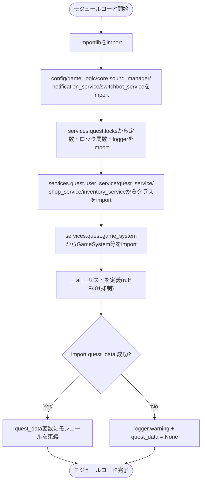
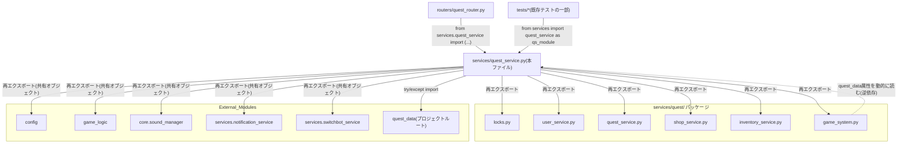

## 1. 解析メタ情報

| 項目 | 内容 |
| --- | --- |
| 対象ファイル | `services/quest_service.py` |
| 言語 | Python |
| 解析対象 | 提供されたコードのみ |
| 推測・補完 | 一切なし |

**（Issue #550で全面改訂）** 本ドキュメントは以前、1572行・5クラスを収めていた旧`services/quest_service.py`（クエスト完了・承認・ショップ・インベントリ・マスタ同期の全ロジックを1ファイルに同居させたモノリス）を文書化していた。Issue #550でそのクラス群は`services/quest/`パッケージ配下の6ファイルへ分割され、本ファイルは**既存のimportパス互換のためだけに存在する薄い再エクスポート層(シム)**として書き換えられた（115行）。実装を読む際は、以下の「関連ドキュメント」に列挙した分割後の各ファイルの仕様書を参照すること。本ファイル自体のロジックは「他モジュールからimportして`__all__`で再エクスポートする」ことと「`quest_data`モジュールのimportを試みる」ことの2点に限られる。

## 関連ドキュメント

* [quest_locks.md](./quest_locks.md) - `services/quest/locks.py`。本ファイルが再エクスポートする定数群(`JST`/`ROLE_ADULT`/`ROLE_CHILD`/`SPAM_CHECK_INTERVAL_SECONDS`/`INFINITE_QUEST_COOLDOWN_SECONDS`/`YOUTUBE_REWARD_COOLDOWN_SECONDS`)とロック関数群(`_get_completion_lock`/`_get_user_balance_lock`/`_get_purchase_lock`/`_get_item_use_lock`/`_acquire_user_balance_locks`)、`logger`の実体
* [quest_quest_service.md](./quest_quest_service.md) - `services/quest/quest_service.py`。本ファイルが再エクスポートする`QuestService`クラスの実体（クエスト完了・承認・却下・取消のドメインロジック）
* [quest_user_service.md](./quest_user_service.md) - `services/quest/user_service.py`。本ファイルが再エクスポートする`UserService`クラスの実体（家族統計・アバター管理）
* [quest_shop_service.md](./quest_shop_service.md) - `services/quest/shop_service.py`。本ファイルが再エクスポートする`ShopService`クラスの実体（報酬購入）
* [quest_inventory_service.md](./quest_inventory_service.md) - `services/quest/inventory_service.py`。本ファイルが再エクスポートする`InventoryService`クラス・`inventory_service`シングルトンの実体（アイテム使用）
* [quest_game_system.md](./quest_game_system.md) - `services/quest/game_system.py`。本ファイルが再エクスポートする`GameSystem`クラスと`game_system`/`quest_service`/`shop_service`/`user_service`の4シングルトンの実体（マスタ同期・画面集約データ生成）。**このモジュールが逆に本ファイルの`quest_data`属性を動的に参照する**（後述）
* [quest_data.md](./quest_data.md) - 本ファイルが`try: import quest_data`する対象。マスターデータ(`USERS`/`QUESTS`/`REWARDS`)の実体
* [config.md](./config.md) - `config`モジュール自体を本ファイルが再エクスポートする（分割後の各ファイルは`config`を個別にimportしているが、一部の既存テストは本ファイル経由で`config`を参照する）
* [game_logic.md](./game_logic.md) - `game_logic`モジュール自体を本ファイルが再エクスポートする
* [sound_manager.md](./sound_manager.md) - `core.sound_manager`モジュール自体を本ファイルが再エクスポートする
* [notification_service.md](./notification_service.md) - `services.notification_service`モジュール自体を本ファイルが再エクスポートする
* [switchbot_service.md](./switchbot_service.md) - `services.switchbot_service`モジュール自体を本ファイルが再エクスポートする
* [quest_router.md](./quest_router.md) - `from services.quest_service import (...)`という形で本ファイルを経由してこれら全シンボルをimportするFastAPIルーター

## 2. ファイルの概要

Issue #550で`services/quest_service.py`（旧1572行・5クラス）が`services/quest/`パッケージ(`locks.py`, `user_service.py`, `quest_service.py`, `shop_service.py`, `inventory_service.py`, `game_system.py`)へ分割された後、本ファイルに残った**下位互換の再エクスポート層**。既存の`from services.quest_service import ...`および`from services import quest_service`という2通りのimportパスを壊さないことだけを目的としており、モジュールdocstring自身が「ルーター・テストの移行は段階的に行うため、新規コードも当面はこのパスからimportして構わないが、内部実装を触る場合は`services/quest/`配下の対応するファイルを編集すること」と明記している。ロジックは一切持たず、(1) `services.quest.locks`/`user_service`/`quest_service`/`shop_service`/`inventory_service`/`game_system`から必要な全シンボルをimportして`__all__`で再エクスポートすること、(2) `config`/`game_logic`/`core.sound_manager`/`services.notification_service`/`services.switchbot_service`という5つの外部モジュール自体をこのシム経由でも同名で保持すること（既存テストが`monkeypatch.setattr(qs_module.notification_service, "send_push", ...)`のように「シム経由で辿った先の共有オブジェクト」を差し替えるため。これらのモジュール/クラスオブジェクト自体はプロセス全体で共有される単一の実体であり、どのモジュール経由で参照しても差し替えは同じ実体に効く）、(3) `quest_data`モジュールを`try/except ImportError`でimportし、`services/quest/game_system.py`の`sync_master_data`/`get_all_view_data`がこの`quest_data`属性を動的に読みに来られるようにすること、の3点に限られる。
根拠: モジュールdocstring (行番号: 1〜12 / 抜粋: "Issue #550: 1572行・5クラス同居だった本ファイルは、クラス単位で\nservices/quest/ パッケージ...へ分割された。\n\n本ファイルは既存の import パス...を壊さないための互換再エクスポート層\nとしてのみ存在する。")
根拠: コメント (行番号: 20〜26 / 抜粋: "既存テストの一部は `from services import quest_service as qs_module` の形で\n# このシムモジュールを取得し、`monkeypatch.setattr(qs_module.notification_service,\n# \"send_push\", ...)` のように\"シム経由で辿った先の共有オブジェクト\"を差し替える")

## 3. 外部依存関係

### インポート一覧

| 名称 | 種類 | 用途 | 根拠 |
| --- | --- | --- | --- |
| `importlib` | 標準ライブラリ | `__all__`経由で再エクスポートするのみ（本ファイル自体は`importlib`を直接使用しない。実際の`importlib.reload`呼び出しは`services/quest/game_system.py`側にある） | `import importlib` (行番号: 13) |
| `config` | 内部モジュール | モジュール自体を再エクスポート（テストが`monkeypatch.setattr(qs_module.config, ...)`のようにシム経由で参照するため） | `import config` (行番号: 15) |
| `game_logic` | 内部モジュール | 同上 | `import game_logic` (行番号: 16) |
| `core.sound_manager` | 内部モジュール | 同上 | `from core import sound_manager` (行番号: 17) |
| `services.notification_service` | 内部モジュール | 同上 | `from services import notification_service, switchbot_service` (行番号: 18) |
| `services.switchbot_service` | 内部モジュール | 同上 | `from services import notification_service, switchbot_service` (行番号: 18) |
| `services.quest.locks` (`INFINITE_QUEST_COOLDOWN_SECONDS`, `JST`, `ROLE_ADULT`, `ROLE_CHILD`, `SPAM_CHECK_INTERVAL_SECONDS`, `YOUTUBE_REWARD_COOLDOWN_SECONDS`, `_acquire_user_balance_locks`, `_completion_locks`, `_get_completion_lock`, `_get_item_use_lock`, `_get_purchase_lock`, `_get_user_balance_lock`, `_get_youtube_cooldown_remaining_seconds`, `_is_youtube_cooldown_enforced`, `_item_use_locks`, `_purchase_locks`, `_seconds_since_iso_timestamp`, `_user_balance_locks`, `logger`) | 内部モジュール | 分割後の実体を再エクスポート（詳細は[quest_locks.md](./quest_locks.md)） | `from services.quest.locks import (\n    INFINITE_QUEST_COOLDOWN_SECONDS,\n    ...\n    logger,\n)` (行番号: 27〜47) |
| `services.quest.user_service.UserService` | 内部モジュール | 分割後の実体を再エクスポート（詳細は[quest_user_service.md](./quest_user_service.md)） | `from services.quest.user_service import UserService` (行番号: 48) |
| `services.quest.quest_service.QuestService` | 内部モジュール | 分割後の実体を再エクスポート（詳細は[quest_quest_service.md](./quest_quest_service.md)） | `from services.quest.quest_service import QuestService` (行番号: 49) |
| `services.quest.shop_service.ShopService` | 内部モジュール | 分割後の実体を再エクスポート（詳細は[quest_shop_service.md](./quest_shop_service.md)） | `from services.quest.shop_service import ShopService` (行番号: 50) |
| `services.quest.inventory_service` (`InventoryService`, `inventory_service`) | 内部モジュール | 分割後の実体を再エクスポート（詳細は[quest_inventory_service.md](./quest_inventory_service.md)） | `from services.quest.inventory_service import InventoryService, inventory_service` (行番号: 51) |
| `services.quest.game_system` (`GameSystem`, `game_system`, `quest_service`, `shop_service`, `user_service`) | 内部モジュール | 分割後の実体を再エクスポート（詳細は[quest_game_system.md](./quest_game_system.md)） | `from services.quest.game_system import (\n    GameSystem,\n    game_system,\n    quest_service,\n    shop_service,\n    user_service,\n)` (行番号: 52〜58) |
| `quest_data`（`try/except ImportError`付き） | 内部モジュール（プロジェクトルート直下） | マスターデータのハードコードリスト(`USERS`/`QUESTS`/`REWARDS`)。`services/quest/game_system.py`の`sync_master_data`/`get_all_view_data`が本ファイルのこの属性を動的に読む | `try:\n    import quest_data\nexcept ImportError:\n    logger.warning("quest_data module not found.")\n    quest_data = None` (行番号: 115〜119) |

### ブラックボックスとなる外部要素

| 名称 | 理由 | 根拠 |
| --- | --- | --- |
| `services.quest.*`配下6ファイルの内部実装 | 本ファイルはimportして再エクスポートするのみで、実装の詳細（クエスト完了ロジック・ロック機構・マスタ同期処理等）は各ファイルの仕様書側にある | [quest_locks.md](./quest_locks.md), [quest_quest_service.md](./quest_quest_service.md), [quest_user_service.md](./quest_user_service.md), [quest_shop_service.md](./quest_shop_service.md), [quest_inventory_service.md](./quest_inventory_service.md), [quest_game_system.md](./quest_game_system.md) |
| `quest_data.USERS` / `.QUESTS` / `.REWARDS` の構造 | 定義ファイルの実体は本ファイルからは確認できない | `import quest_data` (行番号: 116) |

## 4. 主要要素の定義（関数 / エンドポイント / コンポーネント）

本ファイルはクラス・関数定義を一切持たず、import文とモジュールレベルの`__all__`リスト・`try/except`ブロックのみで構成される。以下、モジュールレベルの実体として存在する要素を列挙する。

### `__all__` (モジュールレベル変数)

* **役割**: 本ファイルがimportした全シンボル（外部モジュール5つ、`services.quest.locks`由来の定数・ロック関数18個、`UserService`/`QuestService`/`ShopService`/`InventoryService`/`inventory_service`/`GameSystem`/`game_system`/`quest_service`/`shop_service`/`user_service`、`quest_data`）の名前を列挙し、`from services.quest_service import *`や静的解析ツール(ruffのF401)に対して「これらは意図的な再エクスポートであり未使用ではない」ことを明示する。
* 根拠: `__all__ = [\n    "importlib",\n    ...\n    "quest_data",\n]` (行番号: 64〜101)、コメント (行番号: 60〜63 / 抜粋: "本ファイルはimportパス互換のための再エクスポート層であり、ここで束縛する名前は\n# すべて外部(ルーター・テスト)からの ... 利用が前提のため、\n# ruffのF401(unused-import)を抑制する。")
* **引数/リクエスト・戻り値/レスポンス・副作用・エラーハンドリング**: 該当なし（モジュールレベルのリストリテラル）
* 根拠: (行番号: 64〜101)

### `quest_data` のimportブロック

* **役割**: プロジェクトルート直下の`quest_data`モジュール（マスターデータのハードコードリスト）を`import quest_data`で取得し、モジュールレベル変数`quest_data`として保持する。Issue #487により、以前あった`except ImportError`内の`from .. import quest_data`という相対importフォールバックは削除されている。`services`はトップレベルパッケージであり親がパッケージではないため、このフォールバックは構造上決して成功しない到達不能コードだった上、mypyがこの1行で解析を停止する原因になっていたためである。`sys.path`にPROJECT_ROOTが入っているため、通常の`import quest_data`のみで解決する。
* 根拠: `try:\n    import quest_data\nexcept ImportError:\n    logger.warning("quest_data module not found.")\n    quest_data = None` (行番号: 115〜119)
* 根拠: コメント (行番号: 103〜108 / 抜粋: "Issue #487: quest_data は sys.path に PROJECT_ROOT が入っているため通常の\n# importで解決する。以前あった `from .. import quest_data` のフォールバックは、\n# services がトップレベルパッケージ...であるため構造上決して成功せず、到達不能コードだった上、\n# mypyがこの1行で解析を停止しコードベース全体を検証できなくなっていた。")
* **引数/リクエスト**: なし
* 根拠: (行番号: 115〜119)
* **戻り値/レスポンス**: なし（モジュール変数`quest_data`への代入）
* **副作用**: `quest_data`モジュールのimport（成功時）、または警告ログ出力と`quest_data = None`への代入（失敗時）
* 根拠: (行番号: 115〜119)
* **エラーハンドリング**: `ImportError`を捕捉し、警告ログを出力したうえで`quest_data`を`None`とする（例外を再送出しない）
* 根拠: `except ImportError:\n    logger.warning("quest_data module not found.")\n    quest_data = None` (行番号: 117〜119)

### `services/quest/game_system.py`との相互依存について

* **役割（本ファイルが担う側の責務）**: 本ファイルの`quest_data`属性は、`services/quest/game_system.py`の`sync_master_data`/`get_all_view_data`が`from services import quest_service as _quest_service_shim`という形で動的にimportし、`_quest_service_shim.quest_data`として毎回読みに来る対象である。`GameSystem`側が`import quest_data`でモジュールグローバルとして直接束縛せず、都度本シムモジュールを経由するのは、テストが`monkeypatch.setattr(services.quest_service, "quest_data", fake)`という形で本ファイルの属性を差し替える前提を尊重するためである。詳細は[quest_game_system.md](./quest_game_system.md)を参照。
* 根拠: コメント (行番号: 109〜114 / 抜粋: "Issue #550: GameSystem.sync_master_data/get_all_view_data は分割後\n# services/quest/game_system.py に移ったが、`quest_data` の実体はこの互換シム側に\n# 残す。テストが `monkeypatch.setattr(services.quest_service, \"quest_data\", fake)`\n# の形でこのモジュールの属性を差し替えるため、game_system.py 側は\n# `import quest_data` でモジュールグローバルとして束縛せず、都度このシムモジュールを\n# 経由して現在値を読みに行く")
* **引数/リクエスト・戻り値/レスポンス・副作用・エラーハンドリング**: 該当なし（本ファイル側にコードとしての実体は無く、コメントによる設計意図の記述のみ）

## 5. 処理フロー図

本ファイルは実行時に分岐を持つロジックを含まない。モジュールロード時の処理を以下に示す。

```mermaid
flowchart TD
    Start([モジュールロード開始]) --> ImportStd["importlibをimport"]
    ImportStd --> ImportExternal["config/game_logic/core.sound_manager/\nnotification_service/switchbot_serviceをimport"]
    ImportExternal --> ImportLocks["services.quest.locksから定数・ロック関数・loggerをimport"]
    ImportLocks --> ImportServices["services.quest.user_service/quest_service/\nshop_service/inventory_serviceからクラスをimport"]
    ImportServices --> ImportGameSystem["services.quest.game_systemからGameSystem等をimport"]
    ImportGameSystem --> DefineAll["__all__リストを定義(ruff F401抑制)"]
    DefineAll --> TryImportQuestData{"import quest_data 成功?"}
    TryImportQuestData -- Yes --> BindQuestData["quest_data変数にモジュールを束縛"]
    TryImportQuestData -- No --> WarnAndNone["logger.warning + quest_data = None"]
    BindQuestData --> End([モジュールロード完了])
    WarnAndNone --> End
```

## 6. 依存関係図

```mermaid
graph TD
    ShimFile["services/quest_service.py(本ファイル)"]

    subgraph Split_Package["services/quest/ パッケージ"]
        LocksFile["locks.py"]
        UserServiceFile["user_service.py"]
        QuestServiceFile["quest_service.py"]
        ShopServiceFile["shop_service.py"]
        InventoryServiceFile["inventory_service.py"]
        GameSystemFile["game_system.py"]
    end

    subgraph External_Modules
        ConfigMod["config"]
        GameLogicMod["game_logic"]
        SoundManagerMod["core.sound_manager"]
        NotificationMod["services.notification_service"]
        SwitchbotMod["services.switchbot_service"]
        QuestDataMod["quest_data(プロジェクトルート)"]
    end

    ShimFile -->|"再エクスポート"| LocksFile
    ShimFile -->|"再エクスポート"| UserServiceFile
    ShimFile -->|"再エクスポート"| QuestServiceFile
    ShimFile -->|"再エクスポート"| ShopServiceFile
    ShimFile -->|"再エクスポート"| InventoryServiceFile
    ShimFile -->|"再エクスポート"| GameSystemFile
    ShimFile -->|"再エクスポート(共有オブジェクト)"| ConfigMod
    ShimFile -->|"再エクスポート(共有オブジェクト)"| GameLogicMod
    ShimFile -->|"再エクスポート(共有オブジェクト)"| SoundManagerMod
    ShimFile -->|"再エクスポート(共有オブジェクト)"| NotificationMod
    ShimFile -->|"再エクスポート(共有オブジェクト)"| SwitchbotMod
    ShimFile -->|"try/except import"| QuestDataMod

    GameSystemFile -.->|"quest_data属性を動的に読む(逆依存)"| ShimFile

    QuestRouter["routers/quest_router.py"] -->|"from services.quest_service import (...)"| ShimFile
    Tests["tests/*(既存テストの一部)"] -->|"from services import quest_service as qs_module"| ShimFile
```

## 7. 次のステップ（リバースエンジニアリングの提案）

| 優先度 | ファイル名 | 理由 | 根拠 |
| --- | --- | --- | --- |
| 高 | `services/quest/quest_service.py`（[quest_quest_service.md](./quest_quest_service.md)） | クエスト完了・承認・却下・取消の実際のドメインロジックはここにある。本ファイルはこれを再エクスポートするのみ。 | `from services.quest.quest_service import QuestService` (行番号: 49) |
| 高 | `services/quest/game_system.py`（[quest_game_system.md](./quest_game_system.md)） | マスタ同期・画面集約データ生成のロジックに加え、本ファイルの`quest_data`属性への逆依存という設計上の要点を理解するため。 | `from services.quest.game_system import (...)` (行番号: 52〜58) |
| 高 | `quest_data.py`（[quest_data.md](./quest_data.md)） | `sync_master_data`で読み込まれる`USERS`/`QUESTS`/`REWARDS`の実データの型・値を確認するため。 | `import quest_data` (行番号: 116) |
| 中 | `services/quest/locks.py`（[quest_locks.md](./quest_locks.md)） | 本ファイルが再エクスポートする定数・ロック関数18個の実体と、レースコンディション対策の全体像を理解するため。 | `from services.quest.locks import (...)` (行番号: 27〜47) |
| 中 | `routers/quest_router.py`（[quest_router.md](./quest_router.md)） | 本ファイルを経由したimportの実際の利用パターン(`from services.quest_service import (...)`の内容)を確認するため。 | 関連ドキュメント欄参照 |

## 8. 保守上の注意点

* **本ファイルにロジックを追加しないこと**: モジュールdocstring自身が「内部実装を触る場合は`services/quest/`配下の対応するファイルを編集すること」と明記しており、本ファイルへ新しい関数・クラスを直接実装することは分割の意図に反する。
* 根拠: モジュールdocstring (行番号: 9〜11 / 抜粋: "新規コードも\n当面はこのパスからimportして構わないが、内部実装を触る場合は\nservices/quest/ 配下の対応するファイルを編集すること。")
* **`quest_data`の実体は本ファイルが保持し続ける**: Issue #550の分割後も`quest_data`のimportだけは本ファイルに残された。これは`services/quest/game_system.py`が`monkeypatch.setattr(services.quest_service, "quest_data", fake)`という既存テストのパターンを壊さないための意図的な設計であり、`quest_data`を`services/quest/`パッケージ側へ完全移動させると、この形式でのテストによる差し替えが効かなくなる（`GameSystem`は都度本シムを経由して`quest_data`を読みに行くため、本シムがimportそのものを持たなくなると読む対象が無くなる）。
* 根拠: コメント (行番号: 109〜114)
* **外部モジュール(config等)の再エクスポートは「同じ実体への複数の参照経路」を維持するため**: `config`/`game_logic`/`core.sound_manager`/`notification_service`/`switchbot_service`はPythonのモジュールキャッシュにより、どの経由でimportしても単一の共有オブジェクトである。本ファイル経由での再import自体は新しいオブジェクトを作らないため、`monkeypatch.setattr(qs_module.notification_service, "send_push", ...)`と`monkeypatch.setattr(services.quest.quest_service.notification_service, "send_push", ...)`は同じ属性を書き換える。この前提が崩れる変更（例: 各モジュールでの`import ... as`によるエイリアス化）を行う際は、テストへの影響を確認する必要がある。
* 根拠: コメント (行番号: 20〜26)
* **`try/except ImportError`は`ModuleNotFoundError`以外の他の例外を捕捉しない**: `quest_data.py`が存在してもその内部で`ImportError`以外の例外（構文エラー等の`SyntaxError`等）を送出する場合、この`try/except`では捕捉されずモジュールロード自体が失敗する。
* 根拠: `try:\n    import quest_data\nexcept ImportError:` (行番号: 115〜117)

## 9. 不明事項一覧

| 項目 | 理由 | 必要なファイル |
| --- | --- | --- |
| `quest_data.py`の実データ内容 | 定義ファイルの実体は本ファイルからは確認できない。 | `quest_data.py`（[quest_data.md](./quest_data.md)） |
| ルーター・テストの移行が完了する時期・条件 | モジュールdocstringは「段階的に行う」とのみ述べており、本ファイル（シム）自体をいつ廃止できるかの基準は本ファイルからは不明。 | `docs/runbooks/`配下の関連ドキュメントまたはIssue #550のその後の経過 |

## 10. 自己検証結果

* [x] 完了: 推測・外部ファイルの仕様を一切含んでいない
* [x] 完了: 全モジュールレベル要素（`__all__`、`quest_data`のimportブロック、外部モジュールとの相互依存関係）を列挙した
* [x] 完了: 全てのインポート要素を列挙した
* [x] 完了: すべての仕様説明に「根拠（行番号・抜粋）」を明記した
* [x] 完了: 根拠漏れが0件である
* [x] 完了: Mermaid構文にエラーの原因となる記号（エスケープ漏れ）がない
* [x] 完了: 不明事項を漏れなく列挙した
