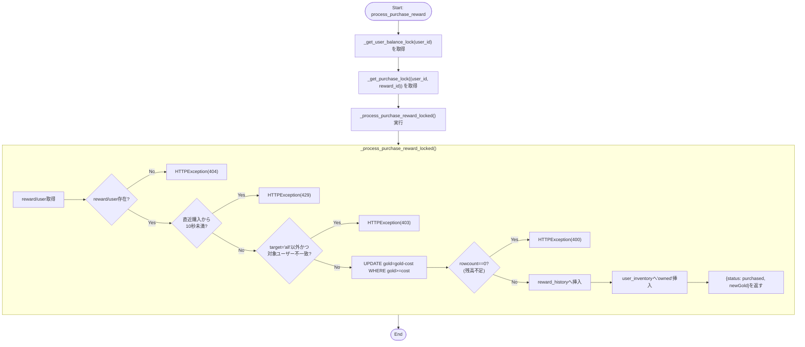
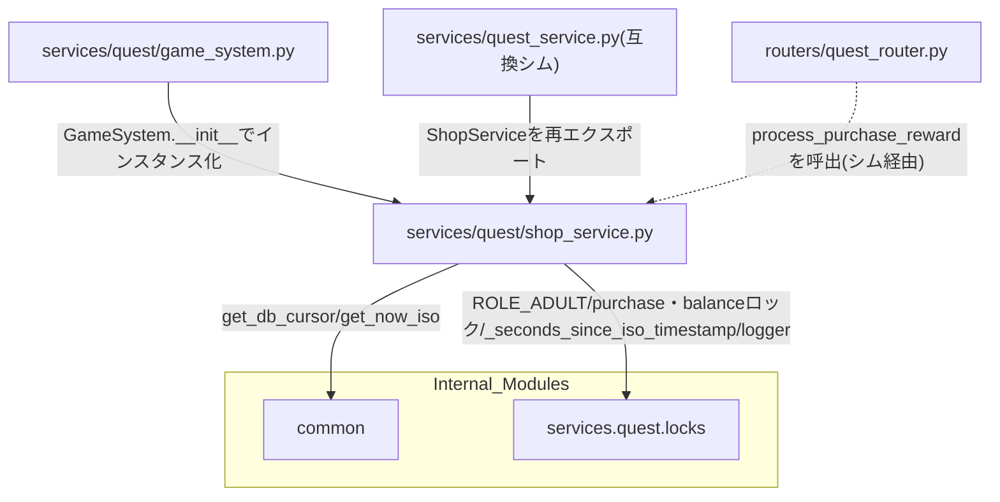

## 1. 解析メタ情報

| 項目 | 内容 |
| --- | --- |
| 対象ファイル | `MY_HOME_SYSTEM/services/quest/shop_service.py`（フルパス, disambiguation目的） |
| 言語 | Python |
| 解析対象 | 提供されたコードのみ |
| 推測・補完 | 一切なし |

同名衝突の注意: `services/quest/quest_service.py`と`services/quest_service.py`（下位互換シム）がファイル名`quest_service`で衝突するため、`services/quest/`配下の6ファイルはいずれも`quest_`を接頭辞とした名前で区別している（`dashboard_common.md`と同じ命名規約）。本ファイルは`shop_service.py`という単独の基底名のため実際には衝突しないが、命名一貫性のため`quest_shop_service.md`とした。

## 関連ドキュメント

* [quest_service.md](./quest_service.md) - `services/quest_service.py`（下位互換シム）。`from services.quest.shop_service import ShopService`として本ファイルのクラスを再エクスポートする
* [quest_locks.md](./quest_locks.md) - `ROLE_ADULT`/`_get_purchase_lock`/`_get_user_balance_lock`/`_seconds_since_iso_timestamp`/`logger`の提供元
* [quest_quest_service.md](./quest_quest_service.md) - 同じ`_get_user_balance_lock`を取得し、`quest_users`を書き換えうる経路として本ファイルと直列化の対象を共有する（`process_complete_quest`/`process_approve_quest`/`process_cancel_quest`）
* [quest_game_system.md](./quest_game_system.md) - `GameSystem.__init__`が`ShopService()`インスタンスを保持し、`shop_service = game_system.shop_service`としてモジュールレベルのシングルトンを公開する
* [common.md](./common.md) - `common.get_db_cursor`/`common.get_now_iso`を提供するモジュール
* [quest_router.md](./quest_router.md) - `process_purchase_reward`の呼び出し元と推測されるFastAPIルーター（下位互換シム経由でimportしている）

## 2. ファイルの概要

報酬購入の実処理を担う`ShopService`クラス1つを定義するファイル。`process_purchase_reward`は`user_id`単位の`_get_user_balance_lock`と`(user_id, reward_id)`単位の`_get_purchase_lock`を常にこの順(balance lock→purchase lock)で取得したうえで実処理(`_process_purchase_reward_locked`)に委譲する。実処理は、直近10秒以内の同一購入を拒否するスパムチェック、`reward['target']`によるターゲットユーザー判定、`WHERE gold >= ?`条件付きの単一UPDATEによるアトミックな残高減算、`reward_history`/`user_inventory`への挿入を1つのDBトランザクション内で行う。
根拠: `class ShopService:` (行番号: 16)、`def process_purchase_reward(self, user_id: str, reward_id: int) -> Dict[str, Any]:` (行番号: 17〜35)

## 3. 外部依存関係

### インポート一覧

| 名称 | 種類 | 用途 | 根拠 |
| --- | --- | --- | --- |
| `typing` (`Any`, `Dict`) | 標準ライブラリ | 型ヒント | `from typing import Any, Dict` (行番号: 2) |
| `fastapi.HTTPException` | 外部ライブラリ | エラーレスポンス生成 | `from fastapi import HTTPException` (行番号: 4) |
| `common` | 内部モジュール | DBカーソル取得、現在時刻(ISO)取得 | `import common` (行番号: 6) |
| `services.quest.locks` (`ROLE_ADULT`, `_get_purchase_lock`, `_get_user_balance_lock`, `_seconds_since_iso_timestamp`, `logger`) | 内部モジュール | 定数・ロックヘルパー・経過秒数計算・ロガーの共有基盤（詳細は[quest_locks.md](./quest_locks.md)参照） | `from services.quest.locks import (\n    ROLE_ADULT,\n    _get_purchase_lock,\n    _get_user_balance_lock,\n    _seconds_since_iso_timestamp,\n    logger,\n)` (行番号: 7〜13) |

### ブラックボックスとなる外部要素

| 名称 | 理由 | 根拠 |
| --- | --- | --- |
| `common.get_db_cursor()` / `common.get_now_iso()` | トランザクションスコープや接続の詳細、生成されるISO文字列のフォーマットが本ファイルからは不明 | `with common.get_db_cursor(commit=True) as cur:` (行番号: 38) |
| DBの各テーブルスキーマ | `reward_master`/`quest_users`/`reward_history`/`user_inventory`の各カラムの型・制約は本ファイルからは不明 | `cur.execute("SELECT * FROM reward_master WHERE reward_id = ?", (reward_id,))` (行番号: 39) |

## 4. 主要要素の定義（関数 / エンドポイント / コンポーネント）

### `ShopService.process_purchase_reward`

* **役割**: `user_id`単位の`_get_user_balance_lock`と`(user_id, reward_id)`単位の`_get_purchase_lock`を、常にこの順(balance lock→purchase lock)でネストして取得したうえで、実処理を`_process_purchase_reward_locked`に委譲する薄いラッパー。purchase lockは「直近の購入履歴を読む→履歴を書く」スパムチェックのTOCTOUを防ぐためのもので、残高減算自体はアトミックなUPDATEで別途保護されている。balance lockを追加取得するのは、承認/取消(`QuestService`)が行う「SELECT→Pythonで計算→絶対値でSET」という更新と、購入のアトミック減算とが競合して減算が上書きされ消失する経路を防ぐため。
* 根拠: `def process_purchase_reward(self, user_id: str, reward_id: int) -> Dict[str, Any]:` (行番号: 17〜35)
* 根拠: `with _get_user_balance_lock(user_id):\n            with _get_purchase_lock((user_id, reward_id)):\n                return self._process_purchase_reward_locked(user_id, reward_id)` (行番号: 33〜35)
* **引数/リクエスト**: `user_id: str`, `reward_id: int`
* 根拠: (行番号: 17)
* **戻り値/レスポンス**: `Dict[str, Any]`（`_process_purchase_reward_locked`の戻り値をそのまま返却）
* 根拠: (行番号: 35)
* **副作用**: 2種類のロック(user balance lock, purchase lock)の取得・解放
* 根拠: (行番号: 33〜35)
* **エラーハンドリング**: なし（内部の例外はそのまま伝播）
* 根拠: (行番号: 17〜35)

### `ShopService._process_purchase_reward_locked`

* **役割**: 報酬購入の実処理。`reward_master`/`quest_users`の存在確認後、直近の購入履歴(`reward_history`)から経過秒数を`_seconds_since_iso_timestamp`で算出し10秒未満なら429エラーとするスパムチェックを行う。`reward['target']`が`'all'`以外の場合、ユーザーのroleと`target`(`'children'`/`'adults'`/特定`user_id`)を照合し不一致なら403エラー。`UPDATE quest_users SET gold = gold - ? ... WHERE user_id = ? AND gold >= ?`という単一のアトミックUPDATEで残高チェックと減算を同時に行い、`rowcount == 0`なら残高不足として400エラー。成功後、`reward_history`へ購入履歴を、`user_inventory`へ`'owned'`ステータスの所持アイテムを挿入する。
* 根拠: `def _process_purchase_reward_locked(self, user_id: str, reward_id: int) -> Dict[str, Any]:` (行番号: 37〜101)
* 根拠: `if last_purchase and last_purchase['redeemed_at']:\n                elapsed = _seconds_since_iso_timestamp(last_purchase['redeemed_at'])\n                if elapsed is not None and elapsed < 10:\n                    raise HTTPException(status_code=429, detail="少し時間を空けてから実行してください")` (行番号: 58〜61)
* 根拠: `target = reward['target'] or 'all'\n            if target != 'all':\n                is_adult = user['role'] == ROLE_ADULT\n                allowed = (\n                    (target == 'children' and not is_adult) or\n                    (target == 'adults' and is_adult) or\n                    (target == user_id)\n                )\n                if not allowed:\n                    raise HTTPException(status_code=403, detail="This reward is not available for you")` (行番号: 63〜72)
* 根拠: `cur.execute(\n                "UPDATE quest_users SET gold = gold - ?, updated_at = ? WHERE user_id = ? AND gold >= ?",\n                (reward['cost_gold'], common.get_now_iso(), user_id, reward['cost_gold'])\n            )\n            if cur.rowcount == 0:\n                raise HTTPException(status_code=400, detail="Not enough gold")` (行番号: 77〜82)
* **引数/リクエスト**: `user_id: str`, `reward_id: int`
* 根拠: (行番号: 37)
* **戻り値/レスポンス**: `Dict[str, Any]`（`{"status": "purchased", "newGold": new_gold}`）
* 根拠: (行番号: 101)
* **副作用**: DB参照/更新（`reward_master`, `quest_users`, `reward_history`, `user_inventory`）、ログ出力
* 根拠: (行番号: 39〜40, 77〜80, 89〜97, 99)
* **エラーハンドリング**: 報酬/ユーザー不在時`HTTPException(404)`。直近購入から10秒未満なら`HTTPException(429)`。ターゲット不一致なら`HTTPException(403)`。残高不足(`UPDATE`のrowcountが0)なら`HTTPException(400)`。
* 根拠: (行番号: 42〜45, 58〜61, 71〜72, 81〜82)

## 5. 処理フロー図

## 6. 依存関係図

## 7. 次のステップ（リバースエンジニアリングの提案）

| 優先度 | ファイル名 | 理由 | 根拠 |
| --- | --- | --- | --- |
| 高 | `common.py`（[common.md](./common.md)） | トランザクションスコープの境界や`get_now_iso`の日時フォーマットを確認するため。 | `with common.get_db_cursor(commit=True) as cur:` (行番号: 38) |
| 高 | `services/quest/locks.py`（[quest_locks.md](./quest_locks.md)） | 本ファイルが取得するロックの取得順序・レースコンディション対策の全体像を理解するため。 | `from services.quest.locks import (...)` (行番号: 7〜13) |
| 中 | `routers/quest_router.py`（[quest_router.md](./quest_router.md)） | `process_purchase_reward`の実際の呼び出しコンテキスト(エンドポイントパス・リクエストモデル)を確認するため。 | 関連ドキュメント欄参照 |

## 8. 保守上の注意点

* **`process_purchase_reward`は現在プロセス内ロックとDBレベルのアトミックUPDATEを併用する**: 残高チェックと減算自体は`WHERE user_id = ? AND gold >= ?`条件付きの単一`UPDATE`文と`rowcount`判定によって、複数プロセス/複数ワーカー構成でも成立する形でレースコンディションを防いでいる。一方、「直近10秒以内の同一購入を拒否する」スパムチェック自体は`threading.Lock`ベース（`_get_purchase_lock`）であり、複数プロセス/複数ワーカー構成では別プロセスからの同時リクエストまでは防げない。
* 根拠: `cur.execute("UPDATE quest_users SET gold = gold - ?, updated_at = ? WHERE user_id = ? AND gold >= ?", ...)` および `if cur.rowcount == 0: raise HTTPException(status_code=400, detail="Not enough gold")` (行番号: 77〜82)
* **スパムチェックの10秒という値はハードコード**: `QuestService`側の`SPAM_CHECK_INTERVAL_SECONDS`(10)と同じ値だが、本ファイルは`services.quest.locks`の定数を参照せず`10`というリテラルを直接使用している。将来この間隔を変更する場合、両ファイルを個別に修正する必要がある。
* 根拠: `if elapsed is not None and elapsed < 10:` (行番号: 60)
* **`target`によるターゲット判定は`reward['target']`が`'children'`/`'adults'`/特定`user_id`/`None`(=`'all'`扱い)のいずれかであることを前提とする**: これら以外の未知の文字列が入った場合、`allowed`はいずれの条件にも一致せず`False`となり、常に403エラーとなる。
* 根拠: `target = reward['target'] or 'all'\n            if target != 'all':` (行番号: 63〜64)

## 9. 不明事項一覧

| 項目 | 理由 | 必要なファイル |
| --- | --- | --- |
| DB各テーブルのスキーマ | `reward_master`/`quest_users`/`reward_history`/`user_inventory`の各カラムの型・制約が本ファイルからは不明。 | DBのDDL、マイグレーション定義ファイル |
| `common.get_now_iso`の形式 | ミリ秒・タイムゾーン情報の有無が本ファイルからは不明。 | `common.py` |
| `reward['target']`が取りうる値の完全な一覧 | 本ファイルからは`'all'`/`'children'`/`'adults'`/特定`user_id`の4パターンの扱いのみ確認できるが、`reward_master`テーブル・`quest_data.py`側の実データにこれ以外の値が存在するかは不明。 | `quest_data.py`, `reward_master`テーブルの実データ |

## 10. 自己検証結果

* [x] 完了: 推測・外部ファイルの仕様を一切含んでいない
* [x] 完了: 全関数・全クラス・全メソッドを列挙した
* [x] 完了: 全てのインポート要素を列挙した
* [x] 完了: すべての仕様説明に「根拠（行番号・抜粋）」を明記した
* [x] 完了: 根拠漏れが0件である
* [x] 完了: Mermaid構文にエラーの原因となる記号（エスケープ漏れ）がない
* [x] 完了: 不明事項を漏れなく列挙した
