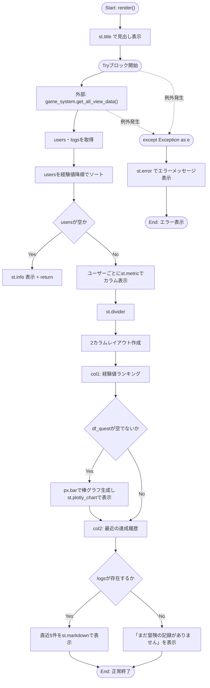
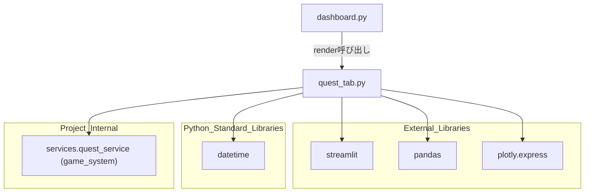

## 1. 解析メタ情報

| 項目 | 内容 |
| --- | --- |
| 対象ファイル | `views/dashboard/quest_tab.py` |
| 言語 | Python |
| 解析対象 | 提供されたコードのみ |
| 推測・補完 | 一切なし |

## 関連ドキュメント

* [quest_service.md](./quest_service.md) - `services.quest_service.game_system`の実体。`get_all_view_data`を提供する呼び出し先
* [dashboard.md](./dashboard.md) - 呼び出し元。`views.dashboard.quest_tab`をインポートし、クエストタブとして`quest_tab.render()`を呼び出す
* [dashboard_common.md](./dashboard_common.md) - 同じ`views/dashboard`パッケージ内の共通CSS/カード生成モジュール（本ファイルからは直接インポートされていない）

## 2. ファイルの概要

* Streamlitダッシュボードの「Family Quest」タブを描画するモジュール。`services.quest_service.game_system`から取得したユーザー（家族メンバー）の経験値・ゴールド情報と達成ログを表示する。
* 根拠: `st.title("⚔️ Family Quest 現在の状況")` (行番号: 10 / 抜粋: "st.title(\"⚔️ Family Quest 現在の状況\")")
* ユーザー一覧を経験値降順にソートし、各ユーザーの経験値・職業・ゴールドを`st.metric`で横並びに表示する。1位のユーザーには王冠アイコン、それ以外は盾アイコンを付与する。
* 根拠: `users.sort(key=lambda x: x['exp'], reverse=True)` および `rank_icon = "👑" if i == 0 else "🛡️"` (行番号: 18, 27 / 抜粋: "users.sort(key=lambda x: x['exp'], reverse=True)")
* 経験値ランキングをPlotlyの棒グラフ（職業別に色分け）で可視化する列と、直近5件の達成履歴（クエストログ）をMarkdownで表示する列の2カラムレイアウトを持つ。
* 根拠: `fig = px.bar(...)` および `for log in logs[:5]:` (行番号: 43〜50, 59 / 抜粋: "fig = px.bar(")
* データ取得・描画処理全体を`try...except`で囲み、例外発生時は画面上にエラーメッセージを表示する。
* 根拠: `except Exception as e:` (行番号: 65〜66 / 抜粋: "except Exception as e:\n        st.error(f\"クエスト情報の読み込みに失敗しました: {e}\")")

## 3. 外部依存関係

### インポート一覧

| 名称 | 種類 | 用途 | 根拠 |
| --- | --- | --- | --- |
| `streamlit` | 外部ライブラリ | UI描画全般（タイトル、カラム、メトリクス、Markdown表示等） | `import streamlit as st` (行番号: 2 / 抜粋: "import streamlit as st") |
| `pandas` | 外部ライブラリ | ユーザーリストを`DataFrame`化しグラフ描画用に整形 | `import pandas as pd` (行番号: 3 / 抜粋: "import pandas as pd") |
| `plotly.express` | 外部ライブラリ | 経験値ランキングの棒グラフ生成 | `import plotly.express as px` (行番号: 4 / 抜粋: "import plotly.express as px") |
| `datetime` | 標準ライブラリ | インポートされているが、本ファイル内では使用されていない | `from datetime import datetime` (行番号: 5 / 抜粋: "from datetime import datetime") |
| `game_system` | 内部モジュール | クエスト・ユーザー・ログデータの取得 (`get_all_view_data`) | `from services.quest_service import game_system` (行番号: 6 / 抜粋: "from services.quest_service import game_system") |

### ブラックボックスとなる外部要素

| 名称 | 理由 | 根拠 |
| --- | --- | --- |
| `game_system.get_all_view_data()` | `services.quest_service`の実装が提供されておらず、戻り値の辞書（`users`, `logs`キー以外の内容や、各要素の完全なスキーマ）の詳細が不明。 | `data = game_system.get_all_view_data()` (行番号: 13 / 抜粋: "data = game_system.get_all_view_data()") |

## 4. 主要要素の定義（関数 / エンドポイント / コンポーネント）

### `render`

* **役割**: Family Questタブ全体（メンバーごとの経験値メトリクス、経験値ランキングの棒グラフ、直近の達成履歴）を描画する。
* 根拠: `def render():` (行番号: 8〜66 / 抜粋: "def render():")

* **引数/リクエスト**: なし
* 根拠: `def render():` (行番号: 8 / 抜粋: "def render():")

* **戻り値/レスポンス**: なし（`users`が空の場合は早期`return`でStreamlit UIへの描画を中断する）
* 根拠: `if not users:\n            st.info("データがありません。")\n            return` (行番号: 20〜22 / 抜粋: "if not users:")

* **副作用**:
    * `game_system.get_all_view_data()`経由の外部データ取得。
    * `st.title`, `st.metric`, `st.divider`, `st.subheader`, `st.plotly_chart`, `st.markdown`, `st.write`, `st.info`, `st.error`によるStreamlit画面への描画。
    * `users`リストを経験値降順に破壊的にソートする（`list.sort`はin-place）。
* 根拠: `users.sort(key=lambda x: x['exp'], reverse=True)` (行番号: 18 / 抜粋: "users.sort(key=lambda x: x['exp'], reverse=True)"), `st.plotly_chart(fig, width="stretch")` (行番号: 52 / 抜粋: "st.plotly_chart(fig, width=\"stretch\")")

* **エラーハンドリング**: 関数本体全体（データ取得からUI描画まで）を`try...except Exception as e:`で捕捉し、例外発生時は`st.error`でエラーメッセージ（例外内容込み）を画面表示する。処理は再送出されない。
* 根拠: `except Exception as e:\n        st.error(f"クエスト情報の読み込みに失敗しました: {e}")` (行番号: 65〜66 / 抜粋: "except Exception as e:")

## 5. 処理フロー図

## 6. 依存関係図

## 7. 次のステップ（リバースエンジニアリングの提案）

| 優先度 | ファイル名(推測可) | 理由 | 根拠 |
| --- | --- | --- | --- |
| 高 | `services/quest_service.py` | `game_system.get_all_view_data()`が返す`users`・`logs`の正確なスキーマ（各要素のキー、型）を把握し、本タブの表示ロジックの前提を検証するため。 | `data = game_system.get_all_view_data()` (行番号: 13 / 抜粋: "data = game_system.get_all_view_data()") |

## 8. 保守上の注意点

* **未使用インポート**: `datetime`がインポートされているが、本ファイル内のいかなる箇所でも使用されていない。Lintツールで未使用インポート警告が発生しうる。
* 根拠: `from datetime import datetime` (行番号: 5 / 抜粋: "from datetime import datetime")

* **リストの破壊的ソート**: `users.sort(...)`は`game_system.get_all_view_data()`が返した`data["users"]`リストをin-placeでソートする。呼び出し元が同一オブジェクトを他所でも参照・再利用している場合、意図せず順序が変更される可能性がある。
* 根拠: `users.sort(key=lambda x: x['exp'], reverse=True)` (行番号: 18 / 抜粋: "users.sort(key=lambda x: x['exp'], reverse=True)")

* **広範な例外キャッチ**: `except Exception as e:`でデータ取得からUI描画までの全処理を一括して捕捉しており、`KeyError`（`u['exp']`等のキー欠損）とネットワーク/DBエラーが区別されずに同一のエラーメッセージとして表示される。ログ出力（`logging`）は行われていない。
* 根拠: `except Exception as e:\n        st.error(f"クエスト情報の読み込みに失敗しました: {e}")` (行番号: 65〜66 / 抜粋: "except Exception as e:")

* **コメントと実装の不一致**: 59行目直前のコメントは `logs`の要素を`{'text':..., 'dateStr':...}`のリストと説明しているが、実際のコード（60行目）では`log['timestamp']`が参照されており、キー名の不一致がある。
* 根拠: `# logsは {'text':..., 'dateStr':...} のリスト` と `{log['timestamp']}` (行番号: 57, 60 / 抜粋: "# logsは {'text':..., 'dateStr':...} のリスト")

## 9. 不明事項一覧

| 項目 | 理由 | 必要なファイル |
| --- | --- | --- |
| `game_system.get_all_view_data()`の正確な戻り値スキーマ | `services.quest_service`の実装が提供されていないため、`users`・`logs`以外のキーの有無や各フィールドの型が不明。 | `services/quest_service.py` |
| `logs`要素の正しいキー名 | コード上のコメントと実際の参照キー（`timestamp`）に不一致があり、どちらが正しい仕様か本ファイル単体では判断できない。 | `services/quest_service.py` |

## 10. 自己検証結果

* [x] 推測・外部ファイルの仕様を一切含んでいない
* [x] 全関数・全クラス・全コンポーネントを列挙した
* [x] 全てのインポート要素を列挙した
* [x] すべての仕様説明に「根拠（行番号・抜粋）」を明記した
* [x] 根拠漏れが0件である
* [x] Mermaid構文にエラーの原因となる記号（エスケープ漏れ）がない
* [x] 不明事項を漏れなく列挙した
