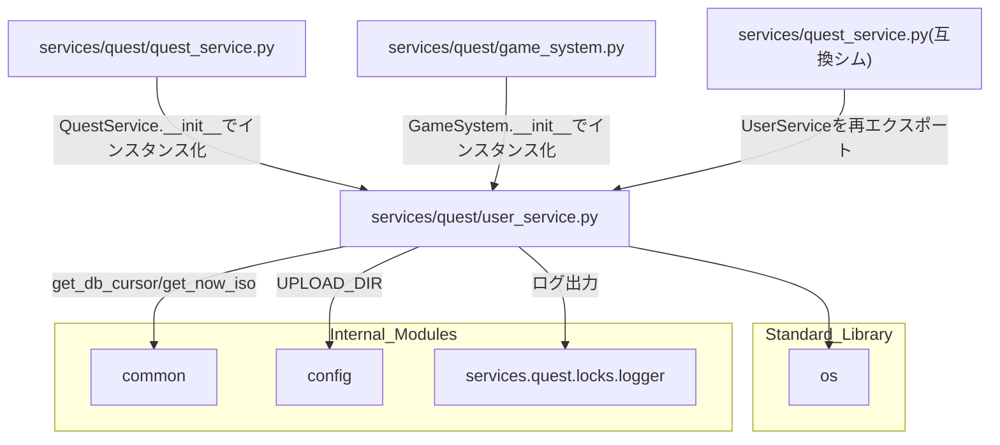

## 1. 解析メタ情報

| 項目 | 内容 |
| --- | --- |
| 対象ファイル | `MY_HOME_SYSTEM/services/quest/user_service.py`（フルパス, disambiguation目的） |
| 言語 | Python |
| 解析対象 | 提供されたコードのみ |
| 推測・補完 | 一切なし |

同名衝突の注意: `services/quest/quest_service.py`と`services/quest_service.py`（下位互換シム）がファイル名`quest_service`で衝突するため、`services/quest/`配下の6ファイルはいずれも`quest_`を接頭辞とした名前で区別している（`dashboard_common.md`と同じ命名規約）。本ファイルは`user_service.py`という単独の基底名のため実際には衝突しないが、命名一貫性のため`quest_user_service.md`とした。

## 関連ドキュメント

* [quest_service.md](./quest_service.md) - `services/quest_service.py`（下位互換シム）。`from services.quest.user_service import UserService`として本ファイルのクラスを再エクスポートする
* [quest_locks.md](./quest_locks.md) - `logger`のみを本ファイルにimportさせる（ロック関数は使用しない）
* [quest_quest_service.md](./quest_quest_service.md) - `QuestService.__init__`が`UserService()`インスタンスを保持する（`self.user_service`）ため、本ファイルへ依存する
* [quest_game_system.md](./quest_game_system.md) - `GameSystem.__init__`が`UserService()`インスタンスを保持する
* [common.md](./common.md) - `common.get_db_cursor`/`common.get_now_iso`の実体
* [config.md](./config.md) - `config.UPLOAD_DIR`の提供元（`_delete_orphaned_avatar`/`delete_unlinked_avatar`が参照）
* [quest_router.md](./quest_router.md) - `user_service.get_family_chronicle`/`update_avatar`/`delete_unlinked_avatar`の呼び出し元と推測されるFastAPIルーター

## 2. ファイルの概要

`quest_users`テーブルを中心とした、家族の統計情報(`get_family_chronicle`)・冒険ログ(`_fetch_full_adventure_logs`)の集約と、ユーザーのアバター画像の更新・削除(`update_avatar`/`_delete_orphaned_avatar`/`delete_unlinked_avatar`)を担う`UserService`クラス1つを定義するファイル。アバター関連の3メソッドはいずれも`config.UPLOAD_DIR`配下のアップロード済み画像ファイルをディスクから安全に削除するための、パストラバーサル対策とファイル参照確認を伴う処理である。
根拠: `class UserService:` (行番号: 12)、`def get_family_chronicle(self) -> Dict[str, Any]:` (行番号: 13)、`def update_avatar(self, user_id: str, avatar_url: str) -> Dict[str, Any]:` (行番号: 66)

## 3. 外部依存関係

### インポート一覧

| 名称 | 種類 | 用途 | 根拠 |
| --- | --- | --- | --- |
| `os` | 標準ライブラリ | `_delete_orphaned_avatar`/`delete_unlinked_avatar`が、ファイル名抽出(`os.path.basename`)・パス結合(`os.path.join`)・パストラバーサル対策(`os.path.dirname`/`os.path.normpath`)・存在確認と削除(`os.path.exists`/`os.remove`)に使用 | `import os` (行番号: 2) |
| `typing` (`Any`, `Dict`, `List`, `Optional`) | 標準ライブラリ | 型ヒント | `from typing import Any, Dict, List, Optional` (行番号: 3) |
| `fastapi.HTTPException` | 外部ライブラリ | エラーレスポンス生成 | `from fastapi import HTTPException` (行番号: 5) |
| `common` | 内部モジュール | DBカーソル取得(`get_db_cursor`)、現在時刻(ISO)取得(`get_now_iso`) | `import common` (行番号: 7) |
| `config` | 内部モジュール | `UPLOAD_DIR`の参照 | `import config` (行番号: 8) |
| `services.quest.locks.logger` | 内部モジュール | ログ出力 | `from services.quest.locks import logger` (行番号: 9) |

### ブラックボックスとなる外部要素

| 名称 | 理由 | 根拠 |
| --- | --- | --- |
| `common.get_db_cursor()` / `common.get_now_iso()` | トランザクションスコープや接続の詳細、生成されるISO文字列のフォーマットが本ファイルからは不明 | `with common.get_db_cursor() as cur:` (行番号: 14) |
| `config.UPLOAD_DIR`の実際の値 | `config.py`側の定義が本ファイルからは不明 | `file_path = os.path.join(config.UPLOAD_DIR, filename)` (行番号: 102, 129) |
| DBの各テーブルスキーマ | `quest_users`/`quest_history`/`reward_history`の各カラムの型・制約は本ファイルからは不明 | `cur.execute("SELECT level, gold FROM quest_users")` (行番号: 15) |

## 4. 主要要素の定義（関数 / エンドポイント / コンポーネント）

### `UserService.get_family_chronicle`

* **役割**: `quest_users`の合計レベル・合計ゴールド、`quest_history`の総件数(`status = 'approved' AND quest_id != 0`。承認待ち行と`InventoryService.use_item`がquest_id=0で挿入する「アイテム使用」行を除外)から家族のランク(4段階のしきい値、"駆け出しの家族"〜"伝説のギルド")を判定し、`_fetch_full_adventure_logs`で取得した冒険ログとともに返す。
* 根拠: `def get_family_chronicle(self) -> Dict[str, Any]:` (行番号: 13〜39)
* 根拠: `res = cur.execute("SELECT COUNT(*) as count FROM quest_history WHERE status = 'approved' AND quest_id != 0").fetchone()` (行番号: 22)、コメント (行番号: 18〜21 / 抜粋: "Q-L5(#409): 承認待ち(pending)行と、use_item が quest_id=0 で挿入する\n            # 「アイテム使用」行は達成クエスト数に含めない。")
* **引数/リクエスト**: なし（`self`のみ）
* 根拠: (行番号: 13)
* **戻り値/レスポンス**: `Dict[str, Any]`（`stats: {totalLevel, totalGold, totalQuests, partyRank}` と `chronicle`）
* 根拠: (行番号: 36〜39 / 抜粋: "return {\n            \"stats\": {\"totalLevel\": total_level, \"totalGold\": total_gold, \"totalQuests\": total_quests, \"partyRank\": rank},\n            \"chronicle\": logs\n        }")
* **副作用**: DB参照（`quest_users`, `quest_history`。`_fetch_full_adventure_logs`経由で`reward_history`も参照）
* 根拠: (行番号: 15, 22, 34)
* **エラーハンドリング**: なし
* 根拠: (行番号: 13〜39)

### `UserService._fetch_full_adventure_logs`

* **役割**: `quest_history`(`status='approved' AND quest_id != 0`、`completed_at`降順、最大100件)と`reward_history`(`redeemed_at`降順、最大100件)を取得しマージ、`ts`降順で先頭100件に切り詰めたうえで、`quest_users`から取得した各ユーザーの名前・アバターを付与し、種別ごとの表示テキスト(`"{name}は {title} を達成した！"`等)と日付文字列(`T`区切りまたは半角スペース区切りの先頭部分)を整形して返す。ユーザーが`quest_users`に見つからない場合は`{"name": "旅人", "avatar": "👤"}`のプレースホルダを使う。
* 根拠: `def _fetch_full_adventure_logs(self, cur) -> List[dict]:` (行番号: 41〜64)
* 根拠: `q_rows = cur.execute("SELECT 'quest' as type, ... FROM quest_history WHERE status='approved' AND quest_id != 0 ORDER BY completed_at DESC LIMIT 100").fetchall()` (行番号: 43)
* **引数/リクエスト**: `cur`（呼び出し元のトランザクション内で使うDBカーソル）
* 根拠: (行番号: 41)
* **戻り値/レスポンス**: `List[dict]`（各要素は`type`, `userId`, `userName`, `userAvatar`, `title`, `text`, `gold`, `exp`, `timestamp`, `dateStr`）
* 根拠: (行番号: 58〜63)
* **副作用**: DB参照（`quest_history`, `reward_history`, `quest_users`）
* 根拠: (行番号: 43, 44, 47)
* **エラーハンドリング**: なし（`ev['type']`が`'quest'`/`'reward'`のいずれでもない場合`text`は空文字のまま。SQLの`type`リテラルが`'quest'`/`'reward'`のみのため実際には発生しない）
* 根拠: (行番号: 52〜56)

### `UserService.update_avatar`

* **役割**: 対象ユーザーの存在を確認したうえで`quest_users.avatar`を更新する。更新前の`avatar`列の値を`old_avatar`として保持し、`get_db_cursor(commit=True)`のトランザクション内で、旧アバターを他ユーザーが参照していないか(`SELECT 1 FROM quest_users WHERE avatar = ? AND user_id != ?`)を確認する。トランザクションを抜けた後、他ユーザーからの参照が無い場合のみ`_delete_orphaned_avatar`を呼び出して旧アバターファイルの削除を試みる。
* 根拠: `def update_avatar(self, user_id: str, avatar_url: str) -> Dict[str, Any]:` (行番号: 66〜89)
* 根拠: `still_referenced = cur.execute(\n                "SELECT 1 FROM quest_users WHERE avatar = ? AND user_id != ? LIMIT 1",\n                (old_avatar, user_id),\n            ).fetchone() is not None` (行番号: 80〜83)、`if not still_referenced:\n            self._delete_orphaned_avatar(old_avatar, avatar_url)` (行番号: 87〜88)
* **引数/リクエスト**: `user_id: str`, `avatar_url: str`
* 根拠: (行番号: 66)
* **戻り値/レスポンス**: `Dict[str, Any]`（`{"status": "updated", "avatar": avatar_url}`）
* 根拠: (行番号: 89)
* **副作用**: DB更新（`quest_users.avatar`/`updated_at`）、DB参照（他ユーザーの`avatar`参照確認）、ログ出力、`_delete_orphaned_avatar`の呼び出しによるファイル削除の試行（`get_db_cursor`のトランザクション外・他ユーザーからの参照が無い場合のみ）
* 根拠: (行番号: 74〜75, 80〜83, 85, 87〜88)
* **エラーハンドリング**: ユーザー不在時に`HTTPException(status_code=404, detail="User not found")`
* 根拠: (行番号: 69〜70)

### `UserService._delete_orphaned_avatar`

* **役割**: アバター差し替え後にディスクへ残り続ける旧アバターファイルの削除を試みる。`old_avatar`が空/`None`、新旧URLが同一、または`/uploads/`配下のパスでない(絵文字などアップロードファイル以外の値)場合はいずれも早期`return`で何もしない。パストラバーサル対策として、`old_avatar`から`os.path.basename`でファイル名部分のみを取り出し`config.UPLOAD_DIR`と結合したうえで、結合結果の親ディレクトリが正規化済み`config.UPLOAD_DIR`と一致することを確認してから削除する。
* 根拠: `def _delete_orphaned_avatar(self, old_avatar: Optional[str], new_avatar: str) -> None:` (行番号: 91〜111)
* 根拠: `if not old_avatar or old_avatar == new_avatar:\n            return\n        if not old_avatar.startswith("/uploads/"):\n            return` (行番号: 96〜99)、`if os.path.dirname(file_path) != os.path.normpath(config.UPLOAD_DIR):\n            return` (行番号: 103〜104)
* **引数/リクエスト**: `old_avatar: Optional[str]`（更新前のavatar列の値）, `new_avatar: str`（更新後のavatar URL）
* 根拠: (行番号: 91)
* **戻り値/レスポンス**: なし（`-> None`）
* 根拠: (行番号: 91)
* **副作用**: 条件を満たす場合、ローカルファイルシステムから旧アバターファイルを削除(`os.remove`)。削除成功時はログ出力(`logger.info`)。
* 根拠: `os.remove(file_path)\n                logger.info(f"Orphaned avatar removed: {file_path}")` (行番号: 108〜109)
* **エラーハンドリング**: 各早期returnの条件（`old_avatar`が無い/同一/`/uploads/`配下でない/パストラバーサル対策の一致チェックに失敗）はいずれも例外を送出せず何もしない。`os.remove`が`OSError`を送出した場合は`except OSError`で捕捉し警告ログを出力するのみで再送出しない。
* 根拠: `except OSError as e:\n            logger.warning(f"Failed to remove orphaned avatar {file_path}: {e}")` (行番号: 110〜111)

### `UserService.delete_unlinked_avatar`

* **役割**: `AvatarUploader.tsx`側の2段階アップロードフロー（1. 画像アップロード→2. `/user/update`でのユーザーへの紐付け）のうち2段階目が失敗した際のロールバック用。`filename`から`os.path.basename`でファイル名部分のみを取り出し`config.UPLOAD_DIR`と結合し、結合結果の親ディレクトリが正規化済み`UPLOAD_DIR`と一致することを確認してパストラバーサルを防ぐ。加えて`quest_users`テーブルに当該ファイルを`avatar`として参照する行が1件でも存在すれば削除しない（安全策）。
* 根拠: `def delete_unlinked_avatar(self, filename: str) -> bool:` (行番号: 113〜149)、docstring (行番号: 114〜127 / 抜粋: "#442: AvatarUploader.tsxの2段階アップロード...")
* **引数/リクエスト**: `filename: str`（削除対象のアップロード済みファイル名。ディレクトリ部分は`os.path.basename`で無視される）
* 根拠: (行番号: 113, 128)
* **戻り値/レスポンス**: `bool`（実際に削除できた場合のみ`True`。参照中・パス不正・ファイル未存在・削除失敗時は`False`）
* 根拠: 各`return`文 (行番号: 131, 139, 143, 146, 149)
* **副作用**: `config.UPLOAD_DIR`配下のパス解決、DB参照(`common.get_db_cursor()`で`quest_users.avatar`を参照確認)、条件を満たす場合のファイル削除(`os.remove`)、削除成功時のログ出力(`logger.info`)
* 根拠: `with common.get_db_cursor() as cur:\n            still_referenced = cur.execute(\n                "SELECT 1 FROM quest_users WHERE avatar = ? LIMIT 1", (avatar_value,)\n            ).fetchone() is not None` (行番号: 134〜137)、`os.remove(file_path)\n            logger.info(f"Unlinked avatar removed (rollback): {file_path}")` (行番号: 144〜145)
* **エラーハンドリング**: パストラバーサル対策の一致チェックに失敗した場合、いずれかのユーザーから参照中の場合、対象ファイルが存在しない場合はいずれも`False`を返す（例外は送出しない）。`os.remove`が`OSError`を送出した場合は`except OSError`で捕捉し警告ログを出力したうえで`False`を返す。
* 根拠: `if os.path.dirname(file_path) != os.path.normpath(config.UPLOAD_DIR):\n            return False` (行番号: 130〜131)、`if still_referenced:\n            return False` (行番号: 138〜139)、`if not os.path.exists(file_path):\n                return False` (行番号: 142〜143)、`except OSError as e:\n            logger.warning(f"Failed to remove unlinked avatar {file_path}: {e}")\n            return False` (行番号: 147〜149)

## 5. 処理フロー図

## 6. 依存関係図

## 7. 次のステップ（リバースエンジニアリングの提案）

| 優先度 | ファイル名 | 理由 | 根拠 |
| --- | --- | --- | --- |
| 高 | `common.py`（[common.md](./common.md)） | トランザクションスコープの境界や`get_now_iso`の日時フォーマットを確認するため。 | `with common.get_db_cursor(commit=True) as cur:` (行番号: 67) |
| 中 | `config.py`（[config.md](./config.md)） | `UPLOAD_DIR`の実際の値・ディレクトリ構成を確認するため。 | `config.UPLOAD_DIR` (行番号: 102, 129) |
| 中 | `routers/quest_router.py`（[quest_router.md](./quest_router.md)） | `delete_unlinked_avatar`/`update_avatar`/`get_family_chronicle`の実際の呼び出しコンテキスト(HTTPメソッド・エンドポイントパス)を確認するため。 | 関連ドキュメント欄参照 |

## 8. 保守上の注意点

* **`_delete_orphaned_avatar`と`delete_unlinked_avatar`はほぼ同一のパストラバーサル対策ロジックを個別に実装している**: 両者とも「`os.path.basename`でファイル名抽出→`UPLOAD_DIR`と結合→`os.path.dirname`の一致確認」という同じパターンをそれぞれ独立に書いており、共通ヘルパーへの統合はされていない。
* 根拠: (行番号: 101〜104, 128〜131)
* **`_fetch_full_adventure_logs`は`ev['type']`が`'quest'`/`'reward'`以外の値になり得ない前提**: SQLの`SELECT 'quest' as type`/`SELECT 'reward' as type`というリテラルに依存しており、将来他の種別のログをマージする場合は`text`組み立てのif/elif分岐を追加する必要がある。
* 根拠: (行番号: 43, 44, 53, 55)
* **`update_avatar`のファイル削除はベストエフォート・トランザクション外**: DBのUPDATEコミットとファイル削除は別ステップであり、アトミックではない。`_delete_orphaned_avatar`は`OSError`を握りつぶすため、アバター更新自体のレスポンスには一切影響しない。
* 根拠: `self._delete_orphaned_avatar(old_avatar, avatar_url)` (行番号: 88、`with common.get_db_cursor(commit=True)`ブロックの外)、`except OSError as e:` (行番号: 110)

## 9. 不明事項一覧

| 項目 | 理由 | 必要なファイル |
| --- | --- | --- |
| DB各テーブルのスキーマ | `quest_users`/`quest_history`/`reward_history`の各カラムの型・制約は本ファイルからは不明。 | DBのDDL、マイグレーション定義ファイル |
| `config.UPLOAD_DIR`の実際の値 | `.env`依存の実値は本ファイルからは確認できない。 | `config.py`, `.env`（gitignore対象） |
| `common.get_now_iso`の形式 | ミリ秒・タイムゾーン情報の有無が本ファイルからは不明。 | `common.py` |

## 10. 自己検証結果

* [x] 完了: 推測・外部ファイルの仕様を一切含んでいない
* [x] 完了: 全関数・全クラス・全メソッドを列挙した
* [x] 完了: 全てのインポート要素を列挙した
* [x] 完了: すべての仕様説明に「根拠（行番号・抜粋）」を明記した
* [x] 完了: 根拠漏れが0件である
* [x] 完了: Mermaid構文にエラーの原因となる記号（エスケープ漏れ）がない
* [x] 完了: 不明事項を漏れなく列挙した
