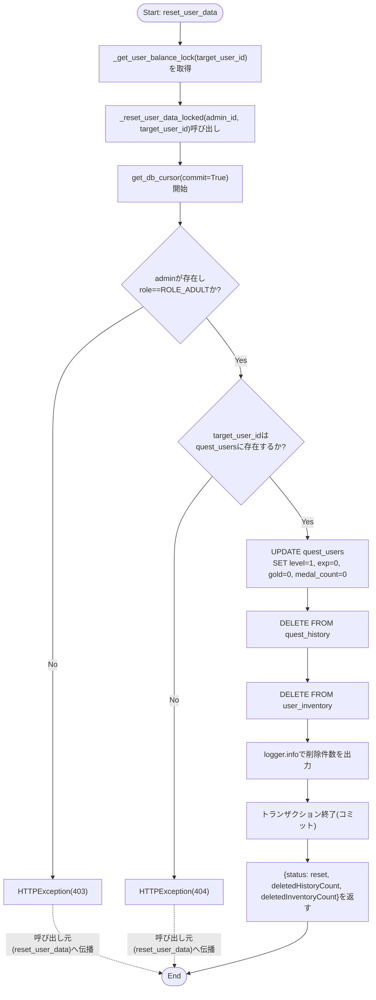
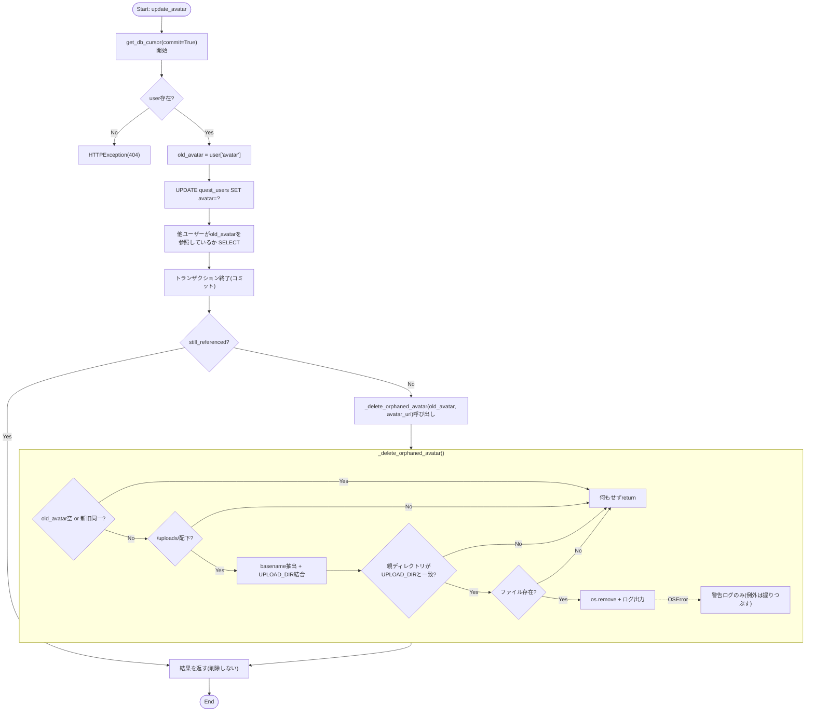
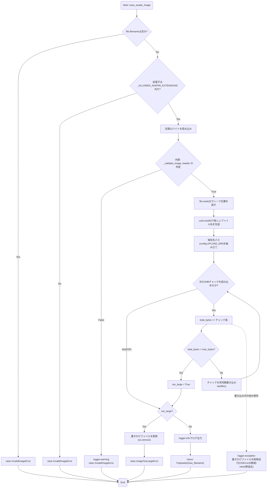

## 1. 解析メタ情報

| 項目 | 内容 |
| --- | --- |
| 対象ファイル | `MY_HOME_SYSTEM/services/quest/user_service.py`（フルパス, disambiguation目的） |
| 言語 | Python |
| 解析対象 | 提供されたコードのみ |
| 推測・補完 | 一切なし |

同名衝突の注意: `services/quest/quest_service.py`と`services/quest_service.py`（下位互換シム）がファイル名`quest_service`で衝突するため、`services/quest/`配下の6ファイルはいずれも`quest_`を接頭辞とした名前で区別している（`dashboard_common.md`と同じ命名規約）。本ファイルは`user_service.py`という単独の基底名のため実際には衝突しないが、命名一貫性のため`quest_user_service.md`とした。

## 関連ドキュメント

* [quest_service.md](./quest_service.md) - `services/quest_service.py`（下位互換シム）。`from services.quest.user_service import UserService, InvalidImageError, ImageTooLargeError`として本ファイルのクラス・例外を再エクスポートする
* [quest_locks.md](./quest_locks.md) - **（Issue #547で変更）** 従来`logger`のみを本ファイルにimportさせていたが、`ROLE_ADULT`（管理者ロール定数）と`_get_user_balance_lock`（ユーザー単位の排他ロック取得関数）も新たにimportして`reset_user_data`/`_reset_user_data_locked`が使用する
* [quest_quest_service.md](./quest_quest_service.md) - `QuestService.__init__`が`UserService()`インスタンスを保持する（`self.user_service`）ため、本ファイルへ依存する
* [quest_game_system.md](./quest_game_system.md) - `GameSystem.__init__`が`UserService()`インスタンスを保持する
* [common.md](./common.md) - `common.get_db_cursor`/`common.get_now_iso`の実体
* [config.md](./config.md) - `config.UPLOAD_DIR`（`_delete_orphaned_avatar`/`save_avatar_image`/`delete_unlinked_avatar`が参照）および`config.UPLOAD_MAX_FILE_SIZE_MB`（**Issue #551で追加**、`save_avatar_image`が参照）の提供元
* [quest_router.md](./quest_router.md) - `user_service.get_family_chronicle`/`update_avatar`/`delete_unlinked_avatar`/`save_avatar_image`の呼び出し元FastAPIルーター。**（Issue #551で追加）** `routers/quest_router.py`の`upload_image`エンドポイントに直書きされていた画像検証・保存ロジック（旧`validate_image_header`関数含む）は本ファイルの`save_avatar_image`へ移設され、ルーター側は`InvalidImageError`/`ImageTooLargeError`を捕捉してHTTPステータスへ変換するだけの薄い委譲コードになった。**（Issue #547で追加）** 新設の`POST /api/quest/admin/reset_user`エンドポイントが`user_service.reset_user_data`を呼び出す（呼び出しコンテキスト・HTTPステータスマッピングの詳細は`quest_router.md`側を参照）

## 2. ファイルの概要

`quest_users`テーブルを中心とした、家族の統計情報(`get_family_chronicle`)・冒険ログ(`_fetch_full_adventure_logs`)の集約、ユーザーデータのリセット(`reset_user_data`/`_reset_user_data_locked`)、ユーザーのアバター画像の更新・アップロード・削除(`update_avatar`/`_delete_orphaned_avatar`/`save_avatar_image`/`delete_unlinked_avatar`)を担う`UserService`クラス1つを定義するファイル。アバター関連の各メソッドはいずれも`config.UPLOAD_DIR`配下のアップロード済み画像ファイルを扱うための、パストラバーサル対策とファイル参照確認を伴う処理である。**（Issue #551で追加）** 従来`routers/quest_router.py`の`upload_image`エンドポイントに直書きされていた画像アップロードの検証・保存ロジック（拡張子ホワイトリスト・マジックバイト検証・チャンク単位のストリーミング書き込み・サイズ上限チェックと失敗時のクリーンアップ）一式が、非同期メソッド`save_avatar_image`としてこのファイルへ移設された。これに伴い、検証失敗を表す2つのドメイン例外クラス`InvalidImageError`/`ImageTooLargeError`（いずれも`ValueError`のサブクラス）と、マジックバイト判定を行うモジュールレベル関数`_validate_image_header`、許可拡張子の集合`_ALLOWED_AVATAR_EXTENSIONS`もあわせて本ファイルへ追加されている。**（Issue #547で追加）** `reset_game.py`の対話的リセット処理をAPI化した`reset_user_data`（薄いロック取得ラッパー）と、実処理を行う`_reset_user_data_locked`が追加された。いずれも`quest_users`/`quest_history`/`user_inventory`の残高・履歴を書き換える他の全経路（完了・承認・取消・購入）と同じ`_get_user_balance_lock`の中で実行することで、別プロセスで動く`reset_game.py`との競合を防ぐ設計になっている。
根拠: `class UserService:` (行番号: 43)、`def get_family_chronicle(self) -> Dict[str, Any]:` (行番号: 44)、`def reset_user_data(self, admin_id: str, target_user_id: str) -> Dict[str, Any]:` (行番号: 97)、`def update_avatar(self, user_id: str, avatar_url: str) -> Dict[str, Any]:` (行番号: 147)、`async def save_avatar_image(self, file: UploadFile) -> str:` (行番号: 194)、モジュールdocstring相当のコメント (行番号: 13-17 / 抜粋: "# Issue #551: routers/quest_router.py の upload_image に直書きされていた\n# 画像保存ロジック(拡張子/マジックバイト検証・サイズ上限付き保存)をこちらへ移した。")

## 3. 外部依存関係

### インポート一覧

| 名称 | 種類 | 用途 | 根拠 |
| --- | --- | --- | --- |
| `os` | 標準ライブラリ | `_delete_orphaned_avatar`/`save_avatar_image`/`delete_unlinked_avatar`が、ファイル名抽出(`os.path.basename`)・パス結合(`os.path.join`)・拡張子取得(`os.path.splitext`)・パストラバーサル対策(`os.path.dirname`/`os.path.normpath`)・存在確認と削除(`os.path.exists`/`os.remove`)に使用 | `import os` (行番号: 2) |
| `uuid` | 標準ライブラリ | **（Issue #551で追加）** `save_avatar_image`が保存先の新規ファイル名を`uuid.uuid4()`で一意に採番するために使用 | `import uuid` (行番号: 3) |
| `typing` (`Any`, `Dict`, `List`, `Optional`) | 標準ライブラリ | 型ヒント | `from typing import Any, Dict, List, Optional` (行番号: 4) |
| `aiofiles` | 外部ライブラリ | **（Issue #551で追加）** `save_avatar_image`が画像ファイルを1MBチャンク単位で非同期ストリーミング書き込みするために使用(`aiofiles.open`) | `import aiofiles` (行番号: 6) |
| `fastapi.HTTPException` | 外部ライブラリ | エラーレスポンス生成(`update_avatar`のユーザー未検出時) | `from fastapi import HTTPException, UploadFile` (行番号: 7) |
| `fastapi.UploadFile` | 外部ライブラリ/型 | **（Issue #551で追加）** `save_avatar_image`の引数`file`の型注釈 | `from fastapi import HTTPException, UploadFile` (行番号: 7) |
| `common` | 内部モジュール | DBカーソル取得(`get_db_cursor`)、現在時刻(ISO)取得(`get_now_iso`) | `import common` (行番号: 9) |
| `config` | 内部モジュール | `UPLOAD_DIR`の参照、**（Issue #551で追加）** `UPLOAD_MAX_FILE_SIZE_MB`の参照 | `import config` (行番号: 10) |
| `services.quest.locks.logger` | 内部モジュール | ログ出力 | `from services.quest.locks import ROLE_ADULT, _get_user_balance_lock, logger` (行番号: 11) |
| `services.quest.locks.ROLE_ADULT` | 内部モジュール | **（Issue #547で追加）** `reset_user_data`が`admin_id`の`quest_users.role`が管理者ロールかどうかを判定する際に参照する定数(`'role_adult'`) | `from services.quest.locks import ROLE_ADULT, _get_user_balance_lock, logger` (行番号: 11) |
| `services.quest.locks._get_user_balance_lock` | 内部モジュール | **（Issue #547で追加）** `reset_user_data`が対象ユーザー単位の排他ロックを取得するために使用。完了・承認・取消・購入と同じロックレジストリを共有する | `from services.quest.locks import ROLE_ADULT, _get_user_balance_lock, logger` (行番号: 11) |

### ブラックボックスとなる外部要素

| 名称 | 理由 | 根拠 |
| --- | --- | --- |
| `common.get_db_cursor()` / `common.get_now_iso()` | トランザクションスコープや接続の詳細、生成されるISO文字列のフォーマットが本ファイルからは不明 | `with common.get_db_cursor() as cur:` (行番号: 45) |
| `config.UPLOAD_DIR`の実際の値 | `config.py`側の定義が本ファイルからは不明 | `file_path = os.path.join(config.UPLOAD_DIR, filename)` (行番号: 218, 272) |
| `config.UPLOAD_MAX_FILE_SIZE_MB`の実際の値 | **（Issue #551で追加）** `save_avatar_image`がサイズ上限判定に使用する値・環境変数上書きの有無が本ファイルからは不明 | `max_bytes = config.UPLOAD_MAX_FILE_SIZE_MB * 1024 * 1024` (行番号: 224) |
| DBの各テーブルスキーマ | `quest_users`/`quest_history`/`reward_history`/`user_inventory`の各カラムの型・制約は本ファイルからは不明 | `cur.execute("SELECT level, gold FROM quest_users")` (行番号: 46) |
| `services.quest.locks.ROLE_ADULT`の実際の値 | **（Issue #547で追加）** 定数の実値（文字列か列挙型か等）が本ファイルからは不明 | `if not admin or admin['role'] != ROLE_ADULT:` (行番号: 117) |
| `services.quest.locks._get_user_balance_lock`の実装 | **（Issue #547で追加）** ロックの粒度（ユーザー単位かどうか）・ブロッキング時のタイムアウト有無が本ファイルからは不明 | `with _get_user_balance_lock(target_user_id):` (行番号: 111) |

## 4. 主要要素の定義（関数 / エンドポイント / コンポーネント）

### `_ALLOWED_AVATAR_EXTENSIONS`（モジュールレベル定数、Issue #551で追加）

* **役割**: `save_avatar_image`がアップロードファイルの拡張子を検証する際に参照する許可拡張子の集合。`.jpg`, `.jpeg`, `.png`, `.gif`, `.webp`の5種。
* 根拠: `_ALLOWED_AVATAR_EXTENSIONS = {".jpg", ".jpeg", ".png", ".gif", ".webp"}` (行番号: 18)
* **引数/リクエスト**: 該当なし
* **戻り値/レスポンス**: 該当なし（`set`リテラル）
* **副作用**: なし
* **エラーハンドリング**: なし
* 根拠（4項目共通）: (行番号: 18)

### `InvalidImageError`（例外クラス、Issue #551で追加）

* **役割**: `ValueError`のサブクラス。アップロードされたファイルが画像として不正（ファイル名なし・拡張子不許可・マジックバイト不一致）な場合に`save_avatar_image`が送出するドメイン例外。呼び出し元(`routers/quest_router.py`の`upload_image`)はこれを捕捉してHTTP 400へマッピングする。
* 根拠: `class InvalidImageError(ValueError):\n    """アップロードされたファイルが画像として不正(拡張子不許可・マジックバイト不一致等)。\n    ルーターはこれを400にマッピングする。"""` (行番号: 21-23)
* **引数/リクエスト**: `ValueError`と同じ（メッセージ文字列）
* **戻り値/レスポンス**: 該当なし
* **副作用**: なし
* **エラーハンドリング**: 該当なし（例外クラスの定義そのもの）
* 根拠（引数以下4項目共通）: (行番号: 21-23)

### `ImageTooLargeError`（例外クラス、Issue #551で追加）

* **役割**: `ValueError`のサブクラス。アップロードされたファイルが`config.UPLOAD_MAX_FILE_SIZE_MB`を超過している場合に`save_avatar_image`が送出するドメイン例外。呼び出し元はこれを捕捉してHTTP 413へマッピングする。
* 根拠: `class ImageTooLargeError(ValueError):\n    """アップロードされたファイルがconfig.UPLOAD_MAX_FILE_SIZE_MBを超過している。\n    ルーターはこれを413にマッピングする。"""` (行番号: 26-28)
* **引数/リクエスト**: `ValueError`と同じ（メッセージ文字列）
* **戻り値/レスポンス**: 該当なし
* **副作用**: なし
* **エラーハンドリング**: 該当なし（例外クラスの定義そのもの）
* 根拠（引数以下4項目共通）: (行番号: 26-28)

### `_validate_image_header`（モジュールレベル関数、Issue #551で追加）

* **役割**: ファイル先頭のバイト列（マジックナンバー）から画像フォーマットを判定するヘルパー関数。JPEG(`\xff\xd8\xff`)、PNG(`\x89PNG\r\n\x1a\n`)、GIF(`GIF87a`/`GIF89a`)、WEBP(`RIFF`ヘッダかつオフセット8-12が`WEBP`)のいずれかに一致すれば`True`を返す。**（Issue #551前は`routers/quest_router.py`にモジュール関数`validate_image_header`として存在していたものが、本ファイルへ移設されアンダースコア接頭辞付きの非公開関数`_validate_image_header`に改名された。**
* 根拠: `def _validate_image_header(header: bytes) -> bool:\n    if header.startswith(b'\xff\xd8\xff'):\n        return True\n    if header.startswith(b'\x89PNG\r\n\x1a\n'):\n        return True\n    if header.startswith(b'GIF87a') or header.startswith(b'GIF89a'):\n        return True\n    if header.startswith(b'RIFF') and header[8:12] == b'WEBP':\n        return True\n    return False` (行番号: 31-40)
* **引数/リクエスト**: `header: bytes`
* 根拠: (行番号: 31)
* **戻り値/レスポンス**: `bool`（画像フォーマットに一致すれば`True`、それ以外は`False`）
* 根拠: (行番号: 31, 40)
* **副作用**: なし
* 根拠: (行番号: 31-40)
* **エラーハンドリング**: なし
* 根拠: (行番号: 31-40)

### `UserService.get_family_chronicle`

* **役割**: `quest_users`の合計レベル・合計ゴールド、`quest_history`の総件数(`status = 'approved' AND quest_id != 0`。承認待ち行と`InventoryService.use_item`がquest_id=0で挿入する「アイテム使用」行を除外)から家族のランク(4段階のしきい値、"駆け出しの家族"〜"伝説のギルド")を判定し、`_fetch_full_adventure_logs`で取得した冒険ログとともに返す。
* 根拠: `def get_family_chronicle(self) -> Dict[str, Any]:` (行番号: 44〜70)
* 根拠: `res = cur.execute("SELECT COUNT(*) as count FROM quest_history WHERE status = 'approved' AND quest_id != 0").fetchone()` (行番号: 53)、コメント (行番号: 49〜52 / 抜粋: "Q-L5(#409): 承認待ち(pending)行と、use_item が quest_id=0 で挿入する\n            # 「アイテム使用」行は達成クエスト数に含めない。")
* **引数/リクエスト**: なし（`self`のみ）
* 根拠: (行番号: 44)
* **戻り値/レスポンス**: `Dict[str, Any]`（`stats: {totalLevel, totalGold, totalQuests, partyRank}` と `chronicle`）
* 根拠: (行番号: 67〜70 / 抜粋: "return {\n            \"stats\": {\"totalLevel\": total_level, \"totalGold\": total_gold, \"totalQuests\": total_quests, \"partyRank\": rank},\n            \"chronicle\": logs\n        }")
* **副作用**: DB参照（`quest_users`, `quest_history`。`_fetch_full_adventure_logs`経由で`reward_history`も参照）
* 根拠: (行番号: 46, 53, 65)
* **エラーハンドリング**: なし
* 根拠: (行番号: 44〜70)

### `UserService._fetch_full_adventure_logs`

* **役割**: `quest_history`(`status='approved' AND quest_id != 0`、`completed_at`降順、最大100件)と`reward_history`(`redeemed_at`降順、最大100件)を取得しマージ、`ts`降順で先頭100件に切り詰めたうえで、`quest_users`から取得した各ユーザーの名前・アバターを付与し、種別ごとの表示テキスト(`"{name}は {title} を達成した！"`等)と日付文字列(`T`区切りまたは半角スペース区切りの先頭部分)を整形して返す。ユーザーが`quest_users`に見つからない場合は`{"name": "旅人", "avatar": "👤"}`のプレースホルダを使う。
* 根拠: `def _fetch_full_adventure_logs(self, cur) -> List[dict]:` (行番号: 72〜95)
* 根拠: `q_rows = cur.execute("SELECT 'quest' as type, ... FROM quest_history WHERE status='approved' AND quest_id != 0 ORDER BY completed_at DESC LIMIT 100").fetchall()` (行番号: 74)
* **引数/リクエスト**: `cur`（呼び出し元のトランザクション内で使うDBカーソル）
* 根拠: (行番号: 72)
* **戻り値/レスポンス**: `List[dict]`（各要素は`type`, `userId`, `userName`, `userAvatar`, `title`, `text`, `gold`, `exp`, `timestamp`, `dateStr`）
* 根拠: (行番号: 89〜94)
* **副作用**: DB参照（`quest_history`, `reward_history`, `quest_users`）
* 根拠: (行番号: 74, 75, 78)
* **エラーハンドリング**: なし（`ev['type']`が`'quest'`/`'reward'`のいずれでもない場合`text`は空文字のまま。SQLの`type`リテラルが`'quest'`/`'reward'`のみのため実際には発生しない）
* 根拠: (行番号: 83〜87)

### `UserService.reset_user_data`（Issue #547で追加）

* **役割**: `reset_game.py`が別プロセスから直接DBを書き換えていたユーザーデータのリセット処理をAPI化したもの。対象ユーザー単位の排他ロック(`_get_user_balance_lock`)を取得したうえで`_reset_user_data_locked`に処理を委譲する薄いラッパー。`reset_game.py`は`unified_server`とは別プロセス(別のPythonインタプリタ)で動くため、同じモジュールをimportしてもこのロックオブジェクトをプロセス間で共有できないという制約があり、`reset_game.py`側もこのメソッド(サーバーAPI経由)を呼ぶ限りにおいて、完了・承認・取消・購入の他の全経路と同じロックの下で直列化される。
* 根拠: `def reset_user_data(self, admin_id: str, target_user_id: str) -> Dict[str, Any]:` (行番号: 97〜112 / 抜粋: "Issue #547: reset_game.py の対話的リセットをAPI化したもの。")、`with _get_user_balance_lock(target_user_id):\n            return self._reset_user_data_locked(admin_id, target_user_id)` (行番号: 111〜112)
* **引数/リクエスト**: `admin_id: str`（リセットを実行する管理者のuser_id）, `target_user_id: str`（リセット対象のuser_id）
* 根拠: (行番号: 97)
* **戻り値/レスポンス**: `Dict[str, Any]`（`_reset_user_data_locked`の戻り値をそのまま返す）
* 根拠: (行番号: 112)
* **副作用**: `_get_user_balance_lock(target_user_id)`によるロックの取得・解放（`with`文のスコープ）
* 根拠: (行番号: 111〜112)
* **エラーハンドリング**: なし（`_reset_user_data_locked`が送出する`HTTPException`はそのまま伝播する）
* 根拠: (行番号: 111〜112)

### `UserService._reset_user_data_locked`（Issue #547で追加）

* **役割**: `reset_user_data`のロック取得後に実行される実処理。`common.get_db_cursor(commit=True)`の単一トランザクション内で、まず`admin_id`に対応する`quest_users.role`を取得し`ROLE_ADULT`（`'role_adult'`）でなければ403を送出、次に`target_user_id`が`quest_users`に存在しなければ404を送出する。両チェックを通過した場合のみ、対象ユーザーの`quest_users`(`level`, `exp`, `gold`, `medal_count`)を初期値(1, 0, 0, 0)にUPDATEし、`quest_history`・`user_inventory`の対象ユーザー行をすべてDELETEする(#544由来。`reward_history`(購入ログ)は残高に影響しない監査用の記録として削除対象外)。削除件数をログ出力したうえで、削除件数を含む辞書を返す。
* 根拠: `def _reset_user_data_locked(self, admin_id: str, target_user_id: str) -> Dict[str, Any]:` (行番号: 114〜145)、`cur.execute(\n                "UPDATE quest_users SET level = 1, exp = 0, gold = 0, medal_count = 0 WHERE user_id = ?",\n                (target_user_id,),\n            )` (行番号: 127〜130)、`cur.execute("DELETE FROM quest_history WHERE user_id = ?", (target_user_id,))` (行番号: 131)、`cur.execute("DELETE FROM user_inventory WHERE user_id = ?", (target_user_id,))` (行番号: 133)
* **引数/リクエスト**: `admin_id: str`, `target_user_id: str`
* 根拠: (行番号: 114)
* **戻り値/レスポンス**: `Dict[str, Any]`（`{"status": "reset", "deletedHistoryCount": <int>, "deletedInventoryCount": <int>}`）
* 根拠: `return {\n            "status": "reset",\n            "deletedHistoryCount": deleted_history,\n            "deletedInventoryCount": deleted_inventory,\n        }` (行番号: 141〜145)
* **副作用**: DB更新（`quest_users`のUPDATE）、DB削除（`quest_history`・`user_inventory`の対象ユーザー行）とコミット（`get_db_cursor(commit=True)`）、成功時のINFOログ出力
* 根拠: (行番号: 115, 127〜134, 136〜139)
* **エラーハンドリング**: `admin`が存在しない、または`role`が`ROLE_ADULT`でない場合`HTTPException(status_code=403, detail="リセット権限がありません")`。`target_user_id`が`quest_users`に存在しない場合`HTTPException(status_code=404, detail="対象ユーザーが見つかりません")`。
* 根拠: `if not admin or admin['role'] != ROLE_ADULT:\n                raise HTTPException(status_code=403, detail="リセット権限がありません")` (行番号: 117〜118)、`if not target:\n                raise HTTPException(status_code=404, detail="対象ユーザーが見つかりません")` (行番号: 121〜122)

### `UserService.update_avatar`

* **役割**: 対象ユーザーの存在を確認したうえで`quest_users.avatar`を更新する。更新前の`avatar`列の値を`old_avatar`として保持し、`get_db_cursor(commit=True)`のトランザクション内で、旧アバターを他ユーザーが参照していないか(`SELECT 1 FROM quest_users WHERE avatar = ? AND user_id != ?`)を確認する。トランザクションを抜けた後、他ユーザーからの参照が無い場合のみ`_delete_orphaned_avatar`を呼び出して旧アバターファイルの削除を試みる。
* 根拠: `def update_avatar(self, user_id: str, avatar_url: str) -> Dict[str, Any]:` (行番号: 147〜170)
* 根拠: `still_referenced = cur.execute(\n                "SELECT 1 FROM quest_users WHERE avatar = ? AND user_id != ? LIMIT 1",\n                (old_avatar, user_id),\n            ).fetchone() is not None` (行番号: 161〜164)、`if not still_referenced:\n            self._delete_orphaned_avatar(old_avatar, avatar_url)` (行番号: 168〜169)
* **引数/リクエスト**: `user_id: str`, `avatar_url: str`
* 根拠: (行番号: 147)
* **戻り値/レスポンス**: `Dict[str, Any]`（`{"status": "updated", "avatar": avatar_url}`）
* 根拠: (行番号: 170)
* **副作用**: DB更新（`quest_users.avatar`/`updated_at`）、DB参照（他ユーザーの`avatar`参照確認）、ログ出力、`_delete_orphaned_avatar`の呼び出しによるファイル削除の試行（`get_db_cursor`のトランザクション外・他ユーザーからの参照が無い場合のみ）
* 根拠: (行番号: 155〜156, 161〜164, 166, 168〜169)
* **エラーハンドリング**: ユーザー不在時に`HTTPException(status_code=404, detail="User not found")`
* 根拠: (行番号: 150〜151)

### `UserService._delete_orphaned_avatar`

* **役割**: アバター差し替え後にディスクへ残り続ける旧アバターファイルの削除を試みる。`old_avatar`が空/`None`、新旧URLが同一、または`/uploads/`配下のパスでない(絵文字などアップロードファイル以外の値)場合はいずれも早期`return`で何もしない。パストラバーサル対策として、`old_avatar`から`os.path.basename`でファイル名部分のみを取り出し`config.UPLOAD_DIR`と結合したうえで、結合結果の親ディレクトリが正規化済み`config.UPLOAD_DIR`と一致することを確認してから削除する。
* 根拠: `def _delete_orphaned_avatar(self, old_avatar: Optional[str], new_avatar: str) -> None:` (行番号: 172〜192)
* 根拠: `if not old_avatar or old_avatar == new_avatar:\n            return\n        if not old_avatar.startswith("/uploads/"):\n            return` (行番号: 177〜180)、`if os.path.dirname(file_path) != os.path.normpath(config.UPLOAD_DIR):\n            return` (行番号: 184〜185)
* **引数/リクエスト**: `old_avatar: Optional[str]`（更新前のavatar列の値）, `new_avatar: str`（更新後のavatar URL）
* 根拠: (行番号: 172)
* **戻り値/レスポンス**: なし（`-> None`）
* 根拠: (行番号: 172)
* **副作用**: 条件を満たす場合、ローカルファイルシステムから旧アバターファイルを削除(`os.remove`)。削除成功時はログ出力(`logger.info`)。
* 根拠: `os.remove(file_path)\n                logger.info(f"Orphaned avatar removed: {file_path}")` (行番号: 189〜190)
* **エラーハンドリング**: 各早期returnの条件（`old_avatar`が無い/同一/`/uploads/`配下でない/パストラバーサル対策の一致チェックに失敗）はいずれも例外を送出せず何もしない。`os.remove`が`OSError`を送出した場合は`except OSError`で捕捉し警告ログを出力するのみで再送出しない。
* 根拠: `except OSError as e:\n            logger.warning(f"Failed to remove orphaned avatar {file_path}: {e}")` (行番号: 191〜192)

### `UserService.save_avatar_image`（非同期メソッド、Issue #551で追加）

* **役割**: **（Issue #551）** 以前`routers/quest_router.py`の`upload_image`エンドポイントに直書きされていた画像アップロード処理を丸ごと移設したもの。アップロードされたファイルをファイル名の有無・拡張子・マジックバイトで画像として検証したうえで、UUID採番したファイル名で`config.UPLOAD_DIR`配下へ非同期ストリーミング書き込みし、`config.UPLOAD_MAX_FILE_SIZE_MB`を超えた場合は書きかけのファイルを削除して`ImageTooLargeError`を送出する。戻り値は保存先を指す相対URL（例: `"/uploads/xxxx.png"`）。呼び出し元(`routers/quest_router.py`の`upload_image`)がこれら例外をHTTPExceptionへ変換する。
* 根拠: `async def save_avatar_image(self, file: UploadFile) -> str:` (行番号: 194)、docstring (行番号: 195〜203 / 抜粋: "アップロードされたファイルを拡張子・マジックバイトで画像として検証し、\n        UUID採番したファイル名で config.UPLOAD_DIR 配下へ保存する。")
* 検証順序: (1) `file.filename`が空なら`InvalidImageError`(行番号: 205〜206)、(2) 拡張子が`_ALLOWED_AVATAR_EXTENSIONS`外なら`InvalidImageError`(行番号: 207〜209)、(3) 先頭12バイトを読み`_validate_image_header`の判定結果が`False`なら`InvalidImageError`(行番号: 211〜214)。
* 根拠: `if not file.filename:\n            raise InvalidImageError("ファイル名がありません")` (行番号: 205〜206)、`file_ext = os.path.splitext(file.filename)[1].lower()\n        if file_ext not in _ALLOWED_AVATAR_EXTENSIONS:\n            raise InvalidImageError("許可されていないファイル形式です(拡張子)")` (行番号: 207〜209)、`header = await file.read(12)\n        if not _validate_image_header(header):\n            logger.warning(f"Invalid file header detected. Ext: {file_ext}")\n            raise InvalidImageError("ファイルの内容が画像として認識できません")` (行番号: 211〜214)
* 保存処理: 検証通過後`file.seek(0)`でシーク位置を戻し(行番号216)、`uuid.uuid4()`でファイル名採番(行番号217)、`aiofiles.open`で1MBチャンクずつ非同期書き込みしながら累計サイズ`total_bytes`を追跡する(行番号220〜233)。累計が`max_bytes`(`config.UPLOAD_MAX_FILE_SIZE_MB * 1024 * 1024`)を超えた場合は書き込みを打ち切り`too_large`フラグを立て(行番号230〜232)、ループを抜けた後に書きかけファイルを`os.remove`で削除して`ImageTooLargeError`を送出する(行番号235〜240)。
* 根拠: `await file.seek(0)` (行番号: 216)、`new_filename = f"{uuid.uuid4()}{file_ext}"` (行番号: 217)、`max_bytes = config.UPLOAD_MAX_FILE_SIZE_MB * 1024 * 1024` (行番号: 224)、`async with aiofiles.open(file_path, "wb") as buffer:\n                while content := await file.read(1024 * 1024):` (行番号: 227〜228)、`if too_large:\n                if os.path.exists(file_path):\n                    os.remove(file_path)\n                raise ImageTooLargeError(...)` (行番号: 235〜240)
* **引数/リクエスト**: `file: UploadFile`
* 根拠: (行番号: 194)
* **戻り値/レスポンス**: `str`（保存先を指す相対URL、例: `"/uploads/{uuid}{拡張子}"`）
* 根拠: `return f"/uploads/{new_filename}"` (行番号: 254)
* **副作用**: `config.UPLOAD_DIR`配下への非同期ファイル書き込み(`aiofiles.open`)、サイズ超過・書き込み失敗時の書きかけファイル削除(`os.remove`)、ログ出力(`logger.warning`/`logger.info`/`logger.exception`)。
* 根拠: (行番号: 213, 227〜233, 236〜237, 245〜250, 253)
* **エラーハンドリング**: ファイル名なし・拡張子不許可・マジックバイト不一致はいずれも`InvalidImageError`を送出。サイズ上限超過は書きかけファイルを削除したうえで`ImageTooLargeError`を送出。書き込み中に発生したその他の`Exception`（`ImageTooLargeError`以外）は`logger.exception`でログ出力後、書きかけファイルが存在すれば削除を試み(`OSError`は無視)、元の例外を`raise`で再送出する。
* 根拠: `except ImageTooLargeError:\n            raise\n        except Exception:\n            # Q-L6(#409): 書き込み途中(ディスクフル等)の例外では書きかけファイルが残っていた\n            logger.exception(f"Avatar image write failed: {file_path}")\n            if os.path.exists(file_path):\n                try:\n                    os.remove(file_path)\n                except OSError:\n                    pass\n            raise` (行番号: 241〜251)

### `UserService.delete_unlinked_avatar`

* **役割**: `AvatarUploader.tsx`側の2段階アップロードフロー（1. 画像アップロード→2. `/user/update`でのユーザーへの紐付け）のうち2段階目が失敗した際のロールバック用。`filename`から`os.path.basename`でファイル名部分のみを取り出し`config.UPLOAD_DIR`と結合し、結合結果の親ディレクトリが正規化済み`UPLOAD_DIR`と一致することを確認してパストラバーサルを防ぐ。加えて`quest_users`テーブルに当該ファイルを`avatar`として参照する行が1件でも存在すれば削除しない（安全策）。
* 根拠: `def delete_unlinked_avatar(self, filename: str) -> bool:` (行番号: 256〜292)、docstring (行番号: 257〜270 / 抜粋: "#442: AvatarUploader.tsxの2段階アップロード...")
* **引数/リクエスト**: `filename: str`（削除対象のアップロード済みファイル名。ディレクトリ部分は`os.path.basename`で無視される）
* 根拠: (行番号: 256, 271)
* **戻り値/レスポンス**: `bool`（実際に削除できた場合のみ`True`。参照中・パス不正・ファイル未存在・削除失敗時は`False`）
* 根拠: 各`return`文 (行番号: 274, 282, 286, 289, 292)
* **副作用**: `config.UPLOAD_DIR`配下のパス解決、DB参照(`common.get_db_cursor()`で`quest_users.avatar`を参照確認)、条件を満たす場合のファイル削除(`os.remove`)、削除成功時のログ出力(`logger.info`)
* 根拠: `with common.get_db_cursor() as cur:\n            still_referenced = cur.execute(\n                "SELECT 1 FROM quest_users WHERE avatar = ? LIMIT 1", (avatar_value,)\n            ).fetchone() is not None` (行番号: 277〜280)、`os.remove(file_path)\n            logger.info(f"Unlinked avatar removed (rollback): {file_path}")` (行番号: 287〜288)
* **エラーハンドリング**: パストラバーサル対策の一致チェックに失敗した場合、いずれかのユーザーから参照中の場合、対象ファイルが存在しない場合はいずれも`False`を返す（例外は送出しない）。`os.remove`が`OSError`を送出した場合は`except OSError`で捕捉し警告ログを出力したうえで`False`を返す。
* 根拠: `if os.path.dirname(file_path) != os.path.normpath(config.UPLOAD_DIR):\n            return False` (行番号: 273〜274)、`if still_referenced:\n            return False` (行番号: 281〜282)、`if not os.path.exists(file_path):\n                return False` (行番号: 285〜286)、`except OSError as e:\n            logger.warning(f"Failed to remove unlinked avatar {file_path}: {e}")\n            return False` (行番号: 290〜292)

## 5. 処理フロー図

**（Issue #547で追加）** `reset_user_data`/`_reset_user_data_locked`のフローを以下に示す。`reset_user_data`はロック取得のみを行う薄いラッパーで、実処理は`_reset_user_data_locked`にある。

**（Issue #551で追加）** `save_avatar_image`のフローを以下に示す。`routers/quest_router.py`の`upload_image`はこの結果（戻り値のURL、または送出された例外）をそのままHTTPレスポンスへ変換するだけであり、検証・保存の実処理はすべてこちらに存在する。

## 6. 依存関係図

```mermaid
graph TD
    UserServiceFile["services/quest/user_service.py"]

    subgraph Standard_Library
        OsMod["os"]
        UuidMod["uuid (Issue #551)"]
    end

    subgraph External_Library
        AiofilesMod["aiofiles (Issue #551)"]
        FastapiMod["fastapi (HTTPException, UploadFile)"]
    end

    subgraph Internal_Modules
        CommonMod["common"]
        ConfigMod["config"]
        LocksLogger["services.quest.locks.logger"]
        LocksRoleAdult["services.quest.locks.ROLE_ADULT (Issue #547)"]
        LocksBalanceLock["services.quest.locks._get_user_balance_lock (Issue #547)"]
    end

    UserServiceFile --> OsMod
    UserServiceFile --> UuidMod
    UserServiceFile --> AiofilesMod
    UserServiceFile --> FastapiMod
    UserServiceFile -->|"get_db_cursor/get_now_iso"| CommonMod
    UserServiceFile -->|"UPLOAD_DIR / UPLOAD_MAX_FILE_SIZE_MB"| ConfigMod
    UserServiceFile -->|"ログ出力"| LocksLogger
    UserServiceFile -->|"admin_idの権限判定"| LocksRoleAdult
    UserServiceFile -->|"対象ユーザー単位の排他ロック"| LocksBalanceLock

    SaveAvatarImage["UserService.save_avatar_image() (Issue #551)"]
    SaveAvatarImage -->|"検証"| ValidateHeader["_validate_image_header()"]
    SaveAvatarImage -->|"送出"| InvalidImg["InvalidImageError"]
    SaveAvatarImage -->|"送出"| TooLargeImg["ImageTooLargeError"]
    SaveAvatarImage --> UuidMod
    SaveAvatarImage --> AiofilesMod

    ResetUserData["UserService.reset_user_data() (Issue #547)"]
    ResetUserData --> LocksBalanceLock
    ResetUserData --> ResetUserDataLocked["UserService._reset_user_data_locked() (Issue #547)"]
    ResetUserDataLocked --> LocksRoleAdult
    ResetUserDataLocked -->|"送出"| HttpExc["fastapi.HTTPException(403/404)"]

    QuestServiceFile["services/quest/quest_service.py"] -->|"QuestService.__init__でインスタンス化"| UserServiceFile
    GameSystemFile["services/quest/game_system.py"] -->|"GameSystem.__init__でインスタンス化"| UserServiceFile
    ShimFile["services/quest_service.py(互換シム)"] -->|"UserService/InvalidImageError/ImageTooLargeErrorを再エクスポート"| UserServiceFile
    QuestRouterFile["routers/quest_router.py (Issue #551)"] -->|"await save_avatar_image() / except InvalidImageError, ImageTooLargeError"| UserServiceFile
    QuestRouterFile -->|"reset_user()がreset_user_data()を呼び出す (Issue #547)"| UserServiceFile
    ResetGameFile["reset_game.py (別プロセス、Issue #547)"] -.->|"HTTP POST /api/quest/admin/reset_user"| QuestRouterFile
```

## 7. 次のステップ（リバースエンジニアリングの提案）

| 優先度 | ファイル名 | 理由 | 根拠 |
| --- | --- | --- | --- |
| 高 | `common.py`（[common.md](./common.md)） | トランザクションスコープの境界や`get_now_iso`の日時フォーマットを確認するため。 | `with common.get_db_cursor(commit=True) as cur:` (行番号: 98) |
| 中 | `config.py`（[config.md](./config.md)） | `UPLOAD_DIR`の実際の値・ディレクトリ構成、および**（Issue #551で追加）** `UPLOAD_MAX_FILE_SIZE_MB`の既定値・環境変数上書きの有無を確認するため。 | `config.UPLOAD_DIR` (行番号: 168, 222)、`config.UPLOAD_MAX_FILE_SIZE_MB` (行番号: 174, 189) |
| 中 | `routers/quest_router.py`（[quest_router.md](./quest_router.md)） | `save_avatar_image`/`delete_unlinked_avatar`/`update_avatar`/`get_family_chronicle`の実際の呼び出しコンテキスト(HTTPメソッド・エンドポイントパス・例外→HTTPステータスのマッピング)を確認するため。 | 関連ドキュメント欄参照 |

## 8. 保守上の注意点

* **`_delete_orphaned_avatar`と`delete_unlinked_avatar`はほぼ同一のパストラバーサル対策ロジックを個別に実装している**: 両者とも「`os.path.basename`でファイル名抽出→`UPLOAD_DIR`と結合→`os.path.dirname`の一致確認」という同じパターンをそれぞれ独立に書いており、共通ヘルパーへの統合はされていない。
* 根拠: (行番号: 132〜135, 221〜224)
* **`_fetch_full_adventure_logs`は`ev['type']`が`'quest'`/`'reward'`以外の値になり得ない前提**: SQLの`SELECT 'quest' as type`/`SELECT 'reward' as type`というリテラルに依存しており、将来他の種別のログをマージする場合は`text`組み立てのif/elif分岐を追加する必要がある。
* 根拠: (行番号: 74, 75, 84, 86)
* **`update_avatar`のファイル削除はベストエフォート・トランザクション外**: DBのUPDATEコミットとファイル削除は別ステップであり、アトミックではない。`_delete_orphaned_avatar`は`OSError`を握りつぶすため、アバター更新自体のレスポンスには一切影響しない。
* 根拠: `self._delete_orphaned_avatar(old_avatar, avatar_url)` (行番号: 119、`with common.get_db_cursor(commit=True)`ブロックの外)、`except OSError as e:` (行番号: 141)
* **（Issue #551で追加）`save_avatar_image`の検証はチャンク単位の累計サイズのみで行われる**: `Content-Length`ヘッダ等によるアップロード開始前の事前拒否は行っておらず、上限超過はストリーミング書き込みの途中で判明した時点（1MBチャンク境界）で打ち切られる。
* 根拠: `max_bytes = config.UPLOAD_MAX_FILE_SIZE_MB * 1024 * 1024` (行番号: 174)、`while content := await file.read(1024 * 1024):` (行番号: 178)
* **（Issue #551で追加）`save_avatar_image`の例外送出パターンは`upload_image`側の実装に強く依存する**: `InvalidImageError`/`ImageTooLargeError`のメッセージ文字列は`str(e)`としてそのままHTTPレスポンスの`detail`に使われる設計（呼び出し元`quest_router.upload_image`参照）であるため、メッセージ文言を変更する際は呼び出し元のユーザー向け表示への影響を確認する必要がある。
* 根拠: (行番号: 156, 159, 164, 188〜190)、呼び出し元: `routers/quest_router.py` (行番号: 96-99)
* **（Issue #547で追加）`reset_user_data`は対象ユーザー1人分の残高フィールドのみをロックする**: `admin_id`に対応する行はロックの対象外で読み取りのみ行う。仮に`admin_id`自身の`quest_users`行が別スレッドから同時に更新されても、本メソッドの権限チェック（`role`の一時点でのSELECT）には影響しない設計になっている（`quest_service.py`の`_acquire_user_balance_locks`が複数ユーザーをまとめてロックするのとは異なり、こちらは`target_user_id`単独のみをロックする）。
* 根拠: `with _get_user_balance_lock(target_user_id):` (行番号: 111)、`admin = cur.execute("SELECT role FROM quest_users WHERE user_id = ?", (admin_id,)).fetchone()` (行番号: 116)

## 9. 不明事項一覧

| 項目 | 理由 | 必要なファイル |
| --- | --- | --- |
| DB各テーブルのスキーマ | `quest_users`/`quest_history`/`reward_history`の各カラムの型・制約は本ファイルからは不明。 | DBのDDL、マイグレーション定義ファイル |
| `config.UPLOAD_DIR`の実際の値 | `.env`依存の実値は本ファイルからは確認できない。 | `config.py`, `.env`（gitignore対象） |
| `config.UPLOAD_MAX_FILE_SIZE_MB`の実際の値 | **（Issue #551で追加）** 既定値・環境変数での上書きの有無が本ファイルからは確認できない。 | `config.py` |
| `common.get_now_iso`の形式 | ミリ秒・タイムゾーン情報の有無が本ファイルからは不明。 | `common.py` |

## 10. 自己検証結果

* [x] 完了: 推測・外部ファイルの仕様を一切含んでいない
* [x] 完了: 全関数・全クラス・全メソッドを列挙した
* [x] 完了: 全てのインポート要素を列挙した
* [x] 完了: すべての仕様説明に「根拠（行番号・抜粋）」を明記した
* [x] 完了: 根拠漏れが0件である
* [x] 完了: Mermaid構文にエラーの原因となる記号（エスケープ漏れ）がない
* [x] 完了: 不明事項を漏れなく列挙した
