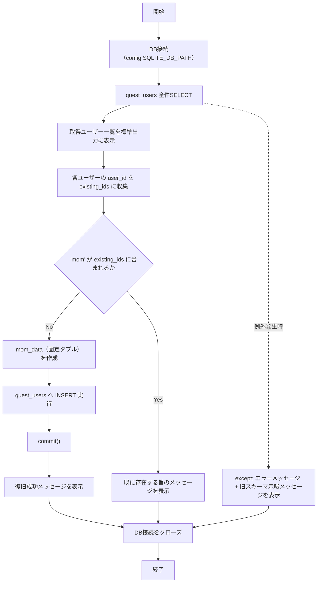
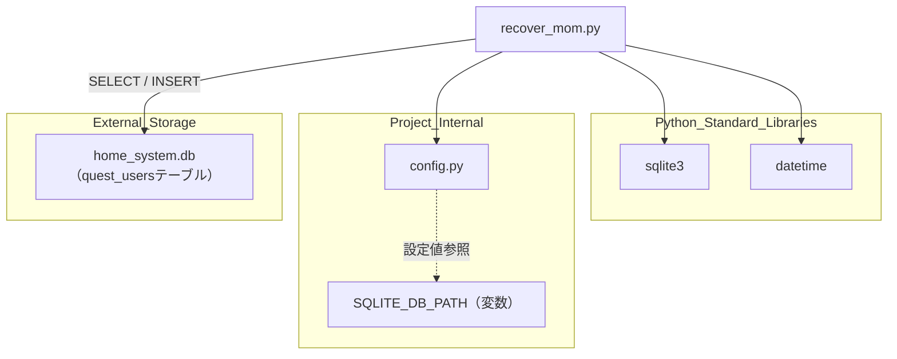

## 1. 解析メタ情報

| 項目 | 内容 |
| --- | --- |
| 対象ファイル | recover_mom.py |
| 言語 | Python |
| 解析対象 | 提供されたコードのみ |
| 推測・補完 | 一切なし |

## 関連ドキュメント

- [config.md](./config.md) — `SQLITE_DB_PATH`設定値を提供
- [quest_router.md](./quest_router.md) — `quest_users`テーブルへの初期データ投入を行う`seed_data`関数を持つモジュール。本ファイルのコメントで「同じ内容」と明記されている
- [quest_data.md](./quest_data.md) — `quest_users`テーブルを扱う可能性のある関連モジュール（直接のimport関係はなし）
- [quest_service.md](./quest_service.md) — クエストシステムのユーザーデータを扱う可能性のある関連モジュール（直接のimport関係はなし）

## 2. ファイルの概要

このファイルは、SQLiteデータベース（`quest_users`テーブル）内のユーザー一覧を確認し、`user_id`が`'mom'`のレコード（「はるな」）が存在しない場合に、固定値でそのレコードを復旧（INSERT）する単発の復旧用スクリプトである。
根拠: [recover_mom_data関数] (行番号: 5〜47 / 抜粋: "def recover_mom_data():")

処理は`quest_users`テーブルの全件取得・一覧表示から始まり、`user_id`一覧に`'mom'`が含まれない場合のみ、コード内コメントで「quest_router.pyのseed_dataと同じ内容」と明記された固定タプル（`('mom', 'はるな', '魔法使い', 1, 0, 150, 現在日時)`）をINSERTして復旧する。
根拠: [mom_data定義とINSERT] (行番号: 29〜35 / 抜粋: "mom_data = ('mom', 'はるな', '魔法使い', 1, 0, 150, datetime.datetime.now())")

`__main__`ブロックから`recover_mom_data()`を直接実行するスタンドアロンのCLIスクリプトとして構成されている。
根拠: [__main__ブロック] (行番号: 49〜50 / 抜粋: "if __name__ == \"__main__\":")

## 3. 外部依存関係

### インポート一覧

| 名称 | 種類 | 用途 | 根拠 |
| --- | --- | --- | --- |
| `sqlite3` | 標準ライブラリ | SQLiteデータベースへの直接接続・クエリ実行 | 根拠: [import sqlite3] (行番号: 1 / 抜粋: "import sqlite3") |
| `datetime` | 標準ライブラリ | 復旧レコードの`updated_at`に現在日時を設定するために使用 | 根拠: [import datetime] (行番号: 2 / 抜粋: "import datetime") |
| `config` | 内部モジュール | データベースファイルパス（`SQLITE_DB_PATH`）の提供 | 根拠: [import config] (行番号: 3 / 抜粋: "import config") |

### ブラックボックスとなる外部要素

| 名称 | 理由 | 根拠 |
| --- | --- | --- |
| `config.SQLITE_DB_PATH` | `config`モジュールの実装が提供されておらず、接続先データベースファイルの実際のパスが不明 | 根拠: [sqlite3.connect呼び出し] (行番号: 8 / 抜粋: "conn = sqlite3.connect(config.SQLITE_DB_PATH)") |
| `quest_users`テーブルのスキーマ | 本ファイル単体では`CREATE TABLE`定義が確認できず、`id`カラムを含む旧スキーマの可能性がコード内コメントで示唆されている | 根拠: [except節コメント] (行番号: 45 / 抜粋: "テーブル定義がまだ古い(idカラムのまま)可能性があります。") |

## 4. 主要要素の定義（関数 / エンドポイント / コンポーネント）

### `recover_mom_data`

* **役割**: `quest_users`テーブルの現行ユーザー一覧を表示し、`'mom'`(はるな)のレコードが存在しなければ固定データで復旧INSERTする。
* 根拠: [recover_mom_data] (行番号: 5〜47 / 抜粋: "def recover_mom_data():")

* **引数/リクエスト**: `None`
* 根拠: [recover_mom_data] (行番号: 5 / 抜粋: "def recover_mom_data():")

* **戻り値/レスポンス**: `None`（結果は`print`による標準出力のみ）
* 根拠: [recover_mom_data] (行番号: 5〜47 / 抜粋: "print(\"🔍 データベースの状態を確認します...\")")

* **副作用**: `config.SQLITE_DB_PATH`が指すSQLiteデータベースへの接続、`quest_users`テーブルへのSELECT/INSERT、条件成立時のコミット、標準出力への進捗・結果表示、処理終了時の接続クローズ。
* 根拠: [recover_mom_data] (行番号: 8, 14, 32〜37, 47 / 抜粋: "cur.execute(\"SELECT * FROM quest_users\")")

* **エラーハンドリング**: `try/except Exception as e`でSELECT/INSERT処理中の例外を捕捉し、エラーメッセージと「テーブル定義が古い可能性がある」という補足メッセージを標準出力する。ただし`conn.close()`は`try`ブロックの外側（インデントの同じ深さの後続行）に置かれているため、例外発生時も未発生時も必ず実行される。
* 根拠: [except節] (行番号: 43〜47 / 抜粋: "except Exception as e:\n        print(f\"\\n❌ エラーが発生しました: {e}\")")

## 5. 処理フロー図

## 6. 依存関係図

## 7. 次のステップ（リバースエンジニアリングの提案）

| 優先度 | ファイル名(推測可) | 理由 | 根拠 |
| --- | --- | --- | --- |
| 高 | `routers/quest_router.py` | 本ファイルのコメントが「quest_router.pyのseed_dataと同じ内容」と明記しており、`mom_data`の正当性・`quest_users`テーブルの正規スキーマを比較検証するため。（本リポジトリでは`quest_router.md`として既に解析済み） | 根拠: [コメント] (行番号: 29 / 抜粋: "# quest_router.py の seed_data と同じ内容") |
| 中 | `config.py` | `SQLITE_DB_PATH`が指す実際のデータベースファイルの場所を確認するため。（本リポジトリでは`config.md`として既に解析済み） | 根拠: [sqlite3.connect] (行番号: 8 / 抜粋: "conn = sqlite3.connect(config.SQLITE_DB_PATH)") |
| 中 | `quest_users`テーブルのDDL（マイグレーションファイル等） | except節のコメントが示唆する「idカラムのままの旧スキーマ」の実態を確認し、本スクリプトが現行スキーマと整合しているか検証するため。 | 根拠: [except節コメント] (行番号: 45 / 抜粋: "テーブル定義がまだ古い(idカラムのまま)可能性があります。") |

## 8. 保守上の注意点

* **ハードコードされた個人向け復旧データ**: `user_id='mom'`, 名前「はるな」, 職業「魔法使い」, レベル1, EXP0, ゴールド150という特定の1ユーザー向けの値がすべてソースコードに直書きされており、汎用的な復旧ツールではなく単発利用を想定した使い捨てスクリプトである。
  * 根拠: [mom_data定義] (行番号: 30 / 抜粋: "mom_data = ('mom', 'はるな', '魔法使い', 1, 0, 150, datetime.datetime.now())")
* **ロガー未使用**: システム内の他モジュールで用いられる`common.setup_logging`等のロギング基盤を使わず、すべて`print`で出力しており、実行ログが永続化されない。
  * 根拠: [print呼び出し] (行番号: 6, 17, 22 / 抜粋: "print(\"🔍 データベースの状態を確認します...\")")
* **想定スキーマ変更への言及**: except節のメッセージが「テーブル定義がまだ古い(idカラムのまま)可能性があります」と明記しており、`quest_users`テーブルのスキーマが過去に変更された経緯を示唆している。本スクリプトが現行スキーマに追随しているかは本ファイル単体では確認できない。
  * 根拠: [except節コメント] (行番号: 45 / 抜粋: "テーブル定義がまだ古い(idカラムのまま)可能性があります。")
* **配置場所からみて単発利用/レガシースクリプトの可能性**: `MY_HOME_SYSTEM/old/`配下に置かれており、定常運用されるバッチではなく、過去に一度きり実行された復旧作業用スクリプトである可能性が高い。
  * 根拠: [ファイル全体構成] (行番号: 1〜50 / 抜粋: "def recover_mom_data():")

## 9. 不明事項一覧

| 項目 | 理由 | 必要なファイル |
| --- | --- | --- |
| `config.SQLITE_DB_PATH`の実際の値 | データベースファイルの実パスが本ファイル内で定義されていないため。 | `config.py` |
| `quest_users`テーブルの正規スキーマ（現行版） | except節が示唆する「旧スキーマ(idカラム)」との差分や、`user_id`, `name`, `job_class`, `level`, `exp`, `gold`, `updated_at`以外のカラムの有無が本ファイル内では確認できないため。 | `quest_router.py`, データベースのマイグレーション/DDL定義ファイル |
| `seed_data`関数（quest_router.py）との実際の値の一致有無 | コメント上「同じ内容」とされるが、本ファイル単体では`seed_data`の実装内容を確認できないため。 | `routers/quest_router.py` |

## 相互参照による補足情報

| 元の不明事項 | 判明した内容 | 参照元ドキュメント |
| --- | --- | --- |
| `config.SQLITE_DB_PATH`の実際の値 | `config.py`222行目で`SQLITE_DB_PATH: str = os.getenv("SQLITE_DB_PATH") or os.path.join(BASE_DIR, "home_system.db")`と定義されている。環境変数`SQLITE_DB_PATH`が未設定の場合のデフォルト値は`BASE_DIR/home_system.db`であり、`BASE_DIR`は212行目で`os.path.dirname(os.path.abspath(__file__))`（`config.py`自身が置かれているディレクトリ、すなわち`MY_HOME_SYSTEM/`）と定義されている。 | 直接ソース確認: `MY_HOME_SYSTEM/config.py:212, 222` |
| `quest_users`テーブルの正規スキーマ（現行版） | `init_unified_db.py`377〜388行目の`CREATE TABLE IF NOT EXISTS quest_users`定義により、`user_id TEXT PRIMARY KEY, name TEXT, job_class TEXT, level INTEGER DEFAULT 1, exp INTEGER DEFAULT 0, gold INTEGER DEFAULT 0, medal_count INTEGER DEFAULT 0, avatar TEXT DEFAULT '🙂', updated_at DATETIME`の9カラムであることを確認した。さらに`role`カラムはこの初期スキーマには含まれておらず、`migrations/0001_add_quest_users_role.sql`（`ALTER TABLE quest_users ADD COLUMN role TEXT`、既存の`dad`/`mom`には`role_adult`、`daughter`/`son`/`child`には`role_child`を初期設定）で追加される後発カラムであることを確認した。同様の`ALTER TABLE ... ADD COLUMN role`処理は`services/quest_service.py`714〜717行目の`sync_master_data`内にも（旧スキーマDB向けの実行時フォールバックとして）存在する。recover_mom.py自身のINSERT文（30〜35行目）は`role`と`medal_count`を含まない7カラムのみを指定してINSERTしており、これらのカラムはデフォルト値（`role`はNULL、`medal_count`は0）のまま残る。 | 直接ソース確認: `MY_HOME_SYSTEM/init_unified_db.py:375-388`, `MY_HOME_SYSTEM/migrations/0001_add_quest_users_role.sql:1-6`, `MY_HOME_SYSTEM/services/quest_service.py:711-717` |
| `seed_data`関数（quest_router.py）との実際の値の一致有無 | 実際には**一致していない**ことを確認した。`routers/quest_router.py`70〜71行目の`seed_data()`は`game_system.sync_master_data()`を呼び出すだけのエイリアスであり、固定タプルではなく`quest_data.py`24〜34行目の`USERS`リストにある`{'user_id': 'mom', 'name': 'はるな', 'job_class': '専業主婦', 'level': 1, 'exp': 0, 'gold': 0, 'avatar': '🪄', ...}`を`services/quest_service.py`688〜735行目の`sync_master_data`が`INSERT ... ON CONFLICT(user_id) DO UPDATE`でDBへ反映する仕組みになっている。recover_mom.py 30行目の固定タプル`('mom', 'はるな', '魔法使い', 1, 0, 150, ...)`とは、`job_class`(「魔法使い」対「専業主婦」)と`gold`(150対0)が異なっており、コード内コメント「quest_router.pyのseed_dataと同じ内容」は現行のquest_data.py内容とは一致しない（コメント記述時点の古い値、または誤記の可能性がある）。 | 直接ソース確認: `MY_HOME_SYSTEM/routers/quest_router.py:69-71`, `MY_HOME_SYSTEM/quest_data.py:24-34`, `MY_HOME_SYSTEM/services/quest_service.py:688-735` |

## 10. 自己検証結果

* [x] 推測・外部ファイルの仕様を一切含んでいない
* [x] 全関数・全クラス・全コンポーネントを列挙した
* [x] 全てのインポート要素を列挙した
* [x] すべての仕様説明に「根拠（行番号・抜粋）」を明記した
* [x] 根拠漏れが0件である
* [x] Mermaid構文にエラーの原因となる記号（エスケープ漏れ）がない
* [x] 不明事項を漏れなく列挙した
