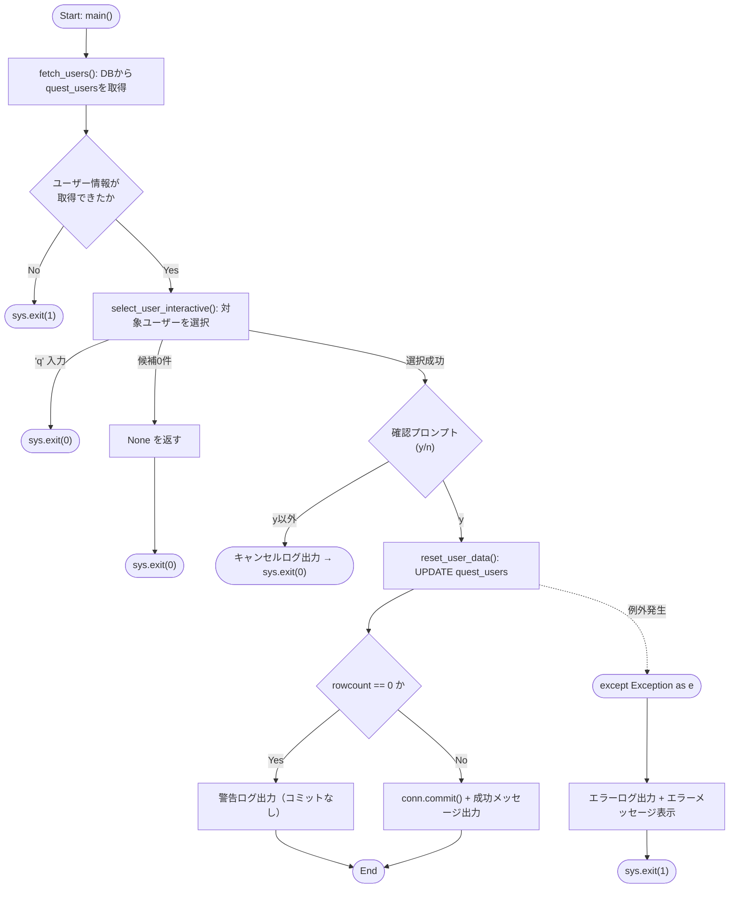
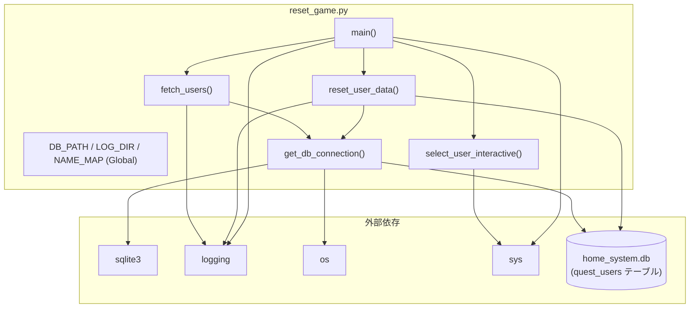

## 1. 解析メタ情報

| 項目 | 内容 |
| --- | --- |
| 対象ファイル | `reset_game.py` |
| 言語 | Python |
| 解析対象 | 提供されたコードのみ |
| 推測・補完 | 一切なし |

## 関連ドキュメント

* [quest_data.md](./quest_data.md) - `NAME_MAP`のuser_id(dad/mom/son/daughter)に対応する`USERS`マスターデータ定義
* [quest_service.md](./quest_service.md) - リセット対象と同じ`quest_users`テーブル(`role`, `level`, `exp`, `gold`)を操作するサービス層
* [database.md](./database.md), [init_unified_db.md](./init_unified_db.md) - `quest_users`テーブルを含むDBスキーマの初期化・接続処理
* [start_all.md](./start_all.md) - システム全体の起動スクリプト(実行時のカレントディレクトリ・環境変数設定の参考)

## 2. ファイルの概要

* コマンドラインから対話的に実行する、Family QuestのSQLite DB（`home_system.db`）上のユーザーゲームデータ（レベル・経験値・ゴールド・メダル数）をリセットするスクリプト。
* DBから取得したユーザー一覧を日本語名（`NAME_MAP`）に基づいて表示し、番号入力によりリセット対象ユーザーを選択させる。
* リセット実行前に `y/n` の最終確認を行い、確認が取れた場合のみ対象ユーザーの `level`, `exp`, `gold`, `medal_count` を初期値にリセットする。
* 実行結果は日付別のログファイル（`logs/reset_game_YYYYMMDD.log`）と標準出力の両方に出力される。

## 3. 外部依存関係

### インポート一覧

| 名称 | 種類 | 用途 | 根拠 |
| --- | --- | --- | --- |
| `os` | 標準ライブラリ | DBファイル存在確認、ログディレクトリ作成、パス結合 | `import os` (行番号: 1 / 抜粋: "import os") |
| `sys` | 標準ライブラリ | 標準出力先指定、プロセス終了（`sys.exit`） | `import sys` (行番号: 2 / 抜粋: "import sys") |
| `logging` | 標準ライブラリ | ログ出力設定（ファイル＋コンソール） | `import logging` (行番号: 3 / 抜粋: "import logging") |
| `sqlite3` | 標準ライブラリ | SQLite DBへの接続・クエリ実行 | `import sqlite3` (行番号: 4 / 抜粋: "import sqlite3") |
| `traceback` | 標準ライブラリ | 例外発生時のスタックトレース取得 | `import traceback` (行番号: 5 / 抜粋: "import traceback") |
| `datetime` | 標準ライブラリ | ログファイル名用の日付文字列生成 | `from datetime import datetime` (行番号: 6 / 抜粋: "from datetime import datetime") |

### ブラックボックスとなる外部要素

| 名称 | 理由 | 根拠 |
| --- | --- | --- |
| `home_system.db` (SQLite DB) | `quest_users` テーブルのスキーマ（`user_id`, `name`, `level`, `exp`, `gold`, `medal_count` 以外のカラムの有無等）が本ファイルからは不明。 | `cursor.execute("SELECT user_id, name FROM quest_users")` (行番号: 57 / 抜粋: "cursor.execute("SELECT user_id, name FROM quest_users")") |

## 4. 主要要素の定義（関数 / エンドポイント / コンポーネント）

### モジュール初期化処理（設定値・ログ設定）

* **役割**: DBファイルパス（`DB_PATH`）、ログディレクトリ（`LOG_DIR`）、日本語名とDB内`user_id`のマッピング（`NAME_MAP`）を定義し、日付別のログファイルを作成、`logging.basicConfig` によりファイル出力とコンソール出力の両方を行うよう設定する。
* 根拠: `DB_PATH = "home_system.db"` 〜 `logging.basicConfig(...)` (行番号: 9〜31 / 抜粋: "DB_PATH = "home_system.db"  # DBファイルパス")

* **引数/リクエスト**: なし
* 根拠: (行番号: 9〜31 / 抜粋: "DB_PATH = "home_system.db"")

* **戻り値/レスポンス**: なし
* 根拠: (行番号: 9〜31 / 抜粋: "LOG_DIR = "logs"")

* **副作用**: `logs` ディレクトリの作成（既存の場合はスキップ）、日付別ログファイルパスの生成、ルートロガーへのファイルハンドラ・ストリームハンドラの登録。
* 根拠: `os.makedirs(LOG_DIR, exist_ok=True)` (行番号: 21 / 抜粋: "os.makedirs(LOG_DIR, exist_ok=True)"), `handlers=[\n        logging.FileHandler(log_file, encoding='utf-8'),\n        logging.StreamHandler(sys.stdout)\n    ]` (行番号: 27〜30 / 抜粋: "logging.FileHandler(log_file, encoding='utf-8'),")

* **エラーハンドリング**: なし
* 根拠: (行番号: 9〜31 / 抜粋: "NAME_MAP = {")

### `get_db_connection`

* **役割**: SQLite DBファイルの存在を確認し、存在すれば `sqlite3.Row` をロウファクトリとするコネクションを返す。存在しない場合はプロセスを終了する。
* 根拠: `def get_db_connection():` (行番号: 33〜46 / 抜粋: "def get_db_connection():\n    """データベース接続を取得する"""")

* **引数/リクエスト**: なし
* 根拠: (行番号: 33 / 抜粋: "def get_db_connection():")

* **戻り値/レスポンス**: `sqlite3.Connection`（`row_factory` を `sqlite3.Row` に設定済み）。DBファイル不在時は関数内で `sys.exit(1)` するため戻り値は返らない。
* 根拠: `return conn` (行番号: 43 / 抜粋: "return conn")

* **副作用**: SQLite DBへの接続確立、DBファイル不在時のエラーログ出力・標準出力・プロセス終了。
* 根拠: `conn = sqlite3.connect(DB_PATH)` (行番号: 41 / 抜粋: "conn = sqlite3.connect(DB_PATH)")

* **エラーハンドリング**: DBファイルが存在しない場合、エラーログと標準出力にメッセージを出力後 `sys.exit(1)` する。接続処理中の任意の `Exception` はエラーログに記録した上で再送出（`raise`）する。
* 根拠: `if not os.path.exists(DB_PATH):` (行番号: 35〜38 / 抜粋: "sys.exit(1)"), `except Exception as e:\n        logging.error(f"DB接続エラー: {e}")\n        raise` (行番号: 44〜46 / 抜粋: "raise")

### `fetch_users`

* **役割**: `quest_users` テーブルから `user_id` と `name` を取得し、表示用の辞書（`id`, `name`）のリストを構築する。
* 根拠: `def fetch_users():` (行番号: 48〜75 / 抜粋: "def fetch_users():\n    """\n    DBからユーザー情報を取得し、表示用のリストを作成する\n    """")

* **引数/リクエスト**: なし
* 根拠: (行番号: 48 / 抜粋: "def fetch_users():")

* **戻り値/レスポンス**: `list[dict]`（各要素は `{"id": ..., "name": ...}`）。取得失敗時は空リスト `[]` を返す。
* 根拠: `return users_info` (行番号: 67 / 抜粋: "return users_info"), `return []` (行番号: 72 / 抜粋: "return []")

* **副作用**: DB接続の確立とクエリ実行、失敗時のエラーログ・デバッグログ出力、`finally` ブロックでのDB接続クローズ。
* 根拠: `cursor.execute("SELECT user_id, name FROM quest_users")` (行番号: 57 / 抜粋: "cursor.execute("SELECT user_id, name FROM quest_users")")

* **エラーハンドリング**: 任意の `Exception` を捕捉し、エラーログ（`logging.error`）とデバッグログ（`logging.debug` によるトレースバック）を出力した上で空リストを返す。`finally` 節で接続が確立していれば必ずクローズする。
* 根拠: `except Exception as e:\n        logging.error(f"ユーザーリスト取得失敗: {e}")\n        logging.debug(traceback.format_exc())\n        return []` (行番号: 69〜72 / 抜粋: "except Exception as e:")

### `select_user_interactive`

* **役割**: 取得済みユーザー一覧を `NAME_MAP` の日本語名を優先しつつ表示し、番号入力によりリセット対象を1件選択させる対話的関数。
* 根拠: `def select_user_interactive(users_info):` (行番号: 77〜119 / 抜粋: "def select_user_interactive(users_info):\n    """\n    ユーザーにリストを表示し、選択させる\n    """")

* **引数/リクエスト**: `users_info: list[dict]`（`fetch_users` の戻り値）
* 根拠: (行番号: 77 / 抜粋: "def select_user_interactive(users_info):")

* **戻り値/レスポンス**: `dict`（`{"label": ..., "db_id": ...}`）または `None`（候補が0件の場合）。`q` 入力時は関数内で `sys.exit(0)` するため戻り値は返らない。
* 根拠: `return display_candidates[idx]` (行番号: 117 / 抜粋: "return display_candidates[idx]"), `return None` (行番号: 100 / 抜粋: "return None")

* **副作用**: 標準出力への選択肢一覧表示、`input()` によるユーザー入力の待受、`q` 入力時の即時プロセス終了。
* 根拠: `choice = input("番号を入力してください: ").strip()` (行番号: 108 / 抜粋: "choice = input("番号を入力してください: ").strip()")

* **エラーハンドリング**: 表示候補が0件の場合はメッセージを出力し `None` を返す。入力が `q`（大文字小文字問わず）の場合はキャンセルメッセージを出力し `sys.exit(0)`。数字以外または範囲外の入力に対しては無限ループで再入力を促す（明示的な例外捕捉はなし）。
* 根拠: `if not display_candidates:` (行番号: 98〜100 / 抜粋: "return None"), `while True:` (行番号: 107 / 抜粋: "while True:")

### `reset_user_data`

* **役割**: 指定されたユーザーの `level`, `exp`, `gold`, `medal_count` を初期値（1, 0, 0, 0）にリセットするUPDATE文を実行する。
* 根拠: `def reset_user_data(target_user):` (行番号: 121〜159 / 抜粋: "def reset_user_data(target_user):\n    """\n    指定されたユーザーのゲームデータをリセットする\n    """")

* **引数/リクエスト**: `target_user: dict`（`{"label": ..., "db_id": ...}`。`select_user_interactive` の戻り値）
* 根拠: (行番号: 121 / 抜粋: "def reset_user_data(target_user):")

* **戻り値/レスポンス**: なし（明示的な `return` を持たない）
* 根拠: (行番号: 121〜159 / 抜粋: "def reset_user_data(target_user):")

* **副作用**: `quest_users` テーブルへのUPDATE実行とコミット、成功・失敗メッセージの標準出力、対象データ未存在時の警告ログ、失敗時のエラーログ・プロセス終了、`finally` ブロックでのDB接続クローズ。
* 根拠: `cursor.execute("""\n            UPDATE quest_users \n            SET level = 1, exp = 0, gold = 0, medal_count = 0 \n            WHERE user_id = ?\n        """, (user_id,))` (行番号: 136〜140 / 抜粋: "UPDATE quest_users "), `conn.commit()` (行番号: 146 / 抜粋: "conn.commit()")

* **エラーハンドリング**: `cursor.rowcount == 0`（対象ユーザーが存在しない）の場合は警告ログと注意メッセージを出力するのみでコミットは行わない。UPDATE実行中に任意の `Exception` が発生した場合、エラーログ（メッセージ＋トレースバック）を出力し、標準出力にエラーメッセージとログファイルパスを表示した上で `sys.exit(1)` する。`finally` 節で接続が確立していれば必ずクローズする。
* 根拠: `if cursor.rowcount == 0:` (行番号: 142〜144 / 抜粋: "if cursor.rowcount == 0:"), `except Exception as e:` (行番号: 151〜156 / 抜粋: "sys.exit(1)")

### `main`

* **役割**: `fetch_users` → `select_user_interactive` → 確認プロンプト → `reset_user_data` の一連の対話フローを制御するエントリーポイント。
* 根拠: `def main():` (行番号: 161〜181 / 抜粋: "def main():\n    logging.info("スクリプト起動: ユーザー選択モード")")

* **引数/リクエスト**: なし
* 根拠: (行番号: 161 / 抜粋: "def main():")

* **戻り値/レスポンス**: なし
* 根拠: (行番号: 161〜181 / 抜粋: "def main():")

* **副作用**: ログ出力（起動・キャンセル）、`fetch_users`/`select_user_interactive`/`reset_user_data` の呼び出し、確認プロンプトの表示、ユーザー未取得時・未選択時・確認拒否時の `sys.exit`。
* 根拠: `confirm = input(f"\n本当に '{selected['label']}' のデータをリセットしますか？ (y/n): ").strip().lower()` (行番号: 175 / 抜粋: "confirm = input(f"\n本当に '{selected['label']}' のデータをリセットしますか？ (y/n): ").strip().lower()")

* **エラーハンドリング**: `fetch_users` の結果が空の場合はエラーログとメッセージを出力し `sys.exit(1)`。`select_user_interactive` の戻り値が `None`（Falsy）の場合は `sys.exit(0)`。確認入力が `"y"` 以外の場合はキャンセルログ・メッセージを出力し `sys.exit(0)`。それ以外の場合のみ `reset_user_data` を呼び出す。
* 根拠: `if not users_info:` (行番号: 166〜169 / 抜粋: "sys.exit(1)"), `if confirm != 'y':` (行番号: 176〜179 / 抜粋: "sys.exit(0)")

### モジュールレベル実行部（`if __name__ == "__main__":`）

* **役割**: スクリプトを直接実行した場合に `main()` を呼び出す。
* 根拠: `if __name__ == "__main__":\n    main()` (行番号: 183〜184 / 抜粋: "if __name__ == "__main__":\n    main()")

* **引数/リクエスト**: なし
* 根拠: (行番号: 183〜184 / 抜粋: "main()")

* **戻り値/レスポンス**: なし
* 根拠: (行番号: 183〜184 / 抜粋: "main()")

* **副作用**: `main()` の実行（対話的なDBリセット処理全体）。
* 根拠: (行番号: 184 / 抜粋: "main()")

* **エラーハンドリング**: なし
* 根拠: (行番号: 183〜184 / 抜粋: "if __name__ == "__main__":")

## 5. 処理フロー図

`main()` を起点とした対話的なユーザーデータリセットの流れを示します。

## 6. 依存関係図

## 7. 次のステップ（リバースエンジニアリングの提案）

| 優先度 | ファイル名(推測可) | 理由 | 根拠 |
| --- | --- | --- | --- |
| 高 | `current_schema.sql` または `init_unified_db.py` | `quest_users` テーブルの完全なスキーマ（`medal_count` を含む全カラム、外部キー制約等）を確認し、本スクリプトのUPDATE文が安全かを検証するため。 | `SET level = 1, exp = 0, gold = 0, medal_count = 0` (行番号: 138 / 抜粋: "SET level = 1, exp = 0, gold = 0, medal_count = 0 ") |
| 中 | `quest_data.py` | `NAME_MAP` に記載された `user_id`（dad, mom, son, daughter）が `quest_data.py` の `USERS` 定義と一致しているかを確認するため。 | `NAME_MAP = {` (行番号: 13 / 抜粋: "NAME_MAP = {") |

## 8. 保守上の注意点

* **`sys.exit` によるプロセス強制終了の多用**: `get_db_connection`, `select_user_interactive`, `reset_user_data`, `main` の随所で `sys.exit()` が呼ばれており、呼び出し元での例外ハンドリングやテスト時のモック化が難しい設計になっている。
* **rowcountが0の場合に警告のみでコミットしない挙動**: 142〜144行目で対象ユーザーが見つからない場合、`conn.commit()` を呼ばずに処理が終了する。これはロールバックを明示していないため、他の変更が同一トランザクション内にあった場合の挙動が不明瞭。
* **対話的入力への依存**: `select_user_interactive`（108行目）と `main`（175行目）の両方で `input()` を使用しており、非対話環境（cronやCI等）から実行するとブロックする。
* **NAME_MAPのハードコード**: 日本語名とuser_idのマッピング（13〜18行目）がソースコード内に直接埋め込まれており、家族構成の変更時にはコード修正が必要。

## 9. 不明事項一覧

| 項目 | 理由 | 必要なファイル |
| --- | --- | --- |
| `quest_users` テーブルの完全なスキーマ | `medal_count` を含む全カラム定義、制約、他テーブルとの関連が本ファイルからは不明。 | `current_schema.sql`, `init_unified_db.py` |
| `DB_PATH = "home_system.db"` の実行時の解決パス | 相対パスとして定義されており、スクリプトの実行カレントディレクトリに依存する。実運用でどこから実行されるかは不明。 | 実行方法に関するドキュメントや起動スクリプト（`start_all.sh` 等） |
| リセット後の他システムへの影響 | `quest_data.py` や `unified_server.py` 等、他のコンポーネントが本リセット操作の影響をどう受けるかは不明。 | `unified_server.py`, `services/quest_service.py` |

## 相互参照による補足情報

| 元の不明事項 | 判明した内容 | 参照元ドキュメント |
| --- | --- | --- |
| `quest_users` テーブルの完全なスキーマ | `current_schema.sql`164〜172行目の実際のDDLダンプにより、`quest_users`は`user_id TEXT PRIMARY KEY, name TEXT, job_class TEXT, level INTEGER DEFAULT 1, exp INTEGER DEFAULT 0, gold INTEGER DEFAULT 0, updated_at DATETIME, avatar TEXT DEFAULT '🙂', medal_count INTEGER DEFAULT 0, role TEXT`の10カラムを持つ現行スキーマであることを確認した（`avatar`/`medal_count`/`role`は`ALTER TABLE`で後から追加されたため末尾に列挙されている）。`init_unified_db.py`375〜388行目の初期作成用`CREATE TABLE`定義（`role`列を含まない9カラム）と突き合わせても矛盾はなく、`role`列は`migrations/0001_add_quest_users_role.sql`（`ALTER TABLE quest_users ADD COLUMN role TEXT`）で追加される設計と整合している。他テーブルとの外部キー等の直接的なリレーションは`quest_users`には定義されていない。 | 直接ソース確認: `MY_HOME_SYSTEM/current_schema.sql:164-172`, `MY_HOME_SYSTEM/init_unified_db.py:375-388`, `MY_HOME_SYSTEM/migrations/0001_add_quest_users_role.sql:1-6` |
| `DB_PATH = "home_system.db"` の実行時の解決パス | `reset_game.py`はリポジトリ内の他のどのファイルからもインポート・実行呼び出しされておらず（`grep`による全文検索でも`reset_game`という文字列は`reset_game.py`自身と`.coveragerc`にしか出現しない）、独立した対話的CLIスクリプトとして手動実行される設計であることを確認した。実行時のカレントディレクトリを断定する起動スクリプトは存在しないが、`config.py`222行目で`SQLITE_DB_PATH`のデフォルト値が`BASE_DIR/home_system.db`（`BASE_DIR`は`config.py`が置かれる`MY_HOME_SYSTEM/`ディレクトリ、212行目）と定義されており、これと`reset_game.py`の相対パス`"home_system.db"`が同一のDBファイルを指すのは、`MY_HOME_SYSTEM/`ディレクトリをカレントディレクトリとして実行した場合に限られる。`start_all.sh`12行目の`cd "$PROJECT_DIR"`（`PROJECT_DIR="/home/masahiro/develop/MY_HOME_SYSTEM"`）は`unified_server.py`等の常駐サーバー起動時にこのディレクトリへ`cd`する実例であり、`reset_game.py`も同様に`MY_HOME_SYSTEM/`直下から手動実行される運用が前提と推測されるが、`reset_game.py`自体の起動元を直接示すファイルは見つからなかった。 | 直接ソース確認: `MY_HOME_SYSTEM/reset_game.py:9`, `MY_HOME_SYSTEM/config.py:212, 222`, `MY_HOME_SYSTEM/start_all.sh:10-12` |
| リセット後の他システムへの影響 | `services/quest_service.py`412〜436行目の`_apply_quest_rewards`メソッドを直接確認した。クエスト完了時は`game_logic.GameLogic.calc_level_progress(user['level'], user['exp'], earned_exp)`で新しい`level`/`exp`を算出し、`final_gold = user['gold'] + earned_gold`で加算した`gold`とともに`UPDATE quest_users SET level = ?, exp = ?, gold = ?, medal_count = medal_count + ?, ...`で上書きする(432〜436行目)。すなわち`reset_game.py`によるリセット後、次回のクエスト完了処理はリセット後の`level=1, exp=0, gold=0, medal_count=0`を基準値として加算・レベル計算を行うことになる。`unified_server.py`や`quest_router.py`側に`reset_game.py`実行を検知して追加処理を行うようなフックは存在しない（`reset_game.py`はどこからも参照されていないスタンドアロンスクリプトであるため）。 | 直接ソース確認: `MY_HOME_SYSTEM/services/quest_service.py:412-436` |

## 10. 自己検証結果

* [x] 推測・外部ファイルの仕様を一切含んでいない
* [x] 全関数・全クラス・全コンポーネントを列挙した
* [x] 全てのインポート要素を列挙した
* [x] すべての仕様説明に「根拠（行番号・抜粋）」を明記した
* [x] 根拠漏れが0件である
* [x] Mermaid構文にエラーの原因となる記号（エスケープ漏れ）がない
* [x] 不明事項を漏れなく列挙した

完了
