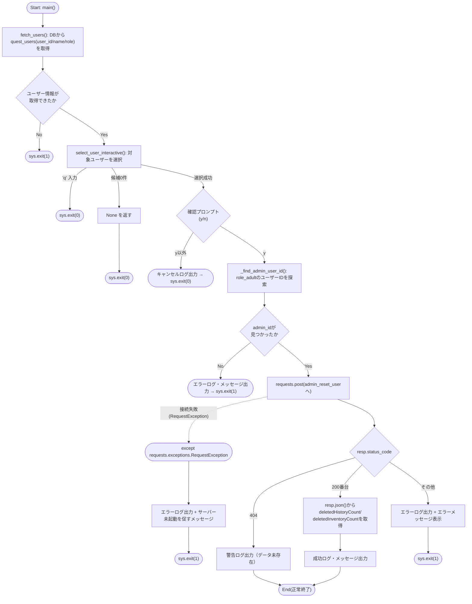
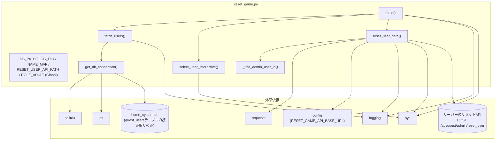

## 1. 解析メタ情報

| 項目 | 内容 |
| --- | --- |
| 対象ファイル | `reset_game.py` |
| 言語 | Python |
| 解析対象 | 提供されたコードのみ |
| 推測・補完 | 一切なし |

## 関連ドキュメント

* [quest_data.md](./quest_data.md) - `NAME_MAP`のuser_id(dad/mom/son/daughter)に対応する`USERS`マスターデータ定義
* [quest_service.md](./quest_service.md) - リセット対象と同じ`quest_users`テーブル(`role`, `level`, `exp`, `gold`)を操作するサービス層
* [quest_user_service.md](./quest_user_service.md) - **（Issue #547で追加）** 本ファイルがHTTP経由で呼び出すリセットAPIの実処理(`UserService.reset_user_data`)
* [quest_router.md](./quest_router.md) - **（Issue #547で追加）** 本ファイルが呼び出す`POST /api/quest/admin/reset_user`エンドポイントの定義
* [database.md](./database.md), [init_unified_db.md](./init_unified_db.md) - `quest_users`テーブルを含むDBスキーマの初期化・接続処理
* [start_all.md](./start_all.md) - システム全体の起動スクリプト(実行時のカレントディレクトリ・環境変数設定の参考)

## 2. ファイルの概要

* コマンドラインから対話的に実行する、Family QuestのSQLite DB（`home_system.db`）上のユーザーゲームデータ（レベル・経験値・ゴールド・メダル数）をリセットするスクリプト。
* DBから取得したユーザー一覧を日本語名（`NAME_MAP`）に基づいて表示し、番号入力によりリセット対象ユーザーを選択させる（この一覧取得は読み取りのみのため、引き続きDBを直接読む）。
* **（Issue #547で変更）** リセット実行前に `y/n` の最終確認を行い、確認が取れた場合、対象ユーザーの `level`, `exp`, `gold`, `medal_count` の初期化と`quest_history`/`user_inventory`の削除は、本ファイルが直接DBを書き換えるのではなく、サーバーのAPI（`POST /api/quest/admin/reset_user`）をHTTP経由で呼び出すことで行う。呼び出し時の`admin_id`（`role_adult`であることがサーバー側で必須）は、取得済みのユーザー一覧から`role_adult`のユーザーを自動選択し、実行者に別途入力させることはしない。以前は本ファイルが`unified_server`とは別プロセスであることを理由にDB側の`BEGIN IMMEDIATE`のみで原子性を確保していたが、稼働中サーバーの承認処理（`quest_service.py`の`process_approve_quest`等、SELECT→Pythonで計算→絶対値SET）と交錯するとリセット結果が上書きされうる欠陥が残っていたため、サービス層の`_get_user_balance_lock`に参加できるサーバーAPI呼び出しに置き換えた。
* **（Issue #547で追加）** サーバーが起動していない・到達できない場合に直接DBを書き換えるフォールバックは持たない。接続失敗時はエラーメッセージを表示して`sys.exit(1)`する。
* 実行結果は日付別のログファイル（`logs/reset_game_YYYYMMDD.log`）と標準出力の両方に出力される。

## 3. 外部依存関係

### インポート一覧

| 名称 | 種類 | 用途 | 根拠 |
| --- | --- | --- | --- |
| `os` | 標準ライブラリ | DBファイル存在確認、ログディレクトリ作成、パス結合 | `import os` (行番号: 1 / 抜粋: "import os") |
| `sys` | 標準ライブラリ | 標準出力先指定、プロセス終了（`sys.exit`） | `import sys` (行番号: 2 / 抜粋: "import sys") |
| `logging` | 標準ライブラリ | ログ出力設定（ファイル＋コンソール） | `import logging` (行番号: 3 / 抜粋: "import logging") |
| `sqlite3` | 標準ライブラリ | SQLite DBへの接続・クエリ実行（ユーザー一覧の読み取りのみ。Issue #547でリセット自体のDB書き込みは廃止） | `import sqlite3` (行番号: 4 / 抜粋: "import sqlite3") |
| `traceback` | 標準ライブラリ | 例外発生時のスタックトレース取得 | `import traceback` (行番号: 5 / 抜粋: "import traceback") |
| `datetime` | 標準ライブラリ | ログファイル名用の日付文字列生成 | `from datetime import datetime` (行番号: 6 / 抜粋: "from datetime import datetime") |
| `requests` | サードパーティ | **（Issue #547で追加）** リセットAPI（`POST /api/quest/admin/reset_user`）へのHTTPリクエスト送信 | `import requests` (行番号: 8 / 抜粋: "import requests") |
| `config` | 内部モジュール | `SQLITE_DB_PATH`（DBファイルパス。Issue #186で追加）、`LOG_DIR`、`RESET_GAME_API_BASE_URL`（リセットAPIのベースURL。Issue #547で追加）を取得 | `import config` (行番号: 10 / 抜粋: "import config") |

### ブラックボックスとなる外部要素

| 名称 | 理由 | 根拠 |
| --- | --- | --- |
| `home_system.db` (SQLite DB) | `quest_users` テーブルのスキーマ（`user_id`, `name`, `role` 以外のカラムの有無等）が本ファイルからは不明。 | `cursor.execute("SELECT user_id, name, role FROM quest_users")` (行番号: 102 / 抜粋: "cursor.execute("SELECT user_id, name, role FROM quest_users")") |
| リセットAPI (`POST {base_url}/api/quest/admin/reset_user`) | サーバー側の実処理（権限チェックの詳細・DB更新の原子性・レスポンス形状の正確な定義）は本ファイルからは呼び出し側の期待値（ステータスコード200/404/その他、JSONボディの`deletedHistoryCount`/`deletedInventoryCount`）としてしか分からない。 | `resp = requests.post(\n            url,\n            json={"admin_id": admin_id, "target_user_id": user_id},\n            timeout=RESET_API_TIMEOUT_SECONDS,\n        )` (行番号: 201〜205) |

## 4. 主要要素の定義（関数 / エンドポイント / コンポーネント）

### モジュール初期化処理（設定値・ログ設定）

* **役割**: DBファイルパス（`DB_PATH`）、ログディレクトリ（`LOG_DIR`）、日本語名とDB内`user_id`のマッピング（`NAME_MAP`）、**（Issue #547で追加）** リセットAPIのパス・タイムアウト（`RESET_USER_API_PATH`, `RESET_API_TIMEOUT_SECONDS`）と`quest_users.role`の判定値（`ROLE_ADULT = "role_adult"`）を定義し、日付別のログファイルを作成、`logging.basicConfig` によりファイル出力とコンソール出力の両方を行うよう設定する。**（Issue #186で修正）** 以前は`DB_PATH`がCWD相対のハードコード文字列`"home_system.db"`であり、他のDBアクセス経路（`config.SQLITE_DB_PATH` = `BASE_DIR/home_system.db`、環境変数`SQLITE_DB_PATH`で上書き可）と食い違っていた。`MY_HOME_SYSTEM/`以外のCWDから実行するとファイル不在で終了する、あるいは同名ファイルが存在すれば別のDBを誤って操作する、`SQLITE_DB_PATH`環境変数での差し替え運用時に本番と異なるファイルをリセットする、といったリスクがあったため、`config`モジュールをインポートし`DB_PATH = config.SQLITE_DB_PATH`から導出するよう統一した。
* 根拠: `DB_PATH = config.SQLITE_DB_PATH` (行番号: 22 / 抜粋: "DB_PATH = config.SQLITE_DB_PATH  # DBファイルパス")、Issue #186修正のimportとコメント (行番号: 10, 13〜19 / 抜粋: "import config", "# #186: 以前はCWD相対の"home_system.db"に直接sqlite3.connectしており、他のDB")
* **（Issue #409 Q-L8 で修正）** `LOG_DIR` は CWD 相対の `"logs"` ではなく `config.LOG_DIR` を使い、`logging.basicConfig` は import 時ではなく `main()` から呼ぶ `_setup_logging()` に移動した。
* 根拠: `LOG_DIR = config.LOG_DIR` (行番号: 25)、`def _setup_logging() -> None:` (行番号: 62〜73)
* **（Issue #547で追加）** `RESET_USER_API_PATH`/`RESET_API_TIMEOUT_SECONDS`/`ROLE_ADULT`は、リセット処理をサーバーAPI呼び出しに置き換えた際に追加された。`ROLE_ADULT`は`services/quest/locks.py`の`ROLE_ADULT`と同じ文字列値だが、本ファイルはサービス層をimportしない独立スクリプトのためこの値をここに複製している、という趣旨のコメントが付されている。
* 根拠: `RESET_USER_API_PATH = "/api/quest/admin/reset_user"` 〜 `ROLE_ADULT = "role_adult"` (行番号: 35〜56 / 抜粋: "Issue #547: 本スクリプトはunified_serverとは別プロセスで動くため、サービス層の")

* **引数/リクエスト**: なし
* 根拠: (行番号: 22〜56 / 抜粋: "DB_PATH = config.SQLITE_DB_PATH")

* **戻り値/レスポンス**: なし
* 根拠: (行番号: 28〜33 / 抜粋: "NAME_MAP = {")

* **副作用**: `logs` ディレクトリの作成（既存の場合はスキップ）、日付別ログファイルパスの生成、ルートロガーへのファイルハンドラ・ストリームハンドラの登録。
* 根拠: `os.makedirs(LOG_DIR, exist_ok=True)` (行番号: 65 / 抜粋: "os.makedirs(LOG_DIR, exist_ok=True)"), `handlers=[\n            logging.FileHandler(log_file, encoding='utf-8'),\n            logging.StreamHandler(sys.stdout)\n        ]` (行番号: 69〜72 / 抜粋: "logging.FileHandler(log_file, encoding='utf-8'),")

* **エラーハンドリング**: なし
* 根拠: (行番号: 28〜33 / 抜粋: "NAME_MAP = {")

### `get_db_connection`

* **役割**: SQLite DBファイルの存在を確認し、存在すれば `sqlite3.Row` をロウファクトリとするコネクションを返す。存在しない場合はプロセスを終了する。
* 根拠: `def get_db_connection():` (行番号: 75〜88 / 抜粋: "def get_db_connection():\n    """データベース接続を取得する"""")

* **引数/リクエスト**: なし
* 根拠: (行番号: 75 / 抜粋: "def get_db_connection():")

* **戻り値/レスポンス**: `sqlite3.Connection`（`row_factory` を `sqlite3.Row` に設定済み）。DBファイル不在時は関数内で `sys.exit(1)` するため戻り値は返らない。
* 根拠: `return conn` (行番号: 85 / 抜粋: "return conn")

* **副作用**: SQLite DBへの接続確立、DBファイル不在時のエラーログ出力・標準出力・プロセス終了。
* 根拠: `conn = sqlite3.connect(DB_PATH)` (行番号: 83 / 抜粋: "conn = sqlite3.connect(DB_PATH)")

* **エラーハンドリング**: DBファイルが存在しない場合、エラーログと標準出力にメッセージを出力後 `sys.exit(1)` する。接続処理中の任意の `Exception` はエラーログに記録した上で再送出（`raise`）する。
* 根拠: `if not os.path.exists(DB_PATH):` (行番号: 77〜80 / 抜粋: "sys.exit(1)"), `except Exception as e:\n        logging.error(f"DB接続エラー: {e}")\n        raise` (行番号: 86〜88 / 抜粋: "raise")

### `fetch_users`

* **役割**: `quest_users` テーブルから `user_id`・`name`・`role` を取得し、表示用の辞書（`id`, `name`, `role`）のリストを構築する。**（Issue #547で修正）** 以前は`user_id`と`name`のみを取得していたが、リセットAPI呼び出し時に`admin_id`（`role_adult`のユーザー）を自動選択するため`role`列も取得するようになった。
* 根拠: `def fetch_users():` (行番号: 90〜120 / 抜粋: "def fetch_users():\n    """\n    DBからユーザー情報を取得し、表示用のリストを作成する。")、role列の追加根拠 (行番号: 102, 110 / 抜粋: "cursor.execute("SELECT user_id, name, role FROM quest_users")", "users_info.append({"id": u_id, "name": display_name, "role": row['role']})")

* **引数/リクエスト**: なし
* 根拠: (行番号: 90 / 抜粋: "def fetch_users():")

* **戻り値/レスポンス**: `list[dict]`（各要素は `{"id": ..., "name": ..., "role": ...}`）。取得失敗時は空リスト `[]` を返す。
* 根拠: `return users_info` (行番号: 112 / 抜粋: "return users_info"), `return []` (行番号: 117 / 抜粋: "return []")

* **副作用**: DB接続の確立とクエリ実行、失敗時のエラーログ・デバッグログ出力、`finally` ブロックでのDB接続クローズ。
* 根拠: `cursor.execute("SELECT user_id, name, role FROM quest_users")` (行番号: 102 / 抜粋: "cursor.execute("SELECT user_id, name, role FROM quest_users")")

* **エラーハンドリング**: 任意の `Exception` を捕捉し、エラーログ（`logging.error`）とデバッグログ（`logging.debug` によるトレースバック）を出力した上で空リストを返す。`finally` 節で接続が確立していれば必ずクローズする。
* 根拠: `except Exception as e:\n        logging.error(f"ユーザーリスト取得失敗: {e}")\n        logging.debug(traceback.format_exc())\n        return []` (行番号: 114〜117 / 抜粋: "except Exception as e:")

### `select_user_interactive`

* **役割**: 取得済みユーザー一覧を `NAME_MAP` の日本語名を優先しつつ表示し、番号入力によりリセット対象を1件選択させる対話的関数。
* 根拠: `def select_user_interactive(users_info):` (行番号: 122〜164 / 抜粋: "def select_user_interactive(users_info):\n    """\n    ユーザーにリストを表示し、選択させる\n    """")

* **引数/リクエスト**: `users_info: list[dict]`（`fetch_users` の戻り値）
* 根拠: (行番号: 122 / 抜粋: "def select_user_interactive(users_info):")

* **戻り値/レスポンス**: `dict`（`{"label": ..., "db_id": ...}`）または `None`（候補が0件の場合）。`q` 入力時は関数内で `sys.exit(0)` するため戻り値は返らない。
* 根拠: `return display_candidates[idx]` (行番号: 162 / 抜粋: "return display_candidates[idx]"), `return None` (行番号: 145 / 抜粋: "return None")

* **副作用**: 標準出力への選択肢一覧表示、`input()` によるユーザー入力の待受、`q` 入力時の即時プロセス終了。
* 根拠: `choice = input("番号を入力してください: ").strip()` (行番号: 153 / 抜粋: "choice = input("番号を入力してください: ").strip()")

* **エラーハンドリング**: 表示候補が0件の場合はメッセージを出力し `None` を返す。入力が `q`（大文字小文字問わず）の場合はキャンセルメッセージを出力し `sys.exit(0)`。数字以外または範囲外の入力に対しては無限ループで再入力を促す（明示的な例外捕捉はなし）。
* 根拠: `if not display_candidates:` (行番号: 143〜145 / 抜粋: "return None"), `while True:` (行番号: 152 / 抜粋: "while True:")

### `_find_admin_user_id`

* **役割**: **（Issue #547で追加）** `users_info`（`fetch_users` の戻り値）から`role`が`ROLE_ADULT`（`"role_adult"`）である最初のユーザーの`id`を返す。リセットAPI呼び出し時の`admin_id`を、実行者に別途入力させず自動選択するためのヘルパー。
* 根拠: `def _find_admin_user_id(users_info):` (行番号: 166〜171 / 抜粋: "role_adultの最初のユーザーIDを返す。見つからなければNoneを返す(#547)。")

* **引数/リクエスト**: `users_info: list[dict]`（各要素が`role`キーを持つ。`fetch_users`の戻り値）
* 根拠: (行番号: 166 / 抜粋: "def _find_admin_user_id(users_info):")

* **戻り値/レスポンス**: `str`（`role_adult`の最初のユーザーの`id`）または`None`（該当ユーザーが1件もない場合）。
* 根拠: `return u["id"]` (行番号: 170), `return None` (行番号: 171)

* **副作用**: なし。
* 根拠: (行番号: 166〜171)

* **エラーハンドリング**: なし（`None`を返すのみ。呼び出し元の`reset_user_data`が`None`判定を行う）。
* 根拠: (行番号: 166〜171)

### `reset_user_data`

* **役割**: **（Issue #547で全面的に書き換え）** 指定されたユーザーのゲームデータリセットを、本ファイルが直接DBを書き換えるのではなく、サーバーのリセットAPI（`POST {base_url}/api/quest/admin/reset_user`）へのHTTP POSTとして実行する。`base_url`省略時は呼び出し時点の`config.RESET_GAME_API_BASE_URL`を参照する（`def`時点でデフォルト引数として束縛すると、テストでの`config`書き換えが反映されないため、関数内で`None`判定してから読む設計になっている）。`admin_id`は`_find_admin_user_id(users_info)`で自動選択する。以前（Issue #544時点）はここで`BEGIN IMMEDIATE`を使い直接`quest_users`/`quest_history`/`user_inventory`を書き換えていたが、`unified_server`とは別プロセスで動くためサービス層のユーザー単位ロックを共有できず、稼働中サーバーの承認処理（read-modify-writeの絶対値`SET gold=?`）と交錯するとリセット結果が上書きされうる欠陥があった。この欠陥を解消するため、サービス層の`_get_user_balance_lock`に参加できるサーバーAPI呼び出しに置き換えた。
* 根拠: `def reset_user_data(target_user, users_info, base_url=None):` (行番号: 174〜235 / 抜粋: "指定されたユーザーのゲームデータを、サーバーのリセットAPI経由でリセットする。")、`resp = requests.post(\n            url,\n            json={"admin_id": admin_id, "target_user_id": user_id},\n            timeout=RESET_API_TIMEOUT_SECONDS,\n        )` (行番号: 201〜205)

* **引数/リクエスト**: `target_user: dict`（`{"label": ..., "db_id": ...}`。`select_user_interactive` の戻り値）、`users_info: list[dict]`（`admin_id`自動選択用。`fetch_users`の戻り値）、`base_url: Optional[str]`（省略時は`config.RESET_GAME_API_BASE_URL`）
* 根拠: (行番号: 174 / 抜粋: "def reset_user_data(target_user, users_info, base_url=None):"), `base_url = config.RESET_GAME_API_BASE_URL` (行番号: 189)

* **戻り値/レスポンス**: なし（明示的な`return`は404応答時の早期`return`のみ。正常系・エラー系いずれも戻り値では結果を伝えない）
* 根拠: `return` (行番号: 217), 関数全体 (行番号: 174〜235)

* **副作用**: `admin_id`が見つからない場合のエラーログ・標準出力・`sys.exit(1)`。リセットAPIへのHTTP POST。接続失敗（`requests.exceptions.RequestException`）時のエラーログ・標準出力・`sys.exit(1)`。レスポンスが404の場合は警告ログと注意メッセージの出力のみ（プロセス終了しない）。200番台以外かつ404でもない場合はエラーログ・標準出力・`sys.exit(1)`。成功時はレスポンスJSON（`deletedHistoryCount`/`deletedInventoryCount`）を含む成功ログ・標準出力メッセージを出力する。
* 根拠: `if not admin_id:` 〜 `sys.exit(1)` (行番号: 192〜195), `except requests.exceptions.RequestException as e:` 〜 `sys.exit(1)` (行番号: 206〜212), `if resp.status_code == 404:` 〜 `return` (行番号: 214〜217), `if not resp.ok:` 〜 `sys.exit(1)` (行番号: 219〜222), `body = resp.json()` 〜 (行番号: 224〜235)

* **エラーハンドリング**: `admin_id`未検出・サーバー接続失敗・200番台以外(404除く)のレスポンスの3パターンでいずれも`sys.exit(1)`する。404（対象ユーザーが見つからない）は警告として扱い、プロセスは継続する（呼び出し元`main()`にはそのまま制御が戻り、スクリプトは正常終了する）。サーバー未起動時に直接DBを書き換えるフォールバックは持たない（意図的な設計、理由はモジュール冒頭のコメント参照）。
* 根拠: `sys.exit(1)` (行番号: 189, 195, 206, 212, 219, 222 のうち該当箇所), `if resp.status_code == 404:\n        logging.warning(f"ID '{user_id}' のデータが見つかりませんでした。")\n        print("⚠️ 注意: データが見つかりませんでした。")\n        return` (行番号: 214〜217)

### `main`

* **役割**: `fetch_users` → `select_user_interactive` → 確認プロンプト → `reset_user_data` の一連の対話フローを制御するエントリーポイント。**（Issue #547で変更）** `reset_user_data`の呼び出しに`users_info`（`admin_id`自動選択用）を追加で渡すようになった。
* 根拠: `def main():` (行番号: 237〜262 / 抜粋: "def main():")、`reset_user_data(selected, users_info)` (行番号: 262)

* **引数/リクエスト**: なし
* 根拠: (行番号: 237 / 抜粋: "def main():")

* **戻り値/レスポンス**: なし
* 根拠: (行番号: 237〜262 / 抜粋: "def main():")

* **副作用**: ログ出力（起動・キャンセル）、`fetch_users`/`select_user_interactive`/`reset_user_data` の呼び出し、確認プロンプトの表示（Issue #544: 履歴・インベントリも全削除する旨を明示する文言に変更）、ユーザー未取得時・未選択時・確認拒否時の `sys.exit`。
* 根拠: `confirm = input(` (行番号: 253)、`" (Level/Exp/Gold/Medal を初期化し、クエスト履歴とインベントリを全削除します) (y/n): "` (行番号: 255)

* **エラーハンドリング**: `fetch_users` の結果が空の場合はエラーログとメッセージを出力し `sys.exit(1)`。`select_user_interactive` の戻り値が `None`（Falsy）の場合は `sys.exit(0)`。確認入力が `"y"` 以外の場合はキャンセルログ・メッセージを出力し `sys.exit(0)`。それ以外の場合のみ `reset_user_data` を呼び出す。
* 根拠: `if not users_info:` (行番号: 243〜246 / 抜粋: "sys.exit(1)"), `if confirm != 'y':` (行番号: 257〜260 / 抜粋: "sys.exit(0)")

### モジュールレベル実行部（`if __name__ == "__main__":`）

* **役割**: スクリプトを直接実行した場合に `main()` を呼び出す。
* 根拠: `if __name__ == "__main__":\n    main()` (行番号: 264〜265 / 抜粋: "if __name__ == "__main__":\n    main()")

* **引数/リクエスト**: なし
* 根拠: (行番号: 264〜265 / 抜粋: "main()")

* **戻り値/レスポンス**: なし
* 根拠: (行番号: 264〜265 / 抜粋: "main()")

* **副作用**: `main()` の実行（対話的なユーザーデータリセット処理全体）。
* 根拠: (行番号: 265 / 抜粋: "main()")

* **エラーハンドリング**: なし
* 根拠: (行番号: 264〜265 / 抜粋: "if __name__ == "__main__":")

## 5. 処理フロー図

`main()` を起点とした対話的なユーザーデータリセットの流れを示します。

## 6. 依存関係図

## 7. 次のステップ（リバースエンジニアリングの提案）

| 優先度 | ファイル名(推測可) | 理由 | 根拠 |
| --- | --- | --- | --- |
| 高 | `services/quest/user_service.py`([quest_user_service.md](./quest_user_service.md)) | `POST /api/quest/admin/reset_user`の実処理(`UserService.reset_user_data`)の権限チェック・ロック・DB更新の原子性を確認するため。 | `resp = requests.post(\n            url,\n            json={"admin_id": admin_id, "target_user_id": user_id},\n            timeout=RESET_API_TIMEOUT_SECONDS,\n        )` (行番号: 201〜205) |
| 中 | `routers/quest_router.py`([quest_router.md](./quest_router.md)) | `POST /api/quest/admin/reset_user`エンドポイントの定義・リクエストモデルを確認するため。 | 同上 |
| 中 | `quest_data.py` | `NAME_MAP` に記載された `user_id`（dad, mom, son, daughter）が `quest_data.py` の `USERS` 定義と一致しているかを確認するため。 | `NAME_MAP = {` (行番号: 28 / 抜粋: "NAME_MAP = {") |

## 8. 保守上の注意点

* **`sys.exit` によるプロセス強制終了の多用**: `get_db_connection`, `reset_user_data`, `main` の随所で `sys.exit()` が呼ばれており、呼び出し元での例外ハンドリングやテスト時のモック化が難しい設計になっている。
* **（Issue #547で解消）** 旧実装（Issue #544時点）の「rowcountが0の場合に警告のみでコミットしない」という不明瞭な挙動は、リセット処理自体がサーバーAPI呼び出しに置き換わったことで本ファイルからは無くなった（サーバー側の挙動は[quest_user_service.md](./quest_user_service.md)を参照）。
* **対話的入力への依存**: `select_user_interactive`（153行目）と `main`（253〜256行目）の両方で `input()` を使用しており、非対話環境（cronやCI等）から実行するとブロックする。
* **NAME_MAPのハードコード**: 日本語名とuser_idのマッピング（28〜33行目）がソースコード内に直接埋め込まれており、家族構成の変更時にはコード修正が必要。
* **（Issue #547で追加）** サーバー未起動時に直接DBを書き換えるフォールバックを持たない設計上、`unified_server`が停止している間は本スクリプトでリセットできない（意図的な設計。稼働中サーバーとの交錯を防ぐことを優先した）。

## 9. 不明事項一覧

| 項目 | 理由 | 必要なファイル |
| --- | --- | --- |
| `quest_users` テーブルの完全なスキーマ | `medal_count` を含む全カラム定義、制約、他テーブルとの関連が本ファイルからは不明。 | `current_schema.sql`, `init_unified_db.py` |
| リセット後の他システムへの影響 | `quest_data.py` や `unified_server.py` 等、他のコンポーネントが本リセット操作の影響をどう受けるかは不明。 | `unified_server.py`, `services/quest_service.py` |
| **（Issue #547で追加）** `POST /api/quest/admin/reset_user`のレスポンスボディの正確な形状(`deletedHistoryCount`/`deletedInventoryCount`以外のフィールドの有無)や、`admin_id`の権限チェック(`role_adult`以外の値・存在しないユーザー時のステータスコード)の詳細 | 本ファイルからは`resp.status_code`/`resp.json()`の使い方としてしか分からず、サーバー側の実装が根拠となる。 | `routers/quest_router.py`, `services/quest/user_service.py` |

## 相互参照による補足情報

| 元の不明事項 | 判明した内容 | 参照元ドキュメント |
| --- | --- | --- |
| `quest_users` テーブルの完全なスキーマ | `current_schema.sql`164〜172行目の実際のDDLダンプにより、`quest_users`は`user_id TEXT PRIMARY KEY, name TEXT, job_class TEXT, level INTEGER DEFAULT 1, exp INTEGER DEFAULT 0, gold INTEGER DEFAULT 0, updated_at DATETIME, avatar TEXT DEFAULT '🙂', medal_count INTEGER DEFAULT 0, role TEXT`の10カラムを持つ現行スキーマであることを確認した（`avatar`/`medal_count`/`role`は`ALTER TABLE`で後から追加されたため末尾に列挙されている）。`init_unified_db.py`375〜388行目の初期作成用`CREATE TABLE`定義（`role`列を含まない9カラム）と突き合わせても矛盾はなく、`role`列は`migrations/0001_add_quest_users_role.sql`（`ALTER TABLE quest_users ADD COLUMN role TEXT`）で追加される設計と整合している。他テーブルとの外部キー等の直接的なリレーションは`quest_users`には定義されていない。 | 直接ソース確認: `MY_HOME_SYSTEM/current_schema.sql:164-172`, `MY_HOME_SYSTEM/init_unified_db.py:375-388`, `MY_HOME_SYSTEM/migrations/0001_add_quest_users_role.sql:1-6` |
| リセット後の他システムへの影響 | `services/quest_service.py`412〜436行目の`_apply_quest_rewards`メソッドを直接確認した。クエスト完了時は`game_logic.GameLogic.calc_level_progress(user['level'], user['exp'], earned_exp)`で新しい`level`/`exp`を算出し、`final_gold = user['gold'] + earned_gold`で加算した`gold`とともに`UPDATE quest_users SET level = ?, exp = ?, gold = ?, medal_count = medal_count + ?, ...`で上書きする(432〜436行目)。すなわち`reset_game.py`によるリセット後、次回のクエスト完了処理はリセット後の`level=1, exp=0, gold=0, medal_count=0`を基準値として加算・レベル計算を行うことになる。`unified_server.py`や`quest_router.py`側に`reset_game.py`実行を検知して追加処理を行うようなフックは存在しない（`reset_game.py`はどこからも参照されていないスタンドアロンスクリプトであるため）。 | 直接ソース確認: `MY_HOME_SYSTEM/services/quest_service.py:412-436` |
| **（Issue #547で追加）** `POST /api/quest/admin/reset_user`のレスポンス形状・権限チェックの詳細 | `routers/quest_router.py`の`reset_user`エンドポイント（`ResetUserAction`/`ResetUserResponse`モデルを使用）と`services/quest/user_service.py`の`UserService.reset_user_data`/`_reset_user_data_locked`を直接確認した。`admin_id`に対応する`quest_users.role`が`'role_adult'`でない場合(存在しない`admin_id`を含む)は403、`target_user_id`が`quest_users`に存在しない場合は404を返す。成功時のレスポンスボディは`{"status": "reset", "deletedHistoryCount": <int>, "deletedInventoryCount": <int>}`の3フィールドのみで、`reset_game.py`が読んでいない追加フィールドは存在しない。処理は`_get_user_balance_lock(target_user_id)`の中で`common.get_db_cursor(commit=True)`の単一トランザクションとして実行され、`quest_users`のUPDATE・`quest_history`/`user_inventory`のDELETEを行う(`reward_history`は対象外)。 | 直接ソース確認: `MY_HOME_SYSTEM/routers/quest_router.py`(`reset_user`), `MY_HOME_SYSTEM/services/quest/user_service.py`(`reset_user_data`, `_reset_user_data_locked`) |

## 10. 自己検証結果

* [x] 推測・外部ファイルの仕様を一切含んでいない
* [x] 全関数・全クラス・全コンポーネントを列挙した
* [x] 全てのインポート要素を列挙した
* [x] すべての仕様説明に「根拠（行番号・抜粋）」を明記した
* [x] 根拠漏れが0件である
* [x] Mermaid構文にエラーの原因となる記号（エスケープ漏れ）がない
* [x] 不明事項を漏れなく列挙した

完了
