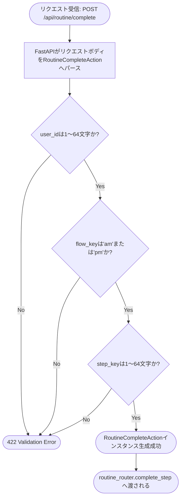
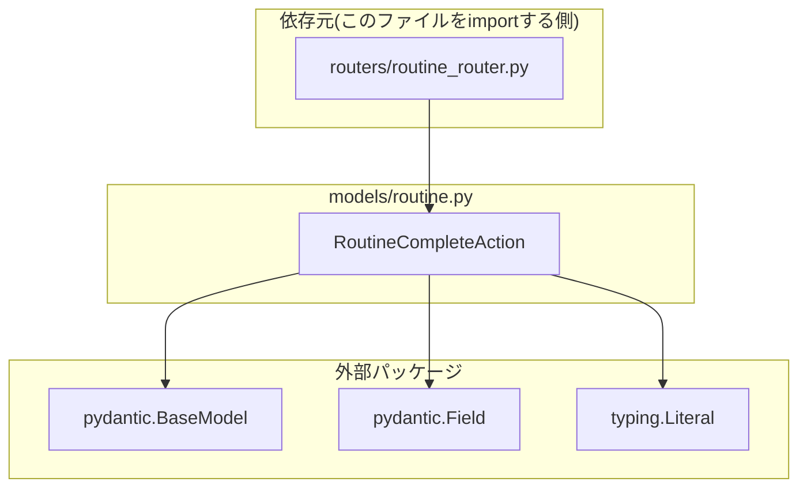

## 1. 解析メタ情報

| 項目 | 内容 |
| --- | --- |
| 対象ファイル | `models/routine.py` |
| 言語 | Python (Pydantic) |
| 解析対象 | 提供されたコードのみ |
| 推測・補完 | 一切なし |
| 解析基準コミット | `a1d2738` |

## 関連ドキュメント

* [routine_router.md](./routine_router.md) - 本ファイルの`RoutineCompleteAction`を`POST /complete`のリクエストボディ型として使用する呼び出し元
* [routine_service.md](./routine_service.md) - `RoutineCompleteAction`の各フィールド値(`user_id`, `flow_key`, `step_key`)を受け取り実処理を行う`RoutineService.complete_step`の実体
* [quest.md](./quest.md) - 同じ`models/`配下にある他ドメイン(クエスト)のRequest/Responseモデル定義。命名・構成パターンの比較対象

## 2. ファイルの概要

デイリールーティン(すごろく形式の生活導線UI)向けのFastAPI/Pydanticリクエストモデル定義ファイル。現時点では`POST /api/routine/complete`(`routine_router.py`)が受け取るリクエストボディ`RoutineCompleteAction`1つのみを定義しており、ファイル冒頭のコメントで明示されている通り「Request Models」区分のみで構成される(Responseモデルは未定義)。
根拠: [ファイル冒頭コメント] (行番号: 5-7 / 抜粋: "# ==========================================\n# Request Models\n# ==========================================")

## 3. 外部依存関係

### インポート一覧

| 名称 | 種類 | 用途 | 根拠 |
| --- | --- | --- | --- |
| `pydantic.BaseModel` | 外部パッケージ | `RoutineCompleteAction`の基底クラス | 根拠: [インポート宣言] (行番号: 2 / 抜粋: "from pydantic import BaseModel, Field") |
| `pydantic.Field` | 外部パッケージ | `user_id`/`step_key`フィールドの文字数制約(`min_length`/`max_length`)の付与 | 根拠: [インポート宣言] (行番号: 2 / 抜粋: "from pydantic import BaseModel, Field") |
| `typing.Literal` | 標準 | `flow_key`フィールドを`'am'`/`'pm'`の2値に限定する型ヒント | 根拠: [インポート宣言] (行番号: 3 / 抜粋: "from typing import Literal") |

### ブラックボックスとなる外部要素

| 名称 | 理由 | 根拠 |
| --- | --- | --- |
| `pydantic.BaseModel`/`Field`のバリデーション実装詳細 | `min_length`/`max_length`違反時に実際にどのような形式(HTTPステータス・エラーボディ)でFastAPIがエラーを返すかは、Pydantic/FastAPI側の実装に依存しており本ファイルからは不明。 | [インポート宣言・フィールド定義] (行番号: 2, 11, 13 / 抜粋: "user_id: str = Field(min_length=1, max_length=64)") |

## 4. 主要要素の定義（関数 / エンドポイント / コンポーネント）

### `RoutineCompleteAction`

* **役割**: `POST /api/routine/complete`(`routine_router.py`の`complete_step`)のリクエストボディを表すPydanticモデル。ユーザーID・対象フローキー・完了させるステップキーの3フィールドを持つ。
* 根拠: [クラス定義] (行番号: 10-13 / 抜粋: "class RoutineCompleteAction(BaseModel):\n    user_id: str = Field(min_length=1, max_length=64)\n    flow_key: Literal['am', 'pm']\n    step_key: str = Field(min_length=1, max_length=64)")

* **引数/リクエスト**: `user_id: str`(1〜64文字必須)、`flow_key: Literal['am', 'pm']`(この2値以外はPydanticバリデーションエラー)、`step_key: str`(1〜64文字必須)
* 根拠: [フィールド定義] (行番号: 11-13 / 抜粋: "user_id: str = Field(min_length=1, max_length=64)\n    flow_key: Literal['am', 'pm']\n    step_key: str = Field(min_length=1, max_length=64)")

* **戻り値/レスポンス**: 該当なし(リクエストモデルであり、レスポンスは`routine_router.py`側の`complete_step`関数が返す`Dict[str, Any]`。[routine_router.md](./routine_router.md)参照)
* 根拠: [クラス定義] (行番号: 10-13、本ファイル内にレスポンス型・戻り値は定義されていない)

* **副作用**: なし(データ構造の定義のみ)
* 根拠: [クラス定義] (行番号: 10-13)

* **エラーハンドリング**: 明示的なエラーハンドリングコードは本ファイルには存在しない。`min_length`/`max_length`制約または`flow_key`の`Literal`制約に違反する値が渡された場合、FastAPI/Pydanticのバリデーション機構により自動的にHTTPエラー(通常422)が生成される(この変換処理自体は本ファイル外のFastAPI/Pydantic側の実装であり、本ファイルからは制約の宣言のみが確認できる)。
* 根拠: [フィールド制約宣言] (行番号: 11, 13 / 抜粋: "Field(min_length=1, max_length=64)")、[Literal型制約] (行番号: 12 / 抜粋: "flow_key: Literal['am', 'pm']")

## 5. 処理フロー図

本ファイルは宣言的なデータモデル定義のみで構成され、分岐や状態遷移を伴う処理ロジックを持たないため、フローチャートによる図示対象となる主要関数は存在しない。リクエストの受理からバリデーションまでの流れを以下に示す。

## 6. 依存関係図

## 7. 次のステップ（リバースエンジニアリングの提案）

| 優先度 | ファイル名(推測可) | 理由 | 根拠 |
| --- | --- | --- | --- |
| 高 | `routers/routine_router.py` | `RoutineCompleteAction`が実際にどのエンドポイントでどう使われるか(パス・レスポンス形状)を確認するため。 | [routine_router.md](./routine_router.md)側で`from models.routine import RoutineCompleteAction`を確認済み |
| 中 | `services/routine_service.py` | `RoutineCompleteAction`の各フィールド値がどのようにビジネスロジックへ渡され処理されるかを確認するため。 | [routine_service.md](./routine_service.md)の`complete_step(user_id, flow_key, step_key, ...)`シグネチャ |
| 低 | `models/quest.py` | 同じ`models/`配下の他ドメインモデルとの命名・構成パターンを比較するため。 | ディレクトリ構成上の類推(本ファイルはこのディレクトリ内に配置される) |

## 8. 保守上の注意点

* 本ファイルにはResponseモデルが定義されていない。`routine_router.py`側の各エンドポイント(`get_today_state`, `complete_step`)は戻り値の型ヒントとして`Dict[str, Any]`を使用しており、レスポンスの実際の形状はPydanticモデルによる型保証の対象外である([routine_router.md](./routine_router.md)参照)。将来的にレスポンス形状を型として固定したい場合は、本ファイルへのResponseモデル追加が選択肢になる。
* `flow_key`は`Literal['am', 'pm']`でハードコードされている。`routine_data.py`の`ROUTINE_FLOWS`辞書のキーと一致している必要があるが、この一致はコード上強制されておらず、両ファイルを手動で同期させる必要がある(`ROUTINE_FLOWS`に新しいフローキーを追加する場合は、本ファイルの`Literal`定義も併せて更新が必要)。

## 9. 不明事項一覧

| 項目 | 理由 | 必要なファイル |
| --- | --- | --- |
| バリデーション違反時の実際のレスポンス形状 | Pydantic/FastAPI側のデフォルト挙動に依存しており、本ファイルにはエラーレスポンスの形式・内容を示すコードが存在しない。 | FastAPI/Pydanticのバージョン・共通例外ハンドラの設定箇所(`unified_server.py`等) |
| Responseモデルが今後追加される計画の有無 | ファイル冒頭コメントは「Request Models」区分のみを示すが、将来Responseモデルを追加する計画があるかどうかは本ファイルからは不明。 | 該当ファイルなし(ロードマップ文書等の追加が必要) |

## 相互参照による補足情報

| 元の不明事項 | 判明した内容 | 参照元ドキュメント |
| --- | --- | --- |
| バリデーション違反時の実際のレスポンス形状 | `MY_HOME_SYSTEM/unified_server.py`を直接確認したところ、登録されている例外ハンドラは`@app.exception_handler(Exception)`(324〜331行目)の**1つだけ**で、`RequestValidationError`用のハンドラは定義されていない。したがって`RoutineCompleteAction`のバリデーション違反は**FastAPI/Pydantic v2の既定動作のまま**であり、HTTP **422 Unprocessable Entity** と`{"detail": [{"type": "...", "loc": ["body", "flow_key"], "msg": "...", "input": ..., "ctx": {...}}]}`形式のJSONが返る(`fastapi==0.141.1` / `pydantic==2.12.5`、`MY_HOME_SYSTEM/requirements.txt:25,73-74`)。具体的には`flow_key`が`'am'`/`'pm'`以外なら`type: "literal_error"`、`user_id`/`step_key`が空文字なら`type: "string_too_short"`、64文字超なら`type: "string_too_long"`となる。**`@app.exception_handler(Exception)`による500変換はこれより後段のため422を上書きしない**(StarletteがHTTPException/RequestValidationErrorを先に処理する)。フロントエンド(`family-quest`)側はこの422を汎用エラーとして扱っており、`detail`配列の中身を個別に解釈する実装は無い。 | 直接ソース確認: `MY_HOME_SYSTEM/unified_server.py:324-331`, `MY_HOME_SYSTEM/requirements.txt:25,73-74`（参考: [unified_server.md](./unified_server.md)） |

## 10. 自己検証結果

* [x] 完了: 推測・外部ファイルの仕様を一切含んでいない
* [x] 完了: 全関数・全クラス・全コンポーネントを列挙した
* [x] 完了: 全てのインポート要素を列挙した
* [x] 完了: すべての仕様説明に「根拠（行番号・抜粋）」を明記した
* [x] 完了: 根拠漏れが0件である
* [x] 完了: Mermaid構文にエラーの原因となる記号（エスケープ漏れ）がない
* [x] 完了: 不明事項を漏れなく列挙した
