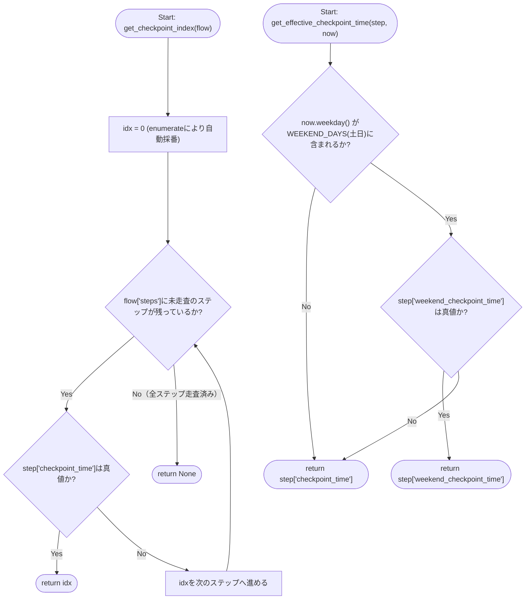
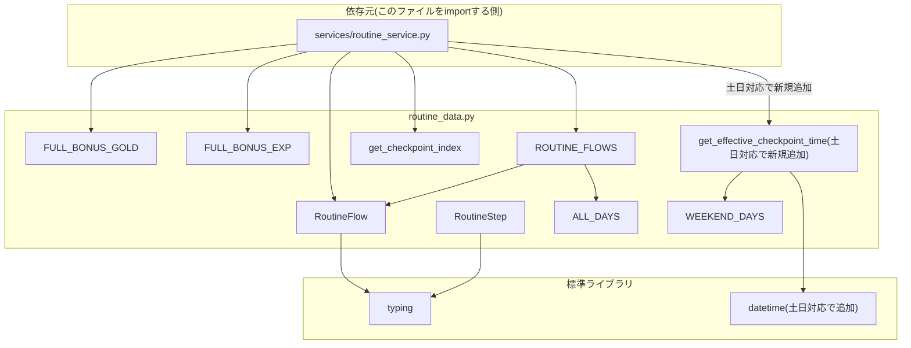

## 1. 解析メタ情報

| 項目 | 内容 |
| --- | --- |
| 対象ファイル | `routine_data.py` |
| 言語 | Python |
| 解析対象 | 提供されたコードのみ |
| 推測・補完 | 一切なし |
| 解析基準コミット | `83b42db` (+同一ブランチ内で土日のチェックポイント時刻上書き機能を追加修正) |

## 関連ドキュメント

* [routine_service.md](./routine_service.md) - `FULL_BONUS_EXP`, `FULL_BONUS_GOLD`, `ROUTINE_FLOWS`, `RoutineFlow`, `get_checkpoint_index`, `get_effective_checkpoint_time`（土日対応で新規追加）を本ファイルからimportして使用する呼び出し元
* [routine_router.md](./routine_router.md) - `routine_service`経由で間接的に本ファイルのデータへ依存するルーター
* [quest_data.md](./quest_data.md) - `FULL_BONUS_GOLD`/`FULL_BONUS_EXP`の値がコメントで参照している`REWARDS`(id=11「Youtube (30:00)」)の定義元
* [migrations/README.md にて言及される`migrations/0010_add_routine_progress.sql`](../../../MY_HOME_SYSTEM/migrations/0010_add_routine_progress.sql) - 本ファイルのコメントが根拠として挙げるマイグレーションSQL(仕様書ドリフト規約によりマイグレーション自体は仕様書対象外だが、コメントの一次ソースとして直接参照)

## 2. ファイルの概要

デイリールーティン(すごろく形式の生活導線UI)の「フロー定義」を保持する定数モジュールである。ファイル冒頭のdocstringが述べる通り、`quest_master`(クエストのマスターデータ)とは異なり、この内容は療育目的で固定された生活動線そのものであり親が編集する対象ではないため、DBテーブルではなくPythonの定数として持つ設計である。朝(`am`)・帰宅後(`pm`)の2つのフロー(`ROUTINE_FLOWS`)を定義し、各フローは開始時刻(`start_trigger_time`)・対象曜日(`day_of_week`)・ステップ列(`steps`)を持つ。**（土日対応で変更）** `day_of_week`は`ALL_DAYS`(月〜日)に統一され、平日・土日の両方でフローが開始する。ステップのうち1つには`checkpoint_time`(強制切替の締切時刻、平日用)を設定でき、そのインデックスを取得するヘルパー関数`get_checkpoint_index`も提供する。**（土日対応で追加）** 各ステップは任意で`weekend_checkpoint_time`(土日用の上書き時刻)を持つことができ、`now`の曜日に応じて実際に使う締切時刻を解決するヘルパー関数`get_effective_checkpoint_time`も追加された。現状、この上書きが実際に設定されているのは`am`フローの`free`ステップ(`weekend_checkpoint_time`が`09:30`)のみで、他のステップは`None`(平日と同じ`checkpoint_time`をそのまま使う)。フロー完走ボーナスの満額(`FULL_BONUS_GOLD`/`FULL_BONUS_EXP`)もここで定義される(土日・平日で同額)。
根拠: [モジュールdocstring] (行番号: 1-8 / 抜粋: "quest_master とは異なり、この内容は療育目的で固定された生活動線そのものであり\n親が編集する対象ではないため、DBテーブルではなくこの定数として持つ\n(migrations/README.md・0010_add_routine_progress.sql参照)。")

## 3. 外部依存関係

### インポート一覧

| 名称 | 種類 | 用途 | 根拠 |
| --- | --- | --- | --- |
| `datetime`（土日対応で追加） | 標準 | `get_effective_checkpoint_time`の引数`now`の型ヒント(`datetime.datetime`)、および曜日判定(`now.weekday()`) | 根拠: [インポート宣言] (行番号: 9 / 抜粋: "import datetime") |
| `typing.List` | 標準 | 型ヒント(`List[int]`, `List[RoutineStep]`) | 根拠: [インポート宣言] (行番号: 10 / 抜粋: "from typing import List, Optional, TypedDict") |
| `typing.Optional` | 標準 | 型ヒント(`Optional[str]`, `Optional[int]`) | 根拠: [インポート宣言] (行番号: 10 / 抜粋: "from typing import List, Optional, TypedDict") |
| `typing.TypedDict` | 標準 | `RoutineStep`/`RoutineFlow`の型定義基底クラス | 根拠: [インポート宣言] (行番号: 10 / 抜粋: "from typing import List, Optional, TypedDict") |

### ブラックボックスとなる外部要素

該当なし(本ファイルはローカルモジュール・外部パッケージへの依存を持たず、`datetime`・`typing`標準ライブラリのみに依存するため、内部実装が不明な外部要素は存在しない)。
根拠: [インポート一覧の網羅] (行番号: 9-10 / 抜粋: "import datetime", "from typing import List, Optional, TypedDict")

## 4. 主要要素の定義（関数 / エンドポイント / コンポーネント）

### `RoutineStep`

* **役割**: すごろくの1マス(1ステップ)を表す型定義。`key`(内部識別子)・`label`(表示名)・`icon_key`(アイコン識別子)・`checkpoint_time`(チェックポイント時刻、'HH:MM'形式または`None`)・**（土日対応で追加）**`weekend_checkpoint_time`(土日用の上書き時刻、'HH:MM'形式または`None`)の5フィールドを持つ`TypedDict`。`weekend_checkpoint_time`が`None`の場合は、土日でも平日と同じ`checkpoint_time`がそのまま使われる(`get_effective_checkpoint_time`参照)。
* 根拠: [クラス定義] (行番号: 13-20 / 抜粋: "class RoutineStep(TypedDict):\n    key: str\n    label: str\n    icon_key: str\n    checkpoint_time: Optional[str]  # 'HH:MM' 形式。設定されたステップだけが強制切替の対象\n    # 土日はチェックポイント時刻だけ変える(要件: フロー構成・ステップは平日と揃える)。\n    # Noneなら平日と同じcheckpoint_timeをそのまま使う。\n    weekend_checkpoint_time: Optional[str]")

* **引数/リクエスト**: 該当なし(型定義であり呼び出し可能な関数ではない)
* 根拠: [クラス定義] (行番号: 13-20)

* **戻り値/レスポンス**: 該当なし
* 根拠: [クラス定義] (行番号: 13-20)

* **副作用**: なし
* 根拠: [クラス定義] (行番号: 13-20)

* **エラーハンドリング**: なし
* 根拠: [クラス定義] (行番号: 13-20)

### `RoutineFlow`

* **役割**: 1つのすごろくフロー(朝または帰宅後)全体を表す型定義。`title`(表示タイトル)・`day_of_week`(対象曜日のリスト、0=月〜6=日)・`start_trigger_time`(このフローが当日開始される時刻、'HH:MM')・`steps`(`RoutineStep`のリスト)の4フィールドを持つ`TypedDict`。
* 根拠: [クラス定義] (行番号: 23-27 / 抜粋: "class RoutineFlow(TypedDict):\n    title: str\n    day_of_week: List[int]\n    start_trigger_time: str  # 'HH:MM'。この時刻を過ぎると当日分の進捗が開始する\n    steps: List[RoutineStep]")

* **引数/リクエスト**: 該当なし
* 根拠: [クラス定義] (行番号: 23-27)

* **戻り値/レスポンス**: 該当なし
* 根拠: [クラス定義] (行番号: 23-27)

* **副作用**: なし
* 根拠: [クラス定義] (行番号: 23-27)

* **エラーハンドリング**: なし
* 根拠: [クラス定義] (行番号: 23-27)

### `ALL_DAYS` / `WEEKEND_DAYS`（土日対応で`WEEKDAYS`から変更）

* **役割**: **（土日対応で変更）** 以前は月〜金(0〜4)のみを表す`WEEKDAYS`定数だったが、`ROUTINE_FLOWS`の両フローが土日にも開始するようになったため、月〜日全体を表す`ALL_DAYS`(`am`・`pm`両フローの`day_of_week`として共用)に置き換えられた。新設の`WEEKEND_DAYS`は土曜(5)・日曜(6)を表す`set`定数で、`get_effective_checkpoint_time`が「今日は土日か」を判定するために使う。
* 根拠: [定数宣言] (行番号: 30-31 / 抜粋: "ALL_DAYS = [0, 1, 2, 3, 4, 5, 6]\nWEEKEND_DAYS = {5, 6}")

* **引数/リクエスト**: 該当なし
* 根拠: [定数宣言] (行番号: 30-31)

* **戻り値/レスポンス**: 該当なし(`ALL_DAYS`の値は`List[int]`のリテラル`[0, 1, 2, 3, 4, 5, 6]`、`WEEKEND_DAYS`の値は`set`のリテラル`{5, 6}`)
* 根拠: [定数宣言] (行番号: 30-31)

* **副作用**: なし
* 根拠: [定数宣言] (行番号: 30-31)

* **エラーハンドリング**: なし
* 根拠: [定数宣言] (行番号: 30-31)

### `FULL_BONUS_GOLD` / `FULL_BONUS_EXP`

* **役割**: フロー完走ボーナスの満額を定義する定数。チェックポイント通過時、チェックポイントより前のステップの達成率に応じて按分される(按分処理の実体は`services/routine_service.py`の`_apply_forced_transition`、[routine_service.md](./routine_service.md)参照)。コメントにより、この満額はquest_data.pyのREWARDS(id=11「Youtube (30:00)」)のごほうび券と同額に設定されていることが明示されている。
* 根拠: [定数宣言・コメント] (行番号: 33-36 / 抜粋: "# フロー完走ボーナスの満額 (Youtube 30分チケット(quest_data.py REWARDS id=11)と同額)。\n# チェックポイント通過時、チェックポイントより前のステップの達成率に応じて按分する。\nFULL_BONUS_GOLD = 150\nFULL_BONUS_EXP = 30")

* **引数/リクエスト**: 該当なし
* 根拠: [定数宣言] (行番号: 35-36)

* **戻り値/レスポンス**: 該当なし(値はそれぞれ`int`リテラル`150`・`30`)
* 根拠: [定数宣言] (行番号: 35-36)

* **副作用**: なし
* 根拠: [定数宣言] (行番号: 35-36)

* **エラーハンドリング**: なし
* 根拠: [定数宣言] (行番号: 35-36)

### `ROUTINE_FLOWS`

* **役割**: フローキー(`'am'`/`'pm'`)をキーとする`RoutineFlow`の辞書。`am`は「起きてから出発まで」(開始05:00、6ステップ)、`pm`は「帰ってから寝るまで」(開始14:00、6ステップ)を定義する。**（土日対応で変更）** いずれも`day_of_week`は`ALL_DAYS`(月〜日)であり、平日・土日ともに同じ時刻(05:00/14:00)で開始する。チェックポイントは`am`の`free`ステップに`checkpoint_time='07:50'`(平日)・`weekend_checkpoint_time='09:30'`(土日、**土日対応で追加**)、`pm`の`free`ステップに`checkpoint_time='20:00'`(平日・土日とも共通、`weekend_checkpoint_time`は未設定)を設定する。
* 根拠: [定数宣言] (行番号: 38-73 / 抜粋: "ROUTINE_FLOWS: dict[str, RoutineFlow] = {\n    'am': {\n        'title': '起きてから出発まで',\n        # 土日も同じフローを使う(要件: なるべく平日と揃える)。チェックポイント時刻だけ\n        # 'free'ステップのweekend_checkpoint_timeで土日用に上書きする。\n        'day_of_week': ALL_DAYS,")
* 根拠: `am`の`free`ステップの土日上書き (行番号: 52-53 / 抜粋: "# 土日は学校が無いため、出発(チェックポイント通過)の締切を09:30に後ろ倒しする。\n            {'key': 'free', 'label': '自由時間', 'icon_key': 'free', 'checkpoint_time': '07:50', 'weekend_checkpoint_time': '09:30'},")
* 根拠: `pm`の`free`ステップは土日も同時刻 (行番号: 67-68 / 抜粋: "# 就寝準備の締切は土日も平日と同じ20:00(要件確認済み)。\n            {'key': 'free', 'label': '自由時間', 'icon_key': 'free', 'checkpoint_time': '20:00', 'weekend_checkpoint_time': None},")

* **引数/リクエスト**: 該当なし
* 根拠: [定数宣言] (行番号: 38-73)

* **戻り値/レスポンス**: 該当なし(値は`dict[str, RoutineFlow]`のリテラル)
* 根拠: [定数宣言] (行番号: 38-73)

* **副作用**: なし
* 根拠: [定数宣言] (行番号: 38-73)

* **エラーハンドリング**: なし
* 根拠: [定数宣言] (行番号: 38-73)

### `get_checkpoint_index`

* **役割**: 渡された`flow`の`steps`を先頭から走査し、`checkpoint_time`が真値(空文字・None以外)であるステップの最初のインデックスを返す。フロー内にチェックポイントを持つステップが存在しない場合は`None`を返す。
* 根拠: [関数定義] (行番号: 76-81 / 抜粋: "def get_checkpoint_index(flow: RoutineFlow) -> Optional[int]:\n    \"\"\"フロー内でチェックポイント(強制切替の境界)を持つステップのインデックスを返す。\"\"\"\n    for idx, step in enumerate(flow['steps']):\n        if step['checkpoint_time']:\n            return idx\n    return None")

* **引数/リクエスト**: `flow: RoutineFlow`
* 根拠: [関数定義] (行番号: 76 / 抜粋: "def get_checkpoint_index(flow: RoutineFlow) -> Optional[int]:")

* **戻り値/レスポンス**: `Optional[int]` — チェックポイントを持つ最初のステップのインデックス、無ければ`None`
* 根拠: [戻り値] (行番号: 79-81 / 抜粋: "return idx" / "return None")

* **副作用**: なし
* 根拠: [関数定義] (行番号: 76-81、副作用となるI/O・状態変更コードは存在しない)

* **エラーハンドリング**: なし(例外送出処理は実装されていない。`flow['steps']`のキーアクセスは`RoutineFlow`が常に`steps`キーを持つ前提で行われる)
* 根拠: [関数定義] (行番号: 76-81、`try`/`except`は存在しない)

### `get_effective_checkpoint_time`（土日対応で新規追加）

* **役割**: 渡された`step`について、`now`の曜日が土日(`WEEKEND_DAYS`に含まれる)かつ`step['weekend_checkpoint_time']`が真値であればその値を、そうでなければ`step['checkpoint_time']`をそのまま返す。`services/routine_service.py`側は、チェックポイントの締切判定([routine_service.md](./routine_service.md)の`_apply_forced_transition`)とレスポンス表示用の`checkpoint_time`算出([routine_service.md](./routine_service.md)の`_serialize_flow`)の両方でこの関数を経由するようになった(以前はどちらも`step['checkpoint_time']`を直接参照していた)。
* 根拠: [関数定義] (行番号: 84-91 / 抜粋: "def get_effective_checkpoint_time(step: RoutineStep, now: datetime.datetime) -> Optional[str]:\n    \"\"\"`now`の曜日に応じた、そのステップの実際のチェックポイント締切時刻を返す。\n\n    土日(weekend_checkpoint_time)の上書きが無ければ平日のcheckpoint_timeをそのまま使う。\n    \"\"\"\n    if now.weekday() in WEEKEND_DAYS and step['weekend_checkpoint_time']:\n        return step['weekend_checkpoint_time']\n    return step['checkpoint_time']")

* **引数/リクエスト**: `step: RoutineStep`, `now: datetime.datetime`
* 根拠: [関数定義] (行番号: 84 / 抜粋: "def get_effective_checkpoint_time(step: RoutineStep, now: datetime.datetime) -> Optional[str]:")

* **戻り値/レスポンス**: `Optional[str]` — 実際に使うべき締切時刻('HH:MM'形式)、チェックポイントでないステップ(`checkpoint_time`も`weekend_checkpoint_time`も`None`)の場合は`None`
* 根拠: [戻り値] (行番号: 89-91 / 抜粋: "if now.weekday() in WEEKEND_DAYS and step['weekend_checkpoint_time']:\n        return step['weekend_checkpoint_time']\n    return step['checkpoint_time']")

* **副作用**: なし
* 根拠: [関数定義] (行番号: 84-91、副作用となるI/O・状態変更コードは存在しない)

* **エラーハンドリング**: なし(`try`/`except`は存在しない。`now`が`None`の場合は`now.weekday()`の呼び出しで`AttributeError`になるが、呼び出し元(`routine_service.py`)は常に`datetime.datetime`を渡す前提で、この関数自体はNoneチェックを行わない)
* 根拠: [関数定義] (行番号: 84-91、`try`/`except`は存在しない)

## 5. 処理フロー図

以下は本ファイルの2つの関数、`get_checkpoint_index`と**（土日対応で新規追加）**`get_effective_checkpoint_time`のフローチャートです。

## 6. 依存関係図

## 7. 次のステップ（リバースエンジニアリングの提案）

| 優先度 | ファイル名(推測可) | 理由 | 根拠 |
| --- | --- | --- | --- |
| 高 | `services/routine_service.py` | 本ファイルの定数群(`ROUTINE_FLOWS`, `FULL_BONUS_GOLD`等)を実際にどう消費するか(進捗管理・按分ボーナス計算のロジック)を把握するため。 | `from routine_data import FULL_BONUS_EXP, FULL_BONUS_GOLD, ROUTINE_FLOWS, RoutineFlow, get_checkpoint_index`([routine_service.md](./routine_service.md)側のインポート宣言) |
| 中 | `quest_data.py` | `FULL_BONUS_GOLD`/`FULL_BONUS_EXP`のコメントが同額の根拠として挙げる`REWARDS`(id=11)の実際の定義内容を確認するため。 | 行番号: 33 のコメント(本ファイル) |
| 低 | `migrations/0010_add_routine_progress.sql` | 本ファイルの冒頭docstringが参照する、進捗を保持するDBテーブル`routine_progress`のスキーマ定義とその設計意図(JSONで持つ理由等)を確認するため。 | [モジュールdocstring] (行番号: 1-8) |

## 8. 保守上の注意点

* **[修正済み]** `pm`フローの`start_trigger_time`は、以前は「仮の既定値」「ユーザー確認事項」とコメントされた未確定の値`'15:00'`だったが、ユーザーが実際の下校/帰宅時刻として`'14:00'`を確定させたため、コメントも含めて更新された。土日も同じ`'14:00'`を使う(要件確認済み)。
  根拠: [コメント] (行番号: 61 / 抜粋: "# 実際の下校/帰宅時刻に合わせてユーザーが確定した値。土日も同じ14:00。\n        'start_trigger_time': '14:00',")
* `FULL_BONUS_GOLD = 150`はquest_data.pyのREWARDS(id=11「Youtube (30:00)」、`cost_gold`)と同額になるよう意図的に設定されている旨がコメントに明記されている。そのため`quest_data.py`側のこの報酬の価格を変更する場合は、本ファイルの`FULL_BONUS_GOLD`も見直しが必要になる(2つの値の同期はコード上強制されておらず、コメントによる申し合わせのみである)。**（土日対応で確認済み）** この満額は土日・平日で同額であり、土日用の別金額は設けられていない。
  根拠: [コメント] (行番号: 33-35 / 抜粋: "# フロー完走ボーナスの満額 (Youtube 30分チケット(quest_data.py REWARDS id=11)と同額)。")
* `am`フローの開始時刻`'05:00'`についても、それより前にアプリを開くと前日分の状態のままになる旨がコメントされている。**（土日対応で確認済み）** この時刻は土日も平日と同じ05:00である。
  根拠: [コメント] (行番号: 44-46 / 抜粋: "# 朝5:00を過ぎたら当日分のすごろくを開始する(それより前にアプリを開いても\n        # 前日分の状態のまま)。土日も同じ(要件確認済み)。\n        'start_trigger_time': '05:00',")
* `ROUTINE_FLOWS`はDBテーブルではなくこのファイルの定数として持つことが、モジュールdocstringにより意図的な設計として明記されている(療育目的の固定生活動線であり、親が編集する対象ではないため)。将来的にステップ内容を可変にする(親が編集できるようにする)場合は、この設計方針自体の見直しが必要になる。
  根拠: [モジュールdocstring] (行番号: 1-8)
* **（土日対応で新規追加）** `weekend_checkpoint_time`が設定されているのは現状`am`フローの`free`ステップ(`'09:30'`)のみであり、他の全ステップ(`am`の他ステップ、`pm`の全ステップ)は`None`である。これは「土日はチェックポイント時刻だけ変える」という要件を、フロー構成・ステップ自体は複製せず単一の`ROUTINE_FLOWS`のまま実現するための設計判断であり、`day_of_week`を`WEEKDAYS`から`ALL_DAYS`(月〜日)に拡張したことと対になっている。将来、他のステップやフロー全体を土日だけ差し替えたい場合は、この「ステップ単位の上書きフィールド」方式では表現できず、フロー自体を`am_weekend`のような別キーに分ける等の再設計が必要になる。
  根拠: [フィールド定義・上書き設定] (行番号: 18-20, 53 / 抜粋: "# 土日はチェックポイント時刻だけ変える(要件: フロー構成・ステップは平日と揃える)。\n    # Noneなら平日と同じcheckpoint_timeをそのまま使う。\n    weekend_checkpoint_time: Optional[str]", "{'key': 'free', 'label': '自由時間', 'icon_key': 'free', 'checkpoint_time': '07:50', 'weekend_checkpoint_time': '09:30'},")

## 9. 不明事項一覧

| 項目 | 理由 | 必要なファイル |
| --- | --- | --- |
| `icon_key`の実際の表示アイコンとの対応関係 | 本ファイルでは文字列キー(例: `'wash'`, `'meal'`)が定義されているのみで、これをどのアイコン画像/絵文字に変換するかはフロントエンド側の実装(`family-quest`)に依存し不明。 | `family-quest/src/features/routine/`配下のコンポーネント(本タスクのスコープ外) |
| ステップ内容を将来的に親が編集できるようにする管理UIの計画有無 | モジュールdocstringは「親が編集する対象ではない」という現状の設計方針を述べるのみで、将来的な可変化の計画有無には触れていない。 | 該当ファイルなし(仕様・ロードマップ文書の追加が必要) |

## 10. 自己検証結果

* [x] 完了: 推測・外部ファイルの仕様を一切含んでいない
* [x] 完了: 全関数・全クラス・全定数を列挙した
* [x] 完了: 全てのインポート要素を列挙した
* [x] 完了: すべての仕様説明に「根拠（行番号・抜粋）」を明記した
* [x] 完了: 根拠漏れが0件である
* [x] 完了: Mermaid構文にエラーの原因となる記号（エスケープ漏れ）がない
* [x] 完了: 不明事項を漏れなく列挙した
