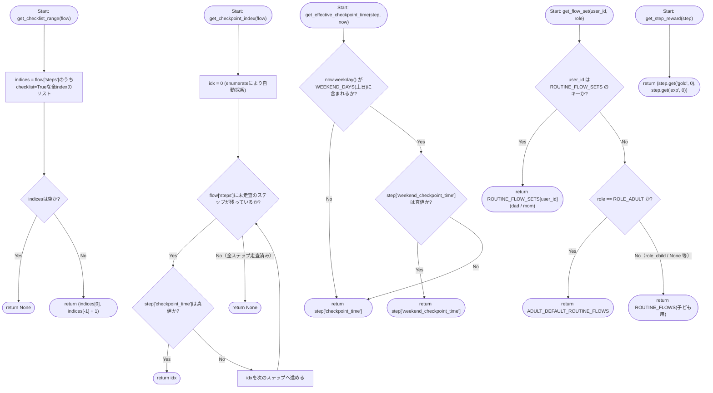
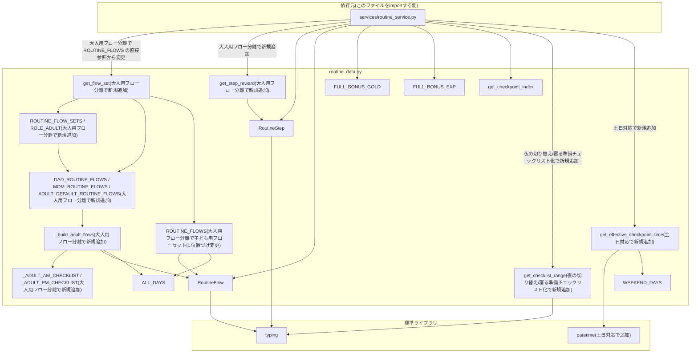

## 1. 解析メタ情報

| 項目 | 内容 |
| --- | --- |
| 対象ファイル | `routine_data.py` |
| 言語 | Python |
| 解析対象 | 提供されたコードのみ |
| 推測・補完 | 一切なし |
| 解析基準コミット | `3ac46ca` (+同一ブランチ内で土日のチェックポイント時刻上書き機能・休日PMのステップスキップ/宿題引き継ぎ機能・朝の準備の順不同チェックリスト化・夜の切り替え時刻変更/寝る準備チェックリスト化/明日の準備追加・**大人用フロー分離/ステップ個別報酬の追加**を追加修正) |

## 関連ドキュメント

* [routine_service.md](./routine_service.md) - `FULL_BONUS_EXP`, `FULL_BONUS_GOLD`, `ROUTINE_FLOWS`, `RoutineFlow`, `get_checklist_range`（寝る準備チェックリスト化で新規追加）, `get_checkpoint_index`, `get_effective_checkpoint_time`（土日対応で新規追加）を本ファイルからimportして使用する呼び出し元
* [routine_router.md](./routine_router.md) - `routine_service`経由で間接的に本ファイルのデータへ依存するルーター
* [quest_data.md](./quest_data.md) - `FULL_BONUS_GOLD`/`FULL_BONUS_EXP`の値がコメントで参照している`REWARDS`(id=11「Youtube (30:00)」)の定義元。**（大人用フロー分離で追加）** ママの`cook_dinner`ステップが持つ`gold`/`exp`は、同ファイルの`QUESTS`から退役させたデイリークエスト(id=21「夕食を作る」)の報酬額をそのまま引き継いだものであり、二重計上を避けるための対応関係にある。パパの`work`ステップは`gold`/`exp`を持たず、報酬は同ファイルの`id=10`「会社勤務 (通常)」がそのまま持ち続ける
* [migrations/README.md にて言及される`migrations/0010_add_routine_progress.sql`](../../../MY_HOME_SYSTEM/migrations/0010_add_routine_progress.sql) - 本ファイルのコメントが根拠として挙げるマイグレーションSQL(仕様書ドリフト規約によりマイグレーション自体は仕様書対象外だが、コメントの一次ソースとして直接参照)

## 2. ファイルの概要

デイリールーティン(すごろく形式の生活導線UI)の「フロー定義」を保持する定数モジュールである。ファイル冒頭のdocstringが述べる通り、`quest_master`(クエストのマスターデータ)とは異なり、この内容は療育目的で固定された生活動線そのものであり親が編集する対象ではないため、DBテーブルではなくPythonの定数として持つ設計である。朝(`am`)・帰宅後(`pm`)の2つのフロー(`ROUTINE_FLOWS`)を定義し、各フローは開始時刻(`start_trigger_time`)・対象曜日(`day_of_week`)・ステップ列(`steps`)を持つ。**（土日対応で変更）** `day_of_week`は`ALL_DAYS`(月〜日)に統一され、平日・土日の両方でフローが開始する。ステップのうち1つには`checkpoint_time`(強制切替の締切時刻、平日用)を設定でき、そのインデックスを取得するヘルパー関数`get_checkpoint_index`も提供する。**（土日対応で追加）** 各ステップは任意で`weekend_checkpoint_time`(土日用の上書き時刻)を持つことができ、`now`の曜日に応じて実際に使う締切時刻を解決するヘルパー関数`get_effective_checkpoint_time`も追加された。現状、この上書きが実際に設定されているのは`am`フローの`free`ステップ(`weekend_checkpoint_time`が`09:30`)のみで、他のステップは`None`(平日と同じ`checkpoint_time`をそのまま使う)。**（休日PM微修正で追加）** さらに各ステップは`weekend_skip`(Trueなら土日はこのステップ自体をスキップ)・`weekend_carryover`(Trueなら日付をまたいだ完了引き継ぎの対象)の2つの`bool`フィールドを持つ。`pm`フローの`handwash`ステップのみ`weekend_skip=True`(土日はおやつ休憩から開始)、`homework`ステップのみ`weekend_carryover=True`(金曜/土曜に完了していれば以降の土日は不要)であり、他の全ステップは両方とも`False`である。これら2フィールドの実際の判定・スキップ処理自体は本ファイルにはヘルパー関数がなく、`services/routine_service.py`の`_resolve_skip_keys`/`_empty_statuses`/`_next_active_index`が行う([routine_service.md](./routine_service.md)参照)。**（朝の準備チェックリスト化で追加）** 各ステップはさらに`checklist`(Trueなら同じフロー内の他の`checklist=True`ステップと合わせて順不同でチェックできる「チェックリスト」グループの一員になる)という`bool`フィールドを持つ。`am`フローの先頭5ステップ(`meal`・`clothes`・`wash`・`teeth`・`toilet`、この順で表示される)、**（夜の切り替え/寝る準備チェックリスト化で追加）**`pm`フローのチェックポイント(`free`)通過後の4ステップ(`dinner`・`bath`・`nightclothes`・`nightteeth`)が`checklist=True`であり、他の全ステップは`False`である。`checklist=True`のステップがフロー内で連続する一塊であることは本ファイルのコメントで明記された前提だが、**（夜の切り替え/寝る準備チェックリスト化で変更）** この一塊は以前「フロー先頭のみ」を想定していたのに対し、現在は`am`のようにフロー先頭に置くことも、`pm`のようにチェックポイント通過後に置くことも可能な設計に一般化され、この前提を機械的に取得するヘルパー関数`get_checklist_range`が新設された。この前提・ヘルパーを実際に使って初期化・トグル処理を行うのは本ファイルではなく`services/routine_service.py`側である。フロー完走ボーナスの満額(`FULL_BONUS_GOLD`/`FULL_BONUS_EXP`)もここで定義される(土日・平日で同額)。
根拠: [モジュールdocstring] (行番号: 3-10 / 抜粋: "quest_master とは異なり、この内容は療育目的で固定された生活動線そのものであり\n親が編集する対象ではないため、DBテーブルではなくこの定数として持つ\n(migrations/README.md・0010_add_routine_progress.sql参照)。")

**（大人用フロー分離で追加）** 従来、`ROUTINE_FLOWS`は全ユーザーで共用されており、保護者(`role_adult`)の画面にも子ども向けのステップ(`homework`「宿題」・`tomorrow_prep`「明日の準備」)がそのまま表示されていた。本改修で、ユーザーごとにフローセットを切り替える仕組み(`ROUTINE_FLOW_SETS`・`get_flow_set`)と、大人用フローの定義(`_build_adult_flows`により生成される`DAD_ROUTINE_FLOWS`・`MOM_ROUTINE_FLOWS`・`ADULT_DEFAULT_ROUTINE_FLOWS`)が追加された。`ROUTINE_FLOWS`は子ども用フローセットとして残り、`get_flow_set`のフォールバック先も兼ねる。併せて`RoutineStep`に任意フィールド`gold`/`exp`(ステップ個別の即時報酬)が追加され、その取得ヘルパー`get_step_reward`も提供される。この報酬は、生活動線そのものだったデイリークエスト(`quest_data.py`の`QUESTS`)を「すごろく」側へ寄せる際に、元のクエストと同額の報酬を引き継ぐために使われる(現状の対象はママの`cook_dinner`「夕食を作る」のみ)。

**（お仕事ステップ追加で更新）** 大人用フローの`pm`一本道は、人によって置かれるステップが異なる: パパは「帰宅・手洗い」より**前**に`work`「お仕事」(`_build_adult_flows`の`lead_steps`。pmフローは14:00開始だが平日のその時刻はまだ勤務中のため)、ママは「ひと休み」の**後**に`cook_dinner`「夕食を作る」(`task_steps`。子ども用の「宿題」「明日の準備」と同じ位置)が入る。`work`は`gold`/`exp`を持たず報酬は既存クエスト id=10「会社勤務 (通常)」が持ち続けるのに対し、`cook_dinner`は`quest_data.QUESTS`から退役させた id=21「夕食を作る」の報酬(exp150/gold150)をステップ個別報酬として引き継ぐ。

## 3. 外部依存関係

### インポート一覧

| 名称 | 種類 | 用途 | 根拠 |
| --- | --- | --- | --- |
| `datetime`（土日対応で追加） | 標準 | `get_effective_checkpoint_time`の引数`now`の型ヒント(`datetime.datetime`)、および曜日判定(`now.weekday()`) | 根拠: [インポート宣言] (行番号: 9 / 抜粋: "import datetime") |
| `typing.List` | 標準 | 型ヒント(`List[int]`, `List[RoutineStep]`) | 根拠: [インポート宣言] (行番号: 10 / 抜粋: "from typing import List, Optional, Tuple, TypedDict") |
| `typing.Optional` | 標準 | 型ヒント(`Optional[str]`, `Optional[int]`) | 根拠: [インポート宣言] (行番号: 10 / 抜粋: "from typing import List, Optional, Tuple, TypedDict") |
| `typing.Tuple`（夜の切り替え/寝る準備チェックリスト化で追加） | 標準 | `get_checklist_range`の戻り値の型ヒント(`Optional[Tuple[int, int]]`) | 根拠: [インポート宣言] (行番号: 10 / 抜粋: "from typing import List, Optional, Tuple, TypedDict") |
| `typing.TypedDict` | 標準 | `RoutineStep`/`RoutineFlow`の型定義基底クラス | 根拠: [インポート宣言] (行番号: 10 / 抜粋: "from typing import List, Optional, Tuple, TypedDict") |

### ブラックボックスとなる外部要素

該当なし(本ファイルはローカルモジュール・外部パッケージへの依存を持たず、`datetime`・`typing`標準ライブラリのみに依存するため、内部実装が不明な外部要素は存在しない)。
根拠: [インポート一覧の網羅] (行番号: 9-10 / 抜粋: "import datetime", "from typing import List, Optional, Tuple, TypedDict")

## 4. 主要要素の定義（関数 / エンドポイント / コンポーネント）

### `RoutineStep`

* **役割**: すごろくの1マス(1ステップ)を表す型定義。`key`(内部識別子)・`label`(表示名)・`icon_key`(アイコン識別子)・`checkpoint_time`(チェックポイント時刻、'HH:MM'形式または`None`)・**（土日対応で追加）**`weekend_checkpoint_time`(土日用の上書き時刻、'HH:MM'形式または`None`)・**（休日PM微修正で追加）**`weekend_skip`(Trueなら土日はこのステップ自体をスキップする`bool`)・**（休日PM微修正で追加）**`weekend_carryover`(Trueならこのステップは日付をまたいだ完了引き継ぎの対象になる`bool`)・**（朝の準備チェックリスト化で追加）**`checklist`(Trueなら同じフロー内の他の`checklist=True`ステップと合わせて順不同でチェックできるグループの一員になる`bool`)の8フィールドを持つ`TypedDict`。`weekend_checkpoint_time`が`None`の場合は、土日でも平日と同じ`checkpoint_time`がそのまま使われる(`get_effective_checkpoint_time`参照)。`weekend_skip`/`weekend_carryover`/`checklist`いずれも実際の判定処理は本ファイルには実装されておらず、`services/routine_service.py`側に委ねられている。`checklist`フィールドのコメントには、`checklist=True`のステップはフロー内で連続する一塊のみを想定しているという設計上の前提が明記されている。**（夜の切り替え/寝る準備チェックリスト化で変更）** このコメントは以前「先頭から連続する一塊」という、フロー先頭固定を前提とした表現だったが、`pm`フローでチェックポイント通過後にもチェックリストを置けるようにしたことに伴い、「フロー先頭・チェックポイント通過後のどちらにも置ける単一の連続ブロック」という一般化された表現に改められ、このブロックを取得する`get_checklist_range`ヘルパー関数への参照も追加された。
* 根拠: [クラス定義] (行番号: 13-33 / 抜粋: "class _RoutineStepBase(TypedDict):\n    key: str\n    label: str\n    icon_key: str\n    checkpoint_time: Optional[str]  # 'HH:MM' 形式。設定されたステップだけが強制切替の対象\n    # 土日はチェックポイント時刻だけ変える(要件: フロー構成・ステップは平日と揃える)。\n    # Noneなら平日と同じcheckpoint_timeをそのまま使う。\n    weekend_checkpoint_time: Optional[str]\n    # Trueなら土日はこのステップ自体をスキップする(要件: 休日PMはおやつ休憩から開始)。\n    weekend_skip: bool\n    # Trueならこのステップは日付をまたいで引き継ぐ(要件: 宿題は金曜終わっていれば\n    # 土日は不要、土曜終わっていれば日曜は不要)。判定はroutine_service側で行う。\n    weekend_carryover: bool")
* **（大人用フロー分離で追加）** 上記8フィールドの必須部分は`_RoutineStepBase`という別の`TypedDict`へ切り出され、`RoutineStep`はそれを継承しつつ`total=False`で任意フィールド`gold`(int)・`exp`(int)を追加する形になった。これは「ステップ個別の即時報酬」であり、docstringによれば、大人用フローで生活動線そのものだったデイリークエスト(`quest_data.QUESTS`)を「すごろく」側へ寄せる際に、元のクエストと同額の報酬をそのステップの完了報告時点で付与するために使う。省略時は0として扱われ(`get_step_reward`)、子ども用フローの全ステップは`gold`/`exp`を持たないため従来どおりチェックポイント通過ボーナスの按分だけが報酬になる。`total=False`により既存のステップリテラル(これらのキーを持たない)もそのまま有効なままである。
* 根拠: [クラス定義] (行番号: 13, 36-47 / 抜粋: "class _RoutineStepBase(TypedDict):" … "class RoutineStep(_RoutineStepBase, total=False):\n    \"\"\"ステップ個別の即時報酬(任意)。\n\n    大人用フロー(ROUTINE_FLOW_SETS)で、生活動線そのものだったデイリークエスト\n    (例: ママの「夕食を作る」)を quest_data.QUESTS から「すごろく」側へ寄せる\n    ために使う。指定したステップを順番どおり完了報告した時点で、元のクエストと\n    同額の gold/exp をその場で付与する(get_step_reward参照)。省略時は0で、\n    子ども用フローの全ステップは従来どおりチェックポイント通過ボーナス\n    (FULL_BONUS_GOLD/EXPの按分)だけを報酬とする。\n    \"\"\"\n    gold: int\n    exp: int")
* 根拠: `checklist`フィールドの定義とその前提コメント (行番号: 26-33 / 抜粋: "# Trueならこのステップは同じフロー内の他のchecklist=Trueなステップと合わせて\n    # 順不同でチェックできる「チェックリスト」グループの一員になる(要件: 朝の準備・\n    # 寝る準備は順番を強制せず好きな順にチェックしたい)。フロー内でchecklist=Trueな\n    # ステップは連続する一塊のみを想定している(get_checklist_range参照)。この塊は\n    # フロー先頭(例: amの朝の準備5項目)・チェックポイント通過後(例: pmの寝る準備4項目)\n    # のどちらにも置けるが、routine_service側はシーケンシャルな進行が塊の先頭indexに\n    # 到達した時点で塊全体を一括'current'にする、という単一の仕組みで両対応している。\n    checklist: bool")

* **引数/リクエスト**: 該当なし(型定義であり呼び出し可能な関数ではない)
* 根拠: [クラス定義] (行番号: 13-33)

* **戻り値/レスポンス**: 該当なし
* 根拠: [クラス定義] (行番号: 13-33)

* **副作用**: なし
* 根拠: [クラス定義] (行番号: 13-33)

* **エラーハンドリング**: なし
* 根拠: [クラス定義] (行番号: 13-33)

### `RoutineFlow`

* **役割**: 1つのすごろくフロー(朝または帰宅後)全体を表す型定義。`title`(表示タイトル)・`day_of_week`(対象曜日のリスト、0=月〜6=日)・`start_trigger_time`(このフローが当日開始される時刻、'HH:MM')・`steps`(`RoutineStep`のリスト)の4フィールドを持つ`TypedDict`。
* 根拠: [クラス定義] (行番号: 50-54 / 抜粋: "class RoutineFlow(TypedDict):\n    title: str\n    day_of_week: List[int]\n    start_trigger_time: str  # 'HH:MM'。この時刻を過ぎると当日分の進捗が開始する\n    steps: List[RoutineStep]")

* **引数/リクエスト**: 該当なし
* 根拠: [クラス定義] (行番号: 36-40)

* **戻り値/レスポンス**: 該当なし
* 根拠: [クラス定義] (行番号: 36-40)

* **副作用**: なし
* 根拠: [クラス定義] (行番号: 36-40)

* **エラーハンドリング**: なし
* 根拠: [クラス定義] (行番号: 36-40)

### `ALL_DAYS` / `WEEKEND_DAYS`（土日対応で`WEEKDAYS`から変更）

* **役割**: **（土日対応で変更）** 以前は月〜金(0〜4)のみを表す`WEEKDAYS`定数だったが、`ROUTINE_FLOWS`の両フローが土日にも開始するようになったため、月〜日全体を表す`ALL_DAYS`(`am`・`pm`両フローの`day_of_week`として共用)に置き換えられた。新設の`WEEKEND_DAYS`は土曜(5)・日曜(6)を表す`set`定数で、`get_effective_checkpoint_time`が「今日は土日か」を判定するために使う。
* 根拠: [定数宣言] (行番号: 57-58 / 抜粋: "ALL_DAYS = [0, 1, 2, 3, 4, 5, 6]\nWEEKEND_DAYS = {5, 6}")

* **引数/リクエスト**: 該当なし
* 根拠: [定数宣言] (行番号: 43-44)

* **戻り値/レスポンス**: 該当なし(`ALL_DAYS`の値は`List[int]`のリテラル`[0, 1, 2, 3, 4, 5, 6]`、`WEEKEND_DAYS`の値は`set`のリテラル`{5, 6}`)
* 根拠: [定数宣言] (行番号: 43-44)

* **副作用**: なし
* 根拠: [定数宣言] (行番号: 43-44)

* **エラーハンドリング**: なし
* 根拠: [定数宣言] (行番号: 43-44)

### `FULL_BONUS_GOLD` / `FULL_BONUS_EXP`

* **役割**: フロー完走ボーナスの満額を定義する定数。チェックポイント通過時、チェックポイントより前のステップの達成率に応じて按分される(按分処理の実体は`services/routine_service.py`の`_apply_forced_transition`、[routine_service.md](./routine_service.md)参照)。コメントにより、この満額はquest_data.pyのREWARDS(id=11「Youtube (30:00)」)のごほうび券と同額に設定されていることが明示されている。
* 根拠: [定数宣言・コメント] (行番号: 60-63 / 抜粋: "# フロー完走ボーナスの満額 (Youtube 30分チケット(quest_data.py REWARDS id=11)と同額)。\n# チェックポイント通過時、チェックポイントより前のステップの達成率に応じて按分する。\nFULL_BONUS_GOLD = 150\nFULL_BONUS_EXP = 30")

* **引数/リクエスト**: 該当なし
* 根拠: [定数宣言] (行番号: 48-49)

* **戻り値/レスポンス**: 該当なし(値はそれぞれ`int`リテラル`150`・`30`)
* 根拠: [定数宣言] (行番号: 48-49)

* **副作用**: なし
* 根拠: [定数宣言] (行番号: 48-49)

* **エラーハンドリング**: なし
* 根拠: [定数宣言] (行番号: 48-49)

### `ROUTINE_FLOWS`（大人用フロー分離で「子ども用フローセット」に位置づけ変更）

* **役割**: フローキー(`'am'`/`'pm'`)をキーとする`RoutineFlow`の辞書。**（大人用フロー分離で変更）** 以前は全ユーザーがこの辞書を共用していたが、現在は智矢・涼花などの子ども用フローセットであり、保護者には`ROUTINE_FLOW_SETS`側の大人用フローが使われる。`get_flow_set`が、user_id固有定義にもなく`role`も`role_adult`でないユーザーに返すフォールバック先でもあるため、名前は`ROUTINE_FLOWS`のまま据え置かれている。`am`は「起きてから出発まで」(開始05:00、6ステップ、**画面非表示化で末尾の`leave`ステップを削除し7→6に変更**)、`pm`は「帰ってから寝るまで」(開始14:00、10ステップ、**夜の切り替え/寝る準備チェックリスト化でステップ数が6→10に変更**)を定義する。**（土日対応で変更）** いずれも`day_of_week`は`ALL_DAYS`(月〜日)であり、平日・土日ともに同じ時刻(05:00/14:00)で開始する。チェックポイントは`am`の`free`ステップに`checkpoint_time='07:50'`(平日)・`weekend_checkpoint_time='09:30'`(土日、**土日対応で追加**)、`pm`の`free`ステップに`checkpoint_time='18:00'`(平日・土日とも共通、`weekend_checkpoint_time`は未設定。**夜の切り替え/寝る準備チェックリスト化で20:00から変更、要件確認済み: 土日も平日と同じ18:00のまま現状維持**)を設定する。**（休日PM微修正で追加）** `pm`フローの先頭ステップ`handwash`には`weekend_skip=True`が設定されており、土日は`おやつ休憩`(`snack`)からフローが開始する。`pm`フローの`homework`(宿題)、**（夜の切り替え/寝る準備チェックリスト化で追加）**および新設の`tomorrow_prep`(明日の準備)ステップには`weekend_carryover=True`が設定されており、金曜または土曜に完了していれば以降の土日はスキップされる(具体的な判定ロジックは[routine_service.md](./routine_service.md)の`_resolve_skip_keys`を参照)。`am`フロー側のステップは`weekend_skip`/`weekend_carryover`とも全ステップ`False`のままであり対象外である。**（朝の準備チェックリスト化で変更）** `am`フローの先頭5ステップは、`meal`(朝ごはん)→`clothes`(着替える)→`wash`(顔を洗う)→`teeth`(歯磨き)→`toilet`(トイレ)の5ステップ`checklist=True`グループである。表示順はこの並びで固定だが、`checklist=True`により実施順は問わない(要件確認済み)。5項目均等割りだと満額150Gold/30EXPをちょうど割り切れる(1項目=30Gold/6EXP相当)ことがコメントに明記されている。`free`(チェックポイント)は引き続き`checklist=False`の逐次ステップであり、かつ`am`フローで最後のステップになった(**画面非表示化で変更**: 以前はこの後に単なる「出発」表示用ステップ`leave`が続いていたが、タップ操作以外の意味を持たなかったため削除した。`free`がフロー最後のステップになったことで、締切通過時の強制遷移(`_apply_forced_transition`)が計算する次アクティブindexがそのまま`len(steps)`と一致し、`is_complete=True`へ直接遷移するようになる。要件: 7:50を過ぎたら朝の準備の画面自体を表示しない)。**（夜の切り替え/寝る準備チェックリスト化で変更）** `pm`フローは、`handwash`→`snack`→`homework`の後に新設の`tomorrow_prep`(明日の準備)ステップが続き、その後の`free`(チェックポイント、18:00)を経て、以前は単一ステップだった`寝る準備`が`dinner`(晩ごはん)→`bath`(お風呂)→`nightclothes`(着替え)→`nightteeth`(歯磨き)の4ステップ`checklist=True`グループに変更され、最後に`sleep`(就寝)が続く構成になった。このチェックリストは`am`と異なりチェックポイント(`free`)の**後**に置かれており、出発ボーナスの按分対象(チェックポイントより前の`handwash`/`snack`/`homework`/`tomorrow_prep`の4ステップ)には含まれない(`services/routine_service.py`の`_eligible_done_ratio`が対象範囲を決める、[routine_service.md](./routine_service.md)参照)。`dinner`のアイコンキーは`am`の`meal`ステップと同じ`'meal'`、`nightclothes`/`nightteeth`のアイコンキーも`am`の`clothes`/`teeth`と同じ値を再利用しており、`bath`のみ新規のアイコンキー`'bath'`を持つ。
* 根拠: [定数宣言] (行番号: 67-126 / 抜粋: "ROUTINE_FLOWS: dict[str, RoutineFlow] = {\n    'am': {\n        'title': '起きてから出発まで',\n        # 土日も同じフローを使う(要件: なるべく平日と揃える)。チェックポイント時刻だけ\n        # 'free'ステップのweekend_checkpoint_timeで土日用に上書きする。\n        'day_of_week': ALL_DAYS,")
* 根拠: `am`の朝の準備5項目がチェックリスト化された旨のコメント (行番号: 77-79 / 抜粋: "# 朝の準備5項目は順番を強制しないチェックリスト(要件確認済み: 表示順は\n            # 固定するが実施順は問わない)。5項目均等割りだと満額150Gold/30EXPを\n            # ぴったり割り切れる(1項目=30Gold/6EXP相当)。")
* 根拠: `am`の`free`ステップの土日上書き、`checklist=False`、末尾ステップ化の経緯コメント(**画面非表示化で追加**) (行番号: 85-94 / 抜粋: "# 土日は学校が無いため、出発(チェックポイント通過)の締切を09:30に後ろ倒しする。\n            # （画面非表示化で変更）以前はこの後に単なる「出発」表示用ステップ(leave、\n            # タップ操作以外の意味を持たない)が続いていたが、削除した。'free'がこの\n            # フローで最後(かつ唯一)のchecklist=Trueブロック直後のステップのため、\n            # _apply_forced_transitionが締切通過時にnext_active_indexへ渡すindexが\n            # len(steps)と一致し、is_complete=Trueへ直接遷移するようになる(要件:\n            # 7:50を過ぎたら朝の準備の画面自体を表示しない。isRoutineFlowBlocking/\n            # isRoutineFlowFreeTimeは共にis_complete=Trueで false になるため、\n            # フロントエンド側の変更は不要)。\n            {'key': 'free', 'label': '自由時間', 'icon_key': 'free', 'checkpoint_time': '07:50', 'weekend_checkpoint_time': '09:30', 'weekend_skip': False, 'weekend_carryover': False, 'checklist': False},")
* 根拠: `pm`フローのコメントによる休日スキップ方針の明記 (行番号: 99-100 / 抜粋: "# 土日も同じフローを使う(要件: なるべく平日と揃える)。土日は先頭の\n        # handwashだけスキップし、おやつ休憩から開始する(要件確認済み)。")
* 根拠: `handwash`ステップの`weekend_skip=True` (行番号: 105-106 / 抜粋: "# 土日は手洗い・うがいをスキップし、おやつ休憩からスタートする(要件確認済み)。\n            {'key': 'handwash', 'label': '手洗い・うがい', 'icon_key': 'handwash', 'checkpoint_time': None, 'weekend_checkpoint_time': None, 'weekend_skip': True, 'weekend_carryover': False, 'checklist': False},")
* 根拠: `homework`ステップの`weekend_carryover=True` (行番号: 108-110 / 抜粋: "# 金曜に完了していれば土日は不要、土曜に完了していれば日曜は不要\n            # (要件確認済み)。判定はroutine_service._resolve_skip_keysが行う。\n            {'key': 'homework', 'label': '宿題', 'icon_key': 'homework', 'checkpoint_time': None, 'weekend_checkpoint_time': None, 'weekend_skip': False, 'weekend_carryover': True, 'checklist': False},")
* 根拠: 新設`tomorrow_prep`ステップ(`weekend_carryover=True`) (行番号: 111-113 / 抜粋: "# 明日の準備も宿題と同じ繰越ルール(要件確認済み: 金曜/土曜に完了していれば\n            # 以降の土日は不要)。\n            {'key': 'tomorrow_prep', 'label': '明日の準備', 'icon_key': 'tomorrow_prep', 'checkpoint_time': None, 'weekend_checkpoint_time': None, 'weekend_skip': False, 'weekend_carryover': True, 'checklist': False},")
* 根拠: `pm`の`free`ステップの締切が18:00に変更、土日も同時刻 (行番号: 114-116 / 抜粋: "# 自由時間→寝る準備の締切を18:00に変更(要件確認済み)。土日も平日と同じ\n            # 18:00のまま(要件確認済み: 現状維持)。\n            {'key': 'free', 'label': '自由時間', 'icon_key': 'free', 'checkpoint_time': '18:00', 'weekend_checkpoint_time': None, 'weekend_skip': False, 'weekend_carryover': False, 'checklist': False},")
* 根拠: 寝る準備4項目のチェックリスト化コメントと4ステップの定義 (行番号: 117-123 / 抜粋: "# 寝る準備4項目は朝の準備と同様、順番を強制しないチェックリスト\n            # (要件確認済み)。チェックポイント(free)通過後に一括で'current'になる。\n            {'key': 'dinner', 'label': '晩ごはん', 'icon_key': 'meal', 'checkpoint_time': None, 'weekend_checkpoint_time': None, 'weekend_skip': False, 'weekend_carryover': False, 'checklist': True},\n            {'key': 'bath', 'label': 'お風呂', 'icon_key': 'bath', 'checkpoint_time': None, 'weekend_checkpoint_time': None, 'weekend_skip': False, 'weekend_carryover': False, 'checklist': True},\n            {'key': 'nightclothes', 'label': '着替え', 'icon_key': 'clothes', 'checkpoint_time': None, 'weekend_checkpoint_time': None, 'weekend_skip': False, 'weekend_carryover': False, 'checklist': True},\n            {'key': 'nightteeth', 'label': '歯磨き', 'icon_key': 'teeth', 'checkpoint_time': None, 'weekend_checkpoint_time': None, 'weekend_skip': False, 'weekend_carryover': False, 'checklist': True},")

* **引数/リクエスト**: 該当なし
* 根拠: [定数宣言] (行番号: 51-110)

* **戻り値/レスポンス**: 該当なし(値は`dict[str, RoutineFlow]`のリテラル)
* 根拠: [定数宣言] (行番号: 51-110)

* **副作用**: なし
* 根拠: [定数宣言] (行番号: 51-110)

* **エラーハンドリング**: なし
* 根拠: [定数宣言] (行番号: 51-110)

### `_ADULT_AM_CHECKLIST` / `_ADULT_PM_CHECKLIST`（大人用フロー分離で新規追加）

* **役割**: 大人用フローの朝のチェックリスト5項目(`meal`/`clothes`/`wash`/`teeth`/`toilet`)、および寝る準備チェックリスト4項目(`dinner`/`bath`/`nightclothes`/`nightteeth`)を保持するモジュール内定数(`List[RoutineStep]`)。いずれも子ども用フロー(`ROUTINE_FLOWS`)の同名ステップとキー・ラベル・アイコンキーが一致しており、コメントによれば朝は「大人側に固有の朝の家事は無いため」子どもと全く同じ5項目・同じ締切にしている。`_build_adult_flows`が生成する全ての大人用フローで共有される。
* 根拠: [定数宣言] (行番号: 144-160 / 抜粋: "# 朝は子どもと全く同じ5項目・同じ締切にする(大人側に固有の朝の家事は無いため)。\n_ADULT_AM_CHECKLIST: List[RoutineStep] = [" … "# 寝る準備も子どもと同じ4項目。チェックポイント(18:00)通過後に一括で'current'になる。\n_ADULT_PM_CHECKLIST: List[RoutineStep] = [")

* **引数/リクエスト**: 該当なし
* 根拠: [定数宣言] (行番号: 144-160)

* **戻り値/レスポンス**: 該当なし
* 根拠: [定数宣言] (行番号: 144-160)

* **副作用**: なし
* 根拠: [定数宣言] (行番号: 144-160)

* **エラーハンドリング**: なし
* 根拠: [定数宣言] (行番号: 144-160)

### `_build_adult_flows`（大人用フロー分離で新規追加）

* **役割**: 大人1人分の`am`/`pm`フローを組み立てて`dict[str, RoutineFlow]`で返すファクトリ関数。`am`は`_ADULT_AM_CHECKLIST`の5項目＋`free`(チェックポイント、平日07:50・土日09:30)という、子ども用`am`と同一の構成。`pm`は引数`lead_steps`→`handwash`(「帰宅・手洗い」、`weekend_skip=True`)→`snack`(「ひと休み」)→引数`task_steps`→`free`(チェックポイント18:00)→`_ADULT_PM_CHECKLIST`の4項目→`sleep`(「就寝」)という構成で、子ども用`pm`の`homework`/`tomorrow_prep`が置かれていた位置に`task_steps`が入る。**（お仕事ステップ追加で新設）** `lead_steps`は「帰宅・手洗い」より**前**に差し込むステップで、docstringによれば「pmフローは14:00開始なので、その時刻にまだ帰宅していない人(パパの『お仕事』)はここに入る」。docstringは両引数について「どちらもチェックポイント(18:00)より前にあるため、出発ボーナスの按分対象になる(`_eligible_done_ratio`)」と明記している。
* 根拠: [関数定義とdocstring] (行番号: 162-207 / 抜粋: "def _build_adult_flows(\n    task_steps: List[RoutineStep], lead_steps: Optional[List[RoutineStep]] = None\n) -> dict[str, RoutineFlow]:\n    \"\"\"大人1人分のam/pmフローを組み立てる。\n\n    `task_steps` は pm フローの一本道(帰宅→ひと休み→ここ→自由時間)に差し込む、\n    その人固有のタスク。子ども用フローで「宿題」「明日の準備」が置かれている\n    位置に相当する。\n\n    `lead_steps` は「帰宅・手洗い」より前に差し込むステップ。pmフローは14:00開始\n    なので、その時刻にまだ帰宅していない人(パパの「お仕事」)はここに入る。\n\n    どちらもチェックポイント(18:00)より前にあるため、出発ボーナスの按分対象になる\n    (_eligible_done_ratio)。\n    \"\"\"")

* **引数/リクエスト**: `task_steps: List[RoutineStep]` — `pm`フローの一本道(「ひと休み」の後)に差し込む、その人固有のタスクステップのリスト。空リストも可(`DAD_ROUTINE_FLOWS`・`ADULT_DEFAULT_ROUTINE_FLOWS`がそのケース)。`lead_steps: Optional[List[RoutineStep]] = None` — 「帰宅・手洗い」より前に差し込むステップのリスト(**お仕事ステップ追加で新設**)。省略時は`None`で、`*(lead_steps or [])`により何も差し込まれない。
* 根拠: [関数シグネチャ] (行番号: 162-164 / 抜粋: "def _build_adult_flows(\n    task_steps: List[RoutineStep], lead_steps: Optional[List[RoutineStep]] = None\n) -> dict[str, RoutineFlow]:")、[lead_stepsの展開] (行番号: 193 / 抜粋: "                *(lead_steps or []),")

* **戻り値/レスポンス**: `dict[str, RoutineFlow]`。キーは`'am'`/`'pm'`の2つで、`ROUTINE_FLOWS`と同じ形。
* 根拠: [return文] (行番号: 177-205 / 抜粋: "    return {\n        'am': {\n            'title': '起きてから出発まで',")

* **副作用**: なし(呼び出しごとに新しい辞書・リストを構築して返すのみ)
* 根拠: [return文] (行番号: 179-207)

* **エラーハンドリング**: なし
* 根拠: [関数定義] (行番号: 162-207)

### `DAD_ROUTINE_FLOWS` / `MOM_ROUTINE_FLOWS` / `ADULT_DEFAULT_ROUTINE_FLOWS`（大人用フロー分離で新規追加）

* **役割**: `_build_adult_flows`に渡すステップだけが異なる3つの大人用フローセット。`DAD_ROUTINE_FLOWS`は`task_steps`が空で、代わりに`lead_steps`として`work`(「お仕事」、`icon_key='work'`、`weekend_skip=True`、`gold`/`exp`なし)の1ステップを持つ。コメントによれば、pmフローは14:00開始だが平日のその時刻はまだ勤務中のため「帰宅・手洗い」より前に置いており、報酬は既存デイリークエスト id=10「会社勤務 (通常)」がそのまま持ち続けるためステップ自体は`gold`/`exp`を持たない(二重計上を避けるため)。土日は勤務が無いので`weekend_skip=True`。`MOM_ROUTINE_FLOWS`は`task_steps`として`cook_dinner`(「夕食を作る」、`icon_key='kitchen'`、`gold=150`/`exp=150`、`weekend_skip=False`)の1ステップを持つ。コメントによればこれは`quest_data.QUESTS`から退役させた旧デイリークエスト id=21 の移設であり、毎日行うため`weekend_skip=False`としているのは元クエストに`'days'`指定が無かったことに対応する。コメントは、昼食を作る(id=20)・ゴミ捨て(id=1000〜1002)・日中の家庭運営(id=23)については「曜日や時間帯で内容が変わるため」デイリークエストのまま残し、すごろくには載せないと明記している。`ADULT_DEFAULT_ROUTINE_FLOWS`は`task_steps`・`lead_steps`とも空で、`dad`/`mom`以外の`role_adult`ユーザー向けの素の骨格である。
* 根拠: [定数宣言とコメント] (行番号: 206-224 / 抜粋: "# パパ: pmフローは14:00開始だが、平日のその時刻はまだ勤務中のため、一本道の先頭\n# (「帰宅・手洗い」より前)に「お仕事」を置く(要件確認済み)。報酬は既存デイリー\n# クエスト id=10「会社勤務 (通常)」がそのまま持ち続けるため、このステップ自体は\n# gold/exp を持たない(二重計上を避ける)。土日は勤務が無いので weekend_skip=True。" … "# ママ: 旧デイリークエスト id=21「夕食を作る」(exp150/gold150)を quest_data.QUESTS\n# から退役させてここへ移設した(要件確認済み)。毎日行うため weekend_skip=False で、\n# 元クエストに 'days' 指定が無かったことに対応する。" … "# 上記2人以外の大人(将来ユーザーが増えた場合)向け。固有タスクを持たない素の骨格。\nADULT_DEFAULT_ROUTINE_FLOWS = _build_adult_flows([])")

* **引数/リクエスト**: 該当なし
* 根拠: [定数宣言] (行番号: 209-227)

* **戻り値/レスポンス**: 該当なし(値は`dict[str, RoutineFlow]`)
* 根拠: [定数宣言] (行番号: 209-227)

* **副作用**: なし
* 根拠: [定数宣言] (行番号: 209-227)

* **エラーハンドリング**: なし
* 根拠: [定数宣言] (行番号: 209-227)

### `ROUTINE_FLOW_SETS` / `ROLE_ADULT`（大人用フロー分離で新規追加）

* **役割**: `ROUTINE_FLOW_SETS`はuser_id(`'dad'`/`'mom'`)をキーに、そのユーザー固有のフローセットを引く辞書。コメントによれば「ここに無いユーザーは role で解決する(`get_flow_set`)」。`ROLE_ADULT`は`'role_adult'`という文字列定数で、`quest_users.role`の値と突き合わせるために使われる。
* 根拠: [定数宣言] (行番号: 229-235 / 抜粋: "# user_id → その人のフローセット。ここに無いユーザーは role で解決する(get_flow_set)。\nROUTINE_FLOW_SETS: dict[str, dict[str, RoutineFlow]] = {\n    'dad': DAD_ROUTINE_FLOWS,\n    'mom': MOM_ROUTINE_FLOWS,\n}\n\nROLE_ADULT = 'role_adult'")

* **引数/リクエスト**: 該当なし
* 根拠: [定数宣言] (行番号: 229-235)

* **戻り値/レスポンス**: 該当なし
* 根拠: [定数宣言] (行番号: 229-235)

* **副作用**: なし
* 根拠: [定数宣言] (行番号: 229-235)

* **エラーハンドリング**: なし
* 根拠: [定数宣言] (行番号: 229-235)

### `get_flow_set`（大人用フロー分離で新規追加）

* **役割**: そのユーザーに出すべきフローセット(`flow_key -> RoutineFlow`)を返す。user_id固有の定義(`ROUTINE_FLOW_SETS`)を最優先し、無ければ`role`で振り分ける。docstringによれば、`role`が未設定(`quest_users.role`が`NULL`の旧データ等)の場合は従来どおり子ども用フロー(`ROUTINE_FLOWS`)にフォールバックする。
* 根拠: [関数定義] (行番号: 238-249 / 抜粋: "def get_flow_set(user_id: str, role: Optional[str]) -> dict[str, RoutineFlow]:\n    \"\"\"そのユーザーに出すべきフローセット(flow_key -> RoutineFlow)を返す。\n\n    user_id 固有の定義を最優先し、無ければ role で振り分ける。role が未設定\n    (quest_users.role が NULL の旧データ等)の場合は従来どおり子ども用フローに\n    フォールバックする。\n    \"\"\"\n    if user_id in ROUTINE_FLOW_SETS:\n        return ROUTINE_FLOW_SETS[user_id]\n    if role == ROLE_ADULT:\n        return ADULT_DEFAULT_ROUTINE_FLOWS\n    return ROUTINE_FLOWS")

* **引数/リクエスト**: `user_id: str`(対象ユーザーのID)、`role: Optional[str]`(`quest_users.role`の値。`None`可)
* 根拠: [関数シグネチャ] (行番号: 238 / 抜粋: "def get_flow_set(user_id: str, role: Optional[str]) -> dict[str, RoutineFlow]:")

* **戻り値/レスポンス**: `dict[str, RoutineFlow]`。`ROUTINE_FLOW_SETS[user_id]`、`ADULT_DEFAULT_ROUTINE_FLOWS`、`ROUTINE_FLOWS`のいずれか。
* 根拠: [return文] (行番号: 245-249 / 抜粋: "    if user_id in ROUTINE_FLOW_SETS:\n        return ROUTINE_FLOW_SETS[user_id]\n    if role == ROLE_ADULT:\n        return ADULT_DEFAULT_ROUTINE_FLOWS\n    return ROUTINE_FLOWS")

* **副作用**: なし(モジュール定数を参照して返すのみ)
* 根拠: [関数本体] (行番号: 245-249)

* **エラーハンドリング**: なし(未知のuser_id・未知のroleはフォールバック経路に落ちるため例外を送出しない)
* 根拠: [関数本体] (行番号: 245-249)

### `get_step_reward`（大人用フロー分離で新規追加）

* **役割**: ステップ個別の即時報酬`(gold, exp)`のタプルを返す。`RoutineStep`の`gold`/`exp`は`total=False`の任意フィールドのため、未設定なら`(0, 0)`を返す。
* 根拠: [関数定義] (行番号: 252-254 / 抜粋: "def get_step_reward(step: RoutineStep) -> Tuple[int, int]:\n    \"\"\"ステップ個別の即時報酬 (gold, exp) を返す。未設定なら (0, 0)。\"\"\"\n    return step.get('gold', 0), step.get('exp', 0)")

* **引数/リクエスト**: `step: RoutineStep`
* 根拠: [関数シグネチャ] (行番号: 252 / 抜粋: "def get_step_reward(step: RoutineStep) -> Tuple[int, int]:")

* **戻り値/レスポンス**: `Tuple[int, int]` — `(gold, exp)`。
* 根拠: [return文] (行番号: 254 / 抜粋: "    return step.get('gold', 0), step.get('exp', 0)")

* **副作用**: なし
* 根拠: [関数本体] (行番号: 242)

* **エラーハンドリング**: なし(`dict.get`のデフォルト値で未設定を吸収する)
* 根拠: [関数本体] (行番号: 242)

### `get_checkpoint_index`

* **役割**: 渡された`flow`の`steps`を先頭から走査し、`checkpoint_time`が真値(空文字・None以外)であるステップの最初のインデックスを返す。フロー内にチェックポイントを持つステップが存在しない場合は`None`を返す。
* 根拠: [関数定義] (行番号: 256-261 / 抜粋: "def get_checkpoint_index(flow: RoutineFlow) -> Optional[int]:\n    \"\"\"フロー内でチェックポイント(強制切替の境界)を持つステップのインデックスを返す。\"\"\"\n    for idx, step in enumerate(flow['steps']):\n        if step['checkpoint_time']:\n            return idx\n    return None")

* **引数/リクエスト**: `flow: RoutineFlow`
* 根拠: [関数定義] (行番号: 256 / 抜粋: "def get_checkpoint_index(flow: RoutineFlow) -> Optional[int]:")

* **戻り値/レスポンス**: `Optional[int]` — チェックポイントを持つ最初のステップのインデックス、無ければ`None`
* 根拠: [戻り値] (行番号: 260-262 / 抜粋: "return idx" / "return None")

* **副作用**: なし
* 根拠: [関数定義] (行番号: 113-118、副作用となるI/O・状態変更コードは存在しない)

* **エラーハンドリング**: なし(例外送出処理は実装されていない。`flow['steps']`のキーアクセスは`RoutineFlow`が常に`steps`キーを持つ前提で行われる)
* 根拠: [関数定義] (行番号: 113-118、`try`/`except`は存在しない)

### `get_checklist_range`（夜の切り替え/寝る準備チェックリスト化で新規追加）

* **役割**: 渡された`flow`の`steps`を走査し、`checklist=True`であるステップのインデックス一覧を集め、その最初と最後(+1)を`(開始index, 終了index+1)`のタプルとして返す。`checklist=True`のステップが1つも無ければ`None`を返す。`RoutineStep.checklist`フィールドのコメントが明記する「`checklist=True`のステップはフロー内で連続する一塊のみを想定する」という前提を、実際にその範囲として取り出すヘルパーであり、以前は本ファイルに存在せず`services/routine_service.py`側が`checklist`フラグをフロー先頭からの決め打ちで扱っていたものを、フロー先頭・チェックポイント通過後のどちらにも置ける汎用的な形に一般化するために新設された。
* 根拠: [関数定義] (行番号: 264-274 / 抜粋: "def get_checklist_range(flow: RoutineFlow) -> Optional[Tuple[int, int]]:\n    \"\"\"フロー内のchecklist=Trueな連続ブロックの(開始index, 終了index+1)を返す。\n\n    checklist=Trueなステップが無ければNone。ブロックはフロー先頭(am)・\n    チェックポイント通過後(pm)のどちらにも置けるが、単一の連続ブロックのみを\n    想定している(routine_service側の初期化・トグル処理もこの前提で書かれている)。\n    \"\"\"\n    indices = [idx for idx, step in enumerate(flow['steps']) if step['checklist']]\n    if not indices:\n        return None\n    return indices[0], indices[-1] + 1")

* **引数/リクエスト**: `flow: RoutineFlow`
* 根拠: [関数定義] (行番号: 264 / 抜粋: "def get_checklist_range(flow: RoutineFlow) -> Optional[Tuple[int, int]]:")

* **戻り値/レスポンス**: `Optional[Tuple[int, int]]` — `checklist=True`なステップの(開始index, 終了index+1)、1つも無ければ`None`。`am`フローでは`(0, 5)`(`meal`〜`toilet`)、`pm`フローでは`(5, 9)`(`dinner`〜`nightteeth`)になる(いずれも本仕様書作成時点の`ROUTINE_FLOWS`の内容に基づく実測値)。
* 根拠: [戻り値] (行番号: 271-274 / 抜粋: "indices = [idx for idx, step in enumerate(flow['steps']) if step['checklist']]\n    if not indices:\n        return None\n    return indices[0], indices[-1] + 1")

* **副作用**: なし
* 根拠: [関数定義] (行番号: 121-131、副作用となるI/O・状態変更コードは存在しない)

* **エラーハンドリング**: なし(`try`/`except`は存在しない。`flow['steps']`のキーアクセスは`RoutineFlow`が常に`steps`キーを持つ前提で行われる)
* 根拠: [関数定義] (行番号: 121-131、`try`/`except`は存在しない)

### `get_effective_checkpoint_time`（土日対応で新規追加）

* **役割**: 渡された`step`について、`now`の曜日が土日(`WEEKEND_DAYS`に含まれる)かつ`step['weekend_checkpoint_time']`が真値であればその値を、そうでなければ`step['checkpoint_time']`をそのまま返す。`services/routine_service.py`側は、チェックポイントの締切判定([routine_service.md](./routine_service.md)の`_apply_forced_transition`)とレスポンス表示用の`checkpoint_time`算出([routine_service.md](./routine_service.md)の`_serialize_flow`)の両方でこの関数を経由するようになった(以前はどちらも`step['checkpoint_time']`を直接参照していた)。
* 根拠: [関数定義] (行番号: 277-284 / 抜粋: "def get_effective_checkpoint_time(step: RoutineStep, now: datetime.datetime) -> Optional[str]:\n    \"\"\"`now`の曜日に応じた、そのステップの実際のチェックポイント締切時刻を返す。\n\n    土日(weekend_checkpoint_time)の上書きが無ければ平日のcheckpoint_timeをそのまま使う。\n    \"\"\"\n    if now.weekday() in WEEKEND_DAYS and step['weekend_checkpoint_time']:\n        return step['weekend_checkpoint_time']\n    return step['checkpoint_time']")

* **引数/リクエスト**: `step: RoutineStep`, `now: datetime.datetime`
* 根拠: [関数定義] (行番号: 277 / 抜粋: "def get_effective_checkpoint_time(step: RoutineStep, now: datetime.datetime) -> Optional[str]:")

* **戻り値/レスポンス**: `Optional[str]` — 実際に使うべき締切時刻('HH:MM'形式)、チェックポイントでないステップ(`checkpoint_time`も`weekend_checkpoint_time`も`None`)の場合は`None`
* 根拠: [戻り値] (行番号: 282-284 / 抜粋: "if now.weekday() in WEEKEND_DAYS and step['weekend_checkpoint_time']:\n        return step['weekend_checkpoint_time']\n    return step['checkpoint_time']")

* **副作用**: なし
* 根拠: [関数定義] (行番号: 134-141、副作用となるI/O・状態変更コードは存在しない)

* **エラーハンドリング**: なし(`try`/`except`は存在しない。`now`が`None`の場合は`now.weekday()`の呼び出しで`AttributeError`になるが、呼び出し元(`routine_service.py`)は常に`datetime.datetime`を渡す前提で、この関数自体はNoneチェックを行わない)
* 根拠: [関数定義] (行番号: 134-141、`try`/`except`は存在しない)

## 5. 処理フロー図

以下は本ファイルの5つの関数、`get_checkpoint_index`・**（夜の切り替え/寝る準備チェックリスト化で新規追加）**`get_checklist_range`・**（土日対応で新規追加）**`get_effective_checkpoint_time`・**（大人用フロー分離で新規追加）**`get_flow_set`・`get_step_reward`のフローチャートです。

## 6. 依存関係図

## 7. 次のステップ（リバースエンジニアリングの提案）

| 優先度 | ファイル名(推測可) | 理由 | 根拠 |
| --- | --- | --- | --- |
| 高 | `services/routine_service.py` | 本ファイルの定数群(`ROUTINE_FLOWS`, `FULL_BONUS_GOLD`等)を実際にどう消費するか(進捗管理・按分ボーナス計算のロジック、`weekend_skip`/`weekend_carryover`フラグの判定ロジック、および`checklist`フラグ・`get_checklist_range`に基づく順不同チェック・トグル処理)を把握するため。 | `from routine_data import (FULL_BONUS_EXP, FULL_BONUS_GOLD, ROUTINE_FLOWS, WEEKEND_DAYS, RoutineFlow, get_checklist_range, get_checkpoint_index, get_effective_checkpoint_time,)`([routine_service.md](./routine_service.md)側のインポート宣言) |
| 中 | `quest_data.py` | `FULL_BONUS_GOLD`/`FULL_BONUS_EXP`のコメントが同額の根拠として挙げる`REWARDS`(id=11)の実際の定義内容を確認するため。**（大人用フロー分離で追加）** 併せて、大人用フローへ移設した旧デイリークエスト(id=21「夕食を作る」)が`QUESTS`から実際に退役しており二重計上になっていないこと、移設せず併存させているパパの id=10「会社勤務 (通常)」の内容、および移設していないママ向けクエスト(id=20/23/1000〜1002)の内容を確認するため。 | 行番号: 46 のコメント、および行番号: 209-221 のコメント(本ファイル) |
| 低 | `migrations/0010_add_routine_progress.sql` | 本ファイルの冒頭docstringが参照する、進捗を保持するDBテーブル`routine_progress`のスキーマ定義とその設計意図(JSONで持つ理由等)を確認するため。 | [モジュールdocstring] (行番号: 1-8) |

## 8. 保守上の注意点

* **[修正済み]** `pm`フローの`start_trigger_time`は、以前は「仮の既定値」「ユーザー確認事項」とコメントされた未確定の値`'15:00'`だったが、ユーザーが実際の下校/帰宅時刻として`'14:00'`を確定させたため、コメントも含めて更新された。土日も同じ`'14:00'`を使う(要件確認済み)。
  根拠: [コメント] (行番号: 102-103 / 抜粋: "# 実際の下校/帰宅時刻に合わせてユーザーが確定した値。土日も同じ14:00。\n        'start_trigger_time': '14:00',")
* `FULL_BONUS_GOLD = 150`はquest_data.pyのREWARDS(id=11「Youtube (30:00)」、`cost_gold`)と同額になるよう意図的に設定されている旨がコメントに明記されている。そのため`quest_data.py`側のこの報酬の価格を変更する場合は、本ファイルの`FULL_BONUS_GOLD`も見直しが必要になる(2つの値の同期はコード上強制されておらず、コメントによる申し合わせのみである)。**（土日対応で確認済み）** この満額は土日・平日で同額であり、土日用の別金額は設けられていない。**（朝の準備チェックリスト化で確認済み）** `am`フローの朝の準備が4項目から5項目に増えても`FULL_BONUS_GOLD`/`FULL_BONUS_EXP`自体は変更されておらず、単純に按分の分母が4→5になっただけである(5項目均等割りでもちょうど割り切れる値を保つコメントが付されている)。**（夜の切り替え/寝る準備チェックリスト化で確認済み）** `pm`フローに`tomorrow_prep`(明日の準備)ステップが追加され、出発ボーナスの按分対象(チェックポイントより前のステップ)が3項目から4項目に増えたが、`150`/`30`は4でちょうど割り切れない(`150/4=37.5`、`30/4=7.5`)ため、`services/routine_service.py`の`_eligible_done_ratio`/`round()`による按分結果は`am`の5項目均等割りのように常に整数ぴったりにはならない(例: 1/4完了で`round(150*0.25)=38`)。この非整数化は本ファイルのコメントで明示的に検討された形跡が無く、意図的な仕様か見落としかは不明(9章参照)。
  根拠: [コメント] (行番号: 60-62 / 抜粋: "# フロー完走ボーナスの満額 (Youtube 30分チケット(quest_data.py REWARDS id=11)と同額)。")
* `am`フローの開始時刻`'05:00'`についても、それより前にアプリを開くと前日分の状態のままになる旨がコメントされている。**（土日対応で確認済み）** この時刻は土日も平日と同じ05:00である。
  根拠: [コメント] (行番号: 73-75 / 抜粋: "# 朝5:00を過ぎたら当日分のすごろくを開始する(それより前にアプリを開いても\n        # 前日分の状態のまま)。土日も同じ(要件確認済み)。\n        'start_trigger_time': '05:00',")
* `ROUTINE_FLOWS`はDBテーブルではなくこのファイルの定数として持つことが、モジュールdocstringにより意図的な設計として明記されている(療育目的の固定生活動線であり、親が編集する対象ではないため)。将来的にステップ内容を可変にする(親が編集できるようにする)場合は、この設計方針自体の見直しが必要になる。
  根拠: [モジュールdocstring] (行番号: 1-8)
* **（土日対応で新規追加）** `weekend_checkpoint_time`が設定されているのは現状`am`フローの`free`ステップ(`'09:30'`)のみであり、他の全ステップ(`am`の他ステップ、`pm`の全ステップ)は`None`である。これは「土日はチェックポイント時刻だけ変える」という要件を、フロー構成・ステップ自体は複製せず単一の`ROUTINE_FLOWS`のまま実現するための設計判断であり、`day_of_week`を`WEEKDAYS`から`ALL_DAYS`(月〜日)に拡張したことと対になっている。**（夜の切り替え/寝る準備チェックリスト化で確認済み）** `pm`フローのチェックポイント締切を18:00に変更した際も、`weekend_checkpoint_time`は設定せず「土日も平日と同じ18:00」という要件をそのまま体現している(`free`ステップの`weekend_checkpoint_time`は引き続き`None`)。将来、他のステップやフロー全体を土日だけ差し替えたい場合は、この「ステップ単位の上書きフィールド」方式では表現できず、フロー自体を`am_weekend`のような別キーに分ける等の再設計が必要になる。
  根拠: [フィールド定義・上書き設定] (行番号: 18-20, 70 / 抜粋: "# 土日はチェックポイント時刻だけ変える(要件: フロー構成・ステップは平日と揃える)。\n    # Noneなら平日と同じcheckpoint_timeをそのまま使う。\n    weekend_checkpoint_time: Optional[str]", "{'key': 'free', 'label': '自由時間', 'icon_key': 'free', 'checkpoint_time': '07:50', 'weekend_checkpoint_time': '09:30', 'weekend_skip': False, 'weekend_carryover': False, 'checklist': False},")
* **（休日PM微修正で新規追加、夜の切り替え/寝る準備チェックリスト化で対象追加）** `weekend_skip`/`weekend_carryover`が`True`に設定されているのは現状`pm`フローの`handwash`(`weekend_skip`)と`homework`・`tomorrow_prep`(`weekend_carryover`)のみであり、他の全ステップ(`am`の全ステップ、`pm`の残り7ステップ)は両方とも`False`である。`weekend_checkpoint_time`と同様、フロー構成・ステップ自体は複製せず単一の`ROUTINE_FLOWS`のまま「休日だけステップ構成を変える」要件を実現する設計判断だが、`weekend_checkpoint_time`が値(締切時刻の上書き)を持つのに対し、この2つは真偽値のフラグでしかなく、実際の判定ロジック(曜日判定・日付を跨いだ完了状態の参照・引き継ぎ判定)は本ファイルには一切実装されていない点が異なる。この判定を担う`_resolve_skip_keys`/`_empty_statuses`/`_next_active_index`は`services/routine_service.py`側にある([routine_service.md](./routine_service.md)参照)ため、本ファイルの`RoutineStep`はあくまで「どのステップが対象か」という宣言のみを保持する。`tomorrow_prep`が`homework`と同じ`weekend_carryover=True`を持つ点は要件確認済みだが、「明日の準備」という性質上、日によって中身が異なりうる作業を機械的に「前日完了済みなら不要」と扱ってよいかは運用上の判断であり、本ファイル自体はその是非を検証しない。
  根拠: [フィールド定義・フラグ設定] (行番号: 21-25, 83, 87, 90 / 抜粋: "# Trueなら土日はこのステップ自体をスキップする(要件: 休日PMはおやつ休憩から開始)。\n    weekend_skip: bool\n    # Trueならこのステップは日付をまたいで引き継ぐ(要件: 宿題は金曜終わっていれば\n    # 土日は不要、土曜終わっていれば日曜は不要)。判定はroutine_service側で行う。\n    weekend_carryover: bool", "{'key': 'handwash', 'label': '手洗い・うがい', 'icon_key': 'handwash', 'checkpoint_time': None, 'weekend_checkpoint_time': None, 'weekend_skip': True, 'weekend_carryover': False, 'checklist': False},", "{'key': 'homework', 'label': '宿題', 'icon_key': 'homework', 'checkpoint_time': None, 'weekend_checkpoint_time': None, 'weekend_skip': False, 'weekend_carryover': True, 'checklist': False},", "{'key': 'tomorrow_prep', 'label': '明日の準備', 'icon_key': 'tomorrow_prep', 'checkpoint_time': None, 'weekend_checkpoint_time': None, 'weekend_skip': False, 'weekend_carryover': True, 'checklist': False},")
* **（朝の準備チェックリスト化で新規追加、夜の切り替え/寝る準備チェックリスト化で前提を一般化）** `checklist=True`が設定されているのは現状`am`フローの先頭5ステップ(`meal`・`clothes`・`wash`・`teeth`・`toilet`)と`pm`フローのチェックポイント通過後4ステップ(`dinner`・`bath`・`nightclothes`・`nightteeth`)であり、他の全ステップ(`am`の`free`、`pm`の残り6ステップ)は`False`である。`weekend_skip`/`weekend_carryover`と同じく真偽値フラグのみで実際の判定・トグル処理は本ファイルに実装されておらず、`services/routine_service.py`側(`_empty_statuses`/`_activate_block`/`_toggle_checklist_step`/`_next_active_index`)に委ねられている。このフィールドには「`checklist=True`のステップはフロー内で連続する一塊のみを想定する」という設計上の制約がコメントで明記されている点が`weekend_skip`/`weekend_carryover`との違いだが、以前はこの制約が「フロー先頭のみ」に限定されていた(`am`にしかチェックリストが無く、チェックポイント以前の一本道が存在しなかったため)。`pm`のチェックポイント通過後にもチェックリストを置く要件により、この前提は「フロー先頭・チェックポイント通過後のどちらにも置ける単一の連続ブロック」に一般化され、その範囲を取得する`get_checklist_range`ヘルパーが新設された。この一般化に伴い、`routine_service.py`側の実装も「チェックリストとチェックポイント以降の逐次ステップを単純に2分割する」という以前の前提から、`get_checklist_range`の返す範囲を軸にした汎用的な処理へと書き直されている。将来、チェックリストを1フロー中に複数グループ分けたい場合は、本ファイル側の「単一の連続ブロックのみ」という前提コメントと`get_checklist_range`・`routine_service.py`側の実装の全てを見直す必要がある。
  根拠: [フィールド定義・前提コメント] (行番号: 26-33, 61-63, 94-95 / 抜粋: "# Trueならこのステップは同じフロー内の他のchecklist=Trueなステップと合わせて\n    # 順不同でチェックできる「チェックリスト」グループの一員になる(要件: 朝の準備・\n    # 寝る準備は順番を強制せず好きな順にチェックしたい)。フロー内でchecklist=Trueな\n    # ステップは連続する一塊のみを想定している(get_checklist_range参照)。この塊は\n    # フロー先頭(例: amの朝の準備5項目)・チェックポイント通過後(例: pmの寝る準備4項目)\n    # のどちらにも置けるが、routine_service側はシーケンシャルな進行が塊の先頭indexに\n    # 到達した時点で塊全体を一括'current'にする、という単一の仕組みで両対応している。\n    checklist: bool", "# 朝の準備5項目は順番を強制しないチェックリスト(要件確認済み: 表示順は\n            # 固定するが実施順は問わない)。5項目均等割りだと満額150Gold/30EXPを\n            # ぴったり割り切れる(1項目=30Gold/6EXP相当)。", "# 寝る準備4項目は朝の準備と同様、順番を強制しないチェックリスト\n            # (要件確認済み)。チェックポイント(free)通過後に一括で'current'になる。")
* **（大人用フロー分離で新規追加）** ユーザーごとのフロー振り分けは`get_flow_set`の3段フォールバック(user_id固有 → `role == 'role_adult'` → 子ども用`ROUTINE_FLOWS`)だけで決まっており、`quest_users.role`がそのままフローの出し分けに直結する。したがって、`dad`/`mom`以外の新しい保護者ユーザーを追加した場合は`ADULT_DEFAULT_ROUTINE_FLOWS`(固有タスクなし)になり、その人固有の家事を載せたい場合は`ROUTINE_FLOW_SETS`へ明示的にエントリを追加する必要がある。逆に`role`が`NULL`のままのユーザーは子ども用フロー(宿題・明日の準備を含む)に落ちるため、ユーザー追加時は`role`の設定漏れに注意が必要である。
  根拠: [関数本体] (行番号: 245-249 / 抜粋: "    if user_id in ROUTINE_FLOW_SETS:\n        return ROUTINE_FLOW_SETS[user_id]\n    if role == ROLE_ADULT:\n        return ADULT_DEFAULT_ROUTINE_FLOWS\n    return ROUTINE_FLOWS")
* **（大人用フロー分離で新規追加）** ステップが持つ`gold`/`exp`は、`quest_data.QUESTS`から退役させたデイリークエストの報酬額をコメント上の申し合わせとして引き継いでいるだけで、コード上の同期機構は無い。`quest_data.py`側で当該クエスト(現状は id=21「夕食を作る」)を復活させると同じ作業に対して二重に報酬が入るため、どちらか一方だけが存在する状態を保つ必要がある(この対応関係は`MOM_ROUTINE_FLOWS`のコメントと`quest_data.py`側の退役コメントの双方に記録されている)。**（お仕事ステップ追加で追記）** 逆に、パパの`work`「お仕事」ステップは`gold`/`exp`を持たないため、同じ作業を表すデイリークエスト id=10「会社勤務 (通常)」と併存していても二重計上にならない。すごろくに載せたいが報酬はクエスト側に残したい、というケースはこの「報酬を持たないステップ」で表現する。
  根拠: [コメント] (行番号: 206-218 / 抜粋: "# パパ: pmフローは14:00開始だが、平日のその時刻はまだ勤務中のため、一本道の先頭\n# (「帰宅・手洗い」より前)に「お仕事」を置く(要件確認済み)。報酬は既存デイリー\n# クエスト id=10「会社勤務 (通常)」がそのまま持ち続けるため、このステップ自体は\n# gold/exp を持たない(二重計上を避ける)。", "# ママ: 旧デイリークエスト id=21「夕食を作る」(exp150/gold150)を quest_data.QUESTS\n# から退役させてここへ移設した(要件確認済み)。毎日行うため weekend_skip=False で、\n# 元クエストに 'days' 指定が無かったことに対応する。")
* **（大人用フロー分離で新規追加、お仕事ステップ追加で更新）** 大人用`pm`フローの出発ボーナス按分対象(チェックポイントより前のステップ)は、パパが3項目(`work`/`handwash`/`snack`)、ママが3項目(`handwash`/`snack`/`cook_dinner`)、`ADULT_DEFAULT_ROUTINE_FLOWS`が2項目(`handwash`/`snack`)と人によって異なる(子どもは4項目)。一方で`FULL_BONUS_GOLD`/`FULL_BONUS_EXP`は全員共通の`150`/`30`のままであるため、1ステップあたりの実質的な価値は人によって変わる。この点は本ファイルのコメントでは明示的に検討されておらず、意図的な割り切りか見落としかは判断できない(9章参照)。加えて、パパの`work`・`handwash`はいずれも`weekend_skip=True`のため、土日は`snack`「ひと休み」ただ1つをチェックするだけで満額ボーナスに達する。
  根拠: [定数宣言] (行番号: 210-228 / 抜粋: "DAD_ROUTINE_FLOWS = _build_adult_flows(" … "MOM_ROUTINE_FLOWS = _build_adult_flows([" … "ADULT_DEFAULT_ROUTINE_FLOWS = _build_adult_flows([])")

## 9. 不明事項一覧

| 項目 | 理由 | 必要なファイル |
| --- | --- | --- |
| `icon_key`の実際の表示アイコンとの対応関係 | 本ファイルでは文字列キー(例: `'wash'`, `'meal'`)が定義されているのみで、これをどのアイコン画像/絵文字に変換するかはフロントエンド側の実装(`family-quest`)に依存し不明。 | `family-quest/src/features/routine/`配下のコンポーネント(本タスクのスコープ外) |
| ステップ内容を将来的に親が編集できるようにする管理UIの計画有無 | モジュールdocstringは「親が編集する対象ではない」という現状の設計方針を述べるのみで、将来的な可変化の計画有無には触れていない。 | 該当ファイルなし(仕様・ロードマップ文書の追加が必要) |
| 大人用フローの出発ボーナス按分対象のステップ数が人によって異なる(パパ・ママとも3項目、その他の大人2項目、子ども4項目)にもかかわらず、満額`FULL_BONUS_GOLD`/`FULL_BONUS_EXP`が全員共通である点が、意図的な割り切りか見落としかは本ファイルのコメントからは判断できない。 | `DAD_ROUTINE_FLOWS`/`MOM_ROUTINE_FLOWS`/`ADULT_DEFAULT_ROUTINE_FLOWS`のコメント(行番号: 209-227)に、按分の均一性への言及が無い。 | 該当ファイルなし(要件のヒアリングが必要) |
| ママの`cook_dinner`「夕食を作る」は、元クエスト id=21 が`start_time: '16:00'`/`end_time: '20:00'`という時間帯で出現していたのに対し、すごろく側には時間帯制限の仕組みが無く、代わりにチェックポイント(18:00)を過ぎると`'remind'`になって完了報告できなくなる。この締切の前倒しが意図的かどうかは本ファイルのコメントからは判断できない。 | `MOM_ROUTINE_FLOWS`のコメント(行番号: 216-221)は報酬額と`weekend_skip`にのみ言及し、時間帯制限の差には触れていない。 | 該当ファイルなし(要件のヒアリングが必要) |
| 大人用フローの朝のチェックリストが子どもと完全に同一(`_ADULT_AM_CHECKLIST`)である点について、コメントは「大人側に固有の朝の家事は無いため」とするが、ママ向けの朝の平日クエスト(ゴミ捨て等、`quest_data.py`に残存)を将来ここへ寄せる計画があるかは不明。 | コメント(行番号: 144)は現時点の理由のみを述べ、将来の計画には触れていない。 | 該当ファイルなし(要件のヒアリングが必要) |
| `pm`フローの出発ボーナス按分対象が4項目(`handwash`/`snack`/`homework`/`tomorrow_prep`)になったことで`150`/`30`がちょうど割り切れなくなった(`round()`による非整数丸め)ことが意図的な仕様か見落としかは、本ファイルのコメントからは判断できない。`am`フローの5項目化の際は「ぴったり割り切れる」ことがコメントで明記されていたのに対し、`pm`の4項目化にはこの点への言及コメントが無い。 | `tomorrow_prep`追加のコメント(行番号: 95-97)に按分の整数性への言及が無い。 | 該当ファイルなし(要件のヒアリングが必要) |

## 相互参照による補足情報

| 元の不明事項 | 判明した内容 | 参照元ドキュメント |
| --- | --- | --- |
| `icon_key`の実際の表示アイコンとの対応関係 | `family-quest/src/features/routine/components/RoutineFlow.tsx`を直接確認した。同ファイル17〜39行目の`const ICONS: Record<string, LucideIcon>`が`icon_key`→`lucide-react`コンポーネントの対応表であり、**`wash: Droplet` / `meal: UtensilsCrossed` / `clothes: Shirt` / `teeth: Sparkles` / `toilet: Bath` / `free: Star` / `handwash: Waves` / `snack: Cookie` / `homework: Pencil` / `tomorrow_prep: Backpack` / `bath: ShowerHead` / `sleep: BedDouble` / **（大人用フロー分離で追加）**`kitchen: CookingPot` / `work: Briefcase`** の14件が登録されている。描画側は`const Icon = ICONS[step.icon_key] \|\| Star;`(213行目・267行目)と**未知キーに対して`Star`へフォールバック**するため、本ファイルに新しい`icon_key`を追加してもフロントエンドが壊れることはなく、代わりに無言で汎用の星アイコンになる(=追加時は`RoutineFlow.tsx`の`ICONS`への追記が必要だがCIでは検出されない)。本ファイルで現在使用されている`icon_key`(子ども用フローの`meal`/`clothes`/`wash`/`teeth`/`toilet`/`free`/`handwash`/`snack`/`homework`/`tomorrow_prep`/`bath`/`sleep`、および**（大人用フロー分離で追加）**大人用フローの`kitchen`(ママの「夕食を作る」)・`work`(パパの「お仕事」)の計14種)は**すべて`ICONS`に登録済み**であり、フォールバックが発生する項目は無いことを確認した。なお`toilet`には専用アイコンが無いため`Bath`を転用しており、実際の入浴(`bath`)には`ShowerHead`を充てて区別している旨が同ファイルのコメント(28〜31行目)に明記されている。 | 直接ソース確認: `family-quest/src/features/routine/components/RoutineFlow.tsx:11-33,207,250`, `MY_HOME_SYSTEM/routine_data.py:64-107`（参考: [RoutineFlow.md](./../family-quest/src/features/routine/components/RoutineFlow.md)） |

## 10. 自己検証結果

* [x] 完了: 推測・外部ファイルの仕様を一切含んでいない
* [x] 完了: 全関数・全クラス・全定数を列挙した
* [x] 完了: 全てのインポート要素を列挙した
* [x] 完了: すべての仕様説明に「根拠（行番号・抜粋）」を明記した
* [x] 完了: 根拠漏れが0件である
* [x] 完了: Mermaid構文にエラーの原因となる記号（エスケープ漏れ）がない
* [x] 完了: 不明事項を漏れなく列挙した
