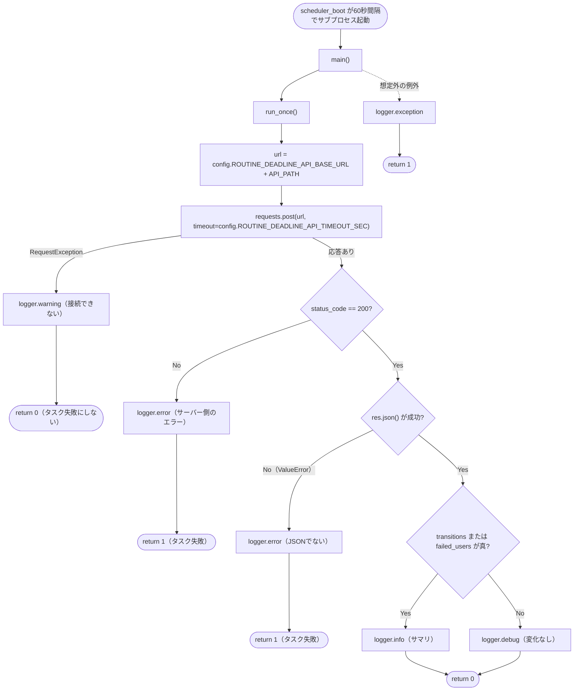
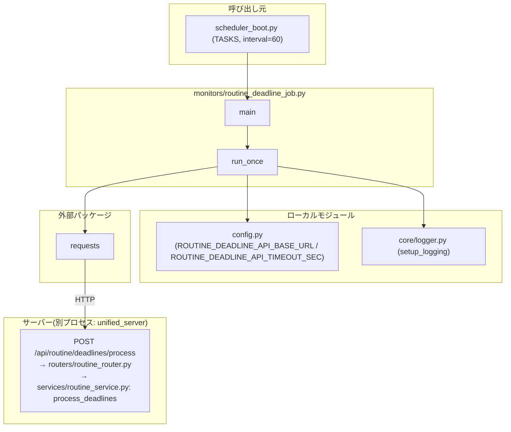

## 1. 解析メタ情報

| 項目 | 内容 |
| --- | --- |
| 対象ファイル | `monitors/routine_deadline_job.py` |
| 言語 | Python |
| 解析対象 | 提供されたコードのみ |
| 推測・補完 | 一切なし |
| 解析基準 | Issue #738 (AUDIT-008) で新規追加されたファイル |

## 関連ドキュメント

- [scheduler_boot.md](./scheduler_boot.md) — 本スクリプトを`TASKS`に60秒間隔で登録し、サブプロセスとして起動する呼び出し元
- [routine_router.md](./routine_router.md) — 本スクリプトがHTTPで叩く`POST /api/routine/deadlines/process`の定義元
- [routine_service.md](./routine_service.md) — そのエンドポイントが委譲する`routine_service.process_deadlines`の実体（締切超過の強制遷移・ボーナス付与）
- [config.md](./config.md) — `ROUTINE_DEADLINE_API_BASE_URL` / `ROUTINE_DEADLINE_API_TIMEOUT_SEC` の定義元
- [logger.md](./logger.md) — `core.logger.setup_logging`の実体
- [reset_game.md](./reset_game.md) — 「別プロセスから`quest_users`を書き換えず、サーバーのAPI経由でプロセス内ロックに参加する」という同じ方針を採った先行例（Issue #547）
- [start_all.md](./start_all.md) — 本スクリプトを`CLEANUP_TARGETS`の監視スクリプトパターンに含め、サービス再起動時に孤児を残さないようにしている

## 2. ファイルの概要

* デイリールーティン(すごろく形式の生活導線UI)の締切処理を定期的に起動する、スケジューラの定期タスク。
* 実処理は行わず、サーバーの`POST /api/routine/deadlines/process`を1回叩くだけの薄いHTTPクライアントである。
* モジュールdocstringによれば、以前はチェックポイント超過による強制遷移とボーナス付与を`GET /api/routine/today`が行っており、全端末が15秒間隔で叩くポーリングがそのまま書き込みトランザクション・報酬付与のトリガーになっていた。加えて「誰も画面を開いていなければ締切処理が走らない」という不整合もあった(Issue #738 / AUDIT-008)。
* docstringは「**DBを直接書き換えないこと**」を明記する。スケジューラは`unified_server`とは別プロセスで動き、`quest_users`(gold/exp/level)の排他は`services/quest/locks.py`の`threading.Lock`＝サーバープロセス内の直列化だけで成立しているため(CLAUDE.md「並行制御は単一プロセス前提」)、別プロセスから直接書くとロストアップデートがエラー無しで起きる。`reset_game.py`(#547)と同じくHTTP API を経由してサーバー側のロックに参加する。
* 根拠: [モジュールdocstring] (行番号: 2-20 / 抜粋: "本スクリプトは `scheduler_boot.TASKS` に60秒間隔で登録され、サーバーの", "**DBを直接書き換えないこと。**")

## 3. 外部依存関係

### インポート一覧

| 名称 | 種類 | 用途 | 根拠 |
| --- | --- | --- | --- |
| `os` | 標準ライブラリ | プロジェクトルートのパス解決 | 根拠: [インポート宣言] (行番号: 21 / 抜粋: "import os") |
| `sys` | 標準ライブラリ | `sys.path`へのプロジェクトルート追加、`sys.exit`による終了コードの返却 | 根拠: [インポート宣言] (行番号: 21 / 抜粋: "import sys")、[終了] (行番号: 84 / 抜粋: "sys.exit(main())") |
| `requests` | 外部パッケージ | 締切処理APIへのPOST | 根拠: [インポート宣言] (行番号: 21 / 抜粋: "import requests")、[呼び出し] (行番号: 48 / 抜粋: "res = requests.post(url, timeout=config.ROUTINE_DEADLINE_API_TIMEOUT_SEC)") |
| `config` | ローカルモジュール | `ROUTINE_DEADLINE_API_BASE_URL`・`ROUTINE_DEADLINE_API_TIMEOUT_SEC`の参照 | 根拠: [インポート宣言] (行番号: 28 / 抜粋: "import config")、[参照] (行番号: 46, 48) |
| `core.logger.setup_logging` | ローカルモジュール | ロガーの初期化 | 根拠: [インポート宣言] (行番号: 29 / 抜粋: "from core.logger import setup_logging") |

**DB・サービス層をimportしていない**ことが本ファイルの要件の一部である(`sqlite3`・`core.database`・`services.routine_service`・`init_unified_db`のいずれもimportしない)。`tests/test_routine_deadline_job.py`の`TestDoesNotWriteTheDatabaseDirectly`がASTでこれを検査する。
根拠: [インポート宣言] (行番号: 21-29、上表以外のimportは存在しない)

### ブラックボックスとなる外部要素

| 名称 | 理由 | 根拠 |
| --- | --- | --- |
| `POST /api/routine/deadlines/process` の処理内容 | 実際の締切判定・ボーナス付与はサーバー側で行われ、本ファイルからは応答JSONしか見えない。詳細は[routine_service.md](./routine_service.md)参照。 | [呼び出し] (行番号: 48 / 抜粋: "res = requests.post(url, timeout=config.ROUTINE_DEADLINE_API_TIMEOUT_SEC)") |
| `config.ROUTINE_DEADLINE_API_BASE_URL` / `ROUTINE_DEADLINE_API_TIMEOUT_SEC` の実際の値 | `.env`による上書きが可能で、本ファイルからは既定値も含め判断できない。詳細は[config.md](./config.md)参照。 | [参照] (行番号: 46, 48) |
| `setup_logging` のログ出力先・Discord通知の有無 | 本ファイルからは不明。詳細は[logger.md](./logger.md)参照。 | [呼び出し] (行番号: 31 / 抜粋: "logger = setup_logging(\"monitor.routine_deadline\")") |

## 4. 主要要素の定義（関数 / エンドポイント / コンポーネント）

### `API_PATH`（モジュールレベル定数）

* **役割**: 叩くエンドポイントのパス。ベースURLは`config.ROUTINE_DEADLINE_API_BASE_URL`と連結される。
* 根拠: [定数宣言] (行番号: 33 / 抜粋: "API_PATH = \"/api/routine/deadlines/process\"")

* **引数/リクエスト**: 該当なし
* 根拠: [定数宣言] (行番号: 33)

* **戻り値/レスポンス**: 該当なし
* 根拠: [定数宣言] (行番号: 33)

* **副作用**: なし
* 根拠: [定数宣言] (行番号: 33)

* **エラーハンドリング**: なし
* 根拠: [定数宣言] (行番号: 33)

### `run_once`

* **役割**: 締切処理APIを1回POSTし、終了コード(0=正常)を返す。応答が200かつJSONであれば、`transitions`または`failed_users`が真のときだけ`logger.info`でサマリを出し、それ以外は`logger.debug`に落とす(60秒ごとに走るためログを埋めない)。
* 根拠: [関数定義・docstring] (行番号: 36-70 / 抜粋: "def run_once() -> int:", "締切処理APIを1回呼ぶ。終了コード(0=正常)を返す。")、[ログの出し分け] (行番号: 65-69 / 抜粋: "# 何も起きなかった実行(大多数)はdebugに落とし、ログを埋めない。")

* **引数/リクエスト**: なし。POSTするURLは`f"{config.ROUTINE_DEADLINE_API_BASE_URL}{API_PATH}"`で、呼び出し時点の`config`の値を読む(リクエストボディは送らない)。
* 根拠: [関数定義] (行番号: 36 / 抜粋: "def run_once() -> int:")、[URL組み立て] (行番号: 46 / 抜粋: "url = f\"{config.ROUTINE_DEADLINE_API_BASE_URL}{API_PATH}\"")

* **戻り値/レスポンス**: `int`(0=正常終了、1=タスク失敗)
* 根拠: [return文] (行番号: 51, 57, 63, 70 / 抜粋: "return 0", "return 1")

* **副作用**: 外部(サーバー)へのHTTP POST、およびログ出力。DBへの直接アクセスはしない。
* 根拠: [HTTP呼び出し] (行番号: 48 / 抜粋: "res = requests.post(url, timeout=config.ROUTINE_DEADLINE_API_TIMEOUT_SEC)")

* **エラーハンドリング**:
  * `requests.exceptions.RequestException`(接続不可・タイムアウト等)は`logger.warning`に留め、**0を返す**。docstringによれば、60秒ごとに走るためデプロイ時の再起動・起動待ちのような一時的な接続断で「タスク失敗」のDiscord通知を毎分出しても意味がなく、サーバーの死活そのものは`monitors/server_watchdog.py`と`monitors/health_watch.py`が別途監視しているため。
  * ステータスコードが200以外の場合(＝サーバーは応答したがエラー)は`logger.error`し、1を返す。
  * 応答がJSONでない場合(`ValueError`)も`logger.error`し、1を返す。
* 根拠: [例外処理] (行番号: 49-51 / 抜粋: "except requests.exceptions.RequestException as e:")、[ステータス判定] (行番号: 53-57 / 抜粋: "if res.status_code != 200:")、[JSON判定] (行番号: 59-63 / 抜粋: "except ValueError:")

### `main`

* **役割**: `run_once()`を呼び、その終了コードを返す。想定外の例外を捕捉してスタックトレースを残し、1を返す。
* 根拠: [関数定義] (行番号: 73-80 / 抜粋: "def main() -> int:")

* **引数/リクエスト**: なし
* 根拠: [関数定義] (行番号: 73 / 抜粋: "def main() -> int:")

* **戻り値/レスポンス**: `int`(`run_once`の戻り値、または例外時は1)
* 根拠: [return文] (行番号: 75, 80 / 抜粋: "return run_once()", "return 1")

* **副作用**: `run_once`の副作用に加え、例外時の`logger.exception`によるログ出力。
* 根拠: [例外処理] (行番号: 76-80 / 抜粋: "logger.exception(\"ルーティン締切処理タスクで予期しないエラーが発生しました\")")

* **エラーハンドリング**: `except Exception`で全例外を捕捉する。コメントによれば「スケジューラ本体は`run_script`が返り値を見るだけなので巻き込まない」ため、例外を外へ伝播させず終了コードで知らせる。
* 根拠: [例外処理] (行番号: 76-80 / 抜粋: "# (スケジューラ本体は run_script が返り値を見るだけなので巻き込まない)。")

### エントリポイント (`if __name__ == "__main__":`)

* **役割**: `sys.exit(main())`で`main`の戻り値をプロセスの終了コードにする。`scheduler_boot.run_script`は子プロセスの`returncode`が0以外のときに「タスク失敗」としてERRORログ(=Discord通知経路)を出すため、この終了コードが失敗判定そのものになる。
* 根拠: [エントリポイント] (行番号: 83-84 / 抜粋: "if __name__ == \"__main__\":\n    sys.exit(main())")

* **引数/リクエスト**: なし
* 根拠: [エントリポイント] (行番号: 83-84)

* **戻り値/レスポンス**: プロセス終了コード
* 根拠: [エントリポイント] (行番号: 84 / 抜粋: "sys.exit(main())")

* **副作用**: プロセスの終了
* 根拠: [エントリポイント] (行番号: 84 / 抜粋: "sys.exit(main())")

* **エラーハンドリング**: なし(`main`側で完結)
* 根拠: [エントリポイント] (行番号: 83-84)

## 5. 処理フロー図

## 6. 依存関係図

## 7. 次のステップ（リバースエンジニアリングの提案）

| 優先度 | ファイル名(推測可) | 理由 | 根拠 |
| --- | --- | --- | --- |
| 高 | `services/routine_service.py` | 本スクリプトが起動する締切処理(`process_deadlines`)の実処理内容を把握するため。 | [HTTP呼び出し] (行番号: 48) |
| 高 | `scheduler_boot.py` | 実行間隔・失敗時の扱い(returncodeの判定、Discord通知経路)を把握するため。 | [モジュールdocstring] (行番号: 14-15) |
| 中 | `reset_game.py` | 「別プロセスからはAPI経由で書く」という同じ方針の先行例(Issue #547)を確認するため。 | [モジュールdocstring] (行番号: 17-20) |

## 8. 保守上の注意点

* **DB・サービス層をimportしないこと。** スケジューラは`unified_server`とは別プロセスのため、`quest_users`を直接書くとロストアップデートがエラー無しで起きる(CLAUDE.md「並行制御は単一プロセス前提」・Issue #755/#760)。この制約は`tests/test_routine_deadline_job.py`の`TestDoesNotWriteTheDatabaseDirectly`がASTで検査している。
* 接続エラーを終了コード0にしているのは意図的である(60秒間隔のため、サーバー再起動のたびに偽の失敗通知が出るのを避ける)。サーバーが長時間落ちていること自体は`server_watchdog.py`・`health_watch.py`が検知する。逆に、サーバーが応答したうえでのエラー(500等)は終了コード1にして`scheduler_boot.run_script`のERRORログ→Discord通知に乗せる(`core/logger.py`の10分間の重複排除により、毎分の通知洪水にはならない)。
* `scheduler_boot.TASKS`に登録するスクリプトは`start_all.sh`の`CLEANUP_TARGETS`の監視スクリプトパターンにも含める必要がある(`tests/test_start_all_sh.py`が両者の整合を検査する)。本スクリプトも追加済み。
* 実行間隔(60秒)は締切の粒度(`routine_data.py`の`checkpoint_time`は分単位)に合わせた値であり、短くすればUIへの反映が速くなる代わりにプロセス起動回数が増える。値は`scheduler_boot.TASKS`の1箇所にあり、`tests/test_routine_deadline_job.py`の`TestSchedulerRegistration`が60であることを固定している。

## 9. 不明事項一覧

| 項目 | 理由 | 必要なファイル |
| --- | --- | --- |
| 応答JSONの全キーと意味 | 本ファイルは`transitions`・`failed_users`の2キーしか参照しておらず、他のキーの有無・意味は不明。 | `services/routine_service.py` |
| `logger.error`がDiscordへ通知されるか | `setup_logging`が返すロガーのハンドラ構成は本ファイルからは不明。 | `core/logger.py` |

## 10. 自己検証結果

* [x] 完了: 推測・外部ファイルの仕様を一切含んでいない
* [x] 完了: 全関数・全クラス・全コンポーネントを列挙した
* [x] 完了: 全てのインポート要素を列挙した
* [x] 完了: すべての仕様説明に「根拠（行番号・抜粋）」を明記した
* [x] 完了: 根拠漏れが0件である
* [x] 完了: Mermaid構文にエラーの原因となる記号（エスケープ漏れ）がない
* [x] 完了: 不明事項を漏れなく列挙した
