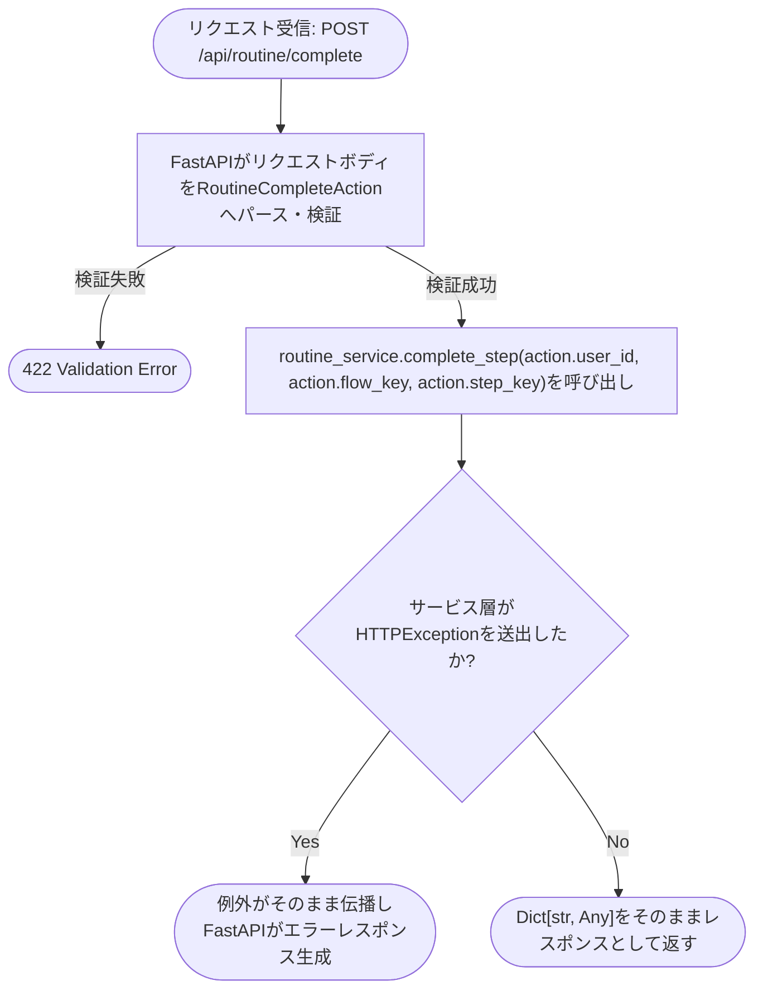
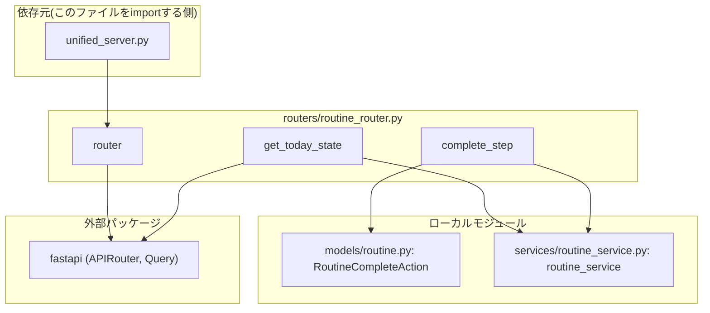

## 1. 解析メタ情報

| 項目 | 内容 |
| --- | --- |
| 対象ファイル | `routers/routine_router.py` |
| 言語 | Python / FastAPI |
| 解析対象 | 提供されたコードのみ |
| 推測・補完 | 一切なし |
| 解析基準コミット | `83b42db` |

## 関連ドキュメント

* [routine.md](./routine.md) - 本ファイルが`from models.routine import RoutineCompleteAction`でimportするリクエストモデルの定義元
* [routine_service.md](./routine_service.md) - 本ファイルが`from services.routine_service import routine_service`でimportするサービス層シングルトンの実体。両エンドポイントの実処理はすべてここに委譲される
* [unified_server.md](./unified_server.md) - 本ルーターを`/api/routine`プレフィックス・タグ`routine`で`include_router`する呼び出し元

## 2. ファイルの概要

デイリールーティン(すごろく形式の生活導線UI)に関するFastAPIルーター(コントローラー)ファイル。CLAUDE.mdのレイヤリング規約通り、リクエストのパース・検証のみを行い、ロジックはすべて`services.routine_service.routine_service`(モジュールレベルシングルトン)に委譲する薄いルーターである。今日時点の進捗状態を取得する`GET /today`と、1ステップを完了させる`POST /complete`の2エンドポイントのみを提供する。
根拠: [ファイル冒頭コメント] (行番号: 1 / 抜粋: "# MY_HOME_SYSTEM/routers/routine_router.py")、[ルーター定義] (行番号: 9 / 抜粋: "router = APIRouter()")、[エンドポイント定義] (行番号: 12-19)

## 3. 外部依存関係

### インポート一覧

| 名称 | 種類 | 用途 | 根拠 |
| --- | --- | --- | --- |
| `typing.Any` | 標準 | 戻り値型ヒント`Dict[str, Any]`の要素型 | 根拠: [インポート宣言] (行番号: 2 / 抜粋: "from typing import Any, Dict") |
| `typing.Dict` | 標準 | 両エンドポイントの戻り値型ヒント`Dict[str, Any]` | 根拠: [インポート宣言] (行番号: 2 / 抜粋: "from typing import Any, Dict") |
| `fastapi.APIRouter` | 外部パッケージ | ルーターインスタンス`router`の作成 | 根拠: [インポート宣言] (行番号: 4 / 抜粋: "from fastapi import APIRouter, Query") |
| `fastapi.Query` | 外部パッケージ | `get_today_state`のクエリパラメータ`user_id`に対する文字数制約(`min_length`/`max_length`)の付与 | 根拠: [インポート宣言] (行番号: 4 / 抜粋: "from fastapi import APIRouter, Query") |
| `models.routine.RoutineCompleteAction` | ローカルモジュール | `complete_step`エンドポイントのリクエストボディ型 | 根拠: [インポート宣言] (行番号: 6 / 抜粋: "from models.routine import RoutineCompleteAction") |
| `services.routine_service.routine_service` | ローカルモジュール | 両エンドポイントが実処理を委譲するサービス層シングルトン | 根拠: [インポート宣言] (行番号: 7 / 抜粋: "from services.routine_service import routine_service") |

### ブラックボックスとなる外部要素

| 名称 | 理由 | 根拠 |
| --- | --- | --- |
| `routine_service.get_today_state` / `routine_service.complete_step` の内部実装 | 進捗の永続化・チェックポイント判定・ボーナス付与等の実処理ロジックは本ファイルからは不明。詳細は[routine_service.md](./routine_service.md)参照。 | [関数呼び出し] (行番号: 14, 19 / 抜粋: "return routine_service.get_today_state(user_id)", "return routine_service.complete_step(action.user_id, action.flow_key, action.step_key)") |
| `models.routine.RoutineCompleteAction`のバリデーション詳細 | フィールドの型・制約の具体的な定義内容は本ファイルからは不明。詳細は[routine.md](./routine.md)参照。 | [インポート宣言] (行番号: 6 / 抜粋: "from models.routine import RoutineCompleteAction") |

## 4. 主要要素の定義（関数 / エンドポイント / コンポーネント）

### `router`

* **役割**: 本ファイルが定義するエンドポイント群をまとめる`APIRouter`インスタンス。`unified_server.py`から`app.include_router(routine_router.router, prefix="/api/routine", tags=["routine"])`としてマウントされる([unified_server.md](./unified_server.md)参照)。
* 根拠: [変数宣言] (行番号: 9 / 抜粋: "router = APIRouter()")

* **引数/リクエスト**: 該当なし
* 根拠: [変数宣言] (行番号: 9)

* **戻り値/レスポンス**: 該当なし
* 根拠: [変数宣言] (行番号: 9)

* **副作用**: なし(インスタンス生成のみ)
* 根拠: [変数宣言] (行番号: 9)

* **エラーハンドリング**: なし
* 根拠: [変数宣言] (行番号: 9)

### `get_today_state` (`GET /today`)

* **役割**: 指定ユーザーの本日時点のルーティン進捗状態(am/pmフローそれぞれの開始有無・現在のステップ・チェックポイント通過状況等)を取得するエンドポイント。実処理は`routine_service.get_today_state(user_id)`に委譲する。
* 根拠: [ルーティング定義・関数定義] (行番号: 12-14 / 抜粋: "@router.get(\"/today\")\ndef get_today_state(user_id: str = Query(min_length=1, max_length=64)) -> Dict[str, Any]:\n    return routine_service.get_today_state(user_id)")

* **引数/リクエスト**: クエリパラメータ`user_id: str`(FastAPIの`Query(min_length=1, max_length=64)`により1〜64文字必須)
* 根拠: [関数定義] (行番号: 13 / 抜粋: "def get_today_state(user_id: str = Query(min_length=1, max_length=64)) -> Dict[str, Any]:")

* **戻り値/レスポンス**: `Dict[str, Any]`(`routine_service.get_today_state(user_id)`の戻り値をそのまま返す。実際の形状は[routine_service.md](./routine_service.md)の`get_today_state`/`_serialize_flow`を参照)
* 根拠: [関数定義・戻り値] (行番号: 13-14 / 抜粋: "-> Dict[str, Any]:\n    return routine_service.get_today_state(user_id)")

* **副作用**: `routine_service.get_today_state`の呼び出しに伴う副作用(DBアクセス等)を間接的に引き起こす。本ファイル自体には副作用となるコードは存在しない。
* 根拠: [関数呼び出し] (行番号: 14 / 抜粋: "return routine_service.get_today_state(user_id)")

* **エラーハンドリング**: 本ファイル内には`try`/`except`等の明示的なエラーハンドリングは存在しない。`user_id`がクエリパラメータの制約(1〜64文字)を満たさない場合はFastAPI側のバリデーションにより自動的にエラーレスポンスが生成される。`routine_service.get_today_state`が送出する例外(`HTTPException`等)はそのまま伝播する。
* 根拠: [関数定義] (行番号: 12-14、`try`/`except`は存在しない)

### `complete_step` (`POST /complete`)

* **役割**: 指定ユーザーの指定フロー(`am`/`pm`)における指定ステップを完了させるエンドポイント。実処理は`routine_service.complete_step(action.user_id, action.flow_key, action.step_key)`に委譲する。
* 根拠: [ルーティング定義・関数定義] (行番号: 17-19 / 抜粋: "@router.post(\"/complete\")\ndef complete_step(action: RoutineCompleteAction) -> Dict[str, Any]:\n    return routine_service.complete_step(action.user_id, action.flow_key, action.step_key)")

* **引数/リクエスト**: リクエストボディ`action: RoutineCompleteAction`(`user_id`, `flow_key`, `step_key`の3フィールド。詳細は[routine.md](./routine.md)参照)
* 根拠: [関数定義] (行番号: 18 / 抜粋: "def complete_step(action: RoutineCompleteAction) -> Dict[str, Any]:")

* **戻り値/レスポンス**: `Dict[str, Any]`(`routine_service.complete_step(...)`の戻り値をそのまま返す。実際の形状は[routine_service.md](./routine_service.md)の`_serialize_flow`を参照)
* 根拠: [関数定義・戻り値] (行番号: 18-19 / 抜粋: "-> Dict[str, Any]:\n    return routine_service.complete_step(action.user_id, action.flow_key, action.step_key)")

* **副作用**: `routine_service.complete_step`の呼び出しに伴う副作用(DB書き込み・ゲームデータ更新等)を間接的に引き起こす。本ファイル自体には副作用となるコードは存在しない。
* 根拠: [関数呼び出し] (行番号: 19 / 抜粋: "return routine_service.complete_step(action.user_id, action.flow_key, action.step_key)")

* **エラーハンドリング**: 本ファイル内には`try`/`except`等の明示的なエラーハンドリングは存在しない。リクエストボディが`RoutineCompleteAction`のバリデーションを満たさない場合はFastAPI/Pydantic側で自動的にエラーレスポンスが生成される。`routine_service.complete_step`が送出する例外(`HTTPException`等)はそのまま伝播する。
* 根拠: [関数定義] (行番号: 17-19、`try`/`except`は存在しない)

## 5. 処理フロー図

以下は `POST /complete` (`complete_step`) のリクエスト処理フローです。`GET /today`も同様に単純な委譲構造のため、ここでは分岐のある`complete_step`側を図示します。

## 6. 依存関係図

## 7. 次のステップ（リバースエンジニアリングの提案）

| 優先度 | ファイル名(推測可) | 理由 | 根拠 |
| --- | --- | --- | --- |
| 高 | `services/routine_service.py` | 両エンドポイントが委譲する実処理(進捗管理・チェックポイント判定・ボーナス付与)の詳細を把握するため。 | [関数呼び出し] (行番号: 14, 19) |
| 中 | `models/routine.py` | `RoutineCompleteAction`のフィールド制約の詳細を把握するため。 | [インポート宣言] (行番号: 6) |
| 中 | `routine_data.py` | `routine_service`が参照するフロー定義(`ROUTINE_FLOWS`)の内容を把握し、`flow_key`/`step_key`に実際どのような値が渡りうるかを確認するため。 | [routine_service.md](./routine_service.md)側のインポート宣言 |

## 8. 保守上の注意点

* `GET /today`は`user_id`をクエリパラメータで、`POST /complete`は`user_id`をリクエストボディ(`RoutineCompleteAction.user_id`)で受け取っており、認可の仕組みは無くクライアント入力の`user_id`をそのまま信頼している。これはCLAUDE.mdに記載されたFamily Quest API全体の既知の設計判断(個人用IoTシステム・LAN内信頼境界を前提としたスコープ外合意、Issue #614)と同じパターンであり、本ルーター固有の欠陥ではない。
* 本ファイルは例外を一切捕捉せず、`routine_service`側が送出する`HTTPException`をそのまま透過させる薄い構造になっている。エラーメッセージの文面(日本語)は`routine_service.py`側で決定される。

## 9. 不明事項一覧

| 項目 | 理由 | 必要なファイル |
| --- | --- | --- |
| `routine_service.get_today_state`/`complete_step`の戻り値の正確なJSON形状 | 本ファイルの型ヒントは`Dict[str, Any]`のみであり、実際にどのようなキー・値構造を返すかは本ファイルからは不明。 | `services/routine_service.py` |
| `RoutineCompleteAction`の各フィールドの制約詳細 | インポートのみで、フィールド定義自体は本ファイルには存在しない。 | `models/routine.py` |

## 10. 自己検証結果

* [x] 完了: 推測・外部ファイルの仕様を一切含んでいない
* [x] 完了: 全関数・全クラス・全コンポーネントを列挙した
* [x] 完了: 全てのインポート要素を列挙した
* [x] 完了: すべての仕様説明に「根拠（行番号・抜粋）」を明記した
* [x] 完了: 根拠漏れが0件である
* [x] 完了: Mermaid構文にエラーの原因となる記号（エスケープ漏れ）がない
* [x] 完了: 不明事項を漏れなく列挙した
