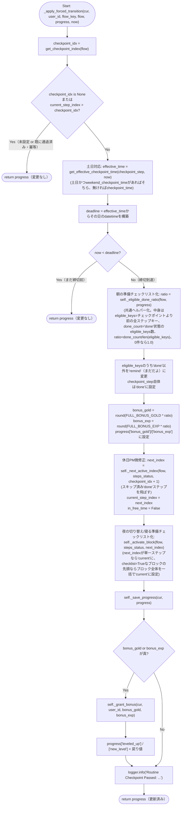
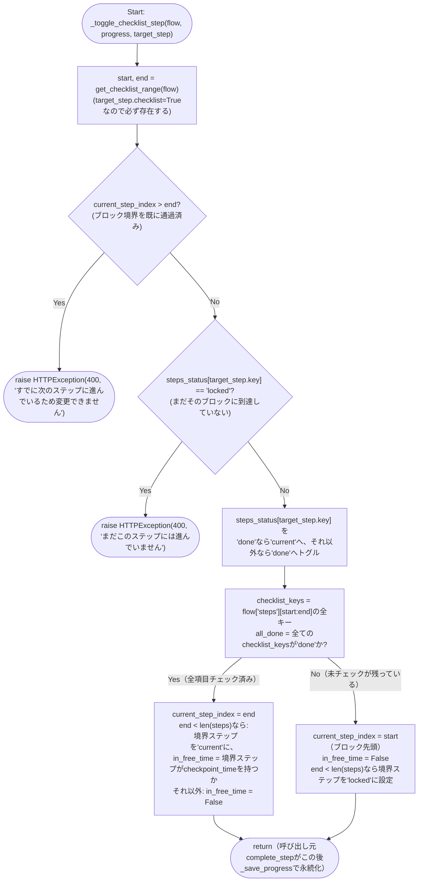
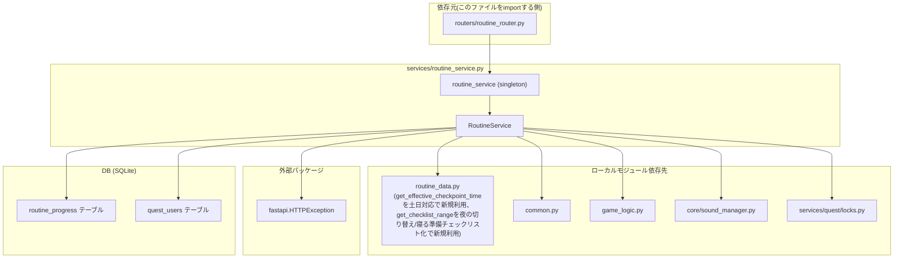

## 1. 解析メタ情報

| 項目 | 内容 |
| --- | --- |
| 対象ファイル | `services/routine_service.py` |
| 言語 | Python |
| 解析対象 | 提供されたコードのみ |
| 推測・補完 | 一切なし |
| 解析基準コミット | `3ac46ca` (+同一ブランチ内で土日のチェックポイント時刻上書き対応・休日PMのステップスキップ/宿題引き継ぎ対応・朝の準備の順不同チェックリスト化・夜の切り替え時刻変更/寝る準備チェックリスト化/明日の準備追加を追加修正) |

## 関連ドキュメント

* [routine_data.md](./routine_data.md) - 本ファイルが`from routine_data import (FULL_BONUS_EXP, FULL_BONUS_GOLD, ROUTINE_FLOWS, WEEKEND_DAYS, RoutineFlow, get_checklist_range, get_checkpoint_index, get_effective_checkpoint_time)`でimportするフロー定義・定数の実体（`get_effective_checkpoint_time`は土日対応で新規追加、`WEEKEND_DAYS`は休日PM微修正で新規importに追加、`get_checklist_range`は夜の切り替え/寝る準備チェックリスト化で新規importに追加。`RoutineStep`の`checklist`フィールド自体は本ファイルではimportされる関数・定数ではなく`flow['steps']`の各要素の値として参照される）
* [routine_router.md](./routine_router.md) - 本ファイルの`routine_service`シングルトンを`from services.routine_service import routine_service`でimportして呼び出す唯一の呼び出し元
* [routine.md](./routine.md) - `routine_router.py`経由で本ファイルの`complete_step`へ値が渡される`RoutineCompleteAction`の定義元
* [common.md](./common.md) - 本ファイルが`import common`でimportし`common.get_now_iso()`/`common.get_db_cursor(commit=True)`を使用するFacadeモジュール
* [game_logic.md](./game_logic.md) - 本ファイルが`import game_logic`でimportし`game_logic.GameLogic.calc_level_progress`を使用するレベル計算ロジック
* [sound_manager.md](./sound_manager.md) - 本ファイルが`from core import sound_manager`でimportし`sound_manager.play("level_up")`を呼び出す音声再生モジュール
* [quest_locks.md](./quest_locks.md) - 本ファイルが`from services.quest.locks import JST, _get_user_balance_lock, logger`でimportする、`quest_service`と共用のJST定数・ユーザー残高ロック・ロガー

## 2. ファイルの概要

デイリールーティン(すごろく形式の生活導線UI)のサービス層。ファイル冒頭のdocstringが述べる通り、`routers/routine_router.py`はパース・検証のみを行いロジックはここに委譲するというCLAUDE.mdのレイヤリング規約に従う。`quest_users`テーブル(gold/exp/level)への書き込みを伴うため、`services/quest/locks.py`のユーザー残高ロックを`quest_service`と共用し、クエスト完了/承認と同一ユーザーへの並行更新によるlost updateを防ぐ設計である。ユーザーごと・フロー(`am`/`pm`)ごと・日付ごとの進捗を`routine_progress`テーブルに保持し、チェックポイント時刻を過ぎた際に未完了ステップを「まだだよ(remind)」に変えつつ達成率に応じたボーナス(gold/exp)を按分付与する「強制切替」ロジック(`_apply_forced_transition`)が本ファイルの中核である。**（土日対応で変更）** チェックポイントの締切時刻は`routine_data.get_effective_checkpoint_time(step, now)`で解決するようになり、`now`の曜日が土日であれば`weekend_checkpoint_time`（設定されていれば）を、それ以外は従来通り`checkpoint_time`を使う。この解決は`_apply_forced_transition`(締切判定)と`_serialize_flow`(レスポンス表示用の`checkpoint_time`算出)の両方で行われる。**（休日PM微修正で追加）** さらに、`routine_data.RoutineStep`に新設された`weekend_skip`(土日はステップ自体を不要とする)・`weekend_carryover`(前日以前の完了実績を引き継いで不要とする)の2フラグを解釈する処理が本ファイルに追加された。土日のみ、フロー生成時(`_get_or_create_progress`)に`_resolve_skip_keys`でスキップ対象のステップkey集合を求め、`_empty_statuses`がそれらを最初から`'done'`として扱う初期状態を組み立てる。`weekend_carryover`対象ステップについては`_carryover_lookback_dates`(土曜は前日、日曜は前日・前々日)で遡るべき日付を求め、`_was_done_on_any_date`がその日付の`routine_progress`行の`steps_status`を実際に参照して判定する。ステップ完了(`complete_step`)や強制切替(`_apply_forced_transition`)で次のステップへ進める際にスキップ済みステップを飛ばす処理は共通ヘルパー`_next_active_index`に切り出されている。**（朝の準備チェックリスト化で追加、夜の切り替え/寝る準備チェックリスト化で一般化）** `routine_data.RoutineStep`に新設された`checklist`フィールド(順不同でチェックできるグループの一員かどうか)を解釈する処理も本ファイルに追加された。以前は`checklist=True`のブロックが「フロー先頭」に固定されている前提で書かれていたが(`am`にしかチェックリストが無く、その直後がチェックポイントだったため)、`pm`フローのチェックポイント通過後(寝る準備4項目)にもチェックリストを置く要件に伴い、`routine_data.get_checklist_range(flow)`が返す`(開始index, 終了index+1)`を軸にした汎用的な実装に一般化された。新設の`_activate_block(flow, statuses, index)`は「`index`のステップに進行が到達した」ことを表現する共通処理で、それが単独ステップなら`'current'`にするだけだが、`checklist=True`なグループの一員なら`get_checklist_range`が返す範囲全体を一括で`'current'`にする。`_empty_statuses`(フロー生成時の初期化)・`_apply_forced_transition`(チェックポイント通過後の次ステップ活性化)・`complete_step`の逐次ステップ分岐(通常ステップ完了後の次ステップ活性化)の3箇所全てが、この`_activate_block`を経由するようになったことで、チェックリストが「フロー先頭」「チェックポイント通過後」のどちらに置かれていても同じコードで正しく動作する。`complete_step`は対象ステップが`checklist=True`なら現在地(`current_step_index`)と無関係に`_toggle_checklist_step`へ処理を委譲し、`'current'`⇔`'done'`のトグルとチェックリスト全項目達成時の「ブロック直後のステップ」への遷移(またはその巻き戻し)を行う。**（夜の切り替え/寝る準備チェックリスト化で変更）** この「ブロック直後のステップ」は`am`では出発チェックポイント(`free`)だが、`pm`では単なる`sleep`(就寝、チェックポイントではない)であるため、`_toggle_checklist_step`の実装も「チェックポイントの前後」という特化した表現から「チェックリストブロックの境界(boundary)の前後」という一般化された表現に書き直され、境界に到達していない(まだ`'locked'`)ブロックへのトグルを拒否するガードも新設された。達成率に応じたボーナス按分の比率計算(`_eligible_done_ratio`)は`_apply_forced_transition`と、チェックポイント通過前でも常にライブ表示できる新設の`_compute_bonus_preview`(`_serialize_flow`の`preview_bonus_gold`が使う)の両方から共有される共通ヘルパーとして切り出された(この計算式自体は`checklist`がチェックポイントの前にあるか後にあるかを意識しないため、`pm`のチェックポイント通過後チェックリストが追加された今回の変更でも計算式自体に変更は無い)。公開メソッドは`get_today_state`(状態取得)と`complete_step`(ステップ完了/チェックリストのトグル)の2つで、モジュールレベルシングルトン`routine_service`としてインスタンス化され`routine_router.py`から直接importされる(CLAUDE.mdのDI非導入方針・モジュールレベルシングルトンパターンに従う)。
根拠: [モジュールdocstring] (行番号: 1-6 / 抜粋: "routers/routine_router.py はパース・検証のみを行い、ロジックはここに委譲する\n(CLAUDE.mdのレイヤリング規約)。quest_users(gold/exp/level)への書き込みを伴うため、\nservices/quest/locks.py の user balance lock を quest_service と共用し、\nクエスト完了/承認と同一ユーザーへの並行更新によるlost updateを防ぐ。")、[モジュールレベルシングルトン] (行番号: 437 / 抜粋: "routine_service = RoutineService()")、[休日PM微修正の中核メソッド群] (行番号: 62-77, 79-96, 98-108 / 抜粋: "def _resolve_skip_keys(self, cur, user_id: str, flow_key: str, flow: RoutineFlow, now: datetime.datetime) -> Set[str]:", "def _empty_statuses(self, flow: RoutineFlow, skip_keys: Set[str]) -> Tuple[Dict[str, str], int]:", "def _next_active_index(self, flow: RoutineFlow, statuses: Dict[str, str], start_index: int) -> int:")、[朝の準備チェックリスト化の中核メソッド群] (行番号: 185-198, 200-209, 276-314 / 抜粋: "def _eligible_done_ratio(self, flow: RoutineFlow, progress: Dict[str, Any]) -> float:", "def _compute_bonus_preview(self, flow: RoutineFlow, progress: Dict[str, Any]) -> Tuple[int, int]:", "def _toggle_checklist_step(self, flow: RoutineFlow, progress: Dict[str, Any], target_step: Dict[str, Any]) -> None:")、[夜の切り替え/寝る準備チェックリスト化の中核メソッド] (行番号: 110-127 / 抜粋: "def _activate_block(self, flow: RoutineFlow, statuses: Dict[str, str], index: int) -> None:")

## 3. 外部依存関係

### インポート一覧

| 名称 | 種類 | 用途 | 根拠 |
| --- | --- | --- | --- |
| `datetime` | 標準 | 現在時刻の取得・時刻比較(`now.replace(...)`等) | 根拠: [インポート宣言] (行番号: 8 / 抜粋: "import datetime") |
| `json` | 標準 | `steps_status`カラム(JSON TEXT)のシリアライズ/デシリアライズ | 根拠: [インポート宣言] (行番号: 9 / 抜粋: "import json") |
| `typing.Any` | 標準 | 型ヒント(`Dict[str, Any]`等) | 根拠: [インポート宣言] (行番号: 10 / 抜粋: "from typing import Any, Dict, List, Optional, Set, Tuple") |
| `typing.Dict` | 標準 | 型ヒント(戻り値`Dict[str, Any]`等) | 根拠: [インポート宣言] (行番号: 10 / 抜粋: "from typing import Any, Dict, List, Optional, Set, Tuple") |
| `typing.List`（休日PM微修正で新規追加） | 標準 | 型ヒント(`_carryover_lookback_dates`/`_was_done_on_any_date`の`List[str]`) | 根拠: [インポート宣言] (行番号: 10 / 抜粋: "from typing import Any, Dict, List, Optional, Set, Tuple") |
| `typing.Optional` | 標準 | 型ヒント(`Optional[datetime.datetime]`等) | 根拠: [インポート宣言] (行番号: 10 / 抜粋: "from typing import Any, Dict, List, Optional, Set, Tuple") |
| `typing.Set`（休日PM微修正で新規追加） | 標準 | 型ヒント(`_resolve_skip_keys`の戻り値`Set[str]`) | 根拠: [インポート宣言] (行番号: 10 / 抜粋: "from typing import Any, Dict, List, Optional, Set, Tuple") |
| `typing.Tuple`（休日PM微修正で新規追加） | 標準 | 型ヒント(`_empty_statuses`の戻り値`Tuple[Dict[str, str], int]`) | 根拠: [インポート宣言] (行番号: 10 / 抜粋: "from typing import Any, Dict, List, Optional, Set, Tuple") |
| `fastapi.HTTPException` | 外部パッケージ | ユーザー未存在・不正なフロー/ステップ指定時のHTTPエラー送出 | 根拠: [インポート宣言] (行番号: 12 / 抜粋: "from fastapi import HTTPException") |
| `common` | ローカルモジュール | `common.get_now_iso()`(タイムスタンプ生成)・`common.get_db_cursor(commit=True)`(DBカーソル取得) | 根拠: [インポート宣言] (行番号: 14 / 抜粋: "import common") |
| `game_logic` | ローカルモジュール | `game_logic.GameLogic.calc_level_progress`によるレベル/経験値計算 | 根拠: [インポート宣言] (行番号: 15 / 抜粋: "import game_logic") |
| `core.sound_manager` | ローカルモジュール | レベルアップ時の効果音再生(`sound_manager.play("level_up")`) | 根拠: [インポート宣言] (行番号: 16 / 抜粋: "from core import sound_manager") |
| `routine_data` (`FULL_BONUS_EXP`, `FULL_BONUS_GOLD`, `ROUTINE_FLOWS`, `WEEKEND_DAYS`, `RoutineFlow`, `get_checklist_range`, `get_checkpoint_index`, `get_effective_checkpoint_time`) | ローカルモジュール | フロー定義本体・完走ボーナス満額定数・チェックポイントインデックス取得関数・**（土日対応で新規追加）**曜日に応じた実効チェックポイント時刻の解決関数・**（休日PM微修正で新規追加）**土曜/日曜判定用の`WEEKEND_DAYS`(`_resolve_skip_keys`が使用)・**（夜の切り替え/寝る準備チェックリスト化で新規追加）**`checklist=True`な連続ブロックの範囲を取得する`get_checklist_range`(`_activate_block`/`_toggle_checklist_step`が使用) | 根拠: [インポート宣言] (行番号: 17-20 / 抜粋: "from routine_data import (\n    FULL_BONUS_EXP, FULL_BONUS_GOLD, ROUTINE_FLOWS, WEEKEND_DAYS, RoutineFlow,\n    get_checklist_range, get_checkpoint_index, get_effective_checkpoint_time,\n)") |
| `services.quest.locks` (`JST`, `_get_user_balance_lock`, `logger`) | ローカルモジュール | JST(日本標準時)定数、ユーザー単位のプロセス内排他ロック取得関数、`quest_service`と共有するロガー | 根拠: [インポート宣言] (行番号: 21 / 抜粋: "from services.quest.locks import JST, _get_user_balance_lock, logger") |

### ブラックボックスとなる外部要素

| 名称 | 理由 | 根拠 |
| --- | --- | --- |
| `common.get_db_cursor(commit=True)`の内部実装 | SQLiteのロック再試行・WALモード設定・例外時ロールバック等の具体的な実装は`core/database.py`側にあり本ファイルからは不明。 | [with文] (行番号: 362, 388 / 抜粋: "with common.get_db_cursor(commit=True) as cur:") |
| `common.get_now_iso()`の出力形式 | 生成されるISO文字列の具体的なフォーマット(タイムゾーン表記等)が本ファイルからは不明。 | [関数呼び出し] (行番号: 156, 165, 182, 220 / 抜粋: "now_iso = common.get_now_iso()") |
| `game_logic.GameLogic.calc_level_progress`の内部計算式 | レベルアップに必要な経験値テーブル等の計算ロジックの詳細は不明。詳細は[game_logic.md](./game_logic.md)参照。 | [関数呼び出し] (行番号: 215-217 / 抜粋: "game_logic.GameLogic.calc_level_progress(\n            user['level'], user['exp'], exp\n        )") |
| `sound_manager.play`の実際の音声再生手段 | 音声ファイルの実体・再生失敗時の挙動が不明。詳細は[sound_manager.md](./sound_manager.md)参照。 | [関数呼び出し] (行番号: 223 / 抜粋: "sound_manager.play(\"level_up\")") |
| `_get_user_balance_lock`の内部実装(`RefCountedLockRegistry`) | 参照カウント付きロックレジストリの具体的な排他制御実装は`core/utils.py`側にあり不明。詳細は[quest_locks.md](./quest_locks.md)参照。 | [with文] (行番号: 361, 387 / 抜粋: "with _get_user_balance_lock(user_id):") |
| `routine_progress`テーブルのスキーマ全体 | 本ファイルはSQL文中でカラム名を参照するのみで、テーブル定義自体(制約・インデックス・デフォルト値)は`migrations/0010_add_routine_progress.sql`にあり、マイグレーションは仕様書ドリフト規約の対象外のため直接引用にとどめる(§8参照)。 | [SQL文] (行番号: 141-143, 156-165 / 抜粋: "SELECT * FROM routine_progress WHERE user_id=? AND flow_key=? AND progress_date=?") |
| `routine_progress`テーブルの日付をまたいだ検索クエリ | **（休日PM微修正で新規追加）** `_was_done_on_any_date`が発行する`IN (...)`クエリ自体は本ファイルに実装されているが、これが前提とする`progress_date`カラムのフォーマット('YYYY-MM-DD'文字列比較で正しく日付一致する前提)や、`user_id`/`flow_key`/`progress_date`の組がユニークであることの保証は`migrations/0010_add_routine_progress.sql`側のテーブル定義に依存し本ファイルからは不明。 | [SQL文] (行番号: 55-58 / 抜粋: "f\"SELECT steps_status FROM routine_progress \"  # nosec B608\n            f\"WHERE user_id=? AND flow_key=? AND progress_date IN ({placeholders})\",") |

## 4. 主要要素の定義（関数 / エンドポイント / コンポーネント）

### `RoutineService` (クラス)

* **役割**: デイリールーティンの状態取得・ステップ完了処理をまとめるサービスクラス。全メソッドがインスタンスメソッドとして定義され、モジュール末尾で単一のシングルトン`routine_service`としてインスタンス化される。
* 根拠: [クラス定義] (行番号: 24 / 抜粋: "class RoutineService:")、[シングルトン化] (行番号: 437 / 抜粋: "routine_service = RoutineService()")

* **引数/リクエスト**: 該当なし(クラス定義自体はコンストラクタを持たず、`object`のデフォルト`__init__`を使用)
* 根拠: [クラス定義] (行番号: 24-437、`__init__`の明示的定義は存在しない)

* **戻り値/レスポンス**: 該当なし
* 根拠: [クラス定義] (行番号: 24)

* **副作用**: なし(クラス定義自体には副作用なし。各メソッドの副作用は個別に後述)
* 根拠: [クラス定義] (行番号: 24)

* **エラーハンドリング**: なし(クラス定義自体にはエラーハンドリングなし)
* 根拠: [クラス定義] (行番号: 24)

### `_today_str`

* **役割**: 渡された`datetime`を`'%Y-%m-%d'`形式の文字列に変換する。
* 根拠: [メソッド定義] (行番号: 25-26 / 抜粋: "def _today_str(self, now: datetime.datetime) -> str:\n        return now.strftime('%Y-%m-%d')")

* **引数/リクエスト**: `now: datetime.datetime`
* 根拠: [メソッド定義] (行番号: 25)

* **戻り値/レスポンス**: `str`(`'YYYY-MM-DD'`形式)
* 根拠: [戻り値] (行番号: 26 / 抜粋: "return now.strftime('%Y-%m-%d')")

* **副作用**: なし
* 根拠: [メソッド定義] (行番号: 25-26)

* **エラーハンドリング**: なし
* 根拠: [メソッド定義] (行番号: 25-26)

### `_is_flow_started_today`

* **役割**: 指定フローが「本日」開始済みかどうかを判定する。渡された`now`の曜日(`now.weekday()`)がフローの`day_of_week`に含まれず対象外の場合は`False`。**（土日対応で変更）** `day_of_week`は`am`/`pm`両フローとも`ALL_DAYS`(月〜日)になったため、本メソッドの曜日チェック自体は実質的に常に通過するが、実装は変更されておらず引き続き`flow['day_of_week']`を参照する。対象曜日であれば、フローの`start_trigger_time`('HH:MM')と同じ時:分:0秒0マイクロ秒に設定した`now`と比較し、`now`がその時刻以降であれば`True`を返す。
* 根拠: [メソッド定義] (行番号: 28-33 / 抜粋: "def _is_flow_started_today(self, flow: RoutineFlow, now: datetime.datetime) -> bool:\n        if now.weekday() not in flow['day_of_week']:\n            return False\n        hour, minute = map(int, flow['start_trigger_time'].split(':'))\n        trigger = now.replace(hour=hour, minute=minute, second=0, microsecond=0)\n        return now >= trigger")

* **引数/リクエスト**: `flow: RoutineFlow`, `now: datetime.datetime`
* 根拠: [メソッド定義] (行番号: 28)

* **戻り値/レスポンス**: `bool`
* 根拠: [戻り値] (行番号: 30, 33 / 抜粋: "return False", "return now >= trigger")

* **副作用**: なし
* 根拠: [メソッド定義] (行番号: 28-33)

* **エラーハンドリング**: なし(`flow['start_trigger_time']`が`'HH:MM'`形式でない場合の`ValueError`等は捕捉されない)
* 根拠: [メソッド定義] (行番号: 28-33、`try`/`except`は存在しない)

### `_carryover_lookback_dates`（休日PM微修正で新規追加）

* **役割**: `weekend_carryover`ステップについて、完了済みかどうかを確認すべき過去日付のリストを、`now`から計算して返す。土曜(`now.weekday() == 5`)なら前日(金曜)のみ、日曜(`now.weekday() == 6`)なら前日(土曜)・前々日(金曜)の両方、それ以外の曜日(平日)は空リストを返す。日付は`self._today_str(...)`で`'YYYY-MM-DD'`形式の文字列に変換される。
* 根拠: [メソッド定義・docstring] (行番号: 35-49 / 抜粋: "def _carryover_lookback_dates(self, now: datetime.datetime) -> List[str]:\n        \"\"\"weekend_carryoverステップについて、完了済みか確認すべき過去日付を返す。\n\n        土曜は金曜のみ、日曜は金曜・土曜の両方を遡る(要件: 金曜終わっていれば\n        土日とも不要、土曜終わっていれば日曜だけ不要)。平日は遡らない。\n        \"\"\"")

* **引数/リクエスト**: `now: datetime.datetime`
* 根拠: [メソッド定義] (行番号: 35)

* **戻り値/レスポンス**: `List[str]` — 土曜なら要素1件(金曜の日付)、日曜なら要素2件(土曜・金曜の日付の順)、平日なら空リスト
* 根拠: [戻り値] (行番号: 41-49 / 抜粋: "weekday = now.weekday()\n        if weekday == 5:  # 土曜\n            return [self._today_str(now - datetime.timedelta(days=1))]\n        if weekday == 6:  # 日曜\n            return [\n                self._today_str(now - datetime.timedelta(days=1)),\n                self._today_str(now - datetime.timedelta(days=2)),\n            ]\n        return []")

* **副作用**: なし
* 根拠: [メソッド定義] (行番号: 35-49、副作用となるI/O・状態変更コードは存在しない)

* **エラーハンドリング**: なし
* 根拠: [メソッド定義] (行番号: 35-49、`try`/`except`は存在しない)

### `_was_done_on_any_date`（休日PM微修正で新規追加）

* **役割**: 指定ユーザー・フロー・ステップキーについて、渡された`dates`(日付文字列のリスト)のいずれかの`routine_progress`行で、そのステップが`'done'`だったかどうかを判定する。`dates`が空リストの場合は問い合わせを行わず`False`を返す。空でなければ、`IN (...)`句で該当する全ての日付の行を一括取得し、各行の`steps_status`(JSON TEXT)をデコードして`.get(key) == 'done'`を`any()`で判定する。
* 根拠: [メソッド定義] (行番号: 51-60 / 抜粋: "def _was_done_on_any_date(self, cur, user_id: str, flow_key: str, key: str, dates: List[str]) -> bool:\n        if not dates:\n            return False\n        placeholders = ','.join('?' for _ in dates)\n        rows = cur.execute(\n            f\"SELECT steps_status FROM routine_progress \"  # nosec B608\n            f\"WHERE user_id=? AND flow_key=? AND progress_date IN ({placeholders})\",\n            (user_id, flow_key, *dates),\n        ).fetchall()\n        return any(json.loads(row['steps_status']).get(key) == 'done' for row in rows)")

* **引数/リクエスト**: `cur`(DBカーソル)、`user_id: str`、`flow_key: str`、`key: str`(ステップキー)、`dates: List[str]`
* 根拠: [メソッド定義] (行番号: 51)

* **戻り値/レスポンス**: `bool` — いずれかの日付で`key`が`'done'`であれば`True`
* 根拠: [戻り値] (行番号: 52-53, 60 / 抜粋: "if not dates:\n            return False", "return any(json.loads(row['steps_status']).get(key) == 'done' for row in rows)")

* **副作用**: なし(`routine_progress`テーブルへの`SELECT`のみで書き込みは行わない)
* 根拠: [SELECT文] (行番号: 55-58)

* **エラーハンドリング**: なし(`json.loads`が不正なJSONに対して送出する`json.JSONDecodeError`は捕捉されない)
* 根拠: [メソッド定義] (行番号: 51-60、`try`/`except`は存在しない)

### `_resolve_skip_keys`（休日PM微修正で新規追加）

* **役割**: 今日(`now`)においてスキップ(達成済み扱い)すべきステップのkey集合を返す。平日(`now.weekday()`が`WEEKEND_DAYS`に含まれない)は常に空集合を返す。土日の場合、フローの各ステップについて、`weekend_skip`が真であれば無条件にスキップ対象とし、`weekend_carryover`が真であれば`_carryover_lookback_dates(now)`で求めた日付のいずれかで`_was_done_on_any_date`が`True`を返す場合にのみスキップ対象とする。
* 根拠: [メソッド定義・docstring] (行番号: 62-77 / 抜粋: "def _resolve_skip_keys(self, cur, user_id: str, flow_key: str, flow: RoutineFlow, now: datetime.datetime) -> Set[str]:\n        \"\"\"今日スキップ(達成済み扱い)すべきステップのkey集合を返す。\n\n        weekend_skip(例: 土日はhandwash不要)とweekend_carryover(例: 宿題は\n        金曜/土曜に完了していれば以降不要)の2種類があり、いずれも平日には適用しない。\n        \"\"\"")

* **引数/リクエスト**: `cur`(DBカーソル)、`user_id: str`、`flow_key: str`、`flow: RoutineFlow`、`now: datetime.datetime`
* 根拠: [メソッド定義] (行番号: 62)

* **戻り値/レスポンス**: `Set[str]` — スキップ対象ステップのkey集合(平日なら常に空集合)
* 根拠: [戻り値] (行番号: 68-77 / 抜粋: "skip_keys: Set[str] = set()\n        if now.weekday() not in WEEKEND_DAYS:\n            return skip_keys\n        lookback_dates = self._carryover_lookback_dates(now)\n        for step in flow['steps']:\n            if step['weekend_skip']:\n                skip_keys.add(step['key'])\n            elif step['weekend_carryover'] and self._was_done_on_any_date(cur, user_id, flow_key, step['key'], lookback_dates):\n                skip_keys.add(step['key'])\n        return skip_keys")

* **副作用**: なし(内部で呼ぶ`_was_done_on_any_date`が`SELECT`を行うのみ)
* 根拠: [メソッド定義] (行番号: 62-77)

* **エラーハンドリング**: なし
* 根拠: [メソッド定義] (行番号: 62-77、`try`/`except`は存在しない)

### `_empty_statuses`（朝の準備チェックリスト化で再度シグネチャ・戻り値の組み立て方を変更、夜の切り替え/寝る準備チェックリスト化で`_activate_block`委譲に単純化）

* **役割**: フローの全ステップに対する初期`steps_status`辞書と、初期の`current_step_index`を組み立てて`(statuses, current_index)`のタプルで返す。**（休日PM微修正で変更）** `skip_keys`に含まれるステップは(位置に関わらず)`'done'`として扱われる。**（夜の切り替え/寝る準備チェックリスト化で全面的に簡素化）** 以前は「`checklist=True`かつ未スキップのステップが残っていれば、そのブロック全体を`'current'`にして即座に返す」という、チェックリストがフロー先頭にある前提のロジックを本メソッド自身が持っていたが、この判定・活性化を新設の`_activate_block`(§4参照)へ委譲する形に書き直された。現在の実装は、まず全ステップを`skip_keys`に含まれるものは`'done'`、それ以外は仮に`'locked'`とする辞書を組み立て、`self._next_active_index(flow, statuses, 0)`で最初の非`'done'`ステップのインデックス(`current_index`)を求め、`self._activate_block(flow, statuses, current_index)`でそのステップ(それが`checklist=True`なブロックの一員なら、ブロック全体)を`'current'`にする。この委譲により、チェックリストがフロー先頭にある`am`(`current_index`がチェックリストの先頭を指し、ブロック全体が一括で`'current'`になる)・チェックリストが存在しない、またはチェックリストがフロー先頭以外にある`pm`(`current_index`は単に最初の非スキップステップを指し、`_activate_block`はそのステップだけを`'current'`にする。`pm`のチェックリストは`free`チェックポイントより後にあるため、フロー開始時点ではまだ`'locked'`のままになる)のいずれも同じコードで正しく初期化される。全ステップが`'done'`扱いの場合、`current_index`は`len(flow['steps'])`(フロー完了扱い)になり、`_activate_block`は何もしない。
* 根拠: [メソッド定義・docstring] (行番号: 79-89 / 抜粋: "def _empty_statuses(self, flow: RoutineFlow, skip_keys: Set[str]) -> Tuple[Dict[str, str], int]:\n        \"\"\"スキップ分を'done'扱いにしたうえで初期状態を組み立てる。\n\n        スキップされていない最初のステップを`_activate_block`で'current'にする\n        (そのステップがchecklist=Trueなグループの一員なら、グループ全体を同時に\n        'current'にする。例: 朝の準備5項目はフロー先頭のチェックリストなので、\n        フロー開始時点でグループ全体が一括で着手可能になる)。\n\n        戻り値は(steps_status, current_step_index)。全ステップがスキップ済みの場合の\n        current_step_indexはlen(flow['steps'])(=フロー完了扱い)になる。\n        \"\"\"")

* **引数/リクエスト**: `flow: RoutineFlow`、`skip_keys: Set[str]`
* 根拠: [メソッド定義] (行番号: 79)

* **戻り値/レスポンス**: `Tuple[Dict[str, str], int]` — (ステップキー→`'done'`/`'current'`/`'locked'`の辞書、`_activate_block`で活性化した後の`current_step_index`。フロー先頭がチェックリストの一員ならブロック先頭のインデックス、そうでなければ最初の未スキップステップのインデックス、全て`'done'`なら`len(flow['steps'])`)
* 根拠: [戻り値] (行番号: 90-96 / 抜粋: "statuses: Dict[str, str] = {\n            step['key']: ('done' if step['key'] in skip_keys else 'locked')\n            for step in flow['steps']\n        }\n        current_index = self._next_active_index(flow, statuses, 0)\n        self._activate_block(flow, statuses, current_index)\n        return statuses, current_index")

* **副作用**: なし
* 根拠: [メソッド定義] (行番号: 79-96)

* **エラーハンドリング**: なし
* 根拠: [メソッド定義] (行番号: 79-96)

### `_next_active_index`（休日PM微修正で新規追加）

* **役割**: `start_index`以降のステップを順に見て、`statuses`で既に`'done'`になっている(=スキップ済み、または朝の準備チェックリスト化以降はチェックリストの一括達成で先回りして`'done'`にされた)ステップを飛ばし、最初の非`'done'`ステップのインデックスを返す(全て`'done'`なら`len(flow['steps'])`)。`complete_step`でステップ完了後に次のステップへ進める処理、および`_apply_forced_transition`でチェックポイント通過後に次のステップへ進める処理の両方で、スキップ済みステップを`'current'`へ誤って書き戻さないようにするために使われる(§8参照)。本メソッド自体のコード内容は夜の切り替え/寝る準備チェックリスト化による変更を受けていない(`_empty_statuses`の簡素化に伴いファイル内の行番号のみが移動した)。
* 根拠: [メソッド定義・docstring] (行番号: 98-108 / 抜粋: "def _next_active_index(self, flow: RoutineFlow, statuses: Dict[str, str], start_index: int) -> int:\n        \"\"\"start_index以降で、スキップ済み('done'が既に立っている)ステップを飛ばした\n        最初のステップのインデックスを返す(無ければlen(flow['steps']))。\n\n        現状はチェックポイント以前のステップしかweekend_skip/weekend_carryoverの\n        対象にしていないが、以降のステップが対象になった場合にも安全なようにする。\n        \"\"\"")

* **引数/リクエスト**: `flow: RoutineFlow`、`statuses: Dict[str, str]`、`start_index: int`
* 根拠: [メソッド定義] (行番号: 98)

* **戻り値/レスポンス**: `int` — `start_index`以降で最初に`'done'`でないステップのインデックス、全て`'done'`なら`len(flow['steps'])`
* 根拠: [戻り値] (行番号: 105-108 / 抜粋: "idx = start_index\n        while idx < len(flow['steps']) and statuses.get(flow['steps'][idx]['key']) == 'done':\n            idx += 1\n        return idx")

* **副作用**: なし
* 根拠: [メソッド定義] (行番号: 98-108)

* **エラーハンドリング**: なし
* 根拠: [メソッド定義] (行番号: 98-108、`try`/`except`は存在しない)

### `_activate_block`（夜の切り替え/寝る準備チェックリスト化で新規追加）

* **役割**: `index`のステップを`'current'`にする、「進行がそこに到達した」ことを表す共通処理。`index`が指すステップが`checklist=False`(通常の逐次ステップ)なら、そのステップ単体を`'current'`にするだけ。`checklist=True`(チェックリストブロックの一員)なら、`routine_data.get_checklist_range(flow)`でブロックの範囲`(start, end)`を取得し、その範囲内のうち既に`'done'`でないステップ全てを一括で`'current'`にする(要件: チェックリストは順不同で全項目同時に着手できる)。`index`がフロー完了(`len(flow['steps'])`以上)を指す場合は何もしない。このメソッドが新設される以前は、「チェックリスト全体を一括で`'current'`にする」処理が`_empty_statuses`にのみインライン実装されており、チェックリストがフロー先頭にある前提で書かれていたため、`_apply_forced_transition`(チェックポイント通過後の活性化)や`complete_step`(逐次ステップ完了後の活性化)がチェックリストブロックの先頭に到達するケース(`pm`のチェックポイント通過後チェックリストがこれに当たる)には対応していなかった。本メソッドへ共通化したことで、`_empty_statuses`・`_apply_forced_transition`・`complete_step`の3箇所全てが同じロジックでチェックリストブロックの活性化を扱えるようになった。
* 根拠: [メソッド定義・docstring] (行番号: 110-116 / 抜粋: "def _activate_block(self, flow: RoutineFlow, statuses: Dict[str, str], index: int) -> None:\n        \"\"\"indexのステップを'current'にする(進行がそこに到達した合図)。\n\n        indexがchecklist=Trueなグループの一員なら、グループ全体(未doneの項目のみ)を\n        同時に'current'にする(要件: チェックリストは順不同で全項目同時に着手できる)。\n        フロー完了(index >= len(flow['steps']))なら何もしない。\n        \"\"\"")

* **引数/リクエスト**: `flow: RoutineFlow`、`statuses: Dict[str, str]`、`index: int`
* 根拠: [メソッド定義] (行番号: 110)

* **戻り値/レスポンス**: `None`(`statuses`を直接ミューテートする破壊的メソッド)
* 根拠: [型ヒント] (行番号: 110 / 抜粋: "-> None:")

* **副作用**: 呼び出し元から渡された`statuses`辞書を直接書き換える(対象ステップ、またはチェックリストブロック内の未`'done'`な各ステップを`'current'`にする)。DBへの書き込みは行わない。
* 根拠: [メソッド本体] (行番号: 117-127 / 抜粋: "if index >= len(flow['steps']):\n            return\n        step = flow['steps'][index]\n        if not step['checklist']:\n            statuses[step['key']] = 'current'\n            return\n        start, end = get_checklist_range(flow)\n        for i in range(start, end):\n            key = flow['steps'][i]['key']\n            if statuses.get(key) != 'done':\n                statuses[key] = 'current'")

* **エラーハンドリング**: なし(`try`/`except`は存在しない。`step['checklist']`が`True`のとき`get_checklist_range(flow)`が`None`を返す可能性は無い — `index`が指すステップ自体が`checklist=True`である以上、そのフローには少なくとも1つの`checklist=True`なステップが存在するため)
* 根拠: [メソッド定義] (行番号: 110-127、`try`/`except`は存在しない)

### `_row_to_progress`

* **役割**: `routine_progress`テーブルのDB行(`row`)を、`steps_status`をJSONデコード済みの辞書として展開したアプリケーション内部表現(`Dict[str, Any]`)に変換する。
* 根拠: [メソッド定義] (行番号: 129-137 / 抜粋: "def _row_to_progress(self, row) -> Dict[str, Any]:\n        return {\n            'id': row['id'],\n            'current_step_index': row['current_step_index'],\n            'in_free_time': bool(row['in_free_time']),\n            'steps_status': json.loads(row['steps_status']),\n            'bonus_gold': row['bonus_gold'],\n            'bonus_exp': row['bonus_exp'],\n        }")

* **引数/リクエスト**: `row`(型ヒントなし。SQLite行オブジェクト、キーアクセス`row['id']`等が可能な前提)
* 根拠: [メソッド定義] (行番号: 129)

* **戻り値/レスポンス**: `Dict[str, Any]`(`id`, `current_step_index`, `in_free_time`(bool化済み), `steps_status`(JSONデコード済みdict), `bonus_gold`, `bonus_exp`)
* 根拠: [戻り値] (行番号: 130-137)

* **副作用**: なし
* 根拠: [メソッド定義] (行番号: 129-137)

* **エラーハンドリング**: なし(`json.loads`が不正なJSONに対して送出する`json.JSONDecodeError`は捕捉されない)
* 根拠: [メソッド定義] (行番号: 129-137、`try`/`except`は存在しない)

### `_get_or_create_progress`（休日PM微修正で引数・初期状態の計算ロジックを変更）

* **役割**: 指定ユーザー・フロー・日付の`routine_progress`行を取得する。存在しなければ新規行をINSERTしてから取得し直す。**（休日PM微修正で変更）** 以前は初期状態を`_empty_statuses(flow)`のみから固定値(`current_step_index=0`, `in_free_time=0`)で組み立てていたが、新たに`now`引数を受け取り、`_resolve_skip_keys(cur, user_id, flow_key, flow, now)`でスキップ対象のkey集合を求め、それを`_empty_statuses(flow, skip_keys)`に渡して`(statuses, current_index)`を得るようになった。`in_free_time`は、算出された`current_index`のステップが(スキップの結果、または**朝の準備チェックリスト化で追加**されたチェックリスト全項目スキップの結果)最初からチェックポイントステップになっている場合に備え、`current_index`がステップ数未満かつそのステップに`checkpoint_time`が設定されているかどうかから計算する(通常は`False`になる)。INSERT文の`current_step_index`/`in_free_time`はこれら計算値を使うようにプレースホルダ化された(以前は`0`/`0`のリテラルだった)。
* 根拠: [メソッド定義] (行番号: 139-147 / 抜粋: "def _get_or_create_progress(\n        self, cur, user_id: str, flow_key: str, flow: RoutineFlow, date_str: str, now: datetime.datetime\n    ) -> Dict[str, Any]:\n        row = cur.execute(\n            \"SELECT * FROM routine_progress WHERE user_id=? AND flow_key=? AND progress_date=?\",\n            (user_id, flow_key, date_str),\n        ).fetchone()\n        if row:\n            return self._row_to_progress(row)")、[スキップ解決・初期状態計算] (行番号: 149-154 / 抜粋: "skip_keys = self._resolve_skip_keys(cur, user_id, flow_key, flow, now)\n        statuses, current_index = self._empty_statuses(flow, skip_keys)\n        # スキップの結果、初期状態から既にチェックポイントに到達している場合\n        # (現状は起こらないが、将来handwash以外もweekend_skip化された場合に備える)、\n        # complete_stepと同じくin_free_timeも合わせて立てる。\n        in_free_time = current_index < len(flow['steps']) and bool(flow['steps'][current_index]['checkpoint_time'])")

* **引数/リクエスト**: `cur`(DBカーソル)、`user_id: str`、`flow_key: str`、`flow: RoutineFlow`、`date_str: str`、**（休日PM微修正で追加）**`now: datetime.datetime`
* 根拠: [メソッド定義] (行番号: 139-141)

* **戻り値/レスポンス**: `Dict[str, Any]`(`_row_to_progress`と同じ形状)
* 根拠: [戻り値] (行番号: 147, 171 / 抜粋: "return self._row_to_progress(row)")

* **副作用**: 該当行が存在しない場合、`routine_progress`テーブルへの`INSERT`を実行する(**休日PM微修正で変更**: `current_step_index`/`in_free_time`はスキップ計算結果、`steps_status`は`_empty_statuses`が返す`statuses`)。土日の場合、`_resolve_skip_keys`経由で`_was_done_on_any_date`が`routine_progress`への`SELECT`も行う。
* 根拠: [INSERT文] (行番号: 157-166 / 抜粋: "cur.execute(\"\"\"\n            INSERT INTO routine_progress\n                (user_id, flow_key, progress_date, current_step_index, in_free_time,\n                 steps_status, bonus_gold, bonus_exp, created_at, updated_at)\n            VALUES (?, ?, ?, ?, ?, ?, 0, 0, ?, ?)\n        \"\"\", (")

* **エラーハンドリング**: なし(`INSERT`失敗時の例外は捕捉されない。呼び出し元の`with common.get_db_cursor(commit=True)`側のロールバック挙動に委ねられる)
* 根拠: [メソッド定義] (行番号: 139-171、`try`/`except`は存在しない)

### `_save_progress`

* **役割**: 渡された`progress`(内部表現)の内容で`routine_progress`テーブルの該当行(`id`一致)を`UPDATE`する。`steps_status`は`json.dumps(..., ensure_ascii=False)`で再エンコードし、`updated_at`は`common.get_now_iso()`で更新する。
* 根拠: [メソッド定義] (行番号: 173-183 / 抜粋: "def _save_progress(self, cur, progress: Dict[str, Any]) -> None:\n        cur.execute(\"\"\"\n            UPDATE routine_progress\n            SET current_step_index=?, in_free_time=?, steps_status=?, bonus_gold=?, bonus_exp=?, updated_at=?\n            WHERE id=?\n        \"\"\", (")

* **引数/リクエスト**: `cur`(DBカーソル)、`progress: Dict[str, Any]`
* 根拠: [メソッド定義] (行番号: 173)

* **戻り値/レスポンス**: `None`
* 根拠: [型ヒント] (行番号: 173 / 抜粋: "-> None:")

* **副作用**: `routine_progress`テーブルへの`UPDATE`実行。
* 根拠: [UPDATE文] (行番号: 174-183)

* **エラーハンドリング**: なし
* 根拠: [メソッド定義] (行番号: 173-183、`try`/`except`は存在しない)

### `_eligible_done_ratio`（朝の準備チェックリスト化で新規追加）

* **役割**: チェックポイントより前の全ステップのうち、`'done'`であるものの割合(0.0〜1.0)を返す。チェックポイントを持たないフロー、またはチェックポイントより前にステップが無いフローは常に`1.0`(満額)を返す(ゼロ除算回避)。**（朝の準備チェックリスト化で追加）** この計算式自体は以前`_apply_forced_transition`にインライン実装されていたものを、`_compute_bonus_preview`(表示用のライブプレビュー)とも共有できるよう独立したヘルパーとして切り出したものであり、`checklist=True`かどうかを一切意識しない(`steps_status`の値が`'done'`かどうかだけを見る)ため、チェックリストのスキップ・トグルによる`'done'`のセットも自動的に正しく反映される。
* 根拠: [メソッド定義・docstring] (行番号: 185-198 / 抜粋: "def _eligible_done_ratio(self, flow: RoutineFlow, progress: Dict[str, Any]) -> float:\n        \"\"\"チェックポイントより前の全ステップのうち、'done'の割合(0.0〜1.0)を返す。\n\n        チェックポイントが無いフロー、またはチェックポイントより前にステップが\n        無いフローは常に1.0(満額)とみなす(ゼロ除算回避)。\n        \"\"\"")

* **引数/リクエスト**: `flow: RoutineFlow`、`progress: Dict[str, Any]`
* 根拠: [メソッド定義] (行番号: 185)

* **戻り値/レスポンス**: `float` — `0.0`〜`1.0`の達成率
* 根拠: [戻り値] (行番号: 191-198 / 抜粋: "checkpoint_idx = get_checkpoint_index(flow)\n        if checkpoint_idx is None:\n            return 1.0\n        eligible_keys = [s['key'] for s in flow['steps'][:checkpoint_idx]]\n        if not eligible_keys:\n            return 1.0\n        done_count = sum(1 for k in eligible_keys if progress['steps_status'].get(k) == 'done')\n        return done_count / len(eligible_keys)")

* **副作用**: なし
* 根拠: [メソッド定義] (行番号: 185-198)

* **エラーハンドリング**: なし
* 根拠: [メソッド定義] (行番号: 185-198、`try`/`except`は存在しない)

### `_compute_bonus_preview`（朝の準備チェックリスト化で新規追加）

* **役割**: `_eligible_done_ratio`を使って「今チェックしている分」を基準にしたボーナス見込み額(`gold`, `exp`)のタプルを返す。チェックポイント通過前は「今すぐチェックポイントを迎えたらいくらもらえるか」のライブプレビューとして機能し、通過後は`_apply_forced_transition`が確定させた`ratio`と同じ計算式(`_eligible_done_ratio`)を使うため自然に同じ値へ収束する。DBを一切変更しない表示専用のヘルパーであり、`_serialize_flow`が組み立てる`preview_bonus_gold`フィールドの値の算出に使われる(要件: チェックリストを1つチェックするたびに出発ボーナスの見込み額が画面で分かるようにしたい)。
* 根拠: [メソッド定義・docstring] (行番号: 200-209 / 抜粋: "def _compute_bonus_preview(self, flow: RoutineFlow, progress: Dict[str, Any]) -> Tuple[int, int]:\n        \"\"\"「今チェックしている分」を基準にしたボーナス見込み額(gold, exp)を返す。\n\n        チェックポイント通過前は「今チェックポイントを迎えたらいくらもらえるか」の\n        ライブプレビュー、通過後は_apply_forced_transitionが確定させたratioと同じ値に\n        自然に収束する(いずれも同じ_eligible_done_ratioを使うため)。実際の付与は\n        _apply_forced_transitionでのみ行われ、この関数はDBを変更しない(表示専用)。\n        \"\"\"")

* **引数/リクエスト**: `flow: RoutineFlow`、`progress: Dict[str, Any]`
* 根拠: [メソッド定義] (行番号: 200)

* **戻り値/レスポンス**: `Tuple[int, int]` — `(round(FULL_BONUS_GOLD * ratio), round(FULL_BONUS_EXP * ratio))`
* 根拠: [戻り値] (行番号: 208-209 / 抜粋: "ratio = self._eligible_done_ratio(flow, progress)\n        return round(FULL_BONUS_GOLD * ratio), round(FULL_BONUS_EXP * ratio)")

* **副作用**: なし
* 根拠: [メソッド定義] (行番号: 200-209)

* **エラーハンドリング**: なし
* 根拠: [メソッド定義] (行番号: 200-209、`try`/`except`は存在しない)

### `_grant_bonus`

* **役割**: 指定ユーザーに`gold`・`exp`を付与する。`quest_users`テーブルから該当ユーザーを取得できなければ何もせず`{"leveled_up": False, "new_level": None}`を返す。取得できた場合は`game_logic.GameLogic.calc_level_progress(user['level'], user['exp'], exp)`で新しい`level`/`exp`/レベルアップ有無を計算し、`level`・`exp`・`gold`(既存値+付与分)・`updated_at`を`UPDATE`する。レベルアップした場合は`sound_manager.play("level_up")`を呼ぶ。**（コードレビューで発覚した欠落を修正）** 以前は戻り値が`None`固定で、呼び出し元(`_apply_forced_transition`)がレベルアップの有無を一切知る手段が無く、`quest_service._apply_quest_rewards`のように`leveledUp`/`newLevel`をAPIレスポンスへ含める経路が存在しなかった(フロントは常にLEVEL UP演出を出せなかった)。`{"leveled_up": bool, "new_level": int}`を返すよう修正し、`new_level`はレベルアップの有無に関わらず付与後の実際のレベルを常に返す(`quest_service._apply_quest_rewards`と同じ規約)。
* 根拠: [メソッド定義] (行番号: 211-224 / 抜粋: "def _grant_bonus(self, cur, user_id: str, gold: int, exp: int) -> Dict[str, Any]:\n        user = cur.execute(\"SELECT * FROM quest_users WHERE user_id=?\", (user_id,)).fetchone()\n        if not user:\n            return {\"leveled_up\": False, \"new_level\": None}")、[戻り値] (行番号: 224 / 抜粋: "return {\"leveled_up\": leveled_up, \"new_level\": new_level}")

* **引数/リクエスト**: `cur`(DBカーソル)、`user_id: str`、`gold: int`、`exp: int`
* 根拠: [メソッド定義] (行番号: 211)

* **戻り値/レスポンス**: `Dict[str, Any]` — `{"leveled_up": bool, "new_level": Optional[int]}`。対象ユーザーが存在しない場合は`{"leveled_up": False, "new_level": None}`。
* 根拠: [戻り値] (行番号: 214, 224 / 抜粋: "return {\"leveled_up\": False, \"new_level\": None}", "return {\"leveled_up\": leveled_up, \"new_level\": new_level}")

* **副作用**: `quest_users`テーブルへの`UPDATE`(該当ユーザーが存在する場合のみ)。レベルアップ時は`sound_manager.play("level_up")`による効果音再生。
* 根拠: [UPDATE文] (行番号: 218-221)、[効果音再生] (行番号: 222-223 / 抜粋: "if leveled_up:\n            sound_manager.play(\"level_up\")")

* **エラーハンドリング**: 対象ユーザーが存在しない場合は例外を送出せず早期リターンで`{"leveled_up": False, "new_level": None}`を返す(サイレントスキップ)。
* 根拠: [条件分岐] (行番号: 213-214 / 抜粋: "if not user:\n            return {\"leveled_up\": False, \"new_level\": None}")

### `_apply_forced_transition`

* **役割**: チェックポイント(自由時間の終了予定時刻)を過ぎていれば、チェックポイントより前の未完了ステップを`'remind'`(「まだだよ」)に変え、チェックポイント以前のステップの達成率に応じたボーナスを`_grant_bonus`で付与したうえで、進捗をチェックポイントの次のステップへ進める。`current_step_index`が既にチェックポイントを通過していれば何もしない(冪等)ため、メソッドdocstringが明記する通り`get_today_state`(GET)・`complete_step`(POST)のどちらからも安全に呼べる設計になっている。**（コードレビューで発覚した欠落を修正）** ボーナスを付与した場合、`_grant_bonus`の戻り値(`leveled_up`/`new_level`)を`progress['leveled_up']`/`progress['new_level']`へ積み、`_serialize_flow`のレスポンスへ反映できるようにした(以前はこの伝播が無く、レベルアップがフロントへ一切通知されなかった)。ボーナスが0の場合(達成率0)はこれらのキー自体が`progress`に追加されないため、`_serialize_flow`側は`.get(..., False)`/`.get(...)`で安全にデフォルト値を補う。**（土日対応で変更）** 締切時刻の算出が`checkpoint_step['checkpoint_time']`の直接参照から`routine_data.get_effective_checkpoint_time(checkpoint_step, now)`経由に変わり、`now`が土日であれば`weekend_checkpoint_time`(設定されていれば)を締切として使うようになった。**（休日PM微修正で変更）** チェックポイント通過後に次のステップへ進めるインデックス計算が、単純な`checkpoint_idx + 1`から`self._next_active_index(flow, progress['steps_status'], checkpoint_idx + 1)`に変わり、チェックポイント直後のステップが(将来的に)`weekend_skip`/`weekend_carryover`でスキップ済みだった場合でも、それを`'current'`へ誤って書き戻さず正しく飛ばせるようになった(現状の`pm`フローの構成では`checkpoint_idx`より後のステップはスキップ対象にならないため、実際の挙動は変わらない防御的な変更)。**（朝の準備チェックリスト化で変更）** 達成率`ratio`の計算式(`done_count / len(eligible_keys)`)が本メソッドへのインライン実装から独立ヘルパー`self._eligible_done_ratio(flow, progress)`の呼び出しに置き換わった。計算内容自体は変わっておらず、`_serialize_flow`の`preview_bonus_gold`が使う`_compute_bonus_preview`と同じロジックを共有するための切り出しである。**（夜の切り替え/寝る準備チェックリスト化で変更）** チェックポイント通過後に次ステップを`'current'`にする処理が、`next_step['key']`への直接代入から`self._activate_block(flow, progress['steps_status'], next_index)`呼び出しに置き換わった。これにより、チェックポイントの直後が(`pm`フローの`free`のように)単一の通常ステップの場合はそのステップだけが`'current'`になり、直後が`checklist=True`なブロックの先頭だった場合はブロック全体が一括で`'current'`になる — `am`フローでは元々チェックポイント直後は`checklist=False`な`leave`のため挙動に変化は無いが、`pm`フローでチェックポイント(`free`)の直後に寝る準備4項目のチェックリストが置かれたことで、このメソッドが初めて「チェックポイント通過できチェックリストブロックを活性化する」経路を実際に通るようになった。
* 根拠: [メソッド定義・docstring] (行番号: 226-235 / 抜粋: "def _apply_forced_transition(\n        self, cur, user_id: str, flow_key: str, flow: RoutineFlow, progress: Dict[str, Any], now: datetime.datetime\n    ) -> Dict[str, Any]:\n        \"\"\"チェックポイント(自由時間の終了予定時刻)を過ぎていれば、未完了ステップを\n        「まだだよ」に変え、チェックポイントより前のステップの達成率に応じたボーナスを\n        付与したうえでチェックポイントの次のステップへ進める。\n\n        current_step_indexがチェックポイントを既に通過していれば何もしない(冪等)ため、\n        GET(状態取得)・POST(ステップ完了)のどちらからも安全に呼べる。\n        \"\"\"")、[leveled_up/new_levelの伝播] (行番号: 265-268 / 抜粋: "if bonus_gold or bonus_exp:\n            bonus_result = self._grant_bonus(cur, user_id, bonus_gold, bonus_exp)\n            progress['leveled_up'] = bonus_result['leveled_up']\n            progress['new_level'] = bonus_result['new_level']")、[土日対応の締切算出] (行番号: 240-241 / 抜粋: "checkpoint_step = flow['steps'][checkpoint_idx]\n        hour, minute = map(int, get_effective_checkpoint_time(checkpoint_step, now).split(':'))")、[休日PM微修正の次ステップ算出] (行番号: 259 / 抜粋: "next_index = self._next_active_index(flow, progress['steps_status'], checkpoint_idx + 1)")、[朝の準備チェックリスト化のratio共通化] (行番号: 246 / 抜粋: "ratio = self._eligible_done_ratio(flow, progress)")、[夜の切り替え/寝る準備チェックリスト化のブロック活性化] (行番号: 259-262 / 抜粋: "next_index = self._next_active_index(flow, progress['steps_status'], checkpoint_idx + 1)\n        progress['current_step_index'] = next_index\n        progress['in_free_time'] = False\n        self._activate_block(flow, progress['steps_status'], next_index)")

* **引数/リクエスト**: `cur`(DBカーソル)、`user_id: str`、`flow_key: str`、`flow: RoutineFlow`、`progress: Dict[str, Any]`、`now: datetime.datetime`
* 根拠: [メソッド定義] (行番号: 226-228)

* **戻り値/レスポンス**: `Dict[str, Any]`(更新後、または変更が無かった場合はそのままの`progress`。チェックポイント通過時のみ`leveled_up`/`new_level`キーが追加される)
* 根拠: [戻り値] (行番号: 238, 244, 274 / 抜粋: "return progress")、[追加キー] (行番号: 266-267)

* **副作用**: チェックポイント通過条件を満たした場合、`self._save_progress(cur, progress)`による`routine_progress`のUPDATE、`self._grant_bonus(...)`による`quest_users`のUPDATE(ボーナスが0でない場合のみ、レベルアップ時は効果音再生も伴う)、および`logger.info(...)`によるログ出力を行う。条件を満たさない場合は副作用なし。
* 根拠: [呼び出し] (行番号: 264-273 / 抜粋: "self._save_progress(cur, progress)\n        if bonus_gold or bonus_exp:\n            bonus_result = self._grant_bonus(cur, user_id, bonus_gold, bonus_exp)\n            progress['leveled_up'] = bonus_result['leveled_up']\n            progress['new_level'] = bonus_result['new_level']\n\n        logger.info(\n            f\"Routine Checkpoint Passed: User={user_id}, Flow={flow_key}, \"\n            f\"Ratio={ratio:.2f}, Gold={bonus_gold}, Exp={bonus_exp}\"\n        )")

* **エラーハンドリング**: 明示的な`try`/`except`は無い。`checkpoint_idx is None`(チェックポイントを持つステップがフローに存在しない)、または既に`current_step_index > checkpoint_idx`(通過済み)の場合は何もせず`progress`をそのまま返す早期リターンでガードしている。ゼロ除算回避(`eligible_keys`が空なら`ratio=1.0`)は`_eligible_done_ratio`側の責務になった(§4の`_eligible_done_ratio`参照)。**（土日対応で確認済み）** `get_effective_checkpoint_time`が`None`を返すこと(=チェックポイントでないステップに対して呼ぶこと)は`checkpoint_idx`で既にチェックポイントの位置を特定してから呼び出しているため起こらない。
* 根拠: [早期リターン] (行番号: 236-238 / 抜粋: "checkpoint_idx = get_checkpoint_index(flow)\n        if checkpoint_idx is None or progress['current_step_index'] > checkpoint_idx:\n            return progress")、[時刻未到達の早期リターン] (行番号: 243-244 / 抜粋: "if now < deadline:\n            return progress")

### `_toggle_checklist_step`（朝の準備チェックリスト化で新規追加、夜の切り替え/寝る準備チェックリスト化でチェックポイント固定の前提を「ブロック境界」概念へ一般化)

* **役割**: `checklist=True`なステップを順不同でチェック/チェック解除する。**（夜の切り替え/寝る準備チェックリスト化で全面的に書き直し）** 以前は「チェックリストブロックはフロー先頭にあり、その直後がチェックポイントである」という`am`固有の構造を前提に、`get_checkpoint_index(flow)`だけでロック判定・全項目達成時の遷移先を決めていた。`pm`フローのチェックポイント通過後にもチェックリスト(寝る準備4項目、直後は単なる`sleep`でありチェックポイントではない)を置く要件により、この前提を`routine_data.get_checklist_range(flow)`が返す`(start, end)`を軸にした一般化された実装に書き直した。まず`start, end = get_checklist_range(flow)`でブロックの範囲を取得し(`target_step['checklist']`が`True`である以上必ず存在する)、`progress['current_step_index'] > end`(ブロックの境界=直後のステップより後まで進行済み、`am`なら出発済み・`pm`なら就寝を完了済み)であれば`HTTPException(400, "すでに次のステップに進んでいるため変更できません")`を送出して変更を拒否する。**（夜の切り替え/寝る準備チェックリスト化で新規追加）** 対象ステップの現在の状態が`'locked'`(=シーケンシャルな進行がまだそのブロックに到達していない)であれば`HTTPException(400, "まだこのステップには進んでいません")`を送出して拒否する — これは`am`では常に起こらない(チェックリストがフロー先頭にあり`_empty_statuses`が最初から全項目を`'current'`にするため)が、`pm`ではチェックポイント通過前に寝る準備の項目をチェックしようとするケースを防ぐために必要になった。これらのガードを通過すれば、対象ステップの`steps_status`を`'current'`(未チェック)⇔`'done'`(チェック済み)でトグルする。続いて、ブロック内の全ステップ(`checklist_keys`)が`'done'`になったかどうか(`all_done`)を毎回再計算し、全て`'done'`ならば`current_step_index`をブロック境界(`end`)へ進め、境界が範囲内(`end < len(flow['steps'])`)であれば境界のステップを`'current'`にし、`in_free_time`はその境界ステップが実際にチェックポイント(`checkpoint_time`を持つ)かどうかで決める(`am`の境界は`free`でチェックポイントのため`True`、`pm`の境界は`sleep`でチェックポイントでないため`False`)。境界がフロー末尾を超える場合は`in_free_time=False`とする。1つでも未チェックが残っていれば、`current_step_index`をブロック先頭(`start`)へ戻し(全チェック済みから1つ取り消した場合の巻き戻しに対応)、`in_free_time=False`、境界のステップ(範囲内であれば)を`'locked'`に戻す。
* 根拠: [メソッド定義・docstring] (行番号: 276-289 / 抜粋: "def _toggle_checklist_step(self, flow: RoutineFlow, progress: Dict[str, Any], target_step: Dict[str, Any]) -> None:\n        \"\"\"checklist=Trueなステップを順不同でチェック/チェック解除する(要件: 朝の準備・\n        寝る準備は好きな順にチェックでき、間違えたら取り消せるようにしたい)。\n\n        チェックリストのブロック(get_checklist_range)は、amではフロー先頭(その直後に\n        出発チェックポイントが続く)、pmではチェックポイント通過後(その直後は単に\n        「就寝」)に置かれており、いずれも「ブロックの直後のステップ」がブロックの\n        境界(boundary)になる。境界を既に過ぎている(current_step_indexが境界より後、\n        =amなら出発済み・pmなら就寝を完了済み)場合は変更を拒否する。ブロックが\n        まだ'locked'(シーケンシャルな進行がまだそこに到達していない)状態での\n        トグルも同様に拒否する。\n        チェックリスト全項目が'done'になった/でなくなったタイミングで、フローの\n        現在地(current_step_index)・in_free_timeをブロックの前後にまとめて進める/戻す。\n        \"\"\"")、[境界超過・未到達のガード] (行番号: 290-296 / 抜粋: "start, end = get_checklist_range(flow)  # target_step['checklist']がTrueなので必ず存在する\n        if progress['current_step_index'] > end:\n            raise HTTPException(status_code=400, detail=\"すでに次のステップに進んでいるため変更できません\")\n\n        key = target_step['key']\n        if progress['steps_status'].get(key) == 'locked':\n            raise HTTPException(status_code=400, detail=\"まだこのステップには進んでいません\")")、[トグル本体] (行番号: 297-298 / 抜粋: "# 'current'=未チェック(いつでもチェック可能)、'done'=チェック済み、の2値をトグルする。\n        progress['steps_status'][key] = 'current' if progress['steps_status'].get(key) == 'done' else 'done'")、[全項目達成時の遷移/巻き戻し] (行番号: 300-314 / 抜粋: "checklist_keys = [flow['steps'][i]['key'] for i in range(start, end)]\n        all_done = all(progress['steps_status'].get(k) == 'done' for k in checklist_keys)\n        if all_done:\n            progress['current_step_index'] = end\n            if end < len(flow['steps']):\n                boundary_step = flow['steps'][end]\n                progress['steps_status'][boundary_step['key']] = 'current'\n                progress['in_free_time'] = bool(boundary_step['checkpoint_time'])\n            else:\n                progress['in_free_time'] = False\n        else:\n            progress['current_step_index'] = start\n            progress['in_free_time'] = False\n            if end < len(flow['steps']):\n                progress['steps_status'][flow['steps'][end]['key']] = 'locked'")

* **引数/リクエスト**: `flow: RoutineFlow`、`progress: Dict[str, Any]`、`target_step: Dict[str, Any]`(トグル対象の`RoutineStep`)
* 根拠: [メソッド定義] (行番号: 276)

* **戻り値/レスポンス**: `None`(`progress`を直接ミューテートする破壊的メソッド)
* 根拠: [型ヒント] (行番号: 276 / 抜粋: "-> None:")

* **副作用**: 呼び出し元の`progress`辞書(`steps_status`/`current_step_index`/`in_free_time`)を直接書き換える。DBへの`UPDATE`自体は行わず、呼び出し元の`complete_step`が続けて`self._save_progress(cur, progress)`を呼ぶことで永続化される。
* 根拠: [呼び出し元での永続化] (§4の`complete_step`参照)

* **エラーハンドリング**: ブロック境界を既に過ぎている場合`HTTPException(status_code=400, detail="すでに次のステップに進んでいるため変更できません")`、**（夜の切り替え/寝る準備チェックリスト化で新規追加）** 対象ステップがまだ`'locked'`(シーケンシャルな進行が未到達)の場合`HTTPException(status_code=400, detail="まだこのステップには進んでいません")`を送出する。それ以外の`try`/`except`は存在しない。
* 根拠: [例外送出] (行番号: 290-296 / 抜粋: "start, end = get_checklist_range(flow)  # target_step['checklist']がTrueなので必ず存在する\n        if progress['current_step_index'] > end:\n            raise HTTPException(status_code=400, detail=\"すでに次のステップに進んでいるため変更できません\")\n\n        key = target_step['key']\n        if progress['steps_status'].get(key) == 'locked':\n            raise HTTPException(status_code=400, detail=\"まだこのステップには進んでいません\")")

### `_serialize_flow`

* **役割**: `flow`(定義)と`progress`(内部表現)から、APIレスポンス用の辞書を組み立てる。チェックポイントの有無・時刻、各ステップの`is_checkpoint`/`status`、`current_step_index`、`in_free_time`、全ステップ完了判定(`is_complete`)、ボーナスgold/expを含む。**（コードレビューで発覚した欠落を修正）** `leveled_up`/`new_level`も含めるようになった。これらは`progress`に無ければ(=このリクエストでチェックポイントを通過していなければ)`.get(..., False)`/`.get(...)`によりそれぞれ`False`/`None`にフォールバックする。**（土日対応で変更）** 第3引数`now`が追加され、レスポンスに含める`checkpoint_time`は`flow['steps'][checkpoint_idx]['checkpoint_time']`の直接参照ではなく`routine_data.get_effective_checkpoint_time(flow['steps'][checkpoint_idx], now)`で「今日」時点の実際の締切時刻(土日なら`weekend_checkpoint_time`があればそちら)を解決するようになった。**（朝の準備チェックリスト化で変更）** 各ステップの出力に`is_checklist`(`step['checklist']`をそのまま転記)が追加され、フロントエンドは`is_checkpoint`と同じ扱いでこのフラグを見てチェックボックス風のUIを出し分けられるようになった。また`self._compute_bonus_preview(flow, progress)`で算出した`preview_bonus_gold`(現在のチェック状況に基づく出発ボーナスの見込みgold、チェックポイント通過前後を問わず常に計算される)と`bonus_full_gold`(`FULL_BONUS_GOLD`の値そのもの)がレスポンスに追加された。EXP側のプレビュー(`_compute_bonus_preview`の第2戻り値)は変数`_preview_bonus_exp`で受け取るが、要件上ゴールドの見込み額のみを画面に出せば十分なためレスポンスには含めない。
* 根拠: [メソッド定義] (行番号: 316-322 / 抜粋: "def _serialize_flow(self, flow: RoutineFlow, progress: Dict[str, Any], now: datetime.datetime) -> Dict[str, Any]:\n        checkpoint_idx = get_checkpoint_index(flow)\n        # 土日は締切時刻が変わりうる(get_effective_checkpoint_time)ため、表示用の\n        # checkpoint_timeも「今日」時点の実際の時刻をnowから解決する。\n        checkpoint_time = (\n            get_effective_checkpoint_time(flow['steps'][checkpoint_idx], now) if checkpoint_idx is not None else None\n        )")、[leveled_up/new_levelのフォールバック] (行番号: 355-356 / 抜粋: "\"leveled_up\": progress.get('leveled_up', False),\n            \"new_level\": progress.get('new_level'),")、[is_checklistの転記] (行番号: 323-333 / 抜粋: "steps_out = [\n            {\n                \"key\": step['key'],\n                \"label\": step['label'],\n                \"icon_key\": step['icon_key'],\n                \"is_checkpoint\": bool(step['checkpoint_time']),\n                \"is_checklist\": step['checklist'],\n                \"status\": progress['steps_status'].get(step['key'], 'locked'),\n            }\n            for step in flow['steps']\n        ]")、[ボーナス見込み額の算出・格納] (行番号: 334, 344-348 / 抜粋: "preview_bonus_gold, _preview_bonus_exp = self._compute_bonus_preview(flow, progress)", "# チェックリスト(例: 朝の準備)を1つチェックするたびに増えていく、出発時に\n            # もらえるゴールドの見込み額(要件: チェックした分が画面でわかるようにしたい)。\n            # チェックポイント通過前はライブプレビュー、通過後はbonus_goldと同じ値になる。\n            \"preview_bonus_gold\": preview_bonus_gold,\n            \"bonus_full_gold\": FULL_BONUS_GOLD,")

* **引数/リクエスト**: `flow: RoutineFlow`、`progress: Dict[str, Any]`、**（土日対応で追加）**`now: datetime.datetime`
* 根拠: [メソッド定義] (行番号: 316)

* **戻り値/レスポンス**: `Dict[str, Any]`(`started`, `title`, `checkpoint_time`, `current_step_index`, `in_free_time`, `is_complete`, `bonus_gold`, `bonus_exp`, **（朝の準備チェックリスト化で追加）**`preview_bonus_gold`, `bonus_full_gold`, `leveled_up`, `new_level`, `steps`(各要素は`key`/`label`/`icon_key`/`is_checkpoint`/**（朝の準備チェックリスト化で追加）**`is_checklist`/`status`))
* 根拠: [戻り値] (行番号: 335-358)

* **副作用**: なし
* 根拠: [メソッド定義] (行番号: 316-358)

* **エラーハンドリング**: なし
* 根拠: [メソッド定義] (行番号: 316-358、`try`/`except`は存在しない)

### `get_today_state`

* **役割**: 指定ユーザーの本日時点における全フロー(`ROUTINE_FLOWS`の各キー)の状態を取得する公開メソッド。ユーザー残高ロックとDBカーソルを取得したうえで、対象ユーザーの存在確認、各フローについて開始判定(`_is_flow_started_today`)・進捗取得または作成(`_get_or_create_progress`)・強制切替適用(`_apply_forced_transition`)・シリアライズ(`_serialize_flow`)を行う。**（休日PM微修正で変更）** `_get_or_create_progress`呼び出しに`now`も渡すようになった(スキップ/引き継ぎ判定に必要なため)。
* 根拠: [メソッド定義] (行番号: 360-378 / 抜粋: "def get_today_state(self, user_id: str, now: Optional[datetime.datetime] = None) -> Dict[str, Any]:\n        with _get_user_balance_lock(user_id):\n            with common.get_db_cursor(commit=True) as cur:")、[休日PM微修正のnow伝播] (行番号: 374 / 抜粋: "progress = self._get_or_create_progress(cur, user_id, flow_key, flow, date_str, now)")

* **引数/リクエスト**: `user_id: str`、`now: Optional[datetime.datetime] = None`(省略時は`datetime.datetime.now(JST)`)
* 根拠: [メソッド定義] (行番号: 360 / 抜粋: "def get_today_state(self, user_id: str, now: Optional[datetime.datetime] = None) -> Dict[str, Any]:")、[デフォルト値解決] (行番号: 367 / 抜粋: "now = now or datetime.datetime.now(JST)")

* **戻り値/レスポンス**: `Dict[str, Any]` — `{"date": date_str, "flows": flows_out}`。`flows_out`の各値は、未開始フローなら`{"started": False, "title": flow['title']}`、開始済みなら`_serialize_flow`の戻り値。**（土日対応で変更）** `_serialize_flow`呼び出しに`now`も渡すようになった。
* 根拠: [戻り値] (行番号: 378 / 抜粋: "return {\"date\": date_str, \"flows\": flows_out}")、[未開始時の値] (行番号: 372 / 抜粋: "flows_out[flow_key] = {\"started\": False, \"title\": flow['title']}")、[土日対応] (行番号: 376 / 抜粋: "flows_out[flow_key] = self._serialize_flow(flow, progress, now)")

* **副作用**: `_get_user_balance_lock(user_id)`によるプロセス内ロック取得・解放、`common.get_db_cursor(commit=True)`によるDBトランザクション(コミット)、`_get_or_create_progress`による`routine_progress`への`INSERT`(初回のみ、土日は`_resolve_skip_keys`経由の`SELECT`も伴う)、`_apply_forced_transition`経由での`UPDATE`とボーナス付与・ログ出力(条件成立時のみ)。
* 根拠: [with文] (行番号: 361-362 / 抜粋: "with _get_user_balance_lock(user_id):\n            with common.get_db_cursor(commit=True) as cur:")、[メソッド呼び出し] (行番号: 374-376)

* **エラーハンドリング**: 対象ユーザーが`quest_users`テーブルに存在しない場合、`HTTPException(status_code=404, detail="User not found")`を送出する。
* 根拠: [例外送出] (行番号: 363-365 / 抜粋: "user = cur.execute(\"SELECT 1 FROM quest_users WHERE user_id=?\", (user_id,)).fetchone()\n                if not user:\n                    raise HTTPException(status_code=404, detail=\"User not found\")")

### `complete_step`（朝の準備チェックリスト化でチェックリスト/逐次の2分岐に変更）

* **役割**: 指定ユーザーの指定フロー・指定ステップを完了(またはチェックリストならトグル)させる公開メソッド。`flow_key`の妥当性チェック、ユーザー存在確認、フロー開始済みチェック、進捗取得(`_get_or_create_progress`)と強制切替の適用(`_apply_forced_transition`)、完了済みフロー判定の後、`step_key`に対応する`RoutineStep`を`flow['steps']`から探す(見つからなければ`HTTPException(404, "Unknown step_key")`)。**（朝の準備チェックリスト化で変更）** ここで初めて`target_step['checklist']`により処理が分岐するようになった:
  - `checklist=True`(例: 朝の準備5項目、寝る準備4項目)の場合は、現在地(`current_step_index`)と無関係に`self._toggle_checklist_step(flow, progress, target_step)`へ委譲し、順不同のチェック/チェック解除を行う(そのブロックに進行が到達していなければ`_toggle_checklist_step`内で拒否される、§4の`_toggle_checklist_step`参照)。
  - それ以外(逐次ステップ)の場合は、以前と同じロジック——現在のステップ(`flow['steps'][idx]`)と`step_key`が一致するかのチェック(不一致なら`409`)、チェックポイントステップでないことのチェック(該当なら`400`)、`'done'`にして`self._next_active_index(flow, progress['steps_status'], idx + 1)`で次のアクティブなステップへ進める処理——を実行する。**（休日PM微修正で変更）** この`_next_active_index`呼び出し自体は、次のステップが(休日の`weekend_skip`/`weekend_carryover`により)既にスキップ済み(`'done'`)だった場合、それを`'current'`へ誤って書き戻さずさらに先のステップまで正しく飛ばすためのもの。**（夜の切り替え/寝る準備チェックリスト化で変更）** 次ステップを`'current'`にする処理が`next_step['key']`への直接代入から`self._activate_block(flow, progress['steps_status'], next_index)`呼び出しに置き換わった(`_apply_forced_transition`と同じ変更、§4の`_activate_block`参照)。現状の`ROUTINE_FLOWS`の構成では、この逐次分岐の直後がチェックリストブロックの先頭になるケースは無い(`pm`の寝る準備チェックリストはチェックポイント経由の`_apply_forced_transition`からのみ到達する)ため、実際の挙動としては単一ステップの活性化のみが起きる防御的な一般化である。

  どちらの分岐でも、その後`self._save_progress(cur, progress)`で永続化し、直後に締切を過ぎていた場合に備えた2回目の`_apply_forced_transition`を適用する。**（休日PM微修正で変更）** `_get_or_create_progress`呼び出しにも`now`を渡すようになった。
* 根拠: [メソッド定義] (行番号: 380-382 / 抜粋: "def complete_step(\n        self, user_id: str, flow_key: str, step_key: str, now: Optional[datetime.datetime] = None\n    ) -> Dict[str, Any]:")、[休日PM微修正のnow伝播] (行番号: 398 / 抜粋: "progress = self._get_or_create_progress(cur, user_id, flow_key, flow, date_str, now)")、[対象ステップ探索とUnknown step_key] (行番号: 405-407 / 抜粋: "target_step = next((s for s in flow['steps'] if s['key'] == step_key), None)\n                if target_step is None:\n                    raise HTTPException(status_code=404, detail=\"Unknown step_key\")")、[チェックリスト分岐] (行番号: 409-413 / 抜粋: "if target_step['checklist']:\n                    # チェックリストのステップは、そのブロックに進行が到達していれば\n                    # (='locked'でなければ)順不同でチェック/チェック解除できる\n                    # (要件: 朝の準備・寝る準備は好きな順で良い)。\n                    self._toggle_checklist_step(flow, progress, target_step)")、[逐次ステップ分岐] (行番号: 414-426 / 抜粋: "else:\n                    current_step = flow['steps'][idx]\n                    if current_step['key'] != step_key:\n                        raise HTTPException(status_code=409, detail=\"表示が古いようです。再読み込みしてください\")\n                    if current_step['checkpoint_time']:\n                        raise HTTPException(status_code=400, detail=\"自由時間は時間になると自動的に次へ進みます\")\n\n                    progress['steps_status'][step_key] = 'done'\n                    next_index = self._next_active_index(flow, progress['steps_status'], idx + 1)\n                    progress['current_step_index'] = next_index\n                    self._activate_block(flow, progress['steps_status'], next_index)\n                    if next_index < len(flow['steps']):\n                        progress['in_free_time'] = bool(flow['steps'][next_index]['checkpoint_time'])")

* **引数/リクエスト**: `user_id: str`、`flow_key: str`、`step_key: str`、`now: Optional[datetime.datetime] = None`(省略時は`datetime.datetime.now(JST)`)
* 根拠: [メソッド定義] (行番号: 380-382)、[デフォルト値解決] (行番号: 393 / 抜粋: "now = now or datetime.datetime.now(JST)")

* **戻り値/レスポンス**: `Dict[str, Any]`(`_serialize_flow(flow, progress, now)`の戻り値、更新後の状態)
* 根拠: [戻り値] (行番号: 434 / 抜粋: "return self._serialize_flow(flow, progress, now)")

* **副作用**: `_get_user_balance_lock(user_id)`・`common.get_db_cursor(commit=True)`によるロック・トランザクション、`_get_or_create_progress`による`INSERT`(初回のみ、土日は`_resolve_skip_keys`経由の`SELECT`も伴う)、チェックリストなら`_toggle_checklist_step`による`progress`のインプレース書き換え、逐次ステップなら対象ステップを`'done'`・次ステップを`'current'`にする書き換え、そのいずれも続く`_save_progress`による`UPDATE`で永続化される。加えて2回の`_apply_forced_transition`呼び出し(1回目: 完了処理前の状態同期、2回目: 完了直後にチェックポイントへ到達し既に締切時刻を過ぎていた場合の即時通過処理)に伴う追加の`UPDATE`・ボーナス付与・ログ出力(条件成立時)。
* 根拠: [ロック・トランザクション] (行番号: 387-388)、[1回目の強制切替] (行番号: 399 / 抜粋: "progress = self._apply_forced_transition(cur, user_id, flow_key, flow, progress, now)")、[ステップ完了/トグル処理] (行番号: 409-427)、[2回目の強制切替とそのコメント] (行番号: 429-432 / 抜粋: "# 直後にチェックポイントへ到達し、かつ既に締切時刻を過ぎている場合\n                # (例: 出遅れて自由時間に入った瞬間には既に7:50だった)、この場で\n                # 通過処理まで済ませ、フロントが追加のポーリングを待たずに済むようにする。\n                progress = self._apply_forced_transition(cur, user_id, flow_key, flow, progress, now)")

* **エラーハンドリング**: (1) `flow_key`が`ROUTINE_FLOWS`に存在しなければ`HTTPException(404, "Unknown flow_key")`。(2) 対象ユーザーが存在しなければ`HTTPException(404, "User not found")`。(3) フローが本日まだ開始していなければ`HTTPException(400, "このフローはまだ開始していません")`。(4) 進捗の`current_step_index`が既に全ステップ数以上(完了済み)であれば`HTTPException(400, "本日のフローは完了しています")`。(5) **（朝の準備チェックリスト化で追加）** `step_key`が`flow['steps']`のどのキーとも一致しなければ`HTTPException(404, "Unknown step_key")`。(6) `checklist=False`の逐次ステップに限り、リクエストの`step_key`が現在のステップキーと一致しなければ`HTTPException(409, "表示が古いようです。再読み込みしてください")`。(7) 同じく逐次ステップに限り、現在のステップがチェックポイント(自由時間)であれば`HTTPException(400, "自由時間は時間になると自動的に次へ進みます")`(自由時間は時間経過による自動遷移のみで、明示的な完了操作は許可しない)。(8) **（朝の準備チェックリスト化で追加、夜の切り替え/寝る準備チェックリスト化でエラーメッセージ・条件を一般化）** `checklist=True`のステップは、そのチェックリストブロックの境界を既に過ぎていれば`_toggle_checklist_step`内で`HTTPException(400, "すでに次のステップに進んでいるため変更できません")`(以前のメッセージは`am`固有の「すでに出発済みのため変更できません」だった)。(9) **（夜の切り替え/寝る準備チェックリスト化で追加）** `checklist=True`のステップが、そのブロックにまだ進行が到達していない(`'locked'`)状態であれば`_toggle_checklist_step`内で`HTTPException(400, "まだこのステップには進んでいません")`。
* 根拠: [flow_key検証] (行番号: 383-384 / 抜粋: "if flow_key not in ROUTINE_FLOWS:\n            raise HTTPException(status_code=404, detail=\"Unknown flow_key\")")、[ユーザー検証] (行番号: 390-391 / 抜粋: "if not user:\n                    raise HTTPException(status_code=404, detail=\"User not found\")")、[開始判定] (行番号: 394-395 / 抜粋: "if not self._is_flow_started_today(flow, now):\n                    raise HTTPException(status_code=400, detail=\"このフローはまだ開始していません\")")、[完了済み判定] (行番号: 402-403 / 抜粋: "if idx >= len(flow['steps']):\n                    raise HTTPException(status_code=400, detail=\"本日のフローは完了しています\")")、[step_key未検出] (行番号: 406-407 / 抜粋: "if target_step is None:\n                    raise HTTPException(status_code=404, detail=\"Unknown step_key\")")、[ステップ不一致判定] (行番号: 416-417 / 抜粋: "if current_step['key'] != step_key:\n                        raise HTTPException(status_code=409, detail=\"表示が古いようです。再読み込みしてください\")")、[チェックポイント判定] (行番号: 418-419 / 抜粋: "if current_step['checkpoint_time']:\n                        raise HTTPException(status_code=400, detail=\"自由時間は時間になると自動的に次へ進みます\")")、[チェックリストのエラーハンドリング] (§4の`_toggle_checklist_step`参照、行番号: 290-296)

### `routine_service` (モジュールレベルシングルトン)

* **役割**: `RoutineService`の唯一のインスタンス。`routine_router.py`はこの変数を直接importして両エンドポイントの処理を委譲する(CLAUDE.mdのモジュールレベルシングルトン+直接importパターン)。
* 根拠: [インスタンス化] (行番号: 437 / 抜粋: "routine_service = RoutineService()")

* **引数/リクエスト**: 該当なし
* 根拠: [インスタンス化] (行番号: 437)

* **戻り値/レスポンス**: 該当なし
* 根拠: [インスタンス化] (行番号: 437)

* **副作用**: モジュールロード時に`RoutineService()`のインスタンス化を行う。
* 根拠: [インスタンス化] (行番号: 437)

* **エラーハンドリング**: なし
* 根拠: [インスタンス化] (行番号: 437)

## 5. 処理フロー図

以下は`get_today_state`・`complete_step`の両方から呼ばれる中核ロジック`_apply_forced_transition`のフローチャートです。**（土日対応で変更）** 締切時刻の算出に`get_effective_checkpoint_time`が挟まる点、**（夜の切り替え/寝る準備チェックリスト化で変更）** 次ステップの活性化が`_activate_block`経由になった点を反映しています。

**（朝の準備チェックリスト化で新規追加、夜の切り替え/寝る準備チェックリスト化でチェックポイント固定の前提を「ブロック境界」概念へ一般化）** 以下は`complete_step`から`checklist=True`なステップに対してのみ呼ばれる`_toggle_checklist_step`のフローチャートです。

## 6. 依存関係図

## 7. 次のステップ（リバースエンジニアリングの提案）

| 優先度 | ファイル名(推測可) | 理由 | 根拠 |
| --- | --- | --- | --- |
| 高 | `routine_data.py` | `ROUTINE_FLOWS`の実際のフロー構成(ステップ数・チェックポイント位置・開始時刻)、**（土日対応で追加）**`get_effective_checkpoint_time`の解決ロジック、**（休日PM微修正で追加）**`weekend_skip`/`weekend_carryover`がどのステップに設定されているか、**（朝の準備チェックリスト化で追加）**`checklist`がどのステップに設定されているか、および**（夜の切り替え/寝る準備チェックリスト化で追加）**`get_checklist_range`がチェックリストブロックの範囲をどう算出するかを把握しないと、`_resolve_skip_keys`/`_empty_statuses`/`_activate_block`/`_toggle_checklist_step`等のロジックの入力データを正しく理解できないため。 | [routine_data.md](./routine_data.md)(本バッチ内)、[インポート宣言] (行番号: 17-20) |
| 高 | `migrations/0010_add_routine_progress.sql` | `routine_progress`テーブルの正確なスキーマ(カラム制約・`UNIQUE`制約・インデックス)を確認し、本ファイルのSQL文(**休日PM微修正で追加**の`_was_done_on_any_date`による日付をまたいだ`IN (...)`検索を含む)が前提とする構造を検証するため(マイグレーション自体は仕様書ドリフト規約の対象外だが、コード理解のための直接参照は有用)。 | [SQL文] (行番号: 142-144, 157-166, 55-58) |
| 中 | `services/quest/locks.py` | `_get_user_balance_lock`が実際にどのような排他制御(参照カウント付きロック)を行っているかを確認し、`quest_service`とのロック共用によるデッドロック等のリスクを評価するため。 | [quest_locks.md](./quest_locks.md)(既存)、[インポート宣言] (行番号: 21) |
| 中 | `game_logic.py` | `calc_level_progress`のレベルアップ判定式の詳細を確認し、`_grant_bonus`が付与するボーナスがどうレベル/経験値に反映されるかを把握するため。 | [game_logic.md](./game_logic.md)(既存)、[関数呼び出し] (行番号: 215-217) |
| 低 | `quest_data.py` | `FULL_BONUS_GOLD`/`FULL_BONUS_EXP`の値がquest_data.pyのREWARDS(id=11)と同額に設定されている旨のコメントの妥当性を検証するため。 | [routine_data.md](./routine_data.md)§8参照 |

## 8. 保守上の注意点

* **[修正済み]** `pm`フローの`start_trigger_time`は、以前は「仮の既定値」「ユーザー確認事項」とコメントされた未確定の値`'15:00'`だったが、ユーザーが実際の下校/帰宅時刻として`'14:00'`を確定させた(土日も同じ)。この値は`_is_flow_started_today`の判定条件に直接使われるが、本ファイル(`routine_service.py`)側は`flow['start_trigger_time']`を`routine_data.py`から読むだけで値自体をハードコードしていないため、本ファイルの変更は不要だった。詳細は[routine_data.md](./routine_data.md)§8参照。
* ボーナス額`FULL_BONUS_GOLD = 150`/`FULL_BONUS_EXP = 30`は、`routine_data.py`のコメントにより`quest_data.py`のREWARDS(id=11「Youtube (30:00)」、`cost_gold`)と同額になるよう意図的に設定されている。この一致はコード上強制されていないため、`quest_data.py`側でこの報酬の価格を変更した場合は、`FULL_BONUS_GOLD`(および必要なら`FULL_BONUS_EXP`)を見直す必要がある。
* `steps_status`は`routine_progress`テーブルにJSON TEXTとして保存されており、正規化された別テーブルにはしていない。この設計判断は`migrations/0010_add_routine_progress.sql`のSQLコメントに明記されている:「ステップ数が少なく(最大6件/フロー)、進捗の可視化以外の用途で個別ステップを検索する必要が無いため、正規化した別テーブルにはせずJSONで持つ。」(同SQLファイル13-16行目)。将来的にステップ単位での検索・集計が必要になった場合は、この設計の見直しが必要になる。
* `_get_user_balance_lock`は`services/quest/locks.py`から`quest_service`と共用されているため、あるユーザーのルーティン完了処理(`complete_step`/`get_today_state`)とクエスト完了/承認処理は同一ユーザーに対してプロセス内で直列化される。これは`quest_users`(gold/exp/level)への読み取り→計算→書き込みという同じread-modify-writeパターンをルーティン側とクエスト側の双方が持つため、lost updateを避ける目的で意図的に共用されている(モジュールdocstring参照)。裏を返せば、同一ユーザーに対する大量のルーティン操作とクエスト操作が同時に発生すると、ロック待ちによる直列化でレイテンシが増える可能性がある。
* `complete_step`は`_apply_forced_transition`を2回呼び出す(処理前と処理後)。2回目の呼び出しについては「直後にチェックポイントへ到達し、かつ既に締切時刻を過ぎている場合、この場で通過処理まで済ませ、フロントが追加のポーリングを待たずに済むようにする」というコメントが付されている(行番号: 429-431)。`_apply_forced_transition`自体は冪等(`current_step_index > checkpoint_idx`なら何もしない)なため、2回呼んでも二重にボーナスが付与されることはない。
* `_grant_bonus`は対象ユーザーが`quest_users`に存在しない場合、例外を送出せずサイレントに何もしない(早期リターン)。`get_today_state`/`complete_step`自体はメソッド冒頭で別途ユーザー存在確認(`HTTPException(404)`)を行っているため、通常経路では`_grant_bonus`内のこのケースには到達しないと考えられるが、`_grant_bonus`単体としてはその前提を強制していない。
* **（コードレビューで発覚した欠落を修正）** `_serialize_flow`の戻り値は`leveled_up`/`new_level`を含む。ただしこれらは`_apply_forced_transition`が「その呼び出しでチェックポイントを通過した」場合にのみ`progress`へ積まれる一時的な値であり、`routine_progress`テーブルには永続化されない(`_row_to_progress`はDB行から再構築するため、この2キーを一切含まない)。つまり、チェックポイント通過を跨いだ次のリクエスト以降は`leveled_up=False`/`new_level=None`に戻る「一度きりの通知」として設計されている。フロント側(`useRoutineData.ts`)もこの前提でミューテーション成功時のみ`onLevelUp`を発火する。
* **（土日対応で新規追加）** チェックポイントの締切時刻は`_apply_forced_transition`(判定用)と`_serialize_flow`(表示用)の2箇所で個別に`routine_data.get_effective_checkpoint_time(step, now)`を呼び出して解決しており、共通のヘルパー呼び出し結果をキャッシュ・使い回す仕組みは無い。両者は同じ`now`を渡すため通常は同じ結果になるが、`_apply_forced_transition`が`_save_progress`を経由してDBを更新した後に`_serialize_flow`が呼ばれるまでの間にプロセスが日付をまたぐような極端なケースでは、理論上わずかに異なる`now`が渡される余地がある(実運用上は同一リクエスト内の呼び出しであるため問題にならない)。
* **（土日対応で新規追加）** `weekend_checkpoint_time`による上書きは`routine_data.py`側の`RoutineStep`定義のみで完結しており、本ファイル(`routine_service.py`)側には土日かどうかを判定する独自ロジックは存在しない(`WEEKEND_DAYS`の判定も含めて`get_effective_checkpoint_time`に完全委譲している)。**（休日PM微修正で確認済み）** ただし`weekend_skip`/`weekend_carryover`についてはこの限りではなく、`routine_data.py`側はどのステップが対象かという宣言(真偽値フラグ)を持つのみで、`now.weekday() in WEEKEND_DAYS`の判定自体は本ファイルの`_resolve_skip_keys`が`routine_data.WEEKEND_DAYS`をimportして直接行っている。将来、土日で締切時刻以外の挙動(ステップ構成やボーナス額等)も変える場合は、`get_effective_checkpoint_time`だけでは対応できず、本ファイル側にも土日分岐を追加する必要がある。
* **（休日PM微修正で新規追加、夜の切り替え/寝る準備チェックリスト化で対象ステップ数が変化）** `_resolve_skip_keys`によりスキップ対象と判定されたステップは、`_empty_statuses`によってフロー生成時点から`'done'`として`steps_status`に書き込まれる。これは「スキップされたステップは達成済み扱いにする」という意図的な設計判断であり、`_apply_forced_transition`のボーナス按分計算(`eligible_keys`/`done_count`/`ratio`)にもそのまま反映される — 例えば土曜、`handwash`(`weekend_skip`)と`homework`・`tomorrow_prep`(いずれも金曜完了による`weekend_carryover`)がスキップされている場合、`snack`さえ完了すれば`ratio`は`4/4=1.0`(満額ボーナス)になる。この計算式自体(`_apply_forced_transition`)はスキップの有無を意識しておらず、`steps_status`の値が`'done'`かどうかだけを見るため、変更は不要だった。**（夜の切り替え/寝る準備チェックリスト化で確認済み）** `eligible_keys`の対象数が`tomorrow_prep`追加により3→4に増えたことで、`FULL_BONUS_GOLD=150`/`FULL_BONUS_EXP=30`は4でちょうど割り切れなくなった(`round()`による非整数丸め、詳細は[routine_data.md](./routine_data.md)§8参照)。
* **（休日PM微修正で新規追加）** `weekend_carryover`の判定(`_was_done_on_any_date`)は、`routine_progress`テーブルの`steps_status`列の値が文字通り`'done'`である行のみを「完了済み」とみなす。`_apply_forced_transition`によってチェックポイント通過時に`'remind'`(未完了のまま締切超過)に変えられたステップは対象に含まれない — つまり「金曜のチェックポイントを過ぎるまでに実際に完了操作をした場合のみ」引き継がれ、「金曜のフローが終わった(チェックポイントを通過した)」だけでは引き継がれない。この区別はテスト(`tests/test_routine_service.py`の`TestWeekendPmSkipAndCarryover.test_homework_marked_remind_on_friday_does_not_skip_saturday`)で確認済み。
* **（休日PM微修正で新規追加）** `_carryover_lookback_dates`が返す日付は文字列(`'YYYY-MM-DD'`)であり、対応する`routine_progress`行が存在しない日付(例: 土曜のアプリを一度も開かなかった場合の土曜分の行)を指定しても、`_was_done_on_any_date`のSQLクエリは単に該当行が0件として扱われ、エラーにはならない。これにより、日曜のアクセス時に土曜分の行が無くても金曜分の行だけで正しく引き継ぎ判定ができる(テスト`test_homework_done_friday_skips_sunday_even_without_visiting_saturday`で確認済み)。
* **（休日PM微修正で新規追加）** `_next_active_index`は`_apply_forced_transition`と`complete_step`の両方の「次のステップへ進める」処理から呼ばれる共通ヘルパーとして切り出された。これが無いと、スキップ済み(`'done'`)の次ステップへ到達した際にそのステップを無条件で`'current'`へ上書きしてしまい、既に完了扱いのはずのステップが未完了として再表示されてしまう(具体的には、土曜に`snack`を完了した直後、次ステップが`homework`で、それが金曜の完了により既に`'done'`だった場合に発生しうる)。
* **（朝の準備チェックリスト化で新規追加）** `complete_step`は`step_key`に対応する`RoutineStep`を`flow['steps']`から`checklist`の値に関わらず毎回探索してから(`target_step`)、`checklist`の真偽で処理を分岐する設計になった。これにより、チェックリスト項目は`current_step_index`(逐次進行の「今どこか」を表す値)と完全に独立してチェック/チェック解除できる — チェックリストが1つも終わっていない状態でも5項目のどれからでもチェックでき、既にチェック済みの項目を再度チェックすれば`_toggle_checklist_step`が`'current'`へ戻す。この「探索してから分岐する」形は、既存の「`current_step_index`が指す1つのステップとだけ照合する」逐次ロジックとは別の経路であり、逐次ステップ側のロジック(現在地との一致チェック等)には変更が無い。
* **（朝の準備チェックリスト化で新規追加、夜の切り替え/寝る準備チェックリスト化でチェックポイント固定の前提を一般化）** `_toggle_checklist_step`はブロック境界通過後(`current_step_index > end`)のトグルを`HTTPException(400)`で拒否する設計だが、この判定はメソッド呼び出し時点の`progress['current_step_index']`のみを見ており、`complete_step`内で直前に呼ばれる1回目の`_apply_forced_transition`(締切時刻を過ぎていれば強制的にチェックポイントを通過させる)の**後**に評価される。そのため、`am`のチェックリスト(朝の準備)が未完了のまま締切時刻を過ぎた状態で`complete_step`をチェックリスト項目に対して呼ぶと、1回目の`_apply_forced_transition`が先にチェックポイントを強制通過させてボーナスを確定させ、その直後に`_toggle_checklist_step`が「次のステップに進んでいる」としてリクエストを拒否する — 見た目には「締切を過ぎたらチェックできなくなる」という自然な挙動になるが、実装上は2つの独立したメソッドの呼び出し順序に依存している。`pm`の寝る準備チェックリストはチェックポイントより**後**にあるため、この特定の相互作用(締切を過ぎた瞬間にロックされる)は発生しない — `pm`のチェックポイント(`free`, 18:00)を過ぎることは、むしろ寝る準備チェックリストを`'locked'`から`'current'`へ解放する側の効果であり、ロックする側の効果ではない。
* **（朝の準備チェックリスト化で新規追加）** `_eligible_done_ratio`/`_compute_bonus_preview`という2つの独立したヘルパーへ計算ロジックを切り出したことで、`preview_bonus_gold`(表示専用、DBを変更しない)と`_apply_forced_transition`が実際に付与する`bonus_gold`(確定値、DBに永続化される)は常に同じ計算式を共有する。これにより、チェックポイント通過の前後でユーザーに見える数値が不連続に変わる(例えばプレビューでは90だったのに通過後に別の値になる)という不整合が構造的に起こらない設計になっている。逆に言えば、`preview_bonus_gold`は`_apply_forced_transition`が実際に呼ばれたかどうかに関わらず`_serialize_flow`のたびに毎回計算し直される値であり、`routine_progress`テーブルには一切保存されない。**（夜の切り替え/寝る準備チェックリスト化で確認済み）** `pm`のチェックポイント(`free`)より後にある寝る準備チェックリストは、この`eligible_keys`(チェックポイントより前の全ステップキー)の対象外であり、寝る準備の各項目をチェックしても`preview_bonus_gold`/`bonus_gold`は一切変化しない。フロント側(`family-quest/src/features/routine/components/RoutineFlow.tsx`)はこれを踏まえ、チェックポイントより後にあるチェックリストブロックには出発ボーナスの表示チップ自体を出さない([RoutineFlow.md](../../../family-quest/src/features/routine/components/RoutineFlow.md)参照)。
* **（夜の切り替え/寝る準備チェックリスト化で新規追加）** `checklist=True`のブロックが「フロー先頭」以外の位置(チェックポイント通過後)にも置けるよう一般化されたことで、チェックリストブロックには`'locked'`(まだ到達していない)という第3の初期状態が生まれた(`am`のチェックリストはフロー先頭にあるため、実際には`_empty_statuses`によって常に即座に`'current'`へ活性化され、この`'locked'`状態を経由することは無い)。`_toggle_checklist_step`はこの`'locked'`状態でのトグルを明示的に拒否する(`HTTPException(400, "まだこのステップには進んでいません")`)。この拒否パスは`pm`フロー以外では到達し得ないため、テスト(`tests/test_routine_service.py`の`TestPmEveningSplit.test_night_checklist_locked_before_checkpoint`)は`pm`フローのチェックポイント通過前に寝る準備項目をトグルしようとするケースで検証している。
* **（夜の切り替え/寝る準備チェックリスト化で新規追加）** `_activate_block`を`_empty_statuses`・`_apply_forced_transition`・`complete_step`(逐次ステップ分岐)の3箇所から共通で呼ぶようにしたことで、「進行がindexに到達した際にそこを活性化する」というロジックが単一箇所に集約された。ただし、この一般化は`checklist=True`なブロックが「フロー内で連続する単一の塊」であるという`routine_data.get_checklist_range`の前提(routine_data.md参照)にそのまま依存しており、本ファイル側はこの前提を検証しない。将来、1つのフローに複数の独立したチェックリストブロックを置きたくなった場合、`get_checklist_range`が単一の`(start, end)`しか返さない現在の設計では対応できず、`_activate_block`・`_toggle_checklist_step`の両方を「複数ブロックのどれに`index`が属するか」を判定できる形に書き直す必要がある。

## 9. 不明事項一覧

| 項目 | 理由 | 必要なファイル |
| --- | --- | --- |
| 将来的なルーティン編集用管理UIの計画有無 | `routine_data.py`のモジュールdocstringは「親が編集する対象ではない」という現状方針を述べるのみで、将来の管理UI追加計画の有無には触れていない。本ファイルのAPI(`get_today_state`/`complete_step`)も編集系のエンドポイントは持たない。 | 該当ファイルなし(ロードマップ文書等の追加が必要) |
| `round()`の丸め方式による境界値での挙動 | `bonus_gold = round(FULL_BONUS_GOLD * ratio)`等はPython組み込みの`round()`(銀行丸め、0.5丁度は最近接の偶数へ丸められる)を使用しているが、この丸め方式が意図的に選択されたものかは本ファイルのコメントからは不明。 | 該当ファイルなし(設計意図の確認が必要) |

## 10. 自己検証結果

* [x] 完了: 推測・外部ファイルの仕様を一切含んでいない
* [x] 完了: 全関数・全クラス・全コンポーネントを列挙した
* [x] 完了: 全てのインポート要素を列挙した
* [x] 完了: すべての仕様説明に「根拠（行番号・抜粋）」を明記した
* [x] 完了: 根拠漏れが0件である
* [x] 完了: Mermaid構文にエラーの原因となる記号（エスケープ漏れ）がない
* [x] 完了: 不明事項を漏れなく列挙した
