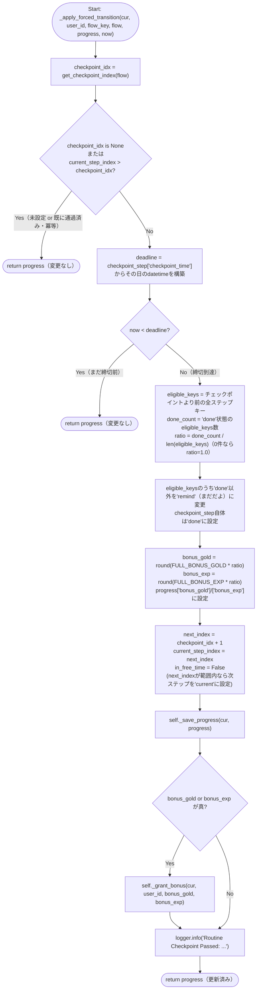
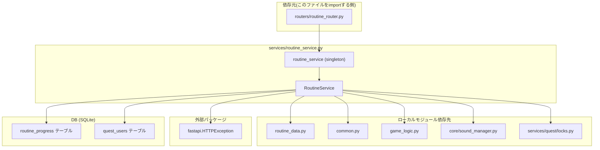

## 1. 解析メタ情報

| 項目 | 内容 |
| --- | --- |
| 対象ファイル | `services/routine_service.py` |
| 言語 | Python |
| 解析対象 | 提供されたコードのみ |
| 推測・補完 | 一切なし |
| 解析基準コミット | `83b42db` |

## 関連ドキュメント

* [routine_data.md](./routine_data.md) - 本ファイルが`from routine_data import FULL_BONUS_EXP, FULL_BONUS_GOLD, ROUTINE_FLOWS, RoutineFlow, get_checkpoint_index`でimportするフロー定義・定数の実体
* [routine_router.md](./routine_router.md) - 本ファイルの`routine_service`シングルトンを`from services.routine_service import routine_service`でimportして呼び出す唯一の呼び出し元
* [routine.md](./routine.md) - `routine_router.py`経由で本ファイルの`complete_step`へ値が渡される`RoutineCompleteAction`の定義元
* [common.md](./common.md) - 本ファイルが`import common`でimportし`common.get_now_iso()`/`common.get_db_cursor(commit=True)`を使用するFacadeモジュール
* [game_logic.md](./game_logic.md) - 本ファイルが`import game_logic`でimportし`game_logic.GameLogic.calc_level_progress`を使用するレベル計算ロジック
* [sound_manager.md](./sound_manager.md) - 本ファイルが`from core import sound_manager`でimportし`sound_manager.play("level_up")`を呼び出す音声再生モジュール
* [quest_locks.md](./quest_locks.md) - 本ファイルが`from services.quest.locks import JST, _get_user_balance_lock, logger`でimportする、`quest_service`と共用のJST定数・ユーザー残高ロック・ロガー

## 2. ファイルの概要

デイリールーティン(すごろく形式の生活導線UI)のサービス層。ファイル冒頭のdocstringが述べる通り、`routers/routine_router.py`はパース・検証のみを行いロジックはここに委譲するというCLAUDE.mdのレイヤリング規約に従う。`quest_users`テーブル(gold/exp/level)への書き込みを伴うため、`services/quest/locks.py`のユーザー残高ロックを`quest_service`と共用し、クエスト完了/承認と同一ユーザーへの並行更新によるlost updateを防ぐ設計である。ユーザーごと・フロー(`am`/`pm`)ごと・日付ごとの進捗を`routine_progress`テーブルに保持し、チェックポイント時刻を過ぎた際に未完了ステップを「まだだよ(remind)」に変えつつ達成率に応じたボーナス(gold/exp)を按分付与する「強制切替」ロジック(`_apply_forced_transition`)が本ファイルの中核である。公開メソッドは`get_today_state`(状態取得)と`complete_step`(ステップ完了)の2つで、モジュールレベルシングルトン`routine_service`としてインスタンス化され`routine_router.py`から直接importされる(CLAUDE.mdのDI非導入方針・モジュールレベルシングルトンパターンに従う)。
根拠: [モジュールdocstring] (行番号: 1-6 / 抜粋: "routers/routine_router.py はパース・検証のみを行い、ロジックはここに委譲する\n(CLAUDE.mdのレイヤリング規約)。quest_users(gold/exp/level)への書き込みを伴うため、\nservices/quest/locks.py の user balance lock を quest_service と共用し、\nクエスト完了/承認と同一ユーザーへの並行更新によるlost updateを防ぐ。")、[モジュールレベルシングルトン] (行番号: 242 / 抜粋: "routine_service = RoutineService()")

## 3. 外部依存関係

### インポート一覧

| 名称 | 種類 | 用途 | 根拠 |
| --- | --- | --- | --- |
| `datetime` | 標準 | 現在時刻の取得・時刻比較(`now.replace(...)`等) | 根拠: [インポート宣言] (行番号: 8 / 抜粋: "import datetime") |
| `json` | 標準 | `steps_status`カラム(JSON TEXT)のシリアライズ/デシリアライズ | 根拠: [インポート宣言] (行番号: 9 / 抜粋: "import json") |
| `typing.Any` | 標準 | 型ヒント(`Dict[str, Any]`等) | 根拠: [インポート宣言] (行番号: 10 / 抜粋: "from typing import Any, Dict, Optional") |
| `typing.Dict` | 標準 | 型ヒント(戻り値`Dict[str, Any]`等) | 根拠: [インポート宣言] (行番号: 10 / 抜粋: "from typing import Any, Dict, Optional") |
| `typing.Optional` | 標準 | 型ヒント(`Optional[datetime.datetime]`等) | 根拠: [インポート宣言] (行番号: 10 / 抜粋: "from typing import Any, Dict, Optional") |
| `fastapi.HTTPException` | 外部パッケージ | ユーザー未存在・不正なフロー/ステップ指定時のHTTPエラー送出 | 根拠: [インポート宣言] (行番号: 12 / 抜粋: "from fastapi import HTTPException") |
| `common` | ローカルモジュール | `common.get_now_iso()`(タイムスタンプ生成)・`common.get_db_cursor(commit=True)`(DBカーソル取得) | 根拠: [インポート宣言] (行番号: 14 / 抜粋: "import common") |
| `game_logic` | ローカルモジュール | `game_logic.GameLogic.calc_level_progress`によるレベル/経験値計算 | 根拠: [インポート宣言] (行番号: 15 / 抜粋: "import game_logic") |
| `core.sound_manager` | ローカルモジュール | レベルアップ時の効果音再生(`sound_manager.play("level_up")`) | 根拠: [インポート宣言] (行番号: 16 / 抜粋: "from core import sound_manager") |
| `routine_data` (`FULL_BONUS_EXP`, `FULL_BONUS_GOLD`, `ROUTINE_FLOWS`, `RoutineFlow`, `get_checkpoint_index`) | ローカルモジュール | フロー定義本体・完走ボーナス満額定数・チェックポイントインデックス取得関数 | 根拠: [インポート宣言] (行番号: 17 / 抜粋: "from routine_data import FULL_BONUS_EXP, FULL_BONUS_GOLD, ROUTINE_FLOWS, RoutineFlow, get_checkpoint_index") |
| `services.quest.locks` (`JST`, `_get_user_balance_lock`, `logger`) | ローカルモジュール | JST(日本標準時)定数、ユーザー単位のプロセス内排他ロック取得関数、`quest_service`と共有するロガー | 根拠: [インポート宣言] (行番号: 18 / 抜粋: "from services.quest.locks import JST, _get_user_balance_lock, logger") |

### ブラックボックスとなる外部要素

| 名称 | 理由 | 根拠 |
| --- | --- | --- |
| `common.get_db_cursor(commit=True)`の内部実装 | SQLiteのロック再試行・WALモード設定・例外時ロールバック等の具体的な実装は`core/database.py`側にあり本ファイルからは不明。 | [with文] (行番号: 176, 202 / 抜粋: "with common.get_db_cursor(commit=True) as cur:") |
| `common.get_now_iso()`の出力形式 | 生成されるISO文字列の具体的なフォーマット(タイムゾーン表記等)が本ファイルからは不明。 | [関数呼び出し] (行番号: 56, 65, 82, 94 / 抜粋: "now_iso = common.get_now_iso()") |
| `game_logic.GameLogic.calc_level_progress`の内部計算式 | レベルアップに必要な経験値テーブル等の計算ロジックの詳細は不明。詳細は[game_logic.md](./game_logic.md)参照。 | [関数呼び出し] (行番号: 89-91 / 抜粋: "game_logic.GameLogic.calc_level_progress(\n            user['level'], user['exp'], exp\n        )") |
| `sound_manager.play`の実際の音声再生手段 | 音声ファイルの実体・再生失敗時の挙動が不明。詳細は[sound_manager.md](./sound_manager.md)参照。 | [関数呼び出し] (行番号: 97 / 抜粋: "sound_manager.play(\"level_up\")") |
| `_get_user_balance_lock`の内部実装(`RefCountedLockRegistry`) | 参照カウント付きロックレジストリの具体的な排他制御実装は`core/utils.py`側にあり不明。詳細は[quest_locks.md](./quest_locks.md)参照。 | [with文] (行番号: 175, 201 / 抜粋: "with _get_user_balance_lock(user_id):") |
| `routine_progress`テーブルのスキーマ全体 | 本ファイルはSQL文中でカラム名を参照するのみで、テーブル定義自体(制約・インデックス・デフォルト値)は`migrations/0010_add_routine_progress.sql`にあり、マイグレーションは仕様書ドリフト規約の対象外のため直接引用にとどめる(§8参照)。 | [SQL文] (行番号: 49-52, 57-66 / 抜粋: "SELECT * FROM routine_progress WHERE user_id=? AND flow_key=? AND progress_date=?") |

## 4. 主要要素の定義（関数 / エンドポイント / コンポーネント）

### `RoutineService` (クラス)

* **役割**: デイリールーティンの状態取得・ステップ完了処理をまとめるサービスクラス。全メソッドがインスタンスメソッドとして定義され、モジュール末尾で単一のシングルトン`routine_service`としてインスタンス化される。
* 根拠: [クラス定義] (行番号: 21 / 抜粋: "class RoutineService:")、[シングルトン化] (行番号: 242 / 抜粋: "routine_service = RoutineService()")

* **引数/リクエスト**: 該当なし(クラス定義自体はコンストラクタを持たず、`object`のデフォルト`__init__`を使用)
* 根拠: [クラス定義] (行番号: 21-242、`__init__`の明示的定義は存在しない)

* **戻り値/レスポンス**: 該当なし
* 根拠: [クラス定義] (行番号: 21)

* **副作用**: なし(クラス定義自体には副作用なし。各メソッドの副作用は個別に後述)
* 根拠: [クラス定義] (行番号: 21)

* **エラーハンドリング**: なし(クラス定義自体にはエラーハンドリングなし)
* 根拠: [クラス定義] (行番号: 21)

### `_today_str`

* **役割**: 渡された`datetime`を`'%Y-%m-%d'`形式の文字列に変換する。
* 根拠: [メソッド定義] (行番号: 22-23 / 抜粋: "def _today_str(self, now: datetime.datetime) -> str:\n        return now.strftime('%Y-%m-%d')")

* **引数/リクエスト**: `now: datetime.datetime`
* 根拠: [メソッド定義] (行番号: 22)

* **戻り値/レスポンス**: `str`(`'YYYY-MM-DD'`形式)
* 根拠: [戻り値] (行番号: 23 / 抜粋: "return now.strftime('%Y-%m-%d')")

* **副作用**: なし
* 根拠: [メソッド定義] (行番号: 22-23)

* **エラーハンドリング**: なし
* 根拠: [メソッド定義] (行番号: 22-23)

### `_is_flow_started_today`

* **役割**: 指定フローが「本日」開始済みかどうかを判定する。渡された`now`の曜日(`now.weekday()`)がフローの`day_of_week`に含まれず対象外の場合は`False`。対象曜日であれば、フローの`start_trigger_time`('HH:MM')と同じ時:分:0秒0マイクロ秒に設定した`now`と比較し、`now`がその時刻以降であれば`True`を返す。
* 根拠: [メソッド定義] (行番号: 25-30 / 抜粋: "def _is_flow_started_today(self, flow: RoutineFlow, now: datetime.datetime) -> bool:\n        if now.weekday() not in flow['day_of_week']:\n            return False\n        hour, minute = map(int, flow['start_trigger_time'].split(':'))\n        trigger = now.replace(hour=hour, minute=minute, second=0, microsecond=0)\n        return now >= trigger")

* **引数/リクエスト**: `flow: RoutineFlow`, `now: datetime.datetime`
* 根拠: [メソッド定義] (行番号: 25)

* **戻り値/レスポンス**: `bool`
* 根拠: [戻り値] (行番号: 27, 30 / 抜粋: "return False", "return now >= trigger")

* **副作用**: なし
* 根拠: [メソッド定義] (行番号: 25-30)

* **エラーハンドリング**: なし(`flow['start_trigger_time']`が`'HH:MM'`形式でない場合の`ValueError`等は捕捉されない)
* 根拠: [メソッド定義] (行番号: 25-30、`try`/`except`は存在しない)

### `_empty_statuses`

* **役割**: フローの全ステップに対する初期`steps_status`辞書を生成する。先頭(インデックス0)のステップは`'current'`、それ以外は`'locked'`とする。
* 根拠: [メソッド定義] (行番号: 32-36 / 抜粋: "def _empty_statuses(self, flow: RoutineFlow) -> Dict[str, str]:\n        return {\n            step['key']: ('current' if idx == 0 else 'locked')\n            for idx, step in enumerate(flow['steps'])\n        }")

* **引数/リクエスト**: `flow: RoutineFlow`
* 根拠: [メソッド定義] (行番号: 32)

* **戻り値/レスポンス**: `Dict[str, str]`(ステップキー→`'current'`または`'locked'`)
* 根拠: [戻り値] (行番号: 33-36)

* **副作用**: なし
* 根拠: [メソッド定義] (行番号: 32-36)

* **エラーハンドリング**: なし
* 根拠: [メソッド定義] (行番号: 32-36)

### `_row_to_progress`

* **役割**: `routine_progress`テーブルのDB行(`row`)を、`steps_status`をJSONデコード済みの辞書として展開したアプリケーション内部表現(`Dict[str, Any]`)に変換する。
* 根拠: [メソッド定義] (行番号: 38-46 / 抜粋: "def _row_to_progress(self, row) -> Dict[str, Any]:\n        return {\n            'id': row['id'],\n            'current_step_index': row['current_step_index'],\n            'in_free_time': bool(row['in_free_time']),\n            'steps_status': json.loads(row['steps_status']),\n            'bonus_gold': row['bonus_gold'],\n            'bonus_exp': row['bonus_exp'],\n        }")

* **引数/リクエスト**: `row`(型ヒントなし。SQLite行オブジェクト、キーアクセス`row['id']`等が可能な前提)
* 根拠: [メソッド定義] (行番号: 38)

* **戻り値/レスポンス**: `Dict[str, Any]`(`id`, `current_step_index`, `in_free_time`(bool化済み), `steps_status`(JSONデコード済みdict), `bonus_gold`, `bonus_exp`)
* 根拠: [戻り値] (行番号: 39-46)

* **副作用**: なし
* 根拠: [メソッド定義] (行番号: 38-46)

* **エラーハンドリング**: なし(`json.loads`が不正なJSONに対して送出する`json.JSONDecodeError`は捕捉されない)
* 根拠: [メソッド定義] (行番号: 38-46、`try`/`except`は存在しない)

### `_get_or_create_progress`

* **役割**: 指定ユーザー・フロー・日付の`routine_progress`行を取得する。存在しなければ、`_empty_statuses(flow)`をJSON化した初期状態(`current_step_index=0`, `in_free_time=0`, `bonus_gold=0`, `bonus_exp=0`)で新規行をINSERTしてから取得し直す。
* 根拠: [メソッド定義] (行番号: 48-71 / 抜粋: "def _get_or_create_progress(self, cur, user_id: str, flow_key: str, flow: RoutineFlow, date_str: str) -> Dict[str, Any]:\n        row = cur.execute(\n            \"SELECT * FROM routine_progress WHERE user_id=? AND flow_key=? AND progress_date=?\",\n            (user_id, flow_key, date_str),\n        ).fetchone()\n        if row:\n            return self._row_to_progress(row)")

* **引数/リクエスト**: `cur`(DBカーソル)、`user_id: str`、`flow_key: str`、`flow: RoutineFlow`、`date_str: str`
* 根拠: [メソッド定義] (行番号: 48)

* **戻り値/レスポンス**: `Dict[str, Any]`(`_row_to_progress`と同じ形状)
* 根拠: [戻り値] (行番号: 54, 71 / 抜粋: "return self._row_to_progress(row)")

* **副作用**: 該当行が存在しない場合、`routine_progress`テーブルへの`INSERT`を実行する。
* 根拠: [INSERT文] (行番号: 57-66 / 抜粋: "cur.execute(\"\"\"\n            INSERT INTO routine_progress\n                (user_id, flow_key, progress_date, current_step_index, in_free_time,\n                 steps_status, bonus_gold, bonus_exp, created_at, updated_at)\n            VALUES (?, ?, ?, 0, 0, ?, 0, 0, ?, ?)\n        \"\"\", (")

* **エラーハンドリング**: なし(`INSERT`失敗時の例外は捕捉されない。呼び出し元の`with common.get_db_cursor(commit=True)`側のロールバック挙動に委ねられる)
* 根拠: [メソッド定義] (行番号: 48-71、`try`/`except`は存在しない)

### `_save_progress`

* **役割**: 渡された`progress`(内部表現)の内容で`routine_progress`テーブルの該当行(`id`一致)を`UPDATE`する。`steps_status`は`json.dumps(..., ensure_ascii=False)`で再エンコードし、`updated_at`は`common.get_now_iso()`で更新する。
* 根拠: [メソッド定義] (行番号: 73-83 / 抜粋: "def _save_progress(self, cur, progress: Dict[str, Any]) -> None:\n        cur.execute(\"\"\"\n            UPDATE routine_progress\n            SET current_step_index=?, in_free_time=?, steps_status=?, bonus_gold=?, bonus_exp=?, updated_at=?\n            WHERE id=?\n        \"\"\", (")

* **引数/リクエスト**: `cur`(DBカーソル)、`progress: Dict[str, Any]`
* 根拠: [メソッド定義] (行番号: 73)

* **戻り値/レスポンス**: `None`
* 根拠: [型ヒント] (行番号: 73 / 抜粋: "-> None:")

* **副作用**: `routine_progress`テーブルへの`UPDATE`実行。
* 根拠: [UPDATE文] (行番号: 74-83)

* **エラーハンドリング**: なし
* 根拠: [メソッド定義] (行番号: 73-83、`try`/`except`は存在しない)

### `_grant_bonus`

* **役割**: 指定ユーザーに`gold`・`exp`を付与する。`quest_users`テーブルから該当ユーザーを取得できなければ何もせず早期リターンする。取得できた場合は`game_logic.GameLogic.calc_level_progress(user['level'], user['exp'], exp)`で新しい`level`/`exp`/レベルアップ有無を計算し、`level`・`exp`・`gold`(既存値+付与分)・`updated_at`を`UPDATE`する。レベルアップした場合は`sound_manager.play("level_up")`を呼ぶ。
* 根拠: [メソッド定義] (行番号: 85-97 / 抜粋: "def _grant_bonus(self, cur, user_id: str, gold: int, exp: int) -> None:\n        user = cur.execute(\"SELECT * FROM quest_users WHERE user_id=?\", (user_id,)).fetchone()\n        if not user:\n            return\n        new_level, new_exp_val, leveled_up = game_logic.GameLogic.calc_level_progress(\n            user['level'], user['exp'], exp\n        )\n        cur.execute(\n            \"UPDATE quest_users SET level=?, exp=?, gold=?, updated_at=? WHERE user_id=?\",\n            (new_level, new_exp_val, user['gold'] + gold, common.get_now_iso(), user_id),\n        )\n        if leveled_up:\n            sound_manager.play(\"level_up\")")

* **引数/リクエスト**: `cur`(DBカーソル)、`user_id: str`、`gold: int`、`exp: int`
* 根拠: [メソッド定義] (行番号: 85)

* **戻り値/レスポンス**: `None`
* 根拠: [型ヒント] (行番号: 85 / 抜粋: "-> None:")

* **副作用**: `quest_users`テーブルへの`UPDATE`(該当ユーザーが存在する場合のみ)。レベルアップ時は`sound_manager.play("level_up")`による効果音再生。
* 根拠: [UPDATE文] (行番号: 92-95)、[効果音再生] (行番号: 96-97 / 抜粋: "if leveled_up:\n            sound_manager.play(\"level_up\")")

* **エラーハンドリング**: 対象ユーザーが存在しない場合は例外を送出せず早期リターンで何もしない(サイレントスキップ)。
* 根拠: [条件分岐] (行番号: 87-88 / 抜粋: "if not user:\n            return")

### `_apply_forced_transition`

* **役割**: チェックポイント(自由時間の終了予定時刻)を過ぎていれば、チェックポイントより前の未完了ステップを`'remind'`(「まだだよ」)に変え、チェックポイント以前のステップの達成率に応じたボーナスを`_grant_bonus`で付与したうえで、進捗をチェックポイントの次のステップへ進める。`current_step_index`が既にチェックポイントを通過していれば何もしない(冪等)ため、メソッドdocstringが明記する通り`get_today_state`(GET)・`complete_step`(POST)のどちらからも安全に呼べる設計になっている。
* 根拠: [メソッド定義・docstring] (行番号: 99-108 / 抜粋: "def _apply_forced_transition(\n        self, cur, user_id: str, flow_key: str, flow: RoutineFlow, progress: Dict[str, Any], now: datetime.datetime\n    ) -> Dict[str, Any]:\n        \"\"\"チェックポイント(自由時間の終了予定時刻)を過ぎていれば、未完了ステップを\n        「まだだよ」に変え、チェックポイントより前のステップの達成率に応じたボーナスを\n        付与したうえでチェックポイントの次のステップへ進める。\n\n        current_step_indexがチェックポイントを既に通過していれば何もしない(冪等)ため、\n        GET(状態取得)・POST(ステップ完了)のどちらからも安全に呼べる。\n        \"\"\"")

* **引数/リクエスト**: `cur`(DBカーソル)、`user_id: str`、`flow_key: str`、`flow: RoutineFlow`、`progress: Dict[str, Any]`、`now: datetime.datetime`
* 根拠: [メソッド定義] (行番号: 99-101)

* **戻り値/レスポンス**: `Dict[str, Any]`(更新後、または変更が無かった場合はそのままの`progress`)
* 根拠: [戻り値] (行番号: 111, 117, 147 / 抜粋: "return progress")

* **副作用**: チェックポイント通過条件を満たした場合、`self._save_progress(cur, progress)`による`routine_progress`のUPDATE、`self._grant_bonus(...)`による`quest_users`のUPDATE(ボーナスが0でない場合のみ)、および`logger.info(...)`によるログ出力を行う。条件を満たさない場合は副作用なし。
* 根拠: [呼び出し] (行番号: 139-146 / 抜粋: "self._save_progress(cur, progress)\n        if bonus_gold or bonus_exp:\n            self._grant_bonus(cur, user_id, bonus_gold, bonus_exp)\n\n        logger.info(\n            f\"Routine Checkpoint Passed: User={user_id}, Flow={flow_key}, \"\n            f\"Ratio={ratio:.2f}, Gold={bonus_gold}, Exp={bonus_exp}\"\n        )")

* **エラーハンドリング**: 明示的な`try`/`except`は無い。`checkpoint_idx is None`(チェックポイントを持つステップがフローに存在しない)、または既に`current_step_index > checkpoint_idx`(通過済み)の場合は何もせず`progress`をそのまま返す早期リターンでガードしている。`eligible_keys`が空の場合は達成率`ratio`を`1.0`とみなす(ゼロ除算回避)。
* 根拠: [早期リターン] (行番号: 109-111 / 抜粋: "checkpoint_idx = get_checkpoint_index(flow)\n        if checkpoint_idx is None or progress['current_step_index'] > checkpoint_idx:\n            return progress")、[時刻未到達の早期リターン] (行番号: 116-117 / 抜粋: "if now < deadline:\n            return progress")、[ゼロ除算回避] (行番号: 121 / 抜粋: "ratio = (done_count / len(eligible_keys)) if eligible_keys else 1.0")

### `_serialize_flow`

* **役割**: `flow`(定義)と`progress`(内部表現)から、APIレスポンス用の辞書を組み立てる。チェックポイントの有無・時刻、各ステップの`is_checkpoint`/`status`、`current_step_index`、`in_free_time`、全ステップ完了判定(`is_complete`)、ボーナスgold/expを含む。
* 根拠: [メソッド定義] (行番号: 149-172 / 抜粋: "def _serialize_flow(self, flow: RoutineFlow, progress: Dict[str, Any]) -> Dict[str, Any]:\n        checkpoint_idx = get_checkpoint_index(flow)\n        checkpoint_time = flow['steps'][checkpoint_idx]['checkpoint_time'] if checkpoint_idx is not None else None")

* **引数/リクエスト**: `flow: RoutineFlow`、`progress: Dict[str, Any]`
* 根拠: [メソッド定義] (行番号: 149)

* **戻り値/レスポンス**: `Dict[str, Any]`(`started`, `title`, `checkpoint_time`, `current_step_index`, `in_free_time`, `is_complete`, `bonus_gold`, `bonus_exp`, `steps`(各要素は`key`/`label`/`icon_key`/`is_checkpoint`/`status`))
* 根拠: [戻り値] (行番号: 162-172)

* **副作用**: なし
* 根拠: [メソッド定義] (行番号: 149-172)

* **エラーハンドリング**: なし
* 根拠: [メソッド定義] (行番号: 149-172、`try`/`except`は存在しない)

### `get_today_state`

* **役割**: 指定ユーザーの本日時点における全フロー(`ROUTINE_FLOWS`の各キー)の状態を取得する公開メソッド。ユーザー残高ロックとDBカーソルを取得したうえで、対象ユーザーの存在確認、各フローについて開始判定(`_is_flow_started_today`)・進捗取得または作成(`_get_or_create_progress`)・強制切替適用(`_apply_forced_transition`)・シリアライズ(`_serialize_flow`)を行う。
* 根拠: [メソッド定義] (行番号: 174-192 / 抜粋: "def get_today_state(self, user_id: str, now: Optional[datetime.datetime] = None) -> Dict[str, Any]:\n        with _get_user_balance_lock(user_id):\n            with common.get_db_cursor(commit=True) as cur:")

* **引数/リクエスト**: `user_id: str`、`now: Optional[datetime.datetime] = None`(省略時は`datetime.datetime.now(JST)`)
* 根拠: [メソッド定義] (行番号: 174 / 抜粋: "def get_today_state(self, user_id: str, now: Optional[datetime.datetime] = None) -> Dict[str, Any]:")、[デフォルト値解決] (行番号: 181 / 抜粋: "now = now or datetime.datetime.now(JST)")

* **戻り値/レスポンス**: `Dict[str, Any]` — `{"date": date_str, "flows": flows_out}`。`flows_out`の各値は、未開始フローなら`{"started": False, "title": flow['title']}`、開始済みなら`_serialize_flow`の戻り値。
* 根拠: [戻り値] (行番号: 192 / 抜粋: "return {\"date\": date_str, \"flows\": flows_out}")、[未開始時の値] (行番号: 186 / 抜粋: "flows_out[flow_key] = {\"started\": False, \"title\": flow['title']}")

* **副作用**: `_get_user_balance_lock(user_id)`によるプロセス内ロック取得・解放、`common.get_db_cursor(commit=True)`によるDBトランザクション(コミット)、`_get_or_create_progress`による`routine_progress`への`INSERT`(初回のみ)、`_apply_forced_transition`経由での`UPDATE`とボーナス付与・ログ出力(条件成立時のみ)。
* 根拠: [with文] (行番号: 175-176 / 抜粋: "with _get_user_balance_lock(user_id):\n            with common.get_db_cursor(commit=True) as cur:")、[メソッド呼び出し] (行番号: 188-190)

* **エラーハンドリング**: 対象ユーザーが`quest_users`テーブルに存在しない場合、`HTTPException(status_code=404, detail="User not found")`を送出する。
* 根拠: [例外送出] (行番号: 177-179 / 抜粋: "user = cur.execute(\"SELECT 1 FROM quest_users WHERE user_id=?\", (user_id,)).fetchone()\n                if not user:\n                    raise HTTPException(status_code=404, detail=\"User not found\")")

### `complete_step`

* **役割**: 指定ユーザーの指定フロー・指定ステップを完了させる公開メソッド。`flow_key`の妥当性チェック、ユーザー存在確認、フロー開始済みチェック、進捗取得(`_get_or_create_progress`)と強制切替の適用(`_apply_forced_transition`)、現在のステップとの一致チェック、チェックポイントステップでないことのチェック、ステップを`'done'`にして次ステップへ進める処理、保存(`_save_progress`)、そして直後に締切を過ぎていた場合に備えた再度の強制切替適用を行う。
* 根拠: [メソッド定義] (行番号: 194-239 / 抜粋: "def complete_step(\n        self, user_id: str, flow_key: str, step_key: str, now: Optional[datetime.datetime] = None\n    ) -> Dict[str, Any]:")

* **引数/リクエスト**: `user_id: str`、`flow_key: str`、`step_key: str`、`now: Optional[datetime.datetime] = None`(省略時は`datetime.datetime.now(JST)`)
* 根拠: [メソッド定義] (行番号: 194-196)、[デフォルト値解決] (行番号: 207 / 抜粋: "now = now or datetime.datetime.now(JST)")

* **戻り値/レスポンス**: `Dict[str, Any]`(`_serialize_flow(flow, progress)`の戻り値、更新後の状態)
* 根拠: [戻り値] (行番号: 239 / 抜粋: "return self._serialize_flow(flow, progress)")

* **副作用**: `_get_user_balance_lock(user_id)`・`common.get_db_cursor(commit=True)`によるロック・トランザクション、`_get_or_create_progress`による`INSERT`(初回のみ)、対象ステップを`'done'`・次ステップを`'current'`にした上での`_save_progress`による`UPDATE`、および2回の`_apply_forced_transition`呼び出し(1回目: 完了処理前の状態同期、2回目: 完了直後にチェックポイントへ到達し既に締切時刻を過ぎていた場合の即時通過処理)に伴う追加の`UPDATE`・ボーナス付与・ログ出力(条件成立時)。
* 根拠: [ロック・トランザクション] (行番号: 201-202)、[1回目の強制切替] (行番号: 213 / 抜粋: "progress = self._apply_forced_transition(cur, user_id, flow_key, flow, progress, now)")、[ステップ完了処理] (行番号: 225-232)、[2回目の強制切替とそのコメント] (行番号: 234-237 / 抜粋: "# 直後にチェックポイントへ到達し、かつ既に締切時刻を過ぎている場合\n                # (例: 出遅れて自由時間に入った瞬間には既に7:50だった)、この場で\n                # 通過処理まで済ませ、フロントが追加のポーリングを待たずに済むようにする。\n                progress = self._apply_forced_transition(cur, user_id, flow_key, flow, progress, now)")

* **エラーハンドリング**: (1) `flow_key`が`ROUTINE_FLOWS`に存在しなければ`HTTPException(404, "Unknown flow_key")`。(2) 対象ユーザーが存在しなければ`HTTPException(404, "User not found")`。(3) フローが本日まだ開始していなければ`HTTPException(400, "このフローはまだ開始していません")`。(4) 進捗の`current_step_index`が既に全ステップ数以上(完了済み)であれば`HTTPException(400, "本日のフローは完了しています")`。(5) リクエストの`step_key`が現在のステップキーと一致しなければ`HTTPException(409, "表示が古いようです。再読み込みしてください")`。(6) 現在のステップがチェックポイント(自由時間)であれば`HTTPException(400, "自由時間は時間になると自動的に次へ進みます")`(自由時間は時間経過による自動遷移のみで、明示的な完了操作は許可しない)。
* 根拠: [flow_key検証] (行番号: 197-198 / 抜粋: "if flow_key not in ROUTINE_FLOWS:\n            raise HTTPException(status_code=404, detail=\"Unknown flow_key\")")、[ユーザー検証] (行番号: 204-205 / 抜粋: "if not user:\n                    raise HTTPException(status_code=404, detail=\"User not found\")")、[開始判定] (行番号: 208-209 / 抜粋: "if not self._is_flow_started_today(flow, now):\n                    raise HTTPException(status_code=400, detail=\"このフローはまだ開始していません\")")、[完了済み判定] (行番号: 216-217 / 抜粋: "if idx >= len(flow['steps']):\n                    raise HTTPException(status_code=400, detail=\"本日のフローは完了しています\")")、[ステップ不一致判定] (行番号: 220-221 / 抜粋: "if current_step['key'] != step_key:\n                    raise HTTPException(status_code=409, detail=\"表示が古いようです。再読み込みしてください\")")、[チェックポイント判定] (行番号: 222-223 / 抜粋: "if current_step['checkpoint_time']:\n                    raise HTTPException(status_code=400, detail=\"自由時間は時間になると自動的に次へ進みます\")")

### `routine_service` (モジュールレベルシングルトン)

* **役割**: `RoutineService`の唯一のインスタンス。`routine_router.py`はこの変数を直接importして両エンドポイントの処理を委譲する(CLAUDE.mdのモジュールレベルシングルトン+直接importパターン)。
* 根拠: [インスタンス化] (行番号: 242 / 抜粋: "routine_service = RoutineService()")

* **引数/リクエスト**: 該当なし
* 根拠: [インスタンス化] (行番号: 242)

* **戻り値/レスポンス**: 該当なし
* 根拠: [インスタンス化] (行番号: 242)

* **副作用**: モジュールロード時に`RoutineService()`のインスタンス化を行う。
* 根拠: [インスタンス化] (行番号: 242)

* **エラーハンドリング**: なし
* 根拠: [インスタンス化] (行番号: 242)

## 5. 処理フロー図

以下は`get_today_state`・`complete_step`の両方から呼ばれる中核ロジック`_apply_forced_transition`のフローチャートです。

## 6. 依存関係図

## 7. 次のステップ（リバースエンジニアリングの提案）

| 優先度 | ファイル名(推測可) | 理由 | 根拠 |
| --- | --- | --- | --- |
| 高 | `routine_data.py` | `ROUTINE_FLOWS`の実際のフロー構成(ステップ数・チェックポイント位置・開始時刻)を把握しないと、`_apply_forced_transition`等のロジックの入力データを正しく理解できないため。 | [routine_data.md](./routine_data.md)(本バッチ内)、[インポート宣言] (行番号: 17) |
| 高 | `migrations/0010_add_routine_progress.sql` | `routine_progress`テーブルの正確なスキーマ(カラム制約・`UNIQUE`制約・インデックス)を確認し、本ファイルのSQL文が前提とする構造を検証するため(マイグレーション自体は仕様書ドリフト規約の対象外だが、コード理解のための直接参照は有用)。 | [SQL文] (行番号: 49-52, 57-66) |
| 中 | `services/quest/locks.py` | `_get_user_balance_lock`が実際にどのような排他制御(参照カウント付きロック)を行っているかを確認し、`quest_service`とのロック共用によるデッドロック等のリスクを評価するため。 | [quest_locks.md](./quest_locks.md)(既存)、[インポート宣言] (行番号: 18) |
| 中 | `game_logic.py` | `calc_level_progress`のレベルアップ判定式の詳細を確認し、`_grant_bonus`が付与するボーナスがどうレベル/経験値に反映されるかを把握するため。 | [game_logic.md](./game_logic.md)(既存)、[関数呼び出し] (行番号: 89-91) |
| 低 | `quest_data.py` | `FULL_BONUS_GOLD`/`FULL_BONUS_EXP`の値がquest_data.pyのREWARDS(id=11)と同額に設定されている旨のコメントの妥当性を検証するため。 | [routine_data.md](./routine_data.md)§8参照 |

## 8. 保守上の注意点

* `pm`フローの`start_trigger_time`が`'15:00'`である根拠(実際の下校/帰宅時刻)は`routine_data.py`側のコメントで「仮の既定値」「ユーザー確認事項」と明記されている。この値は`_is_flow_started_today`の判定条件に直接使われるため、確定次第`routine_data.py`側を修正する必要がある。詳細は[routine_data.md](./routine_data.md)§8参照。
* ボーナス額`FULL_BONUS_GOLD = 150`/`FULL_BONUS_EXP = 30`は、`routine_data.py`のコメントにより`quest_data.py`のREWARDS(id=11「Youtube (30:00)」、`cost_gold`)と同額になるよう意図的に設定されている。この一致はコード上強制されていないため、`quest_data.py`側でこの報酬の価格を変更した場合は、`FULL_BONUS_GOLD`(および必要なら`FULL_BONUS_EXP`)を見直す必要がある。
* `steps_status`は`routine_progress`テーブルにJSON TEXTとして保存されており、正規化された別テーブルにはしていない。この設計判断は`migrations/0010_add_routine_progress.sql`のSQLコメントに明記されている:「ステップ数が少なく(最大6件/フロー)、進捗の可視化以外の用途で個別ステップを検索する必要が無いため、正規化した別テーブルにはせずJSONで持つ。」(同SQLファイル13-16行目)。将来的にステップ単位での検索・集計が必要になった場合は、この設計の見直しが必要になる。
* `_get_user_balance_lock`は`services/quest/locks.py`から`quest_service`と共用されているため、あるユーザーのルーティン完了処理(`complete_step`/`get_today_state`)とクエスト完了/承認処理は同一ユーザーに対してプロセス内で直列化される。これは`quest_users`(gold/exp/level)への読み取り→計算→書き込みという同じread-modify-writeパターンをルーティン側とクエスト側の双方が持つため、lost updateを避ける目的で意図的に共用されている(モジュールdocstring参照)。裏を返せば、同一ユーザーに対する大量のルーティン操作とクエスト操作が同時に発生すると、ロック待ちによる直列化でレイテンシが増える可能性がある。
* `complete_step`は`_apply_forced_transition`を2回呼び出す(処理前と処理後)。2回目の呼び出しについては「直後にチェックポイントへ到達し、かつ既に締切時刻を過ぎている場合、この場で通過処理まで済ませ、フロントが追加のポーリングを待たずに済むようにする」というコメントが付されている(行番号: 234-236)。`_apply_forced_transition`自体は冪等(`current_step_index > checkpoint_idx`なら何もしない)なため、2回呼んでも二重にボーナスが付与されることはない。
* `_grant_bonus`は対象ユーザーが`quest_users`に存在しない場合、例外を送出せずサイレントに何もしない(早期リターン)。`get_today_state`/`complete_step`自体はメソッド冒頭で別途ユーザー存在確認(`HTTPException(404)`)を行っているため、通常経路では`_grant_bonus`内のこのケースには到達しないと考えられるが、`_grant_bonus`単体としてはその前提を強制していない。

## 9. 不明事項一覧

| 項目 | 理由 | 必要なファイル |
| --- | --- | --- |
| `pm`フロー`start_trigger_time='15:00'`の確定時期・根拠 | `routine_data.py`側のコメントで「仮の既定値」「ユーザー確認事項」と明記されているのみで、本ファイルからは確定した値や確定時期は不明。 | ユーザーへの直接確認 |
| 将来的なルーティン編集用管理UIの計画有無 | `routine_data.py`のモジュールdocstringは「親が編集する対象ではない」という現状方針を述べるのみで、将来の管理UI追加計画の有無には触れていない。本ファイルのAPI(`get_today_state`/`complete_step`)も編集系のエンドポイントは持たない。 | 該当ファイルなし(ロードマップ文書等の追加が必要) |
| `round()`の丸め方式による境界値での挙動 | `bonus_gold = round(FULL_BONUS_GOLD * ratio)`等はPython組み込みの`round()`(銀行丸め、0.5丁度は最近接の偶数へ丸められる)を使用しているが、この丸め方式が意図的に選択されたものかは本ファイルのコメントからは不明。 | 該当ファイルなし(設計意図の確認が必要) |

## 10. 自己検証結果

* [x] 完了: 推測・外部ファイルの仕様を一切含んでいない
* [x] 完了: 全関数・全クラス・全コンポーネントを列挙した
* [x] 完了: 全てのインポート要素を列挙した
* [x] 完了: すべての仕様説明に「根拠（行番号・抜粋）」を明記した
* [x] 完了: 根拠漏れが0件である
* [x] 完了: Mermaid構文にエラーの原因となる記号（エスケープ漏れ）がない
* [x] 完了: 不明事項を漏れなく列挙した
