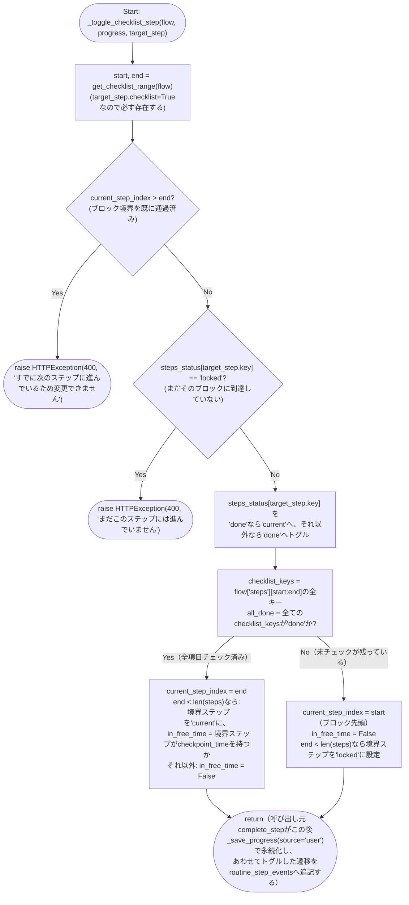
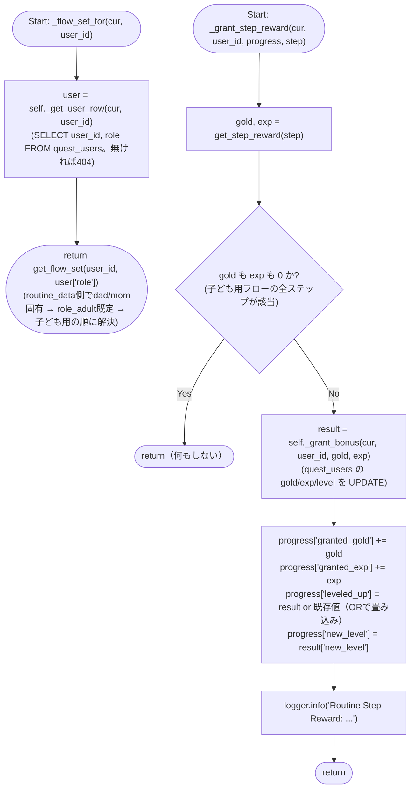
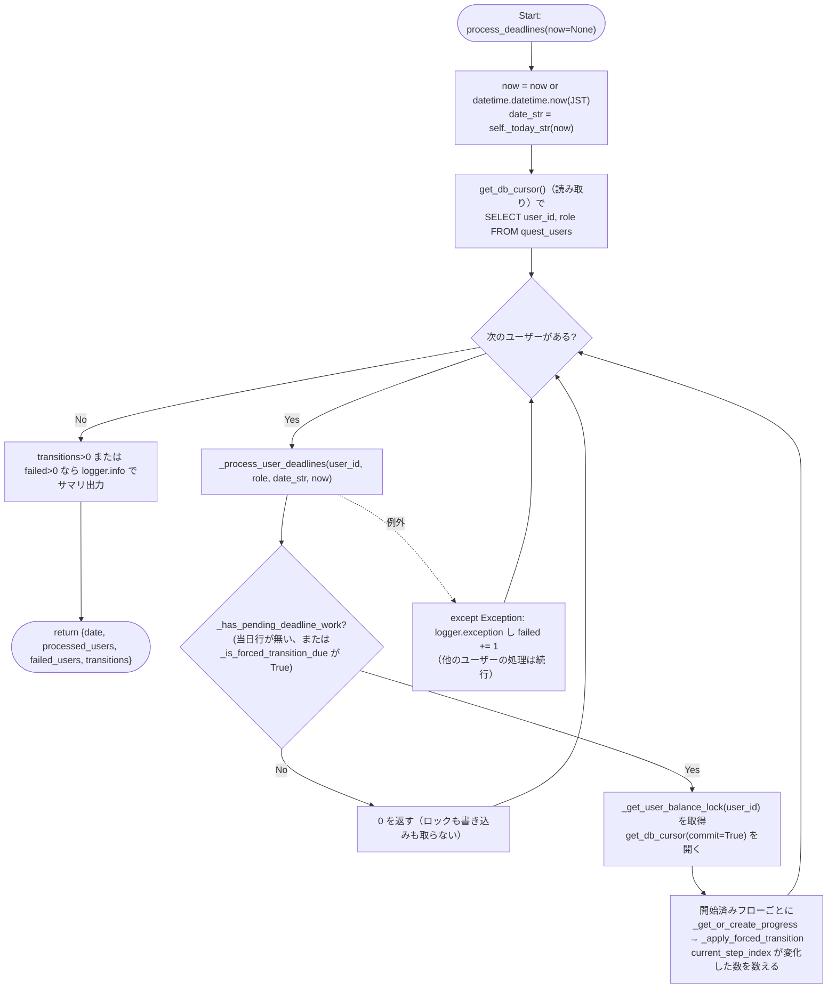
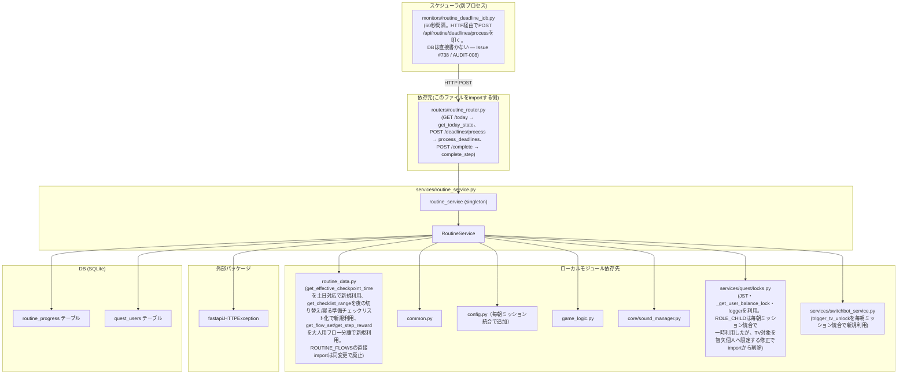

## 1. 解析メタ情報

| 項目 | 内容 |
| --- | --- |
| 対象ファイル | `services/routine_service.py` |
| 言語 | Python |
| 解析対象 | 提供されたコードのみ |
| 推測・補完 | 一切なし |
| 解析基準コミット | `3ac46ca` (+同一ブランチ内で土日のチェックポイント時刻上書き対応・休日PMのステップスキップ/宿題引き継ぎ対応・朝の準備の順不同チェックリスト化・夜の切り替え時刻変更/寝る準備チェックリスト化/明日の準備追加・7:50超過後のam画面非表示化/pm自由時間TV解錠・TV自動ON対象を智矢個人へ限定・ステップ状態遷移の追記記録(`routine_step_events`)・大人用フロー分離/ステップ個別報酬・平日スキップ(weekday_skip)対応・**スキップ分をボーナス按分の母数から除外(`skipped_keys`)・**自由時間の時間固定をやめる(締切では自由時間・TVを与えず、締切後の追いつき完了を許可)**・**Issue #738 / AUDIT-008: `get_today_state`(GET)を読み取り専用化し、締切超過の強制遷移をスケジューラ経由の`process_deadlines`へ移設**を追加修正) |

## 関連ドキュメント

* [routine_data.md](./routine_data.md) - 本ファイルが`from routine_data import (FULL_BONUS_EXP, FULL_BONUS_GOLD, WEEKEND_DAYS, RoutineFlow, RoutineStep, get_checklist_range, get_checkpoint_index, get_effective_checkpoint_time, get_flow_set, get_step_reward)`でimportするフロー定義・定数の実体（**大人用フロー分離で`ROUTINE_FLOWS`の直接importをやめ`get_flow_set`経由に変更、`RoutineStep`・`get_step_reward`を新規importに追加**。`get_effective_checkpoint_time`は土日対応で新規追加、`WEEKEND_DAYS`は休日PM微修正で新規importに追加、`get_checklist_range`は夜の切り替え/寝る準備チェックリスト化で新規importに追加。`RoutineStep`の`checklist`フィールド自体は本ファイルではimportされる関数・定数ではなく`flow['steps']`の各要素の値として参照される）
* [routine_router.md](./routine_router.md) - 本ファイルの`routine_service`シングルトンを`from services.routine_service import routine_service`でimportして呼び出す唯一の呼び出し元
* [routine.md](./routine.md) - `routine_router.py`経由で本ファイルの`complete_step`へ値が渡される`RoutineCompleteAction`の定義元
* [common.md](./common.md) — **Issue #664 で `common.py` ごと廃止された Deprecated Facade**（本ファイルは実体を直importするようになった。仕様書は履歴として残っている）
* [game_logic.md](./game_logic.md) - 本ファイルが`import game_logic`でimportし`game_logic.GameLogic.calc_level_progress`を使用するレベル計算ロジック
* [sound_manager.md](./sound_manager.md) - 本ファイルが`from core import sound_manager`でimportし`sound_manager.play("level_up")`を呼び出す音声再生モジュール
* [quest_locks.md](./quest_locks.md) - 本ファイルが`from services.quest.locks import JST, _get_user_balance_lock, logger`でimportする、`quest_service`と共用のJST定数・ユーザー残高ロック・ロガー（**TV対象を智矢個人へ限定する修正で`ROLE_CHILD`のimportは削除**。TV解錠トリガーの対象者判定はモジュールレベル定数`TV_UNLOCK_TARGET_USER_ID`によるuser_id比較に変更されたため、本ファイルは`quest.locks`のロール定数を使わなくなった）
* [config.md](./config.md)（毎朝ミッション統合で追加） - 本ファイルが`import config`でimportし`config.TV_PLUG_DEVICE_ID`を参照する設定モジュール
* [switchbot_service.md](./switchbot_service.md)（毎朝ミッション統合で追加） - 本ファイルが`from services import switchbot_service`でimportし`switchbot_service.trigger_tv_unlock`を呼び出すSwitchBot連携モジュール。旧`quest_id=1100`「毎朝ミッション」クエスト承認時と同じTV解錠処理を共有する
* [quest_quest_service.md](./quest_quest_service.md)（毎朝ミッション統合で追加） - `switchbot_service.trigger_tv_unlock`のもう一方の呼び出し元（クエスト承認時）。廃止された`quest_id=1100`の経緯はこちらを参照
* `MY_HOME_SYSTEM/migrations/0011_add_routine_step_events.sql`（ステップ遷移の追記記録で追加） - 本ファイルが`INSERT`する`routine_step_events`テーブルの定義元。`migrations/`配下は仕様書の対応付け対象外(`docs/specifications/README.md`)のため、対応するMarkdownは存在しない
* `MY_HOME_SYSTEM/migrations/0012_add_routine_progress_skipped_keys.sql`（スキップ分の按分除外で追加） - 本ファイルが`INSERT`/`SELECT`する`routine_progress.skipped_keys`列の定義元。上と同じ理由で対応するMarkdownは存在しない

## 2. ファイルの概要

デイリールーティン(すごろく形式の生活導線UI)のサービス層。ファイル冒頭のdocstringが述べる通り、`routers/routine_router.py`はパース・検証のみを行いロジックはここに委譲するというCLAUDE.mdのレイヤリング規約に従う。`quest_users`テーブル(gold/exp/level)への書き込みを伴うため、`services/quest/locks.py`のユーザー残高ロックを`quest_service`と共用し、クエスト完了/承認と同一ユーザーへの並行更新によるlost updateを防ぐ設計である。ユーザーごと・フロー(`am`/`pm`)ごと・日付ごとの進捗を`routine_progress`テーブルに保持し、チェックポイント時刻を過ぎた際に未完了ステップを「まだだよ(remind)」に変えつつ達成率に応じたボーナス(gold/exp)を按分付与する「強制切替」ロジック(`_apply_forced_transition`)が本ファイルの中核である。**（土日対応で変更）** チェックポイントの締切時刻は`routine_data.get_effective_checkpoint_time(step, now)`で解決するようになり、`now`の曜日が土日であれば`weekend_checkpoint_time`（設定されていれば）を、それ以外は従来通り`checkpoint_time`を使う。この解決は`_apply_forced_transition`(締切判定)と`_serialize_flow`(レスポンス表示用の`checkpoint_time`算出)の両方で行われる。**（休日PM微修正で追加）** さらに、`routine_data.RoutineStep`に新設された`weekend_skip`(土日はステップ自体を不要とする)・`weekend_carryover`(前日以前の完了実績を引き継いで不要とする)の2フラグを解釈する処理が本ファイルに追加された。土日のみ、フロー生成時(`_get_or_create_progress`)に`_resolve_skip_keys`でスキップ対象のステップkey集合を求め、`_empty_statuses`がそれらを最初から`'done'`として扱う初期状態を組み立てる。`weekend_carryover`対象ステップについては`_carryover_lookback_dates`(土曜は前日、日曜は前日・前々日)で遡るべき日付を求め、`_was_done_on_any_date`がその日付の`routine_progress`行の`steps_status`を実際に参照して判定する。ステップ完了(`complete_step`)や強制切替(`_apply_forced_transition`)で次のステップへ進める際にスキップ済みステップを飛ばす処理は共通ヘルパー`_next_active_index`に切り出されている。**（朝の準備チェックリスト化で追加、夜の切り替え/寝る準備チェックリスト化で一般化）** `routine_data.RoutineStep`に新設された`checklist`フィールド(順不同でチェックできるグループの一員かどうか)を解釈する処理も本ファイルに追加された。以前は`checklist=True`のブロックが「フロー先頭」に固定されている前提で書かれていたが(`am`にしかチェックリストが無く、その直後がチェックポイントだったため)、`pm`フローのチェックポイント通過後(寝る準備4項目)にもチェックリストを置く要件に伴い、`routine_data.get_checklist_range(flow)`が返す`(開始index, 終了index+1)`を軸にした汎用的な実装に一般化された。新設の`_activate_block(flow, statuses, index)`は「`index`のステップに進行が到達した」ことを表現する共通処理で、それが単独ステップなら`'current'`にするだけだが、`checklist=True`なグループの一員なら`get_checklist_range`が返す範囲全体を一括で`'current'`にする。`_empty_statuses`(フロー生成時の初期化)・`_apply_forced_transition`(チェックポイント通過後の次ステップ活性化)・`complete_step`の逐次ステップ分岐(通常ステップ完了後の次ステップ活性化)の3箇所全てが、この`_activate_block`を経由するようになったことで、チェックリストが「フロー先頭」「チェックポイント通過後」のどちらに置かれていても同じコードで正しく動作する。`complete_step`は対象ステップが`checklist=True`なら現在地(`current_step_index`)と無関係に`_toggle_checklist_step`へ処理を委譲し、`'current'`⇔`'done'`のトグルとチェックリスト全項目達成時の「ブロック直後のステップ」への遷移(またはその巻き戻し)を行う。**（夜の切り替え/寝る準備チェックリスト化で変更）** この「ブロック直後のステップ」は`am`では出発チェックポイント(`free`)だが、`pm`では単なる`sleep`(就寝、チェックポイントではない)であるため、`_toggle_checklist_step`の実装も「チェックポイントの前後」という特化した表現から「チェックリストブロックの境界(boundary)の前後」という一般化された表現に書き直され、境界に到達していない(まだ`'locked'`)ブロックへのトグルを拒否するガードも新設された。達成率に応じたボーナス按分の比率計算(`_eligible_done_ratio`)は`_apply_forced_transition`と、チェックポイント通過前でも常にライブ表示できる新設の`_compute_bonus_preview`(`_serialize_flow`の`preview_bonus_gold`が使う)の両方から共有される共通ヘルパーとして切り出された(この計算式自体は`checklist`がチェックポイントの前にあるか後にあるかを意識しないため、`pm`のチェックポイント通過後チェックリストが追加された今回の変更でも計算式自体に変更は無い)。公開メソッドは`get_today_state`(状態取得)と`complete_step`(ステップ完了/チェックリストのトグル)の2つで、モジュールレベルシングルトン`routine_service`としてインスタンス化され`routine_router.py`から直接importされる(CLAUDE.mdのDI非導入方針・モジュールレベルシングルトンパターンに従う)。**（TV対象を智矢個人へ限定する修正で追加）** `_toggle_checklist_step`(朝の準備チェックリスト全達成)・`complete_step`(夕方フリータイム到達)双方のTV自動ONトリガーは、当初`services.quest.locks.ROLE_CHILD`との比較(`role`が子供かどうか)で対象者を判定していたが、涼花(`daughter`)も`role_child`でありTV操作の対象に含まれてしまうため、モジュールレベル定数`TV_UNLOCK_TARGET_USER_ID`(値`'son'`)との`user_id`比較に置き換えられた。これに伴い`from services.quest.locks import ...`から`ROLE_CHILD`のimportは削除され、`complete_step`冒頭のユーザー存在確認クエリも`role`列取得(`SELECT role FROM ...`)から存在確認のみ(`SELECT 1 FROM ...`)に戻された。**（ステップ遷移の追記記録で追加）** `routine_progress.steps_status`はステップごとの現在の状態しか持たず、時刻は行全体の`updated_at`しかないため、「何時何分にどのステップを終えたか」は保存されていなかった。これを補うため、状態遷移を追記専用テーブル`routine_step_events`(`migrations/0011_add_routine_step_events.sql`)へ記録する処理が追加された。記録は`_save_progress`が呼ぶ`_record_step_events`の1箇所に集約されており、`steps_status`を書き換える3経路(`_toggle_checklist_step`・`complete_step`の逐次ステップ分岐・`_apply_forced_transition`)はいずれも最終的に`_save_progress`を経由するため、この1箇所で全ての遷移を捕捉できる。差分検出の基準として`_row_to_progress`が`_saved_steps_status`(DB保存済みの`steps_status`の複製)をprogress辞書に持たせ、`_save_progress`は保存のたびにこれを更新するため、1リクエスト内で`_save_progress`が複数回走っても(`complete_step`は保存後に再度`_apply_forced_transition`を通す)同じ遷移が二重に記録されることはない。各イベントには`source`列(`'user'`=ユーザー操作、`'forced_transition'`=締切超過による強制遷移、`'carryover_skip'`=土日スキップ/繰越により当日は実施せずdone扱いになったもの)が付き、集計側が自発的な達成と自動的な状態変化を区別できる。`occurred_at`には`updated_at`(`get_now_iso()`)ではなく呼び出し元が持つ`now`の`isoformat()`が使われる。既存の`steps_status`のスキーマ・読み取り経路は一切変更されていない。
根拠: [モジュールdocstring] (行番号: 3-8 / 抜粋: "routers/routine_router.py はパース・検証のみを行い、ロジックはここに委譲する\n(CLAUDE.mdのレイヤリング規約)。quest_users(gold/exp/level)への書き込みを伴うため、\nservices/quest/locks.py の user balance lock を quest_service と共用し、\nクエスト完了/承認と同一ユーザーへの並行更新によるlost updateを防ぐ。")、[モジュールレベルシングルトン] (行番号: 935 / 抜粋: "routine_service = RoutineService()")、[休日PM微修正の中核メソッド群] (行番号: 88-108, 110-127, 129-139 / 抜粋: "def _resolve_skip_keys(self, cur, user_id: str, flow_key: str, flow: RoutineFlow, now: datetime.datetime) -> Set[str]:", "def _empty_statuses(self, flow: RoutineFlow, skip_keys: Set[str]) -> Tuple[Dict[str, str], int]:", "def _next_active_index(self, flow: RoutineFlow, statuses: Dict[str, str], start_index: int) -> int:")、[朝の準備チェックリスト化の中核メソッド群、毎朝ミッション統合で3件目のシグネチャが変更] (行番号: 349-374, 391-400, 577-648 / 抜粋: "def _eligible_done_ratio(self, flow: RoutineFlow, progress: Dict[str, Any]) -> float:", "def _compute_bonus_preview(self, flow: RoutineFlow, progress: Dict[str, Any]) -> Tuple[int, int]:", "def _toggle_checklist_step(\n        self, flow: RoutineFlow, progress: Dict[str, Any], target_step: Dict[str, Any],\n        flow_key: str, user_id: str,\n    ) -> None:")、[夜の切り替え/寝る準備チェックリスト化の中核メソッド] (行番号: 141-158 / 抜粋: "def _activate_block(self, flow: RoutineFlow, statuses: Dict[str, str], index: int) -> None:")、[ステップ遷移の追記記録の中核メソッド群] (行番号: 193-214, 216, 323-347 / 抜粋: "def _insert_step_events(\n        self, cur, progress: Dict[str, Any], changes: List[Tuple[str, Optional[str], str]],\n        source: str, occurred_at: str,\n    ) -> None:", "def _record_step_events(self, cur, progress: Dict[str, Any], source: str, occurred_at: str) -> None:", "def _save_progress(\n        self, cur, progress: Dict[str, Any], source: str, occurred_at: str\n    ) -> None:")

**（大人用フロー分離で追加）** 従来、本ファイルは`routine_data.ROUTINE_FLOWS`(単一のフロー定義)を全ユーザーで共用しており、保護者(`role_adult`)にも子ども向けのステップ(宿題・明日の準備)が返っていた。現在は新設の`_flow_set_for(cur, user_id)`が`quest_users`から`role`を取得し(`_get_user_row`)、`routine_data.get_flow_set(user_id, role)`でそのユーザーに出すべきフローセットを解決する。`get_today_state`・`complete_step`はいずれもこの解決結果を走査・参照するようになり、`complete_step`の`flow_key`妥当性チェックも「モジュール定数`ROUTINE_FLOWS`にキーがあるか」ではなく「そのユーザーのフローセットにキーがあるか」という判定に変わった(このためチェックの位置がメソッド冒頭からDBカーソル取得後へ移動している)。併せて、ステップが持つ`gold`/`exp`(`routine_data.get_step_reward`)をその場で付与する`_grant_step_reward`が追加された(**就寝ミッションの移設で対象拡大**: 当初は大人用フローのタスクステップだけだったが、現在は子ども用フローの`sleep`「就寝」も報酬を持つ)。付与は`complete_step`の逐次ステップ分岐(対象ステップを`'done'`にした直後)でのみ行われ、チェックポイント通過ボーナス(`_apply_forced_transition`)とは別枠で加算される。付与額はレスポンスの`granted_gold`/`granted_exp`として、各ステップの定義上の報酬額はステップ出力の`gold`/`exp`として、それぞれフロントエンドへ返る。

**（Issue #738 / AUDIT-008 で追加）読み取り(GET)と書き込み(締切処理)の分離。** 以前は公開メソッド`get_today_state`が`_get_user_balance_lock`と`get_db_cursor(commit=True)`を取り、その中で`_get_or_create_progress`(当日行のINSERT)と`_apply_forced_transition`(ステップ書き換え・ボーナス付与)まで行っていた。このメソッドは`GET /api/routine/today`の実体であり、フロントエンド(`family-quest/src/hooks/useRoutineData.ts`)が15秒間隔でポーリングするため、「`GET`が安全(safe)でない」「端末数×4回/分だけユーザー残高ロックをクエスト完了・承認・購入と取り合う」「状態が変わらない大多数のポーリングでも書き込みトランザクションを開く」「誰も画面を開いていなければ締切処理が走らない」という4つの問題があった。現在、`get_today_state`は`get_db_cursor()`(commit=False)だけを使い、当日行が無ければ`_build_initial_progress`が組み立てた初期状態を**永続化せずに**返す読み取り専用メソッドになっている。締切超過の強制遷移は新設の公開メソッド`process_deadlines`が全ユーザー分をまとめて適用し、これを`routers/routine_router.py`の`POST /api/routine/deadlines/process`が呼び、さらにそれを`monitors/routine_deadline_job.py`(`scheduler_boot.TASKS`に60秒間隔で登録)がHTTPで叩く。スケジューラは`unified_server`とは別プロセスのため`quest_users`を直接書けない(CLAUDE.md「並行制御は単一プロセス前提」・Issue #755/#760)という制約から、`reset_game.py`(#547)と同じくAPI経由でサーバープロセス内の残高ロックに参加する構成になっている。この分離に伴い、行の取得は`_fetch_progress_row`、初期状態の組み立ては`_build_initial_progress`、読み取り専用の取得は`_read_progress`、締切判定のガードは`_is_forced_transition_due`として切り出された(`_get_or_create_progress`・`_apply_forced_transition`はこれらを使う形に書き換えられ、判定ロジックが読み取り経路と書き込み経路で二重定義にならないようにしてある)。

## 3. 外部依存関係

### インポート一覧

| 名称 | 種類 | 用途 | 根拠 |
| --- | --- | --- | --- |
| `datetime` | 標準 | 現在時刻の取得・時刻比較(`now.replace(...)`等) | 根拠: [インポート宣言] (行番号: 8 / 抜粋: "import datetime") |
| `json` | 標準 | `steps_status`カラム(JSON TEXT)のシリアライズ/デシリアライズ | 根拠: [インポート宣言] (行番号: 9 / 抜粋: "import json") |
| `typing.Any` | 標準 | 型ヒント(`Dict[str, Any]`等) | 根拠: [インポート宣言] (行番号: 10 / 抜粋: "from typing import Any, Dict, List, Optional, Set, Tuple") |
| `typing.Dict` | 標準 | 型ヒント(戻り値`Dict[str, Any]`等) | 根拠: [インポート宣言] (行番号: 10 / 抜粋: "from typing import Any, Dict, List, Optional, Set, Tuple") |
| `typing.List`（休日PM微修正で新規追加） | 標準 | 型ヒント(`_carryover_lookback_dates`/`_was_done_on_any_date`の`List[str]`) | 根拠: [インポート宣言] (行番号: 10 / 抜粋: "from typing import Any, Dict, List, Optional, Set, Tuple") |
| `typing.Optional` | 標準 | 型ヒント(`Optional[datetime.datetime]`等) | 根拠: [インポート宣言] (行番号: 10 / 抜粋: "from typing import Any, Dict, List, Optional, Set, Tuple") |
| `typing.Set`（休日PM微修正で新規追加） | 標準 | 型ヒント(`_resolve_skip_keys`の戻り値`Set[str]`) | 根拠: [インポート宣言] (行番号: 10 / 抜粋: "from typing import Any, Dict, List, Optional, Set, Tuple") |
| `typing.Tuple`（休日PM微修正で新規追加） | 標準 | 型ヒント(`_empty_statuses`の戻り値`Tuple[Dict[str, str], int]`) | 根拠: [インポート宣言] (行番号: 10 / 抜粋: "from typing import Any, Dict, List, Optional, Set, Tuple") |
| `fastapi.HTTPException` | 外部パッケージ | ユーザー未存在・不正なフロー/ステップ指定時のHTTPエラー送出 | 根拠: [インポート宣言] (行番号: 12 / 抜粋: "from fastapi import HTTPException") |
| `core.utils.get_now_iso` | ローカルモジュール | **（Issue #664 で変更）** 以前は Deprecated Facade である `common` 経由で参照していた。`common.py` の廃止に伴い実体を直接importする | 根拠: `from core.utils import get_now_iso` (行番号: 14 / 抜粋: "from core.utils import get_now_iso") |
| `core.database.get_db_cursor` | ローカルモジュール | **（Issue #664 で変更）** 以前は Deprecated Facade である `common` 経由で参照していた。`common.py` の廃止に伴い実体を直接importする | 根拠: `from core.database import get_db_cursor` (行番号: 15 / 抜粋: "from core.database import get_db_cursor") |
| `config`（毎朝ミッション統合で追加） | ローカルモジュール | `config.TV_PLUG_DEVICE_ID`の参照(`_toggle_checklist_step`のTV解錠トリガー条件) | 根拠: [インポート宣言] (行番号: 16 / 抜粋: "import config") |
| `game_logic` | ローカルモジュール | `game_logic.GameLogic.calc_level_progress`によるレベル/経験値計算 | 根拠: [インポート宣言] (行番号: 17 / 抜粋: "import game_logic") |
| `core.sound_manager` | ローカルモジュール | レベルアップ時の効果音再生(`sound_manager.play("level_up")`) | 根拠: [インポート宣言] (行番号: 18 / 抜粋: "from core import sound_manager") |
| `routine_data` (`FULL_BONUS_EXP`, `FULL_BONUS_GOLD`, `WEEKEND_DAYS`, `RoutineFlow`, `RoutineStep`, `get_checklist_range`, `get_checkpoint_index`, `get_effective_checkpoint_time`, `get_flow_set`, `get_step_reward`, `is_weekday_skip`) | ローカルモジュール | **（大人用フロー分離で変更）**ユーザーごとのフローセット解決関数`get_flow_set`(`ROUTINE_FLOWS`の直接importは廃止)・**（大人用フロー分離で新規追加）**ステップ個別報酬の取得関数`get_step_reward`と`_grant_step_reward`の引数型`RoutineStep`・完走ボーナス満額定数・チェックポイントインデックス取得関数・**（土日対応で新規追加）**曜日に応じた実効チェックポイント時刻の解決関数・**（休日PM微修正で新規追加）**土曜/日曜判定用の`WEEKEND_DAYS`(`_resolve_skip_keys`が使用)・**（夜の切り替え/寝る準備チェックリスト化で新規追加）**`checklist=True`な連続ブロックの範囲を取得する`get_checklist_range`(`_activate_block`/`_toggle_checklist_step`が使用) | 根拠: [インポート宣言] (行番号: 18-22 / 抜粋: "from routine_data import (\n    FULL_BONUS_EXP, FULL_BONUS_GOLD, WEEKEND_DAYS, RoutineFlow, RoutineStep,\n    get_checklist_range, get_checkpoint_index, get_effective_checkpoint_time,\n    get_flow_set, get_step_reward,\n)") |
| `services.switchbot_service`（毎朝ミッション統合で追加） | ローカルモジュール | `switchbot_service.trigger_tv_unlock`の呼び出し(`_toggle_checklist_step`が朝の準備チェックリスト全項目達成時にTV電源をONにする。詳細は[switchbot_service.md](./switchbot_service.md)参照) | 根拠: [インポート宣言] (行番号: 24 / 抜粋: "from services import switchbot_service") |
| `services.quest.locks` (`JST`, `_get_user_balance_lock`, `logger`) | ローカルモジュール | JST(日本標準時)定数、ユーザー単位のプロセス内排他ロック取得関数、`quest_service`と共有するロガー。**（TV対象を智矢個人へ限定する修正で変更）** 以前はここに子供ユーザーを表す`ROLE_CHILD`定数(TV解錠トリガーの対象者判定に使用)も含まれていたが、判定がモジュールレベル定数`TV_UNLOCK_TARGET_USER_ID`によるuser_id比較に変わったためimportから削除された | 根拠: [インポート宣言] (行番号: 25 / 抜粋: "from services.quest.locks import JST, _get_user_balance_lock, logger") |

### ブラックボックスとなる外部要素

| 名称 | 理由 | 根拠 |
| --- | --- | --- |
| `core.database.get_db_cursor(commit=True)`の内部実装 | SQLiteのロック再試行・WALモード設定・例外時ロールバック等の具体的な実装は`core/database.py`側にあり本ファイルからは不明。 | [with文] (行番号: 390, 416 / 抜粋: "with get_db_cursor(commit=True) as cur:") |
| `core.utils.get_now_iso()`の出力形式 | 生成されるISO文字列の具体的なフォーマット(タイムゾーン表記等)が本ファイルからは不明。 | [関数呼び出し] (行番号: 162, 171, 188, 226 / 抜粋: "now_iso = get_now_iso()") |
| `game_logic.GameLogic.calc_level_progress`の内部計算式 | レベルアップに必要な経験値テーブル等の計算ロジックの詳細は不明。詳細は[game_logic.md](./game_logic.md)参照。 | [関数呼び出し] (行番号: 315-317 / 抜粋: "game_logic.GameLogic.calc_level_progress(\n            user['level'], user['exp'], exp\n        )") |
| `sound_manager.play`の実際の音声再生手段 | 音声ファイルの実体・再生失敗時の挙動が不明。詳細は[sound_manager.md](./sound_manager.md)参照。 | [関数呼び出し] (行番号: 414 / 抜粋: "sound_manager.play(\"level_up\")") |
| `_get_user_balance_lock`の内部実装(`RefCountedLockRegistry`) | 参照カウント付きロックレジストリの具体的な排他制御実装は`core/utils.py`側にあり不明。詳細は[quest_locks.md](./quest_locks.md)参照。 | [with文] (行番号: 389, 415 / 抜粋: "with _get_user_balance_lock(user_id):") |
| `routine_progress`テーブルのスキーマ全体 | 本ファイルはSQL文中でカラム名を参照するのみで、テーブル定義自体(制約・インデックス・デフォルト値)は`migrations/0010_add_routine_progress.sql`にあり、マイグレーションは仕様書ドリフト規約の対象外のため直接引用にとどめる(§8参照)。 | [SQL文] (行番号: 147-149, 162-171 / 抜粋: "SELECT * FROM routine_progress WHERE user_id=? AND flow_key=? AND progress_date=?") |
| `routine_progress`テーブルの日付をまたいだ検索クエリ | **（休日PM微修正で新規追加）** `_was_done_on_any_date`が発行する`IN (...)`クエリ自体は本ファイルに実装されているが、これが前提とする`progress_date`カラムのフォーマット('YYYY-MM-DD'文字列比較で正しく日付一致する前提)や、`user_id`/`flow_key`/`progress_date`の組がユニークであることの保証は`migrations/0010_add_routine_progress.sql`側のテーブル定義に依存し本ファイルからは不明。 | [SQL文] (行番号: 81-84 / 抜粋: "f\"SELECT steps_status FROM routine_progress \"  # nosec B608\n            f\"WHERE user_id=? AND flow_key=? AND progress_date IN ({placeholders})\",") |

## 4. 主要要素の定義（関数 / エンドポイント / コンポーネント）

### `TV_UNLOCK_TARGET_USER_ID`（モジュールレベル定数、TV対象を智矢個人へ限定する修正で新規追加）

* **役割**: TV自動ON(`_toggle_checklist_step`の朝の準備チェックリスト全達成トリガー、`complete_step`の夕方フリータイム到達トリガー)の対象ユーザーを固定するための`user_id`定数。値は`'son'`(智矢)。それ以前は`services.quest.locks.ROLE_CHILD`との比較(`role_child`かどうか)で判定していたが、涼花(`daughter`)も`role_child`であり対象に含まれてしまうため、TV操作の対象を智矢個人のクリアに限定する目的で`role`ではなく固定の`user_id`との比較に変更された。
* 根拠: [定数定義とコメント] (行番号: 26-28 / 抜粋: "# TV自動ON/OFFの対象を智矢個人に限定するための固定user_id(要件確認済み:\n# 涼花もrole_childだが、TV操作の対象は智矢のクリアに限定したい)。\nTV_UNLOCK_TARGET_USER_ID = 'son'")

* **引数/リクエスト**: 該当なし(モジュールレベルの文字列定数)
* 根拠: [定数定義] (行番号: 29 / 抜粋: "TV_UNLOCK_TARGET_USER_ID = 'son'")

* **戻り値/レスポンス**: 該当なし(値は文字列`'son'`)
* 根拠: [定数定義] (行番号: 27)

* **副作用**: なし
* 根拠: [定数定義] (行番号: 27)

* **エラーハンドリング**: なし
* 根拠: [定数定義] (行番号: 27)

### `RoutineService` (クラス)

* **役割**: デイリールーティンの状態取得・ステップ完了処理をまとめるサービスクラス。全メソッドがインスタンスメソッドとして定義され、モジュール末尾で単一のシングルトン`routine_service`としてインスタンス化される。
* 根拠: [クラス定義] (行番号: 32 / 抜粋: "class RoutineService:")、[シングルトン化] (行番号: 935 / 抜粋: "routine_service = RoutineService()")

* **引数/リクエスト**: 該当なし(クラス定義自体はコンストラクタを持たず、`object`のデフォルト`__init__`を使用)
* 根拠: [クラス定義] (行番号: 28-448、`__init__`の明示的定義は存在しない)

* **戻り値/レスポンス**: 該当なし
* 根拠: [クラス定義] (行番号: 30)

* **副作用**: なし(クラス定義自体には副作用なし。各メソッドの副作用は個別に後述)
* 根拠: [クラス定義] (行番号: 30)

* **エラーハンドリング**: なし(クラス定義自体にはエラーハンドリングなし)
* 根拠: [クラス定義] (行番号: 30)

### `_get_user_row`（大人用フロー分離で新規追加）

* **役割**: `quest_users`から対象ユーザーの行(`user_id`・`role`)を取得し、存在しなければ`HTTPException(404, "User not found")`を送出する。docstringによれば、フローセットの振り分け(子ども用/大人用)に`role`が要るため、以前の`SELECT 1`による存在確認から実カラムの取得へ変更された。
* 根拠: [メソッド定義] (行番号: 33-44 / 抜粋: "def _get_user_row(self, cur, user_id: str):\n        \"\"\"quest_users の行(role含む)を返す。存在しなければ404。\n\n        フローセットの振り分け(子ども用/大人用)に role が要るため、以前の\n        `SELECT 1` による存在確認からカラム取得へ変更している。\n        \"\"\"\n        user = cur.execute(\n            \"SELECT user_id, role FROM quest_users WHERE user_id=?\", (user_id,)\n        ).fetchone()\n        if not user:\n            raise HTTPException(status_code=404, detail=\"User not found\")\n        return user")

* **引数/リクエスト**: `cur`(DBカーソル)、`user_id: str`
* 根拠: [メソッドシグネチャ] (行番号: 32)

* **戻り値/レスポンス**: `quest_users`の行(`user_id`・`role`列を持つ`sqlite3.Row`)
* 根拠: [return文] (行番号: 44 / 抜粋: "        return user")

* **副作用**: `quest_users`への`SELECT`(読み取りのみ)
* 根拠: [メソッド本体] (行番号: 39-44)

* **エラーハンドリング**: 行が見つからなければ`HTTPException(status_code=404, detail="User not found")`
* 根拠: [例外送出] (行番号: 41-42 / 抜粋: "        if not user:\n            raise HTTPException(status_code=404, detail=\"User not found\")")

### `_flow_set_for`（大人用フロー分離で新規追加）

* **役割**: そのユーザーに出すべきフローセット(`flow_key -> RoutineFlow`)を返す。`_get_user_row`でユーザー行を取得し(=存在確認も兼ねる)、その`role`とともに`routine_data.get_flow_set(user_id, user['role'])`へ委譲する。`get_today_state`・`complete_step`の両公開メソッドが、以前モジュール定数`ROUTINE_FLOWS`を直接参照していた箇所でこれを呼ぶ。
* 根拠: [メソッド定義] (行番号: 46-49 / 抜粋: "def _flow_set_for(self, cur, user_id: str) -> Dict[str, RoutineFlow]:\n        \"\"\"そのユーザーに出すべきフローセットを返す(存在確認も兼ねる)。\"\"\"\n        user = self._get_user_row(cur, user_id)\n        return get_flow_set(user_id, user['role'])")

* **引数/リクエスト**: `cur`(DBカーソル)、`user_id: str`
* 根拠: [メソッドシグネチャ] (行番号: 45)

* **戻り値/レスポンス**: `Dict[str, RoutineFlow]`(キーは`'am'`/`'pm'`)
* 根拠: [return文] (行番号: 49 / 抜粋: "        return get_flow_set(user_id, user['role'])")

* **副作用**: `_get_user_row`経由の`SELECT`(読み取りのみ)
* 根拠: [メソッド本体] (行番号: 47-48)

* **エラーハンドリング**: `_get_user_row`が送出する`HTTPException(404, "User not found")`をそのまま伝播する(本メソッド自身は`try`/`except`を持たない)
* 根拠: [メソッド本体] (行番号: 47-48)

### `_today_str`

* **役割**: 渡された`datetime`を`'%Y-%m-%d'`形式の文字列に変換する。
* 根拠: [メソッド定義] (行番号: 51-52 / 抜粋: "def _today_str(self, now: datetime.datetime) -> str:\n        return now.strftime('%Y-%m-%d')")

* **引数/リクエスト**: `now: datetime.datetime`
* 根拠: [メソッド定義] (行番号: 31)

* **戻り値/レスポンス**: `str`(`'YYYY-MM-DD'`形式)
* 根拠: [戻り値] (行番号: 52 / 抜粋: "return now.strftime('%Y-%m-%d')")

* **副作用**: なし
* 根拠: [メソッド定義] (行番号: 31-32)

* **エラーハンドリング**: なし
* 根拠: [メソッド定義] (行番号: 31-32)

### `_is_flow_started_today`

* **役割**: 指定フローが「本日」開始済みかどうかを判定する。渡された`now`の曜日(`now.weekday()`)がフローの`day_of_week`に含まれず対象外の場合は`False`。**（土日対応で変更）** `day_of_week`は`am`/`pm`両フローとも`ALL_DAYS`(月〜日)になったため、本メソッドの曜日チェック自体は実質的に常に通過するが、実装は変更されておらず引き続き`flow['day_of_week']`を参照する。対象曜日であれば、フローの`start_trigger_time`('HH:MM')と同じ時:分:0秒0マイクロ秒に設定した`now`と比較し、`now`がその時刻以降であれば`True`を返す。
* 根拠: [メソッド定義] (行番号: 54-59 / 抜粋: "def _is_flow_started_today(self, flow: RoutineFlow, now: datetime.datetime) -> bool:\n        if now.weekday() not in flow['day_of_week']:\n            return False\n        hour, minute = map(int, flow['start_trigger_time'].split(':'))\n        trigger = now.replace(hour=hour, minute=minute, second=0, microsecond=0)\n        return now >= trigger")

* **引数/リクエスト**: `flow: RoutineFlow`, `now: datetime.datetime`
* 根拠: [メソッド定義] (行番号: 34)

* **戻り値/レスポンス**: `bool`
* 根拠: [戻り値] (行番号: 36, 59 / 抜粋: "return False", "return now >= trigger")

* **副作用**: なし
* 根拠: [メソッド定義] (行番号: 34-39)

* **エラーハンドリング**: なし(`flow['start_trigger_time']`が`'HH:MM'`形式でない場合の`ValueError`等は捕捉されない)
* 根拠: [メソッド定義] (行番号: 32-37、`try`/`except`は存在しない)

### `_carryover_lookback_dates`（休日PM微修正で新規追加）

* **役割**: `weekend_carryover`ステップについて、完了済みかどうかを確認すべき過去日付のリストを、`now`から計算して返す。土曜(`now.weekday() == 5`)なら前日(金曜)のみ、日曜(`now.weekday() == 6`)なら前日(土曜)・前々日(金曜)の両方、それ以外の曜日(平日)は空リストを返す。日付は`self._today_str(...)`で`'YYYY-MM-DD'`形式の文字列に変換される。
* 根拠: [メソッド定義・docstring] (行番号: 61-75 / 抜粋: "def _carryover_lookback_dates(self, now: datetime.datetime) -> List[str]:\n        \"\"\"weekend_carryoverステップについて、完了済みか確認すべき過去日付を返す。\n\n        土曜は金曜のみ、日曜は金曜・土曜の両方を遡る(要件: 金曜終わっていれば\n        土日とも不要、土曜終わっていれば日曜だけ不要)。平日は遡らない。\n        \"\"\"")

* **引数/リクエスト**: `now: datetime.datetime`
* 根拠: [メソッド定義] (行番号: 41)

* **戻り値/レスポンス**: `List[str]` — 土曜なら要素1件(金曜の日付)、日曜なら要素2件(土曜・金曜の日付の順)、平日なら空リスト
* 根拠: [戻り値] (行番号: 66-74 / 抜粋: "weekday = now.weekday()\n        if weekday == 5:  # 土曜\n            return [self._today_str(now - datetime.timedelta(days=1))]\n        if weekday == 6:  # 日曜\n            return [\n                self._today_str(now - datetime.timedelta(days=1)),\n                self._today_str(now - datetime.timedelta(days=2)),\n            ]\n        return []")

* **副作用**: なし
* 根拠: [メソッド定義] (行番号: 39-53、副作用となるI/O・状態変更コードは存在しない)

* **エラーハンドリング**: なし
* 根拠: [メソッド定義] (行番号: 39-53、`try`/`except`は存在しない)

### `_was_done_on_any_date`（休日PM微修正で新規追加）

* **役割**: 指定ユーザー・フロー・ステップキーについて、渡された`dates`(日付文字列のリスト)のいずれかの`routine_progress`行で、そのステップが`'done'`だったかどうかを判定する。`dates`が空リストの場合は問い合わせを行わず`False`を返す。空でなければ、`IN (...)`句で該当する全ての日付の行を一括取得し、各行の`steps_status`(JSON TEXT)をデコードして`.get(key) == 'done'`を`any()`で判定する。
* 根拠: [メソッド定義] (行番号: 77-86 / 抜粋: "def _was_done_on_any_date(self, cur, user_id: str, flow_key: str, key: str, dates: List[str]) -> bool:\n        if not dates:\n            return False\n        placeholders = ','.join('?' for _ in dates)\n        rows = cur.execute(\n            f\"SELECT steps_status FROM routine_progress \"  # nosec B608\n            f\"WHERE user_id=? AND flow_key=? AND progress_date IN ({placeholders})\",\n            (user_id, flow_key, *dates),\n        ).fetchall()\n        return any(json.loads(row['steps_status']).get(key) == 'done' for row in rows)")

* **引数/リクエスト**: `cur`(DBカーソル)、`user_id: str`、`flow_key: str`、`key: str`(ステップキー)、`dates: List[str]`
* 根拠: [メソッド定義] (行番号: 57)

* **戻り値/レスポンス**: `bool` — いずれかの日付で`key`が`'done'`であれば`True`
* 根拠: [戻り値] (行番号: 58-59, 86 / 抜粋: "if not dates:\n            return False", "return any(json.loads(row['steps_status']).get(key) == 'done' for row in rows)")

* **副作用**: なし(`routine_progress`テーブルへの`SELECT`のみで書き込みは行わない)
* 根拠: [SELECT文] (行番号: 61-64)

* **エラーハンドリング**: なし(`json.loads`が不正なJSONに対して送出する`json.JSONDecodeError`は捕捉されない)
* 根拠: [メソッド定義] (行番号: 55-64、`try`/`except`は存在しない)

### `_resolve_skip_keys`（休日PM微修正で新規追加）

* **役割**: 今日(`now`)においてスキップ(達成済み扱い)すべきステップのkey集合を返す。土日(`now.weekday()`が`WEEKEND_DAYS`に含まれる)の場合、フローの各ステップについて、`weekend_skip`が真であれば無条件にスキップ対象とし、`weekend_carryover`が真であれば`_carryover_lookback_dates(now)`で求めた日付のいずれかで`_was_done_on_any_date`が`True`を返す場合にのみスキップ対象とする。**（平日スキップ対応で変更）** 以前は平日なら常に空集合を返して早期returnしていたが、`routine_data.is_weekday_skip(step)`(任意フィールド`weekday_skip`)が真のステップを平日のスキップ対象に加えるようになった。これはパパの「キッチンリセット」「リビングリセット」を土日にだけ出すためのもので、平日側はDBを参照しない(繰越判定が無いため`_carryover_lookback_dates`/`_was_done_on_any_date`を呼ばない)点が土日側と異なる。
* 根拠: [メソッド定義・docstring] (行番号: 88-108 / 抜粋: "def _resolve_skip_keys(self, cur, user_id: str, flow_key: str, flow: RoutineFlow, now: datetime.datetime) -> Set[str]:\n        \"\"\"今日スキップ(達成済み扱い)すべきステップのkey集合を返す。\n\n        weekend_skip(例: 土日はhandwash不要)とweekend_carryover(例: 宿題は\n        金曜/土曜に完了していれば以降不要)の2種類があり、いずれも平日には適用しない。\n        \"\"\"")

* **引数/リクエスト**: `cur`(DBカーソル)、`user_id: str`、`flow_key: str`、`flow: RoutineFlow`、`now: datetime.datetime`
* 根拠: [メソッド定義] (行番号: 68)

* **戻り値/レスポンス**: `Set[str]` — スキップ対象ステップのkey集合(平日なら常に空集合)
* 根拠: [戻り値] (行番号: 93-102 / 抜粋: "skip_keys: Set[str] = set()\n        if now.weekday() not in WEEKEND_DAYS:\n            return skip_keys\n        lookback_dates = self._carryover_lookback_dates(now)\n        for step in flow['steps']:\n            if step['weekend_skip']:\n                skip_keys.add(step['key'])\n            elif step['weekend_carryover'] and self._was_done_on_any_date(cur, user_id, flow_key, step['key'], lookback_dates):\n                skip_keys.add(step['key'])\n        return skip_keys")

* **副作用**: なし(内部で呼ぶ`_was_done_on_any_date`が`SELECT`を行うのみ)
* 根拠: [メソッド定義] (行番号: 68-83)

* **エラーハンドリング**: なし
* 根拠: [メソッド定義] (行番号: 66-81、`try`/`except`は存在しない)

### `_empty_statuses`（朝の準備チェックリスト化で再度シグネチャ・戻り値の組み立て方を変更、夜の切り替え/寝る準備チェックリスト化で`_activate_block`委譲に単純化）

* **役割**: フローの全ステップに対する初期`steps_status`辞書と、初期の`current_step_index`を組み立てて`(statuses, current_index)`のタプルで返す。**（休日PM微修正で変更）** `skip_keys`に含まれるステップは(位置に関わらず)`'done'`として扱われる。**（夜の切り替え/寝る準備チェックリスト化で全面的に簡素化）** 以前は「`checklist=True`かつ未スキップのステップが残っていれば、そのブロック全体を`'current'`にして即座に返す」という、チェックリストがフロー先頭にある前提のロジックを本メソッド自身が持っていたが、この判定・活性化を新設の`_activate_block`(§4参照)へ委譲する形に書き直された。現在の実装は、まず全ステップを`skip_keys`に含まれるものは`'done'`、それ以外は仮に`'locked'`とする辞書を組み立て、`self._next_active_index(flow, statuses, 0)`で最初の非`'done'`ステップのインデックス(`current_index`)を求め、`self._activate_block(flow, statuses, current_index)`でそのステップ(それが`checklist=True`なブロックの一員なら、ブロック全体)を`'current'`にする。この委譲により、チェックリストがフロー先頭にある`am`(`current_index`がチェックリストの先頭を指し、ブロック全体が一括で`'current'`になる)・チェックリストが存在しない、またはチェックリストがフロー先頭以外にある`pm`(`current_index`は単に最初の非スキップステップを指し、`_activate_block`はそのステップだけを`'current'`にする。`pm`のチェックリストは`free`チェックポイントより後にあるため、フロー開始時点ではまだ`'locked'`のままになる)のいずれも同じコードで正しく初期化される。全ステップが`'done'`扱いの場合、`current_index`は`len(flow['steps'])`(フロー完了扱い)になり、`_activate_block`は何もしない。
* 根拠: [メソッド定義・docstring] (行番号: 110-127 / 抜粋: "def _empty_statuses(self, flow: RoutineFlow, skip_keys: Set[str]) -> Tuple[Dict[str, str], int]:\n        \"\"\"スキップ分を'done'扱いにしたうえで初期状態を組み立てる。\n\n        スキップされていない最初のステップを`_activate_block`で'current'にする\n        (そのステップがchecklist=Trueなグループの一員なら、グループ全体を同時に\n        'current'にする。例: 朝の準備5項目はフロー先頭のチェックリストなので、\n        フロー開始時点でグループ全体が一括で着手可能になる)。\n\n        戻り値は(steps_status, current_step_index)。全ステップがスキップ済みの場合の\n        current_step_indexはlen(flow['steps'])(=フロー完了扱い)になる。\n        \"\"\"")

* **引数/リクエスト**: `flow: RoutineFlow`、`skip_keys: Set[str]`
* 根拠: [メソッド定義] (行番号: 85)

* **戻り値/レスポンス**: `Tuple[Dict[str, str], int]` — (ステップキー→`'done'`/`'current'`/`'locked'`の辞書、`_activate_block`で活性化した後の`current_step_index`。フロー先頭がチェックリストの一員ならブロック先頭のインデックス、そうでなければ最初の未スキップステップのインデックス、全て`'done'`なら`len(flow['steps'])`)
* 根拠: [戻り値] (行番号: 115-121 / 抜粋: "statuses: Dict[str, str] = {\n            step['key']: ('done' if step['key'] in skip_keys else 'locked')\n            for step in flow['steps']\n        }\n        current_index = self._next_active_index(flow, statuses, 0)\n        self._activate_block(flow, statuses, current_index)\n        return statuses, current_index")

* **副作用**: なし
* 根拠: [メソッド定義] (行番号: 85-102)

* **エラーハンドリング**: なし
* 根拠: [メソッド定義] (行番号: 85-102)

### `_next_active_index`（休日PM微修正で新規追加）

* **役割**: `start_index`以降のステップを順に見て、`statuses`で既に`'done'`になっている(=スキップ済み、または朝の準備チェックリスト化以降はチェックリストの一括達成で先回りして`'done'`にされた)ステップを飛ばし、最初の非`'done'`ステップのインデックスを返す(全て`'done'`なら`len(flow['steps'])`)。`complete_step`でステップ完了後に次のステップへ進める処理、および`_apply_forced_transition`でチェックポイント通過後に次のステップへ進める処理の両方で、スキップ済みステップを`'current'`へ誤って書き戻さないようにするために使われる(§8参照)。本メソッド自体のコード内容は夜の切り替え/寝る準備チェックリスト化による変更を受けていない(`_empty_statuses`の簡素化に伴いファイル内の行番号のみが移動した)。
* 根拠: [メソッド定義・docstring] (行番号: 129-139 / 抜粋: "def _next_active_index(self, flow: RoutineFlow, statuses: Dict[str, str], start_index: int) -> int:\n        \"\"\"start_index以降で、スキップ済み('done'が既に立っている)ステップを飛ばした\n        最初のステップのインデックスを返す(無ければlen(flow['steps']))。\n\n        現状はチェックポイント以前のステップしかweekend_skip/weekend_carryoverの\n        対象にしていないが、以降のステップが対象になった場合にも安全なようにする。\n        \"\"\"")

* **引数/リクエスト**: `flow: RoutineFlow`、`statuses: Dict[str, str]`、`start_index: int`
* 根拠: [メソッド定義] (行番号: 104)

* **戻り値/レスポンス**: `int` — `start_index`以降で最初に`'done'`でないステップのインデックス、全て`'done'`なら`len(flow['steps'])`
* 根拠: [戻り値] (行番号: 130-133 / 抜粋: "idx = start_index\n        while idx < len(flow['steps']) and statuses.get(flow['steps'][idx]['key']) == 'done':\n            idx += 1\n        return idx")

* **副作用**: なし
* 根拠: [メソッド定義] (行番号: 104-114)

* **エラーハンドリング**: なし
* 根拠: [メソッド定義] (行番号: 102-112、`try`/`except`は存在しない)

### `_activate_block`（夜の切り替え/寝る準備チェックリスト化で新規追加）

* **役割**: `index`のステップを`'current'`にする、「進行がそこに到達した」ことを表す共通処理。`index`が指すステップが`checklist=False`(通常の逐次ステップ)なら、そのステップ単体を`'current'`にするだけ。`checklist=True`(チェックリストブロックの一員)なら、`routine_data.get_checklist_range(flow)`でブロックの範囲`(start, end)`を取得し、その範囲内のうち既に`'done'`でないステップ全てを一括で`'current'`にする(要件: チェックリストは順不同で全項目同時に着手できる)。`index`がフロー完了(`len(flow['steps'])`以上)を指す場合は何もしない。このメソッドが新設される以前は、「チェックリスト全体を一括で`'current'`にする」処理が`_empty_statuses`にのみインライン実装されており、チェックリストがフロー先頭にある前提で書かれていたため、`_apply_forced_transition`(チェックポイント通過後の活性化)や`complete_step`(逐次ステップ完了後の活性化)がチェックリストブロックの先頭に到達するケース(`pm`のチェックポイント通過後チェックリストがこれに当たる)には対応していなかった。本メソッドへ共通化したことで、`_empty_statuses`・`_apply_forced_transition`・`complete_step`の3箇所全てが同じロジックでチェックリストブロックの活性化を扱えるようになった。
* 根拠: [メソッド定義・docstring] (行番号: 141-158 / 抜粋: "def _activate_block(self, flow: RoutineFlow, statuses: Dict[str, str], index: int) -> None:\n        \"\"\"indexのステップを'current'にする(進行がそこに到達した合図)。\n\n        indexがchecklist=Trueなグループの一員なら、グループ全体(未doneの項目のみ)を\n        同時に'current'にする(要件: チェックリストは順不同で全項目同時に着手できる)。\n        フロー完了(index >= len(flow['steps']))なら何もしない。\n        \"\"\"")

* **引数/リクエスト**: `flow: RoutineFlow`、`statuses: Dict[str, str]`、`index: int`
* 根拠: [メソッド定義] (行番号: 116)

* **戻り値/レスポンス**: `None`(`statuses`を直接ミューテートする破壊的メソッド)
* 根拠: [型ヒント] (行番号: 135 / 抜粋: "-> None:")

* **副作用**: 呼び出し元から渡された`statuses`辞書を直接書き換える(対象ステップ、またはチェックリストブロック内の未`'done'`な各ステップを`'current'`にする)。DBへの書き込みは行わない。
* 根拠: [メソッド本体] (行番号: 142-152 / 抜粋: "if index >= len(flow['steps']):\n            return\n        step = flow['steps'][index]\n        if not step['checklist']:\n            statuses[step['key']] = 'current'\n            return\n        start, end = get_checklist_range(flow)\n        for i in range(start, end):\n            key = flow['steps'][i]['key']\n            if statuses.get(key) != 'done':\n                statuses[key] = 'current'")

* **エラーハンドリング**: `try`/`except`は存在しない。**（Issue #761 / AUDIT-032 で追加）** `step['checklist']`が`True`のとき`get_checklist_range(flow)`が`None`を返さない、という不変条件を`assert`で実行可能にした。この不変条件は`routine_data.py`のフロー定義に依存しており、`routine_data.py`は家族の生活動線を記述するデータで**変更頻度が最も高いファイル**であるため、コメントだけでは定義変更で黙って破れる。破れたときに`"None" is not iterable`の`TypeError`で500になるより、どのフローの定義が壊れているかを名指しして止める（`AssertionError`は`unified_server`の`global_exception_handler`が500にするため外形の結果は同じだが、ログに原因が残る）。
* 根拠: [メソッド定義] (行番号: 114-131、`try`/`except`は存在しない)

### `_row_to_progress`（ステップ遷移の追記記録・スキップ分の按分除外で戻り値のキーを追加）

* **役割**: `routine_progress`テーブルのDB行(`row`)を、`steps_status`をJSONデコード済みの辞書として展開したアプリケーション内部表現(`Dict[str, Any]`)に変換する。**（ステップ遷移の追記記録で追加）** `routine_step_events`への追記に必要な識別子(`user_id`/`flow_key`/`progress_date`)と、差分検出の基準となる`_saved_steps_status`(`steps_status`と同じ内容だが別オブジェクト。同じJSON文字列を2回`json.loads`して生成する)も戻り値に含めるようになった。**（スキップ分の按分除外で追加）** さらに`skipped_keys`(`migrations/0012_add_routine_progress_skipped_keys.sql`で追加した`routine_progress.skipped_keys`列のJSON配列を`set`に変換したもの)も含める。`_eligible_done_ratio`がボーナス按分の母数からスキップ分を除くために使う。
* 根拠: [メソッド定義] (行番号: 170-191 / 抜粋: "def _row_to_progress(self, row) -> Dict[str, Any]:\n        return {\n            'id': row['id'],", "'user_id': row['user_id'],\n            'flow_key': row['flow_key'],\n            'progress_date': row['progress_date'],", "'_saved_steps_status': json.loads(row['steps_status']),")

* **引数/リクエスト**: `row`(型ヒントなし。SQLite行オブジェクト、キーアクセス`row['id']`等が可能な前提)
* 根拠: [メソッド定義] (行番号: 135)

* **戻り値/レスポンス**: `Dict[str, Any]`(`id`, **（ステップ遷移の追記記録で追加）**`user_id`, `flow_key`, `progress_date`, `current_step_index`, `in_free_time`(bool化済み), `steps_status`(JSONデコード済みdict), `bonus_gold`, `bonus_exp`, **（スキップ分の按分除外で追加）**`skipped_keys`(当日スキップされたステップkeyの`set`), **（ステップ遷移の追記記録で追加）**`_saved_steps_status`(DB保存済み`steps_status`の複製))
* 根拠: [戻り値] (行番号: 160-180 / 抜粋: "'skipped_keys': set(json.loads(row['skipped_keys'])),")

* **副作用**: なし
* 根拠: [メソッド定義] (行番号: 135-153)

* **エラーハンドリング**: なし(`json.loads`が不正なJSONに対して送出する`json.JSONDecodeError`は捕捉されない)
* 根拠: [メソッド定義] (行番号: 135-153、`try`/`except`は存在しない)

### `_insert_step_events`（ステップ遷移の追記記録で新規追加）

* **役割**: 受け取った状態遷移のリストを`routine_step_events`テーブルへ`executemany`で追記する。`changes`が空なら何もせず早期returnする。docstringが述べる通り追記専用であり、既存の読み取り経路には一切影響しない。
* 根拠: [メソッド定義] (行番号: 193-214 / 抜粋: "def _insert_step_events(\n        self, cur, progress: Dict[str, Any], changes: List[Tuple[str, Optional[str], str]],\n        source: str, occurred_at: str,\n    ) -> None:", "if not changes:\n            return\n        cur.executemany(\"\"\"\n            INSERT INTO routine_step_events\n                (user_id, flow_key, progress_date, step_key, from_status, to_status, source, occurred_at)\n            VALUES (?, ?, ?, ?, ?, ?, ?, ?)")

* **引数/リクエスト**: `cur`(DBカーソル)、`progress: Dict[str, Any]`(`user_id`/`flow_key`/`progress_date`を参照)、`changes: List[Tuple[str, Optional[str], str]]`(`(step_key, from_status, to_status)`のリスト)、`source: str`、`occurred_at: str`
* 根拠: [メソッド定義] (行番号: 155-158)

* **戻り値/レスポンス**: `None`
* 根拠: [型ヒント] (行番号: 177 / 抜粋: "    ) -> None:")

* **副作用**: `routine_step_events`テーブルへの`INSERT`(`changes`の件数分)。
* 根拠: [executemany] (行番号: 168-181)

* **エラーハンドリング**: なし(`try`/`except`は存在しない)
* 根拠: [メソッド定義] (行番号: 155-176)

### `_record_step_events`（ステップ遷移の追記記録で新規追加）

* **役割**: `progress['_saved_steps_status']`(DB保存済みの状態)と`progress['steps_status']`(現在の状態)を突き合わせ、値が変わったステップだけを`(key, 変更前, 変更後)`として抽出し`_insert_step_events`へ渡す。docstringが述べる通り`_save_progress`からのみ呼ばれ、`steps_status`を書き換える3経路(`_toggle_checklist_step`・`complete_step`の非チェックリスト分岐・`_apply_forced_transition`)はいずれも最終的に`_save_progress`を経由するため、ここ1箇所で全ての遷移を捕捉できる。
* 根拠: [メソッド定義] (行番号: 216-230 / 抜粋: "def _record_step_events(self, cur, progress: Dict[str, Any], source: str, occurred_at: str) -> None:", "saved = progress.get('_saved_steps_status') or {}\n        changes = [\n            (key, saved.get(key), to_status)\n            for key, to_status in progress['steps_status'].items()\n            if saved.get(key) != to_status\n        ]")

* **引数/リクエスト**: `cur`(DBカーソル)、`progress: Dict[str, Any]`、`source: str`、`occurred_at: str`
* 根拠: [メソッド定義] (行番号: 178)

* **戻り値/レスポンス**: `None`
* 根拠: [型ヒント] (行番号: 197 / 抜粋: "-> None:")

* **副作用**: `_insert_step_events`経由での`routine_step_events`への`INSERT`。
* 根拠: [呼び出し] (行番号: 230 / 抜粋: "self._insert_step_events(cur, progress, changes, source, occurred_at)")

* **エラーハンドリング**: なし(`try`/`except`は存在しない。`_saved_steps_status`が欠けている場合は`progress.get(...) or {}`により空辞書として扱われ、全ステップが変更扱いになる)
* 根拠: [メソッド定義] (行番号: 205-219 / 抜粋: "saved = progress.get('_saved_steps_status') or {}")

### `_fetch_progress_row`（Issue #738 / AUDIT-008 で新規追加）

* **役割**: 指定ユーザー・フロー・日付の`routine_progress`行を1件`SELECT`して返す(無ければ`None`)。読み取り専用経路(`_read_progress`・`_has_pending_deadline_work`)と書き込み経路(`_get_or_create_progress`)が同じクエリを重複して持たないための切り出し。
* 根拠: [メソッド定義] (行番号: 232-236 / 抜粋: "def _fetch_progress_row(self, cur, user_id: str, flow_key: str, date_str: str):")

* **引数/リクエスト**: `cur`(DBカーソル)、`user_id: str`、`flow_key: str`、`date_str: str`
* 根拠: [メソッド定義] (行番号: 232 / 抜粋: "def _fetch_progress_row(self, cur, user_id: str, flow_key: str, date_str: str):")

* **戻り値/レスポンス**: `sqlite3.Row`または`None`(型注釈は無い)
* 根拠: [メソッド定義] (行番号: 232-236 / 抜粋: "return cur.execute(")

* **副作用**: `routine_progress`への`SELECT`のみ。
* 根拠: [SQL] (行番号: 233-236 / 抜粋: "\"SELECT * FROM routine_progress WHERE user_id=? AND flow_key=? AND progress_date=?\",")

* **エラーハンドリング**: なし(`try`/`except`は存在しない)
* 根拠: [メソッド定義] (行番号: 232-236)

### `_build_initial_progress`（Issue #738 / AUDIT-008 で新規追加）

* **役割**: 当日行がまだ無いときの初期状態を**DBに書かずに**組み立てて返す。`_get_or_create_progress`に直接書かれていた初期化処理(`_resolve_skip_keys`→`_empty_statuses`→`in_free_time`の算出)をそのまま切り出したもので、戻り値は`_row_to_progress`と同じ形(ただし`id`は`None`、`bonus_gold`/`bonus_exp`は`0`、`_saved_steps_status`は空dict)。書き込み経路(`_get_or_create_progress`)はこれをそのまま`INSERT`し、読み取り専用経路(`get_today_state`→`_read_progress`)は永続化せず表示だけに使う。
* 根拠: [メソッド定義・docstring] (行番号: 238-265 / 抜粋: "def _build_initial_progress(", "当日行がまだ無いときの初期状態を、**DBに書かずに**組み立てる。")

* **引数/リクエスト**: `cur`(DBカーソル)、`user_id: str`、`flow_key: str`、`flow: RoutineFlow`、`date_str: str`、`now: datetime.datetime`
* 根拠: [メソッド定義] (行番号: 238-240 / 抜粋: "self, cur, user_id: str, flow_key: str, flow: RoutineFlow, date_str: str, now: datetime.datetime")

* **戻り値/レスポンス**: `dict[str, Any]`(`id`は`None`。`skipped_keys`は`set`)
* 根拠: [戻り値] (行番号: 252-265 / 抜粋: "'id': None,")

* **副作用**: `_resolve_skip_keys`経由の`routine_progress`への`SELECT`(土日のみ)。**書き込みは一切行わない**。
* 根拠: [処理本体] (行番号: 247-248 / 抜粋: "skip_keys = self._resolve_skip_keys(cur, user_id, flow_key, flow, now)")

* **エラーハンドリング**: なし(`try`/`except`は存在しない)
* 根拠: [メソッド定義] (行番号: 238-265)

### `_read_progress`（Issue #738 / AUDIT-008 で新規追加）

* **役割**: 当日の進捗を**読み取り専用**で返す。行があれば`_row_to_progress`、無ければ`_build_initial_progress`の結果を返す。docstringによれば、`GET /api/routine/today`が15秒間隔で叩かれるため、行の`INSERT`を伴う`_get_or_create_progress`をこの経路では使わない(行の作成はスケジューラ経由の`process_deadlines`、またはユーザー操作の`complete_step`が行う)。
* 根拠: [メソッド定義・docstring] (行番号: 267-279 / 抜粋: "def _read_progress(", "Issue #738 (AUDIT-008): `GET /api/routine/today` は15秒ポーリングで叩かれる")

* **引数/リクエスト**: `cur`(DBカーソル)、`user_id: str`、`flow_key: str`、`flow: RoutineFlow`、`date_str: str`、`now: datetime.datetime`
* 根拠: [メソッド定義] (行番号: 267-269 / 抜粋: "self, cur, user_id: str, flow_key: str, flow: RoutineFlow, date_str: str, now: datetime.datetime")

* **戻り値/レスポンス**: `dict[str, Any]`(`_row_to_progress`または`_build_initial_progress`の戻り値)
* 根拠: [戻り値] (行番号: 276-279 / 抜粋: "if row:\n            return self._row_to_progress(row)\n        return self._build_initial_progress(cur, user_id, flow_key, flow, date_str, now)")

* **副作用**: `SELECT`のみ(書き込みなし)。
* 根拠: [処理本体] (行番号: 276 / 抜粋: "row = self._fetch_progress_row(cur, user_id, flow_key, date_str)")

* **エラーハンドリング**: なし(`try`/`except`は存在しない)
* 根拠: [メソッド定義] (行番号: 267-279)

### `_get_or_create_progress`（休日PM微修正で引数・初期状態の計算ロジックを変更、ステップ遷移の追記記録で繰越スキップの記録を追加、スキップ分の按分除外でINSERT列を追加）

* **役割**: 指定ユーザー・フロー・日付の`routine_progress`行を取得する。存在しなければ新規行をINSERTしてから取得し直す。**（休日PM微修正で変更）** 以前は初期状態を`_empty_statuses(flow)`のみから固定値(`current_step_index=0`, `in_free_time=0`)で組み立てていたが、新たに`now`引数を受け取り、`_resolve_skip_keys(cur, user_id, flow_key, flow, now)`でスキップ対象のkey集合を求め、それを`_empty_statuses(flow, skip_keys)`に渡して`(statuses, current_index)`を得るようになった。`in_free_time`は、算出された`current_index`のステップが(スキップの結果、または**朝の準備チェックリスト化で追加**されたチェックリスト全項目スキップの結果)最初からチェックポイントステップになっている場合に備え、`current_index`がステップ数未満かつそのステップに`checkpoint_time`が設定されているかどうかから計算する(通常は`False`になる)。INSERT文の`current_step_index`/`in_free_time`はこれら計算値を使うようにプレースホルダ化された(以前は`0`/`0`のリテラルだった)。**（ステップ遷移の追記記録で追加）** 行を新規作成した場合、`skip_keys`に含まれるステップ(土日スキップ・繰越により当日は実施していないのに`'done'`で始まるもの)を`from_status=None`/`to_status='done'`/`source='carryover_skip'`として`_insert_step_events`で記録する。`'current'`への活性化は「進行がそこへ到達しただけ」でありコメント上も記録対象外とされている。行が既に存在する場合(`if row:`の早期return)はこの記録を行わない。**（スキップ分の按分除外で追加）** 同じ`skip_keys`をINSERT時に`routine_progress.skipped_keys`列へJSON配列(`json.dumps(sorted(skip_keys))`)としても保存する。スキップ判定は行の作成時に一度だけ確定し、以降は再計算せずこの確定値を参照する。 **（Issue #738 / AUDIT-008 で変更）** 行の`SELECT`は`_fetch_progress_row`へ、初期状態の算出は`_build_initial_progress`へ切り出され、本メソッドはその結果を`INSERT`する役割だけになった(計算内容・INSERT列は変更なし)。あわせて、本メソッドの呼び出し元から`get_today_state`が外れ、`complete_step`と新設の`_process_user_deadlines`(スケジューラ経由)の2箇所になった。
* 根拠: [メソッド定義] (行番号: 281-321 / 抜粋: "def _get_or_create_progress(\n        self, cur, user_id: str, flow_key: str, flow: RoutineFlow, date_str: str, now: datetime.datetime\n    ) -> Dict[str, Any]:\n        row = cur.execute(\n            \"SELECT * FROM routine_progress WHERE user_id=? AND flow_key=? AND progress_date=?\",\n            (user_id, flow_key, date_str),\n        ).fetchone()\n        if row:\n            return self._row_to_progress(row)")、[スキップ解決・初期状態計算] (行番号: 223-228 / 抜粋: "skip_keys = self._resolve_skip_keys(cur, user_id, flow_key, flow, now)\n        statuses, current_index = self._empty_statuses(flow, skip_keys)\n        # スキップの結果、初期状態から既にチェックポイントに到達している場合\n        # (現状は起こらないが、将来handwash以外もweekend_skip化された場合に備える)、\n        # complete_stepと同じくin_free_timeも合わせて立てる。\n        in_free_time = current_index < len(flow['steps']) and bool(flow['steps'][current_index]['checkpoint_time'])")

* **引数/リクエスト**: `cur`(DBカーソル)、`user_id: str`、`flow_key: str`、`flow: RoutineFlow`、`date_str: str`、**（休日PM微修正で追加）**`now: datetime.datetime`
* 根拠: [メソッド定義] (行番号: 145-147)

* **戻り値/レスポンス**: `Dict[str, Any]`(`_row_to_progress`と同じ形状)
* 根拠: [戻り値] (行番号: 153, 177 / 抜粋: "return self._row_to_progress(row)")

* **副作用**: 該当行が存在しない場合、`routine_progress`テーブルへの`INSERT`を実行する(**休日PM微修正で変更**: `current_step_index`/`in_free_time`はスキップ計算結果、`steps_status`は`_empty_statuses`が返す`statuses`)。土日の場合、`_resolve_skip_keys`経由で`_was_done_on_any_date`が`routine_progress`への`SELECT`も行う。**（ステップ遷移の追記記録で追加）** さらに`_insert_step_events`経由で`routine_step_events`への`INSERT`(`skip_keys`の件数分)も行う。**（スキップ分の按分除外で変更）** `INSERT`する列に`skipped_keys`が加わった。
* 根拠: [INSERT文] (行番号: 239-252 / 抜粋: "cur.execute(\"\"\"\n            INSERT INTO routine_progress\n                (user_id, flow_key, progress_date, current_step_index, in_free_time,\n                 steps_status, skipped_keys, bonus_gold, bonus_exp, created_at, updated_at)\n            VALUES (?, ?, ?, ?, ?, ?, ?, 0, 0, ?, ?)\n        \"\"\", (")

* **エラーハンドリング**: なし(`INSERT`失敗時の例外は捕捉されない。呼び出し元の`with core.database.get_db_cursor(commit=True)`側のロールバック挙動に委ねられる)
* 根拠: [メソッド定義] (行番号: 143-175、`try`/`except`は存在しない)

### `_save_progress`（ステップ遷移の追記記録でシグネチャ変更・イベント記録を追加）

* **役割**: 渡された`progress`(内部表現)の内容で`routine_progress`テーブルの該当行(`id`一致)を`UPDATE`する。`steps_status`は`json.dumps(..., ensure_ascii=False)`で再エンコードし、`updated_at`は`get_now_iso()`で更新する。**（ステップ遷移の追記記録で追加）** `UPDATE`の前に`_record_step_events`を呼んで状態遷移を`routine_step_events`へ追記し、`UPDATE`の後に`progress['_saved_steps_status']`を現在の`steps_status`の複製で更新する。docstringが述べる通り、`updated_at`に`get_now_iso()`を使う既存挙動は変えず、イベントの`occurred_at`だけは呼び出し元から渡された`occurred_at`を使う(テストが`now`を注入する設計のため)。
* 根拠: [メソッド定義] (行番号: 323-347 / 抜粋: "def _save_progress(\n        self, cur, progress: Dict[str, Any], source: str, occurred_at: str\n    ) -> None:", "self._record_step_events(cur, progress, source, occurred_at)\n        cur.execute(\"\"\"\n            UPDATE routine_progress", "progress['_saved_steps_status'] = dict(progress['steps_status'])")

* **引数/リクエスト**: `cur`(DBカーソル)、`progress: Dict[str, Any]`、**（ステップ遷移の追記記録で追加）**`source: str`、`occurred_at: str`
* 根拠: [メソッド定義] (行番号: 240-242)

* **戻り値/レスポンス**: `None`
* 根拠: [型ヒント] (行番号: 261 / 抜粋: "    ) -> None:")

* **副作用**: `routine_progress`テーブルへの`UPDATE`実行。**（ステップ遷移の追記記録で追加）** `_record_step_events`経由での`routine_step_events`への`INSERT`、および`progress['_saved_steps_status']`の書き換え(呼び出し元が持つ辞書を破壊的に更新する)。
* 根拠: [UPDATE文] (行番号: 251-260)、[イベント記録] (行番号: 333 / 抜粋: "self._record_step_events(cur, progress, source, occurred_at)")、[保存済み状態の更新] (行番号: 347 / 抜粋: "progress['_saved_steps_status'] = dict(progress['steps_status'])")

* **エラーハンドリング**: なし
* 根拠: [メソッド定義] (行番号: 240-266、`try`/`except`は存在しない)

* **呼び出し元**: `_apply_forced_transition`(`source='forced_transition'`、`occurred_at=now.isoformat()`)と`complete_step`(`source='user'`、`occurred_at=now.isoformat()`)の2箇所。
* 根拠: [呼び出し] (行番号: 562, 917 / 抜粋: "self._save_progress(cur, progress, 'forced_transition', now.isoformat())", "self._save_progress(cur, progress, 'user', now.isoformat())")

### `_eligible_done_ratio`（朝の準備チェックリスト化で新規追加）

* **役割**: チェックポイントより前の「当日やるべきステップ」のうち、`'done'`であるものの割合(0.0〜1.0)を返す。チェックポイントを持たないフローは常に`1.0`(満額)を返す。**（スキップ分の按分除外で変更）** スキップ(`weekend_skip`/`weekend_carryover`/`weekday_skip`)によって最初から`'done'`扱いで始まったステップは、`progress['skipped_keys']`(`migrations/0012_add_routine_progress_skipped_keys.sql`で追加した列を`_row_to_progress`が読み出したもの)を使って分子だけでなく**分母からも除外**される。以前はこれらを分母にも分子にも含めていたため、当日何もチェックしていなくてもスキップ件数の分だけボーナスが入っていた(例: パパの土日`pm`は「お仕事」が`weekend_skip`でスキップされるため、一切チェックしなくても`1/3`=50Goldが入っていた)。また、除外の結果「当日やるべきステップ」が0件になった場合は、以前のゼロ除算回避の`1.0`(満額)ではなく`0.0`を返す — 「達成すべきものが無かった」のであって「満額に値する達成をした」わけではないため。**（朝の準備チェックリスト化で追加）** この計算式自体は以前`_apply_forced_transition`にインライン実装されていたものを、`_compute_bonus_preview`(表示用のライブプレビュー)とも共有できるよう独立したヘルパーとして切り出したものであり、`checklist=True`かどうかを一切意識しない(`steps_status`の値が`'done'`かどうかだけを見る)ため、チェックリストのトグルによる`'done'`のセットも自動的に正しく反映される。
* 根拠: [メソッド定義・docstring] (行番号: 349-374 / 抜粋: "def _eligible_done_ratio(self, flow: RoutineFlow, progress: Dict[str, Any]) -> float:\n        \"\"\"チェックポイントより前の「当日やるべきステップ」のうち、'done'の割合を返す。\n\n        スキップ(weekend_skip / weekend_carryover / weekday_skip)で最初からdone扱いに\n        なったステップは、分子だけでなく**分母からも除く**(migrations/0012の\n        skipped_keys)。")

* **引数/リクエスト**: `flow: RoutineFlow`、`progress: Dict[str, Any]`
* 根拠: [メソッド定義] (行番号: 191)

* **戻り値/レスポンス**: `float` — `0.0`〜`1.0`の達成率
* 根拠: [戻り値] (行番号: 307-317 / 抜粋: "checkpoint_idx = get_checkpoint_index(flow)\n        if checkpoint_idx is None:\n            return 1.0\n        skipped_keys = progress.get('skipped_keys') or set()\n        eligible_keys = [\n            s['key'] for s in flow['steps'][:checkpoint_idx] if s['key'] not in skipped_keys\n        ]\n        if not eligible_keys:\n            return 0.0\n        done_count = sum(1 for k in eligible_keys if progress['steps_status'].get(k) == 'done')\n        return done_count / len(eligible_keys)")

* **副作用**: なし
* 根拠: [メソッド定義] (行番号: 191-204)

* **エラーハンドリング**: なし
* 根拠: [メソッド定義] (行番号: 189-202、`try`/`except`は存在しない)

### `_is_checkpoint_path_cleared`（自由時間の時間固定をやめる変更で新規追加）

* **役割**: チェックポイントより前の一本道のステップが全て`'done'`かどうかを返す。スキップ(`weekend_skip`/`weekend_carryover`/`weekday_skip`)で最初から`'done'`扱いのステップも達成済みとして数える。締切時刻を一切参照しないのが要点で、「時間が来たから自由時間」ではなく「終わったから自由時間」を判定するために使う(要件: 自由時間の時間固定をやめる)。`_apply_forced_transition`(締切時点でチェックポイントを`'done'`にしてよいかの判定)と`_complete_remind_step`(追いつき完了で自由時間が埋まったかの判定)の両方から呼ばれる。チェックポイントを持たないフローは常に`True`。
* 根拠: [メソッド定義・docstring] (行番号: 376-389 / 抜粋: "def _is_checkpoint_path_cleared(self, flow: RoutineFlow, progress: Dict[str, Any]) -> bool:")

* **引数/リクエスト**: `flow: RoutineFlow`、`progress: Dict[str, Any]`
* 根拠: [メソッド定義] (行番号: 305)

* **戻り値/レスポンス**: `bool`
* 根拠: [戻り値] (行番号: 313-317 / 抜粋: "        return all(")

* **副作用**: なし
* 根拠: [メソッド定義] (行番号: 305-318、DBアクセス・状態変更ともに無い)

* **エラーハンドリング**: なし
* 根拠: [メソッド定義] (行番号: 305-318、`try`/`except`は存在しない)

### `_complete_remind_step`（自由時間の時間固定をやめる変更で新規追加）

* **役割**: 締切超過で`'remind'`(まだだよ)になった一本道のステップを、後から完了報告する「追いつき完了」。進行(`current_step_index`)は一切動かさず、そのステップだけを`'done'`にしてステップ個別報酬(`_grant_step_reward`)を付与する。その結果`_is_checkpoint_path_cleared`が`True`になったら、チェックポイント(自由時間)も`'done'`にし、締切前に到達した場合と同じくTV解錠(`switchbot_service.trigger_tv_unlock`、`pm`かつ智矢かつ`config.TV_PLUG_DEVICE_ID`設定時のみ)を行う。チェックポイント通過ボーナス(`bonus_gold`/`bonus_exp`)は締切時点の達成率で確定済みであり、追いつき完了では増えない — 締切の意味をボーナス額だけに残すため(要件: 宿題を飛ばして自由時間に入らせない一方、遅れても終わらせたなら報われてほしい)。
* 根拠: [メソッド定義・docstring] (行番号: 444-482 / 抜粋: "def _complete_remind_step(")

* **引数/リクエスト**: `cur`(DBカーソル)、`user_id: str`、`flow_key: str`、`flow: RoutineFlow`、`progress: Dict[str, Any]`、`step: RoutineStep`
* 根拠: [メソッド定義] (行番号: 388-391)

* **戻り値/レスポンス**: `None`(`progress`をインプレースで書き換える)
* 根拠: [メソッド定義] (行番号: 391)

* **副作用**: `progress['steps_status']`のインプレース書き換え、`_grant_step_reward`経由の`quest_users`への`UPDATE`とログ出力(報酬を持つステップのみ)、一本道が埋まった場合のログ出力と`switchbot_service.trigger_tv_unlock`呼び出し。DBへの進捗保存は呼び出し元(`complete_step`)の`_save_progress`が行う。
* 根拠: [TV解錠とログ] (行番号: 413-418 / 抜粋: "        logger.info(")

* **エラーハンドリング**: なし。呼び出し元が`'remind'`であることを確認済みのため、チェックポイントを二重に`'done'`にする経路は`progress['steps_status'].get(checkpoint_step['key']) == 'done'`の早期returnでも二重にガードされている。
* 根拠: [メソッド定義] (行番号: 388-418、`try`/`except`は存在しない)

### `_compute_bonus_preview`（朝の準備チェックリスト化で新規追加）

* **役割**: `_eligible_done_ratio`を使って「今チェックしている分」を基準にしたボーナス見込み額(`gold`, `exp`)のタプルを返す。チェックポイント通過前は「今すぐチェックポイントを迎えたらいくらもらえるか」のライブプレビューとして機能し、通過後は`_apply_forced_transition`が確定させた`ratio`と同じ計算式(`_eligible_done_ratio`)を使うため自然に同じ値へ収束する。DBを一切変更しない表示専用のヘルパーであり、`_serialize_flow`が組み立てる`preview_bonus_gold`フィールドの値の算出に使われる(要件: チェックリストを1つチェックするたびに出発ボーナスの見込み額が画面で分かるようにしたい)。
* 根拠: [メソッド定義・docstring] (行番号: 391-400 / 抜粋: "def _compute_bonus_preview(self, flow: RoutineFlow, progress: Dict[str, Any]) -> Tuple[int, int]:\n        \"\"\"「今チェックしている分」を基準にしたボーナス見込み額(gold, exp)を返す。\n\n        チェックポイント通過前は「今チェックポイントを迎えたらいくらもらえるか」の\n        ライブプレビュー、通過後は_apply_forced_transitionが確定させたratioと同じ値に\n        自然に収束する(いずれも同じ_eligible_done_ratioを使うため)。実際の付与は\n        _apply_forced_transitionでのみ行われ、この関数はDBを変更しない(表示専用)。\n        \"\"\"")

* **引数/リクエスト**: `flow: RoutineFlow`、`progress: Dict[str, Any]`
* 根拠: [メソッド定義] (行番号: 206)

* **戻り値/レスポンス**: `Tuple[int, int]` — `(round(FULL_BONUS_GOLD * ratio), round(FULL_BONUS_EXP * ratio))`
* 根拠: [戻り値] (行番号: 308-309 / 抜粋: "ratio = self._eligible_done_ratio(flow, progress)\n        return round(FULL_BONUS_GOLD * ratio), round(FULL_BONUS_EXP * ratio)")

* **副作用**: なし
* 根拠: [メソッド定義] (行番号: 206-215)

* **エラーハンドリング**: なし
* 根拠: [メソッド定義] (行番号: 204-213、`try`/`except`は存在しない)

### `_grant_bonus`

* **役割**: 指定ユーザーに`gold`・`exp`を付与する。`quest_users`テーブルから該当ユーザーを取得できなければ何もせず`{"leveled_up": False, "new_level": None}`を返す。取得できた場合は`game_logic.GameLogic.calc_level_progress(user['level'], user['exp'], exp)`で新しい`level`/`exp`/レベルアップ有無を計算し、`level`・`exp`・`gold`(既存値+付与分)・`updated_at`を`UPDATE`する。レベルアップした場合は`sound_manager.play("level_up")`を呼ぶ。**（コードレビューで発覚した欠落を修正）** 以前は戻り値が`None`固定で、呼び出し元(`_apply_forced_transition`)がレベルアップの有無を一切知る手段が無く、`quest_service._apply_quest_rewards`のように`leveledUp`/`newLevel`をAPIレスポンスへ含める経路が存在しなかった(フロントは常にLEVEL UP演出を出せなかった)。`{"leveled_up": bool, "new_level": int}`を返すよう修正し、`new_level`はレベルアップの有無に関わらず付与後の実際のレベルを常に返す(`quest_service._apply_quest_rewards`と同じ規約)。
* 根拠: [メソッド定義] (行番号: 402-415 / 抜粋: "def _grant_bonus(self, cur, user_id: str, gold: int, exp: int) -> Dict[str, Any]:\n        user = cur.execute(\"SELECT * FROM quest_users WHERE user_id=?\", (user_id,)).fetchone()\n        if not user:\n            return {\"leveled_up\": False, \"new_level\": None}")、[戻り値] (行番号: 415 / 抜粋: "return {\"leveled_up\": leveled_up, \"new_level\": new_level}")

* **引数/リクエスト**: `cur`(DBカーソル)、`user_id: str`、`gold: int`、`exp: int`
* 根拠: [メソッド定義] (行番号: 217)

* **戻り値/レスポンス**: `Dict[str, Any]` — `{"leveled_up": bool, "new_level": Optional[int]}`。対象ユーザーが存在しない場合は`{"leveled_up": False, "new_level": None}`。
* 根拠: [戻り値] (行番号: 405, 415 / 抜粋: "return {\"leveled_up\": False, \"new_level\": None}", "return {\"leveled_up\": leveled_up, \"new_level\": new_level}")

* **副作用**: `quest_users`テーブルへの`UPDATE`(該当ユーザーが存在する場合のみ)。レベルアップ時は`sound_manager.play("level_up")`による効果音再生。
* 根拠: [UPDATE文] (行番号: 224-227)、[効果音再生] (行番号: 322-323 / 抜粋: "if leveled_up:\n            sound_manager.play(\"level_up\")")

* **エラーハンドリング**: 対象ユーザーが存在しない場合は例外を送出せず早期リターンで`{"leveled_up": False, "new_level": None}`を返す(サイレントスキップ)。
* 根拠: [条件分岐] (行番号: 313-314 / 抜粋: "if not user:\n            return {\"leveled_up\": False, \"new_level\": None}")

### `_grant_step_reward`（大人用フロー分離で新規追加）

* **役割**: ステップ個別の即時報酬(`routine_data.RoutineStep`の`gold`/`exp`)をその場で付与する。`get_step_reward(step)`が`(0, 0)`を返せば何もしない(報酬を持たないステップ——パパの`work`「お仕事」等——がこれにあたる)。**（就寝ミッションの移設で変更）** 以前は「子ども用フローの全ステップ」も報酬を持たない側に含まれていたが、`quest_data.py`の id=1105「【夜】就寝ミッション」(`target='all'`)を退役させた際に、その報酬(exp50/gold70)が子ども用・大人用の両`pm`フローの`sleep`「就寝」ステップへ移設されたため、現在は子ども用フローにも報酬を持つステップがある。付与自体は`_grant_bonus`を再利用し、付与額を`progress['granted_gold']`/`progress['granted_exp']`へ加算して`_serialize_flow`がレスポンスに載せられるようにする。レベルアップした場合は`progress['leveled_up']`を`True`にするが、既に立っているフラグを消さないようORで畳み込む。`new_level`は後から付与した側が最新のレベルになるため常に上書きする。docstringによれば、シーケンシャルな進行は後戻りしないため、順番どおり完了報告した「その1回」でのみ加算され二重付与は起きない。付与時は`logger.info`で`Routine Step Reward: User=..., Step=..., Gold=..., Exp=...`を出力する。
* 根拠: [メソッド定義] (行番号: 417-442 / 抜粋: "def _grant_step_reward(self, cur, user_id: str, progress: Dict[str, Any], step: RoutineStep) -> None:" … "        gold, exp = get_step_reward(step)\n        if not gold and not exp:\n            return\n        result = self._grant_bonus(cur, user_id, gold, exp)\n        # フロント側で「+50 G」のトーストを出すための、この1レスポンス限りの加算額。\n        progress['granted_gold'] = progress.get('granted_gold', 0) + gold\n        progress['granted_exp'] = progress.get('granted_exp', 0) + exp\n        progress['leveled_up'] = bool(result['leveled_up']) or progress.get('leveled_up', False)\n        progress['new_level'] = result['new_level']")

* **引数/リクエスト**: `cur`(DBカーソル)、`user_id: str`、`progress: Dict[str, Any]`(インプレースで書き換えられる)、`step: RoutineStep`
* 根拠: [メソッドシグネチャ] (行番号: 326)

* **戻り値/レスポンス**: `None`(結果は`progress`のインプレース書き換えで返す)
* 根拠: [メソッドシグネチャ] (行番号: 326 / 抜粋: "-> None:")

* **副作用**: 報酬が非0の場合のみ、`_grant_bonus`経由で`quest_users`の`gold`/`exp`/`level`を`UPDATE`(レベルアップ時は`sound_manager.play("level_up")`も鳴る)、`progress`辞書の`granted_gold`/`granted_exp`/`leveled_up`/`new_level`の書き換え、`logger.info`によるログ出力。
* 根拠: [メソッド本体] (行番号: 339-350 / 抜粋: "        result = self._grant_bonus(cur, user_id, gold, exp)" … "        logger.info(\n            f\"Routine Step Reward: User={user_id}, Step={step['key']}, Gold={gold}, Exp={exp}\"\n        )")

* **エラーハンドリング**: なし(`try`/`except`は存在しない。報酬未設定は`get_step_reward`の`(0, 0)`による早期returnで吸収される)
* 根拠: [メソッド本体] (行番号: 334-347)

### `_is_forced_transition_due`（Issue #738 / AUDIT-008 で新規追加）

* **役割**: 「締切超過による強制遷移を今すぐ適用すべきか」を**読み取りだけで**判定する述語。`_apply_forced_transition`の冒頭にあった3つのガード(チェックポイントを持たないフロー / 既に通過済み / 締切時刻に未到達)をそのまま切り出したもので、`get_effective_checkpoint_time`が`None`でないことの`assert`(Issue #761 / AUDIT-032)も一緒に移されている。スケジューラ側(`_has_pending_deadline_work`)が「書き込みが必要なユーザーだけ」を選ぶのに同じ判定を使うため、両者がずれないよう1箇所に集約されている。
* 根拠: [メソッド定義・docstring] (行番号: 484-510 / 抜粋: "def _is_forced_transition_due(", "`_apply_forced_transition` の冒頭のガードをそのまま切り出したもの。")

* **引数/リクエスト**: `flow: RoutineFlow`、`progress: dict[str, Any]`、`now: datetime.datetime`(DBカーソルは不要)
* 根拠: [メソッド定義] (行番号: 484-486 / 抜粋: "self, flow: RoutineFlow, progress: dict[str, Any], now: datetime.datetime")

* **戻り値/レスポンス**: `bool`(`True`=締切を過ぎており、かつまだ通過していない)
* 根拠: [戻り値] (行番号: 495, 510 / 抜粋: "return False", "return now >= deadline")

* **副作用**: なし(DBアクセスもしない)
* 根拠: [メソッド定義] (行番号: 484-510)

* **エラーハンドリング**: `get_effective_checkpoint_time`が`None`を返した場合は`assert`でフロー名・ステップ名つきに止める(Issue #761 / AUDIT-032 で導入された表明をそのまま移設)。
* 根拠: [assert] (行番号: 503-507 / 抜粋: "assert checkpoint_time is not None, (")

### `_apply_forced_transition`（自由時間の時間固定をやめる変更でチェックポイントの扱いを修正）

* **（大人用フロー分離で変更）** チェックポイント通過ボーナス付与後の`progress['leveled_up']`への代入が、`bonus_result['leveled_up']`の単純代入から`bonus_result['leveled_up'] or progress.get('leveled_up', False)`のOR畳み込みに変わった。コメントによれば、同一リクエスト内で先に`_grant_step_reward`によるレベルアップが起きている場合にそのフラグを上書きで消さないためであり、`new_level`は後から付与した側(=こちら)が最新のレベルになるため引き続き上書きする。
* 根拠: [ボーナス付与後のフラグ更新] (行番号: 389-394 / 抜粋: "            bonus_result = self._grant_bonus(cur, user_id, bonus_gold, bonus_exp)\n            # 同一リクエスト内で先にステップ個別報酬(_grant_step_reward)によるレベル\n            # アップが起きている場合があるため、フラグは上書きせずORで畳み込む\n            # (new_levelは後から付与した側=こちらが最新のレベルになる)。\n            progress['leveled_up'] = bonus_result['leveled_up'] or progress.get('leveled_up', False)\n            progress['new_level'] = bonus_result['new_level']")

* **役割**: チェックポイント(自由時間の終了予定時刻)を過ぎていれば、チェックポイントより前の未完了ステップを`'remind'`(「まだだよ」)に変え、チェックポイント以前のステップの達成率に応じたボーナスを`_grant_bonus`で付与したうえで、進捗をチェックポイントの次のステップへ進める。`current_step_index`が既にチェックポイントを通過していれば何もしない(冪等)。**（Issue #738 / AUDIT-008 で変更）** docstringの「どちらからも安全に呼べる」対象が`get_today_state`(GET)・`complete_step`(POST)から、`process_deadlines`(スケジューラの定期実行)・`complete_step`(POST)へ変わった — GETは読み取り専用になったため本メソッドを呼ばない。また冒頭の3つのガードは`_is_forced_transition_due`へ切り出され、本メソッドは`if not self._is_forced_transition_due(flow, progress, now): return progress`で始まる形になった(判定内容は同一)。**（コードレビューで発覚した欠落を修正）** ボーナスを付与した場合、`_grant_bonus`の戻り値(`leveled_up`/`new_level`)を`progress['leveled_up']`/`progress['new_level']`へ積み、`_serialize_flow`のレスポンスへ反映できるようにした(以前はこの伝播が無く、レベルアップがフロントへ一切通知されなかった)。ボーナスが0の場合(達成率0)はこれらのキー自体が`progress`に追加されないため、`_serialize_flow`側は`.get(..., False)`/`.get(...)`で安全にデフォルト値を補う。**（土日対応で変更）** 締切時刻の算出が`checkpoint_step['checkpoint_time']`の直接参照から`routine_data.get_effective_checkpoint_time(checkpoint_step, now)`経由に変わり、`now`が土日であれば`weekend_checkpoint_time`(設定されていれば)を締切として使うようになった。**（休日PM微修正で変更）** チェックポイント通過後に次のステップへ進めるインデックス計算が、単純な`checkpoint_idx + 1`から`self._next_active_index(flow, progress['steps_status'], checkpoint_idx + 1)`に変わり、チェックポイント直後のステップが(将来的に)`weekend_skip`/`weekend_carryover`でスキップ済みだった場合でも、それを`'current'`へ誤って書き戻さず正しく飛ばせるようになった(現状の`pm`フローの構成では`checkpoint_idx`より後のステップはスキップ対象にならないため、実際の挙動は変わらない防御的な変更)。**（朝の準備チェックリスト化で変更）** 達成率`ratio`の計算式(`done_count / len(eligible_keys)`)が本メソッドへのインライン実装から独立ヘルパー`self._eligible_done_ratio(flow, progress)`の呼び出しに置き換わった。計算内容自体は変わっておらず、`_serialize_flow`の`preview_bonus_gold`が使う`_compute_bonus_preview`と同じロジックを共有するための切り出しである。**（夜の切り替え/寝る準備チェックリスト化で変更）** チェックポイント通過後に次ステップを`'current'`にする処理が、`next_step['key']`への直接代入から`self._activate_block(flow, progress['steps_status'], next_index)`呼び出しに置き換わった。これにより、チェックポイントの直後が(`pm`フローの`free`のように)単一の通常ステップの場合はそのステップだけが`'current'`になり、直後が`checklist=True`なブロックの先頭だった場合はブロック全体が一括で`'current'`になる — `pm`フローでチェックポイント(`free`)の直後に寝る準備4項目のチェックリストが置かれたことで、このメソッドが初めて「チェックポイント通過でチェックリストブロックを活性化する」経路を実際に通るようになった。**（画面非表示化で変更）** `am`フローは元々チェックポイント直後に単なる表示用ステップ`leave`が続いていたが削除されたため、`am`では`next_active_index(flow, statuses, checkpoint_idx + 1)`が`len(flow['steps'])`を返すようになり、`_activate_block`は`index >= len(flow['steps'])`のガードにより何もしない(そのままフロー完了=`is_complete=True`になる)。**（自由時間の時間固定をやめる変更で修正）** 締切を過ぎた時点でチェックポイントステップ(自由時間)を無条件に`'done'`にするのをやめ、`_is_checkpoint_path_cleared`が`True`のときだけ`'done'`、そうでなければ`'remind'`にするようになった。これにより「宿題を飛ばしても時間が来れば自由時間が始まる」状態が無くなり、TV解錠も締切では起こらない(TV解錠はもともと本メソッドからは呼ばれていない)。寝る準備チェックリストの活性化(`next_index`への進行と`_activate_block`)は従来どおり締切で行う — 晩ごはん・お風呂は宿題の進捗と無関係に進むため。`'remind'`になった一本道のステップは締切後も`complete_step`から完了報告でき(`_complete_remind_step`)、全部埋まった時点で自由時間が`'done'`になりTVが解錠される。`am`フローでもこの変更は効くため、朝の準備を7:50までに終えられなかった日は`free`が`'done'`ではなく`'remind'`として残る(`am`のチェックリストは追いつき完了の対象外のため、その日のうちに`'done'`へ変わることはない)。
* 根拠: [メソッド定義・docstring] (行番号: 512-575 / 抜粋: "def _apply_forced_transition(\n        self, cur, user_id: str, flow_key: str, flow: RoutineFlow, progress: Dict[str, Any], now: datetime.datetime\n    ) -> Dict[str, Any]:\n        \"\"\"チェックポイント(自由時間の終了予定時刻)を過ぎていれば、未完了ステップを\n        「まだだよ」に変え、チェックポイントより前のステップの達成率に応じたボーナスを\n        付与したうえでチェックポイントの次のステップへ進める。\n\n        current_step_indexがチェックポイントを既に通過していれば何もしない(冪等)ため、\n        GET(状態取得)・POST(ステップ完了)のどちらからも安全に呼べる。\n        \"\"\"")、[leveled_up/new_levelの伝播] (行番号: 388-391 / 抜粋: "if bonus_gold or bonus_exp:\n            bonus_result = self._grant_bonus(cur, user_id, bonus_gold, bonus_exp)\n            progress['leveled_up'] = bonus_result['leveled_up']\n            progress['new_level'] = bonus_result['new_level']")、[土日対応の締切算出] (行番号: 363-364 / 抜粋: "checkpoint_step = flow['steps'][checkpoint_idx]\n        hour, minute = map(int, get_effective_checkpoint_time(checkpoint_step, now).split(':'))")、[休日PM微修正の次ステップ算出] (行番号: 557 / 抜粋: "next_index = self._next_active_index(flow, progress['steps_status'], checkpoint_idx + 1)")、[朝の準備チェックリスト化のratio共通化] (行番号: 369 / 抜粋: "ratio = self._eligible_done_ratio(flow, progress)")、[夜の切り替え/寝る準備チェックリスト化のブロック活性化] (行番号: 382-385 / 抜粋: "next_index = self._next_active_index(flow, progress['steps_status'], checkpoint_idx + 1)\n        progress['current_step_index'] = next_index\n        progress['in_free_time'] = False\n        self._activate_block(flow, progress['steps_status'], next_index)")

* **引数/リクエスト**: `cur`(DBカーソル)、`user_id: str`、`flow_key: str`、`flow: RoutineFlow`、`progress: Dict[str, Any]`、`now: datetime.datetime`
* 根拠: [メソッド定義] (行番号: 232-234)

* **戻り値/レスポンス**: `Dict[str, Any]`(更新後、または変更が無かった場合はそのままの`progress`。チェックポイント通過時のみ`leveled_up`/`new_level`キーが追加される)
* 根拠: [戻り値] (行番号: 244, 250, 280 / 抜粋: "return progress")、[追加キー] (行番号: 272-273)

* **副作用**: チェックポイント通過条件を満たした場合、`self._save_progress(cur, progress)`による`routine_progress`のUPDATE、`self._grant_bonus(...)`による`quest_users`のUPDATE(ボーナスが0でない場合のみ、レベルアップ時は効果音再生も伴う)、および`logger.info(...)`によるログ出力を行う。条件を満たさない場合は副作用なし。
* 根拠: [呼び出し] (行番号: 387-398 / 抜粋: "self._save_progress(cur, progress, 'forced_transition', now.isoformat())\n        if bonus_gold or bonus_exp:\n            bonus_result = self._grant_bonus(cur, user_id, bonus_gold, bonus_exp)\n            progress['leveled_up'] = bonus_result['leveled_up'] or progress.get('leveled_up', False)\n            progress['new_level'] = bonus_result['new_level']\n\n        logger.info(\n            f\"Routine Checkpoint Passed: User={user_id}, Flow={flow_key}, \"\n            f\"Ratio={ratio:.2f}, Gold={bonus_gold}, Exp={bonus_exp}\"\n        )")

* **エラーハンドリング**: 明示的な`try`/`except`は無い。**（Issue #738 / AUDIT-008 で変更）** `checkpoint_idx is None`(チェックポイントを持つステップがフローに存在しない)、既に`current_step_index > checkpoint_idx`(通過済み)、締切時刻に未到達、の3つのガードは`_is_forced_transition_due`へ移り、本メソッドはその戻り値が`False`なら`progress`をそのまま返す早期リターンだけを持つ(`checkpoint_idx`の再取得には`assert checkpoint_idx is not None`が付く)。ゼロ除算回避は`_eligible_done_ratio`側の責務であり、**（スキップ分の按分除外で変更）** `eligible_keys`(スキップ分を除いた「当日やるべきステップ」)が空の場合に返す値は`1.0`から`0.0`になった(§4の`_eligible_done_ratio`参照)。**（土日対応で確認済み・Issue #761 / AUDIT-032 で`assert`化）** `get_effective_checkpoint_time`が`None`を返すこと(=チェックポイントでないステップに対して呼ぶこと)は`checkpoint_idx`で既にチェックポイントの位置を特定してから呼び出しているため起こらない。この前提は`routine_data.py`のフロー定義に依存するため、`.split(':')`する前に`assert checkpoint_time is not None`で表明し、破れたときに`"split" is not a known attribute of "None"`ではなくフロー名・ステップ名つきで止まるようにした。
* 根拠: [早期リターン] (行番号: 359-361 / 抜粋: "checkpoint_idx = get_checkpoint_index(flow)\n        if checkpoint_idx is None or progress['current_step_index'] > checkpoint_idx:\n            return progress")、[時刻未到達の早期リターン] (行番号: 366-367 / 抜粋: "if now < deadline:\n            return progress")

### `_toggle_checklist_step`（朝の準備チェックリスト化で新規追加、夜の切り替え/寝る準備チェックリスト化でチェックポイント固定の前提を「ブロック境界」概念へ一般化、毎朝ミッション統合でシグネチャ変更・TV解錠トリガー追加)

* **役割**: `checklist=True`なステップを順不同でチェック/チェック解除する。**（夜の切り替え/寝る準備チェックリスト化で全面的に書き直し）** 以前は「チェックリストブロックはフロー先頭にあり、その直後がチェックポイントである」という`am`固有の構造を前提に、`get_checkpoint_index(flow)`だけでロック判定・全項目達成時の遷移先を決めていた。`pm`フローのチェックポイント通過後にもチェックリスト(寝る準備4項目、直後は単なる`sleep`でありチェックポイントではない)を置く要件により、この前提を`routine_data.get_checklist_range(flow)`が返す`(start, end)`を軸にした一般化された実装に書き直した。まず`get_checklist_range(flow)`でブロックの範囲を取得し(`target_step['checklist']`が`True`である以上必ず存在する。**Issue #761 / AUDIT-032 でこの不変条件を`assert`にした**)、`progress['current_step_index'] > end`(ブロックの境界=直後のステップより後まで進行済み、`am`なら出発済み・`pm`なら就寝を完了済み)であれば`HTTPException(400, "すでに次のステップに進んでいるため変更できません")`を送出して変更を拒否する。**（夜の切り替え/寝る準備チェックリスト化で新規追加）** 対象ステップの現在の状態が`'locked'`(=シーケンシャルな進行がまだそのブロックに到達していない)であれば`HTTPException(400, "まだこのステップには進んでいません")`を送出して拒否する — これは`am`では常に起こらない(チェックリストがフロー先頭にあり`_empty_statuses`が最初から全項目を`'current'`にするため)が、`pm`ではチェックポイント通過前に寝る準備の項目をチェックしようとするケースを防ぐために必要になった。これらのガードを通過すれば、まずブロック内の全ステップ(`checklist_keys`)が既に全て`'done'`かどうか(`was_all_done`)をトグル**前**に記録したうえで、対象ステップの`steps_status`を`'current'`(未チェック)⇔`'done'`(チェック済み)でトグルする。**（毎朝ミッション統合で追加）** トグル後に`all_done`(全て`'done'`か)を再計算し、`all_done`が`True`かつ`was_all_done`が`False`(＝今回のトグルで新たに全項目達成状態になった。既に全達成だった状態からのトグルや、取り消し操作では発火しない)かつ`flow_key == 'am'`(`pm`の寝る準備チェックリストは対象外)かつ`user_id == TV_UNLOCK_TARGET_USER_ID`(**TV対象を智矢個人へ限定する修正で`user_role == ROLE_CHILD`から変更**。涼花も`role_child`だが対象外で、TV操作の対象は智矢個人のクリアに限定する)かつ`config.TV_PLUG_DEVICE_ID`が設定済みであれば、`switchbot_service.trigger_tv_unlock("朝の準備チェックリスト全項目達成")`を呼ぶ。これは廃止された`quest_id=1100`「毎朝ミッション」クエスト承認時のTV電源ON処理と同等の処理を、チェックリスト全項目達成のタイミングへ移設したもの。続いて、`all_done`に応じて全て`'done'`ならば`current_step_index`をブロック境界(`end`)へ進め、境界が範囲内(`end < len(flow['steps'])`)であれば境界のステップを`'current'`にし、`in_free_time`はその境界ステップが実際にチェックポイント(`checkpoint_time`を持つ)かどうかで決める(`am`の境界は`free`でチェックポイントのため`True`、`pm`の境界は`sleep`でチェックポイントでないため`False`)。境界がフロー末尾を超える場合は`in_free_time=False`とする。1つでも未チェックが残っていれば、`current_step_index`をブロック先頭(`start`)へ戻し(全チェック済みから1つ取り消した場合の巻き戻しに対応)、`in_free_time=False`、境界のステップ(範囲内であれば)を`'locked'`に戻す。
* 根拠: [メソッド定義・docstring] (行番号: 577-648 / 抜粋: "def _toggle_checklist_step(\n        self, flow: RoutineFlow, progress: Dict[str, Any], target_step: Dict[str, Any],\n        flow_key: str, user_id: str,\n    ) -> None:\n        \"\"\"checklist=Trueなステップを順不同でチェック/チェック解除する(要件: 朝の準備・\n        寝る準備は好きな順にチェックでき、間違えたら取り消せるようにしたい)。\n\n        チェックリストのブロック(get_checklist_range)は、amではフロー先頭(その直後に\n        出発チェックポイントが続く)、pmではチェックポイント通過後(その直後は単に\n        「就寝」)に置かれており、いずれも「ブロックの直後のステップ」がブロックの\n        境界(boundary)になる。境界を既に過ぎている(current_step_indexが境界より後、\n        =amなら出発済み・pmなら就寝を完了済み)場合は変更を拒否する。ブロックが\n        まだ'locked'(シーケンシャルな進行がまだそこに到達していない)状態での\n        トグルも同様に拒否する。\n        チェックリスト全項目が'done'になった/でなくなったタイミングで、フローの\n        現在地(current_step_index)・in_free_timeをブロックの前後にまとめて進める/戻す。\n\n        （毎朝ミッション統合で追加）amフローのチェックリスト(朝の準備)が新たに\n        全項目達成状態へ遷移した瞬間(既に全達成だった状態からのトグルでは発火しない)、\n        対象ユーザーが智矢(TV_UNLOCK_TARGET_USER_ID)であれば、旧quest_id=1100\n        「毎朝ミッション」(廃止済み、routine_data.py参照)の承認時と同じTV電源ON処理\n        (switchbot_service.trigger_tv_unlock)を呼ぶ。涼花も子供(role_child)だが、\n        TV操作の対象は智矢のクリアに限定する(要件確認済み)。pmの寝る準備チェックリストは\n        対象外。\n        \"\"\"")、[境界超過・未到達のガード] (行番号: 427-433 / 抜粋: "start, end = get_checklist_range(flow)  # target_step['checklist']がTrueなので必ず存在する\n        if progress['current_step_index'] > end:\n            raise HTTPException(status_code=400, detail=\"すでに次のステップに進んでいるため変更できません\")\n\n        key = target_step['key']\n        if progress['steps_status'].get(key) == 'locked':\n            raise HTTPException(status_code=400, detail=\"まだこのステップには進んでいません\")")、[達成状態の記録とトグル本体] (行番号: 435-439 / 抜粋: "checklist_keys = [flow['steps'][i]['key'] for i in range(start, end)]\n        was_all_done = all(progress['steps_status'].get(k) == 'done' for k in checklist_keys)\n\n        # 'current'=未チェック(いつでもチェック可能)、'done'=チェック済み、の2値をトグルする。\n        progress['steps_status'][key] = 'current' if progress['steps_status'].get(key) == 'done' else 'done'")、[TV解錠トリガー（毎朝ミッション統合で追加、TV対象を智矢個人へ限定する修正でuser_id判定に変更）] (行番号: 441-449 / 抜粋: "all_done = all(progress['steps_status'].get(k) == 'done' for k in checklist_keys)\n        if (\n            all_done\n            and not was_all_done\n            and flow_key == 'am'\n            and user_id == TV_UNLOCK_TARGET_USER_ID\n            and config.TV_PLUG_DEVICE_ID\n        ):\n            switchbot_service.trigger_tv_unlock(\"朝の準備チェックリスト全項目達成\")")、[全項目達成時の遷移/巻き戻し] (行番号: 450-462 / 抜粋: "if all_done:\n            progress['current_step_index'] = end\n            if end < len(flow['steps']):\n                boundary_step = flow['steps'][end]\n                progress['steps_status'][boundary_step['key']] = 'current'\n                progress['in_free_time'] = bool(boundary_step['checkpoint_time'])\n            else:\n                progress['in_free_time'] = False\n        else:\n            progress['current_step_index'] = start\n            progress['in_free_time'] = False\n            if end < len(flow['steps']):\n                progress['steps_status'][flow['steps'][end]['key']] = 'locked'")

* **引数/リクエスト**: `flow: RoutineFlow`、`progress: Dict[str, Any]`、`target_step: Dict[str, Any]`(トグル対象の`RoutineStep`)、**（毎朝ミッション統合で追加）**`flow_key: str`(`'am'`/`'pm'`。TV解錠トリガーを`am`のみに限定するために使う)、`user_id: str`(呼び出し元ユーザーのID。**TV対象を智矢個人へ限定する修正で`user_role: Optional[str]`から変更**。以前は呼び出し元ユーザーの`role`を渡し`ROLE_CHILD`かどうかで判定していたが、涼花(`role_child`)も対象に含まれてしまうため、`TV_UNLOCK_TARGET_USER_ID`との比較に置き換えられた)
* 根拠: [メソッド定義] (行番号: 577-648 / 抜粋: "def _toggle_checklist_step(\n        self, flow: RoutineFlow, progress: Dict[str, Any], target_step: Dict[str, Any],\n        flow_key: str, user_id: str,\n    ) -> None:")

* **戻り値/レスポンス**: `None`(`progress`を直接ミューテートする破壊的メソッド)
* 根拠: [型ヒント] (行番号: 405 / 抜粋: "-> None:")

* **副作用**: 呼び出し元の`progress`辞書(`steps_status`/`current_step_index`/`in_free_time`)を直接書き換える。DBへの`UPDATE`自体は行わず、呼び出し元の`complete_step`が続けて`self._save_progress(cur, progress)`を呼ぶことで永続化される。**（毎朝ミッション統合で追加、Issue #737 / AUDIT-007 で発火位置を変更）** 条件が揃った場合、本メソッドは`switchbot_service.trigger_tv_unlock`を**直接は呼ばず**、`progress['_tv_unlock_reason']`に理由文字列を控えるだけにする。実際の発火は呼び出し元`complete_step`が**トランザクションのコミット後・ユーザー残高ロック解放後**に行う（詳細は`complete_step`の項を参照）。とくにこの経路は、発火判定の後に`_save_progress`と`_apply_forced_transition`という「例外を投げうるコード」が2つ続くため、以前は「TVだけ点いてチェックリストはロールバック」が最も起きやすかった。
* 根拠: [呼び出し元での永続化] (§4の`complete_step`参照)、[TV解錠トリガー呼び出し] (行番号: 442-449 / 抜粋: "if (\n            all_done\n            and not was_all_done\n            and flow_key == 'am'\n            and user_id == TV_UNLOCK_TARGET_USER_ID\n            and config.TV_PLUG_DEVICE_ID\n        ):\n            switchbot_service.trigger_tv_unlock(\"朝の準備チェックリスト全項目達成\")")

* **エラーハンドリング**: **（Issue #761 / AUDIT-032 で追加）** 冒頭で`get_checklist_range(flow)`の戻り値が`None`でないことを`assert`で表明する(不変条件の根拠は`_activate_block`のエラーハンドリング欄を参照)。続いてブロック境界を既に過ぎている場合`HTTPException(status_code=400, detail="すでに次のステップに進んでいるため変更できません")`、**（夜の切り替え/寝る準備チェックリスト化で新規追加）** 対象ステップがまだ`'locked'`(シーケンシャルな進行が未到達)の場合`HTTPException(status_code=400, detail="まだこのステップには進んでいません")`を送出する。それ以外の`try`/`except`は存在しない（`trigger_tv_unlock`自体は呼び出し元のスレッドをブロックしない非同期・Fail-Soft設計であり、本メソッド側で例外を捕捉する必要がない）。
* 根拠: [例外送出] (行番号: 427-433 / 抜粋: "start, end = get_checklist_range(flow)  # target_step['checklist']がTrueなので必ず存在する\n        if progress['current_step_index'] > end:\n            raise HTTPException(status_code=400, detail=\"すでに次のステップに進んでいるため変更できません\")\n\n        key = target_step['key']\n        if progress['steps_status'].get(key) == 'locked':\n            raise HTTPException(status_code=400, detail=\"まだこのステップには進んでいません\")")

### `_serialize_flow`

* **役割**: `flow`(定義)と`progress`(内部表現)から、APIレスポンス用の辞書を組み立てる。チェックポイントの有無・時刻、各ステップの`is_checkpoint`/`status`、`current_step_index`、`in_free_time`、全ステップ完了判定(`is_complete`)、ボーナスgold/expを含む。**（コードレビューで発覚した欠落を修正）** `leveled_up`/`new_level`も含めるようになった。これらは`progress`に無ければ(=このリクエストでチェックポイントを通過していなければ)`.get(..., False)`/`.get(...)`によりそれぞれ`False`/`None`にフォールバックする。**（土日対応で変更）** 第3引数`now`が追加され、レスポンスに含める`checkpoint_time`は`flow['steps'][checkpoint_idx]['checkpoint_time']`の直接参照ではなく`routine_data.get_effective_checkpoint_time(flow['steps'][checkpoint_idx], now)`で「今日」時点の実際の締切時刻(土日なら`weekend_checkpoint_time`があればそちら)を解決するようになった。**（朝の準備チェックリスト化で変更）** 各ステップの出力に`is_checklist`(`step['checklist']`をそのまま転記)が追加され、フロントエンドは`is_checkpoint`と同じ扱いでこのフラグを見てチェックボックス風のUIを出し分けられるようになった。また`self._compute_bonus_preview(flow, progress)`で算出した`preview_bonus_gold`(現在のチェック状況に基づく出発ボーナスの見込みgold、チェックポイント通過前後を問わず常に計算される)と`bonus_full_gold`(`FULL_BONUS_GOLD`の値そのもの)がレスポンスに追加された。EXP側のプレビュー(`_compute_bonus_preview`の第2戻り値)は変数`_preview_bonus_exp`で受け取るが、要件上ゴールドの見込み額のみを画面に出せば十分なためレスポンスには含めない。**（大人用フロー分離で変更）** 各ステップの出力に`gold`/`exp`(`get_step_reward(step)`の戻り値、そのステップ固有の即時報酬額。子ども用フローのステップは常に0)が追加され、フロントエンドが「+50 G」のような報酬チップを描画できるようになった。トップレベルにも`granted_gold`/`granted_exp`(`progress.get(..., 0)`)が追加された。これは`leveled_up`と同じく、ステップ個別報酬を付与した「その1回のレスポンス」でのみ非0になり、付与を行わない`GET /today`経由では常に0である。
* 根拠: [メソッド定義] (行番号: 650-700 / 抜粋: "def _serialize_flow(self, flow: RoutineFlow, progress: Dict[str, Any], now: datetime.datetime) -> Dict[str, Any]:\n        checkpoint_idx = get_checkpoint_index(flow)\n        # 土日は締切時刻が変わりうる(get_effective_checkpoint_time)ため、表示用の\n        # checkpoint_timeも「今日」時点の実際の時刻をnowから解決する。\n        checkpoint_time = (\n            get_effective_checkpoint_time(flow['steps'][checkpoint_idx], now) if checkpoint_idx is not None else None\n        )")、[leveled_up/new_levelのフォールバック] (行番号: 507-508 / 抜粋: "\"leveled_up\": progress.get('leveled_up', False),\n            \"new_level\": progress.get('new_level'),")、[is_checklistの転記] (行番号: 471-481 / 抜粋: "steps_out = [\n            {\n                \"key\": step['key'],\n                \"label\": step['label'],\n                \"icon_key\": step['icon_key'],\n                \"is_checkpoint\": bool(step['checkpoint_time']),\n                \"is_checklist\": step['checklist'],\n                \"status\": progress['steps_status'].get(step['key'], 'locked'),\n            }\n            for step in flow['steps']\n        ]")、[ボーナス見込み額の算出・格納] (行番号: 672, 372-376 / 抜粋: "preview_bonus_gold, _preview_bonus_exp = self._compute_bonus_preview(flow, progress)", "# チェックリスト(例: 朝の準備)を1つチェックするたびに増えていく、出発時に\n            # もらえるゴールドの見込み額(要件: チェックした分が画面でわかるようにしたい)。\n            # チェックポイント通過前はライブプレビュー、通過後はbonus_goldと同じ値になる。\n            \"preview_bonus_gold\": preview_bonus_gold,\n            \"bonus_full_gold\": FULL_BONUS_GOLD,")

* **引数/リクエスト**: `flow: RoutineFlow`、`progress: Dict[str, Any]`、**（土日対応で追加）**`now: datetime.datetime`
* 根拠: [メソッド定義] (行番号: 344)

* **戻り値/レスポンス**: `Dict[str, Any]`(`started`, `title`, `checkpoint_time`, `current_step_index`, `in_free_time`, `is_complete`, `bonus_gold`, `bonus_exp`, **（朝の準備チェックリスト化で追加）**`preview_bonus_gold`, `bonus_full_gold`, `leveled_up`, `new_level`, **（大人用フロー分離で追加）**`granted_gold`, `granted_exp`, `steps`(各要素は`key`/`label`/`icon_key`/`is_checkpoint`/**（朝の準備チェックリスト化で追加）**`is_checklist`/`status`/**（大人用フロー分離で追加）**`gold`/`exp`))
* 根拠: [ステップ個別報酬の出力] (行番号: 479-483 / 抜粋: "                # 大人用フローに寄せたデイリークエスト相当のステップ個別報酬\n                # (子ども用フローのステップは常に0)。画面に「+50 G」として出す。\n                \"gold\": get_step_reward(step)[0],\n                \"exp\": get_step_reward(step)[1],")、[granted_gold/granted_expの出力] (行番号: 509-513 / 抜粋: "            # leveled_upと同じく、ステップ個別報酬を付与した「その1回のレスポンス」\n            # でのみ非0になる(GET /todayは付与を行わないため常に0)。\n            \"granted_gold\": progress.get('granted_gold', 0),\n            \"granted_exp\": progress.get('granted_exp', 0),")
* 根拠: [戻り値] (行番号: 363-386)

* **副作用**: なし
* 根拠: [メソッド定義] (行番号: 344-386)

* **エラーハンドリング**: なし
* 根拠: [メソッド定義] (行番号: 321-369、`try`/`except`は存在しない)

### `get_today_state`（Issue #738 / AUDIT-008 で読み取り専用化）

* **役割**: 指定ユーザーの本日時点における全フローの状態を取得する公開メソッド(`GET /api/routine/today`の実体)。**（Issue #738 / AUDIT-008 で変更）** 以前は`_get_user_balance_lock`と`get_db_cursor(commit=True)`を取り、`_get_or_create_progress`(当日行のINSERT)・`_apply_forced_transition`(ステップ書き換え・ボーナス付与)まで行っていたが、現在はロックを取らず`get_db_cursor()`(commit=False)のみを使い、`_flow_set_for`→`_is_flow_started_today`→`_read_progress`→`_serialize_flow`の順で**読み取りだけ**を行う。当日行が無ければ`_build_initial_progress`の結果(永続化しない初期状態)がそのまま表示に使われる。docstringには、変更前に存在した4つの問題(GETが安全でない・ロック競合・無駄な書き込みとfsync・締切処理がクライアントのアクセスに依存)と、締切処理の移設先(`process_deadlines`、スケジューラが60秒ごとに呼ぶ)が明記されている。結果として締切通過の反映は最大60秒遅れうるが、ステップ完了操作(`complete_step`)は従来どおり同じ`_apply_forced_transition`を通すため操作への応答は即時である。
* 根拠: [メソッド定義・docstring] (行番号: 702-739 / 抜粋: "def get_today_state(self, user_id: str, now: Optional[datetime.datetime] = None) -> Dict[str, Any]:", "当日の状態を**読み取り専用で**返す(Issue #738 / AUDIT-008)。")、[読み取り専用カーソル] (行番号: 730 / 抜粋: "with get_db_cursor() as cur:  # commit=False(読み取り専用)")

* **引数/リクエスト**: `user_id: str`、`now: Optional[datetime.datetime] = None`(省略時は`datetime.datetime.now(JST)`)
* 根拠: [メソッド定義] (行番号: 702 / 抜粋: "def get_today_state(self, user_id: str, now: Optional[datetime.datetime] = None) -> Dict[str, Any]:")、[デフォルト値解決] (行番号: 727 / 抜粋: "now = now or datetime.datetime.now(JST)")

* **戻り値/レスポンス**: `Dict[str, Any]` — `{"date": date_str, "flows": flows_out}`。`flows_out`の各値は、未開始フローなら`{"started": False, "title": flow['title']}`、開始済みなら`_serialize_flow`の戻り値。**（Issue #738 / AUDIT-008 で変更）** 書き込みを行わなくなったため、「そのリクエストでだけ立つ」性質のキー(`leveled_up`/`new_level`/`granted_gold`/`granted_exp`)はGET経路では常に初期値(`False`/`None`/`0`/`0`)になる。
* 根拠: [戻り値] (行番号: 739 / 抜粋: "return {\"date\": date_str, \"flows\": flows_out}")、[未開始時の値] (行番号: 734 / 抜粋: "flows_out[flow_key] = {\"started\": False, \"title\": flow['title']}")、[シリアライズ] (行番号: 737 / 抜粋: "flows_out[flow_key] = self._serialize_flow(flow, progress, now)")

* **副作用**: `core.database.get_db_cursor()`(commit=False)によるDB**読み取り**のみ。ユーザー残高ロックの取得も、`routine_progress`/`quest_users`への書き込みも行わない。
* 根拠: [with文] (行番号: 730 / 抜粋: "with get_db_cursor() as cur:  # commit=False(読み取り専用)")、[メソッド呼び出し] (行番号: 736 / 抜粋: "progress = self._read_progress(cur, user_id, flow_key, flow, date_str, now)")

* **エラーハンドリング**: 対象ユーザーが`quest_users`テーブルに存在しない場合、`_flow_set_for`→`_get_user_row`が`HTTPException(status_code=404, detail="User not found")`を送出する(挙動・ステータスコード・メッセージは変更なし)。
* 根拠: [フローセット解決経由の存在確認] (行番号: 731 / 抜粋: "flows = self._flow_set_for(cur, user_id)")、[例外送出の実体] (§4の`_get_user_row`参照、行番号: 42-43)

### `_has_pending_deadline_work`（Issue #738 / AUDIT-008 で新規追加）

* **役割**: そのユーザーについて「書き込みを伴う締切処理が必要か」を読み取りだけで判定する。開始済みの各フローについて、当日行が無い(=作成が必要)か、`_is_forced_transition_due`が`True`(=強制遷移が未適用)なら`True`を返す。docstringによれば、大多数の実行はここで`False`になり、残高ロックも書き込みトランザクションも取らずに済む(Issue #738 の「書き込みの無駄」への対応。60秒ごとに走るため、SDカードへのfsyncを避ける意味がある)。
* 根拠: [メソッド定義・docstring] (行番号: 741-758 / 抜粋: "def _has_pending_deadline_work(", "大多数の実行はここで False になり、残高ロックも書き込み")

* **引数/リクエスト**: `cur`(DBカーソル)、`user_id: str`、`flows: dict[str, RoutineFlow]`、`date_str: str`、`now: datetime.datetime`
* 根拠: [メソッド定義] (行番号: 741-743 / 抜粋: "self, cur, user_id: str, flows: dict[str, RoutineFlow], date_str: str, now: datetime.datetime")

* **戻り値/レスポンス**: `bool`
* 根拠: [戻り値] (行番号: 751, 753, 755, 756 / 抜粋: "return True", "return False")

* **副作用**: `routine_progress`への`SELECT`のみ。
* 根拠: [処理本体] (行番号: 752 / 抜粋: "row = self._fetch_progress_row(cur, user_id, flow_key, date_str)")

* **エラーハンドリング**: なし(`try`/`except`は存在しない)
* 根拠: [メソッド定義] (行番号: 741-758)

### `_process_user_deadlines`（Issue #738 / AUDIT-008 で新規追加）

* **役割**: 1ユーザー分の締切処理を行い、強制遷移を適用したフロー数を返す。まず`get_db_cursor()`(読み取り専用)で`_has_pending_deadline_work`を評価し、不要なら`0`を返して終了する。必要な場合のみ`_get_user_balance_lock(user_id)`→`get_db_cursor(commit=True)`を取り、開始済みの各フローについて`_get_or_create_progress`→`_apply_forced_transition`を実行する。`current_step_index`が変化したフロー数を数えて返す。ロックを取るのは`_grant_bonus`が`quest_users`をread-modify-writeするためで、クエスト完了・承認・購入と同じロックを共有する。
* 根拠: [メソッド定義] (行番号: 760-783 / 抜粋: "def _process_user_deadlines(")、[事前判定] (行番号: 765-767 / 抜粋: "with get_db_cursor() as cur:  # まず読み取りだけで必要性を判定する")、[ロックと書き込み] (行番号: 772-774 / 抜粋: "with _get_user_balance_lock(user_id):")

* **引数/リクエスト**: `user_id: str`、`role: str | None`、`date_str: str`、`now: datetime.datetime`
* 根拠: [メソッド定義] (行番号: 760-762 / 抜粋: "self, user_id: str, role: str | None, date_str: str, now: datetime.datetime")

* **戻り値/レスポンス**: `int`(強制遷移を適用したフロー数。0〜2)
* 根拠: [戻り値] (行番号: 767, 783 / 抜粋: "return 0", "return applied")

* **副作用**: 必要と判定された場合のみ、ユーザー残高ロックの取得・解放、`routine_progress`への`INSERT`/`UPDATE`、`quest_users`への`UPDATE`(ボーナスが0でない場合)、`routine_step_events`への`INSERT`、ログ出力。不要な場合は`SELECT`のみ。
* 根拠: [呼び出し] (行番号: 779-780 / 抜粋: "progress = self._get_or_create_progress(cur, user_id, flow_key, flow, date_str, now)")

* **エラーハンドリング**: なし(例外は呼び出し元`process_deadlines`のユーザー単位`try`/`except`が捕捉する)
* 根拠: [メソッド定義] (行番号: 760-783、`try`/`except`は存在しない)

### `process_deadlines`（Issue #738 / AUDIT-008 で新規追加、公開メソッド）

* **役割**: 全ユーザーの締切超過(チェックポイント通過)を適用する公開メソッド。`quest_users`から`(user_id, role)`の一覧を読み取り、1人ずつ`_process_user_deadlines`を呼ぶ。docstringによれば、`scheduler_boot.TASKS`に登録された`monitors/routine_deadline_job.py`が60秒ごとに`POST /api/routine/deadlines/process`を叩き、**`unified_server`のプロセス内で**この関数が動く。スケジューラは別プロセスのため`quest_users`を直接書かずHTTP APIを経由する必要がある(CLAUDE.md「並行制御は単一プロセス前提」/`reset_game.py`と同じ方針)。`now`はテスト用の注入専用で、APIからは渡せない(クライアントが締切判定の基準時刻を操作できてしまうため)。
* 根拠: [メソッド定義・docstring] (行番号: 785-831 / 抜粋: "def process_deadlines(self, now: datetime.datetime | None = None) -> dict[str, Any]:", "`now` はテスト用の注入専用で、APIからは渡せない")、[ユーザー一覧の取得] (行番号: 805-809 / 抜粋: "for row in cur.execute(\"SELECT user_id, role FROM quest_users\").fetchall()")

* **引数/リクエスト**: `now: datetime.datetime | None = None`(省略時は`datetime.datetime.now(JST)`)
* 根拠: [メソッド定義] (行番号: 785 / 抜粋: "def process_deadlines(self, now: datetime.datetime | None = None) -> dict[str, Any]:")、[デフォルト値解決] (行番号: 801 / 抜粋: "now = now or datetime.datetime.now(JST)")

* **戻り値/レスポンス**: `dict[str, Any]` — `{"date": <YYYY-MM-DD>, "processed_users": <成功したユーザー数>, "failed_users": <失敗したユーザー数>, "transitions": <強制遷移を適用したフロー数の合計>}`
* 根拠: [戻り値] (行番号: 826-831 / 抜粋: "return {")

* **副作用**: `quest_users`への`SELECT`、および`_process_user_deadlines`経由の副作用(必要なユーザーのみ)。遷移が発生したか失敗があった場合のみ`logger.info`でサマリを出力する。
* 根拠: [ログ出力] (行番号: 820-825 / 抜粋: "if transitions or failed:")

* **エラーハンドリング**: ユーザー単位で`except Exception`(`# noqa: BLE001`)を張り、`logger.exception`で記録して`failed_users`を加算し、次のユーザーの処理を続ける。docstringが述べる通り、1ユーザーの失敗が他のユーザーやスケジューラのタスク全体を巻き込まないようにするため。
* 根拠: [例外処理] (行番号: 815-818 / 抜粋: "except Exception:  # noqa: BLE001 — 無人実行なので、失敗理由に関わらず")

### `complete_step`（朝の準備チェックリスト化でチェックリスト/逐次の2分岐に変更、自由時間の時間固定をやめる変更で追いつき完了の分岐を追加、Issue #737 で TV 解錠の発火位置を変更）

> **（Issue #737 / AUDIT-007）TV解錠はコミット後に起動する。** `switchbot_service.trigger_tv_unlock`はdaemonスレッドを起動する fire-and-forget で、**呼んだ瞬間に取り消せない物理的な副作用**である。以前は3箇所（`_complete_remind_step`・`_toggle_checklist_step`・`complete_step`の自由時間到達分岐）がいずれも`get_db_cursor(commit=True)`の`with`ブロック**内**で直接呼んでいたため、その後のコミットが失敗（`database is locked`のリトライ超過・ディスクフル）してロールバックされても**TVだけが点く**状態になりえた。さらにチェックリスト経路では`was_all_done`が「今回のDB状態」から計算されるため、ロールバック後にUIが未達成を表示してもう一度チェックすると**TV解錠が二度発火する**。現在は3箇所とも`progress['_tv_unlock_reason']`に理由を控えるだけにし、`complete_step`が`with`を抜けた後（コミット済み・ロック解放済み）で1回だけ発火する。これは`services/quest/approval_service.py`の`_process_approve_quest_locked`（および#544の`inventory_service`）と同じパターンで、**同種の修正が3箇所で行われ3箇所で漏れていた**（根本原因RC-3）ものを揃えたものである。`_tv_unlock_reason`は`granted_gold`/`leveled_up`と同じ「このリクエスト限りのフラグ」の慣習に沿い、`_serialize_flow`の戻り値には含まれない（取り出し時に`pop`する）。
> * 根拠: [フラグの宣言とコミット後の発火] (行番号: 660〜667, 762〜772 / 抜粋: "tv_unlock_reason: Optional[str] = None", "if tv_unlock_reason:\n            switchbot_service.trigger_tv_unlock(tv_unlock_reason)")

* **役割**: 指定ユーザーの指定フロー・指定ステップを完了(またはチェックリストならトグル)させる公開メソッド。**（大人用フロー分離で変更）** フローの内容はユーザー(子ども/パパ/ママ)によって異なるため、`flow_key`の妥当性チェックはメソッド冒頭ではなくDBカーソル取得後に移り、`self._flow_set_for(cur, user_id)`(ユーザー存在確認も兼ねる)で解決したフローセットにキーがあるかで判定するようになった。続いてフロー開始済みチェック、進捗取得(`_get_or_create_progress`)と強制切替の適用(`_apply_forced_transition`)、完了済みフロー判定の後、`step_key`に対応する`RoutineStep`を`flow['steps']`から探す(見つからなければ`HTTPException(404, "Unknown step_key")`)。**（自由時間の時間固定をやめる変更で変更）** 「完了済みフロー判定」は`step_key`解決より後ろへ移り、`'remind'`な逐次ステップ(追いつき完了の対象)であればフローを最後まで終えた後でも`400 "本日のフローは完了しています"`にならないようになった。**（朝の準備チェックリスト化で変更、自由時間の時間固定をやめる変更で3分岐へ）** ここで`target_step`の性質により処理が分岐する:
  - **（自由時間の時間固定をやめる変更で追加）** 逐次ステップ(`checklist=False`)かつ**チェックポイントステップ自身でない**(`checkpoint_time`が未設定)かつ現在のステータスが`'remind'`の場合は、`self._complete_remind_step(...)`へ委譲する(§4参照)。締切を過ぎて「まだだよ」になったステップを後から終わらせる経路で、進行(`current_step_index`)は動かさない。チェックリストの判定より先に評価されるため、`am`の朝の準備(チェックリスト)はこの経路に入らず、従来どおり締切後の変更が拒否される(登校時刻は動かせないため、追いつきの対象外)。**（レビュー指摘で修正）** `checkpoint_time`の除外が無いと、締切で`'remind'`になったチェックポイント(自由時間)自身を`step_key`に指定して直接完了報告でき、`_complete_remind_step`が冒頭で無条件に`'done'`を立てるため「宿題を残したまま自由時間が`'done'`」になってしまっていた。自由時間は一本道を全て終えた結果としてのみ`'done'`になるべきもので、直接指定された場合は逐次分岐側の`400 "自由時間は時間になると自動的に次へ進みます"`(進行が自由時間に居る場合)か`409`(既に先へ進んでいる場合)で従来どおり弾かれる。
  - `checklist=True`(例: 朝の準備5項目、寝る準備4項目)の場合は、現在地(`current_step_index`)と無関係に`self._toggle_checklist_step(flow, progress, target_step, flow_key, user_id)`へ委譲し、順不同のチェック/チェック解除を行う(そのブロックに進行が到達していなければ`_toggle_checklist_step`内で拒否される、§4の`_toggle_checklist_step`参照)。**（毎朝ミッション統合で追加、TV対象を智矢個人へ限定する修正で再度変更）** `flow_key`を渡すようになったのはTV解錠トリガーを`am`のみに限定するため。当初は`user['role']`(呼び出し元ユーザーの`role`)も渡し`ROLE_CHILD`かどうかで判定していたが、涼花(`role_child`)も対象に含まれてしまうため、`user_id`をそのまま渡し`TV_UNLOCK_TARGET_USER_ID`との比較に置き換えられた。これに伴い、`complete_step`冒頭のユーザー存在確認クエリも`role`列を取得する`SELECT role FROM quest_users WHERE user_id=?`から、存在確認のみを行う`SELECT 1 FROM quest_users WHERE user_id=?`(`get_today_state`側と同じ形)に戻されている。
  - それ以外(逐次ステップ)の場合は、以前と同じロジック——現在のステップ(`flow['steps'][idx]`)と`step_key`が一致するかのチェック(不一致なら`409`)、チェックポイントステップでないことのチェック(該当なら`400`)、`'done'`にして`self._next_active_index(flow, progress['steps_status'], idx + 1)`で次のアクティブなステップへ進める処理——を実行する。**（休日PM微修正で変更）** この`_next_active_index`呼び出し自体は、次のステップが(休日の`weekend_skip`/`weekend_carryover`により)既にスキップ済み(`'done'`)だった場合、それを`'current'`へ誤って書き戻さずさらに先のステップまで正しく飛ばすためのもの。**（夜の切り替え/寝る準備チェックリスト化で変更）** 次ステップを`'current'`にする処理が`next_step['key']`への直接代入から`self._activate_block(flow, progress['steps_status'], next_index)`呼び出しに置き換わった(`_apply_forced_transition`と同じ変更、§4の`_activate_block`参照)。現状の`ROUTINE_FLOWS`の構成では、この逐次分岐の直後がチェックリストブロックの先頭になるケースは無い(`pm`の寝る準備チェックリストはチェックポイント経由の`_apply_forced_transition`からのみ到達する)ため、実際の挙動としては単一ステップの活性化のみが起きる防御的な一般化である。**（夕方フリータイムでTV解錠を追加）** 次ステップが範囲内(`next_index < len(flow['steps'])`)であれば`entered_free_time = bool(flow['steps'][next_index]['checkpoint_time'])`を計算して`progress['in_free_time']`に反映したうえで、`entered_free_time`が`True`(＝チェックポイントステップに到達=自由時間開始)かつ`flow_key == 'pm'`(`am`はチェックリスト完了時の`_toggle_checklist_step`側で別途トリガーするため対象外)かつ`user_id == TV_UNLOCK_TARGET_USER_ID`(**TV対象を智矢個人へ限定する修正で`user['role'] == ROLE_CHILD`から変更**。涼花も`role_child`だが対象外)かつ`config.TV_PLUG_DEVICE_ID`が設定済みであれば、`switchbot_service.trigger_tv_unlock("夕方の自由時間開始(宿題・明日の準備完了)")`を呼ぶ。**（明日の準備の移設で変更）** `pm`フローでは`handwash`→`snack`→`homework`の完了(通常は`homework`完了時。土日の`weekend_skip`/`weekend_carryover`により一部が繰越/省略されていれば、それより前のステップ完了時になりうる)によって次ステップが`free`(チェックポイント)になった瞬間がこれにあたる。`tomorrow_prep`は寝る準備チェックリストへ移したため、自由時間・TV解錠の条件からは外れている。締切(17:30)超過による`_apply_forced_transition`経由の強制遷移はこの分岐を通らないため対象外だが、**（自由時間の時間固定をやめる変更で追加）** その後に残った`'remind'`を全て終えれば`_complete_remind_step`が同じTV解錠を別の理由文字列(`"夕方の一本道を締切後に完了(追いつき)"`)で呼ぶ。

  **（大人用フロー分離で追加）** 逐次ステップ分岐では、対象ステップを`'done'`にした直後に`self._grant_step_reward(cur, user_id, progress, current_step)`を呼び、そのステップが`gold`/`exp`を持つ場合(大人用フローへ寄せた旧デイリークエスト相当のステップ)に限り即時報酬を付与する。付与は次ステップへ進める処理の前に行われ、チェックリスト分岐(`_toggle_checklist_step`)には報酬付与の経路が無い(大人用フローのチェックリスト項目は`gold`/`exp`を持たないため)。

  どちらの分岐でも、その後`self._save_progress(cur, progress)`で永続化し、直後に締切を過ぎていた場合に備えた2回目の`_apply_forced_transition`を適用する。**（休日PM微修正で変更）** `_get_or_create_progress`呼び出しにも`now`を渡すようになった。
* 根拠: [メソッド定義] (行番号: 833-932 / 抜粋: "def complete_step(\n        self, user_id: str, flow_key: str, step_key: str, now: Optional[datetime.datetime] = None\n    ) -> Dict[str, Any]:")、[フローセット解決とflow_key検証（大人用フロー分離で変更）] (行番号: 539-545 / 抜粋: "                # フローの内容はユーザー(子ども/パパ/ママ)によって異なるため、\n                # flow_keyの検証もユーザーを解決してから行う。\n                flows = self._flow_set_for(cur, user_id)\n                if flow_key not in flows:\n                    raise HTTPException(status_code=404, detail=\"Unknown flow_key\")\n                flow = flows[flow_key]")、[ステップ個別報酬の付与（大人用フロー分離で追加）] (行番号: 574-575 / 抜粋: "                    progress['steps_status'][step_key] = 'done'\n                    self._grant_step_reward(cur, user_id, progress, current_step)")、[休日PM微修正のnow伝播] (行番号: 551 / 抜粋: "progress = self._get_or_create_progress(cur, user_id, flow_key, flow, date_str, now)")、[対象ステップ探索とUnknown step_key] (行番号: 558-560 / 抜粋: "target_step = next((s for s in flow['steps'] if s['key'] == step_key), None)\n                if target_step is None:\n                    raise HTTPException(status_code=404, detail=\"Unknown step_key\")")、[チェックリスト分岐] (行番号: 562-566 / 抜粋: "if target_step['checklist']:\n                    # チェックリストのステップは、そのブロックに進行が到達していれば\n                    # (='locked'でなければ)順不同でチェック/チェック解除できる\n                    # (要件: 朝の準備・寝る準備は好きな順で良い)。\n                    self._toggle_checklist_step(flow, progress, target_step, flow_key, user_id)")、[逐次ステップ分岐] (行番号: 567-593 / 抜粋: "else:\n                    current_step = flow['steps'][idx]\n                    if current_step['key'] != step_key:\n                        raise HTTPException(status_code=409, detail=\"表示が古いようです。再読み込みしてください\")\n                    if current_step['checkpoint_time']:\n                        raise HTTPException(status_code=400, detail=\"自由時間は時間になると自動的に次へ進みます\")\n\n                    progress['steps_status'][step_key] = 'done'\n                    next_index = self._next_active_index(flow, progress['steps_status'], idx + 1)\n                    progress['current_step_index'] = next_index\n                    self._activate_block(flow, progress['steps_status'], next_index)\n                    if next_index < len(flow['steps']):\n                        entered_free_time = bool(flow['steps'][next_index]['checkpoint_time'])\n                        progress['in_free_time'] = entered_free_time")、[夕方フリータイムTV解錠トリガー（夕方フリータイムでTV解錠を追加、TV対象を智矢個人へ限定する修正でuser_id判定に変更）] (行番号: 588-594 / 抜粋: "if (\n                            entered_free_time\n                            and flow_key == 'pm'\n                            and user_id == TV_UNLOCK_TARGET_USER_ID\n                            and config.TV_PLUG_DEVICE_ID\n                        ):\n                            switchbot_service.trigger_tv_unlock(\"夕方の自由時間開始(宿題・明日の準備完了)\")")

* **引数/リクエスト**: `user_id: str`、`flow_key: str`、`step_key: str`、`now: Optional[datetime.datetime] = None`(省略時は`datetime.datetime.now(JST)`)
* 根拠: [メソッド定義] (行番号: 408-410)、[デフォルト値解決] (行番号: 546 / 抜粋: "now = now or datetime.datetime.now(JST)")

* **戻り値/レスポンス**: `Dict[str, Any]`(`_serialize_flow(flow, progress, now)`の戻り値、更新後の状態)
* 根拠: [戻り値] (行番号: 602 / 抜粋: "return self._serialize_flow(flow, progress, now)")

* **副作用**: `_get_user_balance_lock(user_id)`・`core.database.get_db_cursor(commit=True)`によるロック・トランザクション、`_get_or_create_progress`による`INSERT`(初回のみ、土日は`_resolve_skip_keys`経由の`SELECT`も伴う)、チェックリストなら`_toggle_checklist_step`による`progress`のインプレース書き換え(条件成立時は`switchbot_service.trigger_tv_unlock`も呼ぶ)、逐次ステップなら対象ステップを`'done'`・次ステップを`'current'`にする書き換えと、**（大人用フロー分離で追加）**`_grant_step_reward`によるステップ個別報酬の付与(該当ステップのみ。`quest_users`の`gold`/`exp`/`level`への`UPDATE`とログ出力を伴う)(**夕方フリータイムでTV解錠を追加**: `pm`で自由時間に到達した瞬間、条件成立時は同じく`switchbot_service.trigger_tv_unlock`を呼ぶ)、そのいずれも続く`_save_progress`による`UPDATE`で永続化される。加えて2回の`_apply_forced_transition`呼び出し(1回目: 完了処理前の状態同期、2回目: 完了直後にチェックポイントへ到達し既に締切時刻を過ぎていた場合の即時通過処理)に伴う追加の`UPDATE`・ボーナス付与・ログ出力(条件成立時)。
* 根拠: [ロック・トランザクション] (行番号: 415-416)、[1回目の強制切替] (行番号: 600 / 抜粋: "progress = self._apply_forced_transition(cur, user_id, flow_key, flow, progress, now)")、[ステップ完了/トグル処理] (行番号: 437-469)、[夕方フリータイムTV解錠トリガー] (行番号: 462-468)、[2回目の強制切替とそのコメント] (行番号: 597-600 / 抜粋: "# 直後にチェックポイントへ到達し、かつ既に締切時刻を過ぎている場合\n                # (例: 出遅れて自由時間に入った瞬間には既に7:50だった)、この場で\n                # 通過処理まで済ませ、フロントが追加のポーリングを待たずに済むようにする。\n                progress = self._apply_forced_transition(cur, user_id, flow_key, flow, progress, now)")

* **エラーハンドリング**: (1) **（大人用フロー分離で変更）** `flow_key`が、そのユーザー向けに解決されたフローセット(`_flow_set_for`の戻り値)に存在しなければ`HTTPException(404, "Unknown flow_key")`。(2) 対象ユーザーが存在しなければ`HTTPException(404, "User not found")`(送出箇所は`_flow_set_for`→`_get_user_row`)。なお、**（大人用フロー分離で追加）** 保護者が子ども専用のステップ(例: `homework`)を指定した場合は、そのユーザーのフローに当該ステップが存在しないため(5)の`HTTPException(404, "Unknown step_key")`になる。(3) フローが本日まだ開始していなければ`HTTPException(400, "このフローはまだ開始していません")`。(4) 進捗の`current_step_index`が既に全ステップ数以上(完了済み)であれば`HTTPException(400, "本日のフローは完了しています")`。(5) **（朝の準備チェックリスト化で追加）** `step_key`が`flow['steps']`のどのキーとも一致しなければ`HTTPException(404, "Unknown step_key")`。(6) `checklist=False`の逐次ステップに限り、リクエストの`step_key`が現在のステップキーと一致しなければ`HTTPException(409, "表示が古いようです。再読み込みしてください")`。(7) 同じく逐次ステップに限り、現在のステップがチェックポイント(自由時間)であれば`HTTPException(400, "自由時間は時間になると自動的に次へ進みます")`(自由時間は時間経過による自動遷移のみで、明示的な完了操作は許可しない)。(8) **（朝の準備チェックリスト化で追加、夜の切り替え/寝る準備チェックリスト化でエラーメッセージ・条件を一般化）** `checklist=True`のステップは、そのチェックリストブロックの境界を既に過ぎていれば`_toggle_checklist_step`内で`HTTPException(400, "すでに次のステップに進んでいるため変更できません")`(以前のメッセージは`am`固有の「すでに出発済みのため変更できません」だった)。(9) **（夜の切り替え/寝る準備チェックリスト化で追加）** `checklist=True`のステップが、そのブロックにまだ進行が到達していない(`'locked'`)状態であれば`_toggle_checklist_step`内で`HTTPException(400, "まだこのステップには進んでいません")`。
* 根拠: [flow_key検証（大人用フロー分離で変更）] (行番号: 541-543 / 抜粋: "                flows = self._flow_set_for(cur, user_id)\n                if flow_key not in flows:\n                    raise HTTPException(status_code=404, detail=\"Unknown flow_key\")")、[ユーザー検証] (§4の`_get_user_row`参照、行番号: 42-43)、[開始判定] (行番号: 547-548 / 抜粋: "if not self._is_flow_started_today(flow, now):\n                    raise HTTPException(status_code=400, detail=\"このフローはまだ開始していません\")")、[完了済み判定] (行番号: 555-556 / 抜粋: "if idx >= len(flow['steps']):\n                    raise HTTPException(status_code=400, detail=\"本日のフローは完了しています\")")、[step_key未検出] (行番号: 559-560 / 抜粋: "if target_step is None:\n                    raise HTTPException(status_code=404, detail=\"Unknown step_key\")")、[ステップ不一致判定] (行番号: 569-570 / 抜粋: "if current_step['key'] != step_key:\n                        raise HTTPException(status_code=409, detail=\"表示が古いようです。再読み込みしてください\")")、[チェックポイント判定] (行番号: 571-572 / 抜粋: "if current_step['checkpoint_time']:\n                        raise HTTPException(status_code=400, detail=\"自由時間は時間になると自動的に次へ進みます\")")、[チェックリストのエラーハンドリング] (§4の`_toggle_checklist_step`参照、行番号: 307-313)

### `routine_service` (モジュールレベルシングルトン)

* **役割**: `RoutineService`の唯一のインスタンス。`routine_router.py`はこの変数を直接importして両エンドポイントの処理を委譲する(CLAUDE.mdのモジュールレベルシングルトン+直接importパターン)。
* 根拠: [インスタンス化] (行番号: 935 / 抜粋: "routine_service = RoutineService()")

* **引数/リクエスト**: 該当なし
* 根拠: [インスタンス化] (行番号: 479)

* **戻り値/レスポンス**: 該当なし
* 根拠: [インスタンス化] (行番号: 479)

* **副作用**: モジュールロード時に`RoutineService()`のインスタンス化を行う。
* 根拠: [インスタンス化] (行番号: 479)

* **エラーハンドリング**: なし
* 根拠: [インスタンス化] (行番号: 479)

## 5. 処理フロー図

以下は**（Issue #738 / AUDIT-008 で変更）**`process_deadlines`(スケジューラ経由)・`complete_step`の両方から呼ばれる中核ロジック`_apply_forced_transition`のフローチャートです(GETからは呼ばれなくなりました)。冒頭の3つのガードは`_is_forced_transition_due`へ切り出されています(図では従来どおり判定内容を展開して示します)。**（土日対応で変更）** 締切時刻の算出に`get_effective_checkpoint_time`が挟まる点、**（夜の切り替え/寝る準備チェックリスト化で変更）** 次ステップの活性化が`_activate_block`経由になった点、**（ステップ遷移の追記記録で変更）** `_save_progress`が`source`/`occurred_at`を受け取り状態遷移を`routine_step_events`へ追記するようになった点を反映しています。

```mermaid
flowchart TD
    Start(["Start: _apply_forced_transition(cur, user_id, flow_key, flow, progress, now)"]) --> GetCheckpointIdx["checkpoint_idx = get_checkpoint_index(flow)"]
    GetCheckpointIdx --> IdempotentCheck{"checkpoint_idx is None<br/>または<br/>current_step_index > checkpoint_idx?"}
    IdempotentCheck -- Yes（未設定 or 既に通過済み・冪等） --> ReturnAsIs1(["return progress（変更なし）"])
    IdempotentCheck -- No --> ResolveTime["土日対応: effective_time = get_effective_checkpoint_time(checkpoint_step, now)
(土日かつweekend_checkpoint_timeがあればそちら、無ければcheckpoint_time)"]
    ResolveTime --> ComputeDeadline["deadline = effective_timeからその日のdatetimeを構築"]
    ComputeDeadline --> DeadlineCheck{"now < deadline?"}
    DeadlineCheck -- Yes（まだ締切前） --> ReturnAsIs2(["return progress（変更なし）"])
    DeadlineCheck -- No（締切到達） --> ComputeRatio["朝の準備チェックリスト化: ratio = self._eligible_done_ratio(flow, progress)\n(共通ヘルパー化。中身はeligible_keys=チェックポイントより前のステップキーから\nskipped_keys(当日スキップ分)を除いたもの、done_count='done'状態のeligible_keys数、\nratio=done_count/len(eligible_keys)、0件なら0.0)"]
    ComputeRatio --> MarkRemind["eligible_keysのうち'done'以外を'remind'（まだだよ）に変更\ncheckpoint_step自体は'done'に設定"]
    MarkRemind --> ComputeBonus["bonus_gold = round(FULL_BONUS_GOLD * ratio)\nbonus_exp = round(FULL_BONUS_EXP * ratio)\nprogress['bonus_gold']/['bonus_exp']に設定"]
    ComputeBonus --> Advance["休日PM微修正: next_index = self._next_active_index(flow, steps_status, checkpoint_idx + 1)\n(スキップ済み'done'ステップを飛ばす)\ncurrent_step_index = next_index\nin_free_time = False"]
    Advance --> ActivateNext["夜の切り替え/寝る準備チェックリスト化: self._activate_block(flow, steps_status, next_index)\n(next_indexが単一ステップなら'current'に、\nchecklist=Trueなブロックの先頭ならブロック全体を一括で'current'に設定)"]
    ActivateNext --> SaveProgress["ステップ遷移の追記記録: self._save_progress(cur, progress, 'forced_transition', now.isoformat())\n(内部で_record_step_eventsが_saved_steps_statusとの差分を\nroutine_step_eventsへ追記してからUPDATEを実行する)"]
    SaveProgress --> BonusCheck{"bonus_gold or bonus_exp が真?"}
    BonusCheck -- Yes --> GrantBonus["self._grant_bonus(cur, user_id, bonus_gold, bonus_exp)"]
    GrantBonus --> StoreLevelInfo["大人用フロー分離: progress['leveled_up'] = 戻り値 or 既存値（ORで畳み込み、\n同一リクエスト内の_grant_step_rewardによるレベルアップを消さない）\nprogress['new_level'] = 戻り値"]
    StoreLevelInfo --> LogInfo["logger.info('Routine Checkpoint Passed: ...')"]
    BonusCheck -- No --> LogInfo
    LogInfo --> ReturnUpdated(["return progress（更新済み）"])
```

**（朝の準備チェックリスト化で新規追加、夜の切り替え/寝る準備チェックリスト化でチェックポイント固定の前提を「ブロック境界」概念へ一般化）** 以下は`complete_step`から`checklist=True`なステップに対してのみ呼ばれる`_toggle_checklist_step`のフローチャートです。

**（大人用フロー分離で新規追加）** 以下は、両公開メソッドの冒頭でユーザーごとにフローセットを解決する`_flow_set_for`と、`complete_step`の逐次ステップ分岐で呼ばれる`_grant_step_reward`のフローチャートです。

**（Issue #738 / AUDIT-008 で新規追加）** 以下は、スケジューラ(`monitors/routine_deadline_job.py` → `POST /api/routine/deadlines/process`)から60秒ごとに呼ばれる`process_deadlines`のフローチャートです。読み取りだけで必要性を判定し、必要なユーザーについてのみ残高ロックと書き込みトランザクションを取る点が要点です。

## 6. 依存関係図

## 7. 次のステップ（リバースエンジニアリングの提案）

| 優先度 | ファイル名(推測可) | 理由 | 根拠 |
| --- | --- | --- | --- |
| 高 | `routine_data.py` | `ROUTINE_FLOWS`の実際のフロー構成(ステップ数・チェックポイント位置・開始時刻)、**（土日対応で追加）**`get_effective_checkpoint_time`の解決ロジック、**（休日PM微修正で追加）**`weekend_skip`/`weekend_carryover`がどのステップに設定されているか、**（朝の準備チェックリスト化で追加）**`checklist`がどのステップに設定されているか、**（夜の切り替え/寝る準備チェックリスト化で追加）**`get_checklist_range`がチェックリストブロックの範囲をどう算出するか、および**（大人用フロー分離で追加）**`get_flow_set`がuser_id/roleからどのフローセットを返すか・大人用フローのどのステップが`gold`/`exp`(ステップ個別報酬)を持つかを把握しないと、`_resolve_skip_keys`/`_empty_statuses`/`_activate_block`/`_toggle_checklist_step`等のロジックの入力データを正しく理解できないため。 | [routine_data.md](./routine_data.md)(本バッチ内)、[インポート宣言] (行番号: 18-21) |
| 高 | `migrations/0010_add_routine_progress.sql` | `routine_progress`テーブルの正確なスキーマ(カラム制約・`UNIQUE`制約・インデックス)を確認し、本ファイルのSQL文(**休日PM微修正で追加**の`_was_done_on_any_date`による日付をまたいだ`IN (...)`検索を含む)が前提とする構造を検証するため(マイグレーション自体は仕様書ドリフト規約の対象外だが、コード理解のための直接参照は有用)。 | [SQL文] (行番号: 148-150, 163-172, 61-64) |
| 中 | `services/quest/locks.py` | `_get_user_balance_lock`が実際にどのような排他制御(参照カウント付きロック)を行っているかを確認し、`quest_service`とのロック共用によるデッドロック等のリスクを評価するため。 | [quest_locks.md](./quest_locks.md)(既存)、[インポート宣言] (行番号: 23) |
| 中 | `game_logic.py` | `calc_level_progress`のレベルアップ判定式の詳細を確認し、`_grant_bonus`が付与するボーナスがどうレベル/経験値に反映されるかを把握するため。 | [game_logic.md](./game_logic.md)(既存)、[関数呼び出し] (行番号: 221-223) |
| 低 | `quest_data.py` | `FULL_BONUS_GOLD`/`FULL_BONUS_EXP`の値がquest_data.pyのREWARDS(id=11)と同額に設定されている旨のコメントの妥当性を検証するため。**（大人用フロー分離で追加）** 併せて、大人用フローのステップ個別報酬が引き継いだ旧デイリークエスト(id=21「夕食を作る」)が`QUESTS`から退役済みであり、同じ作業に対する二重付与になっていないこと、および報酬を持たない`work`「お仕事」ステップと併存する id=10「会社勤務 (通常)」の内容を確認するため。 | [routine_data.md](./routine_data.md)§8参照 |

## 8. 保守上の注意点

* **[修正済み]** `pm`フローの`start_trigger_time`は、以前は「仮の既定値」「ユーザー確認事項」とコメントされた未確定の値`'15:00'`だったが、ユーザーが実際の下校/帰宅時刻として`'14:00'`を確定させた(土日も同じ)。この値は`_is_flow_started_today`の判定条件に直接使われるが、本ファイル(`routine_service.py`)側は`flow['start_trigger_time']`を`routine_data.py`から読むだけで値自体をハードコードしていないため、本ファイルの変更は不要だった。詳細は[routine_data.md](./routine_data.md)§8参照。
* ボーナス額`FULL_BONUS_GOLD = 150`/`FULL_BONUS_EXP = 30`は、`routine_data.py`のコメントにより`quest_data.py`のREWARDS(id=11「Youtube (30:00)」、`cost_gold`)と同額になるよう意図的に設定されている。この一致はコード上強制されていないため、`quest_data.py`側でこの報酬の価格を変更した場合は、`FULL_BONUS_GOLD`(および必要なら`FULL_BONUS_EXP`)を見直す必要がある。
* `steps_status`は`routine_progress`テーブルにJSON TEXTとして保存されており、正規化された別テーブルにはしていない。この設計判断は`migrations/0010_add_routine_progress.sql`のSQLコメントに明記されている:「ステップ数が少なく(最大6件/フロー)、進捗の可視化以外の用途で個別ステップを検索する必要が無いため、正規化した別テーブルにはせずJSONで持つ。」(同SQLファイル13-16行目)。将来的にステップ単位での検索・集計が必要になった場合は、この設計の見直しが必要になる。**（ステップ遷移の追記記録で変更)** このうち「ステップ単位の時系列での集計」については、`steps_status`の形を変えるのではなく、追記専用の別テーブル`routine_step_events`(`migrations/0011_add_routine_step_events.sql`)を並置する形で対応した。同SQLファイルのコメントが述べる通り、`_eligible_done_ratio`/`_activate_block`/`_toggle_checklist_step`/`_serialize_flow`の4箇所が`steps_status`の値を素の文字列として比較しているため、値を`{status, at}`のような構造へ変えると4箇所を同時に壊すことが理由である。したがって`steps_status`は引き続き「今どうなっているか」だけを持ち、「いつそうなったか」は`routine_step_events`にのみ存在する。
* `_get_user_balance_lock`は`services/quest/locks.py`から`quest_service`と共用されているため、あるユーザーのルーティン完了処理(`complete_step`/`get_today_state`)とクエスト完了/承認処理は同一ユーザーに対してプロセス内で直列化される。これは`quest_users`(gold/exp/level)への読み取り→計算→書き込みという同じread-modify-writeパターンをルーティン側とクエスト側の双方が持つため、lost updateを避ける目的で意図的に共用されている(モジュールdocstring参照)。裏を返せば、同一ユーザーに対する大量のルーティン操作とクエスト操作が同時に発生すると、ロック待ちによる直列化でレイテンシが増える可能性がある。
* `complete_step`は`_apply_forced_transition`を2回呼び出す(処理前と処理後)。2回目の呼び出しについては「直後にチェックポイントへ到達し、かつ既に締切時刻を過ぎている場合、この場で通過処理まで済ませ、フロントが追加のポーリングを待たずに済むようにする」というコメントが付されている(行番号: 471-473)。`_apply_forced_transition`自体は冪等(`current_step_index > checkpoint_idx`なら何もしない)なため、2回呼んでも二重にボーナスが付与されることはない。
* `_grant_bonus`は対象ユーザーが`quest_users`に存在しない場合、例外を送出せずサイレントに何もしない(早期リターン)。`get_today_state`/`complete_step`自体はメソッド冒頭で別途ユーザー存在確認(`HTTPException(404)`)を行っているため、通常経路では`_grant_bonus`内のこのケースには到達しないと考えられるが、`_grant_bonus`単体としてはその前提を強制していない。
* **（Issue #738 / AUDIT-008 で新規追加）** `get_today_state`(GET)は読み取り専用で、`routine_progress`行の作成も締切超過の強制遷移も行わない。行の作成・遷移の適用は`process_deadlines`(スケジューラ、60秒間隔)と`complete_step`(ユーザー操作)だけが行う。したがって**締切通過の画面反映は最大60秒遅れうる**。この遅延を縮めたい場合に`get_today_state`へ書き込みを戻すのは退行であり、スケジューラの`interval`(`scheduler_boot.TASKS`)を短くすること。
* **（Issue #738 / AUDIT-008 で新規追加）** `process_deadlines`は**`unified_server`のプロセス内でのみ**実行されなければならない。スケジューラ(`scheduler_boot.py`)は別プロセスで動くため、`quest_users`の排他(`services/quest/locks.py`の`threading.Lock`)を共有できず、直接呼ぶとロストアップデートが**エラー無しで**起きる(CLAUDE.md「並行制御は単一プロセス前提」・Issue #755/#760)。`monitors/routine_deadline_job.py`がHTTP APIを叩く薄いクライアントに留めてあるのはこのためで、同スクリプトが`core.database`/`services.routine_service`をimportしていないことは`tests/test_routine_deadline_job.py`が固定している。
* **（Issue #738 / AUDIT-008 で新規追加）** `process_deadlines`の`now`引数はテストからの注入専用である。ルーター側(`POST /api/routine/deadlines/process`)は引数を一切受け取らず、基準時刻は常にサーバーの現在時刻(JST)になる — リクエストで指定できると、クライアントがチェックポイント通過(＝ボーナス確定)を任意の時刻で強制できてしまうため。
* **（Issue #738 / AUDIT-008 で新規追加・挙動の変更）** チェックポイント通過ボーナスによるレベルアップは、付与を行ったリクエストの応答にしか載せられない。付与の担い手がGETのポーリングからスケジューラへ移ったため、**GETの応答が`leveled_up=true`を返すことは無くなった**(常に`False`/`None`)。フロント(`useRoutineData.ts`)の「ポーリング結果を監視してLEVEL UPを出す」経路は実質的に発火しなくなり、締切超過による受動的なレベルアップの演出は出ない。操作に対する応答(`complete_step`)側の経路は従来どおり動く(締切後に一本道を完了報告した場合など)。
* **（コードレビューで発覚した欠落を修正）** `_serialize_flow`の戻り値は`leveled_up`/`new_level`を含む。ただしこれらは`_apply_forced_transition`が「その呼び出しでチェックポイントを通過した」場合にのみ`progress`へ積まれる一時的な値であり、`routine_progress`テーブルには永続化されない(`_row_to_progress`はDB行から再構築するため、この2キーを一切含まない)。つまり、チェックポイント通過を跨いだ次のリクエスト以降は`leveled_up=False`/`new_level=None`に戻る「一度きりの通知」として設計されている。フロント側(`useRoutineData.ts`)もこの前提でミューテーション成功時のみ`onLevelUp`を発火する。
* **（土日対応で新規追加）** チェックポイントの締切時刻は`_apply_forced_transition`(判定用)と`_serialize_flow`(表示用)の2箇所で個別に`routine_data.get_effective_checkpoint_time(step, now)`を呼び出して解決しており、共通のヘルパー呼び出し結果をキャッシュ・使い回す仕組みは無い。両者は同じ`now`を渡すため通常は同じ結果になるが、`_apply_forced_transition`が`_save_progress`を経由してDBを更新した後に`_serialize_flow`が呼ばれるまでの間にプロセスが日付をまたぐような極端なケースでは、理論上わずかに異なる`now`が渡される余地がある(実運用上は同一リクエスト内の呼び出しであるため問題にならない)。
* **（土日対応で新規追加）** `weekend_checkpoint_time`による上書きは`routine_data.py`側の`RoutineStep`定義のみで完結しており、本ファイル(`routine_service.py`)側には土日かどうかを判定する独自ロジックは存在しない(`WEEKEND_DAYS`の判定も含めて`get_effective_checkpoint_time`に完全委譲している)。**（休日PM微修正で確認済み）** ただし`weekend_skip`/`weekend_carryover`についてはこの限りではなく、`routine_data.py`側はどのステップが対象かという宣言(真偽値フラグ)を持つのみで、`now.weekday() in WEEKEND_DAYS`の判定自体は本ファイルの`_resolve_skip_keys`が`routine_data.WEEKEND_DAYS`をimportして直接行っている。将来、土日で締切時刻以外の挙動(ステップ構成やボーナス額等)も変える場合は、`get_effective_checkpoint_time`だけでは対応できず、本ファイル側にも土日分岐を追加する必要がある。
* **（休日PM微修正で新規追加、夜の切り替え/寝る準備チェックリスト化で対象ステップ数が変化）** `_resolve_skip_keys`によりスキップ対象と判定されたステップは、`_empty_statuses`によってフロー生成時点から`'done'`として`steps_status`に書き込まれる。これは「スキップされたステップは達成済み扱いにする」という意図的な設計判断であり、`_apply_forced_transition`のボーナス按分計算(`eligible_keys`/`done_count`/`ratio`)にもそのまま反映される — 例えば土曜、`handwash`(`weekend_skip`)と`homework`・`tomorrow_prep`(いずれも金曜完了による`weekend_carryover`)がスキップされている場合、`snack`さえ完了すれば`ratio`は`4/4=1.0`(満額ボーナス)になる。この計算式自体(`_apply_forced_transition`)はスキップの有無を意識しておらず、`steps_status`の値が`'done'`かどうかだけを見るため、変更は不要だった。**（夜の切り替え/寝る準備チェックリスト化で確認済み）** `eligible_keys`の対象数が`tomorrow_prep`追加により3→4に増えたことで、`FULL_BONUS_GOLD=150`/`FULL_BONUS_EXP=30`は4でちょうど割り切れなくなった(`round()`による非整数丸め、詳細は[routine_data.md](./routine_data.md)§8参照)。
* **（休日PM微修正で新規追加）** `weekend_carryover`の判定(`_was_done_on_any_date`)は、`routine_progress`テーブルの`steps_status`列の値が文字通り`'done'`である行のみを「完了済み」とみなす。`_apply_forced_transition`によってチェックポイント通過時に`'remind'`(未完了のまま締切超過)に変えられたステップは対象に含まれない — つまり「金曜のチェックポイントを過ぎるまでに実際に完了操作をした場合のみ」引き継がれ、「金曜のフローが終わった(チェックポイントを通過した)」だけでは引き継がれない。この区別はテスト(`tests/test_routine_service.py`の`TestWeekendPmSkipAndCarryover.test_homework_marked_remind_on_friday_does_not_skip_saturday`)で確認済み。
* **（休日PM微修正で新規追加）** `_carryover_lookback_dates`が返す日付は文字列(`'YYYY-MM-DD'`)であり、対応する`routine_progress`行が存在しない日付(例: 土曜のアプリを一度も開かなかった場合の土曜分の行)を指定しても、`_was_done_on_any_date`のSQLクエリは単に該当行が0件として扱われ、エラーにはならない。これにより、日曜のアクセス時に土曜分の行が無くても金曜分の行だけで正しく引き継ぎ判定ができる(テスト`test_homework_done_friday_skips_sunday_even_without_visiting_saturday`で確認済み)。
* **（休日PM微修正で新規追加）** `_next_active_index`は`_apply_forced_transition`と`complete_step`の両方の「次のステップへ進める」処理から呼ばれる共通ヘルパーとして切り出された。これが無いと、スキップ済み(`'done'`)の次ステップへ到達した際にそのステップを無条件で`'current'`へ上書きしてしまい、既に完了扱いのはずのステップが未完了として再表示されてしまう(具体的には、土曜に`snack`を完了した直後、次ステップが`homework`で、それが金曜の完了により既に`'done'`だった場合に発生しうる)。
* **（朝の準備チェックリスト化で新規追加）** `complete_step`は`step_key`に対応する`RoutineStep`を`flow['steps']`から`checklist`の値に関わらず毎回探索してから(`target_step`)、`checklist`の真偽で処理を分岐する設計になった。これにより、チェックリスト項目は`current_step_index`(逐次進行の「今どこか」を表す値)と完全に独立してチェック/チェック解除できる — チェックリストが1つも終わっていない状態でも5項目のどれからでもチェックでき、既にチェック済みの項目を再度チェックすれば`_toggle_checklist_step`が`'current'`へ戻す。この「探索してから分岐する」形は、既存の「`current_step_index`が指す1つのステップとだけ照合する」逐次ロジックとは別の経路であり、逐次ステップ側のロジック(現在地との一致チェック等)には変更が無い。
* **（朝の準備チェックリスト化で新規追加、夜の切り替え/寝る準備チェックリスト化でチェックポイント固定の前提を一般化）** `_toggle_checklist_step`はブロック境界通過後(`current_step_index > end`)のトグルを`HTTPException(400)`で拒否する設計だが、この判定はメソッド呼び出し時点の`progress['current_step_index']`のみを見ており、`complete_step`内で直前に呼ばれる1回目の`_apply_forced_transition`(締切時刻を過ぎていれば強制的にチェックポイントを通過させる)の**後**に評価される。そのため、`am`のチェックリスト(朝の準備)が未完了のまま締切時刻を過ぎた状態で`complete_step`をチェックリスト項目に対して呼ぶと、1回目の`_apply_forced_transition`が先にチェックポイントを強制通過させてボーナスを確定させ、その直後に`_toggle_checklist_step`が「次のステップに進んでいる」としてリクエストを拒否する — 見た目には「締切を過ぎたらチェックできなくなる」という自然な挙動になるが、実装上は2つの独立したメソッドの呼び出し順序に依存している。`pm`の寝る準備チェックリストはチェックポイントより**後**にあるため、この特定の相互作用(締切を過ぎた瞬間にロックされる)は発生しない — `pm`のチェックポイント(`free`, 18:00)を過ぎることは、むしろ寝る準備チェックリストを`'locked'`から`'current'`へ解放する側の効果であり、ロックする側の効果ではない。
* **（朝の準備チェックリスト化で新規追加）** `_eligible_done_ratio`/`_compute_bonus_preview`という2つの独立したヘルパーへ計算ロジックを切り出したことで、`preview_bonus_gold`(表示専用、DBを変更しない)と`_apply_forced_transition`が実際に付与する`bonus_gold`(確定値、DBに永続化される)は常に同じ計算式を共有する。これにより、チェックポイント通過の前後でユーザーに見える数値が不連続に変わる(例えばプレビューでは90だったのに通過後に別の値になる)という不整合が構造的に起こらない設計になっている。逆に言えば、`preview_bonus_gold`は`_apply_forced_transition`が実際に呼ばれたかどうかに関わらず`_serialize_flow`のたびに毎回計算し直される値であり、`routine_progress`テーブルには一切保存されない。**（夜の切り替え/寝る準備チェックリスト化で確認済み）** `pm`のチェックポイント(`free`)より後にある寝る準備チェックリストは、この`eligible_keys`(チェックポイントより前の全ステップキー)の対象外であり、寝る準備の各項目をチェックしても`preview_bonus_gold`/`bonus_gold`は一切変化しない。フロント側(`family-quest/src/features/routine/components/RoutineFlow.tsx`)はこれを踏まえ、チェックポイントより後にあるチェックリストブロックには出発ボーナスの表示チップ自体を出さない([RoutineFlow.md](../family-quest/src/features/routine/components/RoutineFlow.md)参照)。
* **（夜の切り替え/寝る準備チェックリスト化で新規追加）** `checklist=True`のブロックが「フロー先頭」以外の位置(チェックポイント通過後)にも置けるよう一般化されたことで、チェックリストブロックには`'locked'`(まだ到達していない)という第3の初期状態が生まれた(`am`のチェックリストはフロー先頭にあるため、実際には`_empty_statuses`によって常に即座に`'current'`へ活性化され、この`'locked'`状態を経由することは無い)。`_toggle_checklist_step`はこの`'locked'`状態でのトグルを明示的に拒否する(`HTTPException(400, "まだこのステップには進んでいません")`)。この拒否パスは`pm`フロー以外では到達し得ないため、テスト(`tests/test_routine_service.py`の`TestPmEveningSplit.test_night_checklist_locked_before_checkpoint`)は`pm`フローのチェックポイント通過前に寝る準備項目をトグルしようとするケースで検証している。
* **（夜の切り替え/寝る準備チェックリスト化で新規追加）** `_activate_block`を`_empty_statuses`・`_apply_forced_transition`・`complete_step`(逐次ステップ分岐)の3箇所から共通で呼ぶようにしたことで、「進行がindexに到達した際にそこを活性化する」というロジックが単一箇所に集約された。ただし、この一般化は`checklist=True`なブロックが「フロー内で連続する単一の塊」であるという`routine_data.get_checklist_range`の前提(routine_data.md参照)にそのまま依存しており、本ファイル側はこの前提を検証しない。将来、1つのフローに複数の独立したチェックリストブロックを置きたくなった場合、`get_checklist_range`が単一の`(start, end)`しか返さない現在の設計では対応できず、`_activate_block`・`_toggle_checklist_step`の両方を「複数ブロックのどれに`index`が属するか」を判定できる形に書き直す必要がある。
* **（ステップ遷移の追記記録で新規追加）** `routine_step_events`への記録は`_save_progress`(が呼ぶ`_record_step_events`)と`_get_or_create_progress`(繰越スキップ分)の2箇所にのみ存在する。前者は`steps_status`を書き換える全経路が必ず通る合流点であるため、新しい状態遷移のロジックを追加する際も`_save_progress`を経由する限り記録漏れは起きない。逆に、`_save_progress`を経由せずに`routine_progress`を直接`UPDATE`する経路を追加すると、その遷移だけが記録されない。
* **（ステップ遷移の追記記録で新規追加）** 差分検出の基準である`progress['_saved_steps_status']`は`_row_to_progress`が生成し`_save_progress`が更新する、progress辞書内の内部用キーである(先頭の`_`はこの内部用途を表す)。`_serialize_flow`はこのキーを参照しないためAPIレスポンスには現れないが、progress辞書をそのままレスポンスへ流用するような変更を加える場合は除外が必要になる。
* **（ステップ遷移の追記記録で新規追加）** イベントの`occurred_at`には`core.utils.get_now_iso()`(実時刻)ではなく、呼び出し元が持つ`now`の`isoformat()`が使われる。`get_today_state`/`complete_step`は`now`引数を省略した場合`datetime.datetime.now(JST)`を使うため通常は両者が一致するが、テストが`now`を注入した場合は注入値が記録される。一方、同じ`_save_progress`内の`routine_progress.updated_at`は従来通り`core.utils.get_now_iso()`のままであるため、`now`を注入した場合に限り両者の値は一致しない。
* **（ステップ遷移の追記記録で新規追加）** `routine_step_events`は追記専用で、`nas_monitor.py`の保持期間削除のようなクリーンアップ対象には含まれていない(同SQLファイルのコメントが「長期の推移そのものが価値のため意図的に永続保持する」と明記)。行数は1ユーザー1日あたり最大15行程度と見積もられている。
* **（大人用フロー分離で新規追加）** フローの内容がユーザーごとに異なるようになったため、`flow_key`・`step_key`の妥当性は「そのユーザーのフローセットに存在するか」でしか判定できない。`complete_step`の`flow_key`検証がメソッド冒頭からDBカーソル取得後へ移動したのはこのためであり、ユーザー解決より前にフロー定義を参照するコードを本ファイルに追加してはいけない。副次的な効果として、保護者が子ども専用ステップ(`homework`等)を指定した場合は`404 Unknown step_key`になる。
  根拠: [フローセット解決とflow_key検証] (行番号: 539-545 / 抜粋: "                # フローの内容はユーザー(子ども/パパ/ママ)によって異なるため、\n                # flow_keyの検証もユーザーを解決してから行う。\n                flows = self._flow_set_for(cur, user_id)\n                if flow_key not in flows:\n                    raise HTTPException(status_code=404, detail=\"Unknown flow_key\")")
* **（大人用フロー分離で新規追加）** `routine_progress`は`(user_id, flow_key, progress_date)`で一意であり、`flow_key`(`'am'`/`'pm'`)は子ども用・大人用で共通のため、フローセットの分離にDBスキーマの変更は不要だった。ただしこれは「同じ`flow_key`でもユーザーによってステップkeyの集合が異なる」ことを意味し、既存行の`steps_status`には当時のフロー定義のステップkeyがそのまま残る。あるユーザーのフロー定義を後から変更した場合、その日以前の行には古いキーが残り、`_serialize_flow`は現在の定義に無いキーを無視し、逆に定義にあって行に無いキーは`'locked'`にフォールバックする(`progress['steps_status'].get(step['key'], 'locked')`)。
  根拠: [ステップ状態のフォールバック] (行番号: 664 / 抜粋: "                \"status\": progress['steps_status'].get(step['key'], 'locked'),")
* **（大人用フロー分離で新規追加）** ステップ個別報酬(`_grant_step_reward`)はチェックポイント通過ボーナスと別枠で、`complete_step`の逐次ステップ分岐からのみ付与される。したがって(1)`weekend_skip`等でスキップされ最初から`'done'`だったステップ、(2)締切超過により`_apply_forced_transition`が`'remind'`にしたステップ、(3)`GET /today`(`get_today_state`)経由の状態取得、のいずれでも報酬は入らない。「平日のみのデイリークエストを寄せた」という元の性質は、この(1)の挙動(`weekend_skip=True`なら土日は報酬なし)によって保たれている。
  根拠: [付与箇所] (行番号: 574-575 / 抜粋: "                    progress['steps_status'][step_key] = 'done'\n                    self._grant_step_reward(cur, user_id, progress, current_step)")、[締切超過時のremind化] (行番号: 372-374 / 抜粋: "        for k in eligible_keys:\n            if progress['steps_status'].get(k) != 'done':\n                progress['steps_status'][k] = 'remind'"), [チェックポイントの達成判定] (行番号: 452-454 / 抜粋: "        progress['steps_status'][checkpoint_step['key']] = (")
* **（大人用フロー分離で新規追加）** `granted_gold`/`granted_exp`は`leveled_up`/`new_level`と同様、`progress`辞書に一時的に積まれるだけで`routine_progress`テーブルには永続化されない「一度きりの通知」である(`_row_to_progress`はDB行から再構築するためこれらのキーを持たない)。フロント側(`useRoutineData.ts`)もこの前提で、`POST /complete`のレスポンスが非0の場合のみトーストを出す。
  根拠: [granted_gold/granted_expの出力] (行番号: 511-515 / 抜粋: "            \"granted_gold\": progress.get('granted_gold', 0),\n            \"granted_exp\": progress.get('granted_exp', 0),")
* **（スキップ分の按分除外で新規追加）** スキップされたステップが按分の母数から外れることで、「当日やるべきステップ」の件数は同じフローでも曜日・繰越状況によって変わる。1ステップあたりの重みもそれに応じて変わる(例: 子どもの`pm`は平日なら4件で1件25%、土曜で手洗いがスキップされれば3件で1件33%)。満額`FULL_BONUS_GOLD`は据え置きのため、やるべきことが少ない日は1件あたりの価値が上がる設計になっている。
  根拠: [スキップ分の除外] (行番号: 310-312 / 抜粋: "        eligible_keys = [\n            s['key'] for s in flow['steps'][:checkpoint_idx] if s['key'] not in skipped_keys\n        ]")
* **（スキップ分の按分除外で新規追加）** `skipped_keys`は行の作成時に一度だけ確定され、以降は再計算されない。したがって`weekend_carryover`の判定根拠(前日以前の`routine_progress`行)が後から変わっても、既に作成済みの当日分の按分には影響しない。また、`migrations/0012`はデフォルト`'[]'`で列を追加するだけでバックフィルを行わないため、この変更以前に作成された過去日の行は`skipped_keys`が空のままである(按分が計算されるのは当日分の行だけのため実害は無い)。
  根拠: [行作成時のみの保存] (行番号: 224-226 / 抜粋: "        row = cur.execute(\n            \"SELECT * FROM routine_progress WHERE user_id=? AND flow_key=? AND progress_date=?\",\n            (user_id, flow_key, date_str),")
* **（自由時間の時間固定をやめる変更で新規追加）** 締切(チェックポイント時刻)の意味は「その時刻までに終えたぶんでボーナス額が確定する」だけになった。自由時間の達成・TV解錠は時刻ではなく`_is_checkpoint_path_cleared`(一本道が全て`'done'`か)だけで決まる。したがって「締切を過ぎたら自由時間」という前提のコードを本ファイルに足してはいけない。
  根拠: [締切時のチェックポイント判定] (行番号: 452-454 / 抜粋: "        progress['steps_status'][checkpoint_step['key']] = (")
* **（自由時間の時間固定をやめる変更で新規追加）** 追いつき完了(`_complete_remind_step`)は`current_step_index`を動かさないため、`'remind'`のステップを完了しても寝る準備チェックリストの活性化状態は変わらない。逆に言えば、進行の巻き戻し(チェックリストのチェック解除)と追いつき完了が同じ日に混在しても、互いの状態を壊さない。
  根拠: [進行を動かさない実装] (行番号: 408-412 / 抜粋: "        progress['steps_status'][step['key']] = 'done'")

## 9. 不明事項一覧

| 項目 | 理由 | 必要なファイル |
| --- | --- | --- |
| 将来的なルーティン編集用管理UIの計画有無 | `routine_data.py`のモジュールdocstringは「親が編集する対象ではない」という現状方針を述べるのみで、将来の管理UI追加計画の有無には触れていない。本ファイルのAPI(`get_today_state`/`complete_step`)も編集系のエンドポイントは持たない。 | 該当ファイルなし(ロードマップ文書等の追加が必要) |
| `round()`の丸め方式による境界値での挙動 | `bonus_gold = round(FULL_BONUS_GOLD * ratio)`等はPython組み込みの`round()`(銀行丸め、0.5丁度は最近接の偶数へ丸められる)を使用しているが、この丸め方式が意図的に選択されたものかは本ファイルのコメントからは不明。 | 該当ファイルなし(設計意図の確認が必要) |
| 大人用フローのタスクステップに与えた`gold`/`exp`と、`quest_data.py`から退役させた元クエストの報酬額の同期をコード上で強制しない(コメント上の申し合わせのみとする)方針が、意図的な割り切りかどうかは本ファイルからは判断できない。 | 本ファイルは`get_step_reward`の戻り値をそのまま付与するのみで、元クエストとの対応関係には一切触れていない。 | 該当ファイルなし(設計意図の確認が必要) |
| `routine_step_events`を読み出す側の実装 | 本ファイルは`routine_step_events`への`INSERT`のみを行い、このテーブルを`SELECT`する経路はリポジトリ内に存在しない(本ファイル・`routine_router.py`のいずれにも読み出しは無い)。集計・可視化をどこで行う計画かは本ファイルからは不明。 | 該当ファイルなし(読み出し側の実装が未作成) |
| スキップが多い日ほど1ステップあたりの重みが上がる点が許容されているか | スキップ分を母数から除く実装により、やるべきステップが少ない日は1件あたりの按分額が大きくなる(§8参照)。満額`FULL_BONUS_GOLD`を日によって減らす、といった代替案が検討されたかは本ファイルからは判断できない。 | 該当ファイルなし(設計意図の確認が必要) |

## 10. 自己検証結果

* [x] 完了: 推測・外部ファイルの仕様を一切含んでいない
* [x] 完了: 全関数・全クラス・全コンポーネントを列挙した
* [x] 完了: 全てのインポート要素を列挙した
* [x] 完了: すべての仕様説明に「根拠（行番号・抜粋）」を明記した
* [x] 完了: 根拠漏れが0件である
* [x] 完了: Mermaid構文にエラーの原因となる記号（エスケープ漏れ）がない
* [x] 完了: 不明事項を漏れなく列挙した
