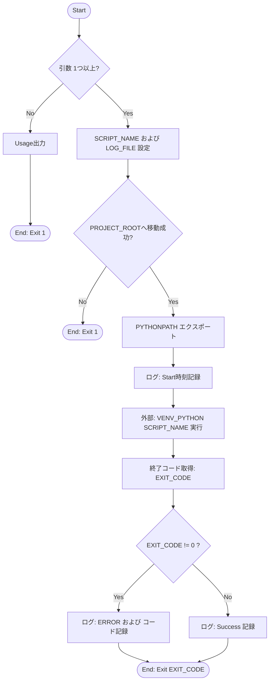
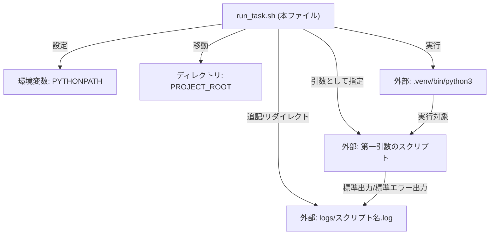

## 1. 解析メタ情報

| 項目 | 内容 |
| --- | --- |
| 対象ファイル | `run_task.sh` |
| 言語 | Bash (※指示にはPython/Reactとありましたが、提供されたファイルはシェルスクリプトです) |
| 解析対象 | 提供されたコードのみ |
| 推測・補完 | 一切なし |

## 2. ファイルの概要

* 指定されたPythonスクリプトを、所定のディレクトリ（`PROJECT_ROOT`）および仮想環境下で実行する。
* 実行時の環境変数 `PYTHONPATH` を設定し、スクリプトの実行開始・終了（成否）のタイムスタンプと標準出力・標準エラー出力をログファイルに記録する。

## 3. 外部依存関係

### インポート一覧

| 名称 | 種類 | 用途 | 根拠 |
| --- | --- | --- | --- |
| 該当なし | - | - | コード内にインポート構文が存在しないため |

### ブラックボックスとなる外部要素

| 名称 | 理由 | 根拠 |
| --- | --- | --- |
| 第一引数で指定されるスクリプト (`SCRIPT_NAME`) | 実行時に外部から動的に渡される引数であり、スクリプト内部の実装が本ファイルからは読み取れないため | [引数取得] (行番号: 19 / 抜粋: `SCRIPT_NAME=$1`) |
| 仮想環境のPythonバイナリ (`VENV_PYTHON`) | 外部バイナリであり、本ファイル内に実装がないため | [パス定義] (行番号: 10 / 抜粋: `VENV_PYTHON="${PROJECT_ROOT}...`) |

## 4. 主要要素の定義（関数 / エンドポイント / コンポーネント）

※本ファイルは関数やクラスの定義を含まない単一のシェルスクリプトであるため、スクリプト全体のメイン処理を1つの要素として定義します。

---

### メイン処理 (`run_task.sh` 全体)

* **役割**: 引数チェックを行い、作業ディレクトリの変更と環境変数の設定を行った後、指定されたスクリプトを実行して実行結果と出力をログに記録する。
* 根拠: [スクリプト全体] (行番号: 8〜44 / 抜粋: `"${VENV_PYTHON}" "${SCRIPT_NAME}"`)

* **引数/リクエスト**:
* 第一引数 (`$1`): 実行するスクリプト名（文字列）。
* 第二引数以降 (`$@`): 実行対象スクリプトにそのまま渡される任意の引数。
* 根拠: [引数処理] (行番号: 19〜20 / 抜粋: `SCRIPT_NAME=$1`, `shift`)

* **戻り値/レスポンス**:
* 正常時は実行対象スクリプトの終了コード (`0`)。
* 引数不足時、またはディレクトリ移動失敗時は `1`。
* 対象スクリプト実行異常時は対象スクリプトの終了コード (`0以外`)。
* 根拠: [終了処理] (行番号: 16, 26, 44 / 抜粋: `exit ${EXIT_CODE}`)

* **副作用**:
* カレントディレクトリが `PROJECT_ROOT` に変更される。
* 根拠: [ディレクトリ移動] (行番号: 26 / 抜粋: `cd "${PROJECT_ROOT}" || exit 1`)

* 環境変数 `PYTHONPATH` がエクスポートされる。
* 根拠: [環境変数設定] (行番号: 29 / 抜粋: `export PYTHONPATH=...`)

* `LOG_DIR` 内にスクリプト名をベースとしたログファイルが生成（または追記）される。
* 根拠: [ログ出力] (行番号: 23, 32〜41 / 抜粋: `>> "${LOG_FILE}" 2>&1`)

* **エラーハンドリング**:
* 引数が1つ未満の場合、使用方法(Usage)を標準出力に出力し、終了コード `1` で即時終了する。
* 根拠: [引数チェック] (行番号: 14〜17 / 抜粋: `if [ $# -lt 1 ]; then`)

* `PROJECT_ROOT` への `cd` コマンドが失敗した場合、終了コード `1` で即時終了する。
* 根拠: [cdコマンド] (行番号: 26 / 抜粋: `cd "${PROJECT_ROOT}" || exit 1`)

* スクリプト実行後、終了コードが `0` 以外の場合、ログファイルに `ERROR: Exit Code` のメッセージを追記する。
* 根拠: [終了コード判定] (行番号: 36〜39 / 抜粋: `if [ ${EXIT_CODE} -ne 0 ]; then`)

## 5. 処理フロー図

## 6. 依存関係図

## 7. 次のステップ（リバースエンジニアリングの提案）

| 優先度 | ファイル名(推測可) | 理由 | 根拠 |
| --- | --- | --- | --- |
| 高 | `Cron`設定ファイル または 呼び出し元のスケジューラ | このラッパースクリプトに実際にどのような引数（スクリプト名）が渡されているかを特定するため。 | [引数取得] (行番号: 19 / 抜粋: `SCRIPT_NAME=$1`) |
| 高 | 第一引数で指定される Python スクリプト群 | システムの実体となるビジネスロジックやバッチ処理の内容を把握するため。 | [スクリプト実行] (行番号: 34 / 抜粋: `"${VENV_PYTHON}" "${SCRIPT_NAME}"`) |

## 8. 保守上の注意点

* `LOG_DIR` (`/home/masahiro/develop/MY_HOME_SYSTEM/logs`) ディレクトリが存在しない場合、ログファイルへのリダイレクト (`>>`) でエラーが発生する可能性があります（事前の `mkdir` 等のディレクトリ存在確認が実装されていません）。
* `PROJECT_ROOT` および `DEVELOP_ROOT` にハードコードされた絶対パス (`/home/masahiro/develop/...`) が使用されており、実行環境（ユーザー名など）が変わると動作しません。
* 第一引数 (`$1`) に対して、パスや拡張子の検証が行われていないため、任意のコマンドや意図しないファイルが実行される可能性があります。

## 9. 不明事項一覧

| 項目 | 理由 | 必要なファイル |
| --- | --- | --- |
| 実行されるPythonスクリプトの実態と引数 | 本ファイルは汎用的なラッパーであり、具体的に何の処理が実行されるかは渡される引数に依存するため。 | 呼び出し元の設定ファイル（Cron等）および各対象Pythonスクリプト |

## 10. 自己検証結果

* [x] 推測・外部ファイルの仕様を一切含んでいない
* [x] 全関数・全クラス・全コンポーネントを列挙した (※該当なしとして全体処理を記載済)
* [x] 全てのインポート要素を列挙した (※該当なしとして記載済)
* [x] すべての仕様説明に「根拠（行番号・抜粋）」を明記した
* [x] 根拠漏れが0件である
* [x] Mermaid構文にエラーの原因となる記号（エスケープ漏れ）がない
* [x] 不明事項を漏れなく列挙した