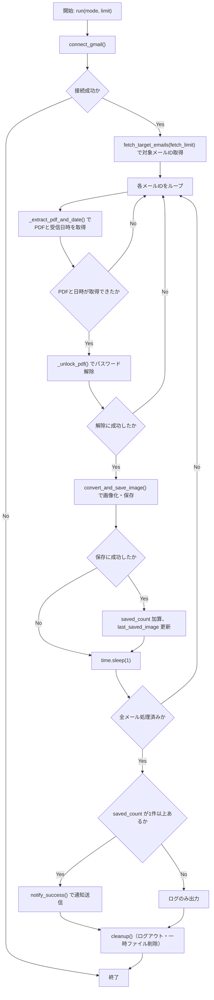

## 1. 解析メタ情報

| 項目 | 内容 |
| --- | --- |
| 対象ファイル | salary_analyzer.py |
| 言語 | Python |
| 解析対象 | 提供されたコードのみ |
| 推測・補完 | 一切なし |

## 関連ドキュメント

- [common.md](./common.md) — `setup_logging`, `get_db_cursor`, `send_push` を再エクスポートするFacadeモジュール
- [config.md](./config.md) — `BASE_DIR`, `GMAIL_USER`, `GMAIL_APP_PASSWORD`, `SALARY_MAIL_SENDER`, `SALARY_PDF_PASSWORDS`, `SALARY_IMAGE_DIR`, `LINE_USER_ID` 等の設定値を提供
- [logger.md](./logger.md) — `common.setup_logging` の実体
- [notification_service.md](./notification_service.md) — `common.send_push` の実体
- [shopping_monitor.md](./shopping_monitor.md) — 同じ`MY_HOME_SYSTEM/old/`配下でGmail(IMAP)を監視する類似構成のスクリプト（直接の依存関係はない）
- [haircut_monitor.md](./haircut_monitor.md) — 同じくGmail(IMAP)監視型のスクリプト（直接の依存関係はない）

## 2. ファイルの概要

`SalaryAnalyzer`クラスは、Gmail(IMAP)から給与明細のPDFが添付されたメールを検索・取得し、パスワード付きPDFを解除した上で1ページ目を画像化してローカルに保存するクラスである。クラスのdocstringに「AI解析は行わず、アーカイブ作成に特化」と明記されており、`notify_success`のメッセージ内でも「Gemini API制限のため、解析は行わず保存のみ完了しています」と述べられている。
根拠: [SalaryAnalyzerクラスdocstring] (行番号: 24〜28 / 抜粋: "(AI解析は行わず、アーカイブ作成に特化)")

`run`メソッドがエントリポイントであり、`mode`引数（`normal`/`history`/`test`相当。実装上は`__main__`から渡される`mode`文字列と`limit`のみで分岐）に応じて取得件数を制御し、Gmail接続後に対象メールを走査してPDF抽出・パスワード解除・画像変換・保存件数の集計・通知・後片付け（一時ファイル削除とログアウト）までを行う。
根拠: [run] (行番号: 199〜238 / 抜粋: "def run(self, mode=\"normal\", limit=None):")

画像保存先ディレクトリは`config.SALARY_IMAGE_DIR`が未設定の場合、`config.BASE_DIR`配下の`../assets/salary_images`にフォールバックする。
根拠: [IMAGE_SAVE_DIR定義] (行番号: 22 / 抜粋: "IMAGE_SAVE_DIR = getattr(config, 'SALARY_IMAGE_DIR', os.path.join(config.BASE_DIR, \"..\", \"assets\", \"salary_images\"))")

## 3. 外部依存関係

### インポート一覧

| 名称 | 種類 | 用途 | 根拠 |
| --- | --- | --- | --- |
| `os` | 標準ライブラリ | パス操作、ディレクトリ作成、一時ファイル削除 | 根拠: [import os] (行番号: 2 / 抜粋: "import os") |
| `imaplib` | 標準ライブラリ | GmailへのIMAP接続・メール検索・取得 | 根拠: [import imaplib] (行番号: 3 / 抜粋: "import imaplib") |
| `email`, `email.header.decode_header`, `email.utils` | 標準ライブラリ | 受信メールのパース、件名デコード、受信日時のタイムゾーン変換 | 根拠: [import email文] (行番号: 4〜6 / 抜粋: "import email.utils") |
| `pikepdf` | 外部ライブラリ | パスワード付きPDFのパスワード解除・保存 | 根拠: [import pikepdf] (行番号: 7 / 抜粋: "import pikepdf") |
| `time` | 標準ライブラリ | 連続アクセス負荷軽減のための待機（`time.sleep`） | 根拠: [import time] (行番号: 8 / 抜粋: "import time") |
| `argparse` | 標準ライブラリ | CLI実行時の`--mode`/`--limit`引数解析 | 根拠: [import argparse] (行番号: 9 / 抜粋: "import argparse") |
| `traceback` | 標準ライブラリ | インポートされているが本ファイル内での使用箇所なし | 根拠: [import traceback] (行番号: 10 / 抜粋: "import traceback") |
| `datetime.datetime` | 標準ライブラリ | 受信日時の変換、ファイル名用タイムスタンプ生成 | 根拠: [from datetime import datetime] (行番号: 11 / 抜粋: "from datetime import datetime") |
| `pdf2image.convert_from_path` | 外部ライブラリ | PDFの指定ページを画像（PIL Image）に変換 | 根拠: [from pdf2image import convert_from_path] (行番号: 12 / 抜粋: "from pdf2image import convert_from_path") |
| `config` | 内部モジュール | Gmail認証情報、画像保存先、対象送信者、PDFパスワード候補、`BASE_DIR`等の設定値提供 | 根拠: [import config] (行番号: 15 / 抜粋: "import config") |
| `common` | 内部モジュール | ロガー取得、通知送信の提供 | 根拠: [import common] (行番号: 16 / 抜粋: "import common") |

### ブラックボックスとなる外部要素

| 名称 | 理由 | 根拠 |
| --- | --- | --- |
| `config.BASE_DIR` | `config`モジュールの実装が提供されておらず、実際のベースパスが不明 | 根拠: [IMAGE_SAVE_DIR定義] (行番号: 22 / 抜粋: "os.path.join(config.BASE_DIR, \"..\", \"assets\", \"salary_images\")") |
| `config.GMAIL_USER`, `config.GMAIL_APP_PASSWORD` | Gmail認証情報の実値が不明 | 根拠: [connect_gmail] (行番号: 47 / 抜粋: "self.mail.login(config.GMAIL_USER, config.GMAIL_APP_PASSWORD)") |
| `config.SALARY_MAIL_SENDER` | 給与明細メールの送信者アドレスの実値が不明 | 根拠: [fetch_target_emails] (行番号: 58 / 抜粋: "sender = config.SALARY_MAIL_SENDER") |
| `config.SALARY_PDF_PASSWORDS` | PDF解除に使うパスワード候補の実値・件数が不明 | 根拠: [_unlock_pdf] (行番号: 116 / 抜粋: "passwords = config.SALARY_PDF_PASSWORDS") |
| `config.SALARY_IMAGE_DIR` | 設定時の実際の画像保存先パスが不明（未設定時のフォールバック値のみ本ファイル内で確認可能） | 根拠: [IMAGE_SAVE_DIR定義] (行番号: 22 / 抜粋: "getattr(config, 'SALARY_IMAGE_DIR', ...)") |
| `config.LINE_USER_ID` | 通知先ユーザーIDの実値が不明 | 根拠: [notify_success, _handle_error] (行番号: 172, 182 / 抜粋: "common.send_push(config.LINE_USER_ID,") |
| `common.setup_logging`, `common.send_push` | `common`モジュールの実装が提供されておらず、詳細な挙動が不明 | 根拠: [各呼び出し箇所] (行番号: 19, 172, 181 / 抜粋: "logger = common.setup_logging(\"salary_analyzer\")") |
| `pikepdf.open` のパスワード総当たり時の挙動 | 誤ったパスワード指定時に送出される例外の種類やパフォーマンス特性は`pikepdf`ライブラリの内部実装に依存し、本ファイルからは判別できない | 根拠: [_unlock_pdf] (行番号: 119〜125 / 抜粋: "with pikepdf.open(input_path, password=pwd) as pdf:") |

## 4. 主要要素の定義（関数 / エンドポイント / コンポーネント）

### `SalaryAnalyzer`

* **役割**: 給与明細PDFをメールから取得し画像化して保存するクラス本体。
* 根拠: [SalaryAnalyzer] (行番号: 24〜28 / 抜粋: "class SalaryAnalyzer:")

### `__init__`

* **役割**: IMAP接続オブジェクトの初期化と、環境（画像保存先ディレクトリ）のセットアップを行う。
* 根拠: [**init**] (行番号: 30〜32 / 抜粋: "def __init__(self):")

* **引数/リクエスト**: `None`（`self`のみ）
* 根拠: [**init**] (行番号: 30 / 抜粋: "def __init__(self):")

* **戻り値/レスポンス**: `None`
* 根拠: [**init**] (行番号: 30〜32 / 抜粋: "self.mail = None")

* **副作用**: `self.mail`の初期化、`self._setup_environment()`の呼び出し（ディレクトリ作成の可能性）
* 根拠: [**init**] (行番号: 31〜32 / 抜粋: "self._setup_environment()")

* **エラーハンドリング**: なし（呼び出し先で例外処理）

### `_setup_environment`

* **役割**: 画像保存先ディレクトリ（`IMAGE_SAVE_DIR`）が存在しない場合に作成する。
* 根拠: [_setup_environment] (行番号: 34〜41 / 抜粋: "\"\"\"ディレクトリ作成などの初期設定\"\"\"")

* **引数/リクエスト**: `None`（`self`のみ）
* 根拠: [_setup_environment] (行番号: 34 / 抜粋: "def _setup_environment(self):")

* **戻り値/レスポンス**: `None`
* 根拠: [_setup_environment] (行番号: 34〜41 / 抜粋: "if not os.path.exists(IMAGE_SAVE_DIR):")

* **副作用**: `os.makedirs`によるディレクトリ作成
* 根拠: [_setup_environment] (行番号: 38 / 抜粋: "os.makedirs(IMAGE_SAVE_DIR, exist_ok=True)")

* **エラーハンドリング**: `except OSError as e`でディレクトリ作成失敗を捕捉しエラーログを出力する（例外は再送出されない）。
* 根拠: [_setup_environment] (行番号: 40〜41 / 抜粋: "logger.error(f\"❌ フォルダ作成失敗: {e}\")")

### `connect_gmail`

* **役割**: IMAP4_SSLでGmailに接続しログイン、受信箱(`inbox`)を選択する。
* 根拠: [connect_gmail] (行番号: 43〜53 / 抜粋: "\"\"\"GmailへのIMAP接続\"\"\"")

* **引数/リクエスト**: `None`（`self`のみ）
* 根拠: [connect_gmail] (行番号: 43 / 抜粋: "def connect_gmail(self) -> bool:")

* **戻り値/レスポンス**: `bool`（接続成功時`True`、失敗時`False`）
* 根拠: [connect_gmail] (行番号: 50, 53 / 抜粋: "return True" / "return False")

* **副作用**: `self.mail`にIMAP4_SSL接続インスタンスを設定
* 根拠: [connect_gmail] (行番号: 46〜48 / 抜粋: "self.mail = imaplib.IMAP4_SSL(\"imap.gmail.com\")")

* **エラーハンドリング**: `except Exception as e`で接続例外を捕捉し`self._handle_error("Gmail接続エラー", e)`を呼び出して`False`を返す。
* 根拠: [connect_gmail] (行番号: 51〜53 / 抜粋: "self._handle_error(\"Gmail接続エラー\", e)")

### `fetch_target_emails`

* **役割**: Gmail検索構文(`X-GM-RAW`)を用いて、指定送信者からのPDF添付メールを検索し、必要に応じて最新`limit`件に絞ったメールIDリストを返す。
* 根拠: [fetch_target_emails] (行番号: 55〜77 / 抜粋: "\"\"\"対象のメールIDリストを取得\"\"\"")

* **引数/リクエスト**: `limit`（型注釈なし。デフォルト`None`。取得件数の上限）
* 根拠: [fetch_target_emails] (行番号: 55 / 抜粋: "def fetch_target_emails(self, limit=None) -> list:")

* **戻り値/レスポンス**: `list`（メールIDのリスト。未接続・未設定送信者・検索失敗時は空リスト）
* 根拠: [fetch_target_emails] (行番号: 57, 61, 68, 73〜74, 77 / 抜粋: "if not self.mail: return []")

* **副作用**: `self.mail.search`によるIMAP検索コマンド発行
* 根拠: [fetch_target_emails] (行番号: 66 / 抜粋: "status, messages = self.mail.search(None, 'X-GM-RAW', f'\"{query}\"')")

* **エラーハンドリング**: `config.SALARY_MAIL_SENDER`未設定時は警告ログを出力し空リストを返す。検索例外は`except Exception as e`で捕捉し`self._handle_error("メール検索エラー", e)`を呼び出して空リストを返す。
* 根拠: [fetch_target_emails] (行番号: 59〜61, 75〜77 / 抜粋: "self._handle_error(\"メール検索エラー\", e)")

### `_extract_pdf_and_date`

* **役割**: 指定メールIDのメールを取得し、件名デコード・受信日時変換の上、PDF添付ファイルをローカル（`temp_target.pdf`固定名）に保存する。
* 根拠: [_extract_pdf_and_date] (行番号: 79〜111 / 抜粋: "\"\"\"メールからPDFと受信日時を取得\"\"\"")

* **引数/リクエスト**: `email_id`（型注釈なし。IMAPメールID）
* 根拠: [_extract_pdf_and_date] (行番号: 79 / 抜粋: "def _extract_pdf_and_date(self, email_id):")

* **戻り値/レスポンス**: `Tuple[Optional[str], Optional[datetime]]`（PDF保存パスと受信日時。添付なし・失敗時は`(None, None)`）
* 根拠: [_extract_pdf_and_date] (行番号: 106, 108, 111 / 抜粋: "return save_path, local_date" / "return None, None")

* **副作用**: `IMAGE_SAVE_DIR`配下への`temp_target.pdf`の書き込み（既存ファイルを上書き）
* 根拠: [_extract_pdf_and_date] (行番号: 103〜105 / 抜粋: "with open(save_path, \"wb\") as f:")

* **エラーハンドリング**: `except Exception as e`で例外を捕捉し警告ログ（メールID付き）を出力し`(None, None)`を返す。
* 根拠: [_extract_pdf_and_date] (行番号: 109〜111 / 抜粋: "logger.warning(f\"PDF抽出失敗 (ID: {email_id}): {e}\")")

### `_unlock_pdf`

* **役割**: `config.SALARY_PDF_PASSWORDS`に登録された候補パスワードを順に試行し、PDFのパスワードを解除して別ファイルに保存する。
* 根拠: [_unlock_pdf] (行番号: 113〜128 / 抜粋: "\"\"\"PDFのパスワード解除\"\"\"")

* **引数/リクエスト**: `input_path`（型注釈なし。パスワード付きPDFのパス）
* 根拠: [_unlock_pdf] (行番号: 113 / 抜粋: "def _unlock_pdf(self, input_path) -> str:")

* **戻り値/レスポンス**: `str`（解除後PDFのパス。全パスワード失敗時は`None`）
* 根拠: [_unlock_pdf] (行番号: 124, 128 / 抜粋: "return output_path" / "return None")

* **副作用**: `input_path`から`_unlocked.pdf`へのファイル書き込み
* 根拠: [_unlock_pdf] (行番号: 115, 121〜122 / 抜粋: "output_path = input_path.replace(\".pdf\", \"_unlocked.pdf\")")

* **エラーハンドリング**: 各パスワード試行での例外を`except:`（無条件except）で握りつぶし次候補を試行する。全滅時はエラーログを出力し`None`を返す。
* 根拠: [_unlock_pdf] (行番号: 125〜127 / 抜粋: "except: continue")

### `convert_and_save_image`

* **役割**: 解除済みPDFの1ページ目のみを画像変換し、日時ベースのファイル名（`salary_YYYYMMDD_HHMMSS.jpg`）でJPEG保存する。既に同名ファイルが存在する場合は変換をスキップして既存パスを返す。
* 根拠: [convert_and_save_image] (行番号: 130〜153 / 抜粋: "\"\"\"PDFを画像に変換して保存\"\"\"")

* **引数/リクエスト**: `pdf_path`（型注釈なし。解除済みPDFのパス）, `date_obj`（型注釈なし。ファイル名生成に使う日時）
* 根拠: [convert_and_save_image] (行番号: 130 / 抜粋: "def convert_and_save_image(self, pdf_path, date_obj) -> str:")

* **戻り値/レスポンス**: `str`（保存済み画像のパス。変換対象なし・失敗時は`None`）
* 根拠: [convert_and_save_image] (行番号: 135, 144, 149, 153 / 抜粋: "if not images: return None")

* **副作用**: `convert_from_path`によるPDF→画像変換処理（外部ツールPopplerに依存する可能性がある`pdf2image`ライブラリの内部処理）、`IMAGE_SAVE_DIR`配下へのJPEGファイル書き込み
* 根拠: [convert_and_save_image] (行番号: 134, 147 / 抜粋: "images = convert_from_path(pdf_path, first_page=1, last_page=1)")

* **エラーハンドリング**: `except Exception as e`で変換・保存エラーを捕捉し`self._handle_error("画像変換エラー", e)`を呼び出して`None`を返す。
* 根拠: [convert_and_save_image] (行番号: 151〜153 / 抜粋: "self._handle_error(\"画像変換エラー\", e)")

### `notify_success`

* **役割**: 保存件数が1件以上の場合に、保存完了メッセージと最後に保存した画像を添付してDiscordへ通知する。
* 根拠: [notify_success] (行番号: 155〜175 / 抜粋: "\"\"\"保存完了通知\"\"\"")

* **引数/リクエスト**: `saved_count`（型注釈なし。保存件数）, `last_image_path`（型注釈なし。最後に保存した画像のパス）
* 根拠: [notify_success] (行番号: 155 / 抜粋: "def notify_success(self, saved_count, last_image_path):")

* **戻り値/レスポンス**: `None`（`saved_count`が0の場合は早期`return`）
* 根拠: [notify_success] (行番号: 157 / 抜粋: "if saved_count == 0: return")

* **副作用**: 画像ファイルの読み込み、`common.send_push`によるDiscordの`report`チャンネルへの画像付き通知送信
* 根拠: [notify_success] (行番号: 168〜173 / 抜粋: "common.send_push(config.LINE_USER_ID, [{\"type\": \"text\", \"text\": msg}], image_data=image_data, target=\"discord\", channel=\"report\")")

* **エラーハンドリング**: `except Exception as e`で通知送信エラーを捕捉し`self._handle_error("通知送信エラー", e)`を呼び出す。
* 根拠: [notify_success] (行番号: 174〜175 / 抜粋: "self._handle_error(\"通知送信エラー\", e)")

### `_handle_error`

* **役割**: エラーメッセージをログ出力し、Discordのエラーチャンネルへ通知する共通エラーハンドリング処理。
* 根拠: [_handle_error] (行番号: 177〜186 / 抜粋: "def _handle_error(self, context, error):")

* **引数/リクエスト**: `context`（型注釈なし。エラー発生箇所の説明）, `error`（型注釈なし。発生した例外オブジェクト）
* 根拠: [_handle_error] (行番号: 177 / 抜粋: "def _handle_error(self, context, error):")

* **戻り値/レスポンス**: `None`
* 根拠: [_handle_error] (行番号: 177〜186 / 抜粋: "err_msg = f\"{context}: {str(error)}\"")

* **副作用**: `logger.error`によるログ出力、`common.send_push`によるDiscordの`error`チャンネルへの通知送信
* 根拠: [_handle_error] (行番号: 181〜186 / 抜粋: "common.send_push(\n            config.LINE_USER_ID, ")

* **エラーハンドリング**: なし（`common.send_push`自体の例外はこの関数内では捕捉しない）

### `cleanup`

* **役割**: IMAPセッションのログアウトと、一時PDFファイル（`temp_target.pdf`, `temp_target_unlocked.pdf`）の削除を行う。
* 根拠: [cleanup] (行番号: 188〜197 / 抜粋: "\"\"\"一時ファイルの削除とログアウト\"\"\"")

* **引数/リクエスト**: `None`（`self`のみ）
* 根拠: [cleanup] (行番号: 188 / 抜粋: "def cleanup(self):")

* **戻り値/レスポンス**: `None`
* 根拠: [cleanup] (行番号: 188〜197 / 抜粋: "if self.mail:")

* **副作用**: `self.mail.logout()`の呼び出し、`IMAGE_SAVE_DIR`配下の一時ファイル削除（`os.remove`）
* 根拠: [cleanup] (行番号: 190〜197 / 抜粋: "if os.path.exists(p): os.remove(p)")

* **エラーハンドリング**: ログアウト処理・削除処理をそれぞれ`except: pass`（無条件except）で握りつぶす。
* 根拠: [cleanup] (行番号: 191〜192, 197 / 抜粋: "except: pass")

### `run`

* **役割**: 処理全体のエントリポイント。Gmail接続後、モードに応じた件数上限でメールを取得し、各メールについてPDF抽出・パスワード解除・画像変換・保存を行い、最後に通知と後片付けを実行する。
* 根拠: [run] (行番号: 199〜238 / 抜粋: "def run(self, mode=\"normal\", limit=None):")

* **引数/リクエスト**: `mode` (`str`。デフォルト`"normal"`), `limit`（型注釈なし。デフォルト`None`）
* 根拠: [run] (行番号: 199 / 抜粋: "def run(self, mode=\"normal\", limit=None):")

* **戻り値/レスポンス**: `None`（`connect_gmail`失敗時は早期`return`）
* 根拠: [run] (行番号: 201 / 抜粋: "if not self.connect_gmail(): return")

* **副作用**: `fetch_target_emails`, `_extract_pdf_and_date`, `_unlock_pdf`, `convert_and_save_image`の呼び出し連鎖、メール1件処理ごとの`time.sleep(1)`、`notify_success`による通知、`cleanup`による後片付け
* 根拠: [run] (行番号: 204, 213〜227, 234, 238 / 抜粋: "time.sleep(1)")

* **エラーハンドリング**: メール1件ごとの処理を`try/except Exception as e`で個別に捕捉しエラーログを出力する（1件の失敗が他メールの処理を止めない）。`run`自体には`finally`はなく、末尾で明示的に`self.cleanup()`を呼び出す構成。
* 根拠: [run] (行番号: 229〜230, 238 / 抜粋: "logger.error(f\"メール処理エラー (ID: {email_id}): {e}\")")

## 5. 処理フロー図

## 6. 依存関係図

```mermaid
graph TD
    SalaryAnalyzerPY["salary_analyzer.py"]

    subgraph Python_Standard_Libraries
        OS["os"]
        Imaplib["imaplib"]
        Email["email / email.header / email.utils"]
        Time["time"]
        Argparse["argparse"]
        Traceback["traceback（未使用）"]
        Datetime["datetime"]
    end

    subgraph External_Libraries
        Pikepdf["pikepdf"]
        Pdf2Image["pdf2image"]
    end

    subgraph Project_Internal
        Common["common.py"]
        Config["config.py"]
    end

    subgraph External_Services
        Gmail["Gmail (IMAP)"]
        NotifyTarget["Discord（common.send_push経由）"]
    end

    subgraph Local_Storage
        ImageDir["IMAGE_SAVE_DIR（PDF一時ファイル・画像保存先）"]
    end

    SalaryAnalyzerPY --> OS
    SalaryAnalyzerPY --> Imaplib
    SalaryAnalyzerPY --> Email
    SalaryAnalyzerPY --> Time
    SalaryAnalyzerPY --> Argparse
    SalaryAnalyzerPY --> Traceback
    SalaryAnalyzerPY --> Datetime
    SalaryAnalyzerPY --> Pikepdf
    SalaryAnalyzerPY --> Pdf2Image
    SalaryAnalyzerPY --> Common
    SalaryAnalyzerPY --> Config

    SalaryAnalyzerPY -->|IMAP接続/検索/取得| Gmail
    SalaryAnalyzerPY -->|send_push経由| NotifyTarget
    SalaryAnalyzerPY -->|ファイル読み書き| ImageDir
```

## 7. 次のステップ（リバースエンジニアリングの提案）

| 優先度 | ファイル名(推測可) | 理由 | 根拠 |
| --- | --- | --- | --- |
| 高 | `config.py` | `SALARY_MAIL_SENDER`, `SALARY_PDF_PASSWORDS`, `SALARY_IMAGE_DIR`, `BASE_DIR`, Gmail認証情報の実値を確認するため。（本リポジトリでは`config.md`として既に解析済み） | 根拠: [config参照箇所] (行番号: 22, 47, 58, 116 / 抜粋: "config.SALARY_MAIL_SENDER") |
| 高 | `common.py` | `setup_logging`, `send_push`（`image_data`引数の扱いを含む）の実装を確認するため。（本リポジトリでは`common.md`として既に解析済み） | 根拠: [common参照箇所] (行番号: 19, 172, 181 / 抜粋: "common.send_push(config.LINE_USER_ID, [{\"type\": \"text\", \"text\": msg}], image_data=image_data,") |
| 中 | 実行環境のPoppler依存有無 | `pdf2image.convert_from_path`は外部コマンド`poppler-utils`（`pdftoppm`等）に依存することが一般的であり、実行環境にインストールされているかは本ファイル単体では確認できない。 | 根拠: [convert_and_save_image] (行番号: 134 / 抜粋: "images = convert_from_path(pdf_path, first_page=1, last_page=1)") |

## 8. 保守上の注意点

* **未使用インポート**: `traceback`がインポートされているが、本ファイル内で`traceback.format_exc()`等の使用箇所が確認できない。
  * 根拠: [import文] (行番号: 10 / 抜粋: "import traceback")
* **一時ファイル名の固定によるレース条件**: PDFの一時保存先が`temp_target.pdf`固定名であり、`run`が複数メールをループ処理する際、前のメールの一時ファイルが次の処理まで残る/上書きされる前提の設計になっている。並行実行された場合はファイルの競合が起きうる。
  * 根拠: [_extract_pdf_and_date] (行番号: 103 / 抜粋: "save_path = os.path.join(IMAGE_SAVE_DIR, \"temp_target.pdf\")")
* **無条件exceptの使用**: `_unlock_pdf`のパスワード試行ループおよび`cleanup`のログアウト・ファイル削除処理で`except:`（例外種別を指定しない`except`）が使われており、`KeyboardInterrupt`等も含めて握りつぶされる可能性がある。
  * 根拠: [_unlock_pdf, cleanup] (行番号: 125, 191, 197 / 抜粋: "except: continue")
* **CLIの`--mode test`と`run`引数の対応関係が分かりにくい**: `argparse`の`choices=["normal", "history", "test"]`のうち、`test`モードは内部的に`run(mode="normal", limit=1)`として扱われ、`run`メソッド自身は`mode`引数の値として`"normal"`と`"history"`のみを判定する（`"test"`という文字列が`run`内部に渡ることはない）。
  * 根拠: [__main__ブロック] (行番号: 246〜249 / 抜粋: "if args.mode == \"test\": saver.run(mode=\"normal\", limit=1)")
* **通知エラーがさらなる通知を試みる構造**: `notify_success`の`except`節は`self._handle_error("通知送信エラー", e)`を呼び出すが、`_handle_error`自体も内部で`common.send_push`を呼び出しており、通知失敗の原因（ネットワーク障害等）が継続している場合は二重に送信を試みることになる（`_handle_error`側の例外は捕捉されない）。
  * 根拠: [notify_success, _handle_error] (行番号: 174〜175, 181〜186 / 抜粋: "self._handle_error(\"通知送信エラー\", e)")

## 9. 不明事項一覧

| 項目 | 理由 | 必要なファイル |
| --- | --- | --- |
| `config.SALARY_MAIL_SENDER`の実際の値 | 給与明細メールの送信者アドレスが本ファイル内で定義されていないため。 | `config.py` |
| `config.SALARY_PDF_PASSWORDS`の実際の値・件数 | PDF解除に使うパスワード候補が本ファイル内で定義されていないため。 | `config.py` |
| `config.BASE_DIR` / `config.SALARY_IMAGE_DIR`の実際のパス | 画像保存先の実パスが本ファイル内では確定できないため。 | `config.py` |
| `common.send_push`の`image_data`引数の仕様 | バイナリ画像データを渡した際の実際の送信方式（Discord添付ファイルAPI等）が本ファイル内では確認できないため。 | `common.py`, `services/notification_service.py` |
| 実行環境でのPoppler（`pdf2image`の依存ツール）の有無 | `convert_from_path`が内部的に外部コマンドへ依存しているかどうかは本ファイル単体では判別できないため。 | 実行環境のセットアップ手順、`requirements.txt`等 |

## 10. 自己検証結果

* [x] 推測・外部ファイルの仕様を一切含んでいない
* [x] 全関数・全クラス・全コンポーネントを列挙した
* [x] 全てのインポート要素を列挙した
* [x] すべての仕様説明に「根拠（行番号・抜粋）」を明記した
* [x] 根拠漏れが0件である
* [x] Mermaid構文にエラーの原因となる記号（エスケープ漏れ）がない
* [x] 不明事項を漏れなく列挙した
