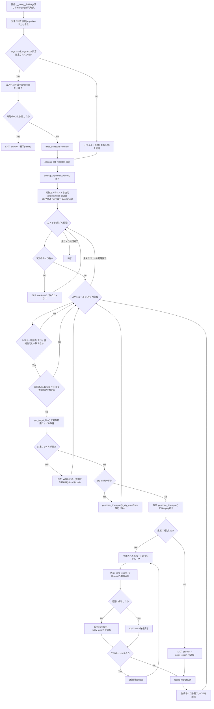

## 1. 解析メタ情報

| 項目 | 内容 |
| --- | --- |
| 対象ファイル | scheduled_timelapse.py |
| 言語 | Python |
| 解析対象 | 提供されたコードのみ |
| 推測・補完 | 一切なし |

## 関連ドキュメント

* [logger.md](./logger.md) - `setup_logging`を提供する`core/logger.py`。本ファイルのロガー初期化元
* [notification_service.md](./notification_service.md) - `send_push`を提供し、生成したタイムラプス動画やエラーの通知送信を担う内部モジュール
* [config.md](./config.md) - `NVR_RECORD_DIR`・`TIMELAPSE_CAMERAS`・`TIMELAPSE_SCHEDULES`・`TIMELAPSE_FPS`等の設定値、および`LINE_USER_ID`を提供する内部モジュール
* [timelapse_generator.md](./timelapse_generator.md) / [smart_timelapse_generator.md](./smart_timelapse_generator.md) / [daily_timelapse_job.md](./daily_timelapse_job.md) / [timelapse_runner.md](./timelapse_runner.md) - ファイル名・機能(タイムラプス生成)が類似する同ディレクトリ系統の他モジュール。本ファイルとの役割分担(重複実装か、別スケジュールでの実行か)を確認する価値がある

## 2. ファイルの概要

監視カメラの録画ファイル(10分単位のMP4)から、指定した時間帯(朝・夕方など)のタイムラプス動画をFFmpegで生成し、Discord等へ通知送信するスクリプト。実行時にプロジェクトルートを`sys.path`へ追加してから`core.logger`・`services.notification_service`・`config`をインポートする(根拠: `[パス解決とインポート]` (行番号: 10〜17 / 抜粋: "PROJECT_ROOT = os.path.dirname(os.path.dirname(os.path.abspath(__file__)))\nif PROJECT_ROOT not in sys.path:"))。監視対象カメラ(`TARGET_CAMERAS`)・抽出時間帯とトリガー時刻(`SCHEDULES`)・FFmpegパラメータは`config`モジュールの属性を`getattr`で参照し、値が無ければハードコードされたデフォルト値にフォールバックする(根拠: `[getattr(config, ...)]` (行番号: 26〜47 / 抜粋: "TARGET_BASE_DIR = getattr(config, \"NVR_RECORD_DIR\", \"/mnt/nas/home_system/nvr_recordings\")"))。`main`関数は、対象日付・スケジュール・カメラをコマンドライン引数(`argparse`)から決定し、古いレコード/動画ファイルのクリーンアップ後、対象カメラ×スケジュールの組み合わせごとにトリガー時刻内かどうかを判定し、該当すれば対象動画ファイルを収集して`generate_timelapse`でFFmpeg処理を行い、生成された動画パートを`send_push`でDiscordへ送信、送信後にファイルを削除する(根拠: `[mainのループ処理]` (行番号: 188〜272 / 抜粋: "for camera_name in target_camera_keys:"))。`if __name__ == \"__main__\":`ブロックで`argparse.ArgumentParser`を構築し、`--force`/`--date`/`--start`/`--end`/`--cameras`/`--dry-run`の各オプションを受け付けて`main(args)`を呼び出す(根拠: `[argparse定義]` (行番号: 275〜287 / 抜粋: "parser.add_argument(\"--force\", type=str, help=\"指定したスケジュール名(morning/evening等)を強制実行\")"))。

## 3. 外部依存関係

### インポート一覧

| 名称 | 種類 | 用途 | 根拠 |
| --- | --- | --- | --- |
| `os` | 標準ライブラリ | パス組み立て・ディレクトリ作成・ファイル存在確認・サイズ取得・削除 | 根拠: `[import os]` (行番号: 1 / 抜粋: "import os") |
| `sys` | 標準ライブラリ | `sys.path`へのプロジェクトルート追加 | 根拠: `[import sys]` (行番号: 2 / 抜粋: "import sys") |
| `glob` | 標準ライブラリ | パターンマッチによる録画ファイル・古いレコードファイル・残留動画ファイルの検索 | 根拠: `[import glob]` (行番号: 3 / 抜粋: "import glob") |
| `subprocess` | 標準ライブラリ | FFmpegコマンドの外部プロセス実行 | 根拠: `[import subprocess]` (行番号: 4 / 抜粋: "import subprocess") |
| `argparse` | 標準ライブラリ | コマンドライン引数(`--force`等)のパース | 根拠: `[import argparse]` (行番号: 5 / 抜粋: "import argparse") |
| `time`(`time_module`) | 標準ライブラリ | 現在時刻(エポック秒)取得(ファイルの古さ判定)、レートリミット回避のための`sleep` | 根拠: `[import time as time_module]` (行番号: 6 / 抜粋: "import time as time_module") |
| `datetime`, `time` | 標準ライブラリ(`datetime`モジュール) | 現在日時取得、時刻範囲の比較・表現 | 根拠: `[from datetime import datetime, time]` (行番号: 7 / 抜粋: "from datetime import datetime, time") |
| `Path` | 標準ライブラリ(`pathlib`) | 実行済みマーカーファイル(`.done`)の作成(`touch`) | 根拠: `[from pathlib import Path]` (行番号: 8 / 抜粋: "from pathlib import Path") |
| `setup_logging` | 内部モジュール(`core.logger`) | 本モジュール用ロガー(`scheduled_timelapse`)の初期化 | 根拠: `[from core.logger import setup_logging]` (行番号: 15 / 抜粋: "from core.logger import setup_logging") |
| `send_push` | 内部モジュール(`services.notification_service`) | 生成したタイムラプス動画・エラーメッセージのDiscord/LINEへの送信 | 根拠: `[from services.notification_service import send_push]` (行番号: 16 / 抜粋: "from services.notification_service import send_push") |
| `config` | 内部モジュール | カメラ・スケジュール・FFmpegパラメータ・LINE_USER_IDの設定値取得(`getattr`によるフォールバック付き) | 根拠: `[import config]` (行番号: 17 / 抜粋: "import config") |

### ブラックボックスとなる外部要素

| 名称 | 理由 | 根拠 |
| --- | --- | --- |
| `config.NVR_RECORD_DIR` / `config.TIMELAPSE_CAMERAS` / `config.TIMELAPSE_SCHEDULES` / `config.TIMELAPSE_FPS` / `config.TIMELAPSE_BITRATE` / `config.TIMELAPSE_MAXRATE` / `config.TIMELAPSE_SEGMENT_TIME` / `config.LINE_USER_ID` | `config`モジュールの実装が提供されておらず、これらの属性が実際に設定されているか、どのような値かは不明であるため(`getattr`のデフォルト値のみ本ファイルから判明)。 | 根拠: `[getattr(config, ...)]` (行番号: 26〜47, 152, 231 / 抜粋: "TARGET_BASE_DIR = getattr(config, \"NVR_RECORD_DIR\", \"/mnt/nas/home_system/nvr_recordings\")") |
| `ffmpeg`外部バイナリ(`subprocess.run`経由) | `ffmpeg`コマンド自体の実装・バージョン・利用可能なフィルタ(`setpts`, `scale`等)は本ファイルの解析範囲外であり、システム環境に依存するため。 | 根拠: `[ffmpegコマンド構築]` (行番号: 110〜119 / 抜粋: "\"ffmpeg\", \"-y\", \"-f\", \"concat\", \"-safe\", \"0\", \"-i\", list_file_path,") |
| `send_push`の内部実装(Discord/LINE送信の詳細挙動) | `services.notification_service`の実装が提供されておらず、成功/失敗の判定基準や送信先の詳細は不明であるため。 | 根拠: `[send_push呼び出し]` (行番号: 153, 244 / 抜粋: "push_success = send_push(line_user_id, [message], image_data=video_data, target=\"discord\", channel=\"notify\", filename=part_filename)") |

## 4. 主要要素の定義（関数 / エンドポイント / コンポーネント）

### `cleanup_old_records`

* **役割**: `RECORD_DIR`配下にある指定日数以上古い`.done`ファイル(実行済みマーカー)を削除する。
* 根拠: `[cleanup_old_records]` (行番号: 49〜59 / 抜粋: "def cleanup_old_records(days: int = 7):\n    \"\"\"指定日数以上古い .done ファイルを削除する\"\"\"")

* **引数/リクエスト**: `days` (`int`、デフォルト`7`。この日数より古いファイルを削除対象とする)
* 根拠: `[関数シグネチャ]` (行番号: 49 / 抜粋: "def cleanup_old_records(days: int = 7):")

* **戻り値/レスポンス**: なし(戻り値は使用されていない)
* 根拠: `[関数本体]` (行番号: 49〜59 / 抜粋: "def cleanup_old_records(days: int = 7):")

* **副作用**: `os.remove`によるファイル削除、ログ出力(削除成功/失敗)。
* 根拠: `[os.remove]` (行番号: 56〜59 / 抜粋: "os.remove(f)\n                    logger.info(f\"古い記録ファイルを削除しました: {os.path.basename(f)}\")")

* **エラーハンドリング**: `os.remove`失敗時に`Exception`を捕捉し`logger.error`でログ出力するのみ(処理は継続、他ファイルの削除は止めない)。
* 根拠: `[except Exception]` (行番号: 58〜59 / 抜粋: "except Exception as e:\n                    logger.error(f\"ファイル削除エラー ({f}): {e}\")")

### `cleanup_orphaned_videos`

* **役割**: 異常終了時などに残留した一時タイムラプス動画ファイル(`data/timelapse_*.mp4`)のうち、指定日数以上古いものを削除する(ガベージコレクション)。
* 根拠: `[cleanup_orphaned_videos]` (行番号: 61〜71 / 抜粋: "def cleanup_orphaned_videos(days: int = 1):\n    \"\"\"異常終了時などに残留した一時動画ファイルを削除する(ガベージコレクション)\"\"\"")

* **引数/リクエスト**: `days` (`int`、デフォルト`1`。この日数より古いファイルを削除対象とする)
* 根拠: `[関数シグネチャ]` (行番号: 61 / 抜粋: "def cleanup_orphaned_videos(days: int = 1):")

* **戻り値/レスポンス**: なし
* 根拠: `[関数本体]` (行番号: 61〜71 / 抜粋: "def cleanup_orphaned_videos(days: int = 1):")

* **副作用**: `os.remove`によるファイル削除、ログ出力。
* 根拠: `[os.remove]` (行番号: 68〜69 / 抜粋: "os.remove(f)\n                    logger.info(f\"残留していた古い動画ファイルを削除しました: {os.path.basename(f)}\")")

* **エラーハンドリング**: `os.remove`失敗時に`Exception`を捕捉し`logger.error`でログ出力するのみ。
* 根拠: `[except Exception]` (行番号: 70〜71 / 抜粋: "except Exception as e:\n                    logger.error(f\"動画ファイル削除エラー ({f}): {e}\")")

### `get_target_files`

* **役割**: 指定ディレクトリ・日付・時刻範囲に含まれる10分単位のMP4ファイルを収集して返す。ファイル名(`YYYYMMDD_HHMMSS.mp4`)から時刻を抽出し、`start_time`〜`end_time`の範囲内かを判定する。
* 根拠: `[get_target_files]` (行番号: 73〜92 / 抜粋: "def get_target_files(target_dir: str, target_date: str, start_time: time, end_time: time) -> list:")

* **引数/リクエスト**: `target_dir` (`str`、検索対象ディレクトリ)、`target_date` (`str`、対象日付文字列`YYYYMMDD`)、`start_time`/`end_time` (`time`、抽出対象の時刻範囲)
* 根拠: `[関数シグネチャ]` (行番号: 73 / 抜粋: "def get_target_files(target_dir: str, target_date: str, start_time: time, end_time: time) -> list:")

* **戻り値/レスポンス**: `list`(条件に合致するファイルパスのリスト。`sorted(glob.glob(...))`の順)
* 根拠: `[戻り値]` (行番号: 75, 87, 92 / 抜粋: "return files")

* **副作用**: なし(ファイル検索・読み取りのみ)
* 根拠: `[関数本体]` (行番号: 73〜92 / 抜粋: "def get_target_files(target_dir: str, target_date: str, start_time: time, end_time: time) -> list:")

* **エラーハンドリング**: ファイル名のパース(`filename.split('_')[1].split('.')[0]`等)に失敗した場合は`Exception`を捕捉して`logger.warning`を出力し、そのファイルを`continue`でスキップする。
* 根拠: `[except Exception]` (行番号: 88〜90 / 抜粋: "except Exception as e:\n            logger.warning(f\"ファイル名のパースに失敗しました ({filename}): {e}\")\n            continue")

### `generate_timelapse`

* **役割**: 対象ファイルリストから`concat`用のファイルリストを作成し、FFmpegを実行してタイムラプス動画を生成する。FFmpegは`segment`出力により複数パートに分割される。`is_dry_run=True`の場合は実際のFFmpeg実行をスキップしダミー結果を返す。
* 根拠: `[generate_timelapse]` (行番号: 94〜147 / 抜粋: "def generate_timelapse(file_list: list, output_base_path: str, is_dry_run: bool = False) -> list:")

* **引数/リクエスト**: `file_list` (`list`、結合対象の動画ファイルパスリスト)、`output_base_path` (`str`、出力先ベースパス)、`is_dry_run` (`bool`、デフォルト`False`。`True`でFFmpeg実行をスキップ)
* 根拠: `[関数シグネチャ]` (行番号: 94 / 抜粋: "def generate_timelapse(file_list: list, output_base_path: str, is_dry_run: bool = False) -> list:")

* **戻り値/レスポンス**: `list`(生成された分割動画ファイルパスのリスト。`file_list`が空、FFmpeg失敗、タイムアウト、例外発生時は`[]`。DRY-RUN時は`[\"dry_run_dummy.mp4\"]`)
* 根拠: `[戻り値]` (行番号: 96〜97, 125, 130〜134, 137, 141, 144 / 抜粋: "return [\"dry_run_dummy.mp4\"]")

* **副作用**: `concat_list.txt`ファイルの書き込み・削除(`finally`節)、`subprocess.run`によるFFmpegプロセスの起動(タイムアウト1800秒)、ログ出力。
* 根拠: `[subprocess.run, finally節]` (行番号: 128, 145〜147 / 抜粋: "res = subprocess.run(cmd, stdout=subprocess.PIPE, stderr=subprocess.PIPE, timeout=1800)")

* **エラーハンドリング**: `subprocess.TimeoutExpired`を個別に捕捉してエラーログを出力し`[]`を返す。それ以外の`Exception`も包括的に捕捉してエラーログを出力し`[]`を返す。FFmpegの終了コードが0以外の場合も`stderr`をデコードしてエラーログに出力し`[]`を返す。`finally`節で`concat_list.txt`を確実に削除する。
* 根拠: `[except節群]` (行番号: 135〜147 / 抜粋: "except subprocess.TimeoutExpired as e:\n        logger.error(f\"FFmpeg処理がタイムアウト(1800秒)しました: {e}\")\n        return []")

### `notify_error`

* **役割**: エラーメッセージを`send_push`経由でDiscordのエラーチャンネルへ通知する。
* 根拠: `[notify_error]` (行番号: 149〜155 / 抜粋: "def notify_error(message: str):\n    \"\"\"エラーチャンネルへの通知\"\"\"")

* **引数/リクエスト**: `message` (`str`、通知するエラーメッセージ)
* 根拠: `[関数シグネチャ]` (行番号: 149 / 抜粋: "def notify_error(message: str):")

* **戻り値/レスポンス**: なし
* 根拠: `[関数本体]` (行番号: 149〜155 / 抜粋: "def notify_error(message: str):")

* **副作用**: `send_push`呼び出しによる外部通知送信(`target=\"discord\", channel=\"error\"`)。
* 根拠: `[send_push呼び出し]` (行番号: 153 / 抜粋: "send_push(line_user_id, [message], target=\"discord\", channel=\"error\")")

* **エラーハンドリング**: `Exception`を捕捉して`logger.error`でログ出力するのみ(呼び出し元へは伝播しない)。
* 根拠: `[except Exception]` (行番号: 154〜155 / 抜粋: "except Exception as e:\n        logger.error(f\"エラー通知送信に失敗: {e}\")")

### `main`

* **役割**: コマンドライン引数に基づき対象日付・スケジュール・カメラを決定し、クリーンアップ処理を行った上で、カメラ×スケジュールの組み合わせごとにトリガー時刻を判定してタイムラプス動画を生成、生成された動画パートをDiscordへ送信し、実行済みマーカー(`.done`)を作成、生成動画を削除する一連の処理を統括する。
* 根拠: `[main]` (行番号: 157〜272 / 抜粋: "def main(args):")

* **引数/リクエスト**: `args` (`argparse.Namespace`。`date`, `force`, `start`, `end`, `cameras`, `dry_run`の各属性を持つ)
* 根拠: `[関数シグネチャ]` (行番号: 157 / 抜粋: "def main(args):")

* **戻り値/レスポンス**: なし(カスタム時刻フォーマットエラー時は早期`return`)
* 根拠: `[早期return]` (行番号: 176〜178 / 抜粋: "logger.error(f\"カスタム時刻のフォーマットエラー (HHMM形式で指定してください): {e}\")\n            return")

* **副作用**: `cleanup_old_records`・`cleanup_orphaned_videos`の呼び出し、`get_target_files`・`generate_timelapse`の呼び出し(FFmpeg実行・ファイル生成)、`send_push`による動画送信、`notify_error`によるエラー通知、`Path(record_file).touch()`によるマーカーファイル作成、生成動画ファイルの削除(`os.remove`)、`time_module.sleep(5)`によるレートリミット回避待機、多数のログ出力。
* 根拠: `[副作用一式]` (行番号: 181〜182, 210〜211, 227, 244, 250, 254, 257〜258, 266, 270〜272 / 抜粋: "generated_files = generate_timelapse(target_files, output_path)")

* **エラーハンドリング**: `--start`/`--end`のカスタム時刻パース失敗時は`Exception`を捕捉してエラーログを出し早期`return`する。動画送信処理中の`Exception`は捕捉して`logger.error`でログ出力し、`notify_error`でシステムエラーとして通知する。FFmpeg生成失敗時(`generated_files`が空)もログ出力と`notify_error`呼び出しを行う。
* 根拠: `[except節群]` (行番号: 176〜178, 252〜254, 260〜262 / 抜粋: "except Exception as e:\n                            logger.error(f\"通知送信処理中に例外発生 ({part_filename}): {e}\")\n                            notify_error(...)")

## 5. 処理フロー図

## 6. 依存関係図

```mermaid
graph TD
    ScheduledTimelapsePY["monitors/scheduled_timelapse.py"]

    subgraph Python_Standard_Libraries
        OS["os"]
        Sys["sys"]
        Glob["glob"]
        Subprocess["subprocess"]
        Argparse["argparse"]
        TimeModule["time (time_module)"]
        Datetime["datetime / time"]
        Pathlib["pathlib.Path"]
    end

    subgraph Project_Internal
        Logger["core/logger.py (setup_logging)"]
        NotificationService["services/notification_service.py (send_push)"]
        Config["config.py"]
    end

    subgraph External_Binaries
        FFmpeg["ffmpeg (subprocess経由)"]
        Nice["nice (subprocess経由)"]
    end

    subgraph External_Services
        DiscordAPI["Discord (send_push経由)"]
    end

    subgraph Filesystem
        NVRRecordings["NVR録画ファイル (config.NVR_RECORD_DIR配下)"]
        RecordDir["data/timelapse_records/*.done"]
        DataDir["data/timelapse_*.mp4, concat_list.txt"]
    end

    ScheduledTimelapsePY --> OS
    ScheduledTimelapsePY --> Sys
    ScheduledTimelapsePY --> Glob
    ScheduledTimelapsePY --> Subprocess
    ScheduledTimelapsePY --> Argparse
    ScheduledTimelapsePY --> TimeModule
    ScheduledTimelapsePY --> Datetime
    ScheduledTimelapsePY --> Pathlib
    ScheduledTimelapsePY --> Logger
    ScheduledTimelapsePY --> NotificationService
    ScheduledTimelapsePY --> Config

    Subprocess --> FFmpeg
    Subprocess --> Nice
    NotificationService -->|"POST"| DiscordAPI

    ScheduledTimelapsePY -->|"読み取り"| NVRRecordings
    ScheduledTimelapsePY -->|"読み書き"| RecordDir
    ScheduledTimelapsePY -->|"読み書き・削除"| DataDir
```

## 7. 次のステップ（リバースエンジニアリングの提案）

| 優先度 | ファイル名(推測可) | 理由 | 根拠 |
| --- | --- | --- | --- |
| 高 | `config.py` | `NVR_RECORD_DIR`・`TIMELAPSE_CAMERAS`・`TIMELAPSE_SCHEDULES`・各FFmpegパラメータ・`LINE_USER_ID`の実際の設定値を確認するため。 | 根拠: `[getattr(config, ...)]` (行番号: 26〜47 / 抜粋: "TARGET_BASE_DIR = getattr(config, \"NVR_RECORD_DIR\", \"/mnt/nas/home_system/nvr_recordings\")") |
| 高 | `services/notification_service.py` | `send_push`の実際の送信ロジック(成功/失敗判定基準、Discordチャンネルの振り分け等)を確認するため。 | 根拠: `[send_push呼び出し]` (行番号: 153, 244 / 抜粋: "push_success = send_push(line_user_id, [message], image_data=video_data, target=\"discord\", channel=\"notify\", filename=part_filename)") |
| 中 | `timelapse_generator.py` / `smart_timelapse_generator.py` / `daily_timelapse_job.py` / `timelapse_runner.py` | ファイル名・目的が類似しており、本ファイルとの役割分担(重複か、異なるスケジュール/カメラを担当するのか)を確認するため。 | 根拠: `[SCHEDULES定義]` (行番号: 38〜41 / 抜粋: "SCHEDULES = getattr(config, \"TIMELAPSE_SCHEDULES\", {") |
| 中 | 本スクリプトを定期実行するcrontab/systemd設定(ファイル名不明) | 本スクリプトがどのような間隔・タイミングで実行され、トリガー時刻判定(`current_time`との比較)と実運用のスケジュールがどう整合しているかを確認するため。 | 根拠: `[main冒頭の現在時刻取得]` (行番号: 158〜159 / 抜粋: "now = datetime.now()\n    current_time = now.time()") |

## 8. 保守上の注意点

* **`get_target_files`のファイル名パース依存**: ファイル名の形式(`YYYYMMDD_HHMMSS.mp4`)が前提となっており、`filename.split('_')[1].split('.')[0]`で時刻部分を抽出している。命名規則が変わると全ファイルがパース失敗となり警告ログのみでスキップされる(気づきにくい)。 根拠: `[ファイル名パース]` (行番号: 82〜83 / 抜粋: "time_str = filename.split('_')[1].split('.')[0]\n            file_time = time(int(time_str[0:2]), int(time_str[2:4]), int(time_str[4:6]))")
* **FFmpegタイムアウトの固定値**: `subprocess.run`のタイムアウトが`1800`(30分)にハードコードされており、カメラ台数や動画長が増えた場合の調整余地がコード内にない。 根拠: `[timeout=1800]` (行番号: 128 / 抜粋: "res = subprocess.run(cmd, stdout=subprocess.PIPE, stderr=subprocess.PIPE, timeout=1800)")
* **FFmpegパラメータの`getattr`フォールバック**: `FFMPEG_FPS`等がモジュールロード時に一度だけ`getattr(config, ...)`で確定されるため、`config`側の値を実行中に変更しても反映されない(プロセス再起動が必要)。 根拠: `[FFMPEGパラメータのgetattr]` (行番号: 44〜47 / 抜粋: "FFMPEG_FPS = getattr(config, \"TIMELAPSE_FPS\", \"15\")")
* **`.done`マーカーによる冪等性制御の抜け穴**: 対象ファイルが見つからなかった場合でも(強制実行でない限り)`.done`ファイルをtouchしてしまうため、後から該当時間帯の録画ファイルが遅れて追加/復旧されても再実行されない。 根拠: `[対象ファイルなし時のtouch]` (行番号: 213〜217 / 抜粋: "if force_schedule != schedule_name:\n                        Path(record_file).touch()\n                    continue")
* **生成動画の即時削除**: 送信成功・失敗を問わず、`generated_files`が存在すれば処理末尾で全パートを削除するため(行265〜272)、Discord送信に失敗した場合でもローカルには動画が残らず、再送のための手動復旧が困難。 根拠: `[生成動画削除]` (行番号: 268〜272 / 抜粋: "# 容量節約のため生成動画を削除\n                if generated_files:\n                    for part_file in generated_files:\n                        if os.path.exists(part_file):\n                            os.remove(part_file)")
* **`main`関数の高いネスト・複雑度**: カメラループ×スケジュールループの中に多数の条件分岐・try-exceptが入れ子になっており、単一関数の行数・分岐数が多い(行番号157〜272)。可読性・テスト容易性の観点で分割の余地がある。 根拠: `[main関数の構造]` (行番号: 157〜272 / 抜粋: "def main(args):")

## 9. 不明事項一覧

| 項目 | 理由 | 必要なファイル |
| --- | --- | --- |
| `config.NVR_RECORD_DIR`等の実際の設定値 | `config`モジュールの実装が提供されていないため。 | `config.py` |
| `send_push`の送信成功/失敗判定・Discordチャンネル振り分けの詳細 | `services/notification_service.py`の実装が提供されていないため。 | `services/notification_service.py` |
| 本スクリプトの実際の定期実行契機(cron/systemd等)と実行間隔 | 定期実行設定ファイルは本ファイルの解析範囲外であるため。 | crontab設定またはsystemdユニットファイル(ファイル名不明) |
| 他のタイムラプス関連スクリプト(`timelapse_generator.py`等)との役割分担 | それらのファイルの実装内容自体は本ファイルの解析範囲外であるため。 | `timelapse_generator.py`、`smart_timelapse_generator.py`、`daily_timelapse_job.py`、`timelapse_runner.py` |

## 10. 自己検証結果

* [x] 推測・外部ファイルの仕様を一切含んでいない（完了）
* [x] 全関数・全クラス・全コンポーネントを列挙した（完了）
* [x] 全てのインポート要素を列挙した（完了）
* [x] すべての仕様説明に「根拠（行番号・抜粋）」を明記した（完了）
* [x] 根拠漏れが0件である（完了）
* [x] Mermaid構文にエラーの原因となる記号（エスケープ漏れ）がない（完了）
* [x] 不明事項を漏れなく列挙した（完了）
