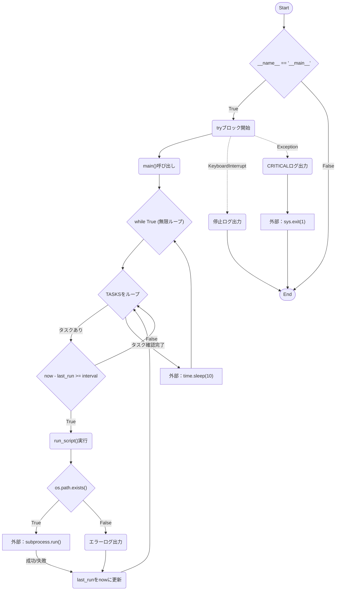
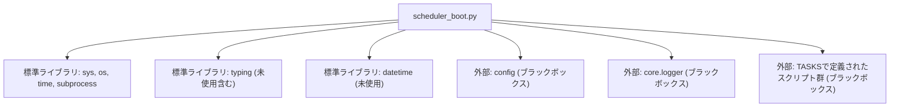

## 1. 解析メタ情報

| 項目 | 内容 |
| --- | --- |
| 対象ファイル | `scheduler_boot.py` |
| 言語 | Python |
| 解析対象 | 提供されたコードのみ |
| 推測・補完 | 一切なし |

## 2. ファイルの概要

* 指定された間隔（秒）で、プロジェクト内のPythonスクリプトを定期的にサブプロセスとして実行し管理する無限ループのスケジューラ。
* 根拠: `main` 関数内のループおよび `TASKS` 定義 (行番号取得不可 / 抜粋: "while True:", "TASKS: List[Task] = [")

## 3. 外部依存関係

### インポート一覧

| 名称 | 種類 | 用途 | 根拠 |
| --- | --- | --- | --- |
| `time` | 標準ライブラリ | 現在時刻の取得、待機処理（スリープ） | `import time` (行番号取得不可 / 抜粋: "import time") |
| `subprocess` | 標準ライブラリ | 外部スクリプトのサブプロセス実行 | `import subprocess` (行番号取得不可 / 抜粋: "import subprocess") |
| `sys` | 標準ライブラリ | モジュール検索パスの追加、プロセス終了処理、Pythonインタープリタパス取得 | `import sys` (行番号取得不可 / 抜粋: "import sys") |
| `os` | 標準ライブラリ | パスの絶対パス解決・結合・存在確認、環境変数の取得 | `import os` (行番号取得不可 / 抜粋: "import os") |
| `datetime` | 標準ライブラリ | 未使用（コード内に使用箇所なし） | `from datetime import datetime` (行番号取得不可 / 抜粋: "from datetime import datetime") |
| `List` | 標準ライブラリ | 型ヒント（リスト） | `from typing import List, ...` (行番号取得不可 / 抜粋: "from typing import List, Dict,") |
| `Dict` | 標準ライブラリ | 型ヒント（辞書） | `from typing import ... Dict, ...` (行番号取得不可 / 抜粋: "from typing import List, Dict,") |
| `Any` | 標準ライブラリ | 未使用（コード内に使用箇所なし） | `from typing import ... Any, ...` (行番号取得不可 / 抜粋: "from typing import List, Dict,") |
| `TypedDict` | 標準ライブラリ | 辞書型の構造定義 | `from typing import ... TypedDict` (行番号取得不可 / 抜粋: "from typing import List, Dict,") |
| `config` | ローカルモジュール | 未使用（コード内に使用箇所なし。インポートの副作用利用の可能性あり） | `import config` (行番号取得不可 / 抜粋: "import config") |
| `setup_logging` | ローカルモジュール | ロガーの初期化と取得 | `from core.logger import setup_logging` (行番号取得不可 / 抜粋: "from core.logger import setup_log") |

### ブラックボックスとなる外部要素

| 名称 | 理由 | 根拠 |
| --- | --- | --- |
| `config` | モジュールがインポートされているが、本ファイル内での使用箇所や実装内容が提供されていないため | `import config` (行番号取得不可 / 抜粋: "import config") |
| `setup_logging` | 実装内容が外部ファイル(`core.logger`)にあるため、ログの出力先やフォーマット仕様が不明 | `from core.logger import setup_logging` (行番号取得不可 / 抜粋: "from core.logger import setup_log") |
| `TASKS` に定義されている各スクリプト | サブプロセスとして呼び出される対象ファイル（`monitors/*.py`など）の実装が提供されていないため | `TASKS: List[Task] = [...]` (行番号取得不可 / 抜粋: "{"script": "monitors/switchbot") |

## 4. 主要要素の定義（関数 / エンドポイント / コンポーネント）

### `Task`

* **役割**: 実行するスクリプトのパス、実行間隔、最終実行時刻、引数を保持するためのデータ構造を定義する。
* 根拠: `class Task(TypedDict):` (行番号取得不可 / 抜粋: "実行タスクのデータ構造定義。")

* **引数/リクエスト**: 該当なし（型定義のため）
* 根拠: `class Task(TypedDict):` (行番号取得不可 / 抜粋: "class Task(TypedDict):")

* **戻り値/レスポンス**: 該当なし
* 根拠: `class Task(TypedDict):` (行番号取得不可 / 抜粋: "class Task(TypedDict):")

* **副作用**: なし
* 根拠: 内部での状態変更なし (行番号取得不可 / 抜粋: "class Task(TypedDict):")

* **エラーハンドリング**: なし
* 根拠: エラー補足の記述なし (行番号取得不可 / 抜粋: "class Task(TypedDict):")

### `run_script`

* **役割**: 指定されたスクリプトをサブプロセスとして実行し、実行結果をログに出力する。
* 根拠: `def run_script` (行番号取得不可 / 抜粋: "指定されたスクリプトをサブプロセスとして実行")

* **引数/リクエスト**: `script_path` (`str`): 実行するスクリプトの相対パス, `args` (`List[str]`): スクリプトに渡す引数
* 根拠: 関数定義 (行番号取得不可 / 抜粋: "script_path: str, args: List")

* **戻り値/レスポンス**: `bool`: 実行成功（returncode 0）ならTrue、それ以外はFalse
* 根拠: return文 (行番号取得不可 / 抜粋: "bool: 実行成功(returncode 0)ならTrue")

* **副作用**: 外部プロセスの起動。標準出力および標準エラー出力のキャプチャとログ出力。
* 根拠: `subprocess.run` (行番号取得不可 / 抜粋: "result = subprocess.run(")

* **エラーハンドリング**: `subprocess.TimeoutExpired`（タイムアウト時）および一般的な `Exception` をキャッチしてログ出力し、`False` を返す。また、サブプロセスの返り値が0以外の場合もエラーログを出力し `False` を返す。
* 根拠: try-except ブロック (行番号取得不可 / 抜粋: "except subprocess.TimeoutExpir")

### `main`

* **役割**: 定義された `TASKS` リストを巡回し、現在時刻と最終実行時刻の差が指定間隔（`interval`）以上のタスクに対して `run_script` を呼び出す無限ループを実行する。
* 根拠: `def main() -> None:` (行番号取得不可 / 抜粋: "メインループ。")

* **引数/リクエスト**: なし
* 根拠: 関数定義 (行番号取得不可 / 抜粋: "def main() -> None:")

* **戻り値/レスポンス**: `None`
* 根拠: 関数定義 (行番号取得不可 / 抜粋: "def main() -> None:")

* **副作用**: `run_script` によるタスク実行。`TASKS` 内各タスクの `last_run` の更新。1回のループ終了ごとの10秒間のスリープ。
* 根拠: `task["last_run"] = now`, `time.sleep(10)` (行番号取得不可 / 抜粋: "task["last_run"] = now", "time.sleep(10)")

* **エラーハンドリング**: 関数内での明示的な例外キャッチはなし。
* 根拠: 関数内部の処理 (行番号取得不可 / 抜粋: "def main() -> None:")

### `__main__` 実行ブロック

* **役割**: `main` 関数を呼び出してスケジューラを起動し、停止命令や予期せぬエラー時にプロセスを終了させる。
* 根拠: `if __name__ == "__main__":` (行番号取得不可 / 抜粋: "if **name** == "**main**":")

* **引数/リクエスト**: なし
* 根拠: ブロック定義 (行番号取得不可 / 抜粋: "if **name** == "**main**":")

* **戻り値/レスポンス**: なし
* 根拠: ブロック定義 (行番号取得不可 / 抜粋: "if **name** == "**main**":")

* **副作用**: `sys.exit(1)` によるプロセスの終了。
* 根拠: `sys.exit(1)` (行番号取得不可 / 抜粋: "sys.exit(1)")

* **エラーハンドリング**: `KeyboardInterrupt` をキャッチして停止ログを出力し正常終了する。それ以外の `Exception` をキャッチしてクリティカルログを出力し、`sys.exit(1)` で異常終了させる。
* 根拠: try-except ブロック (行番号取得不可 / 抜粋: "except KeyboardInterrupt:")

## 5. 処理フロー図

## 6. 依存関係図

## 7. 次のステップ（リバースエンジニアリングの提案）

| 優先度 | ファイル名(推測可) | 理由 | 根拠 |
| --- | --- | --- | --- |
| 高 | `core/logger.py` | ログの出力先、フォーマット仕様、ログレベルの設定内容を把握するため。 | `from core.logger import setup_logging` |
| 高 | `monitors/switchbot_power_monitor.py` など | TASKSに登録されている定期実行処理の実態と、システムへの影響を解析するため。 | `TASKS: List[Task] = [...]` |
| 中 | `config.py` | 本ファイル内では使用されていないがインポートされており、副作用（グローバル変数の初期化など）があるか確認するため。 | `import config` |

## 8. 保守上の注意点

* **タイムアウト設定の矛盾**: `subprocess.run` の引数では `timeout=900`（15分）と指定されているが、直上のコメントでは `1タスク最大5分のタイムアウト` と記載され、例外時のログメッセージでも `exceeded 300 seconds.` と記載されている。仕様と実装に乖離がある。
* **同期待機の仕様**: `subprocess.run` はプロセスの終了を同期的に待機する。そのため、あるタスクの実行時間が長引いた場合（最大900秒）、後続のタスクの実行開始時刻が予定より遅延する。
* **未使用のインポート**: `datetime`, `Any`, `Dict` はインポートされているがコード内で使用されていない。また `config` も明示的な使用箇所がない。
* **パス解決の依存**: 外部スクリプトの実行パスは `__file__` を基準とした `PROJECT_ROOT` に依存しているため、このファイル自身のディレクトリ階層を変更するとすべてのタスク実行が失敗する。

## 9. 不明事項一覧

| 項目 | 理由 | 必要なファイル |
| --- | --- | --- |
| `config` モジュールの役割 | 明示的な呼び出しがないがインポートされており、副作用の有無が判断できないため | `config.py` (または同名のパッケージ) |
| ログの出力仕様 | 初期化関数 `setup_logging` の詳細な設定（コンソール出力、ファイル出力先など）が不明なため | `core/logger.py` |
| 各監視スクリプトの詳細仕様 | `TASKS` で呼び出される各Pythonスクリプトが行う具体的な処理内容（API通信やDB操作の有無など）が不明なため | `monitors/*.py`, `weekly_analyze_report.py` |

## 10. 自己検証結果

* [x] 推測・外部ファイルの仕様を一切含んでいない
* [x] 全関数・全クラス・全コンポーネントを列挙した
* [x] 全てのインポート要素を列挙した
* [x] すべての仕様説明に「根拠（行番号・抜粋）」を明記した
* [x] 根拠漏れが0件である
* [x] Mermaid構文にエラーの原因となる記号（エスケープ漏れ）がない
* [x] 不明事項を漏れなく列挙した
完了