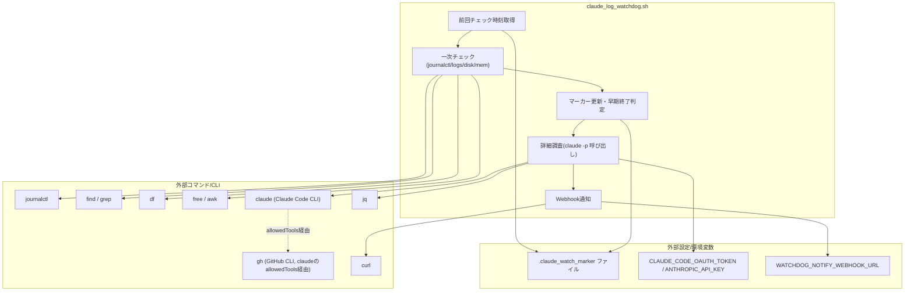

> **⚠️ 廃止 (2026-09-02)**: このファイルは、ソース (`MY_HOME_SYSTEM/scripts/claude_log_watchdog.sh`) が
> Issue #339 対応で削除されたため廃止されました。一次チェック部分は層1として
> `monitors/health_watch.py`([health_watch.md](./health_watch.md))に置き換え済みで、
> `claude -p` ヘッドレス起動部分は調査専用の `scripts/claude_investigate.sh`
> ([scripts_claude_investigate.md](./scripts_claude_investigate.md))へ移設されました。
> 以下の内容は削除時点の履歴として残しています。

## 1. 解析メタ情報

| 項目 | 内容 |
| --- | --- |
| 対象ファイル | `scripts/claude_log_watchdog.sh` |
| 言語 | Shell (bash) |
| 解析対象 | 提供されたコードのみ |
| 推測・補完 | 一切なし |

## 関連ドキュメント

* [start_all.md](./start_all.md) - `PROJECT_DIR`のパス規約、`nohup`/`disown`による常駐起動パターン、`logs/`ディレクトリの`mkdir -p`規約など、本スクリプトが踏襲しているラズパイ運用スクリプトの前例
* [analysis_service.md](./analysis_service.md) - `get_system_logs`/`get_disk_usage`/`get_memory_usage`が使う`journalctl`/`shutil.disk_usage`/`free -m`と、本スクリプトの一次チェックが取得方法を揃えている対象
* [notification_service.md](./notification_service.md) - 本スクリプトが「再利用する想定」としているDiscord/LINE Webhook通知の実体（ただし本スクリプトはこのモジュールを直接importせず、`curl`によるWebhook POSTで独自に通知する）
* `docs/runbooks/raspi_claude_log_monitoring.md` - 本スクリプトの設計背景・運用手順（準備手順、ガードレールの意図、未実装の注意点）を記載したランブック。本スクリプトはこのランブックの雛形実装として追加された

## 2. ファイルの概要

ラズパイ上のcron/systemdタイマーから定期実行されることを想定した、ログ・リソース監視スクリプトの雛形。journalctl・アプリケーションログ・ディスク/メモリ使用率をシェルのみで安価にチェックする一次チェックを行い、異常を検知した場合にのみClaude Code CLI（`claude -p`）をヘッドレス起動して、リポジトリのソースと突き合わせた原因調査・改修案の提示（GitHub Issue/Draft PR起票）とWebhook通知を行う。冒頭のコメントで明記されている通り、`--permission-mode`/`--allowedTools`のフラグ値は実機未検証であり、実際の運用前に`claude --help`等での確認が必要な雛形段階のスクリプトである。

## 3. 外部依存関係

### インポート一覧

本スクリプトはシェルスクリプトのため`import`文はないが、実行に必須の外部コマンド・環境変数は以下の通り。

| 名称 | 種類 | 用途 | 根拠 |
| --- | --- | --- | --- |
| `journalctl` | 外部コマンド(systemd) | `home_system.service`のエラーログ取得 | 根拠: [コマンド呼び出し] (行番号: 49 / 抜粋: "journalctl -u home_system.service --since \"$SINCE\" -p err..emerg --no-pager") |
| `find` / `grep` | 外部コマンド | `logs/*.log`内のERROR/CRITICAL行の検索 | 根拠: [コマンド呼び出し] (行番号: 54 / 抜粋: "find logs -maxdepth 1 -name '*.log' -newer \"$MARKER_FILE\" -exec grep -E 'ERROR\|CRITICAL' {} +") |
| `df` | 外部コマンド | ルートディスクの使用率取得 | 根拠: [コマンド呼び出し] (行番号: 58 / 抜粋: "df / --output=pcent \| tail -1 \| tr -dc '0-9'") |
| `free` / `awk` | 外部コマンド | メモリ使用率取得・算出 | 根拠: [コマンド呼び出し] (行番号: 59 / 抜粋: "free \| awk '/Mem:/ {printf \"%d\", $3/$2*100}'") |
| `claude` (Claude Code CLI) | 外部CLI | 異常検知時のヘッドレス調査実行 | 根拠: [コマンド呼び出し] (行番号: 118〜121 / 抜粋: "RESULT=$(claude -p \"$PROMPT\" ...") |
| `jq` | 外部コマンド | `claude -p --output-format json`の出力から`.result`を抽出 | 根拠: [コマンド呼び出し] (行番号: 121 / 抜粋: "\| jq -r '.result // .'") |
| `gh` (GitHub CLI) | 外部CLI | `claude`の`--allowedTools`許可リスト経由で、Issue/Draft PRの起票に使われる想定 | 根拠: [プロンプト内指示・許可リスト] (行番号: 110, 120 / 抜粋: "'gh issue create' または 'gh pr create --draft' でGitHub上に起票せよ", "Bash(gh issue create*),Bash(gh pr create*),Bash(gh pr diff*)") |
| `curl` | 外部コマンド | 異常検知・調査完了時のWebhook通知送信 | 根拠: [コマンド呼び出し] (行番号: 127〜130 / 抜粋: "curl -fsS -X POST \"$WATCHDOG_NOTIFY_WEBHOOK_URL\" ...") |
| `CLAUDE_CODE_OAUTH_TOKEN` / `ANTHROPIC_API_KEY` (環境変数) | 外部設定 | `claude`コマンドの認証（コメントで前提として明記、スクリプト内での参照なし） | 根拠: [コメント] (行番号: 24 / 抜粋: "認証用の環境変数(CLAUDE_CODE_OAUTH_TOKEN または ANTHROPIC_API_KEY)が設定済み") |
| `WATCHDOG_NOTIFY_WEBHOOK_URL` (環境変数) | 外部設定 | 通知先WebhookのURL | 根拠: [変数参照] (行番号: 126 / 抜粋: "if [ -n \"${WATCHDOG_NOTIFY_WEBHOOK_URL:-}\" ]; then") |

### ブラックボックスとなる外部要素

| 名称 | 理由 | 根拠 |
| --- | --- | --- |
| `claude`コマンドの`--permission-mode`/`--allowedTools`の正確な仕様 | スクリプト冒頭のコメントで「実装時点の想定であり未検証」「実機で`claude --help`等を実行し確認すること」と明記されており、本スクリプト単体からはCLIの実際の仕様（フラグ名・値の妥当性）を検証できない。 | 根拠: [コメント] (行番号: 8〜11, 117 / 抜粋: "★重要: --permission-mode / --allowedTools の値は実装時点の想定であり未検証。", "★以下の --permission-mode / --allowedTools は未検証。実機で確認・修正すること。") |
| `home_system.service` (systemdユニット) | 本スクリプトが監視対象とするサービスの実体（起動コマンド、ユニット定義）は本ファイルからは不明。 | 根拠: [コマンド引数] (行番号: 49 / 抜粋: "journalctl -u home_system.service") |
| `claude -p --output-format json`の出力スキーマ | `.result`フィールドを前提に`jq`で抽出しているが、他にどのようなフィールド（コスト情報等）が含まれるかは本ファイルからは不明。 | 根拠: [コマンド呼び出し] (行番号: 121 / 抜粋: "jq -r '.result // .'") |

## 4. 主要要素の定義（関数 / エンドポイント / コンポーネント）

本スクリプトは関数定義を持たず、トップレベルの手続き的な処理として構成されている。処理ブロックごとに記述する。

### 前回チェック時刻の取得ブロック

* **役割**: マーカーファイル（`$MARKER_FILE`）が存在すればその内容（前回チェック完了時刻）を`SINCE`に、存在しなければ`"1 hour ago"`を`SINCE`に設定する。
* 根拠: [条件分岐] (行番号: 41〜45 / 抜粋: "if [ -f \"$MARKER_FILE\" ]; then\n  SINCE=$(cat \"$MARKER_FILE\")\nelse\n  SINCE=\"1 hour ago\"\nfi")

* **引数/リクエスト**: `$MARKER_FILE`（`$HOME_SYSTEM_DIR/logs/.claude_watch_marker`、行番号33で定義）の有無とその内容
* 根拠: [変数定義] (行番号: 33 / 抜粋: "MARKER_FILE=\"$HOME_SYSTEM_DIR/logs/.claude_watch_marker\"")

* **戻り値/レスポンス**: 該当なし（シェル変数`SINCE`への代入）
* 根拠: [変数代入] (行番号: 42, 44 / 抜粋: "SINCE=$(cat \"$MARKER_FILE\")", "SINCE=\"1 hour ago\"")

* **副作用**: `$MARKER_FILE`の読み取り（存在する場合）
* 根拠: [コマンド呼び出し] (行番号: 42 / 抜粋: "cat \"$MARKER_FILE\"")

* **エラーハンドリング**: なし（`set -euo pipefail`（行番号28）により、`cat`が失敗した場合はスクリプト全体が異常終了する想定だが、直前で`-f`による存在確認をしているため通常は到達しない）
* 根拠: [スクリプトオプション] (行番号: 28 / 抜粋: "set -euo pipefail")

### 一次チェックブロック（journalctl・ログファイル・ディスク/メモリ）

* **役割**: `home_system.service`の`journalctl`エラーログ、`logs/*.log`内のERROR/CRITICAL行、ディスク使用率、メモリ使用率の4項目を取得し、いずれかが異常条件（ログが空でない、または閾値以上）に該当すれば`ANOMALY`を`true`にし、該当理由を`REASON`に追記する。
* 根拠: [コマンド呼び出し・条件分岐] (行番号: 49〜79 / 抜粋: "JOURNAL_ERRORS=$(journalctl -u home_system.service --since \"$SINCE\" -p err..emerg --no-pager 2>/dev/null \|\| true)" 〜 "REASON=\"${REASON}メモリ使用率${MEM_PERCENT}%が閾値(${MEM_THRESHOLD_PERCENT}%)超過\"$'\\n'\nfi")

* **引数/リクエスト**: `$SINCE`（前ブロックで決定）、`$MARKER_FILE`、`$DISK_THRESHOLD_PERCENT`（デフォルト90、行番号34）、`$MEM_THRESHOLD_PERCENT`（デフォルト90、行番号35）
* 根拠: [変数定義] (行番号: 34〜35 / 抜粋: "DISK_THRESHOLD_PERCENT=90\nMEM_THRESHOLD_PERCENT=90")

* **戻り値/レスポンス**: 該当なし（シェル変数`JOURNAL_ERRORS`, `LOG_ERRORS`, `DISK_PERCENT`, `MEM_PERCENT`, `ANOMALY`, `REASON`への代入）
* 根拠: [変数代入] (行番号: 49, 54, 58〜59, 61〜62 / 抜粋: "JOURNAL_ERRORS=$(...)", "LOG_ERRORS=$(...)", "DISK_PERCENT=$(...)", "MEM_PERCENT=$(...)", "ANOMALY=false", "REASON=\"\"")

* **副作用**: `journalctl`・`find`/`grep`・`df`・`free`の各外部コマンド実行
* 根拠: [コマンド呼び出し] (行番号: 49, 54, 58, 59)

* **エラーハンドリング**: `journalctl`・`find`/`grep`の呼び出しは`\|\| true`で失敗を握りつぶし、空文字列として扱う（`set -e`環境下でもスクリプトを継続させるため）。`df`/`free`にはこのフォールバックがなく、失敗時は`set -euo pipefail`によりスクリプト全体が異常終了する。
* 根拠: [エラー抑制] (行番号: 49, 54 / 抜粋: "2>/dev/null \|\| true", "2>/dev/null \|\| true")、[スクリプトオプション] (行番号: 28 / 抜粋: "set -euo pipefail")

### マーカー更新・早期終了ブロック

* **役割**: 一次チェックの完了時刻（`$NOW_ISO`）を`$MARKER_FILE`に書き込んで更新する（異常の有無に関わらず実行）。`$ANOMALY`が`false`であれば、その旨をログ出力してスクリプトを正常終了（exit 0）させ、以降のClaude Code CLI呼び出しを行わない。
* 根拠: [ファイル書き込み・条件分岐] (行番号: 82〜87 / 抜粋: "echo \"$NOW_ISO\" > \"$MARKER_FILE\"\n\nif [ \"$ANOMALY\" = false ]; then\n  echo \"[$(date)] 異常なし。Claude Code CLIは呼び出さない。\"\n  exit 0\nfi")

* **引数/リクエスト**: `$NOW_ISO`（行番号46で`date -Iseconds`により取得）、`$ANOMALY`
* 根拠: [変数定義] (行番号: 46 / 抜粋: "NOW_ISO=$(date -Iseconds)")

* **戻り値/レスポンス**: 異常なしの場合、プロセスの終了コード`0`
* 根拠: [終了] (行番号: 86 / 抜粋: "exit 0")

* **副作用**: `$MARKER_FILE`への書き込み（既存内容の上書き）
* 根拠: [ファイル書き込み] (行番号: 82 / 抜粋: "echo \"$NOW_ISO\" > \"$MARKER_FILE\"")

* **エラーハンドリング**: なし
* 根拠: 該当箇所に`try`相当の構文なし (行番号: 82〜87)

### 詳細調査ブロック（Claude Code CLI呼び出し）

* **役割**: 一次チェックの検知内容（`$REASON`, `$JOURNAL_ERRORS`, `$LOG_ERRORS`, `$DISK_PERCENT`, `$MEM_PERCENT`）を埋め込んだプロンプトを組み立て、`claude -p`をヘッドレス起動して原因調査・改修案提示・GitHub Issue/Draft PR起票を行わせる。プロンプト内で「systemctl restart等のサービス再起動やコードの自動適用は行わない」ことを明示的に指示し、`--allowedTools`で許可するコマンドを読み取り系（`git log`/`git diff`/`git status`）と`gh issue create`/`gh pr create`/`gh pr diff`のみに限定する。結果は`--output-format json`で受け取り、`jq`で`.result`フィールドを抽出して標準出力に表示する。
* 根拠: [コマンド呼び出し] (行番号: 93〜123 / 抜粋: "PROMPT=$(cat <<EOF\n...\nEOF\n)\n\nRESULT=$(claude -p \"$PROMPT\" \\\n  --permission-mode dontAsk \\\n  --allowedTools \"Read,Grep,Glob,Bash(git log*),Bash(git diff*),Bash(git status*),Bash(gh issue create*),Bash(gh pr create*),Bash(gh pr diff*)\" \\\n  --output-format json 2>&1 \| jq -r '.result // .')")

* **引数/リクエスト**: `$REASON`, `$JOURNAL_ERRORS`, `$LOG_ERRORS`, `$DISK_PERCENT`, `$MEM_PERCENT`（いずれもヒアドキュメント経由でプロンプト文字列に埋め込まれる）
* 根拠: [ヒアドキュメント] (行番号: 93〜115 / 抜粋: "【検知内容】\n${REASON}\n\n【journalctlの該当ログ】\n${JOURNAL_ERRORS}\n...")

* **戻り値/レスポンス**: `$RESULT`（`claude -p`の`--output-format json`出力から`jq -r '.result // .'`で抽出した文字列。抽出に失敗した場合は元のJSON文字列全体がフォールバックとして代入される）
* 根拠: [パイプ処理] (行番号: 121 / 抜粋: "\| jq -r '.result // .')")

* **副作用**: `claude`コマンドの実行（`--allowedTools`で許可された範囲内で、`gh issue create`/`gh pr create`等によるGitHub上でのIssue/PR作成を含みうる）
* 根拠: [コマンド呼び出し・許可リスト] (行番号: 118〜120)

* **エラーハンドリング**: なし（`claude`コマンドの標準エラー出力は`2>&1`で標準出力にマージされるが、終了コードの判定は行っていない。`set -euo pipefail`環境下のため、`claude`コマンド自体が非0で終了した場合はパイプライン全体が失敗しスクリプトが異常終了しうるが、`jq`が正常終了すればパイプライン全体の終了コードは`jq`のものになる点に留意）
* 根拠: [パイプ処理] (行番号: 118〜121)、[スクリプトオプション] (行番号: 28 / 抜粋: "set -euo pipefail")

### 通知ブロック

* **役割**: 環境変数`$WATCHDOG_NOTIFY_WEBHOOK_URL`が設定されている場合のみ、調査結果（`$RESULT`）を含むJSONペイロードをそのURLへ`curl`でPOSTする。
* 根拠: [条件分岐・コマンド呼び出し] (行番号: 126〜131 / 抜粋: "if [ -n \"${WATCHDOG_NOTIFY_WEBHOOK_URL:-}\" ]; then\n  curl -fsS -X POST \"$WATCHDOG_NOTIFY_WEBHOOK_URL\" \\\n    -H \"Content-Type: application/json\" \\\n    -d \"{\\\"content\\\": \\\"[ラズパイ監視] 異常検知・調査完了:\\n${RESULT}\\\"}\" \\\n    \|\| echo \"[$(date)] 通知送信に失敗しました\" >&2\nfi")

* **引数/リクエスト**: `$WATCHDOG_NOTIFY_WEBHOOK_URL`（環境変数）、`$RESULT`
* 根拠: [変数参照] (行番号: 126, 129)

* **戻り値/レスポンス**: 該当なし
* 根拠: 該当箇所に戻り値の記述なし (行番号: 126〜131)

* **副作用**: `$WATCHDOG_NOTIFY_WEBHOOK_URL`へのHTTP POSTリクエスト実行
* 根拠: [外部通信] (行番号: 127〜129 / 抜粋: "curl -fsS -X POST \"$WATCHDOG_NOTIFY_WEBHOOK_URL\" ...")

* **エラーハンドリング**: `curl`が失敗した場合、標準エラー出力にメッセージを出力するのみ（`\|\| echo ... >&2`）。この分岐により`curl`失敗時もスクリプト全体の終了コードは0のまま継続する。
* 根拠: [エラー抑制] (行番号: 130 / 抜粋: "\|\| echo \"[$(date)] 通知送信に失敗しました\" >&2")

## 5. 処理フロー図

```mermaid
flowchart TD
    Start([Start]) --> ReadMarker{"$MARKER_FILE が存在するか?"}
    ReadMarker -- Yes --> SetSinceFromMarker["SINCE = マーカーファイルの内容"]
    ReadMarker -- No --> SetSinceDefault["SINCE = '1 hour ago'"]
    SetSinceFromMarker --> CheckJournal
    SetSinceDefault --> CheckJournal

    CheckJournal["外部: journalctl -u home_system.service --since $SINCE -p err..emerg"] --> CheckLogs["外部: find/grep logs/*.log (ERROR|CRITICAL)"]
    CheckLogs --> CheckDisk["外部: df / でディスク使用率取得"]
    CheckDisk --> CheckMem["外部: free でメモリ使用率取得"]

    CheckMem --> EvalJournal{"JOURNAL_ERRORSが空でないか?"}
    EvalJournal -- Yes --> SetAnomaly1["ANOMALY=true, REASONに追記"]
    EvalJournal -- No --> EvalLogs
    SetAnomaly1 --> EvalLogs{"LOG_ERRORSが空でないか?"}
    EvalLogs -- Yes --> SetAnomaly2["ANOMALY=true, REASONに追記"]
    EvalLogs -- No --> EvalDisk
    SetAnomaly2 --> EvalDisk{"DISK_PERCENT >= 閾値(90)?"}
    EvalDisk -- Yes --> SetAnomaly3["ANOMALY=true, REASONに追記"]
    EvalDisk -- No --> EvalMem
    SetAnomaly3 --> EvalMem{"MEM_PERCENT >= 閾値(90)?"}
    EvalMem -- Yes --> SetAnomaly4["ANOMALY=true, REASONに追記"]
    EvalMem -- No --> UpdateMarker
    SetAnomaly4 --> UpdateMarker["$MARKER_FILE を現在時刻で上書き"]

    UpdateMarker --> CheckAnomalyFlag{"ANOMALY = false ?"}
    CheckAnomalyFlag -- Yes --> LogNormal["ログ出力: 異常なし"]
    LogNormal --> ExitZero([exit 0])

    CheckAnomalyFlag -- No --> LogAnomaly["ログ出力: 異常を検知"]
    LogAnomaly --> BuildPrompt["検知内容をプロンプトに埋め込み"]
    BuildPrompt --> InvokeClaude["外部: claude -p (--allowedToolsで許可コマンドを限定)"]
    InvokeClaude --> PrintResult["結果(RESULT)を標準出力に表示"]
    PrintResult --> CheckWebhook{"WATCHDOG_NOTIFY_WEBHOOK_URL が設定されているか?"}
    CheckWebhook -- Yes --> SendWebhook["外部: curl でWebhook通知"]
    CheckWebhook -- No --> End([End])
    SendWebhook --> End
```

## 6. 依存関係図

## 7. 次のステップ（リバースエンジニアリングの提案）

| 優先度 | ファイル名(推測可) | 理由 | 根拠 |
| --- | --- | --- | --- |
| 高 | `docs/runbooks/raspi_claude_log_monitoring.md` | 本スクリプトの設計意図・準備手順・ガードレールの背景がこのランブックに記載されているため、スクリプト単体では読み取れない運用文脈を補うのに必要。 | 根拠: スクリプト冒頭コメント (行番号: 6 / 抜粋: "詳細設計は docs/runbooks/raspi_claude_log_monitoring.md を参照。") |
| 中 | `home_system.service` (systemdユニット定義) | `journalctl -u home_system.service`で監視対象としているサービスの実体が本ファイルからは不明。 | 根拠: [コマンド引数] (行番号: 49) |
| 低 | `start_all.sh` | `PROJECT_DIR`のパス規約や`logs/`ディレクトリの扱いなど、本スクリプトが前提としているラズパイ配置規約の出典。 | 根拠: [コメント] (行番号: 30 / 抜粋: "★ラズパイの実際の配置パスに合わせて変更すること(start_all.shのPROJECT_DIRと同様)") |

## 8. 保守上の注意点

* `--permission-mode dontAsk`および`--allowedTools`の値は、スクリプト自身のコメント（行番号8〜11, 117）で「実装時点の想定であり未検証」と明記されている。実機の`claude`コマンドのバージョンによってはこれらのフラグが存在しない、または挙動が異なる可能性があり、確認を怠るとガードレール（`systemctl`等の破壊的操作を許可しない設計）が機能しない状態のまま運用されるリスクがある。
* `PROJECT_DIR`（行番号31）が`/home/masahiro/develop/my_python_project`にハードコードされており、`start_all.sh`と同様にラズパイの実配置パスに依存する（CLAUDE.mdに記載の通りこの種のスクリプトは環境間で可搬ではない）。
* `journalctl`・`find`/`grep`の呼び出しは`\|\| true`でエラーを握りつぶすが、`df`/`free`にはこのフォールバックがないため、これらのコマンドが失敗した場合（実行権限の問題等）は`set -euo pipefail`によりスクリプト全体が異常終了し、マーカーファイルも更新されない。
* `claude -p`呼び出し（行番号118〜121）自体の終了コードは明示的にチェックされておらず、`claude`が失敗してもプロンプト全体が空文字列やエラーメッセージとして`RESULT`に入り、そのまま通知されてしまう可能性がある。
* 通知ペイロード（行番号129）は`$RESULT`をJSON文字列内にそのまま埋め込んでおり、`$RESULT`の内容に二重引用符やバックスラッシュ等JSON特殊文字が含まれる場合、生成されるJSONが不正になる可能性がある（`jq -Rs`等でのエスケープは行われていない）。
* `WATCHDOG_NOTIFY_WEBHOOK_URL`は`notification_service.py`のWebhook設定とは別の独立した環境変数であり、値の受け渡し（同じURLを実際に設定するか等）は運用者の手作業に委ねられている。

## 9. 不明事項一覧

| 項目 | 理由 | 必要なファイル |
| --- | --- | --- |
| `claude`コマンド(Claude Code CLI)の`--permission-mode`/`--allowedTools`/`--output-format`の正確な仕様 | スクリプト自身が「未検証」と明記しており、CLIのヘルプ出力や公式ドキュメントを参照しないと確認できない。 | 実機での`claude --help`/`claude -p --help`の出力、またはClaude Code公式ドキュメント |
| `home_system.service`のsystemdユニット定義 | 監視対象サービスの起動コマンド・作業ディレクトリ等が本ファイルからは不明。 | ラズパイ環境の`/etc/systemd/system/home_system.service`等 |
| `WATCHDOG_NOTIFY_WEBHOOK_URL`の実際の設定値・設定方法 | cron環境変数として設定する想定だが、具体的な設定手順（crontab内記述か`.env`経由か等）は本ファイルからは不明。 | cron設定ファイルまたは運用ドキュメント |
| cron/systemdタイマーへの実際の登録方法 | 本スクリプトのコメントには実行想定が書かれているが、実際のcrontabエントリやsystemdタイマーユニットの定義は別ファイル（未作成）。 | crontabまたはsystemdタイマーユニット定義ファイル |

## 相互参照による補足情報

（本セクションの調査は行っていない。本ファイルは新規追加スクリプトの初回文書化であり、他仕様書との相互参照による不明事項の解消は今回のスコープ外。）

## 10. 自己検証結果

* [x] 完了: 推測・外部ファイルの仕様を一切含んでいない
* [x] 完了: 全処理ブロックを列挙した（関数定義を持たないため、処理ブロック単位で整理した）
* [x] 完了: 全ての外部コマンド・環境変数依存を列挙した
* [x] 完了: すべての仕様説明に「根拠（行番号・抜粋）」を明記した
* [x] 完了: 根拠漏れが0件である
* [x] 完了: Mermaid構文にエラーの原因となる記号（エスケープ漏れ）がない
* [x] 完了: 不明事項を漏れなく列挙した
