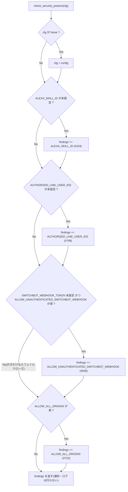
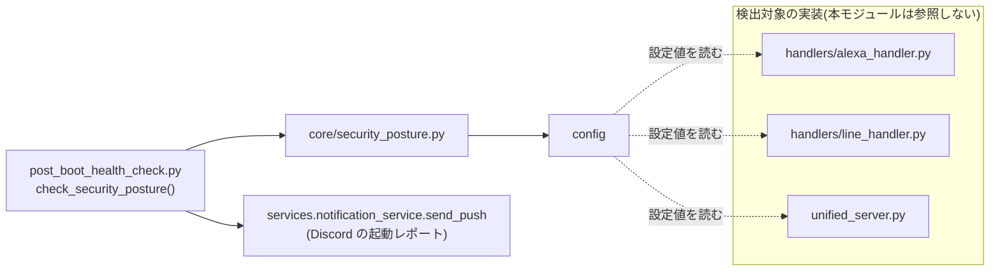

## 1. 解析メタ情報

| 項目 | 内容 |
| --- | --- |
| 対象ファイル | core/security_posture.py |
| 解析基準コミット | Issue #799 での新規作成時点(2026-09-20) |
| 言語 | Python |
| 解析対象 | 提供されたコードのみ |
| 推測・補完 | 一切なし |

## 関連ドキュメント

* [post_boot_health_check.md](./post_boot_health_check.md) - 唯一の呼び出し元。判定結果を `CheckResult("Security", ...)` として起動レポート(Discord)に載せる
* [config.md](./config.md) - 検査対象の設定定数(`ALEXA_SKILL_ID` / `AUTHORIZED_LINE_USER_IDS` / `SWITCHBOT_WEBHOOK_TOKEN` / `ALLOW_UNAUTHENTICATED_SWITCHBOT_WEBHOOK` / `ALLOW_ALL_ORIGINS`)の定義元
* [alexa_handler.md](./alexa_handler.md) - `ALEXA_SKILL_ID` 未設定時にスキルID検証を行わない実装(本モジュールが検出する対象の1つ)
* [line_handler.md](./line_handler.md) - `AUTHORIZED_LINE_USER_IDS` が空だと `_is_authorized_line_user` が常に True を返す実装(同上)
* [unified_server.md](./unified_server.md) - `SWITCHBOT_WEBHOOK_TOKEN` 未設定時のフェイルクローズ/オプトインの分岐(同上)

## 2. ファイルの概要

「設定が未設定なせいで保護が黙って無効になっている」状態を1か所で列挙するモジュール。モジュール docstring によれば、このリポジトリでは「コードはマージされ Issue もクローズされたのに、実機 `.env` への反映が漏れていて保護が効いていない」取りこぼしが3回起きている(#319 / #723 / #799)。

個別の警告自体は既に存在していた(`handlers/alexa_handler.py` の「⚠️ ALEXA_SKILL_ID is not set」、`unified_server.py` の SwitchBot トークン警告)。docstring はそれでも気づかれなかった理由として、**散らばっていて「いま何が無効なのか」を一覧で答えられない**ことと、**ログにしか出ないため数か月気づかれない**ことの2点を挙げている。本モジュールは判定を集約するだけで、通知は行わない(副作用を持たない)。

対象は「未設定だとフェイルオープンする」設定に限り、**意図的に未設定のまま運用している設定は対象にしない**。docstring はその理由を「混ぜると警告が常時鳴り、『いつものやつ』として無視されるようになり、一覧性という目的自体が壊れる」と説明している。2026-09-20 時点で意図的に未設定なものとして `NAS_IP`(#663)・`SPEAKER_BLUETOOTH_MAC`(#723)・`YOUTUBE_COOKIES_FILE`(#768)・`DB_BACKUP_OFFSITE_REMOTE`(#721)が列挙されている。

## 3. 外部依存関係

### インポート一覧

| 名称 | 種類 | 用途 | 根拠 |
| --- | --- | --- | --- |
| `dataclasses.dataclass` | 標準ライブラリ | `PostureFinding` の定義(`frozen=True`) | `from dataclasses import dataclass` (行番号: 45) |
| `typing.Any` | 標準ライブラリ | 設定オブジェクトの型注釈 | `from typing import Any` (行番号: 45) |
| `__future__.annotations` | 標準ライブラリ | 注釈の遅延評価(組み込み `list[...]` を注釈に使うため) | `from __future__ import annotations` (行番号: 42) |
| `config` | 内部モジュール | 検査対象の既定の設定モジュール(`_default_config` として別名 import) | `import config as _default_config` (行番号: 49) |

### ブラックボックスとなる外部要素

| 項目 | 理由 |
| --- | --- |
| 各設定が実際に保護を無効化する挙動 | 本ファイルは設定値の有無を判定するだけで、無効化そのものは `alexa_handler` / `line_handler` / `unified_server` 側の実装であり、本ファイル単体からは検証できない。 |
| 通知されるかどうか | 本モジュールは戻り値を返すのみで、ログ出力・通知は呼び出し側(`post_boot_health_check.py`)の責務。 |

## 4. 主要要素の定義（関数 / エンドポイント / コンポーネント）

### `PostureFinding`

* **役割**: 保護が無効になっている設定1件を表す凍結データクラス。`key`(`.env` の設定名)・`protection`(いま何が効いていないか)・`remedy`(直し方)・`ref`(Issue 番号)の4フィールドを持つ
* 根拠: `class PostureFinding:` (行番号: 52)
* **メッセージを組み立てない理由**: docstring によれば「通知の文面はそこの都合で変わるため」呼び出し側に任せている
* **副作用**: なし
* **エラーハンドリング**: なし(単なるデータ保持)

### `_is_blank`

* **役割**: 未設定とみなすかの判定。`None`・空白のみの文字列・空のコレクション(`list`/`tuple`/`set`/`dict`)を「未設定」として扱い、それ以外は `False` を返す
* 根拠: `def _is_blank(value: Any) -> bool:` (行番号: 66)
* **なぜ必要か**: docstring によれば `AUTHORIZED_LINE_USER_IDS` は `List[str]`(docstring の表記)、`ALEXA_SKILL_ID` は `str | None` と型が揃っていないため、その差をここで吸収する
* **戻り値**: `bool`
* **副作用**: なし
* **エラーハンドリング**: なし

### `check_security_posture`

* **役割**: フェイルオープンしている設定を列挙する。docstring に「副作用は無く、ログも通知も出さない」と明記されている
* 根拠: `def check_security_posture(cfg: Any = None) -> list[PostureFinding]:` (行番号: 81)
* **引数**: `cfg`(検査対象の設定モジュール。既定は `config`。docstring によればテストでは `SimpleNamespace` 等を渡せる)
* **戻り値**: `list[PostureFinding]`。問題が無ければ空リスト
* **判定する4項目**:

| # | 条件 | 報告する `key` | `ref` |
| --- | --- | --- | --- |
| 1 | `ALEXA_SKILL_ID` が未設定 | `ALEXA_SKILL_ID` | `#319` |
| 2 | `AUTHORIZED_LINE_USER_IDS` が未設定 | `AUTHORIZED_LINE_USER_IDS` | `#799` |
| 3 | `SWITCHBOT_WEBHOOK_TOKEN` が未設定 **かつ** `ALLOW_UNAUTHENTICATED_SWITCHBOT_WEBHOOK` が真 | `ALLOW_UNAUTHENTICATED_SWITCHBOT_WEBHOOK` | `#648` |
| 4 | `ALLOW_ALL_ORIGINS` が真 | `ALLOW_ALL_ORIGINS` | `#723` |

* **3が2条件なのはなぜか**: コード中のコメントによれば「トークン未設定**単独**はフェイルクローズ(503)なので報告しない。移行用のオプトインが立っている場合だけ、無検証で受け付ける=フェイルオープンになる」
* **設定値の読み方**: すべて `getattr(cfg, name, デフォルト)` で読むため、設定名自体が存在しない場合も例外にならず「未設定」側に倒れる
* **副作用**: なし
* **エラーハンドリング**: 例外を捕捉する記述は無い(単純な属性読み取りと比較のみ)

### `format_findings`

* **役割**: 判定結果を1行サマリにする。空なら `"保護が無効な設定はありません"`、そうでなければ `"{件数}件の保護が無効: KEY(REF), ..."` を返す
* 根拠: `def format_findings(findings: list[PostureFinding]) -> str:` (行番号: 146)
* **戻り値**: `str`
* **設定値を含めない**: 組み立てに使うのは `key` と `ref` だけで、設定の値(トークン等)は載らない
* **副作用**: なし
* **エラーハンドリング**: なし

## 5. 処理フロー図

## 6. 依存関係図

## 7. 次のステップ（リバースエンジニアリングの提案）

| 優先度 | ファイル | 理由 |
| --- | --- | --- |
| 高 | `post_boot_health_check.py` | 唯一の呼び出し元。判定結果が実際にどう通知されるか(`CheckResult` → Discord)を確認するため |
| 中 | `handlers/line_handler.py` | `AUTHORIZED_LINE_USER_IDS` が空のときに `_is_authorized_line_user` が True を返す実装を確認するため |
| 中 | `unified_server.py` | `SWITCHBOT_WEBHOOK_TOKEN` 未設定時のフェイルクローズと、オプトインによる例外の分岐を確認するため |
| 低 | `config.py` | 検査対象の定数がどう `.env` から読まれるかを確認するため |

## 8. 保守上の注意点

* **意図的に未設定の設定を追加してはならない**: モジュール docstring が明示しているとおり、対象は「未設定だと保護が黙って無効になる」ものだけである。運用上オフにしている機能(`NAS_IP` / `SPEAKER_BLUETOOTH_MAC` / `YOUTUBE_COOKIES_FILE` / `DB_BACKUP_OFFSITE_REMOTE`)を混ぜると警告が常時鳴り、本当に無効な保護が埋もれる。`tests/test_security_posture.py` の `TestIntentionallyUnsetIsNotReported` がこの線引きを固定している
* **フェイルクローズとフェイルオープンを取り違えないこと**: `SWITCHBOT_WEBHOOK_TOKEN` 単独の未設定は #648 でフェイルクローズ(503)になったため報告対象ではない。「トークンが無ければ警告」に緩めると、正しくフェイルクローズしている構成に対して毎回警告が出る。判定を2条件にしている理由がこれで、`TestSwitchbotNeedsBothConditions` が固定している
* **通知の文面に設定値を載せないこと**: `format_findings` も `post_boot_health_check.check_security_posture` も `key` と `ref`・`protection` だけを使い、設定の値は出さない。起動レポートは Discord に送られるため、ここに値を載せるとトークンが流れる
* **判定を増やすときは対応するテストを同時に足すこと**: 判定が増えても既存テストは通ってしまう(新しい条件を誰も検査しないため)。`TestDetectsFailOpen` のパラメトライズ表に1行足すのが最小の追従

## 9. 不明事項一覧

* 本ファイルは設定値の有無だけを見るため、**各設定が実際にその保護を無効化するか**は本ファイル単体からは検証できない(`alexa_handler` / `line_handler` / `unified_server` 側の実装に依存する)。判定対象の実装が将来変わっても、本ファイルは追従せず古い前提のまま報告し続ける可能性がある
* `ALLOW_ALL_ORIGINS` を `#723` の参照としているが、この定数自体は `#723` より前から `config.py` に存在する。`ref` は「関連する経緯を追える Issue」であり、その設定が導入された Issue とは限らない

## 10. 自己検証結果

* [x] 完了: 全関数・全クラスを列挙した(`PostureFinding`、`_is_blank`、`check_security_posture`、`format_findings`)
* [x] 完了: すべての記述に根拠(行番号・抜粋)を付した
* [x] 完了: ソースコードのみを根拠とし、推測・補完を行っていない
* [x] 完了: 外部依存関係をインポート一覧として列挙した
* [x] 完了: 処理フロー図・依存関係図を mermaid で作成した
* [x] 完了: 分からないことは9章に記載した
