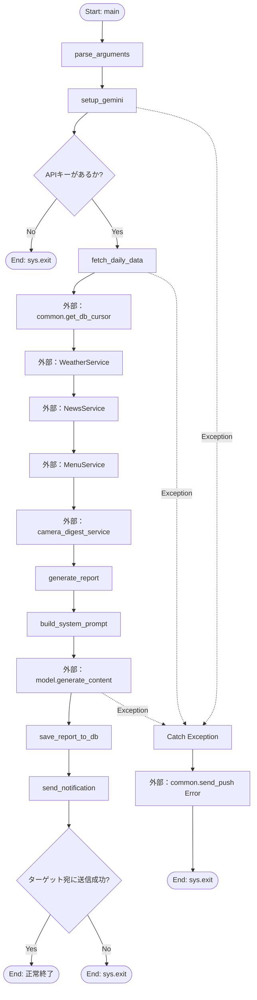
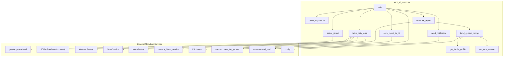

## 1. 解析メタ情報

| 項目 | 内容 |
| --- | --- |
| 対象ファイル | `send_ai_report.py` |
| 言語 | Python |
| 解析対象 | 提供されたコードのみ |
| 推測・補完 | 一切なし |

## 2. ファイルの概要

* 自宅のデータベース、センサー、外部サービス（天気、ニュース、メニュー、カメラなど）から日次データを収集し、Gemini APIを利用して家族向けの状況レポートテキストを生成する。
* 生成したレポートをデータベースに保存し、指定された通知先（LINE、Discord、または両方）へ送信する。

## 3. 外部依存関係

### インポート一覧

| 名称 | 種類 | 用途 | 根拠 |
| --- | --- | --- | --- |
| `google.generativeai` | 外部モジュール | Gemini APIとの通信（`genai`として使用） | `import google.generativeai as genai` (行番号: 2) |
| `json` | 標準ライブラリ | データのJSON形式への変換 | `import json` (行番号: 3) |
| `config` | ローカルモジュール | 設定値、定数の取得 | `import config` (行番号: 4) |
| `common` | ローカルモジュール | DB接続、ログ設定、通知送信などの共通処理 | `import common` (行番号: 5) |
| `traceback` | 標準ライブラリ | 例外発生時のトレースバック出力 | `import traceback` (行番号: 6) |
| `argparse` | 標準ライブラリ | コマンドライン引数の解析 | `import argparse` (行番号: 7) |
| `sqlite3` | 標準ライブラリ | SQLiteデータベースにおける例外捕捉 | `import sqlite3` (行番号: 8) |
| `sys` | 標準ライブラリ | システム終了処理(`sys.exit`) | `import sys` (行番号: 9) |
| `datetime` | 標準ライブラリ | 現在時刻の取得 | `from datetime import datetime` (行番号: 10) |
| `pytz` | 外部モジュール | タイムゾーン（JST）の指定 | `import pytz` (行番号: 11) |
| `Image` | 外部モジュール(PIL) | カメラ画像ファイルの読み込み | `from PIL import Image` (行番号: 12) |
| `Dict, Any, List, Optional, Tuple` | 標準ライブラリ | 型ヒント | `from typing import Dict, Any, List, Optional, Tuple` (行番号: 13) |
| `WeatherService` | ローカルモジュール | 天気レポートの取得 | `from weather_service import WeatherService` (行番号: 16) |
| `NewsService` | ローカルモジュール | ニュースの取得 | `from news_service import NewsService` (行番号: 17) |
| `MenuService` | ローカルモジュール | 献立の取得 | `from menu_service import MenuService` (行番号: 18) |
| `camera_digest_service` | ローカルモジュール | カメラ画像の取得 | `import tools.camera_digest_service as camera_digest_service` (行番号: 19) |
| `core_logger` | ローカルモジュール | コアのロガー（ファイル内では未使用だがインポートされている） | `from core import logger as core_logger` (行番号: 20) |

### ブラックボックスとなる外部要素

| 名称 | 理由 | 根拠 |
| --- | --- | --- |
| `config`内の定数 | ファイル内に定義がなく、値や構造が不明 | `config.GEMINI_API_KEY` 等 (行番号: 54) |
| `common`モジュールの実装 | 関数内の処理内容や戻り値の型が推測不能 | `common.get_db_cursor()` 等 (行番号: 88) |
| `WeatherService`, `NewsService`, `MenuService` | クラスの詳細な実装・戻り値の構造が不明 | `WeatherService().get_weather_report_text()` (行番号: 166) |
| `camera_digest_service` | 取得する画像のファイルパス形式が不明 | `camera_digest_service.get_todays_highlight_images(limit=8)` (行番号: 191) |
| DBスキーマ | テーブル構成、カラムのデータ型が不明 | `SELECT device_id, device_name, ...` (行番号: 93) |

## 4. 主要要素の定義（関数 / エンドポイント / コンポーネント）

### `get_family_profile`

* **役割**: `config`から家族の名前や場所を取得し、家族構成の説明テキストを生成する。
* 根拠: `def get_family_profile() -> str:` (行番号: 25 / 抜粋: "家族構成のプロファイルを生成します。")

* **引数/リクエスト**: なし
* 根拠: `def get_family_profile() -> str:` (行番号: 25)

* **戻り値/レスポンス**: `str` (家族構成の説明テキスト)
* 根拠: `return f"""...- 夫: {dad_name}..."""` (行番号: 35-41)

* **副作用**: なし
* 根拠: 外部通信や状態変更なし

* **エラーハンドリング**: なし
* 根拠: `getattr` を使用し、例外処理のブロックがない (行番号: 31-34)

### `parse_arguments`

* **役割**: コマンドライン引数（`--target`）を解析する。
* 根拠: `parser.add_argument('--target', ...)` (行番号: 45 / 抜粋: "コマンドライン引数を解析します。")

* **引数/リクエスト**: なし
* 根拠: `def parse_arguments() -> argparse.Namespace:` (行番号: 43)

* **戻り値/レスポンス**: `argparse.Namespace` (解析された引数オブジェクト)
* 根拠: `return parser.parse_args()` (行番号: 46)

* **副作用**: なし
* 根拠: 引数の解析のみ

* **エラーハンドリング**: なし
* 根拠: 例外処理なし

### `setup_gemini`

* **役割**: Gemini APIクライアントを初期化し、利用可能なモデルを選択する。
* 根拠: `genai.configure(api_key=config.GEMINI_API_KEY)` (行番号: 58 / 抜粋: "Gemini APIクライアントを初期化します。")

* **引数/リクエスト**: なし
* 根拠: `def setup_gemini() -> genai.GenerativeModel:` (行番号: 49)

* **戻り値/レスポンス**: `genai.GenerativeModel`
* 根拠: `return genai.GenerativeModel(c)` (行番号: 65)

* **副作用**: `genai`モジュールの初期化設定、APIキー不在時のシステム終了処理 (`sys.exit(1)`)
* 根拠: `sys.exit(1)` (行番号: 56)

* **エラーハンドリング**: モデルリスト取得失敗時の例外を捕捉し、デフォルトモデルへフォールバックする。
* 根拠: `except Exception as e: ... return genai.GenerativeModel("gemini-1.5-flash")` (行番号: 67-69)

### `fetch_daily_data`

* **役割**: データベースと外部APIから各種データを収集し、辞書としてまとめる。DB取得失敗時も可能な限り処理を継続する。
* 根拠: `data: Dict[str, Any] = {}` (行番号: 78 / 抜粋: "センサー、DB、外部APIから日次データを収集")

* **引数/リクエスト**: なし
* 根拠: `def fetch_daily_data() -> Dict[str, Any]:` (行番号: 71)

* **戻り値/レスポンス**: `Dict[str, Any]` (収集したデータの辞書)
* 根拠: `return data` (行番号: 196)

* **副作用**: DBからのデータReadアクセス、複数外部APIへの通信呼び出し
* 根拠: `common.get_db_cursor()`, `WeatherService().get_weather_report_text()` 等 (行番号: 88, 166)

* **エラーハンドリング**: 各データ取得ブロックごとに `try-except` があり、エラーをログに記録しつつ空データや代替データをセットする。DB接続エラー自体も捕捉し続行する。
* 根拠: `except Exception as e: logger.warning(...)` (複数箇所 / 行番号: 101, 114, 127, 137, 147, 161, 167, 174, 185, 192)

### `get_time_context`

* **役割**: 与えられた時間（hour）に基づき、時間帯に合わせた挨拶やコンテキスト情報を提供する。
* 根拠: `if 5 <= hour < 11: return {...}` (行番号: 207-221 / 抜粋: "時間帯ごとのコンテキスト設定を返します。")

* **引数/リクエスト**: `hour: int`
* 根拠: `def get_time_context(hour: int) -> Dict[str, str]:` (行番号: 199)

* **戻り値/レスポンス**: `Dict[str, str]` (キーに context, greeting, closing を持つ辞書)
* 根拠: `return {"context": "...", "greeting": "...", "closing": "..."}` (行番号: 208-212等)

* **副作用**: なし
* 根拠: 引数の判定のみ

* **エラーハンドリング**: なし
* 根拠: 例外処理なし

### `build_system_prompt`

* **役割**: `data`と`get_time_context`を元に、Geminiへ送信するシステムプロンプト文字列を構築する。
* 根拠: `return f"""...あなたは「優秀で気が利く..."""` (行番号: 261-281 / 抜粋: "Geminiへのシステムプロンプトを構築します。")

* **引数/リクエスト**: `data: Dict[str, Any]`
* 根拠: `def build_system_prompt(data: Dict[str, Any]) -> str:` (行番号: 223)

* **戻り値/レスポンス**: `str` (プロンプト文字列)
* 根拠: `return f"""..."""` (行番号: 261)

* **副作用**: `datetime.now`による現在時刻の取得
* 根拠: `hour = datetime.now(pytz.timezone('Asia/Tokyo')).hour` (行番号: 228)

* **エラーハンドリング**: なし
* 根拠: 辞書の`get`メソッドでキー不在を回避 (行番号: 247, 252)

### `generate_report`

* **役割**: システムプロンプトと画像データを用いてGemini APIからテキストを生成し、使用した画像をクローズする。
* 根拠: `response = model.generate_content(content_parts)` (行番号: 304 / 抜粋: "Geminiを使用してレポートテキストを生成します。")

* **引数/リクエスト**: `model: genai.GenerativeModel`, `data: Dict[str, Any]`
* 根拠: `def generate_report(model: genai.GenerativeModel, data: Dict[str, Any]) -> str:` (行番号: 283)

* **戻り値/レスポンス**: `str` (生成されたレポートテキスト)
* 根拠: `return response.text.strip()` (行番号: 305)

* **副作用**: ファイルI/O（画像のオープン・クローズ）、外部API（Gemini）への通信
* 根拠: `img = Image.open(path)`, `img.close()` (行番号: 295, 311)

* **エラーハンドリング**: 画像読み込み失敗を捕捉してスキップ。Gemini生成失敗時はエラーを記録し例外を再送出(`raise`)。`finally`ブロックで画像を確実に閉じる。
* 根拠: `except Exception as e: ... raise`, `finally: ... img.close()` (行番号: 298, 306, 309)

### `save_report_to_db`

* **役割**: 生成されたレポートをデータベースに保存する。
* 根拠: `common.save_log_generic(...)` (行番号: 315 / 抜粋: "生成されたレポートをDBに保存します。")

* **引数/リクエスト**: `message: str`
* 根拠: `def save_report_to_db(message: str) -> bool:` (行番号: 313)

* **戻り値/レスポンス**: `bool` (成功時`True`、失敗時`False`)
* 根拠: `return True`, `return False` (行番号: 320, 323)

* **副作用**: データベースへの書き込み処理
* 根拠: `common.save_log_generic` (行番号: 315)

* **エラーハンドリング**: 例外を捕捉してログ出力し`False`を返す。
* 根拠: `except Exception as e:` (行番号: 321)

### `send_notification`

* **役割**: 指定されたターゲット(`line`, `discord`, または`both`)へ、アクション付きメッセージを通知する。
* 根拠: `common.send_push(...)` (行番号: 341 / 抜粋: "LINE/Discordへ通知を送信します。")

* **引数/リクエスト**: `message: str`, `target: str`
* 根拠: `def send_notification(message: str, target: str) -> bool:` (行番号: 326)

* **戻り値/レスポンス**: `bool` (1つでも成功すれば`True`)
* 根拠: `return success_count > 0` (行番号: 348)

* **副作用**: 外部APIへの通信（Push通知）
* 根拠: `common.send_push(...)` (行番号: 341)

* **エラーハンドリング**: 送信例外を捕捉し、ログを出力。
* 根拠: `except Exception as e:` (行番号: 345)

### `main`

* **役割**: スクリプトのメイン処理。引数解析、初期化、データ収集、レポート生成、DB保存、通知送信を一連の流れとして実行する。
* 根拠: `args = parse_arguments() ... model = setup_gemini() ...` (行番号: 352-364)

* **引数/リクエスト**: なし
* 根拠: `def main():` (行番号: 350)

* **戻り値/レスポンス**: なし
* 根拠: 戻り値なし、エラー時は`sys.exit(1)`

* **副作用**: プロセス終了、各関数の副作用を統合
* 根拠: `sys.exit(1)` (行番号: 367, 377)

* **エラーハンドリング**: メイン処理全体を`try-except`で囲み、致命的なエラー発生時にDiscordへエラー通知を行い、`sys.exit(1)`で終了する。
* 根拠: `except Exception as e: ... common.send_push(...)` (行番号: 369-376)

## 5. 処理フロー図

## 6. 依存関係図

## 7. 次のステップ（リバースエンジニアリングの提案）

| 優先度 | ファイル名(推測可) | 理由 | 根拠 |
| --- | --- | --- | --- |
| 高 | `config.py` | テーブル名、定数、APIキー、家族構成データが依存しており、動作環境の理解に必須。 | `import config` および随所での使用 (行番号: 4, 31等) |
| 高 | `common.py` | DB接続処理、保存処理、通知送信といった副作用を伴うクリティカルな関数が実装されている。 | `common.get_db_cursor()`, `common.send_push()` (行番号: 88, 341) |
| 中 | `menu_service.py` | 特定時間帯のみ呼び出される献立決定ロジックの全貌把握のため。 | `from menu_service import MenuService` (行番号: 18) |
| 中 | `weather_service.py` | 天気情報のフォーマット（文字列）の確認。 | `from weather_service import WeatherService` (行番号: 16) |
| 低 | `tools/camera_digest_service.py` | 画像ファイルパスの生成方法と画像の保存場所の確認。 | `import tools.camera_digest_service` (行番号: 19) |

## 8. 保守上の注意点

* `fetch_daily_data`内のDBクエリ実行部は個別の`try-except`で囲まれており、一部のデータ取得に失敗しても空のデータやデフォルト値として処理が継続される。例外発生時はログ（`logger.warning`）が出力されるが、処理自体は止まらない。
* `fetch_daily_data`全体への`try-except`ブロックでDB接続自体が失敗した場合、トレースバックを出力しつつ処理を続行するため、後続の外部API呼び出しは実行される設計となっている。
* `generate_report`内で例外が発生した場合、例外がそのまま再送出（`raise`）される。この例外は`main`関数内の大元の`try-except`で捕捉され、Discord宛にエラーテキストとして通知される設計である。
* `generate_report`において`Image.open`で画像を開いた後、`finally`ブロックで開いた画像を確実に閉じる（`close`）処理が行われている。
* `send_notification`関数で送信失敗時にエラーログが出力されるが、指定したターゲットのうち1つでも成功すれば`True`を返す仕様になっている。

## 9. 不明事項一覧

| 項目 | 理由 | 必要なファイル |
| --- | --- | --- |
| `config`の各変数の型と値 | ハードコード排除のために利用されているが、本ファイル内では実際の値が不明。 | `config.py` |
| `common.send_push`の仕様 | リクエストペイロード形式への対応状況や、戻り値の振る舞いが不明。 | `common.py` |
| `common.get_db_cursor`の仕様 | コンテキストマネージャとして動作しているが、トランザクション管理の有無が不明。 | `common.py` |
| 各種DBテーブルのスキーマ構造 | `SELECT`文のカラム名から推測は可能だが、厳密なデータ型やリレーションが不明。 | DBのDDL文 または `config.py` |
| 各種Serviceが返すオブジェクトの形式 | `get_top_news`, `get_weather_report_text`などの正確な戻り値構造が不明。 | `news_service.py`, `weather_service.py` 等 |

## 10. 自己検証結果

* [x] 推測・外部ファイルの仕様を一切含んでいない
* [x] 全関数・全クラス・全コンポーネントを列挙した
* [x] 全てのインポート要素を列挙した
* [x] すべての仕様説明に「根拠（行番号・抜粋）」を明記した
* [x] 根拠漏れが0件である
* [x] Mermaid構文にエラーの原因となる記号（エスケープ漏れ）がない
* [x] 不明事項を漏れなく列挙した

完了