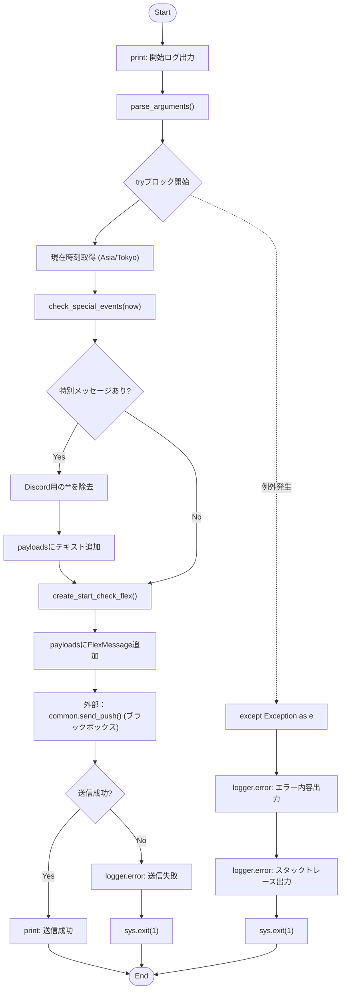
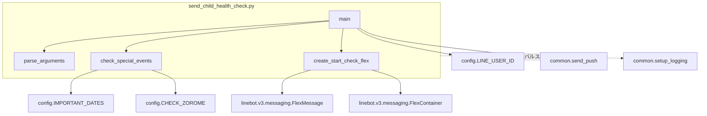

## 1. 解析メタ情報

| 項目 | 内容 |
| --- | --- |
| 対象ファイル | send_child_health_check.py |
| 言語 | Python |
| 解析対象 | 提供されたコードのみ |
| 推測・補完 | 一切なし |

## 2. ファイルの概要

* システムにおいて、朝の子供の体調確認と、当日の記念日（誕生日・周年記念など）やゾロ目の日をチェックし、LINEまたはDiscordの指定された通知先へメッセージ（テキストおよびFlex Message）を送信する責務を持つ。

## 3. 外部依存関係

### インポート一覧

| 名称 | 種類 | 用途 | 根拠 |
| --- | --- | --- | --- |
| `datetime` | 標準ライブラリ | 日付・時刻の取得および文字列からのパース | 根拠: `import datetime` (行番号: 2 / 抜粋: "import datetime") |
| `pytz` | サードパーティ | 日本時間(Asia/Tokyo)のタイムゾーン指定 | 根拠: `import pytz` (行番号: 3 / 抜粋: "import pytz") |
| `traceback` | 標準ライブラリ | 例外発生時のスタックトレース文字列のフォーマット取得 | 根拠: `import traceback` (行番号: 4 / 抜粋: "import traceback") |
| `argparse` | 標準ライブラリ | コマンドライン引数（--target）の定義と解析 | 根拠: `import argparse` (行番号: 5 / 抜粋: "import argparse") |
| `sys` | 標準ライブラリ | エラー時のプログラム異常終了(`sys.exit(1)`) | 根拠: `import sys` (行番号: 6 / 抜粋: "import sys") |
| `config` | 外部モジュール | 記念日リスト、ゾロ目チェックフラグ、ユーザーID等の設定値参照 | 根拠: `import config` (行番号: 7 / 抜粋: "import config") |
| `common` | 外部モジュール | ロガー設定の取得、およびプッシュ通知の送信処理 | 根拠: `import common` (行番号: 8 / 抜粋: "import common") |
| `FlexMessage` | サードパーティ (linebot.v3) | LINE v3 APIにおけるFlex Messageの構築 | 根拠: `FlexMessage,` (行番号: 11 / 抜粋: "FlexMessage,") |
| `FlexContainer` | サードパーティ (linebot.v3) | 辞書データからのFlex Containerオブジェクトの構築 | 根拠: `FlexContainer` (行番号: 12 / 抜粋: "FlexContainer") |

### ブラックボックスとなる外部要素

| 名称 | 理由 | 根拠 |
| --- | --- | --- |
| `config.IMPORTANT_DATES` | オブジェクトの構造や定義内容が提供ファイル内に存在しないため不明。 | 根拠: `for event in config.IMPORTANT_DATES:` (行番号: 28 / 抜粋: "for event in config.IMPORTANT_...") |
| `config.CHECK_ZOROME` | 値の有無およびデフォルト以外の設定状態が不明。 | 根拠: `getattr(config, "CHECK_ZOROME", False)` (行番号: 43 / 抜粋: "getattr(config, "CHECK_ZOROME...") |
| `config.LINE_USER_ID` | 具体的な値やデータ型が提供ファイル内に存在しないため不明。 | 根拠: `common.send_push(config.LINE_USER_ID` (行番号: 120 / 抜粋: "if common.send_push(config.LI...") |
| `common.setup_logging` | 生成されるロガーの実装詳細や出力先が不明。 | 根拠: `logger = common.setup_logging("morning_check")` (行番号: 17 / 抜粋: "logger = common.setup_loggin...") |
| `common.send_push` | ペイロード（FlexMessageオブジェクト等）の処理方法やDiscord対応の変換ロジックが不明。 | 根拠: `common.send_push(config.LINE_USER_ID` (行番号: 120 / 抜粋: "if common.send_push(config.LI...") |

## 4. 主要要素の定義（関数 / エンドポイント / コンポーネント）

### `parse_arguments`

* **役割**: コマンドライン引数を定義・解析し、通知先ターゲット（line または discord）を取得する。
* 根拠: `def parse_arguments():` (行番号: 19〜23 / 抜粋: "def parse_arguments():")

* **引数/リクエスト**: なし
* 根拠: `def parse_arguments():` (行番号: 19 / 抜粋: "def parse_arguments():")

* **戻り値/レスポンス**: `argparse.Namespace` (コマンドライン引数の解析結果オブジェクト)
* 根拠: `return parser.parse_args()` (行番号: 23 / 抜粋: "return parser.parse_args()")

* **副作用**: なし
* 根拠: 該当関数内のコード (行番号: 19〜23 / 抜粋: "parser = argparse.ArgumentPa...")

* **エラーハンドリング**: なし
* 根拠: 該当関数内のコード (行番号: 19〜23 / 抜粋: "parser = argparse.ArgumentPa...")

### `check_special_events`

* **役割**: 指定された日付から `config.IMPORTANT_DATES` を走査し、誕生日・周年記念日・その他の記念日を判定しメッセージを生成する。設定があればゾロ目の日の判定も行う。
* 根拠: `def check_special_events(today):` (行番号: 25〜46 / 抜粋: "def check_special_events(tod...")

* **引数/リクエスト**: `today` (日付情報のオブジェクト、monthとdayとyear属性を持つもの)
* 根拠: `def check_special_events(today):` (行番号: 25 / 抜粋: "def check_special_events(tod...")

* **戻り値/レスポンス**: `str` (生成されたメッセージを改行 `\n\n` で結合した文字列)
* 根拠: `return "\n\n".join(messages)` (行番号: 46 / 抜粋: "return "\n\n".join(messages)")

* **副作用**: なし
* 根拠: 該当関数内のコード (行番号: 25〜46 / 抜粋: "messages = []...")

* **エラーハンドリング**: 記念日の日付パース処理などで例外が発生した場合、`except Exception:` で握りつぶして次の要素の処理へ進む(`continue`)。
* 根拠: `except Exception:` (行番号: 40〜41 / 抜粋: "except Exception:\n    continue")

### `create_start_check_flex`

* **役割**: 「全員元気」「詳細を入力」「記録を確認」の3つのボタンを含む、朝の体調確認用のLINE Flex Messageオブジェクトを生成する。
* 根拠: `def create_start_check_flex():` (行番号: 48〜96 / 抜粋: "def create_start_check_flex()...")

* **引数/リクエスト**: なし
* 根拠: `def create_start_check_flex():` (行番号: 48 / 抜粋: "def create_start_check_flex()...")

* **戻り値/レスポンス**: `linebot.v3.messaging.FlexMessage`
* 根拠: `return FlexMessage(alt_text="朝の体調確認", contents=container)` (行番号: 96 / 抜粋: "return FlexMessage(alt_text=...")

* **副作用**: なし
* 根拠: 該当関数内のコード (行番号: 48〜96 / 抜粋: "bubble_json = {...")

* **エラーハンドリング**: なし
* 根拠: 該当関数内のコード (行番号: 48〜96 / 抜粋: "bubble_json = {...")

### `main`

* **役割**: プログラムのエントリーポイント。現在時刻を取得して記念日確認と体調確認Flexメッセージを生成し、引数で指定されたターゲットへプッシュ通知を送信する。
* 根拠: `def main():` (行番号: 98〜129 / 抜粋: "def main():")

* **引数/リクエスト**: なし
* 根拠: `def main():` (行番号: 98 / 抜粋: "def main():")

* **戻り値/レスポンス**: なし
* 根拠: 該当関数内のコード (行番号: 98〜129 / 抜粋: "print(f"\n🚀 --- Morning Chec...")

* **副作用**:
* 標準出力(`print`)への実行ログ出力
* 外部関数(`common.send_push`)による通知送信
* エラー時のシステム終了(`sys.exit(1)`)
* 根拠: `print(...)` および `common.send_push(...)` および `sys.exit(1)` (行番号: 99, 120, 124, 129 / 抜粋: "print(f"\n🚀 --- Morning Chec...")

* **エラーハンドリング**: 関数全体を `try...except Exception as e` で囲み、何らかの例外が発生した場合はロガーにエラー内容とスタックトレースを記録し、異常終了(`sys.exit(1)`)する。また、`common.send_push` がFalsyな値を返した場合はログを出力し異常終了する。
* 根拠: `except Exception as e:` (行番号: 126〜129 / 抜粋: "except Exception as e:\n    l...")

## 5. 処理フロー図

## 6. 依存関係図

## 7. 次のステップ（リバースエンジニアリングの提案）

| 優先度 | ファイル名(推測可) | 理由 | 根拠 |
| --- | --- | --- | --- |
| 高 | `common.py` | `send_push`が、LINE v3 SDKの `FlexMessage` オブジェクトをどのように処理しているか、Discord指定時に適切にパース・変換できるかを確認する必要があるため。 | 根拠: `common.send_push(config.LINE_USER_ID, payloads, target=target)` (行番号: 120 / 抜粋: "if common.send_push(config.LI...") |
| 中 | `config.py` | `IMPORTANT_DATES`の構造や、`LINE_USER_ID`などの環境依存情報の具体的な形式を把握するため。 | 根拠: `for event in config.IMPORTANT_DATES:` (行番号: 28 / 抜粋: "for event in config.IMPORTANT_...") |

## 8. 保守上の注意点

* `check_special_events` 内において `except Exception: continue` が使用されており、`config.IMPORTANT_DATES` に日付フォーマットの誤りや必須キー(`date`, `type`)の欠損があった場合、エラーが一切ログに残らず暗黙的に無視される構造となっている。
* `main` 内にて `Discord用のMarkdown強調()を除去する` というコメント通り `replace("", "")` を実行しているが、この処理はターゲットがDiscordかどうかにかかわらず無条件に実行され、LINE用のテキストペイロードとして追加されている。
* `common.send_push` に渡す `payloads` リストには、辞書型(`dict`)のテキストメッセージと、オブジェクト型(`FlexMessage`)が混在して格納されている。

## 9. 不明事項一覧

| 項目 | 理由 | 必要なファイル |
| --- | --- | --- |
| 記念日設定のデータ構造 | `config.IMPORTANT_DATES`に定義されている要素が持つべきキー構成(`date`, `name`, `type`等)の全容が不明。 | `config.py` |
| Discord向け通知の挙動 | `create_start_check_flex`で生成されたLINE専用の`FlexMessage`オブジェクトが、`--target discord`の際に`common.send_push`内でどのように処理・変換されるか不明。 | `common.py` |

## 10. 自己検証結果

* [x] 推測・外部ファイルの仕様を一切含んでいない
* [x] 全関数・全クラス・全コンポーネントを列挙した
* [x] 全てのインポート要素を列挙した
* [x] すべての仕様説明に「根拠（行番号・抜粋）」を明記した
* [x] 根拠漏れが0件である
* [x] Mermaid構文にエラーの原因となる記号（エスケープ漏れ）がない
* [x] 不明事項を漏れなく列挙した

完了