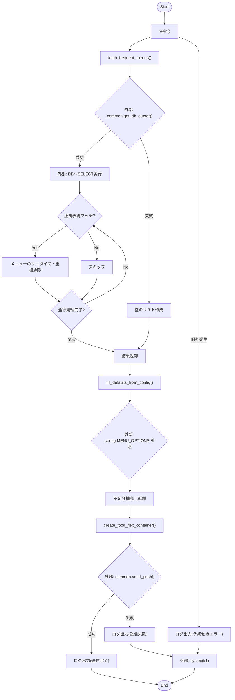
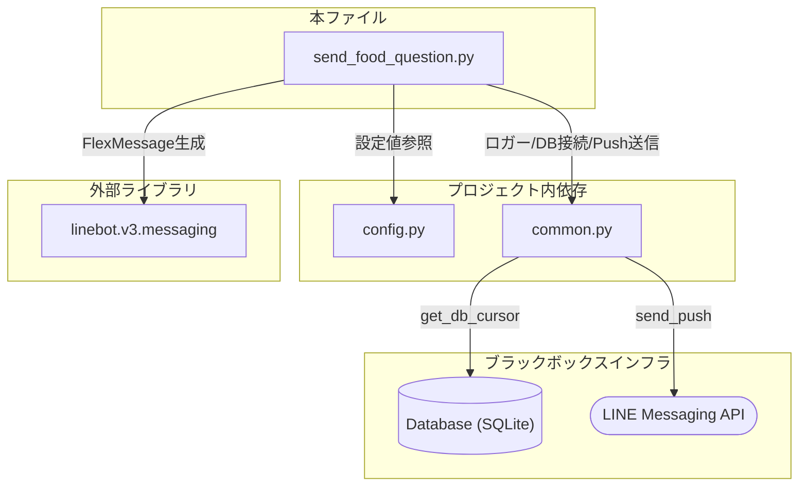

## 1. 解析メタ情報

| 項目 | 内容 |
| --- | --- |
| 対象ファイル | `send_food_question.py` |
| 言語 | Python |
| 解析対象 | 提供されたコードのみ |
| 推測・補完 | 一切なし |

## 2. ファイルの概要

夕食のメニュー（自炊・外食）に関する過去の履歴データをデータベースから集計し、頻出メニューのランキングとデフォルト候補を組み合わせたLINE Flex Messageを構築して、特定のユーザーへプッシュ通知を送信するためのスクリプト。

## 3. 外部依存関係

### インポート一覧

| 名称 | 種類 | 用途 | 根拠 |
| --- | --- | --- | --- |
| `sys` | 標準ライブラリ | システム終了処理（`sys.exit(1)`） | 根拠: [import sys] (行番号: 1 / 抜粋: "import sys") |
| `re` | 標準ライブラリ | 正規表現による文字列解析 | 根拠: [import re] (行番号: 2 / 抜粋: "import re") |
| `datetime` | 標準ライブラリ | 検索対象の日付（N日前）の計算 | 根拠: [import datetime] (行番号: 3 / 抜粋: "import datetime") |
| `typing` | 標準ライブラリ | 型ヒント（`List`, `Tuple`, `Dict`, `Optional`）の定義 | 根拠: [from typing import ...] (行番号: 4 / 抜粋: "from typing import List, Tuple, Dict, Optional") |
| `config` | プロジェクト内モジュール | DBテーブル名、デフォルトメニュー、送信先ユーザーIDの参照 | 根拠: [import config] (行番号: 7 / 抜粋: "import config") |
| `common` | プロジェクト内モジュール | ロガー設定、DBカーソル取得、プッシュ通知送信処理 | 根拠: [import common] (行番号: 8 / 抜粋: "import common") |
| `linebot.v3.messaging` | 外部ライブラリ | LINE Flex Messageのデータ構造の生成 | 根拠: [from linebot.v3...] (行番号: 9 / 抜粋: "from linebot.v3.messaging import FlexMessage") |

### ブラックボックスとなる外部要素

| 名称 | 理由 | 根拠 |
| --- | --- | --- |
| `config`の各定数 | `SQLITE_TABLE_FOOD`, `MENU_OPTIONS`, `LINE_USER_ID` の具体的な値や構造が本ファイル内に定義されていないため。 | 根拠: [config.xxx] (行番号: 51, 93, 179 / 抜粋: "FROM {config.SQLITE_TABLE_FOOD}") |
| `common`の各関数 | `setup_logging`, `get_db_cursor`, `send_push` の内部実装、接続先、認証仕様などが不明なため。 | 根拠: [common.xxx] (行番号: 12, 46, 179 / 抜粋: "with common.get_db_cursor() as cursor:") |

## 4. 主要要素の定義（関数 / エンドポイント / コンポーネント）

### `fetch_frequent_menus`

* **役割**: DBから過去の履歴を集計し、カテゴリ（自炊/外食）ごとの頻出メニューを取得・整形する。
* 根拠: [fetch_frequent_menus] (行番号: 33〜38 / 抜粋: "DBから過去の履歴を集計し、カテゴリごとの頻出メニューを取得する。")

* **引数/リクエスト**: `days`: int （デフォルト値: 30。遡る日数を指定）
* 根拠: [fetch_frequent_menus] (行番号: 33 / 抜粋: "def fetch_frequent_menus(days: int = 30) -> Dict")

* **戻り値/レスポンス**: `Dict[str, List[Tuple[str, int]]]` （カテゴリ名をキーとし、メニュー名と出現回数のタプルのリストを値とする辞書）
* 根拠: [fetch_frequent_menus] (行番号: 33 / 抜粋: "-> Dict[str, List[Tuple[str, int]]]:")

* **副作用**: `common.get_db_cursor()`によるDB読み取り、およびロガーを通じた標準/ファイル出力（推定）。
* 根拠: [fetch_frequent_menus] (行番号: 46 / 抜粋: "with common.get_db_cursor() as cursor:")

* **エラーハンドリング**: `Exception` をキャッチし、エラーログを出力した上でデフォルトの空リストを含む辞書を返す。
* 根拠: [fetch_frequent_menus] (行番号: 80〜82 / 抜粋: "except Exception as e:")

### `fill_defaults_from_config`

* **役割**: DBから取得した頻出メニューのデータ不足分を、`config.MENU_OPTIONS`に定義されたデフォルト候補で指定上限数まで埋める。
* 根拠: [fill_defaults_from_config] (行番号: 85〜88 / 抜粋: "データ不足分を config.MENU_OPTIONS の定義値で埋める。")

* **引数/リクエスト**: `ranked_data`: Dict[str, List[Tuple[str, int]]] （集計済みデータ）, `limit`: int （1カテゴリあたりの最大アイテム数）
* 根拠: [fill_defaults_from_config] (行番号: 85 / 抜粋: "def fill_defaults_from_config(ranked_data: Dict[str, List[Tuple[str, int]]], limit: int)")

* **戻り値/レスポンス**: `Dict[str, List[Tuple[str, int]]]` （デフォルト値が補充されたデータ）
* 根拠: [fill_defaults_from_config] (行番号: 85 / 抜粋: "-> Dict[str, List[Tuple[str, int]]]:")

* **副作用**: なし
* 根拠: [fill_defaults_from_config] (行番号: 85〜101 / 抜粋: "return ranked_data")

* **エラーハンドリング**: なし
* 根拠: [fill_defaults_from_config] (行番号: 85〜101 / 抜粋: "return ranked_data")

### `create_food_flex_container`

* **役割**: ランキングデータをもとに、LINE Bot用のFlex Messageコンテナ（UI要素）を構築する。
* 根拠: [create_food_flex_container] (行番号: 104〜105 / 抜粋: "Flex Messageのコンテナを構築 (UI生成)")

* **引数/リクエスト**: `ranked_data`: Dict[str, List[Tuple[str, int]]] （表示対象のメニューデータ）
* 根拠: [create_food_flex_container] (行番号: 104 / 抜粋: "def create_food_flex_container(ranked_data: Dict[str, List[Tuple[str, int]]])")

* **戻り値/レスポンス**: `FlexContainer` （linebot.v3.messagingのUIコンテナオブジェクト）
* 根拠: [create_food_flex_container] (行番号: 104 / 抜粋: "-> FlexContainer:")

* **副作用**: なし
* 根拠: [create_food_flex_container] (行番号: 104〜164 / 抜粋: "return FlexContainer.from_dict(bubble)")

* **エラーハンドリング**: なし
* 根拠: [create_food_flex_container] (行番号: 104〜164 / 抜粋: "return FlexContainer.from_dict(bubble)")

### `main`

* **役割**: データ取得、デフォルト値の充填、メッセージ構築、そして実際の送信処理までの一連のフローを制御する。
* 根拠: [main] (行番号: 167〜189 / 抜粋: "1. データ取得 ... 2. デフォルト値充填 ... 3. Flex Message構築 ... 4. 送信")

* **引数/リクエスト**: なし
* 根拠: [main] (行番号: 167 / 抜粋: "def main():")

* **戻り値/レスポンス**: なし
* 根拠: [main] (行番号: 167 / 抜粋: "def main():")

* **副作用**: `common.send_push()`の実行による外部API（LINE）への通信。システム終了（`sys.exit`）の実行。
* 根拠: [main] (行番号: 179〜189 / 抜粋: "if common.send_push(config.LINE_USER_ID, [msg], target="line"):")

* **エラーハンドリング**: `common.send_push()`が`False`を返した場合、および予期せぬ`Exception`が発生した場合にエラーログを出力し、`sys.exit(1)`でプロセスを異常終了する。
* 根拠: [main] (行番号: 182〜188 / 抜粋: "sys.exit(1)")

## 5. 処理フロー図

## 6. 依存関係図

## 7. 次のステップ（リバースエンジニアリングの提案）

| 優先度 | ファイル名(推測可) | 理由 | 根拠 |
| --- | --- | --- | --- |
| 高 | `config.py` | `SQLITE_TABLE_FOOD`や`MENU_OPTIONS`の定義が不明確だと、DBスキーマやデフォルト動作の全体像を正確に把握できないため。 | 根拠: [configの参照箇所] (行番号: 51, 93 / 抜粋: "FROM {config.SQLITE_TABLE_FOOD}") |
| 高 | `common.py` | `get_db_cursor`の実装（接続先DB、トランザクションの扱い）や、`send_push`の通信仕様（エラーリトライの有無など）がブラックボックスになっているため。 | 根拠: [commonの参照箇所] (行番号: 46, 179 / 抜粋: "with common.get_db_cursor() as cursor:") |

## 8. 保守上の注意点

* **エラー処理による強制終了**: `main`関数内にて、Push送信の失敗時や例外発生時に`sys.exit(1)`を呼び出しています。このスクリプトが他のプロセスやスケジューラーから呼び出される場合、呼び出し元プロセスに終了ステータス1が伝播します。
* **データフォーマットへの依存**: `fetch_frequent_menus`内で正規表現 `pattern = re.compile(r"^([^:]+):(.+)")` を用いており、DBの`menu_category`カラムが「カテゴリ:メニュー」の形式であることを強く前提としています。形式が異なるレコードはスキップされます。
* **DBカーソルの仕様依存**: `cursor.fetchall()`で取得した`row`オブジェクトに対して`row["menu_category"]`のように辞書アクセスを行っており、`get_db_cursor`が返すカーソルが`sqlite3.Row`（または同等の辞書型アクセスをサポートするオブジェクト）であることを前提としています。

## 9. 不明事項一覧

| 項目 | 理由 | 必要なファイル |
| --- | --- | --- |
| DBの正確なスキーマ | `timestamp`, `menu_category`カラムの存在はコードから確認できるが、その他のカラム定義やテーブル名が不明なため。 | `config.py` および DBマイグレーションファイル |
| `MENU_OPTIONS`のデータ構造 | デフォルトメニューを埋める処理で`getattr(config, "MENU_OPTIONS", {}).get(cat, [])`と呼び出しているが、中身の具体値が不明なため。 | `config.py` |
| プッシュ通知の送信仕様 | `common.send_push`がどのようなプロトコルでLINE APIを叩いているか、再送処理を含んでいるかが不明なため。 | `common.py` |

## 10. 自己検証結果

* [x] 完了: 推測・外部ファイルの仕様を一切含んでいない
* [x] 完了: 全関数・全クラス・全コンポーネントを列挙した
* [x] 完了: 全てのインポート要素を列挙した
* [x] 完了: すべての仕様説明に「根拠（行番号・抜粋）」を明記した
* [x] 完了: 根拠漏れが0件である
* [x] 完了: Mermaid構文にエラーの原因となる記号（エスケープ漏れ）がない
* [x] 完了: 不明事項を漏れなく列挙した