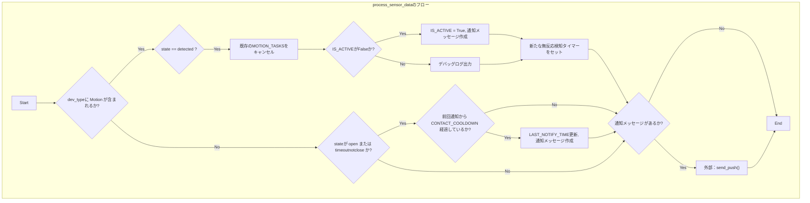
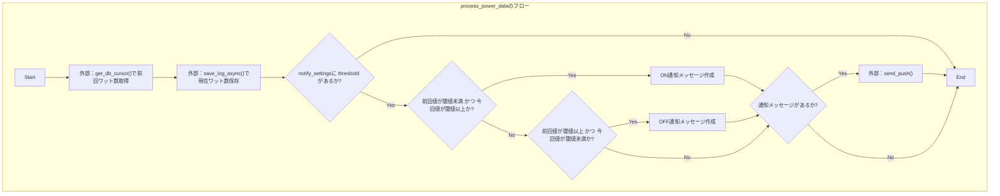
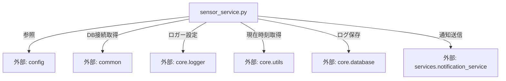

## 1. 解析メタ情報

| 項目 | 内容 |
| --- | --- |
| 対象ファイル | `sensor_service.py` |
| 言語 | Python |
| 解析対象 | 提供されたコードのみ |
| 推測・補完 | 一切なし |

## 2. ファイルの概要

* センサーおよび電力計からのデータ受信（Webhook・ポーリング）を処理し、重複排除、状態管理、ログ保存、条件に応じた通知送信を行う責務を持つ。

## 3. 外部依存関係

### インポート一覧

| 名称 | 種類 | 用途 | 根拠 |
| --- | --- | --- | --- |
| `asyncio` | 標準ライブラリ | 非同期処理、タスク作成、スリープ処理用。 | `[import asyncio]` (行番号取得不可 / 抜粋: "import asyncio") |
| `time` | 標準ライブラリ | 現在時刻のタイムスタンプ取得用。 | `[import time]` (行番号取得不可 / 抜粋: "import time") |
| `Dict, Optional, List, Any` | 標準ライブラリ (`typing`) | 型アノテーション用。 | `[from typing]` (行番号取得不可 / 抜粋: "from typing import Dict, Optio") |
| `config` | 外部モジュール | 定数（LINE_USER_IDやDBテーブル名など）の参照用。 | `[import config]` (行番号取得不可 / 抜粋: "import config") |
| `common` | 外部モジュール | データベースカーソル取得用（`get_db_cursor`）。 | `[import common]` (行番号取得不可 / 抜粋: "import common") |
| `setup_logging` | 外部モジュール (`core.logger`) | ロガーの初期化用。 | `[from core.logger]` (行番号取得不可 / 抜粋: "from core.logger import setup_") |
| `get_now_iso` | 外部モジュール (`core.utils`) | 現在時刻のISO形式文字列取得用。 | `[from core.utils]` (行番号取得不可 / 抜粋: "from core.utils import get_now") |
| `save_log_async` | 外部モジュール (`core.database`) | 非同期でのデータベース保存処理用。 | `[from core.database]` (行番号取得不可 / 抜粋: "from core.database import save") |
| `send_push` | 外部モジュール (`services.notification_service`) | プッシュ通知送信処理用。 | `[from services.notification...]` (行番号取得不可 / 抜粋: "from services.notification_ser") |

### ブラックボックスとなる外部要素

| 名称 | 理由 | 根拠 |
| --- | --- | --- |
| `config` 内の各定数 | `LINE_USER_ID`、`SQLITE_TABLE_SWITCHBOT_LOGS`、`SQLITE_TABLE_POWER_USAGE` の具体的な値や型が提供されていないため。 | `[config.LINE_USER_ID]` (行番号取得不可 / 抜粋: "config.LINE_USER_ID, ") |
| `common.get_db_cursor` | DB接続の具体的な実装、扱うデータベースエンジン、コンテキストマネージャが返すカーソルオブジェクトの仕様が不明であるため。 | `[common.get_db_cursor]` (行番号取得不可 / 抜粋: "with common.get_db_cursor() as") |
| `core.database.save_log_async` | テーブル名、カラムリスト、値を渡した際の内部でのクエリ生成ロジックやエラーハンドリングの挙動が不明であるため。 | `[save_log_async]` (行番号取得不可 / 抜粋: "await save_log_async(") |
| `services.notification_service.send_push` | メッセージ形式の仕様、引数として渡す `"discord"` や `"notify"` の処理分岐、外部API連携の実装が不明であるため。 | `[send_push]` (行番号取得不可 / 抜粋: "send_push,") |

## 4. 主要要素の定義（関数 / エンドポイント / コンポーネント）

### `is_duplicate_webhook`

* **役割**: インメモリキャッシュ（`EVENT_CACHE`）を参照し、直近イベントから `DEDUPE_TTL_SECONDS`（3秒）以内で同一ステータスの場合は重複と判定しキャッシュを更新する。
* 根拠: `[is_duplicate_webhook]` (行番号取得不可 / 抜粋: "last_event['state'] == state a")

* **引数/リクエスト**: `mac: str`, `state: str`, `event_timestamp: float`
* 根拠: `[is_duplicate_webhook]` (行番号取得不可 / 抜粋: "def is_duplicate_webhook(mac: ")

* **戻り値/レスポンス**: `bool`
* 根拠: `[is_duplicate_webhook]` (行番号取得不可 / 抜粋: ") -> bool:")

* **副作用**: グローバル変数 `EVENT_CACHE` への書き込みおよび更新。
* 根拠: `[is_duplicate_webhook]` (行番号取得不可 / 抜粋: "EVENT_CACHE[mac] = {")

* **エラーハンドリング**: なし
* 根拠: `[is_duplicate_webhook]` (行番号取得不可 / 抜粋: "def is_duplicate_webhook(mac: ")

### `send_inactive_notification`

* **役割**: 指定された時間待機後、動きが止まった旨の通知を送信し、タスク状態をクリアする。
* 根拠: `[send_inactive_notification]` (行番号取得不可 / 抜粋: "msg: str = f"💤【{location}・見守")

* **引数/リクエスト**: `mac: str`, `name: str`, `location: str`, `timeout: int`
* 根拠: `[send_inactive_notification]` (行番号取得不可 / 抜粋: "def send_inactive_notification")

* **戻り値/レスポンス**: `None`
* 根拠: `[send_inactive_notification]` (行番号取得不可 / 抜粋: ") -> None:")

* **副作用**: `asyncio.sleep` による待機、`send_push` による外部API呼び出し、グローバル変数 `IS_ACTIVE` の更新、`MOTION_TASKS` からの要素削除。
* 根拠: `[send_inactive_notification]` (行番号取得不可 / 抜粋: "del MOTION_TASKS[mac]")

* **エラーハンドリング**: `asyncio.CancelledError` をキャッチし、デバッグログを出力する。
* 根拠: `[send_inactive_notification]` (行番号取得不可 / 抜粋: "except asyncio.CancelledError:")

### `process_sensor_data`

* **役割**: モーションセンサーまたは開閉センサーの状態変化を検知し、必要に応じて通知送信や無反応検知タイマーのセット・キャンセルを行う。
* 根拠: `[process_sensor_data]` (行番号取得不可 / 抜粋: "if dev_type and 'Motion' in de")

* **引数/リクエスト**: `mac: str`, `name: str`, `location: str`, `dev_type: str`, `state: str`
* 根拠: `[process_sensor_data]` (行番号取得不可 / 抜粋: "def process_sensor_data(mac: s")

* **戻り値/レスポンス**: `None`
* 根拠: `[process_sensor_data]` (行番号取得不可 / 抜粋: ") -> None:")

* **副作用**: グローバル変数 `MOTION_TASKS` のキャンセル・新規タスク追加、`IS_ACTIVE` および `LAST_NOTIFY_TIME` の更新、`send_push` を用いた外部API呼び出し。
* 根拠: `[process_sensor_data]` (行番号取得不可 / 抜粋: "MOTION_TASKS[mac] = asyncio.cr")

* **エラーハンドリング**: なし
* 根拠: `[process_sensor_data]` (行番号取得不可 / 抜粋: "def process_sensor_data(mac: s")

### `cancel_all_tasks`

* **役割**: 起動中のすべての見守りタイマータスクをキャンセルする。
* 根拠: `[cancel_all_tasks]` (行番号取得不可 / 抜粋: "for t in MOTION_TASKS.values()")

* **引数/リクエスト**: なし
* 根拠: `[cancel_all_tasks]` (行番号取得不可 / 抜粋: "def cancel_all_tasks() -> None")

* **戻り値/レスポンス**: `None`
* 根拠: `[cancel_all_tasks]` (行番号取得不可 / 抜粋: "def cancel_all_tasks() -> None")

* **副作用**: グローバル変数 `MOTION_TASKS` に保持されている各タスクの `cancel()` 実行。
* 根拠: `[cancel_all_tasks]` (行番号取得不可 / 抜粋: "t.cancel()")

* **エラーハンドリング**: なし
* 根拠: `[cancel_all_tasks]` (行番号取得不可 / 抜粋: "def cancel_all_tasks() -> None")

### `process_meter_data`

* **役割**: 温湿度計のデータをDBに保存する。
* 根拠: `[process_meter_data]` (行番号取得不可 / 抜粋: "await save_log_async(")

* **引数/リクエスト**: `device_id: str`, `device_name: str`, `temp: float`, `humidity: float`
* 根拠: `[process_meter_data]` (行番号取得不可 / 抜粋: "def process_meter_data(device_")

* **戻り値/レスポンス**: `None`
* 根拠: `[process_meter_data]` (行番号取得不可 / 抜粋: "-> None:")

* **副作用**: `save_log_async` を介した外部DBへの書き込み。
* 根拠: `[process_meter_data]` (行番号取得不可 / 抜粋: "await save_log_async(")

* **エラーハンドリング**: なし
* 根拠: `[process_meter_data]` (行番号取得不可 / 抜粋: "def process_meter_data(device_")

### `process_power_data`

* **役割**: 電力データをDBに保存し、前回記録された値と閾値を比較して閾値を跨いだ場合（ON/OFF）に使用開始/終了の通知を送信する。
* 根拠: `[process_power_data]` (行番号取得不可 / 抜粋: "prev_wattage < threshold and w")

* **引数/リクエスト**: `device_id: str`, `device_name: str`, `wattage: float`, `notify_settings: Dict[str, Any]`
* 根拠: `[process_power_data]` (行番号取得不可 / 抜粋: "def process_power_data(device_")

* **戻り値/レスポンス**: `None`
* 根拠: `[process_power_data]` (行番号取得不可 / 抜粋: "-> None:")

* **副作用**: `common.get_db_cursor` による外部DBからの読み取り、`save_log_async` による外部DBへの書き込み、`send_push` による外部API呼び出し。
* 根拠: `[process_power_data]` (行番号取得不可 / 抜粋: "await save_log_async(")

* **エラーハンドリング**: DBからの前回値取得時に発生する全ての `Exception` をキャッチし、ログに記録した上で前回値を `0.0` として処理を続行する。
* 根拠: `[process_power_data]` (行番号取得不可 / 抜粋: "except Exception as e:")

## 5. 処理フロー図

## 6. 依存関係図

## 7. 次のステップ（リバースエンジニアリングの提案）

| 優先度 | ファイル名(推測可) | 理由 | 根拠 |
| --- | --- | --- | --- |
| 高 | `config.py` | 通知先ユーザーIDや保存先DBテーブル名などの具体的な設定値・構造を把握するため。 | `[インポート]` (行番号取得不可 / 抜粋: "import config") |
| 中 | `core/database.py` | ログデータの具体的な保存形式、発行されるSQLクエリ、対応しているDBエンジンを特定するため。 | `[インポート]` (行番号取得不可 / 抜粋: "from core.database import save") |
| 中 | `services/notification_service.py` | 通知がどのように外部サービス（LINE, Discord等）へ送出されるかのロジックとエラー処理を確認するため。 | `[インポート]` (行番号取得不可 / 抜粋: "from services.notification_ser") |

## 8. 保守上の注意点

* `EVENT_CACHE`, `IS_ACTIVE`, `MOTION_TASKS` などの状態がインメモリ（グローバル変数）で管理されているため、アプリケーションプロセスの再起動によりこれらの状態が初期化・喪失される。
* `process_power_data` 内で、データベースの読み取りを行う同期関数（`_fetch_prev_wattage`）が `asyncio.to_thread` を用いて呼び出されている。
* `MOTION_TASKS` に追加された非同期タスクは、条件により `cancel()` されない限りバックグラウンドで指定された時間（`MOTION_TIMEOUT`）実行され続ける。
* `process_power_data` 内の例外処理は `Exception` を広範にキャッチしており、DB取得時のあらゆるエラーがログ記録のみで通過し、`prev_wattage` は `0.0` として処理が続行される仕様となっている。
* DBから取得したレコード（`row`）に対し、辞書アクセス（`row['wattage']`）が失敗した場合にインデックスアクセス（`row[0]`）でフォールバックを試行する処理が存在する。

## 9. 不明事項一覧

| 項目 | 理由 | 必要なファイル |
| --- | --- | --- |
| `config` 内の各種定数値 | 提供されたコード内に具体的な値の定義が含まれていないため。 | `config.py` |
| データベースへの接続および保存の実態 | `common.get_db_cursor` と `save_log_async` の内部実装が不明であるため。 | `common.py`, `core/database.py` |
| `send_push` の送信先プラットフォーム仕様 | `target_platform` として "discord" や "notify" が指定されているが、それぞれの連携先や実際の送信フォーマットが不明であるため。 | `services/notification_service.py` |
| `notify_settings` の全容 | `process_power_data` の引数として渡される辞書に `threshold` や `target` 以外のキーが存在するか不明であるため。 | 呼び出し元のファイル |

## 10. 自己検証結果

* [x] 推測・外部ファイルの仕様を一切含んでいない
* [x] 全関数・全クラス・全コンポーネントを列挙した
* [x] 全てのインポート要素を列挙した
* [x] すべての仕様説明に「根拠（行番号・抜粋）」を明記した
* [x] 根拠漏れが0件である
* [x] Mermaid構文にエラーの原因となる記号（エスケープ漏れ）がない
* [x] 不明事項を漏れなく列挙した
完了