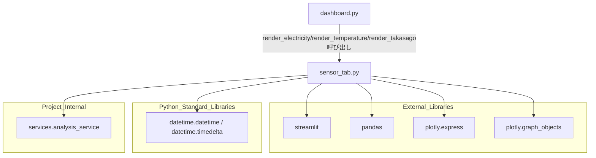

## 1. 解析メタ情報

| 項目 | 内容 |
| --- | --- |
| 対象ファイル | `views/dashboard/sensor_tab.py` |
| 言語 | Python |
| 解析対象 | 提供されたコードのみ |
| 推測・補完 | 一切なし |

## 関連ドキュメント

* [analysis_service.md](./analysis_service.md) - `services.analysis_service`の実体。`load_yearly_temperature_stats`を提供
* [dashboard.md](./dashboard.md) - 呼び出し元。`views.dashboard.sensor_tab`をインポートし、電力・気温詳細・高砂実家の3タブとして`render_electricity`, `render_temperature`, `render_takasago`を呼び出す

## 2. ファイルの概要

* Streamlitダッシュボードの「電力・環境」「気温詳細」「高砂実家」タブを描画するモジュール。3つの公開関数`render_electricity`, `render_temperature`, `render_takasago`で構成される。
* 根拠: `def render_electricity(df_sensor: pd.DataFrame, now: datetime):`, `def render_temperature(df_sensor: pd.DataFrame, now: datetime):`, `def render_takasago(df_sensor: pd.DataFrame):` (行番号: 9, 56, 106 / 抜粋: "def render_electricity(df_sensor: pd.DataFrame, now: datetime):")
* `render_electricity`は、渡された`df_sensor`から「Nature Remo E Lite」デバイスの消費電力を今日・昨日で重ねた折れ線グラフ、および「Plug」を含むデバイスタイプの本日の個別家電電力を表示する。
* 根拠: `df_sensor["device_type"] == "Nature Remo E Lite"` (行番号: 23 / 抜粋: "(df_sensor[\"device_type\"] == \"Nature Remo E Lite\") &"), `df_sensor["device_type"].str.contains("Plug", na=False)` (行番号: 46 / 抜粋: "(df_sensor[\"device_type\"].str.contains(\"Plug\", na=False)) &")
* `render_temperature`は、「Meter」を含むデバイスタイプの本日の室温・湿度推移を折れ線グラフで表示し、加えて`analysis_service.load_yearly_temperature_stats`から取得した年間の室内外最高/最低気温推移を表示する。
* 根拠: `df_sensor["device_type"].str.contains("Meter", na=False)` (行番号: 66 / 抜粋: "(df_sensor[\"device_type\"].str.contains(\"Meter\", na=False)) &"), `df_yearly = analysis_service.load_yearly_temperature_stats(now.year)` (行番号: 89 / 抜粋: "df_yearly = analysis_service.load_yearly_temperature_stats(now.year)")
* `render_takasago`は、`df_sensor`のうち`location`が「高砂」であるレコードを最大50件、開閉・接触状態とともに表形式表示する。
* 根拠: `df_sensor[df_sensor["location"] == "高砂"][["timestamp", "friendly_name", "contact_state"]].head(50)` (行番号: 111 / 抜粋: "df_sensor[df_sensor[\"location\"] == \"高砂\"][[\"timestamp\", \"friendly_name\", \"contact_state\"]].head(50)")

## 3. 外部依存関係

### インポート一覧

| 名称 | 種類 | 用途 | 根拠 |
| --- | --- | --- | --- |
| `streamlit` | 外部ライブラリ | UI描画全般（カラム、サブヘッダー、グラフ表示、データフレーム等） | `import streamlit as st` (行番号: 2 / 抜粋: "import streamlit as st") |
| `pandas` | 外部ライブラリ | 各関数の引数型注釈（`pd.DataFrame`）およびフィルタ処理 | `import pandas as pd` (行番号: 3 / 抜粋: "import pandas as pd") |
| `plotly.express` | 外部ライブラリ | 個別家電・室温・湿度の折れ線グラフ生成 | `import plotly.express as px` (行番号: 4 / 抜粋: "import plotly.express as px") |
| `plotly.graph_objects` | 外部ライブラリ | 消費電力（今日vs昨日）・年間気温推移のグラフ生成（複数トレースの手動構築） | `import plotly.graph_objects as go` (行番号: 5 / 抜粋: "import plotly.graph_objects as go") |
| `datetime`, `timedelta` | 標準ライブラリ | `datetime`は`render_electricity`/`render_temperature`の`now`引数型注釈、`timedelta`は日付範囲計算に使用 | `from datetime import datetime, timedelta` (行番号: 6 / 抜粋: "from datetime import datetime, timedelta") |
| `analysis_service` | 内部モジュール | 年間気温統計データの取得 | `from services import analysis_service` (行番号: 7 / 抜粋: "from services import analysis_service") |

### ブラックボックスとなる外部要素

| 名称 | 理由 | 根拠 |
| --- | --- | --- |
| `analysis_service.load_yearly_temperature_stats(now.year)` | `services.analysis_service`の実装が提供されておらず、年間気温統計データの取得元・生成ロジック（`out_max`, `out_min`, `in_max`, `in_min`, `date`列以外の内容含む）が不明。 | `df_yearly = analysis_service.load_yearly_temperature_stats(now.year)` (行番号: 89 / 抜粋: "df_yearly = analysis_service.load_yearly_temperature_stats(now.year)") |

## 4. 主要要素の定義（関数 / エンドポイント / コンポーネント）

### `render_electricity`

* **役割**: 「Nature Remo E Lite」デバイスの今日・昨日の消費電力を1つのグラフに重ねて表示（2カラムの左）し、「Plug」を含むデバイスの本日の個別電力推移を表示（2カラムの右）する。
* 根拠: `def render_electricity(df_sensor: pd.DataFrame, now: datetime):` (行番号: 9〜54 / 抜粋: "def render_electricity(df_sensor: pd.DataFrame, now: datetime):")

* **引数/リクエスト**: `df_sensor` (型: `pd.DataFrame`。`device_type`, `timestamp`, `power_watts`, `friendly_name`列を含むセンサーデータ)、`now` (型: `datetime`。基準となる現在時刻)
* 根拠: `def render_electricity(df_sensor: pd.DataFrame, now: datetime):` (行番号: 9 / 抜粋: "def render_electricity(df_sensor: pd.DataFrame, now: datetime):")

* **戻り値/レスポンス**: なし（`df_sensor`が空の場合は`st.info`表示後に早期`return`）
* 根拠: `if df_sensor.empty:\n        st.info("データがありません")\n        return` (行番号: 11〜13 / 抜粋: "if df_sensor.empty:")

* **副作用**: `st.columns`, `st.subheader`, `st.plotly_chart`, `st.info`によるStreamlit画面への描画。外部データ取得は行わず、渡された`df_sensor`の日時フィルタ・グラフ生成のみを行う。
* 根拠: `st.plotly_chart(fig, width="stretch")` (行番号: 39 / 抜粋: "st.plotly_chart(fig, width=\"stretch\")")

* **エラーハンドリング**: なし（明示的な例外捕捉は行われていない）
* 根拠: `def render_electricity(df_sensor: pd.DataFrame, now: datetime):` 全体 (行番号: 9〜54 / 抜粋: "def render_electricity(df_sensor: pd.DataFrame, now: datetime):")

### `render_temperature`

* **役割**: 本日の室温・湿度推移（「Meter」を含むデバイスタイプ）を2カラムで表示し、加えて年間の室内外気温統計（`analysis_service`経由）を折れ線グラフで表示する。
* 根拠: `def render_temperature(df_sensor: pd.DataFrame, now: datetime):` (行番号: 56〜104 / 抜粋: "def render_temperature(df_sensor: pd.DataFrame, now: datetime):")

* **引数/リクエスト**: `df_sensor` (型: `pd.DataFrame`。`device_type`, `timestamp`, `temperature_celsius`, `humidity_percent`, `friendly_name`列を含むセンサーデータ)、`now` (型: `datetime`。基準時刻・年間データ取得の対象年)
* 根拠: `def render_temperature(df_sensor: pd.DataFrame, now: datetime):` (行番号: 56 / 抜粋: "def render_temperature(df_sensor: pd.DataFrame, now: datetime):")

* **戻り値/レスポンス**: なし（`df_sensor`が空、または`device_type`列が存在しない場合は`st.info`表示後に早期`return`）
* 根拠: `if df_sensor.empty or "device_type" not in df_sensor.columns:\n        st.info("データがありません")\n        return` (行番号: 58〜60 / 抜粋: "if df_sensor.empty or \"device_type\" not in df_sensor.columns:")

* **副作用**: `analysis_service.load_yearly_temperature_stats(now.year)`経由の外部データ取得。`st.columns`, `st.subheader`, `st.plotly_chart`, `st.markdown`, `st.info`によるUI描画。
* 根拠: `df_yearly = analysis_service.load_yearly_temperature_stats(now.year)` (行番号: 89 / 抜粋: "df_yearly = analysis_service.load_yearly_temperature_stats(now.year)")

* **エラーハンドリング**: なし（明示的な例外捕捉は行われていない。年間データが空の場合は`st.info`表示のみ）
* 根拠: `else:\n        st.info("年間データがまだありません。")` (行番号: 103〜104 / 抜粋: "st.info(\"年間データがまだありません。\")")

### `render_takasago`

* **役割**: `df_sensor`のうち`location`が「高砂」（実家）であるレコードを最大50件、時刻・デバイス名・接触状態とともに表形式表示する。
* 根拠: `def render_takasago(df_sensor: pd.DataFrame):` (行番号: 106〜113 / 抜粋: "def render_takasago(df_sensor: pd.DataFrame):")

* **引数/リクエスト**: `df_sensor` (型: `pd.DataFrame`。`location`, `timestamp`, `friendly_name`, `contact_state`列を含むセンサーデータ)
* 根拠: `def render_takasago(df_sensor: pd.DataFrame):` (行番号: 106 / 抜粋: "def render_takasago(df_sensor: pd.DataFrame):")

* **戻り値/レスポンス**: なし（`df_sensor`が空の場合は何も描画しない）
* 根拠: `if not df_sensor.empty:` (行番号: 108 / 抜粋: "if not df_sensor.empty:")

* **副作用**: `st.subheader`, `st.dataframe`によるStreamlit画面への描画。
* 根拠: `st.dataframe(\n            df_sensor[df_sensor["location"] == "高砂"][...]head(50),\n            width="stretch",\n        )` (行番号: 110〜113 / 抜粋: "st.dataframe(")

* **エラーハンドリング**: なし（明示的な例外捕捉は行われていない）
* 根拠: `def render_takasago(df_sensor: pd.DataFrame):` 全体 (行番号: 106〜113 / 抜粋: "def render_takasago(df_sensor: pd.DataFrame):")

## 5. 処理フロー図

```mermaid
flowchart TD
    subgraph render_electricity_Flow["render_electricity() 処理フロー"]
        RE1["開始"] --> RE2{"df_sensorが空か"}
        RE2 -- Yes --> RE3["info表示 + return"]
        RE2 -- No --> RE4["今日/昨日の日付範囲を計算"]
        RE4 --> RE5["col_left: Nature Remo E Liteデータを抽出"]
        RE5 --> RE6{"今日または昨日のデータが存在するか"}
        RE6 -- Yes --> RE7["go.Figureで今日/昨日を重ねて折れ線グラフ表示"]
        RE6 -- No --> RE8["info表示"]
        RE7 --> RE9
        RE8 --> RE9["col_right: Plugデータを抽出"]
        RE9 --> RE10{"df_appが空でないか"}
        RE10 -- Yes --> RE11["px.lineで個別家電グラフ表示"]
        RE10 -- No --> RE12["info表示"]
        RE11 --> RE13["終了"]
        RE12 --> RE13
    end

    subgraph render_temperature_Flow["render_temperature() 処理フロー"]
        RT1["開始"] --> RT2{"df_sensorが空 or device_type列なしか"}
        RT2 -- Yes --> RT3["info表示 + return"]
        RT2 -- No --> RT4["Meterデータを本日分抽出"]
        RT4 --> RT5["col1: 室温グラフ / col2: 湿度グラフ"]
        RT5 --> RT6["外部: analysis_service.load_yearly_temperature_stats(now.year)"]
        RT6 --> RT7{"df_yearlyが空でないか"}
        RT7 -- Yes --> RT8["各列(out_max等)の有無を確認しgo.Figureへトレース追加"]
        RT7 -- No --> RT9["info表示"]
        RT8 --> RT10["終了"]
        RT9 --> RT10
    end

    subgraph render_takasago_Flow["render_takasago() 処理フロー"]
        RTa1["開始"] --> RTa2{"df_sensorが空でないか"}
        RTa2 -- Yes --> RTa3["高砂で絞り込みdataframe表示(最大50件)"]
        RTa2 -- No --> RTa4["終了 (何も描画しない)"]
        RTa3 --> RTa4
    end
```

## 6. 依存関係図

## 7. 次のステップ（リバースエンジニアリングの提案）

| 優先度 | ファイル名(推測可) | 理由 | 根拠 |
| --- | --- | --- | --- |
| 高 | `services/analysis_service.py` | `load_yearly_temperature_stats`が返す年間気温統計データの正確な生成ロジック・スキーマを把握するため。 | `df_yearly = analysis_service.load_yearly_temperature_stats(now.year)` (行番号: 89 / 抜粋: "df_yearly = analysis_service.load_yearly_temperature_stats(now.year)") |
| 中 | `dashboard.py` | 各関数に渡される`df_sensor`, `now`引数の生成元・スキーマ（`device_type`の実際の値一覧等）を確認するため（既に`dashboard.md`で一部解析済み）。 | `def render_electricity(df_sensor: pd.DataFrame, now: datetime):` (行番号: 9 / 抜粋: "def render_electricity(df_sensor: pd.DataFrame, now: datetime):") |

## 8. 保守上の注意点

* **デバイスタイプ文字列のハードコード**: `"Nature Remo E Lite"`, `"Plug"`, `"Meter"`といったデバイスタイプの判定文字列が各関数内に直接埋め込まれており、これらの文字列が実際のデバイスマスタと一致しなくなった場合、グラフが空になっても気づきにくい。
* 根拠: `df_sensor["device_type"] == "Nature Remo E Lite"` (行番号: 23 / 抜粋: "(df_sensor[\"device_type\"] == \"Nature Remo E Lite\") &"), `df_sensor["device_type"].str.contains("Plug", na=False)` (行番号: 46 / 抜粋: "(df_sensor[\"device_type\"].str.contains(\"Plug\", na=False)) &")

* **`render_temperature`のみ列存在チェックあり**: `render_temperature`は`"device_type" not in df_sensor.columns`を明示的にチェックしているが、`render_electricity`・`render_takasago`は同様のチェックを行わずに`df_sensor["device_type"]`や`df_sensor["location"]`へ直接アクセスしており、列が存在しない`DataFrame`が渡された場合に`KeyError`となる可能性がある（3関数間でのチェック方針が不統一）。
* 根拠: `if df_sensor.empty or "device_type" not in df_sensor.columns:` (行番号: 58 / 抜粋: "if df_sensor.empty or \"device_type\" not in df_sensor.columns:"), `df_sensor[df_sensor["location"] == "高砂"]` （列存在チェックなし） (行番号: 111 / 抜粋: "df_sensor[df_sensor[\"location\"] == \"高砂\"]")

* **エラーハンドリングの欠如**: 3関数のいずれにも`try/except`による例外捕捉がなく、`analysis_service.load_yearly_temperature_stats`が例外を送出した場合、タブ全体の描画が中断する可能性がある。
* 根拠: `def render_temperature(df_sensor: pd.DataFrame, now: datetime):` 全体 (行番号: 56〜104 / 抜粋: "def render_temperature(df_sensor: pd.DataFrame, now: datetime):")

## 9. 不明事項一覧

| 項目 | 理由 | 必要なファイル |
| --- | --- | --- |
| `analysis_service.load_yearly_temperature_stats`の実装・スキーマ | `services.analysis_service`の実装が提供されていないため。 | `services/analysis_service.py` |
| `df_sensor`の`device_type`列に実際に含まれる値の一覧 | センサーデータの生成元・スキーマ定義が本ファイルからは不明。 | `services/analysis_service.py` およびDBスキーマ定義 |

## 相互参照による補足情報

| 元の不明事項 | 判明した内容 | 参照元ドキュメント |
| --- | --- | --- |
| `analysis_service.load_yearly_temperature_stats`の実装・スキーマ | `MY_HOME_SYSTEM/services/analysis_service.py`を直接確認した。`load_yearly_temperature_stats(year: int, location: str = "伊丹") -> pd.DataFrame`(267-326行目)は、`weather_history`テーブルから`location`・年範囲に該当する`date, max_temp as out_max, min_temp as out_min`を取得し(274-279行目)、`config.MONITOR_DEVICES`から該当`location`のデバイスIDを抽出した上で(281-285行目)、新テーブル`config.SQLITE_TABLE_SWITCHBOT_LOGS`(287-292行目)と旧テーブル`device_records`の`temperature_celsius`列(293-297行目)の双方から日次`MAX/MIN`を集計し、両方に結果があれば`pd.concat`後に`groupby("date")`で再集計、片方のみなら片方を採用する(308-313行目)。最終的に気象データとセンサーデータを`date`列で外部結合(`how="outer"`)して返す(317-319行目)。DB取得やクエリで例外が発生した場合は`except Exception`で捕捉しログ出力の上、空の`pd.DataFrame()`を返すフェイルソフト設計であることも確認した(322-324行目)。 | 直接ソース確認: `MY_HOME_SYSTEM/services/analysis_service.py:267-326` |
| `df_sensor`の`device_type`列に実際に含まれる値の一覧 | `MY_HOME_SYSTEM/services/analysis_service.py`の`load_sensor_data(limit: int = 5000) -> pd.DataFrame`(155-209行目)を直接確認した。`device_type`列は3系統から構成される。(1) 旧`device_records`テーブル(160-168行目)は`device_type`列をそのままSELECTしており、値そのものはDB内の既存データに依存するため本関数のコードからは全列挙できない。(2) `config.SQLITE_TABLE_SWITCHBOT_LOGS`由来の`df_meter`は180行目で一律`"Meter"`に設定される。(3) `config.SQLITE_TABLE_POWER_USAGE`由来の`df_power`は191-192行目で`device_name`に`"Remo"`を含めば`"Nature Remo E Lite"`、含まなければ`"Plug"`を設定した後、194行目で`df_power["device_type"] = df_power["device_type"].replace("Plug", "Nature Remo E Lite")`により列内の`"Plug"`という値を全て`"Nature Remo E Lite"`に置換しているため、`df_power`由来の行の`device_type`は結果的に常に`"Nature Remo E Lite"`となり、`"Plug"`という値自体は最終的なDataFrameには残らないことを確認した。旧`device_records`由来の値については、`MY_HOME_SYSTEM/views/dashboard/summary.py`(46-47行目)が`device_type`列に対し`"Motion"`(部分一致)および`"Webhook"`(完全一致)の判定を行っているコードを直接確認しており、これらの値がコード上で参照されている根拠として存在する。 | 直接ソース確認: `MY_HOME_SYSTEM/services/analysis_service.py:155-209`（参考: `MY_HOME_SYSTEM/views/dashboard/sensor_tab.py:46-47`, `MY_HOME_SYSTEM/views/dashboard/summary.py:46-47`） |

## 10. 自己検証結果

* [x] 推測・外部ファイルの仕様を一切含んでいない
* [x] 全関数・全クラス・全コンポーネントを列挙した
* [x] 全てのインポート要素を列挙した
* [x] すべての仕様説明に「根拠（行番号・抜粋）」を明記した
* [x] 根拠漏れが0件である
* [x] Mermaid構文にエラーの原因となる記号（エスケープ漏れ）がない
* [x] 不明事項を漏れなく列挙した
