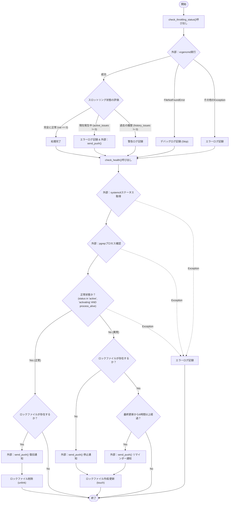
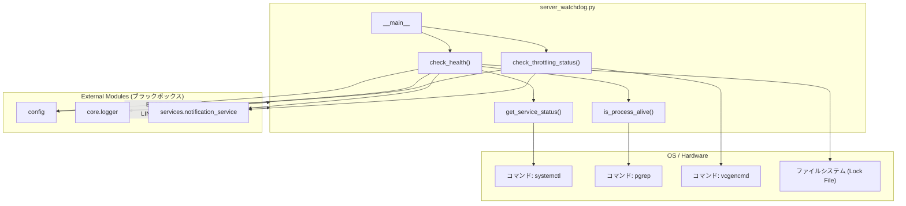

## 1. 解析メタ情報

| 項目 | 内容 |
| --- | --- |
| 対象ファイル | `server_watchdog.py` |
| 言語 | Python |
| 解析対象 | 提供されたコードのみ |
| 推測・補完 | 一切なし |

## 2. ファイルの概要

* システムのサービス（`home_system.service`）、関連プロセス（`unified_server.py`）、およびハードウェア（Raspberry Piのスロットリングや電圧低下）の死活と健全性を監視するスクリプトです。
* 異常検知時、または正常状態への復旧時に、設定された通知先にメッセージを送信します。
* 連続して異常を検知した場合は、ロックファイルを利用して初回の停止通知から一定時間（6時間）経過後にリマインダー通知を送信する仕組みを備えています。

## 3. 外部依存関係

### インポート一覧

| 名称 | 種類 | 用途 | 根拠 |
| --- | --- | --- | --- |
| `subprocess` | 標準ライブラリ | OSコマンド（systemctl, pgrep, vcgencmd）の実行 | 根拠: `import subprocess` (行番号: 2 / 抜粋: "import subprocess") |
| `time` | 標準ライブラリ | 現在時刻の取得（リマインダー間隔の判定用） | 根拠: `import time` (行番号: 3 / 抜粋: "import time") |
| `traceback` | 標準ライブラリ | 例外発生時のスタックトレース取得 | 根拠: `import traceback` (行番号: 4 / 抜粋: "import traceback") |
| `Path` | 標準ライブラリ | ロックファイルのパス生成とファイル操作 | 根拠: `from pathlib import Path` (行番号: 5 / 抜粋: "from pathlib import Path") |
| `sys` | 標準ライブラリ | モジュールインポートパスの追加 | 根拠: `import sys` (行番号: 6 / 抜粋: "import sys") |
| `os` | 標準ライブラリ | パスの絶対パス変換およびディレクトリ名取得 | 根拠: `import os` (行番号: 7 / 抜粋: "import os") |
| `Optional` | 標準ライブラリ | 型ヒント（コード内での明示的な使用箇所はなし） | 根拠: `from typing import Optional` (行番号: 8 / 抜粋: "from typing import Optional") |
| `config` | 外部ファイル | 設定値（`BASE_DIR`, `LINE_USER_ID`）の読み込み | 根拠: `import config` (行番号: 12 / 抜粋: "import config") |
| `setup_logging` | 外部ファイル | ロガーの初期化 | 根拠: `from core.logger import setup_logging` (行番号: 13 / 抜粋: "from core.logger import setup...") |
| `send_push` | 外部ファイル | 外部への通知送信 | 根拠: `from services.notification_service import send_push` (行番号: 14 / 抜粋: "from services.notification_...") |

### ブラックボックスとなる外部要素

| 名称 | 理由 | 根拠 |
| --- | --- | --- |
| `config`モジュール | `BASE_DIR`や`LINE_USER_ID`の具体的な値、およびその他の設定内容が現在のファイルからは判断不可 | 根拠: `config` (行番号: 12 / 抜粋: "import config") |
| `core.logger` | ロギングの出力先（コンソール、ファイル等）、フォーマットなどの具体的な振る舞いが判断不可 | 根拠: `setup_logging("watchdog")` (行番号: 21 / 抜粋: "logger = setup_logging("watc...") |
| `services.notification_service` | `send_push`関数の通信先の仕様、リトライ制御の有無、フォーマット変換などの実装詳細が判断不可 | 根拠: `send_push(config.LINE_US...` (行番号: 14 / 抜粋: "from services.notification_...") |

## 4. 主要要素の定義（関数 / エンドポイント / コンポーネント）

### `get_service_status`

* **役割**: `systemctl is-active`コマンドを使用して、指定したサービスの現在のステータス文字列を取得する。
* 根拠: `get_service_status` (行番号: 31〜42 / 抜粋: "res = subprocess.run...")

* **引数/リクエスト**: `service_name: str`
* 根拠: `service_name: str` (行番号: 31 / 抜粋: "def get_service_status(service...")

* **戻り値/レスポンス**: `str`
* 根拠: `-> str:` (行番号: 31 / 抜粋: "-> str:")

* **副作用**: OSコマンド（`systemctl`）の実行。
* 根拠: `subprocess.run(["systemctl", "is-active", service_name]` (行番号: 38〜40 / 抜粋: "res = subprocess.run...")

* **エラーハンドリング**: 実行時に例外が発生した場合は、エラーとして文字列 `"error"` を返す。
* 根拠: `except Exception:` (行番号: 42〜43 / 抜粋: "except Exception:\n        return "error"")

### `is_process_alive`

* **役割**: `pgrep -f`コマンドを使用して、指定したキーワードに合致するプロセスが起動しているかを判定する。
* 根拠: `is_process_alive` (行番号: 45〜55 / 抜粋: "res = subprocess.run...")

* **引数/リクエスト**: `process_keyword: str`
* 根拠: `process_keyword: str` (行番号: 45 / 抜粋: "def is_process_alive(process_k...")

* **戻り値/レスポンス**: `bool`
* 根拠: `-> bool:` (行番号: 45 / 抜粋: "-> bool:")

* **副作用**: OSコマンド（`pgrep`）の実行。
* 根拠: `subprocess.run(["pgrep", "-f", process_keyword]` (行番号: 50〜52 / 抜粋: "res = subprocess.run...")

* **エラーハンドリング**: 実行時に例外が発生した場合は `False` を返す。
* 根拠: `except Exception:` (行番号: 54〜55 / 抜粋: "except Exception:\n        return False")

### `check_throttling_status`

* **役割**: `vcgencmd get_throttled`コマンドを実行し、ハードウェアのスロットリング状況を確認する。現在異常が発生している場合はエラーログと通知を行い、過去履歴のみの場合は警告ログのみ記録する。
* 根拠: `check_throttling_status` (行番号: 57〜89 / 抜粋: "def check_throttling_status():")

* **引数/リクエスト**: なし
* 根拠: `def check_throttling_status():` (行番号: 57 / 抜粋: "def check_throttling_status():")

* **戻り値/レスポンス**: なし（定義なし）
* 根拠: `def check_throttling_status():` (行番号: 57 / 抜粋: "def check_throttling_status():")

* **副作用**: OSコマンド（`vcgencmd`）の実行、エラー時の`send_push`関数による通知送信、ログ出力。
* 根拠: `subprocess.run(['vcgencmd', 'get_throttled']` (行番号: 63 / 抜粋: "result = subprocess.run...") および `send_push` (行番号: 77 / 抜粋: "send_push(config.LINE_USER...")

* **エラーハンドリング**: コマンドが見つからない場合は `FileNotFoundError` をキャッチしてデバッグログを出力しスキップする。その他の例外はキャッチしてエラートレースをログに出力する。
* 根拠: `except FileNotFoundError:` および `except Exception as e:` (行番号: 83〜89 / 抜粋: "except FileNotFoundError:...")

### `check_health`

* **役割**: サービスとプロセスのステータスを確認し、両方が正常であればロックファイルを解除し復旧通知を送信する。異常であれば、初回は停止通知を送信してロックファイルを作成し、その後は一定時間（6時間）ごとにリマインダー通知を送信する。
* 根拠: `check_health` (行番号: 91〜131 / 抜粋: "def check_health() -> None:")

* **引数/リクエスト**: なし
* 根拠: `def check_health() -> None:` (行番号: 91 / 抜粋: "def check_health() -> None:")

* **戻り値/レスポンス**: `None`
* 根拠: `-> None:` (行番号: 91 / 抜粋: "-> None:")

* **副作用**: `get_service_status`と`is_process_alive`の呼び出し、ロックファイルの作成/更新/削除（`touch`, `unlink`）、`send_push`による通知送信、ログ出力。
* 根拠: `LOCK_FILE.unlink()`, `LOCK_FILE.touch()`, `send_push`等 (行番号: 106, 116, 122, 126 / 抜粋: "LOCK_FILE.touch()")

* **エラーハンドリング**: 全体で `Exception` をキャッチし、例外発生時はエラートレースをログに出力する。
* 根拠: `except Exception:` (行番号: 128〜131 / 抜粋: "except Exception:\n        err = ...")

## 5. 処理フロー図

## 6. 依存関係図

## 7. 次のステップ（リバースエンジニアリングの提案）

| 優先度 | ファイル名(推測可) | 理由 | 根拠 |
| --- | --- | --- | --- |
| 高 | `config.py` | ロックファイルの保存先である `BASE_DIR` および、通知の送信先となる `LINE_USER_ID` の実際の値を確認するため。 | 根拠: `config.BASE_DIR`, `config.LINE_USER_ID` (行番号: 20, 116 / 抜粋: "Path(config.BASE_DIR)") |
| 高 | `services/notification_service.py` | `send_push`関数が引数の `target="discord"` や `channel="error"` 等をどのようにハンドリングしているか、APIの実態を把握するため。 | 根拠: `send_push(config.LINE_USER_...` (行番号: 116 / 抜粋: "send_push(config.LINE_USER...") |
| 中 | `home_system.service` (systemd設定ファイル) | スクリプトが正常性の判断に使用している対象サービスが、内部でどのようにプロセスの起動・再起動を管理しているか把握するため。 | 根拠: `WATCH_SERVICE_NAME: str = ...` (行番号: 16 / 抜粋: "WATCH_SERVICE_NAME: str = ...") |
| 中 | `unified_server.py` | 監視対象の実体となるPythonプロセス。このプロセスが停止する原因の特定や、プロセス側のヘルスチェック機能を調べるため。 | 根拠: `WATCH_PROCESS_NAME: str = ...` (行番号: 17 / 抜粋: "WATCH_PROCESS_NAME: str = ...") |

## 8. 保守上の注意点

* `get_service_status`, `is_process_alive`, `check_throttling_status`関数はOSコマンド(`systemctl`, `pgrep`, `vcgencmd`)に直接依存しているため、実行環境（Raspberry Piなど）以外のOSや環境ではエラーとなるか正しく動作しません。
* `check_health`関数内ではファイルシステムを利用してロック制御(`watchdog_alert_sent.lock`)を行っています。`config.BASE_DIR` に指定されたディレクトリへの書き込み・削除権限がない場合、例外が発生します。
* `check_throttling_status`内で`FileNotFoundError`以外のエラー（権限エラー等）が発生した場合、例外はキャッチされてログ出力のみが行われ、システムは停止せずに後続のプロセス監視（`check_health`）へ進みます。

## 9. 不明事項一覧

| 項目 | 理由 | 必要なファイル |
| --- | --- | --- |
| ロックファイルの絶対パス | `config.BASE_DIR` の設定値が不明なため。 | `config.py` |
| LINEおよびDiscordへの通知先ID | `config.LINE_USER_ID` の設定値が不明なため。 | `config.py` |
| 外部への通知仕様 | `send_push`内部における外部APIとの通信仕様やフォーマット変換処理が不明なため。 | `services/notification_service.py` |
| ログの出力仕様 | `setup_logging`関数が生成するロガーの出力先やログローテーションの有無が不明なため。 | `core/logger.py` |

## 10. 自己検証結果

* [x] 完了: 推測・外部ファイルの仕様を一切含んでいない
* [x] 完了: 全関数・全クラス・全コンポーネントを列挙した
* [x] 完了: 全てのインポート要素を列挙した
* [x] 完了: すべての仕様説明に「根拠（行番号・抜粋）」を明記した
* [x] 完了: 根拠漏れが0件である
* [x] 完了: Mermaid構文にエラーの原因となる記号（エスケープ漏れ）がない
* [x] 完了: 不明事項を漏れなく列挙した