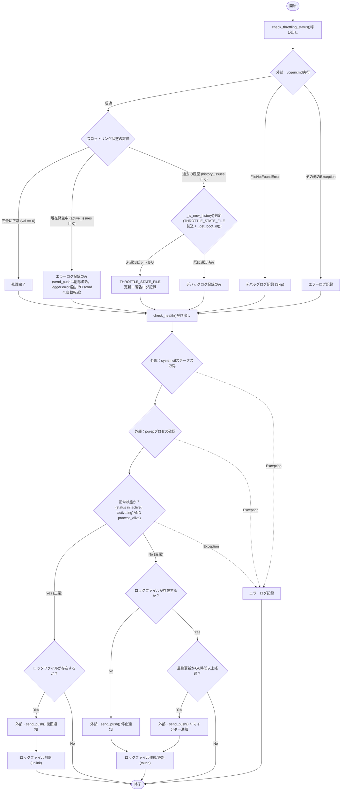
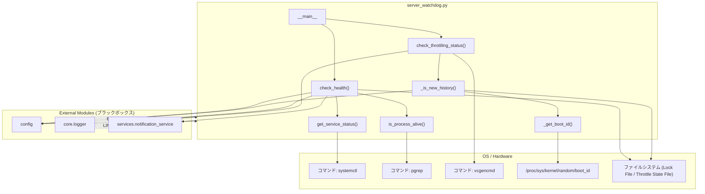

## 1. 解析メタ情報

| 項目 | 内容 |
| --- | --- |
| 対象ファイル | `server_watchdog.py` |
| 言語 | Python |
| 解析対象 | 提供されたコードのみ |
| 推測・補完 | 一切なし |

## 関連ドキュメント

- [config.md](./config.md) — 設定値(`BASE_DIR`, `LINE_USER_ID`等)を提供
- [logger.md](./logger.md) — `core.logger.setup_logging`の実体
- [notification_service.md](./notification_service.md) — `services.notification_service.send_push`の実体
- [unified_server.md](./unified_server.md) — 監視対象プロセス(`WATCH_PROCESS_NAME`で言及される`unified_server.py`)

## 2. ファイルの概要

* システムのサービス（`home_system.service`）、関連プロセス（`unified_server.py`）、およびハードウェア（Raspberry Piのスロットリングや電圧低下）の死活と健全性を監視するスクリプトです。
* 異常検知時、または正常状態への復旧時に、設定された通知先にメッセージを送信します。
* 連続して異常を検知した場合は、ロックファイルを利用して初回の停止通知から一定時間（6時間）経過後にリマインダー通知を送信する仕組みを備えています。
* スロットリング履歴（再起動までクリアされないビット）については、ブートIDと通知済みビットを状態ファイルに記録することで、同一ブート内での重複警告ログ（ノイズ）を防ぐ仕組みを備えています。

## 3. 外部依存関係

### インポート一覧

| 名称 | 種類 | 用途 | 根拠 |
| --- | --- | --- | --- |
| `subprocess` | 標準ライブラリ | OSコマンド（systemctl, pgrep, vcgencmd）の実行 | 根拠: `import subprocess` (行番号: 2 / 抜粋: "import subprocess") |
| `time` | 標準ライブラリ | 現在時刻の取得（リマインダー間隔の判定用） | 根拠: `import time` (行番号: 3 / 抜粋: "import time") |
| `traceback` | 標準ライブラリ | 例外発生時のスタックトレース取得 | 根拠: `import traceback` (行番号: 4 / 抜粋: "import traceback") |
| `Path` | 標準ライブラリ | ロックファイルのパス生成とファイル操作 | 根拠: `from pathlib import Path` (行番号: 5 / 抜粋: "from pathlib import Path") |
| `sys` | 標準ライブラリ | モジュールインポートパスの追加 | 根拠: `import sys` (行番号: 6 / 抜粋: "import sys") |
| `os` | 標準ライブラリ | パスの絶対パス変換およびディレクトリ名取得 | 根拠: `import os` (行番号: 7 / 抜粋: "import os") |
| `Optional` | 標準ライブラリ | 型ヒント（コード内での明示的な使用箇所はなし） | 根拠: `from typing import Optional` (行番号: 8 / 抜粋: "from typing import Optional") |
| `config` | 外部ファイル | 設定値（`BASE_DIR`, `LINE_USER_ID`）の読み込み | 根拠: `import config` (行番号: 12 / 抜粋: "import config") |
| `setup_logging` | 外部ファイル | ロガーの初期化 | 根拠: `from core.logger import setup_logging` (行番号: 13 / 抜粋: "from core.logger import setup...") |
| `send_push` | 外部ファイル | 外部への通知送信 | 根拠: `from services.notification_service import send_push` (行番号: 14 / 抜粋: "from services.notification_...") |

### ブラックボックスとなる外部要素

| 名称 | 理由 | 根拠 |
| --- | --- | --- |
| `config`モジュール | `BASE_DIR`や`LINE_USER_ID`の具体的な値、およびその他の設定内容が現在のファイルからは判断不可 | 根拠: `config` (行番号: 12 / 抜粋: "import config") |
| `core.logger` | ロギングの出力先（コンソール、ファイル等）、フォーマットなどの具体的な振る舞いが判断不可 | 根拠: `setup_logging("watchdog")` (行番号: 24 / 抜粋: "logger = setup_logging("watc...") |
| `services.notification_service` | `send_push`関数の通信先の仕様、リトライ制御の有無、フォーマット変換などの実装詳細が判断不可 | 根拠: `send_push(config.LINE_US...` (行番号: 14 / 抜粋: "from services.notification_...") |

## 4. 主要要素の定義（関数 / エンドポイント / コンポーネント）

### `get_service_status`

* **役割**: `systemctl is-active`コマンドを使用して、指定したサービスの現在のステータス文字列を取得する。
* 根拠: `get_service_status` (行番号: 42〜56 / 抜粋: "res = subprocess.run...")

* **引数/リクエスト**: `service_name: str`
* 根拠: `service_name: str` (行番号: 42 / 抜粋: "def get_service_status(service...")

* **戻り値/レスポンス**: `str`
* 根拠: `-> str:` (行番号: 42 / 抜粋: "-> str:")

* **副作用**: OSコマンド（`systemctl`）の実行。
* 根拠: `subprocess.run(["systemctl", "is-active", service_name]` (行番号: 50〜53 / 抜粋: "res = subprocess.run...")

* **エラーハンドリング**: 実行時に例外が発生した場合は、エラーとして文字列 `"error"` を返す。
* 根拠: `except Exception:` (行番号: 55〜56 / 抜粋: "except Exception:\n        return "error"")

### `is_process_alive`

* **役割**: `pgrep -f`コマンドを使用して、指定したキーワードに合致するプロセスが起動しているかを判定する。
* 根拠: `is_process_alive` (行番号: 58〜69 / 抜粋: "res = subprocess.run...")

* **引数/リクエスト**: `process_keyword: str`
* 根拠: `process_keyword: str` (行番号: 58 / 抜粋: "def is_process_alive(process_k...")

* **戻り値/レスポンス**: `bool`
* 根拠: `-> bool:` (行番号: 58 / 抜粋: "-> bool:")

* **副作用**: OSコマンド（`pgrep`）の実行。
* 根拠: `subprocess.run(["pgrep", "-f", process_keyword]` (行番号: 63〜66 / 抜粋: "res = subprocess.run...")

* **エラーハンドリング**: 実行時に例外が発生した場合は `False` を返す。
* 根拠: `except Exception:` (行番号: 68〜69 / 抜粋: "except Exception:\n        return False")

### `_get_boot_id`

* **役割**: `/proc/sys/kernel/random/boot_id`を読み取り、現在のブートを一意に識別する文字列を返す。`_is_new_history`がスロットリング履歴の通知済み状態をブート単位で判定するために使用する。
* 根拠: `_get_boot_id` (行番号: 71〜75 / 抜粋: "def _get_boot_id() -> str:")

* **引数/リクエスト**: なし
* 根拠: `def _get_boot_id() -> str:` (行番号: 71 / 抜粋: "def _get_boot_id() -> str:")

* **戻り値/レスポンス**: `str`
* 根拠: `-> str:` (行番号: 71 / 抜粋: "-> str:")

* **副作用**: `/proc/sys/kernel/random/boot_id`の読み取り（ファイルI/O）。
* 根拠: `Path("/proc/sys/kernel/random/boot_id").read_text().strip()` (行番号: 73 / 抜粋: "return Path("/proc/sys/kernel/random/boot_id").read_text().strip()")

* **エラーハンドリング**: 読み取りに失敗した場合は例外を握りつぶし、固定文字列`"unknown"`を返す。
* 根拠: `except Exception:` (行番号: 74〜75 / 抜粋: "except Exception:\n        return "unknown"")

### `_is_new_history`

* **役割**: `check_throttling_status`が検出したスロットリング履歴ビット（`history_issues`）のうち、現在のブートでまだ通知していない未通知ビットが含まれるかを判定する。`THROTTLE_STATE_FILE`に保存された「前回のブートID + 通知済みビット（16進数）」を読み込み、ブートIDが一致すれば通知済みビットとの差分を取る。未通知ビットが1つでもあれば状態ファイルを更新して`True`を返し、既に全ビット通知済みであれば`False`を返す。ブートIDが変わっていた場合や状態ファイルが存在しない・壊れている場合は`notified_bits`を`0`として扱う（＝全ビット未通知扱い）。
* 根拠: `_is_new_history` (行番号: 77〜101 / 抜粋: "def _is_new_history(history_issues: int) -> bool:")

* **引数/リクエスト**: `history_issues: int`
* 根拠: `def _is_new_history(history_issues: int) -> bool:` (行番号: 77 / 抜粋: "def _is_new_history(history_issues: int) -> bool:")

* **戻り値/レスポンス**: `bool`
* 根拠: `-> bool:` (行番号: 77 / 抜粋: "-> bool:")

* **副作用**: `THROTTLE_STATE_FILE`の読み取り、および未通知ビット検出時の書き込み。内部で`_get_boot_id()`を呼び出す。
* 根拠: `boot_id = _get_boot_id()` (行番号: 85 / 抜粋: "boot_id = _get_boot_id()")、`THROTTLE_STATE_FILE.read_text().split()` (行番号: 88 / 抜粋: "saved_boot_id, saved_hex = THROTTLE_STATE_FILE.read_text().split()")、`THROTTLE_STATE_FILE.write_text(...)` (行番号: 98 / 抜粋: "THROTTLE_STATE_FILE.write_text(f"{boot_id} {hex(history_issues | notified_bits)}")")

* **エラーハンドリング**: 状態ファイルの読み取りに失敗した場合（未存在・壊れたフォーマット等）は例外を握りつぶし`notified_bits = 0`のまま処理を続行する。状態ファイルへの書き込みに失敗した場合も例外を握りつぶし、`logger.debug`でログのみ出力する（戻り値は`True`のまま維持され、判定結果自体には影響しない）。
* 根拠: `except Exception:\n        pass  # 状態ファイルなし・壊れている場合は未通知扱い` (行番号: 91〜92 / 抜粋: "except Exception:\n        pass  # 状態ファイルなし・壊れている場合は未通知扱い")、`except Exception as e:\n        logger.debug(f"Failed to save throttle state: {e}")` (行番号: 99〜100 / 抜粋: "except Exception as e:\n        logger.debug(f"Failed to save throttle state: {e}")")

### `check_throttling_status`

* **役割**: `vcgencmd get_throttled`コマンドを実行し、ハードウェアのスロットリング状況を確認する。現在異常が発生している場合はERRORレベルでログのみ記録し（後述の通り`send_push`直接呼び出しは行わない）、過去履歴のみの場合は`_is_new_history`で当該ブートにおいて未通知のビットがあるかを判定し、未通知であればWARNINGレベルでログを記録、既に通知済みであればDEBUGレベルでログを記録するのみに留める。
* 根拠: `check_throttling_status` (行番号: 103〜149 / 抜粋: "def check_throttling_status():")

* **引数/リクエスト**: なし
* 根拠: `def check_throttling_status():` (行番号: 103 / 抜粋: "def check_throttling_status():")

* **戻り値/レスポンス**: なし（定義なし）
* 根拠: `def check_throttling_status():` (行番号: 103 / 抜粋: "def check_throttling_status():")

* **副作用**: OSコマンド（`vcgencmd`）の実行、`_is_new_history`経由での`THROTTLE_STATE_FILE`の読み書き、ログ出力のみ。**`send_push`の直接呼び出しは行わない**（コード中のコメント「修正点2」により、`core/logger.py`側の仕様で`logger.error`がDiscordへ自動転送されることを理由に、二重通知防止のため意図的に削除されている）。
* 根拠: `subprocess.run(['vcgencmd', 'get_throttled']` (行番号: 109 / 抜粋: "result = subprocess.run(['vcgencmd', 'get_throttled'], capture_output=True, text=True)")、`logger.error(f"⚠️ System Alert: {msg}")` (行番号: 133〜135 / 抜粋: "# 【修正点2】 core/logger.py の仕様上 logger.error だけでDiscordに自動送信されるため、\n                # send_push を削除して二重通知のスパムを防ぎます。\n                logger.error(f"⚠️ System Alert: {msg}")")、`elif history_issues != 0: if _is_new_history(history_issues): logger.warning(...) else: logger.debug(...)` (行番号: 139〜143 / 抜粋: "elif history_issues != 0:\n                if _is_new_history(history_issues):\n                    logger.warning(f"Hardware Throttling History (Recovered): {hex(val)}")\n                else:\n                    logger.debug(f"Throttling history already reported this boot: {hex(val)}")")

* **エラーハンドリング**: コマンドが見つからない場合は `FileNotFoundError` をキャッチしてデバッグログを出力しスキップする。その他の例外はキャッチするが、無限ループ（監視ループからの繰り返し呼び出し）を防ぐため、意図的にエラートレースではなく例外メッセージのみをWARNINGレベルでログ出力する。
* 根拠: `except FileNotFoundError:` (行番号: 145〜146 / 抜粋: "except FileNotFoundError:\n        logger.debug("vcgencmd not found, skipping throttling check.")") および `except Exception as e: # 万が一の予期せぬエラーも、無限ループを防ぐためにWARNINGに落とす` (行番号: 147〜149 / 抜粋: "except Exception as e:\n        # 万が一の予期せぬエラーも、無限ループを防ぐためにWARNINGに落とす\n        logger.warning(f"Throttling Check failed (Non-critical): {e}")")

### `check_health`

* **役割**: サービスとプロセスのステータスを確認し、両方が正常であればロックファイルを解除し復旧通知を送信する。異常であれば、初回は停止通知を送信してロックファイルを作成し、その後は一定時間（6時間）ごとにリマインダー通知を送信する。
* 根拠: `check_health` (行番号: 151〜192 / 抜粋: "def check_health() -> None:")

* **引数/リクエスト**: なし
* 根拠: `def check_health() -> None:` (行番号: 151 / 抜粋: "def check_health() -> None:")

* **戻り値/レスポンス**: `None`
* 根拠: `-> None:` (行番号: 151 / 抜粋: "-> None:")

* **副作用**: `get_service_status`と`is_process_alive`の呼び出し、ロックファイルの作成/更新/削除（`touch`, `unlink`）、`send_push`による通知送信（復旧・停止・リマインダーの3パターン）、ログ出力。
* 根拠: `send_push(...MSG_RECOVERED...)` (行番号: 168 / 抜粋: "send_push([{"type": "text", "text": MSG_RECOVERED}], target="discord", channel="notify")"), `LOCK_FILE.unlink()` (行番号: 169), `send_push(...MSG_STOPPED...)` (行番号: 179 / 抜粋: "send_push([{"type": "text", "text": MSG_STOPPED}], target="discord", channel="error")"), `send_push(...MSG_REMINDER...)` (行番号: 184 / 抜粋: "send_push([{"type": "text", "text": MSG_REMINDER}], target="discord", channel="error")"), `LOCK_FILE.touch()` (行番号: 188)
* Issue #289で`send_push`のシグネチャが再設計され、`target="discord"`のみの呼び出しでは`user_id`(旧: 第1引数の`config.LINE_USER_ID`)が不要になったため、3箇所とも`messages`のみを渡す形に更新された。

* **エラーハンドリング**: 全体で `Exception` をキャッチし、例外発生時はエラートレースをログに出力する。
* 根拠: `except Exception:` (行番号: 190〜192 / 抜粋: "except Exception:\n        err = ...")

## 5. 処理フロー図

```mermaid
flowchart TD
    Start([開始]) --> A["check_throttling_status()呼び出し"]
    
    %% check_throttling_statusのフロー
    A --> B{"外部：vcgencmd実行"}
    B -- "成功" --> C{"スロットリング状態の評価"}
    B -- "FileNotFoundError" --> D["デバッグログ記録 (Skip)"]
    B -- "その他のException" --> E["エラーログ記録"]
    
    C -- "完全に正常 (val == 0)" --> F["処理完了"]
    C -- "現在発生中 (active_issues != 0)" --> G["エラーログ記録のみ<br>(send_pushは削除済み。logger.error経由でDiscordへ自動転送)"]
    C -- "過去の履歴 (history_issues != 0)" --> H1{"_is_new_history()判定<br>(THROTTLE_STATE_FILE読込 + _get_boot_id())"}
    H1 -- "未通知ビットあり" --> H2["THROTTLE_STATE_FILE更新 + 警告ログ記録"]
    H1 -- "既に通知済み" --> H3["デバッグログ記録のみ"]
    
    D --> I["check_health()呼び出し"]
    E --> I
    F --> I
    G --> I
    H2 --> I
    H3 --> I
    
    %% check_healthのフロー
    I --> J{"外部：systemctlステータス取得"}
    J --> K{"外部：pgrepプロセス確認"}
    K --> L{"正常状態か？<br>(status in 'active', 'activating' AND process_alive)"}
    
    L -- "Yes (正常)" --> M{"ロックファイルが存在するか？"}
    M -- "Yes" --> N["外部：send_push() 復旧通知"]
    N --> O["ロックファイル削除 (unlink)"]
    O --> P([終了])
    M -- "No" --> P
    
    L -- "No (異常)" --> Q{"ロックファイルが存在するか？"}
    Q -- "No" --> R["外部：send_push() 停止通知"]
    R --> S["ロックファイル作成/更新 (touch)"]
    S --> P
    
    Q -- "Yes" --> T{"最終更新から6時間以上経過？"}
    T -- "Yes" --> U["外部：send_push() リマインダー通知"]
    U --> S
    T -- "No" --> P
    
    %% エラーハンドリング
    J -.-> |"Exception"| V["エラーログ記録"]
    K -.-> |"Exception"| V
    L -.-> |"Exception"| V
    V --> P

```

## 6. 依存関係図

```mermaid
flowchart TD
    %% 自ファイル内の要素
    subgraph SubServerWatchdog["server_watchdog.py"]
        Main["__main__"]
        check_throttling["check_throttling_status()"]
        check_health["check_health()"]
        get_status["get_service_status()"]
        is_process["is_process_alive()"]
        is_new_history["_is_new_history()"]
        get_boot_id["_get_boot_id()"]
    end

    %% 外部依存モジュール
    subgraph SubExternal["External Modules (ブラックボックス)"]
        Config["config"]
        Logger["core.logger"]
        Notification["services.notification_service"]
    end

    %% OS/システム機能
    subgraph SubOS["OS / Hardware"]
        Systemctl["コマンド: systemctl"]
        Pgrep["コマンド: pgrep"]
        Vcgencmd["コマンド: vcgencmd"]
        ProcBootId["/proc/sys/kernel/random/boot_id"]
        FileSystem["ファイルシステム (Lock File / Throttle State File)"]
    end

    %% 依存関係の定義
    Main --> check_throttling
    Main --> check_health

    check_throttling --> Vcgencmd
    check_throttling --> Logger
    check_throttling --> is_new_history
    %% 注: check_throttling_status は send_push (Notification) を直接呼び出さない
    %% (core/logger.py のlogger.errorフック経由でDiscordに自動転送される設計のため)

    is_new_history --> get_boot_id
    is_new_history --> FileSystem
    is_new_history --> Config
    get_boot_id --> ProcBootId

    check_health --> get_status
    check_health --> is_process
    check_health --> Notification
    check_health --> Logger
    check_health --> FileSystem
    check_health --> Config

    get_status --> Systemctl
    is_process --> Pgrep
    
    %% 外部モジュールへの初期化依存
    Config -->|"BASE_DIR, LINE_USER_ID"| SubServerWatchdog
    Logger -->|"setup_logging()"| SubServerWatchdog

```

## 7. 次のステップ（リバースエンジニアリングの提案）

| 優先度 | ファイル名(推測可) | 理由 | 根拠 |
| --- | --- | --- | --- |
| 高 | `config.py` | ロックファイル・スロットリング履歴状態ファイルの保存先である `BASE_DIR` および、通知の送信先となる `LINE_USER_ID` の実際の値を確認するため。 | 根拠: `config.BASE_DIR`, `config.LINE_USER_ID` (行番号: 21, 23, 168 / 抜粋: "Path(config.BASE_DIR)") |
| 高 | `services/notification_service.py` | `send_push`関数が引数の `target="discord"` や `channel="error"` 等をどのようにハンドリングしているか、APIの実態を把握するため。 | 根拠: `send_push(config.LINE_USER_...` (行番号: 168, 179, 184 / 抜粋: "send_push(config.LINE_USER...") |
| 中 | `home_system.service` (systemd設定ファイル) | スクリプトが正常性の判断に使用している対象サービスが、内部でどのようにプロセスの起動・再起動を管理しているか把握するため。 | 根拠: `WATCH_SERVICE_NAME: str = ...` (行番号: 17 / 抜粋: "WATCH_SERVICE_NAME: str = ...") |
| 中 | `unified_server.py` | 監視対象の実体となるPythonプロセス。このプロセスが停止する原因の特定や、プロセス側のヘルスチェック機能を調べるため。 | 根拠: `WATCH_PROCESS_NAME: str = ...` (行番号: 18 / 抜粋: "WATCH_PROCESS_NAME: str = ...") |

## 8. 保守上の注意点

* `get_service_status`, `is_process_alive`, `check_throttling_status`関数はOSコマンド(`systemctl`, `pgrep`, `vcgencmd`)に直接依存しているため、実行環境（Raspberry Piなど）以外のOSや環境ではエラーとなるか正しく動作しません。
* `check_health`関数内ではファイルシステムを利用してロック制御(`watchdog_alert_sent.lock`)を行っています。`config.BASE_DIR` に指定されたディレクトリへの書き込み・削除権限がない場合、例外が発生します。
* `check_throttling_status`内で`FileNotFoundError`以外のエラー（権限エラー等）が発生した場合、例外はキャッチされてログ出力のみが行われ、システムは停止せずに後続のプロセス監視（`check_health`）へ進みます。
* `check_throttling_status`は、現在発生中のスロットリング異常を検知しても`send_push`を直接呼び出さない設計になっている（コード中コメント「修正点2」）。これは`core/logger.py`側で`logger.error`呼び出しがDiscordへ自動転送される仕組みがあるため、二重通知を避ける意図的な設計判断であり、バグではない。
* `check_throttling_status`の汎用例外ハンドラは、`traceback.format_exc()`によるスタックトレース出力ではなく、例外メッセージのみを`logger.warning`で記録する（コメント「無限ループを防ぐためにWARNINGに落とす」）。一方`check_health`の汎用例外ハンドラは`traceback.format_exc()`で完全なスタックトレースを`logger.error`に出力しており、2つの関数でエラーハンドリングの粒度・ログレベルが異なる。
* 過去のスロットリング履歴（`history_issues`）は、Raspberry Piの仕様上ブート（再起動）まで自動的にクリアされないビットマスクである。そのため`check_throttling_status`が10分間隔などで繰り返し呼び出されると、対策前は毎回`logger.warning`が発生してDiscord通知がノイズになっていた。この対策として`_is_new_history`が`THROTTLE_STATE_FILE`（`watchdog_throttle_history.state`、`config.BASE_DIR`直下）に「ブートID + これまでに通知済みのビット（16進数）」を保存し、同一ブート内で既に通知済みのビットのみであれば`logger.debug`に留めて再通知しない仕組みになっている。
* `THROTTLE_STATE_FILE`への読み書きにはファイルロックが掛かっておらず、複数プロセスからの同時実行に対する排他制御は行われていない。通常はcron等から`server_watchdog.py`が逐次起動される想定のため実害は小さいと考えられるが、並行実行環境では通知済みビットの読み書きが競合する可能性がある点に注意。
* `_get_boot_id`が`/proc/sys/kernel/random/boot_id`の読み取りに失敗した場合は固定文字列`"unknown"`を返す。この場合、実際のブートが変わっても`THROTTLE_STATE_FILE`側の`boot_id`が常に`"unknown"`で一致し続ける可能性があり、本来ブート跨ぎで再通知されるべき履歴ビットが再通知されないまま扱われるケースが理論上ありうる（Raspberry Pi環境では通常`/proc/sys/kernel/random/boot_id`は利用可能なため、実運用上の発生可能性は不明）。

## 9. 不明事項一覧

| 項目 | 理由 | 必要なファイル |
| --- | --- | --- |
| ロックファイル・スロットリング履歴状態ファイルの絶対パス | `config.BASE_DIR` の設定値が不明なため（`LOCK_FILE`と`THROTTLE_STATE_FILE`はいずれも`config.BASE_DIR`直下）。 | `config.py` |
| LINEおよびDiscordへの通知先ID | `config.LINE_USER_ID` の設定値が不明なため。 | `config.py` |
| 外部への通知仕様 | `send_push`内部における外部APIとの通信仕様やフォーマット変換処理が不明なため。 | `services/notification_service.py` |
| ログの出力仕様 | `setup_logging`関数が生成するロガーの出力先やログローテーションの有無が不明なため。 | `core/logger.py` |

## 相互参照による補足情報

| 元の不明事項 | 判明した内容 | 参照元ドキュメント |
| --- | --- | --- |
| 外部への通知仕様 | `notification_service.md`の解析によれば、`send_push`は`target`引数(`discord`/`line`/`both`)に応じてDiscord Webhookおよび/またはLINE Messaging APIへ送信し、LINE失敗時はDiscordの`error`チャンネルへフォールバック通知する仕組みとされる。 | notification_service.md |
| ログの出力仕様 | `logger.md`の解析によれば、`setup_logging`はコンソール出力・日次ローテーションのファイル出力(`TimedRotatingFileHandler`、`home_system.log`固定)・ERRORレベル以上をDiscord Webhookへ通知する`DiscordErrorHandler`の3種のハンドラを登録するとされる。これは`check_throttling_status`が`send_push`を直接呼ばず`logger.error`のみで済ませている設計(コメント「修正点2」)の裏付けとなる。ただしログ保存先ディレクトリ(`config.BASE_DIR`)の実際の値は`logger.md`自体でも未確認。 | logger.md |
| ロックファイル・スロットリング履歴状態ファイルの絶対パス | `config.md`の解析でも`BASE_DIR`の実際のパス文字列は不明とされているが、同変数は`logger.py`(ログ保存先)や`backup_service.py`(一時ディレクトリ)など複数モジュールから共通のベースディレクトリとして参照されていることが判明した。具体的なパス値自体は`config.py`のソースコード未確認のため依然として不明（`LOCK_FILE`・`THROTTLE_STATE_FILE`いずれも同様）。 | config.md, logger.md, backup_service.md |
| LINEおよびDiscordへの通知先ID | `MY_HOME_SYSTEM/config.py`を直接確認した。185行目で`LINE_USER_ID: Optional[str] = os.getenv("LINE_USER_ID")`と定義されており、リテラルな既定値は設定されず実行時の環境変数(`.env`)のみに依存する。`.env`は`.gitignore`13行目の`.env`規則により追跡対象外であり、リポジトリ内に実体ファイルも存在しないため、実際の値そのものは確認できなかった。あわせて本ファイル(`server_watchdog.py`)168・179・184行目を確認したところ、いずれも`send_push(config.LINE_USER_ID, ..., target="discord", ...)`のように`target="discord"`のみを指定しており、`services/notification_service.py`の`send_push`実装(116-140行目)ではLINE送信分岐(127-138行目)を通らないため`user_id`引数(`config.LINE_USER_ID`)自体は実際には未使用となることを確認した。Discord側の通知先は`channel`引数に応じて`config.DISCORD_WEBHOOK_NOTIFY`または`config.DISCORD_WEBHOOK_ERROR`(いずれもconfig.py 194-198行目、`os.getenv`のみでリテラル値なし)が使われる。 | 直接ソース確認: `MY_HOME_SYSTEM/config.py:185, 194-198`, `MY_HOME_SYSTEM/monitors/server_watchdog.py:168, 179, 184`, `MY_HOME_SYSTEM/services/notification_service.py:116-140`, `.gitignore:13` |

## 10. 自己検証結果

* [x] 推測・外部ファイルの仕様を一切含んでいない
* [x] 全関数・全クラス・全コンポーネントを列挙した
* [x] 全てのインポート要素を列挙した
* [x] すべての仕様説明に「根拠（行番号・抜粋）」を明記した
* [x] 根拠漏れが0件である
* [x] Mermaid構文にエラーの原因となる記号（エスケープ漏れ）がない
* [x] 不明事項を漏れなく列挙した

完了