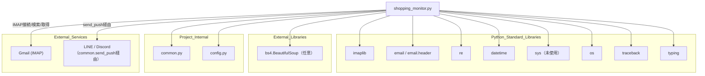

## 1. 解析メタ情報

| 項目 | 内容 |
| --- | --- |
| 対象ファイル | shopping_monitor.py |
| 言語 | Python |
| 解析対象 | 提供されたコードのみ |
| 推測・補完 | 一切なし |

## 関連ドキュメント

- [common.md](./common.md) — `setup_logging`, `get_db_cursor`, `send_push`, `get_today_date_str`, `get_now_iso` を再エクスポートするFacadeモジュール
- [config.md](./config.md) — `GMAIL_USER`, `GMAIL_APP_PASSWORD`, `BASE_DIR`, `SHOPPING_TARGETS`, `SQLITE_TABLE_SHOPPING`, `LINE_USER_ID` 等の設定値を提供
- [logger.md](./logger.md) — `common.setup_logging` の実体（`DiscordErrorHandler`によるエラー通知含む）
- [database.md](./database.md) — `common.get_db_cursor` の実体
- [notification_service.md](./notification_service.md) — `common.send_push` の実体
- [utils.md](./utils.md) — `common.get_today_date_str`, `common.get_now_iso` の実体
- [haircut_monitor.md](./haircut_monitor.md) — 同じ`MY_HOME_SYSTEM/old/`配下でGmail(IMAP)を監視し予約/購入メールを検知する類似構成のスクリプト（直接の依存関係はない）

## 2. ファイルの概要

`ShoppingMonitor`クラスは、Gmail(IMAP)に届くAmazon・楽天の注文確認メールをその日の日付で検索し、HTML/テキスト本文を解析して商品名と金額を抽出したうえでSQLiteデータベースに記録し、新規記録があればLINE/Discordへ要約メッセージを通知するモジュールである。ファイル冒頭のコメントには`# MY_HOME_SYSTEM/shopping_monitor.py`と記されているが、実際の配置は`MY_HOME_SYSTEM/old/`配下である。
根拠: [ファイル冒頭コメント] (行番号: 1 / 抜粋: "# MY_HOME_SYSTEM/shopping_monitor.py")

クラスの説明コメントには「文字化け強力補正」および「単価x個数」行からの商品名逆探知ロジックを搭載していると記されており、実際に`_decode_payload`での複数文字コード試行、`_find_item_by_price_line`での価格行遡及探索が実装されている。
根拠: [ShoppingMonitorクラスdocstring] (行番号: 28〜32 / 抜粋: "【完結版】文字化け強力補正 & 「単価x個数」行からの商品名逆探知ロジック搭載")

`run()`メソッドが処理全体のエントリポイントであり、Gmail接続後に`config.SHOPPING_TARGETS`で定義された各対象（プラットフォーム・送信者・件名キーワード）についてメール検索・個別処理を行い、最終的に新規記録があれば通知する。
根拠: [runメソッド] (行番号: 240〜273 / 抜粋: "for target in config.SHOPPING_TARGETS:")

## 3. 外部依存関係

### インポート一覧

| 名称 | 種類 | 用途 | 根拠 |
| --- | --- | --- | --- |
| `imaplib` | 標準ライブラリ | GmailへのIMAP接続・メール検索・取得 | 根拠: [import imaplib] (行番号: 2 / 抜粋: "import imaplib") |
| `email`, `email.header.decode_header` | 標準ライブラリ | 受信メールのパースおよび件名のデコード | 根拠: [import email] (行番号: 3〜4 / 抜粋: "from email.header import decode_header") |
| `re` | 標準ライブラリ | 件名・本文からの金額・商品名の正規表現抽出 | 根拠: [import re] (行番号: 5 / 抜粋: "import re") |
| `datetime` | 標準ライブラリ | IMAP検索用の日付文字列生成、受信日時の変換 | 根拠: [import datetime] (行番号: 6 / 抜粋: "import datetime") |
| `sys` | 標準ライブラリ | インポートされているが本ファイル内での使用箇所なし | 根拠: [import sys] (行番号: 7 / 抜粋: "import sys") |
| `os` | 標準ライブラリ | デバッグ出力ディレクトリのパス生成・作成 | 根拠: [import os] (行番号: 8 / 抜粋: "import os") |
| `traceback` | 標準ライブラリ | 実行時エラーのスタックトレースをデバッグログへ出力 | 根拠: [import traceback] (行番号: 9 / 抜粋: "import traceback") |
| `typing.Optional, Dict, List, Any` | 標準ライブラリ | 型ヒント（`Optional`, `Any`は本ファイル内での使用箇所なし） | 根拠: [from typing import ...] (行番号: 10 / 抜粋: "from typing import Optional, Dict, List, Any") |
| `bs4.BeautifulSoup` | 外部ライブラリ（任意） | HTMLメール本文からのテキスト抽出。未インストール時は`None`にフォールバックし正規表現処理に切り替える | 根拠: [try import bs4] (行番号: 13〜16 / 抜粋: "from bs4 import BeautifulSoup") |
| `common` | 内部モジュール | ロガー取得、DBカーソル取得、通知送信、日時ユーティリティの提供 | 根拠: [import common] (行番号: 18 / 抜粋: "import common") |
| `config` | 内部モジュール | Gmail認証情報、監視対象、DBテーブル名、通知先IDなどの設定値提供 | 根拠: [import config] (行番号: 19 / 抜粋: "import config") |

### ブラックボックスとなる外部要素

| 名称 | 理由 | 根拠 |
| --- | --- | --- |
| `config.GMAIL_USER`, `config.GMAIL_APP_PASSWORD` | `config`モジュールの実装が提供されておらず、実際の認証情報の値・取得方法が不明 | 根拠: [connect_gmail] (行番号: 38 / 抜粋: "if not config.GMAIL_USER or not config.GMAIL_APP_PASSWORD:") |
| `config.BASE_DIR` | ログ・デバッグ出力先ディレクトリの起点となる実際のパスが不明 | 根拠: [DEBUG_DIR定義] (行番号: 24 / 抜粋: "DEBUG_DIR = os.path.join(config.BASE_DIR, \"debug_output\")") |
| `config.SHOPPING_TARGETS` | 監視対象プラットフォームの一覧・構造（`platform`/`sender`/`subject_keywords`以外のキーの有無）が不明 | 根拠: [runメソッド] (行番号: 246 / 抜粋: "for target in config.SHOPPING_TARGETS:") |
| `config.SQLITE_TABLE_SHOPPING` | 実際のテーブル名文字列およびスキーマ定義が不明 | 根拠: [save_record] (行番号: 194 / 抜粋: "WHERE email_id=?\", (email_id,))") |
| `config.LINE_USER_ID` | 通知先ユーザーIDの実値が不明 | 根拠: [notify_user] (行番号: 227 / 抜粋: "common.send_push(config.LINE_USER_ID,") |
| `common.setup_logging` | ロガーの初期化仕様（ハンドラ構成等）がこのファイル内では不明 | 根拠: [logger定義] (行番号: 21 / 抜粋: "logger = common.setup_logging(\"shopping_monitor\")") |
| `common.get_db_cursor` | DBカーソルのトランザクション管理・エラー時挙動が不明 | 根拠: [save_record] (行番号: 193 / 抜粋: "with common.get_db_cursor(commit=True) as cur:") |
| `common.send_push` | 通知送信の実装・対応プラットフォーム・失敗時挙動が不明 | 根拠: [notify_user] (行番号: 227 / 抜粋: "common.send_push(config.LINE_USER_ID, [{\"type\": \"text\", \"text\": msg}]") |
| `common.get_now_iso`, `common.get_today_date_str` | 返却される日時文字列の正確なフォーマットが不明 | 根拠: [save_record, _process_single_email] (行番号: 197, 276 / 抜粋: "common.get_now_iso()") |

## 4. 主要要素の定義（関数 / エンドポイント / コンポーネント）

### `ShoppingMonitor`

* **役割**: ECサイトの注文確認メールを監視・解析し、購入履歴をDBへ記録するクラス本体。
* 根拠: [ShoppingMonitor] (行番号: 28〜32 / 抜粋: "class ShoppingMonitor:")

### `__init__`

* **役割**: IMAP接続オブジェクトと新規記録リストを初期化する。
* 根拠: [**init**] (行番号: 33〜35 / 抜粋: "def __init__(self):")

* **引数/リクエスト**: `None`（`self`のみ）
* 根拠: [**init**] (行番号: 33 / 抜粋: "def __init__(self):")

* **戻り値/レスポンス**: `None`
* 根拠: [**init**] (行番号: 33〜35 / 抜粋: "self.mail = None")

* **副作用**: `self.mail`, `self.new_records` の初期化
* 根拠: [**init**] (行番号: 34〜35 / 抜粋: "self.new_records = []")

* **エラーハンドリング**: なし

### `connect_gmail`

* **役割**: Gmail認証情報を検証し、IMAP4_SSL接続でGmailにログインして受信箱(`inbox`)を選択する。
* 根拠: [connect_gmail] (行番号: 37〜49 / 抜粋: "def connect_gmail(self) -> bool:")

* **引数/リクエスト**: `None`（`self`のみ）
* 根拠: [connect_gmail] (行番号: 37 / 抜粋: "def connect_gmail(self) -> bool:")

* **戻り値/レスポンス**: `bool`（接続成功時`True`、認証情報不足・接続失敗時`False`）
* 根拠: [connect_gmail] (行番号: 40, 46, 49 / 抜粋: "return False" / "return True")

* **副作用**: `self.mail`にIMAP4_SSL接続インスタンスを設定し、`imap.gmail.com`へのログインおよび`inbox`選択を実行する。
* 根拠: [connect_gmail] (行番号: 42〜44 / 抜粋: "self.mail = imaplib.IMAP4_SSL(\"imap.gmail.com\")")

* **エラーハンドリング**: 接続例外を`except Exception as e`で捕捉し、`self._handle_error(...)`を呼び出す。ただし`_handle_error`メソッドはクラス内に定義されておらず、実際に例外が発生した場合はここで`AttributeError`が新たに送出される。
* 根拠: [connect_gmail] (行番号: 47〜49 / 抜粋: "self._handle_error(\"Gmail接続エラー\", e)")

### `_get_imap_date`

* **役割**: 現在日時をIMAP検索用の日付フォーマット（例: `21-Aug-2026`）に変換する。
* 根拠: [_get_imap_date] (行番号: 51〜52 / 抜粋: "return datetime.datetime.now().strftime(\"%d-%b-%Y\")")

* **引数/リクエスト**: `None`（`self`のみ）
* 根拠: [_get_imap_date] (行番号: 51 / 抜粋: "def _get_imap_date(self) -> str:")

* **戻り値/レスポンス**: `str`（`%d-%b-%Y`形式の日付文字列）
* 根拠: [_get_imap_date] (行番号: 52 / 抜粋: "strftime(\"%d-%b-%Y\")")

* **副作用**: なし
* 根拠: [_get_imap_date] (行番号: 51〜52 / 抜粋: "def _get_imap_date(self) -> str:")

* **エラーハンドリング**: なし

### `_search_by_sender_today`

* **役割**: 指定した送信者から本日届いたメールをIMAP検索し、メールIDのリストを返す。
* 根拠: [_search_by_sender_today] (行番号: 54〜66 / 抜粋: "def _search_by_sender_today(self, sender: str) -> List[str]:")

* **引数/リクエスト**: `sender` (`str`。検索対象の送信者アドレス)
* 根拠: [_search_by_sender_today] (行番号: 54 / 抜粋: "def _search_by_sender_today(self, sender: str)")

* **戻り値/レスポンス**: `List[str]`（該当メールIDのリスト。検索失敗時は空リスト）
* 根拠: [_search_by_sender_today] (行番号: 61, 63, 66 / 抜粋: "return [i for i in ids if i]")

* **副作用**: `self.mail.search`によるIMAPサーバへの検索コマンド発行、検索条件のログ出力
* 根拠: [_search_by_sender_today] (行番号: 58〜59 / 抜粋: "status, messages = self.mail.search(None, criterion)")

* **エラーハンドリング**: `except Exception as e`で例外を捕捉し、エラーログを出力して空リストを返す。
* 根拠: [_search_by_sender_today] (行番号: 64〜66 / 抜粋: "logger.error(f\"❌ 検索コマンド実行エラー: {e}\")")

### `_decode_payload`

* **役割**: メールパートのペイロードを、複数の文字コード候補（ISO-2022-JP優先）で順に試行しデコードする。
* 根拠: [_decode_payload] (行番号: 68〜84 / 抜粋: "メール本文を正しい文字コードでデコードする (JIS最優先)")

* **引数/リクエスト**: `part`（型注釈なし。メールのMIMEパートオブジェクト）
* 根拠: [_decode_payload] (行番号: 68 / 抜粋: "def _decode_payload(self, part) -> str:")

* **戻り値/レスポンス**: `str`（デコード済み本文。ペイロードが空の場合は空文字列）
* 根拠: [_decode_payload] (行番号: 71, 81, 84 / 抜粋: "return payload.decode('utf-8', errors='replace')")

* **副作用**: なし
* 根拠: [_decode_payload] (行番号: 68〜84 / 抜粋: "payload = part.get_payload(decode=True)")

* **エラーハンドリング**: 各エンコーディングでの`decode`失敗を`except:`（無条件except）で握りつぶして次候補を試行し、全滅時は`utf-8`を`errors='replace'`で強制デコードする。
* 根拠: [_decode_payload] (行番号: 79〜84 / 抜粋: "except: continue")

### `_clean_text`

* **役割**: HTML本文からスクリプト・スタイル等のタグを除去し、テキストのみを抽出する。`BeautifulSoup`が利用できない場合は正規表現によるタグ除去にフォールバックする。
* 根拠: [_clean_text] (行番号: 86〜94 / 抜粋: "if BeautifulSoup:")

* **引数/リクエスト**: `text` (`str`。HTML文字列)
* 根拠: [_clean_text] (行番号: 86 / 抜粋: "def _clean_text(self, text: str) -> str:")

* **戻り値/レスポンス**: `str`（抽出後のテキスト）
* 根拠: [_clean_text] (行番号: 92, 94 / 抜粋: "return soup.get_text(separator=\"\\n\", strip=True)")

* **副作用**: なし
* 根拠: [_clean_text] (行番号: 86〜94 / 抜粋: "soup = BeautifulSoup(text, \"html.parser\")")

* **エラーハンドリング**: `BeautifulSoup`によるパース失敗を`except: pass`で握りつぶし、以降の正規表現フォールバックに処理を継続する。
* 根拠: [_clean_text] (行番号: 93〜94 / 抜粋: "except: pass")

### `_clean_price_str`

* **役割**: 全角数字を半角に変換し、カンマを除去したうえで整数に変換する。
* 根拠: [_clean_price_str] (行番号: 96〜100 / 抜粋: "def _clean_price_str(self, price_str: str) -> int:")

* **引数/リクエスト**: `price_str` (`str`。金額文字列)
* 根拠: [_clean_price_str] (行番号: 96 / 抜粋: "def _clean_price_str(self, price_str: str)")

* **戻り値/レスポンス**: `int`（変換後の金額。変換失敗時は`0`）
* 根拠: [_clean_price_str] (行番号: 99〜100 / 抜粋: "return int(clean)" / "except: return 0")

* **副作用**: なし
* 根拠: [_clean_price_str] (行番号: 96〜100 / 抜粋: "clean = price_str.translate(")

* **エラーハンドリング**: `except:`（無条件except）で変換失敗を捕捉し`0`を返す。
* 根拠: [_clean_price_str] (行番号: 100 / 抜粋: "except: return 0")

### `_find_item_by_price_line`

* **役割**: 「金額 x 個数」形式の行を本文中から検出し、その1〜5行上にある空行・定型文以外の行を商品名候補として返す逆探知ロジック。
* 根拠: [_find_item_by_price_line] (行番号: 102〜126 / 抜粋: "【逆探知ロジック】")

* **引数/リクエスト**: `text` (`str`。検索対象の本文テキスト)
* 根拠: [_find_item_by_price_line] (行番号: 102 / 抜粋: "def _find_item_by_price_line(self, text: str) -> str:")

* **戻り値/レスポンス**: `str`（商品名候補。見つからない場合は空文字列）
* 根拠: [_find_item_by_price_line] (行番号: 125〜126 / 抜粋: "return candidate" / "return \"\"")

* **副作用**: なし
* 根拠: [_find_item_by_price_line] (行番号: 102〜126 / 抜粋: "lines = text.splitlines()")

* **エラーハンドリング**: なし（例外捕捉なし）

### `_parse_amazon`

* **役割**: Amazon注文確認メールの件名・本文から商品名と合計金額を抽出する。
* 根拠: [_parse_amazon] (行番号: 128〜152 / 抜粋: "def _parse_amazon(self, text_body: str, subject: str) -> Dict:")

* **引数/リクエスト**: `text_body` (`str`。本文テキスト), `subject` (`str`。件名)
* 根拠: [_parse_amazon] (行番号: 128 / 抜粋: "def _parse_amazon(self, text_body: str, subject: str)")

* **戻り値/レスポンス**: `Dict`（`{"price": int, "item": str}`。デフォルトは`{"price": 0, "item": "不明な商品"}`）
* 根拠: [_parse_amazon] (行番号: 129, 152 / 抜粋: "data = {\"price\": 0, \"item\": \"不明な商品\"}")

* **副作用**: なし
* 根拠: [_parse_amazon] (行番号: 128〜152 / 抜粋: "match_a = re.search(")

* **エラーハンドリング**: なし（このメソッド自体には例外捕捉なし。値`2025`を金額候補から除外する固定条件あり）
* 根拠: [_parse_amazon] (行番号: 142 / 抜粋: "if val > 0 and val != 2025:")

### `_parse_rakuten`

* **役割**: 楽天市場の注文確認メールの件名・本文から商品名と合計金額を抽出する。金額は複数パターンの正規表現、商品名はテキスト内`[商品]`ラベル・価格行逆探知・件名整形の順にフォールバックする。
* 根拠: [_parse_rakuten] (行番号: 154〜188 / 抜粋: "def _parse_rakuten(self, text_body: str, subject: str) -> Dict:")

* **引数/リクエスト**: `text_body` (`str`。本文テキスト), `subject` (`str`。件名)
* 根拠: [_parse_rakuten] (行番号: 154 / 抜粋: "def _parse_rakuten(self, text_body: str, subject: str)")

* **戻り値/レスポンス**: `Dict`（`{"price": int, "item": str}`。デフォルトは`{"price": 0, "item": "楽天での購入品"}`）
* 根拠: [_parse_rakuten] (行番号: 155, 188 / 抜粋: "data = {\"price\": 0, \"item\": \"楽天での購入品\"}")

* **副作用**: `self._find_item_by_price_line`の呼び出し
* 根拠: [_parse_rakuten] (行番号: 176 / 抜粋: "detected_name = self._find_item_by_price_line(text_body)")

* **エラーハンドリング**: なし（例外捕捉なし）

### `save_record`

* **役割**: 購入記録をDBに保存する。既に同じ`email_id`のレコードが存在する場合は保存をスキップする。
* 根拠: [save_record] (行番号: 190〜206 / 抜粋: "def save_record(self, platform: str, order_date: str, item: str, price: int, email_id: str) -> bool:")

* **引数/リクエスト**: `platform` (`str`), `order_date` (`str`), `item` (`str`), `price` (`int`), `email_id` (`str`)
* 根拠: [save_record] (行番号: 190 / 抜粋: "def save_record(self, platform: str, order_date: str, item: str, price: int, email_id: str)")

* **戻り値/レスポンス**: `bool`（新規保存に成功した場合`True`、重複または保存失敗時は`False`）
* 根拠: [save_record] (行番号: 195, 203, 206 / 抜粋: "if cur.fetchone(): return False")

* **副作用**: `config.SQLITE_TABLE_SHOPPING`テーブルへのINSERT、`self.new_records`への追記
* 根拠: [save_record] (行番号: 201〜202 / 抜粋: "self.new_records.append({\"platform\": platform, \"item\": item, \"price\": price})")

* **エラーハンドリング**: `except Exception as e`でDB例外を捕捉しエラーログを出力、その後関数末尾で`False`を返す。
* 根拠: [save_record] (行番号: 204〜206 / 抜粋: "logger.error(f\"DB保存エラー: {e}\")")

### `notify_user`

* **役割**: `self.new_records`に蓄積された新規購入記録を要約し、LINE/Discord（`common.send_push`経由）へ通知する。
* 根拠: [notify_user] (行番号: 208〜228 / 抜粋: "def notify_user(self):")

* **引数/リクエスト**: `None`（`self`のみ）
* 根拠: [notify_user] (行番号: 208 / 抜粋: "def notify_user(self):")

* **戻り値/レスポンス**: `None`（記録が0件の場合は早期`return`）
* 根拠: [notify_user] (行番号: 209〜210 / 抜粋: "if count == 0: return")

* **副作用**: `common.send_push`による外部通知送信、通知件数のログ出力
* 根拠: [notify_user] (行番号: 227〜228 / 抜粋: "common.send_push(config.LINE_USER_ID,")

* **エラーハンドリング**: なし（`common.send_push`側の例外はここでは捕捉しない）

### `_save_debug_log`

* **役割**: 金額解析に失敗したメールの件名・本文をローカルのデバッグ用テキストファイルに保存する。
* 根拠: [_save_debug_log] (行番号: 230〜238 / 抜粋: "def _save_debug_log(self, platform: str, subject: str, body: str):")

* **引数/リクエスト**: `platform` (`str`), `subject` (`str`), `body` (`str`)
* 根拠: [_save_debug_log] (行番号: 230 / 抜粋: "def _save_debug_log(self, platform: str, subject: str, body: str):")

* **戻り値/レスポンス**: `str`（保存したファイル名。失敗時は`"error"`）
* 根拠: [_save_debug_log] (行番号: 237〜238 / 抜粋: "return filename" / "except: return \"error\"")

* **副作用**: `DEBUG_DIR`配下へのファイル書き込み（ローカルファイルシステムへの書き込み）
* 根拠: [_save_debug_log] (行番号: 234〜236 / 抜粋: "with open(path, \"w\", encoding=\"utf-8\") as f:")

* **エラーハンドリング**: `except:`（無条件except）で書き込み失敗を捕捉し`"error"`を返す。
* 根拠: [_save_debug_log] (行番号: 238 / 抜粋: "except: return \"error\"")

### `run`

* **役割**: 処理全体のエントリポイント。Gmail接続後、`config.SHOPPING_TARGETS`の各対象についてメール検索と個別処理を行い、新規記録があれば通知し、最後に必ずログアウトする。
* 根拠: [run] (行番号: 240〜273 / 抜粋: "def run(self):")

* **引数/リクエスト**: `None`（`self`のみ）
* 根拠: [run] (行番号: 240 / 抜粋: "def run(self):")

* **戻り値/レスポンス**: `None`（`connect_gmail`失敗時は早期`return`）
* 根拠: [run] (行番号: 242 / 抜粋: "if not self.connect_gmail(): return")

* **副作用**: IMAP検索・メール処理・DB保存・外部通知・`self.mail.logout()`の呼び出し
* 根拠: [run] (行番号: 254〜272 / 抜粋: "email_ids = self._search_by_sender_today(sender)")

* **エラーハンドリング**: `try/except Exception as e`で実行時エラーを捕捉しエラーログとデバッグ用スタックトレースを出力、`finally`で`self.mail.logout()`を`except: pass`付きで呼び出す。
* 根拠: [run] (行番号: 268〜273 / 抜粋: "logger.debug(traceback.format_exc())")

### `_process_single_email`

* **役割**: 個々のメールを取得し、件名キーワード判定、受信日時抽出、本文抽出（HTML/テキスト）、プラットフォーム別パース、価格0円時のデバッグログ保存、DB保存までを行う。
* 根拠: [_process_single_email] (行番号: 275〜334 / 抜粋: "def _process_single_email(self, email_id, platform, keywords):")

* **引数/リクエスト**: `email_id`（型注釈なし。IMAPメールID）, `platform` (`str`), `keywords`（型注釈なし。件名フィルタキーワードのリスト）
* 根拠: [_process_single_email] (行番号: 275 / 抜粋: "def _process_single_email(self, email_id, platform, keywords):")

* **戻り値/レスポンス**: `None`（件名キーワード不一致の場合は早期`return`）
* 根拠: [_process_single_email] (行番号: 291〜296 / 抜粋: "if not is_target: return")

* **副作用**: `self.mail.fetch`によるメール本文取得、`self._save_debug_log`によるファイル書き込み、`self.save_record`によるDB書き込み
* 根拠: [_process_single_email] (行番号: 279, 326, 331 / 抜粋: "res, msg_data = self.mail.fetch(email_id, \"(RFC822)\")")

* **エラーハンドリング**: `except Exception as e`でメール1件分の処理エラーを捕捉し、警告ログ（エラーメッセージ先頭100文字）を出力する（他メールの処理には影響しない）。
* 根拠: [_process_single_email] (行番号: 333〜334 / 抜粋: "logger.warning(f\"   メール処理エラー: {str(e)[:100]}\")")

## 5. 処理フロー図

```mermaid
flowchart TD
    subgraph run_Flow["run() 処理フロー"]
        R1["開始"] --> R2["connect_gmail() 実行"]
        R2 --> R3{"接続成功か"}
        R3 -- No --> R4["終了（処理中止）"]
        R3 -- Yes --> R5["config.SHOPPING_TARGETS をループ"]
        R5 --> R6["_search_by_sender_today() で本日分メールID検索"]
        R6 --> R7{"メールIDが存在するか"}
        R7 -- Yes --> R8["_process_single_email() を各メールに実行"]
        R7 -- No --> R9["次の対象へ"]
        R8 --> R9
        R9 --> R10{"全対象を処理済みか"}
        R10 -- No --> R5
        R10 -- Yes --> R11{"new_records が1件以上あるか"}
        R11 -- Yes --> R12["notify_user() で通知送信"]
        R11 -- No --> R13["終了ログのみ出力"]
        R12 --> R14["finally: self.mail.logout()"]
        R13 --> R14
        R4 --> R14
        R14 --> R15["終了"]
    end

    subgraph process_Flow["_process_single_email() 処理フロー"]
        P1["開始"] --> P2["メール取得・件名デコード"]
        P2 --> P3{"件名にキーワードを含むか"}
        P3 -- No --> P4["終了（対象外）"]
        P3 -- Yes --> P5["受信日時を抽出し order_date 更新"]
        P5 --> P6["本文抽出（HTML/テキスト、multipart対応）"]
        P6 --> P7["_clean_text() でHTMLをテキスト化し長い方を採用"]
        P7 --> P8{"platform は Amazon か Rakuten か"}
        P8 -- Amazon --> P9["_parse_amazon() で商品名・金額抽出"]
        P8 -- Rakuten --> P10["_parse_rakuten() で商品名・金額抽出"]
        P9 --> P11{"price が 0 円か"}
        P10 --> P11
        P11 -- Yes --> P12["_save_debug_log() でデバッグ保存 + 警告ログ"]
        P11 -- No --> P13["save_record() でDB保存"]
        P12 --> P13
        P13 --> P14["終了"]
    end
```

## 6. 依存関係図

## 7. 次のステップ（リバースエンジニアリングの提案）

| 優先度 | ファイル名(推測可) | 理由 | 根拠 |
| --- | --- | --- | --- |
| 高 | `config.py` | `SHOPPING_TARGETS`の実際の構造（対象EC・件名キーワード一覧）、`GMAIL_USER`等の認証情報の設定方法、`SQLITE_TABLE_SHOPPING`テーブル名を確認するため。（本リポジトリでは`config.md`として既に解析済み） | 根拠: [config参照箇所] (行番号: 24, 38, 194, 246 / 抜粋: "config.SHOPPING_TARGETS") |
| 高 | `common.py` | `setup_logging`, `get_db_cursor`, `send_push`の実体の挙動を確認するため。（本リポジトリでは`common.md`として既に解析済み） | 根拠: [common参照箇所] (行番号: 21, 193, 227 / 抜粋: "common.setup_logging(\"shopping_monitor\")") |
| 中 | `home_system.db`のスキーマ定義 | `save_record`がINSERTするカラム構成（`platform`, `order_date`, `item_name`, `price`, `email_id`, `timestamp`）の実際のテーブル定義を確認し、型・制約の整合性を検証するため。 | 根拠: [save_record] (行番号: 198 / 抜粋: "cols = [\"platform\", \"order_date\", \"item_name\", \"price\", \"email_id\", \"timestamp\"]") |

## 8. 保守上の注意点

* **未定義メソッドの呼び出し**: `connect_gmail`のexcept節で`self._handle_error("Gmail接続エラー", e)`を呼び出しているが、`ShoppingMonitor`クラスには`_handle_error`メソッドが定義されていない。Gmail接続に失敗すると、本来のエラーハンドリングの代わりに`AttributeError`が新たに発生する。
  * 根拠: [connect_gmail] (行番号: 48 / 抜粋: "self._handle_error(\"Gmail接続エラー\", e)")
* **未使用インポート**: `sys`、および`typing`からの`Optional`, `Any`がインポートされているが、本ファイル内で使用されている箇所が確認できない。
  * 根拠: [import文] (行番号: 7, 10 / 抜粋: "from typing import Optional, Dict, List, Any")
* **無条件exceptの多用**: `_decode_payload`, `_clean_text`, `_clean_price_str`, `_save_debug_log`で`except:`（例外種別を指定しない`except`）が使われており、`KeyboardInterrupt`や`SystemExit`を含むあらゆる例外を握りつぶす可能性がある。
  * 根拠: [_decode_payload等] (行番号: 82, 93, 100, 238 / 抜粋: "except: continue")
* **マジックナンバーによる金額除外**: `_parse_amazon`で金額候補から`2025`という具体的な値を除外する条件があり、意図（年号の誤検出回避か）がコード上明記されておらず、正規の合計金額が偶然2025円だった場合に誤って除外される可能性がある。
  * 根拠: [_parse_amazon] (行番号: 142 / 抜粋: "if val > 0 and val != 2025:")
* **0円レコードも保存される仕様**: `save_record`はコメント上も「0円でも保存」する設計であり、金額抽出に失敗した注文もDBに記録され続ける。解析ロジックが劣化した場合、誤データが蓄積されるリスクがある。
  * 根拠: [save_record] (行番号: 191, 330 / 抜粋: "# 0円でも保存")
* **配置場所と内部コメントの不一致**: ファイル冒頭コメントは`# MY_HOME_SYSTEM/shopping_monitor.py`だが、実ファイルは`MY_HOME_SYSTEM/old/`配下にあり、`old/`という配置から現行運用で使われていない可能性がある。
  * 根拠: [ファイル冒頭コメント] (行番号: 1 / 抜粋: "# MY_HOME_SYSTEM/shopping_monitor.py")

## 9. 不明事項一覧

| 項目 | 理由 | 必要なファイル |
| --- | --- | --- |
| `config.SHOPPING_TARGETS`の実際の内容 | 監視対象EC・送信者・件名キーワードの一覧が本ファイル内で定義されていないため。 | `config.py` |
| `config.GMAIL_USER` / `config.GMAIL_APP_PASSWORD`の値 | Gmail認証情報の実値が本ファイル内で定義されていないため。 | `config.py` |
| `config.SQLITE_TABLE_SHOPPING`の実テーブル名・スキーマ | テーブル名の文字列およびカラム定義が本ファイル内で確認できないため。 | `config.py`, DBスキーマ定義ファイル |
| `common.get_db_cursor`のトランザクション制御詳細 | エラー時のロールバック仕様や接続クローズのタイミングが不明であるため。 | `common.py` |
| `common.send_push`の対応プラットフォームと失敗時挙動 | `target="discord"`指定時の実際の送信経路・リトライ有無が不明であるため。 | `common.py` |

## 10. 自己検証結果

* [x] 推測・外部ファイルの仕様を一切含んでいない
* [x] 全関数・全クラス・全コンポーネントを列挙した
* [x] 全てのインポート要素を列挙した
* [x] すべての仕様説明に「根拠（行番号・抜粋）」を明記した
* [x] 根拠漏れが0件である
* [x] Mermaid構文にエラーの原因となる記号（エスケープ漏れ）がない
* [x] 不明事項を漏れなく列挙した
