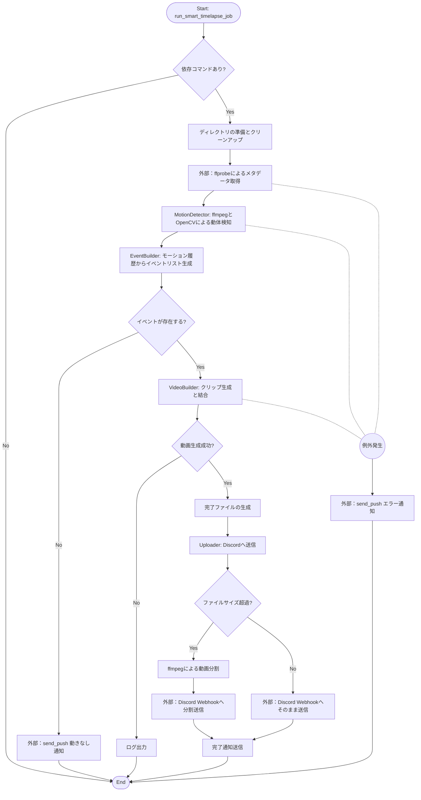
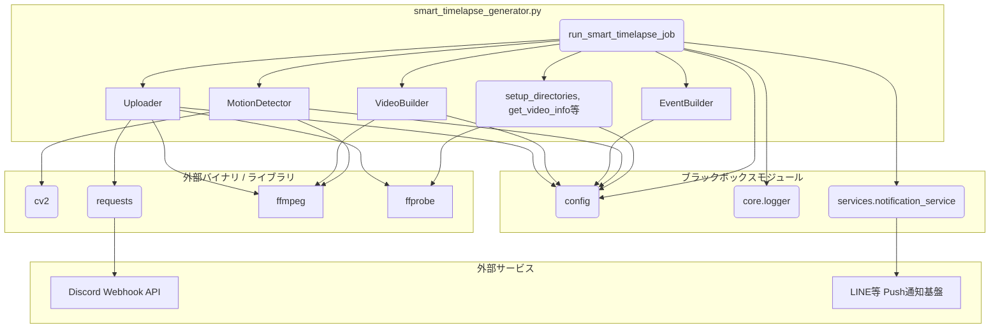

## 1. 解析メタ情報

| 項目 | 内容 |
| --- | --- |
| 対象ファイル | smart_timelapse_generator.py |
| 言語 | Python |
| 解析対象 | 提供されたコードのみ |
| 推測・補完 | 一切なし |

## 2. ファイルの概要

* 動画ファイルを入力として受け取り、OpenCVの背景差分を用いて動き（モーション）のある領域を検出する。

* 検出された動きの時間をグルーピングしてイベント化し、FFmpegを用いて該当部分のみを切り出し、結合したタイムラプス（ダイジェスト）動画を生成する。

* 生成した動画のファイルサイズを判定し、制限以上の場合は分割した上でDiscordのWebhook経由で直接アップロードする。

* 処理の完了後やエラー発生時、動きがなかった場合には、外部サービスを介してプッシュ通知を送信する。

## 3. 外部依存関係

### インポート一覧

| 名称 | 種類 | 用途 | 根拠 |
| --- | --- | --- | --- |
| `os`, `sys`, `subprocess`, `csv`, `datetime`, `math`, `time`, `json`, `tempfile`, `traceback`, `shutil`, `re`, `pathlib`, `typing`, `dataclasses` | 標準ライブラリ | ファイル操作、プロセス実行、時間計算、データ構造定義など | インポート宣言 (行番号取得不可 / 抜粋: "import os") |
| `numpy` | 外部ライブラリ | OpenCVで処理する画像配列データの型変換と操作 | インポート宣言 (行番号取得不可 / 抜粋: "import numpy as np") |
| `cv2` | 外部ライブラリ | 動画フレームの背景差分検出、モルフォロジー変換、輪郭抽出 | インポート宣言 (行番号取得不可 / 抜粋: "import cv2") |
| `requests` | 外部ライブラリ | Discord Webhookへの動画ファイルおよびメッセージのPOST送信 | インポート宣言 (行番号取得不可 / 抜粋: "import requests") |
| `psutil` | 外部ライブラリ(任意) | システム全体のCPU使用率の取得とロギング | インポート宣言 (行番号取得不可 / 抜粋: "import psutil") |
| `config` | ローカルモジュール | 各種設定値（解像度、しきい値、Webhook URLなど）の読み込み | インポート宣言 (行番号取得不可 / 抜粋: "import config") |
| `core.logger` | ローカルモジュール | ロガーのセットアップ処理 | インポート宣言 (行番号取得不可 / 抜粋: "from core.logger import setup_logging") |
| `services.notification_service` | ローカルモジュール | プッシュ通知（LINE等）の送信 | インポート宣言 (行番号取得不可 / 抜粋: "from services.notification_service import send_push") |

### ブラックボックスとなる外部要素

| 名称 | 理由 | 根拠 |
| --- | --- | --- |
| `config`モジュール | 設定値の実体や環境変数とのマッピング仕様がファイル内に記述されていないため。 | `getattr(config, 'TIMELAPSE_FPS_ANALYZE', 1)` などの呼び出し (行番号取得不可 / 抜粋: "getattr(config, 'TIMELAPSE_...") |
| `core.logger.setup_logging` | 出力先、ログローテーション、フォーマットなどのロギング仕様が不明なため。 | `logger = setup_logging(__name__)` (行番号取得不可 / 抜粋: "logger = setup_logging(**name**)") |
| `services.notification_service.send_push` | 引数の詳細仕様および実際の送信先プラットフォームの実装内容が不明なため。 | `send_push(user_id, [...], "discord", "report")` (行番号取得不可 / 抜粋: "send_push(user_id, [{"type":") |
| `ffmpeg`, `ffprobe` (外部コマンド) | システム上にインストールされた実行バイナリに依存しており、バージョンごとの挙動差異が保証されないため。 | `subprocess.run(["ffmpeg"...])` (行番号取得不可 / 抜粋: "subprocess.run(["ffmpeg", "-ve...") |

## 4. 主要要素の定義（関数 / エンドポイント / コンポーネント）

### `get_video_info`

* **役割**: `ffprobe`コマンドを用いて入力動画のメタデータ情報をJSON形式で取得する。

* 根拠: 関数定義およびコマンド実行部 (行番号取得不可 / 抜粋: "cmd = ['ffprobe', '-v', 'quiet...")

* **引数/リクエスト**: `input_path` (str), `retries` (int = 3)。

* 根拠: 関数シグネチャ (行番号取得不可 / 抜粋: "def get_video_info(input_path: s...")

* **戻り値/レスポンス**: `Dict[str, Any]` (JSON解析結果)。

* 根拠: 関数シグネチャ (行番号取得不可 / 抜粋: "-> Dict[str, Any]:")

* **副作用**: 外部プロセス（`ffprobe`）の実行。

* 根拠: `subprocess.run(cmd...)` (行番号取得不可 / 抜粋: "res = subprocess.run(cmd, captu...")

* **エラーハンドリング**: `TimeoutExpired`および一般的な`Exception`をキャッチし、規定回数リトライする。失敗時は空の辞書を返す。

* 根拠: `except subprocess.TimeoutExpired as e:` (行番号取得不可 / 抜粋: "except subprocess.TimeoutExpire...")

### `get_video_start_dt`

* **役割**: 動画のメタデータ（`creation_time`）またはファイル名から動画の開始日時（`datetime`）を抽出する。

* 根拠: 日付パース処理 (行番号取得不可 / 抜粋: "dt = datetime.datetime.fromiso...")

* **引数/リクエスト**: `input_path` (str), `video_info` (Dict[str, Any])。

* 根拠: 関数シグネチャ (行番号取得不可 / 抜粋: "def get_video_start_dt(input_p...")

* **戻り値/レスポンス**: `datetime.datetime`。

* 根拠: 関数シグネチャ (行番号取得不可 / 抜粋: "-> datetime.datetime:")

* **副作用**: なし。

* 根拠: 処理内容が変数と文字列の解析のみであるため (行番号取得不可 / 抜粋: "return datetime.datetime.combi...")

* **エラーハンドリング**: 例外発生時（タグなし、パースエラー等）はファイル名からの正規表現抽出へフォールバックし、それでも取得できない場合は現在日付の0時0分0秒を返す。

* 根拠: `except Exception as e:` (行番号取得不可 / 抜粋: "except Exception as e:")

### `setup_directories`

* **役割**: 処理に必要な作業用ディレクトリ、出力ディレクトリ、記録用ディレクトリを作成し、作業用ディレクトリ内の既存ファイルを削除（クリーンアップ）する。

* 根拠: ディレクトリ作成およびクリーンアップ処理 (行番号取得不可 / 抜粋: "os.makedirs(work_dir, exist_ok...")

* **引数/リクエスト**: なし。

* 根拠: 関数シグネチャ (行番号取得不可 / 抜粋: "def setup_directories() -> Tup...")

* **戻り値/レスポンス**: `Tuple[str, str, str]` (`work_dir`, `output_dir`, `records_dir`のパス)。

* 根拠: 関数シグネチャ (行番号取得不可 / 抜粋: "-> Tuple[str, str, str]:")

* **副作用**: ファイルシステムのディレクトリ作成、ファイル・ディレクトリの削除。

* 根拠: `os.makedirs`, `os.remove`, `shutil.rmtree` (行番号取得不可 / 抜粋: "os.remove(file_path)")

* **エラーハンドリング**: クリーンアップ時の例外をキャッチし、警告ログを出力する。

* 根拠: `except Exception as e:` (行番号取得不可 / 抜粋: "logger.warning(f"作業ディレクトリのクリ...")

### `MotionDetector` クラス

* **役割**: 動画から指定したROI（関心領域）内の動きを検知し、モーション記録のリストを生成する。

* 根拠: 背景差分と輪郭抽出処理 (行番号取得不可 / 抜粋: "fgmask = self.fgbg.apply(roi_f...")

* **引数/リクエスト**: コンストラクタ引数なし。`detect`メソッド: `input_path` (str), `work_dir` (str), `duration_sec` (float)。

* 根拠: メソッドシグネチャ (行番号取得不可 / 抜粋: "def detect(self, input_path: s...")

* **戻り値/レスポンス**: `List[MotionRecord]`。

* 根拠: メソッドシグネチャ (行番号取得不可 / 抜粋: "-> List[MotionRecord]:")

* **副作用**: `ffmpeg`プロセスを実行して標準出力を読み取り、作業ディレクトリに`motion.csv`ファイルを生成する。

* 根拠: `subprocess.Popen`および`csv.writer` (行番号取得不可 / 抜粋: "with open(motion_csv, "w", new...")

* **エラーハンドリング**: `ffmpeg`のプロセス起動失敗、読み取り時の例外、非ゼロ終了時のエラー出力をスローする。終了時はプロセスを安全にkillする。

* 根拠: `except Exception as e:` および `finally:` (行番号取得不可 / 抜粋: "raise subprocess.CalledProcess...")

### `EventBuilder` クラス

* **役割**: 検出されたモーション記録間の時間差を評価し、しきい値（`GAP_THRESH`）以内のものを一つのイベントに結合する。また、イベントごとにスコアやメタデータを付与してCSVへ出力する。

* 根拠: イベント結合ロジック (行番号取得不可 / 抜粋: "if record.time_sec - last_reco...")

* **引数/リクエスト**: `build`メソッド: `motion_records` (List[MotionRecord]), `work_dir` (str)。

* 根拠: メソッドシグネチャ (行番号取得不可 / 抜粋: "def build(self, motion_records...")

* **戻り値/レスポンス**: `List[EventRecord]`。

* 根拠: メソッドシグネチャ (行番号取得不可 / 抜粋: "-> List[EventRecord]:")

* **副作用**: 作業ディレクトリに`events.csv`および`events_enriched.csv`を生成する。

* 根拠: `csv.writer`処理 (行番号取得不可 / 抜粋: "with open(events_csv, "w", new...")

* **エラーハンドリング**: モーション記録が空の場合は空のリストを即時返却する。

* 根拠: `if not motion_records:` (行番号取得不可 / 抜粋: "if not motion_records: return")

### `VideoBuilder` クラス

* **役割**: 生成されたイベントリストに基づき、入力動画から該当する時間帯を切り出し（クリップ化）、それらを一つに結合してタイムラプス動画とサムネイル画像を生成する。

* 根拠: 切り出し・結合処理の実行部 (行番号取得不可 / 抜粋: "if not self._build_concat(clip...")

* **引数/リクエスト**: `build`メソッド: `input_path` (str), `events` (List[EventRecord]), `output_path` (str), `temp_dir` (str), `video_start_dt` (datetime.datetime)。

* 根拠: メソッドシグネチャ (行番号取得不可 / 抜粋: "def build(self, input_path: st...")

* **戻り値/レスポンス**: `bool` (動画生成の成功・失敗)。

* 根拠: メソッドシグネチャ (行番号取得不可 / 抜粋: "-> bool:")

* **副作用**: 一時ディレクトリへの分割動画の生成、結合用テキストファイルの生成、最終動画の生成、サムネイル画像の生成。

* 根拠: `subprocess.run(cmd...)` (行番号取得不可 / 抜粋: "subprocess.run(cmd, stdout=sub...")

* **エラーハンドリング**: FFmpegプロセス実行時のタイムアウト、プロセスのエラーコードをキャッチし、処理をスキップまたは失敗として扱う。

* 根拠: `except subprocess.TimeoutExpired:` (行番号取得不可 / 抜粋: "except subprocess.CalledProces...")

### `Uploader` クラス

* **役割**: 生成された動画ファイルのサイズを判定し、制限（`MAX_FILE_SIZE_BYTES`）を超える場合はFFmpegを用いて動画を分割した後、Discord Webhookに対して動画ファイルと完了通知を送信する。

* 根拠: 分割ロジックと送信ロジック (行番号取得不可 / 抜粋: "pc = math.ceil(summary.file_si...")

* **引数/リクエスト**: `split_and_send`メソッド: `summary` (SummaryInfo), `base_filename` (str)。

* 根拠: メソッドシグネチャ (行番号取得不可 / 抜粋: "def split_and_send(self, summa...")

* **戻り値/レスポンス**: `None`。

* 根拠: メソッドシグネチャ (行番号取得不可 / 抜粋: "-> None:")

* **副作用**: 動画の分割ファイル生成、外部API（Discord Webhook）へのHTTP POSTリクエスト送信。

* 根拠: `subprocess.run`, `requests.post` (行番号取得不可 / 抜粋: "requests.post(")

* **エラーハンドリング**: 動画分割プロセスの失敗やWebhook送信時の例外をキャッチし、ログにエラーを出力する。

* 根拠: `except Exception as e:` (行番号取得不可 / 抜粋: "except Exception as e: logger....")

### `run_smart_timelapse_job`

* **役割**: 全体の処理フローを統括するメイン関数。依存コマンドの確認からディレクトリ設定、動画解析、イベント生成、動画結合、結果ファイルの保存、Discordへのアップロードまでを順次呼び出す。

* 根拠: 処理のオーケストレーション (行番号取得不可 / 抜粋: "info = get_video_info(input_vi...")

* **引数/リクエスト**: `input_video` (str)。

* 根拠: 関数シグネチャ (行番号取得不可 / 抜粋: "def run_smart_timelapse_job(in...")

* **戻り値/レスポンス**: `None`。

* 根拠: 関数シグネチャ (行番号取得不可 / 抜粋: "-> None:")

* **副作用**: 他クラスの呼び出しによるすべての副作用、完了記録ファイル（`.done`）の生成、プッシュ通知送信。

* 根拠: `mark_as_done(...)`, `send_push(...)` (行番号取得不可 / 抜粋: "mark_as_done(rec, os.path.base...")

* **エラーハンドリング**: 全体処理を`try-except`で囲み、例外発生時にはスタックトレースをログに出力し、外部API経由でエラー通知を送信する。

* 根拠: `except Exception as e:` (行番号取得不可 / 抜粋: "send_push(user_id, [{"type": "...")

## 5. 処理フロー図

## 6. 依存関係図

## 7. 次のステップ（リバースエンジニアリングの提案）

| 優先度 | ファイル名(推測可) | 理由 | 根拠 |
| --- | --- | --- | --- |
| 高 | `config.py` | FPS、しきい値、Webhook URLなど、プログラムの振る舞いを決定づける全ての定数と、その環境変数マッピング方法を確認するため。 | `getattr(config, 'TIMELAPSE_FPS_ANALYZE', 1)` などの記述 |
| 中 | `core/logger.py` | エラー解析において必須となるログの出力先、レベル（INFO/ERROR等）の設定内容を確認するため。 | `from core.logger import setup_logging` の記述 |
| 中 | `services/notification_service.py` | `send_push`が呼び出された際の実際の通知先（LINE、Discord等）や、メッセージフォーマットの変換ロジックを確認するため。 | `from services.notification_service import send_push` の記述 |

## 8. 保守上の注意点

* `ffmpeg`および`ffprobe`コマンドのプロセス実行(`subprocess.run`, `subprocess.Popen`)に強く依存しており、実行マシンのコマンドパスやバージョンに影響を受ける。

* 一時ディレクトリ・ファイル（`work/timelapse`, `assets/timelapse`, `data/timelapse_records`）を作成・削除・操作する副作用が各所に存在する。

* サイズが大きい動画を分割（segment）するロジックが含まれており、分割時のファイルI/OやCPUリソースの消費が増加する。

* OpenCVの背景差分学習（`createBackgroundSubtractorMOG2`）を使用しているため、動画の初期フレーム周辺の精度はパラメータ（`history`や`varThreshold`）のチューニングに依存する。

## 9. 不明事項一覧

| 項目 | 理由 | 必要なファイル |
| --- | --- | --- |
| 設定値の初期化と実体 | `config`内に設定値が直接記述されているか、.envなどから読み込んでいるか不明。 | `config.py` |
| ロギング仕様 | `setup_logging`関数によるログのフォーマットや保存先が不明。 | `core/logger.py` |
| プッシュ通知基盤の仕様 | `send_push`関数が利用しているメッセージング基盤と、パラメータのマッピング仕様が不明。 | `services/notification_service.py` |

## 10. 自己検証結果

* [x] 推測・外部ファイルの仕様を一切含んでいない
* [x] 全関数・全クラス・全コンポーネントを列挙した
* [x] 全てのインポート要素を列挙した
* [x] すべての仕様説明に「根拠（行番号・抜粋）」を明記した
* [x] 根拠漏れが0件である
* [x] Mermaid構文にエラーの原因となる記号（エスケープ漏れ）がない
* [x] 不明事項を漏れなく列挙した

完了