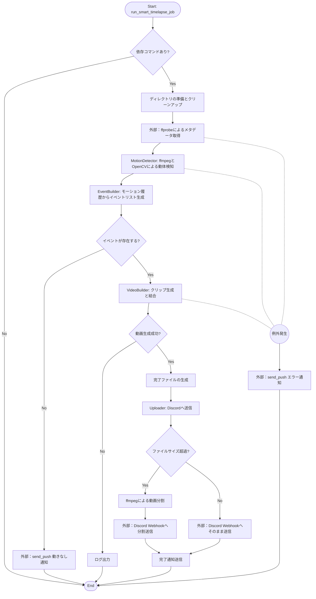
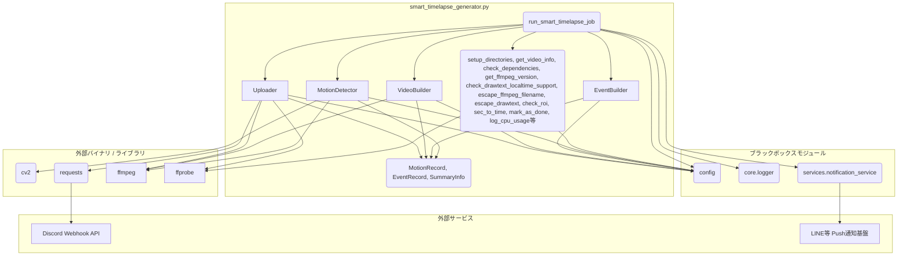

## 1. 解析メタ情報

| 項目 | 内容 |
| --- | --- |
| 対象ファイル | smart_timelapse_generator.py |
| 言語 | Python |
| 解析対象 | 提供されたコードのみ |
| 推測・補完 | 一切なし |

## 関連ドキュメント

- [config.md](./config.md) — 設定値(解像度・しきい値・Webhook URL等)を提供
- [logger.md](./logger.md) — `core.logger.setup_logging`の実体
- [notification_service.md](./notification_service.md) — `services.notification_service.send_push`の実体
- [daily_timelapse_job.md](./daily_timelapse_job.md) — 呼び出し元。`from monitors.smart_timelapse_generator import ...` で本ファイルのコアエンジン(`MotionDetector`, `EventBuilder`, `VideoBuilder`, `Uploader`等)を利用している

## 2. ファイルの概要

* 動画ファイルを入力として受け取り、OpenCVの背景差分を用いて動き（モーション）のある領域を検出する。

* 検出された動きの時間をグルーピングしてイベント化し、FFmpegを用いて該当部分のみを切り出し、結合したタイムラプス（ダイジェスト）動画を生成する。

* 生成した動画のファイルサイズを判定し、制限以上の場合は分割した上でDiscordのWebhook経由で直接アップロードする。

* 処理の完了後やエラー発生時、動きがなかった場合には、外部サービスを介してプッシュ通知を送信する。

## 3. 外部依存関係

### インポート一覧

| 名称 | 種類 | 用途 | 根拠 |
| --- | --- | --- | --- |
| `os`, `sys`, `subprocess`, `csv`, `datetime`, `math`, `time`, `json`, `tempfile`, `traceback`, `shutil`, `re`, `pathlib`, `typing`, `dataclasses` | 標準ライブラリ | ファイル操作、プロセス実行、時間計算、データ構造定義など | インポート宣言 (行番号: 1-9, 12-14, 16-18 / 抜粋: "import os") |
| `numpy` | 外部ライブラリ | OpenCVで処理する画像配列データの型変換と操作 | インポート宣言 (行番号: 10 / 抜粋: "import numpy as np") |
| `cv2` | 外部ライブラリ | 動画フレームの背景差分検出、モルフォロジー変換、輪郭抽出 | インポート宣言 (行番号: 11 / 抜粋: "import cv2") |
| `requests` | 外部ライブラリ | Discord Webhookへの動画ファイルおよびメッセージのPOST送信 | インポート宣言 (行番号: 15 / 抜粋: "import requests") |
| `psutil` | 外部ライブラリ(任意) | システム全体のCPU使用率の取得とロギング | インポート宣言 (行番号: 21 / 抜粋: "import psutil") |
| `config` | ローカルモジュール | 各種設定値（解像度、しきい値、Webhook URLなど）の読み込み | インポート宣言 (行番号: 31 / 抜粋: "import config") |
| `core.logger` | ローカルモジュール | ロガーのセットアップ処理 | インポート宣言 (行番号: 32 / 抜粋: "from core.logger import setup_logging") |
| `services.notification_service` | ローカルモジュール | プッシュ通知（LINE等）の送信 | インポート宣言 (行番号: 33 / 抜粋: "from services.notification_service import send_push") |

### ブラックボックスとなる外部要素

| 名称 | 理由 | 根拠 |
| --- | --- | --- |
| `config`モジュール | 設定値の実体や環境変数とのマッピング仕様がファイル内に記述されていないため。 | `getattr(config, 'TIMELAPSE_FPS_ANALYZE', 1)` などの呼び出し (行番号: 41 / 抜粋: "getattr(config, 'TIMELAPSE_...") |
| `core.logger.setup_logging` | 出力先、ログローテーション、フォーマットなどのロギング仕様が不明なため。 | `logger = setup_logging(__name__)` (行番号: 36 / 抜粋: "logger = setup_logging(**name**)") |
| `services.notification_service.send_push` | 実際の送信先プラットフォームの実装内容が不明なため。引数のマッピング(`target`/`channel`)自体は`notification_service.md`から判明しており、本ファイル側は`target="discord"`/`channel="report"`または`"error"`をキーワード引数で渡すよう修正済み(Issue #167)。 | `send_push(user_id, [...], target="discord", channel="report")` (行番号: 661〜666, 688〜693 / 抜粋: "send_push(\n                user_id,") |
| `ffmpeg`, `ffprobe` (外部コマンド) | システム上にインストールされた実行バイナリに依存しており、バージョンごとの挙動差異が保証されないため。 | `subprocess.run(["ffmpeg"...])` (行番号: 125 / 抜粋: "subprocess.run(["ffmpeg", "-ve...") |

## 4. 主要要素の定義（関数 / エンドポイント / コンポーネント）

### `get_ffmpeg_stderr`

* **役割**: `DEBUG_FFMPEG`設定が有効な場合は`sys.stderr`を、無効な場合は`subprocess.DEVNULL`を返す。FFmpeg実行時の標準エラー出力先を一元的に切り替えるためのヘルパー関数。
* 根拠: 関数定義 (行番号: 68-69 / 抜粋: "def get_ffmpeg_stderr():\n    return sys.stderr if DEBUG_FFMPEG else subprocess.DEVNULL")

* **引数/リクエスト**: なし。
* 根拠: 関数シグネチャ (行番号: 68 / 抜粋: "def get_ffmpeg_stderr():")

* **戻り値/レスポンス**: `sys.stderr`または`subprocess.DEVNULL`（型ヒントなし）。
* 根拠: 関数本体 (行番号: 69 / 抜粋: "return sys.stderr if DEBUG_FFMPEG else subprocess.DEVNULL")

* **副作用**: なし。

* **エラーハンドリング**: なし。

### `MotionRecord` (dataclass)

* **役割**: 動体検知処理(`MotionDetector`)が1秒単位で記録する、検知時刻・最大輪郭面積・輪郭数を保持するデータ構造。
* 根拠: `@dataclass class MotionRecord:` (行番号: 74-78 / 抜粋: "class MotionRecord:\n    time_sec: int\n    largest_area: float\n    contour_count: int")

* **フィールド**: `time_sec: int`, `largest_area: float`, `contour_count: int`

* **副作用**: なし。

* **エラーハンドリング**: なし。

### `EventRecord` (dataclass)

* **役割**: `MotionRecord`をグルーピングして生成される「イベント」（一連の動きのまとまり）のデータ構造。開始・終了秒、スコア、検出物体数（人物・車両・動物・顔）などを保持する。`__post_init__`で`duration`（継続時間）を自動計算する。
* 根拠: `@dataclass class EventRecord:` および `def __post_init__(self):` (行番号: 93-94 / 抜粋: "self.duration = (self.end_sec - self.start_sec) + 1")

* **フィールド**: `event_id: str`, `start_sec: int`, `end_sec: int`, `max_area: float`, `score: float = 0.0`, `duration: int = 0`, `person_count: int = 0`, `vehicle_count: int = 0`, `animal_count: int = 0`, `face_detected: int = 0`

* **副作用**: `__post_init__`によるインスタンス自身の`duration`フィールドの上書き。

* **エラーハンドリング**: なし。

### `SummaryInfo` (dataclass)

* **役割**: 1回のタイムラプス生成ジョブ全体の結果サマリ（対象日、イベント数、処理時間、出力パス、ファイルサイズ、バージョン情報等）を保持し、`mark_as_done`で完了記録ファイル(`.done`)としてJSON出力される。
* 根拠: `@dataclass class SummaryInfo:` (行番号: 96-107 / 抜粋: "class SummaryInfo:\n    target_date: str")

* **フィールド**: `target_date: str`, `events: int = 0`, `summary_duration: int = 0`, `total_processing_time: float = 0.0`, `output_path: str = ""`, `file_size_bytes: int = 0`, `version: str = __version__`, `ffmpeg_version: str = ""`, `opencv_version: str = cv2.__version__`, `fast_stream_copy_mode: bool = FAST_STREAM_COPY_MODE`

* **副作用**: なし（フィールドのデフォルト値取得時に`cv2.__version__`等の外部値を参照）。

* **エラーハンドリング**: なし。

### `sec_to_time`

* **役割**: 秒数(int)を`datetime.timedelta`経由で`H:MM:SS`形式の文字列に変換する。
* 根拠: 関数定義 (行番号: 112-113 / 抜粋: "def sec_to_time(sec: int) -> str:\n    return str(datetime.timedelta(seconds=sec))")

* **引数/リクエスト**: `sec: int`

* **戻り値/レスポンス**: `str`

* **副作用**: なし。

* **エラーハンドリング**: なし。

### `check_dependencies`

* **役割**: 実行に必要な外部コマンド(`ffmpeg`, `ffprobe`, `nice`)が`PATH`上に存在するかを`shutil.which`で確認する。
* 根拠: 関数定義 (行番号: 116 / 抜粋: "required_cmds = ["ffmpeg", "ffprobe", "nice"]")

* **引数/リクエスト**: なし。

* **戻り値/レスポンス**: `bool`（全コマンドが存在すればTrue）

* **副作用**: なし。

* **エラーハンドリング**: コマンドが見つからない場合はエラーログを出力してFalseを返す（例外は発生させない）。
* 根拠: `if not shutil.which(cmd): logger.error(...)` (行番号: 118-120)

### `get_ffmpeg_version`

* **役割**: `ffmpeg -version`コマンドを実行し、出力の1行目（バージョン文字列）を取得する。
* 根拠: 関数定義 (行番号: 125 / 抜粋: "res = subprocess.run(["ffmpeg", "-version"]...")

* **引数/リクエスト**: なし。

* **戻り値/レスポンス**: `str`（取得失敗時は`"Unknown"`）

* **副作用**: 外部プロセス(`ffmpeg`)の実行。

* **エラーハンドリング**: 例外発生時は`"Unknown"`を返す（例外を再送出しない）。
* 根拠: `except Exception: return "Unknown"` (行番号: 127-128)

### `check_drawtext_localtime_support`

* **役割**: `ffmpeg -h filter=drawtext`の出力に`localtime`という文字列が含まれるかを確認し、実行環境のffmpegが`drawtext`フィルタの`localtime`指定に対応しているかを判定する。モジュールロード時に一度だけ実行され、結果は`HAS_DRAWTEXT_LOCALTIME`というモジュールレベル変数に保持される。
* 根拠: 関数定義および呼び出し (行番号: 130, 137 / 抜粋: "HAS_DRAWTEXT_LOCALTIME = check_drawtext_localtime_support()")

* **引数/リクエスト**: なし。

* **戻り値/レスポンス**: `bool`

* **副作用**: 外部プロセス(`ffmpeg`)の実行。モジュールロード時に1回実行されるため、インポート自体に若干の遅延が生じる。

* **エラーハンドリング**: 例外発生時は`False`を返す。
* 根拠: `except Exception: return False` (行番号: 134-135)

### `get_video_info`

* **役割**: `ffprobe`コマンドを用いて入力動画のメタデータ情報をJSON形式で取得する。

* 根拠: 関数定義およびコマンド実行部 (行番号: 140 / 抜粋: "cmd = ['ffprobe', '-v', 'quiet...")

* **引数/リクエスト**: `input_path` (str), `retries` (int = 3)。

* 根拠: 関数シグネチャ (行番号: 139 / 抜粋: "def get_video_info(input_path: s...")

* **戻り値/レスポンス**: `Dict[str, Any]` (JSON解析結果)。

* 根拠: 関数シグネチャ (行番号: 139 / 抜粋: "-> Dict[str, Any]:")

* **副作用**: 外部プロセス（`ffprobe`）の実行。

* 根拠: `subprocess.run(cmd...)` (行番号: 143 / 抜粋: "res = subprocess.run(cmd, captu...")

* **エラーハンドリング**: `TimeoutExpired`および一般的な`Exception`をキャッチし、規定回数リトライする。失敗時は空の辞書を返す。

* 根拠: `except subprocess.TimeoutExpired as e:` (行番号: 151 / 抜粋: "except subprocess.TimeoutExpire...")

### `get_video_start_dt`

* **役割**: 動画のメタデータ（`creation_time`）またはファイル名から動画の開始日時（`datetime`）を抽出する。

* 根拠: 日付パース処理 (行番号: 167 / 抜粋: "dt = datetime.datetime.fromiso...")

* **引数/リクエスト**: `input_path` (str), `video_info` (Dict[str, Any])。

* 根拠: 関数シグネチャ (行番号: 163 / 抜粋: "def get_video_start_dt(input_p...")

* **戻り値/レスポンス**: `datetime.datetime`。

* 根拠: 関数シグネチャ (行番号: 163 / 抜粋: "-> datetime.datetime:")

* **副作用**: なし。

* 根拠: 処理内容が変数と文字列の解析のみであるため (行番号: 188-189 / 抜粋: "return datetime.datetime.combi...")

* **エラーハンドリング**: 例外発生時（タグなし、パースエラー等）はファイル名からの正規表現抽出へフォールバックし、それでも取得できない場合は現在日付の0時0分0秒を返す。

* 根拠: `except Exception as e:` (行番号: 169 / 抜粋: "except Exception as e:")

### `escape_ffmpeg_filename`

* **役割**: FFmpegの`concat`デマクサ用ファイルリストに書き込むファイルパス中のシングルクォートをエスケープする。
* 根拠: 関数定義 (行番号: 192 / 抜粋: "return filename.replace("'", "'\\\\''")")

* **引数/リクエスト**: `filename: str`

* **戻り値/レスポンス**: `str`

* **副作用**: なし。

* **エラーハンドリング**: なし。

### `escape_drawtext`

* **役割**: FFmpegの`drawtext`フィルタに渡すテキスト中の特殊文字（バックスラッシュ、シングルクォート、コロン）をエスケープする。
* 根拠: 関数定義 (行番号: 195 / 抜粋: "return text.replace('\\\\', '\\\\\\\\').replace(...)")

* **引数/リクエスト**: `text: str`

* **戻り値/レスポンス**: `str`

* **副作用**: なし。

* **エラーハンドリング**: なし。

### `check_roi`

* **役割**: 設定されたROI（関心領域: `ROI_X`, `ROI_Y`, `ROI_W`, `ROI_H`）が、映像の幅・高さ内に収まっている妥当な値かを検証する。`MotionDetector.__init__`から呼び出される。
* 根拠: 関数定義 (行番号: 198-199 / 抜粋: "if ROI_W <= 0 or ROI_H <= 0: raise ValueError(...)")

* **引数/リクエスト**: `w: int`, `h: int`

* **戻り値/レスポンス**: `None`

* **副作用**: なし。

* **エラーハンドリング**: ROIが不正な場合（幅/高さが0以下、始点が画面外、範囲が画面サイズを超過）は`ValueError`を送出する（呼び出し元での捕捉は行わない）。
* 根拠: `raise ValueError(...)` (3箇所, 行番号: 199, 201, 203)

### `setup_directories`

* **役割**: 処理に必要な作業用ディレクトリ、出力ディレクトリ、記録用ディレクトリを作成し、作業用ディレクトリ内の既存ファイルを削除（クリーンアップ）する。

* 根拠: ディレクトリ作成およびクリーンアップ処理 (行番号: 211-213, 215-223 / 抜粋: "os.makedirs(work_dir, exist_ok...")

* **引数/リクエスト**: なし。

* 根拠: 関数シグネチャ (行番号: 205 / 抜粋: "def setup_directories() -> Tup...")

* **戻り値/レスポンス**: `Tuple[str, str, str]` (`work_dir`, `output_dir`, `records_dir`のパス)。

* 根拠: 関数シグネチャ (行番号: 205 / 抜粋: "-> Tuple[str, str, str]:")

* **副作用**: ファイルシステムのディレクトリ作成、ファイル・ディレクトリの削除。

* 根拠: `os.makedirs`, `os.remove`, `shutil.rmtree` (行番号: 211-213, 219, 221 / 抜粋: "os.remove(file_path)")

* **エラーハンドリング**: クリーンアップ時の例外をキャッチし、警告ログを出力する。

* 根拠: `except Exception as e:` (行番号: 222-223 / 抜粋: "logger.warning(f"作業ディレクトリのクリ...")

### `mark_as_done`

* **役割**: ジョブの完了記録として、`SummaryInfo`の内容をJSON形式で`.done`ファイルに書き出す。ファイル名は入力動画のベース名から拡張子を除いたものに`.done`を付与して生成する。
* 根拠: 関数定義 (行番号: 231 / 抜粋: "json.dump(asdict(summary), f, indent=2, ensure_ascii=False)")

* **引数/リクエスト**: `records_dir: str`, `base_filename: str`, `summary: SummaryInfo`

* **戻り値/レスポンス**: なし（`None`）

* **副作用**: `records_dir`ディレクトリの作成（存在しない場合）、`.done`ファイルへの書き込み。

* **エラーハンドリング**: なし（明示的な例外処理は行われていない）。

### `log_cpu_usage`

* **役割**: `psutil`がインストールされている場合のみ、現在のCPU使用率をINFOレベルでログ出力する。
* 根拠: 関数定義 (行番号: 234-235 / 抜粋: "if HAS_PSUTIL: logger.info(f"現在のCPU使用率: {psutil.cpu_percent()}%")")

* **引数/リクエスト**: なし。

* **戻り値/レスポンス**: なし（`None`）

* **副作用**: `psutil`利用可能時のログ出力。

* **エラーハンドリング**: なし。`psutil`が未インストールの環境では`HAS_PSUTIL`フラグにより処理自体がスキップされる（インポート時の`try/except ImportError`により判定）。
* 根拠: `try: import psutil; HAS_PSUTIL = True except ImportError: HAS_PSUTIL = False` (行番号: 20-24)

### `MotionDetector` クラス

* **役割**: 動画から指定したROI（関心領域）内の動きを検知し、モーション記録のリストを生成する。

* 根拠: 背景差分と輪郭抽出処理 (行番号: 279 / 抜粋: "fgmask = self.fgbg.apply(roi_f...")

* **引数/リクエスト**: コンストラクタ引数なし。`detect`メソッド: `input_path` (str), `work_dir` (str), `duration_sec` (float)。

* 根拠: メソッドシグネチャ (行番号: 246 / 抜粋: "def detect(self, input_path: s...")

* **戻り値/レスポンス**: `List[MotionRecord]`。

* 根拠: メソッドシグネチャ (行番号: 246 / 抜粋: "-> List[MotionRecord]:")

* **副作用**: `ffmpeg`プロセスを実行して標準出力を読み取り、作業ディレクトリに`motion.csv`ファイルを生成する。

* 根拠: `subprocess.Popen`および`csv.writer` (行番号: 261, 319-324 / 抜粋: "with open(motion_csv, "w", new...")

* **エラーハンドリング**: `ffmpeg`のプロセス起動失敗、読み取り時の例外、非ゼロ終了時のエラー出力をスローする。終了時はプロセスを安全にkillする。

* 根拠: `except Exception as e:` および `finally:` (行番号: 303-305, 306-317 / 抜粋: "raise subprocess.CalledProcess...")

### `EventBuilder` クラス

* **役割**: 検出されたモーション記録間の時間差を評価し、しきい値（`GAP_THRESH`）以内のものを一つのイベントに結合する。また、イベントごとにスコアやメタデータを付与してCSVへ出力する。

* 根拠: イベント結合ロジック (行番号: 342 / 抜粋: "if record.time_sec - last_reco...")

* **引数/リクエスト**: `build`メソッド: `motion_records` (List[MotionRecord]), `work_dir` (str)。

* 根拠: メソッドシグネチャ (行番号: 332 / 抜粋: "def build(self, motion_records...")

* **戻り値/レスポンス**: `List[EventRecord]`。

* 根拠: メソッドシグネチャ (行番号: 332 / 抜粋: "-> List[EventRecord]:")

* **副作用**: 作業ディレクトリに`events.csv`および`events_enriched.csv`を生成する。

* 根拠: `csv.writer`処理 (行番号: 376-389 / 抜粋: "with open(events_csv, "w", new...")

* **エラーハンドリング**: モーション記録が空の場合は空のリストを即時返却する。

* 根拠: `if not motion_records:` (行番号: 334-335 / 抜粋: "if not motion_records: return")

### `VideoBuilder` クラス

* **役割**: 生成されたイベントリストに基づき、入力動画から該当する時間帯を切り出し（クリップ化）、それらを一つに結合してタイムラプス動画とサムネイル画像を生成する。

* 根拠: 切り出し・結合処理の実行部 (行番号: 424 / 抜粋: "if not self._build_concat(clip...")

* **引数/リクエスト**: `build`メソッド: `input_path` (str), `events` (List[EventRecord]), `output_path` (str), `temp_dir` (str), `video_start_dt` (datetime.datetime)。

* 根拠: メソッドシグネチャ (行番号: 405 / 抜粋: "def build(self, input_path: st...")

* **戻り値/レスポンス**: `bool` (動画生成の成功・失敗)。

* 根拠: メソッドシグネチャ (行番号: 405 / 抜粋: "-> bool:")

* **副作用**: 一時ディレクトリへの分割動画の生成、結合用テキストファイルの生成、最終動画の生成、サムネイル画像の生成。

* 根拠: `subprocess.run(cmd...)` (行番号: 436, 480-494, 499 / 抜粋: "subprocess.run(cmd, stdout=sub...")

* **エラーハンドリング**: FFmpegプロセス実行時のタイムアウト、プロセスのエラーコードをキャッチし、処理をスキップまたは失敗として扱う。

* 根拠: `except subprocess.TimeoutExpired:` (行番号: 442-447 / 抜粋: "except subprocess.CalledProces...")

### `Uploader` クラス

* **役割**: 生成された動画ファイルのサイズを判定し、制限（`MAX_FILE_SIZE_BYTES`）を超える場合はFFmpegを用いて動画を分割した後、Discord Webhookに対して動画ファイルと完了通知を送信する。分割ファイル(`*_part_*.mp4`)は送信専用の一時生成物であり、送信の成否に関わらず`finally`節で削除する(Issue #171: 以前はこの削除が無く、元動画とは別にローカルディスクへ重複して残り続けていた)。元動画(`summary.output_path`)自体はここでは削除せず、`nas_monitor`の保持期間ベースのリテンションクリーンアップに委ねる。

* 根拠: 分割ロジックと送信ロジック (行番号: 589 / 抜粋: "pc = math.ceil(summary.file_si...")
* 根拠: `split_files: List[Path] = []` および `finally:` ブロック (行番号: 584, 609〜618 / 抜粋: "for s_file in split_files:\n try:\n os.remove(s_file)")

* **引数/リクエスト**: `split_and_send`メソッド: `summary` (SummaryInfo), `base_filename` (str)。

* 根拠: メソッドシグネチャ (行番号: 566 / 抜粋: "def split_and_send(self, summa...")

* **戻り値/レスポンス**: `None`。

* 根拠: メソッドシグネチャ (行番号: 566 / 抜粋: "-> None:")

* **副作用**: 動画の分割ファイル生成、外部API（Discord Webhook）へのHTTP POSTリクエスト送信、分割ファイルのローカル削除(`os.remove`、送信後に必ず実行)。

* 根拠: `subprocess.run`, `requests.post` (行番号: 586-597, 604 / 抜粋: "requests.post(")、`os.remove(s_file)` (行番号: 616)

* **エラーハンドリング**: 動画分割プロセスの失敗やWebhook送信時の例外をキャッチし、ログにエラーを出力する。分割ファイルの削除自体が失敗した場合(`OSError`)も個別に捕捉してログ出力するのみで処理を継続する。

* 根拠: `except Exception as e: logger.error(f"分割送信エラー: {e}")` (行番号: 608 / 抜粋: "except Exception as e: logger....")、`except OSError as cleanup_err:` (行番号: 617〜618)

### `run_smart_timelapse_job`

* **役割**: 全体の処理フローを統括するメイン関数。依存コマンドの確認からディレクトリ設定、動画解析、イベント生成、動画結合、結果ファイルの保存、Discordへのアップロードまでを順次呼び出す。

* 根拠: 処理のオーケストレーション (行番号: 584 / 抜粋: "info = get_video_info(input_vi...")

* **引数/リクエスト**: `input_video` (str)。

* 根拠: 関数シグネチャ (行番号: 577 / 抜粋: "def run_smart_timelapse_job(in...")

* **戻り値/レスポンス**: `None`。

* 根拠: 関数シグネチャ (行番号: 577 / 抜粋: "-> None:")

* **副作用**: 他クラスの呼び出しによるすべての副作用、完了記録ファイル（`.done`）の生成、プッシュ通知送信。

* 根拠: `mark_as_done(...)`, `send_push(...)` (行番号: 683, 661〜666, 688〜693 / 抜粋: "mark_as_done(rec, os.path.base...")

* **エラーハンドリング**: 全体処理を`try-except`で囲み、例外発生時にはスタックトレースをログに出力し、外部API経由でエラー通知を送信する。

* 根拠: `except Exception as e:` (行番号: 686〜693 / 抜粋: "send_push(\n            user_id,")

## 5. 処理フロー図

```mermaid
flowchart TD
    Start([Start: run_smart_timelapse_job]) --> CheckDeps{依存コマンドあり?}
    CheckDeps -- No --> End([End])
    CheckDeps -- Yes --> SetupDirs[ディレクトリの準備とクリーンアップ]
    SetupDirs --> GetVideoInfo[外部：ffprobeによるメタデータ取得]
    GetVideoInfo --> DetectMotion[MotionDetector: ffmpegとOpenCVによる動体検知]
    DetectMotion --> BuildEvents[EventBuilder: モーション履歴からイベントリスト生成]
    
    BuildEvents --> HasEvents{イベントが存在する?}
    HasEvents -- No --> SendPushNone[外部：send_push 動きなし通知]
    SendPushNone --> End
    
    HasEvents -- Yes --> BuildVideo[VideoBuilder: クリップ生成と結合]
    BuildVideo --> VideoSuccess{動画生成成功?}
    VideoSuccess -- No --> EndError[ログ出力]
    EndError --> End
    
    VideoSuccess -- Yes --> MarkDone[完了ファイルの生成]
    MarkDone --> Upload[Uploader: Discordへ送信]
    
    Upload --> SizeCheck{ファイルサイズ超過?}
    SizeCheck -- Yes --> SplitVideo[ffmpegによる動画分割]
    SplitVideo --> SendDiscord[外部：Discord Webhookへ分割送信]
    SizeCheck -- No --> SendDiscordDirect[外部：Discord Webhookへそのまま送信]
    
    SendDiscord --> SendPushNotice[完了通知送信]
    SendDiscordDirect --> SendPushNotice
    
    SendPushNotice --> End
    
    %% エラーハンドリング（グローバル）
    GetVideoInfo -.- ErrorHandler
    DetectMotion -.- ErrorHandler
    BuildVideo -.- ErrorHandler
    ErrorHandler((例外発生)) --> SendPushError[外部：send_push エラー通知]
    SendPushError --> End

```

## 6. 依存関係図

```mermaid
graph TD
    subgraph "smart_timelapse_generator.py"
        Main(run_smart_timelapse_job)
        MotionDetector
        EventBuilder
        VideoBuilder
        Uploader
        Utils(setup_directories, get_video_info, check_dependencies, get_ffmpeg_version, check_drawtext_localtime_support, escape_ffmpeg_filename, escape_drawtext, check_roi, sec_to_time, mark_as_done, log_cpu_usage等)
        DataClasses(MotionRecord, EventRecord, SummaryInfo)
    end
    
    subgraph "ブラックボックスモジュール"
        Config(config)
        Logger(core.logger)
        Notify(services.notification_service)
    end
    
    subgraph "外部バイナリ / ライブラリ"
        OpenCV(cv2)
        Requests(requests)
        FFmpeg[ffmpeg]
        FFprobe[ffprobe]
    end
    
    subgraph "外部サービス"
        Discord[Discord Webhook API]
        Line[LINE等 Push通知基盤]
    end

    Main --> Config
    Main --> Logger
    Main --> Notify
    Main --> Utils
    Main --> MotionDetector
    Main --> EventBuilder
    Main --> VideoBuilder
    Main --> Uploader
    
    Utils --> FFprobe
    Utils --> Config
    
    MotionDetector --> FFmpeg
    MotionDetector --> OpenCV
    MotionDetector --> Config
    MotionDetector --> DataClasses
    
    EventBuilder --> Config
    EventBuilder --> DataClasses
    VideoBuilder --> DataClasses
    Uploader --> DataClasses
    
    VideoBuilder --> FFmpeg
    VideoBuilder --> Config
    
    Uploader --> FFprobe
    Uploader --> FFmpeg
    Uploader --> Requests
    Uploader --> Config
    
    Requests --> Discord
    Notify --> Line

```

## 7. 次のステップ（リバースエンジニアリングの提案）

| 優先度 | ファイル名(推測可) | 理由 | 根拠 |
| --- | --- | --- | --- |
| 高 | `config.py` | FPS、しきい値、Webhook URLなど、プログラムの振る舞いを決定づける全ての定数と、その環境変数マッピング方法を確認するため。 | `getattr(config, 'TIMELAPSE_FPS_ANALYZE', 1)` などの記述 |
| 中 | `core/logger.py` | エラー解析において必須となるログの出力先、レベル（INFO/ERROR等）の設定内容を確認するため。 | `from core.logger import setup_logging` の記述 |
| 中 | `services/notification_service.py` | `send_push`が呼び出された際の実際の通知先（LINE、Discord等）や、メッセージフォーマットの変換ロジックを確認するため。 | `from services.notification_service import send_push` の記述 |

## 8. 保守上の注意点

* `ffmpeg`および`ffprobe`コマンドのプロセス実行(`subprocess.run`, `subprocess.Popen`)に強く依存しており、実行マシンのコマンドパスやバージョンに影響を受ける。

* 一時ディレクトリ・ファイル（`work/timelapse`, `assets/timelapse`, `data/timelapse_records`）を作成・削除・操作する副作用が各所に存在する。

* サイズが大きい動画を分割（segment）するロジックが含まれており、分割時のファイルI/OやCPUリソースの消費が増加する。

* OpenCVの背景差分学習（`createBackgroundSubtractorMOG2`）を使用しているため、動画の初期フレーム周辺の精度はパラメータ（`history`や`varThreshold`）のチューニングに依存する。

## 9. 不明事項一覧

| 項目 | 理由 | 必要なファイル |
| --- | --- | --- |
| 設定値の初期化と実体 | `config`内に設定値が直接記述されているか、.envなどから読み込んでいるか不明。 | `config.py` |
| ロギング仕様 | `setup_logging`関数によるログのフォーマットや保存先が不明。 | `core/logger.py` |
| プッシュ通知基盤の仕様 | `send_push`関数が利用しているメッセージング基盤と、パラメータのマッピング仕様が不明。 | `services/notification_service.py` |

## 相互参照による補足情報

| 元の不明事項 | 判明した内容 | 参照元ドキュメント |
| --- | --- | --- |
| ロギング仕様 | `logger.md`の解析によれば、`setup_logging`はコンソール出力・日次ローテーションのファイル出力(`TimedRotatingFileHandler`、`home_system.log`固定)・ERRORレベル以上をDiscord Webhookへ通知する`DiscordErrorHandler`の3種のハンドラを登録するとされる。ただしログ保存先ディレクトリの実際の値(`config.BASE_DIR`)は`logger.md`自体でも未確認。 | logger.md |
| プッシュ通知基盤の仕様 | `notification_service.md`の解析によれば、`send_push`は`target`引数(`discord`/`line`/`both`)に応じてDiscord Webhookおよび/またはLINE Messaging APIへ送信し、画像添付時はLINE側には注記のみ追加してDiscordにのみ画像を送るとされる。LINE失敗時はDiscordの`error`チャンネルへフォールバック通知するとされる。 | notification_service.md |
| 設定値の初期化と実体 | `MY_HOME_SYSTEM/config.py`全体を直接確認したところ、`TIMELAPSE_`で始まる定数は一件も定義されていないことを確認した(該当箇所なし)。一方、`monitors/smart_timelapse_generator.py`41-64行目の全設定値(`FPS_ANALYZE`, `WIDTH`, `HEIGHT`, `BG_HISTORY`, `BG_VAR_THRESH`, `MORPH_KERNEL_SIZE`, `MIN_AREA_THRESHOLD`, `ROI_X/Y/W/H`, `GAP_THRESH`, `BUFFER_SEC`, `SPEEDUP_FACTOR`, `DEBUG_FFMPEG`, `FAST_STREAM_COPY_MODE`, `FONT_FILE`, `MAX_FILE_SIZE_MB`)は全て`getattr(config, 'TIMELAPSE_XXX', <デフォルト値>)`という形式で取得されている。`config.py`に該当属性が存在しない以上、実行時は常に本ファイル内にハードコードされたデフォルト値(例: `WIDTH=320`, `HEIGHT=180`, `BG_VAR_THRESH=16`, `MAX_FILE_SIZE_MB=22`等)がそのまま使われる設計であることが判明した。一方、511-512行目の`webhook_url = getattr(config, "DISCORD_WEBHOOK_URL", "ここにDiscordのWebhook URLを貼り付け")`および579行目の`user_id = getattr(config, "LINE_USER_ID", "")`は、`config.py`側にそれぞれ`DISCORD_WEBHOOK_URL`(198行目)、`LINE_USER_ID`(185行目)が実在するため、`config`モジュール側の値(いずれも`os.getenv`によるものでリテラル値は設定されていない)が優先して使われる。 | 直接ソース確認: `MY_HOME_SYSTEM/monitors/smart_timelapse_generator.py:41-64, 511-512, 579`, `MY_HOME_SYSTEM/config.py`(全体、`TIMELAPSE_`定数の不在を確認), `MY_HOME_SYSTEM/config.py:185, 198` |

## 10. 自己検証結果

* [x] 推測・外部ファイルの仕様を一切含んでいない
* [x] 全関数・全クラス・全コンポーネントを列挙した
* [x] 全てのインポート要素を列挙した
* [x] すべての仕様説明に「根拠（行番号・抜粋）」を明記した
* [x] 根拠漏れが0件である
* [x] Mermaid構文にエラーの原因となる記号（エスケープ漏れ）がない
* [x] 不明事項を漏れなく列挙した

完了