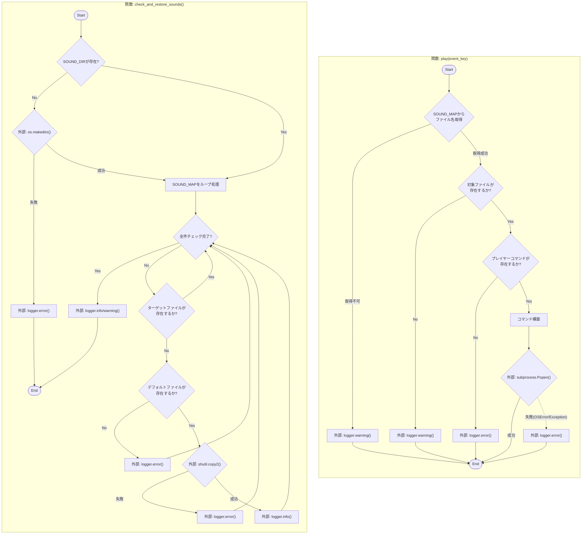
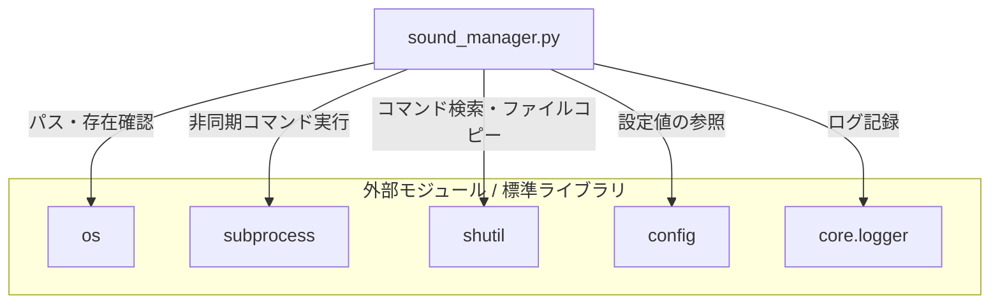

## 1. 解析メタ情報

| 項目 | 内容 |
| --- | --- |
| 対象ファイル | `sound_manager.py` |
| 言語 | Python |
| 解析対象 | 提供されたコードのみ |
| 推測・補完 | 一切なし |

## 2. ファイルの概要

指定されたイベントキーに基づいた音声ファイルの非同期再生、および音声ファイルの欠損確認とデフォルトディレクトリからの復旧（コピー）を行うことで、システムの効果音・通知音等の状態を管理する。

## 3. 外部依存関係

### インポート一覧

| 名称 | 種類 | 用途 | 根拠 |
| --- | --- | --- | --- |
| `os` | 標準ライブラリ | ファイルパスの操作や存在確認、ディレクトリ作成 | `import os` (行番号: 2 / 抜粋: "import os") |
| `subprocess` | 標準ライブラリ | 外部プロセスとしての音声プレイヤーコマンド実行 | `import subprocess` (行番号: 3 / 抜粋: "import subprocess") |
| `shutil` | 標準ライブラリ | コマンドの存在確認(`which`)やファイルのコピー(`copy2`) | `import shutil` (行番号: 4 / 抜粋: "import shutil") |
| `config` | 外部モジュール | ディレクトリパス、コマンド名、音声ファイルマップなどの設定値参照 | `import config` (行番号: 5 / 抜粋: "import config") |
| `setup_logging` | 外部モジュール | 本ファイルの処理で使用するロガーの生成 | `from core.logger import setup_logging` (行番号: 8 / 抜粋: "from core.logger import setup_logging") |

### ブラックボックスとなる外部要素

| 名称 | 理由 | 根拠 |
| --- | --- | --- |
| `config.SOUND_MAP` | イベントキーとファイル名の具体的な対応が定義されているファイルが提供されていないため判断不可。 | `config.SOUND_MAP.get(event_key)` (行番号: 22 / 抜粋: "config.SOUND_MAP.get(event_k...") |
| `config.SOUND_DIR` | 音声ファイルが格納されるべき具体的なディレクトリパスが不明。 | `os.path.join(config.SOUND_DIR` (行番号: 28 / 抜粋: "os.path.join(config.SOUND_DIR,") |
| `config.SOUND_PLAYER_CMD` | 実行される具体的なプレイヤーコマンド（例: `aplay`, `afplay`など）が不明。 | `shutil.which(config.SOUND_P...` (行番号: 36 / 抜粋: "shutil.which(config.SOUND_PLAY...") |
| `config.SOUND_PLAYER_ARGS` | コマンドに付与される具体的な引数が不明。 | `config.SOUND_PLAYER_ARGS` (行番号: 43 / 抜粋: "hasattr(config, "SOUND_PLAYER_") |
| `config.DEFAULT_SOUND_SOURCE` | 復旧用の音声ファイルが格納されているデフォルトディレクトリのパスが不明。 | `config.DEFAULT_SOUND_SOURCE` (行番号: 87 / 抜粋: "os.path.join(config.DEFAULT_SO...") |
| `setup_logging`の実装 | 生成されるロガーの仕様（標準出力へのフォーマット、ログレベルなど）が不明。 | `setup_logging("sound_manager")` (行番号: 10 / 抜粋: "logger = setup_logging("sound") |

## 4. 主要要素の定義（関数 / エンドポイント / コンポーネント）

### `play`

* **役割**: 指定されたイベントキーに対応する音声ファイルを外部プレイヤーコマンドを用いて非同期で再生する。コンソール出力を抑止する。
* 根拠: `def play` (行番号: 12-62 / 抜粋: "def play(event_key: str) -> N...")

* **引数/リクエスト**: `event_key: str` (再生する音声イベントを示すキー)
* 根拠: 引数定義 (行番号: 12 / 抜粋: "event_key: str")

* **戻り値/レスポンス**: `None`
* 根拠: 戻り値の型ヒント (行番号: 12 / 抜粋: "-> None:")

* **副作用**: 外部プロセスの起動による音声再生（`subprocess.Popen`）、システムログへの書き込み。
* 根拠: `subprocess.Popen` (行番号: 52-56 / 抜粋: "subprocess.Popen( cmd, st...")

* **エラーハンドリング**: OSレベルのエラー(`OSError`)およびその他の予期せぬエラー(`Exception`)をキャッチし、ログに記録（システムを停止させないFail-Soft構成）。
* 根拠: `try-except` ブロック (行番号: 57-62 / 抜粋: "except OSError as e:")

### `check_and_restore_sounds`

* **役割**: 指定された音声ディレクトリが存在しない場合は作成し、`config.SOUND_MAP`に定義されている全音声ファイルが存在するか確認。欠損している場合はデフォルトのディレクトリからコピーして復旧する。
* 根拠: `def check_and_restore_sounds` (行番号: 65-110 / 抜粋: "def check_and_restore_sounds()...")

* **引数/リクエスト**: なし
* 根拠: 引数定義 (行番号: 65 / 抜粋: "()")

* **戻り値/レスポンス**: `None`
* 根拠: 戻り値の型ヒント (行番号: 65 / 抜粋: "-> None:")

* **副作用**: ディレクトリの新規作成（`os.makedirs`）、ファイルのコピー・上書き（`shutil.copy2`）、システムログへの書き込み。
* 根拠: `os.makedirs`, `shutil.copy2` (行番号: 72, 91 / 抜粋: "os.makedirs(config.SOUND_DIR...")

* **エラーハンドリング**: ディレクトリ作成時の例外、およびファイルコピー時の例外を個別にキャッチし、ログに記録した上で後続の処理を継続する。
* 根拠: `try-except` ブロック (行番号: 71-74, 90-93 / 抜粋: "except Exception as e:")

## 5. 処理フロー図

## 6. 依存関係図

## 7. 次のステップ（リバースエンジニアリングの提案）

| 優先度 | ファイル名(推測可) | 理由 | 根拠 |
| --- | --- | --- | --- |
| 高 | `config.py` | 音声プレイヤーのコマンドや、システムで使用される全てのイベントキーの対応表などの実体を把握するため。 | `import config` (行番号: 5 / 抜粋: "import config") |
| 中 | `core/logger.py` | ログ出力のフォーマットや保存先、エラー発生時の監視システムへの連携有無を確認するため。 | `from core.logger import setup...` (行番号: 8 / 抜粋: "from core.logger import setup...") |

## 8. 保守上の注意点

* `play`関数内では`Exception`の広範なキャッチを行っており、エラー内容はログに出力されるのみで呼び出し元には伝わらない（Fail-Soft設計）。
* `check_and_restore_sounds`関数において、ループ内で`shutil.copy2`などのディスクI/Oが発生するため、欠損ファイルが大量にある場合は処理負荷と時間がかかる可能性がある。
* 外部プロセス（`subprocess.Popen`）実行時、標準出力と標準エラー出力を完全に破棄（`subprocess.DEVNULL`）しているため、プレイヤーコマンド内部で発生したエラー（例：オーディオデバイス初期化失敗など）はシステムのログに記録されない。

## 9. 不明事項一覧

| 項目 | 理由 | 必要なファイル |
| --- | --- | --- |
| 利用可能な`event_key`の一覧 | `config.SOUND_MAP`の辞書の内容が提供されていないため | `config.py` |
| 再生に使用されるコマンドの実体 | `config.SOUND_PLAYER_CMD`および`SOUND_PLAYER_ARGS`の値が不明なため | `config.py` |
| デフォルトの音声ファイル配置場所 | `config.DEFAULT_SOUND_SOURCE`のパスが不明なため | `config.py` |

## 10. 自己検証結果

* [x] 推測・外部ファイルの仕様を一切含んでいない
* [x] 全関数・全クラス・全コンポーネントを列挙した
* [x] 全てのインポート要素を列挙した
* [x] すべての仕様説明に「根拠（行番号・抜粋）」を明記した
* [x] 根拠漏れが0件である
* [x] Mermaid構文にエラーの原因となる記号（エスケープ漏れ）がない
* [x] 不明事項を漏れなく列挙した

完了