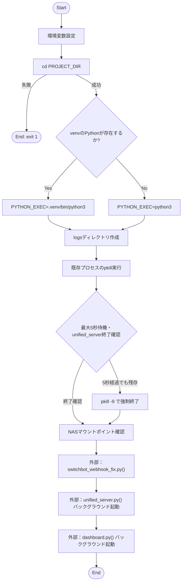
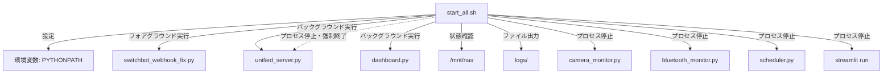

## 1. 解析メタ情報

| 項目 | 内容 |
| --- | --- |
| 対象ファイル | start_all.sh |
| 言語 | Bash (Shell Script) ※指定フォーマット外ですが実態に合わせて記載 |
| 解析対象 | 提供されたコードのみ |
| 推測・補完 | 一切なし |

## 2. ファイルの概要

* システム全体において、`MY_HOME_SYSTEM`のクリーンアップ、初期設定、および関連するプロセス群の起動を統括するスクリプト。環境変数の設定、既存プロセスの終了（および強制終了フォールバック）、NASのマウント確認、Webhookの修正スクリプト実行、そしてコアサーバーとダッシュボードのバックグラウンド起動を担っている。
* 根拠: スクリプト全体 (行番号: 4〜70 / 抜粋: "MY_HOME_SYSTEM 起動スクリプト")

## 3. 外部依存関係

### インポート一覧

| 名称 | 種類 | 用途 | 根拠 |
| --- | --- | --- | --- |
| 該当なし | 該当なし | Bashスクリプト内のコマンド実行のみであり、`source`等による外部ファイルのインポートはない | ファイル全体に該当構文なし (行番号取得不可) |

### ブラックボックスとなる外部要素

| 名称 | 理由 | 根拠 |
| --- | --- | --- |
| `switchbot_webhook_fix.py` | スクリプト内で実行されているが、処理内容の実装が提供されていないため | `switchbot_webhook_fix.py` (行番号: 59 / 抜粋: "$PYTHON_EXEC switchbot_webhook_fix.py") |
| `unified_server.py` | スクリプト内で実行および停止対象となっているが、実装内容が不明なため | `unified_server.py` (行番号: 64 / 抜粋: "$PYTHON_EXEC unified_server.py") |
| `dashboard.py` | スクリプト内で実行されているが、実装内容が不明なため | `dashboard.py` (行番号: 69 / 抜粋: "run dashboard.py") |
| `/mnt/nas` | マウント状況の確認先となっているが、システム上の具体的なNAS構成が不明なため | `MOUNT_POINT` (行番号: 48 / 抜粋: "MOUNT_POINT="/mnt/nas"") |
| 停止対象の各スクリプト群 | `camera_monitor.py`, `bluetooth_monitor.py`, `scheduler.py`などプロセス停止対象の実装内容が不明なため | `pkill -f` コマンド群 (行番号: 25〜27 / 抜粋: "pkill -f camera_monitor.py") |

## 4. 主要要素の定義（関数 / エンドポイント / コンポーネント）

※本ファイルはBashスクリプトであり、関数等の明確な定義ブロックはないため、ロジック上の「処理フェーズ（Phase）」を要素として定義する。

---

### [要素名1：環境セットアップ]

* **役割**: `PYTHONPATH`とプロジェクトディレクトリの変数を設定し、対象ディレクトリへ移動する。その後、仮想環境のPython実行ファイルの有無を判定してパスを決定し、ログ用ディレクトリを作成する。
* 根拠: 環境変数および初期処理 (行番号: 6〜20 / 抜粋: "export PYTHONPATH="..."")

* **引数/リクエスト**: なし
* 根拠: 引数受け取り処理なし (行番号取得不可)

* **戻り値/レスポンス**: なし
* 根拠: 戻り値返却なし (行番号取得不可)

* **副作用**: 環境変数`PYTHONPATH`, `PROJECT_DIR`, `QUEST_DIR`, `PYTHON_EXEC`の設定。カレントディレクトリの変更。`logs`ディレクトリの作成。
* 根拠: コマンド群 (行番号: 6〜20 / 抜粋: "mkdir -p logs")

* **エラーハンドリング**: プロジェクトディレクトリへの移動(`cd`)に失敗した場合、スクリプトをステータスコード1で異常終了(`exit 1`)する。
* 根拠: ディレクトリ移動処理 (行番号: 10 / 抜粋: "cd "$PROJECT_DIR" || exit 1")

### [要素名2：Phase 0: クリーンアップ処理]

* **役割**: `unified_server.py`, `camera_monitor.py`, `bluetooth_monitor.py`, `scheduler.py`, `streamlit run`のプロセスに対して`pkill`で停止シグナルを送る。最大5秒間`unified_server.py`の終了を監視し、停止していない場合は強制終了(`pkill -9`)を実行する。
* 根拠: クリーンアップ処理ブロック (行番号: 22〜44 / 抜粋: "echo "--- Cleanup Old Processes ---"")

* **引数/リクエスト**: なし
* 根拠: 引数受け取り処理なし (行番号取得不可)

* **戻り値/レスポンス**: なし
* 根拠: 戻り値返却なし (行番号取得不可)

* **副作用**: 実行中の一連のプロセスを停止・強制終了させる。標準出力へのログ表示。
* 根拠: `pkill`および`echo`コマンド (行番号: 24〜43 / 抜粋: "pkill -9 -f unified_server.py")

* **エラーハンドリング**: プロセスが通常の`pkill`で終了しない場合のフォールバックとして強制終了(`-9`)を実施。
* 根拠: 強制終了処理 (行番号: 41〜44 / 抜粋: "if pgrep -f unified_server.py")

### [要素名3：Phase 1: NASマウント確認]

* **役割**: `mountpoint`コマンドが存在するか確認し、存在する場合は指定したマウントポイント（`/mnt/nas`）が正しくマウントされているかをチェックする。
* 根拠: NASマウント確認ブロック (行番号: 46〜55 / 抜粋: "echo "--- Check NAS Mount ---"")

* **引数/リクエスト**: なし
* 根拠: 引数受け取り処理なし (行番号取得不可)

* **戻り値/レスポンス**: なし
* 根拠: 戻り値返却なし (行番号取得不可)

* **副作用**: 標準出力へのマウント状態の警告・確認メッセージ出力のみ。
* 根拠: `echo`コマンド (行番号: 51〜53 / 抜粋: "echo "✅ NAS Mounted."")

* **エラーハンドリング**: マウントされていない場合でも警告文を表示するだけで、スクリプトの実行停止（異常終了）は行わない。
* 根拠: if分岐内 (行番号: 50 / 抜粋: "echo "⚠️ NAS is NOT mounted."")

### [要素名4：Phase 3 & 4: 初期化およびサーバー起動]

* **役割**: Webhook修正スクリプト(`switchbot_webhook_fix.py`)を実行し、その後`unified_server.py`と`dashboard.py`(Streamlit)をバックグラウンドで起動する。各プロセスの標準出力・標準エラー出力は`logs/`ディレクトリ内のログファイルにリダイレクトする。
* 根拠: 起動処理ブロック (行番号: 57〜70 / 抜粋: "echo "--- Start Home System Server ---"")

* **引数/リクエスト**: なし
* 根拠: 引数受け取り処理なし (行番号取得不可)

* **戻り値/レスポンス**: なし
* 根拠: 戻り値返却なし (行番号取得不可)

* **副作用**: 3つのPythonスクリプトの実行（うち2つはバックグラウンドプロセスとして常駐）。`logs/webhook_fix.log`, `logs/server_boot.log`, `logs/dashboard_boot.log` ファイルの作成および上書き。
* 根拠: 実行・リダイレクト処理 (行番号: 59, 64, 69 / 抜粋: "> logs/server_boot.log 2>&1 &")

* **エラーハンドリング**: なし（各Pythonスクリプト内のエラーはログファイルへ書き込まれるが、本スクリプト側でのプロセス起動失敗時のハンドリングはない）。
* 根拠: バックグラウンド実行処理 (行番号: 64, 69 / 抜粋: "&")

## 5. 処理フロー図

## 6. 依存関係図

## 7. 次のステップ（リバースエンジニアリングの提案）

| 優先度 | ファイル名(推測可) | 理由 | 根拠 |
| --- | --- | --- | --- |
| 高 | `unified_server.py` | システム全体のコアとしてバックグラウンドで起動され、コメント上で`scheduler_boot.py`の起動も担うと記載されているため、全体ロジックの把握に必須。 | `unified_server.py` (行番号: 64 / 抜粋: "$PYTHON_EXEC unified_server.py") |
| 中 | `dashboard.py` | フロントエンド（ダッシュボード）の表示内容と、サーバーとの連携方法を把握するため。 | `dashboard.py` (行番号: 69 / 抜粋: "run dashboard.py") |
| 中 | `switchbot_webhook_fix.py` | 起動時に毎回実行されており、外部API(SwitchBot/Cloudflare Tunnel)との通信や設定更新を担っていると推測されるため。 | `switchbot_webhook_fix.py` (行番号: 59 / 抜粋: "$PYTHON_EXEC switchbot_webhook_fix.py") |
| 低 | `camera_monitor.py`, `bluetooth_monitor.py`, `scheduler.py` | クリーンアップ対象として記載されているプロセス。システムの一部を構成している可能性がある。 | クリーンアップ処理 (行番号: 25〜27 / 抜粋: "pkill -f camera_monitor.py") |

## 8. 保守上の注意点

* **ハードコードされた絶対パス**: 環境変数 `PYTHONPATH`, `PROJECT_DIR`, `QUEST_DIR` が `/home/masahiro/develop/...` としてハードコードされているため、実行環境（ユーザー名やディレクトリ構成）が変わると動作しない。
* **未使用変数**: `QUEST_DIR` 変数が定義されているが、スクリプト内で一度も参照されていない。
* **影響範囲の広いプロセス停止 (`pkill -f`)**: `pkill -f "streamlit run"` などは部分一致でプロセスを終了させるため、このシステムとは無関係の別プロジェクトのStreamlitプロセスが実行中の場合、巻き込んで終了させてしまう危険性がある。
* **プロセスの起動監視漏れ**: `unified_server.py` および `dashboard.py` をバックグラウンドで起動しているが、プロセスが正常に立ち上がったかどうか（即座にクラッシュしていないか）の死活監視・エラー検知のロジックは存在しない。

## 9. 不明事項一覧

| 項目 | 理由 | 必要なファイル |
| --- | --- | --- |
| `switchbot_webhook_fix.py`の仕様 | 当該スクリプト内でどのような修正・通信処理が行われているか不明 | `switchbot_webhook_fix.py` |
| `unified_server.py`の仕様 | サーバーの責務、提供エンドポイント、およびコメントにある`scheduler_boot.py`起動処理の実態が不明 | `unified_server.py`, `scheduler_boot.py` |
| `dashboard.py`の仕様 | Streamlitで立ち上がるポート8501のダッシュボード機能詳細が不明 | `dashboard.py` |
| 未起動スクリプトの用途 | `camera_monitor.py`, `bluetooth_monitor.py`, `scheduler.py`がクリーンアップ対象にあるが、起動処理が存在しないため、いつどこで起動されるか不明 | 全体アーキテクチャ資料 または 各該当スクリプト |
| `QUEST_DIR`の用途 | 変数が宣言されているが使用されていないため、本来の用途が不明 | 不明 |

## 10. 自己検証結果

* [x] 推測・外部ファイルの仕様を一切含んでいない
* [x] 全関数・全クラス・全コンポーネントを列挙した（Bashにおける主要処理ブロックとして網羅）
* [x] 全てのインポート要素を列挙した（該当なしとして明記）
* [x] すべての仕様説明に「根拠（行番号・抜粋）」を明記した
* [x] 根拠漏れが0件である
* [x] Mermaid構文にエラーの原因となる記号（エスケープ漏れ）がない
* [x] 不明事項を漏れなく列挙した

完了