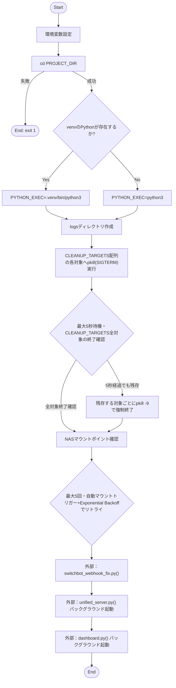
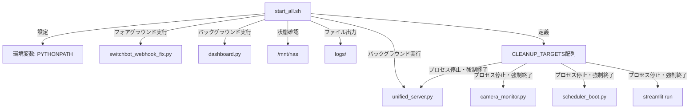

## 1. 解析メタ情報

| 項目 | 内容 |
| --- | --- |
| 対象ファイル | start_all.sh |
| 言語 | Bash (Shell Script) ※指定フォーマット外ですが実態に合わせて記載 |
| 解析対象 | 提供されたコードのみ |
| 推測・補完 | 一切なし |

## 関連ドキュメント

- [unified_server.md](./unified_server.md) — 呼び出し先(バックグラウンド起動)。起動後、内部で`scheduler_boot.py`と`monitors/camera_monitor.py`をさらにサブプロセス起動する
- [dashboard.md](./dashboard.md) — 呼び出し先(バックグラウンド起動、Streamlitダッシュボード)
- [switchbot_webhook_fix.md](./switchbot_webhook_fix.md) — 呼び出し先(フォアグラウンド実行)
- [scheduler_boot.md](./scheduler_boot.md) — 間接的な起動対象。`unified_server.py`のライフサイクル内でサブプロセスとして起動される

## 2. ファイルの概要

* システム全体において、`MY_HOME_SYSTEM`のクリーンアップ、初期設定、および関連するプロセス群の起動を統括するスクリプト。環境変数の設定、`CLEANUP_TARGETS`配列に列挙された既存プロセス群への段階的な終了処理（優しい停止→最大5秒待機→対象ごとの強制終了フォールバック）、NASのマウント確認（自動マウントのトリガーとExponential Backoffによるリトライ）、Webhookの修正スクリプト実行、そしてコアサーバーとダッシュボードのバックグラウンド起動を担っている。
* 根拠: スクリプト全体 (行番号: 4〜115 / 抜粋: "MY_HOME_SYSTEM 起動スクリプト")

## 3. 外部依存関係

### インポート一覧

| 名称 | 種類 | 用途 | 根拠 |
| --- | --- | --- | --- |
| 該当なし | 該当なし | Bashスクリプト内のコマンド実行のみであり、`source`等による外部ファイルのインポートはない | ファイル全体に該当構文なし (行番号: 1-115 / 抜粋: 該当行なし) |

### ブラックボックスとなる外部要素

| 名称 | 理由 | 根拠 |
| --- | --- | --- |
| `switchbot_webhook_fix.py` | スクリプト内で実行されているが、処理内容の実装が提供されていないため | `switchbot_webhook_fix.py` (行番号: 98 / 抜粋: "$PYTHON_EXEC switchbot_webhook_fix.py") |
| `unified_server.py` | スクリプト内で実行および停止対象となっているが、実装内容が不明なため | `unified_server.py` (行番号: 105 / 抜粋: "$PYTHON_EXEC unified_server.py") |
| `dashboard.py` | スクリプト内で実行されているが、実装内容が不明なため | `dashboard.py` (行番号: 111 / 抜粋: "run dashboard.py") |
| `/mnt/nas` | マウント状況の確認先となっているが、システム上の具体的なNAS構成が不明なため | `MOUNT_POINT` (行番号: 70 / 抜粋: "MOUNT_POINT="/mnt/nas"") |
| 停止対象の各スクリプト群 | `camera_monitor.py`, `scheduler_boot.py`など`CLEANUP_TARGETS`配列に列挙されたプロセス停止対象の実装内容が不明なため | `CLEANUP_TARGETS`配列定義 (行番号: 31〜36 / 抜粋: "CLEANUP_TARGETS=(") |

## 4. 主要要素の定義（関数 / エンドポイント / コンポーネント）

※本ファイルはBashスクリプトであり、関数等の明確な定義ブロックはないため、ロジック上の「処理フェーズ（Phase）」を要素として定義する。

---

### [要素名1：環境セットアップ]

* **役割**: `PYTHONPATH`とプロジェクトディレクトリの変数を設定し、対象ディレクトリへ移動する。その後、仮想環境のPython実行ファイルの有無を判定してパスを決定し、ログ用ディレクトリを作成する。
* 根拠: 環境変数および初期処理 (行番号: 8〜22 / 抜粋: "export PYTHONPATH="..."")

* **引数/リクエスト**: なし
* 根拠: 引数受け取り処理なし (行番号: 8-22)

* **戻り値/レスポンス**: なし
* 根拠: 戻り値返却なし (行番号: 8-22)

* **副作用**: 環境変数`PYTHONPATH`, `PROJECT_DIR`, `QUEST_DIR`, `PYTHON_EXEC`の設定。カレントディレクトリの変更。`logs`ディレクトリの作成。
* 根拠: コマンド群 (行番号: 8〜22 / 抜粋: "mkdir -p logs")

* **エラーハンドリング**: プロジェクトディレクトリへの移動(`cd`)に失敗した場合、スクリプトをステータスコード1で異常終了(`exit 1`)する。
* 根拠: ディレクトリ移動処理 (行番号: 12 / 抜粋: "cd "$PROJECT_DIR" || exit 1")

### [要素名2：Phase 0: クリーンアップ処理]

* **役割**: 停止対象プロセス名の配列`CLEANUP_TARGETS`(`unified_server.py`, `camera_monitor.py`, `scheduler_boot.py`, `streamlit run`)を定義し、各対象へ`pkill`でSIGTERMを送って優しく停止させる。以前は`scheduler.py`という実在しないプロセス名を対象にしており実体の`scheduler_boot.py`にマッチしないため旧schedulerプロセスが再起動のたびに生き残っていた点と、存在しない`bluetooth_monitor.py`を対象にしていた点を修正し、実ファイル名の配列に置き換えている。
* 根拠: クリーンアップ処理ブロックおよび修正コメント (行番号: 24〜36 / 抜粋: "CLEANUP_TARGETS=(")

* **引数/リクエスト**: なし
* 根拠: 引数受け取り処理なし (行番号: 24-66)

* **戻り値/レスポンス**: なし
* 根拠: 戻り値返却なし (行番号: 24-66)

* **副作用**: `CLEANUP_TARGETS`内の各プロセスを停止・強制終了させる。標準出力へのログ表示。
* 根拠: `for target in "${CLEANUP_TARGETS[@]}"; do pkill -f "$target"; done` (行番号: 39〜41 / 抜粋: "pkill -f "$target"")

* **エラーハンドリング**: 最大5秒間、`CLEANUP_TARGETS`内のいずれかがまだ実行中かを`pgrep`でループ確認し、5秒経過後もなお生存している対象に対しては、対象ごとに個別に強制終了(`pkill -9 -f "$target"`)を実施する（以前は強制終了ループが`unified_server.py`のみを対象としており、他プロセスが生き残る余地があった）。
* 根拠: 待機ループおよび強制終了ループ (行番号: 43〜66 / 抜粋: "pkill -9 -f "$target"")

### [要素名3：Phase 1: NASマウント確認]

* **役割**: `mountpoint`コマンドが存在するか確認し、存在する場合は指定したマウントポイント（`/mnt/nas`）が正しくマウントされているかを最大5回、Exponential Backoff（1秒→2秒→4秒→8秒→16秒）付きでチェックする。各試行の直前に`ls "$MOUNT_POINT"`でパスへアクセスし、autofs等の自動マウントをトリガーしてから`mountpoint -q`で判定する。以前は1回チェックして未マウントなら警告を出すだけで即座に後続フェーズへ進んでいたが、起動直後はautofsのアイドルアンマウント後の自動マウント完了まで数秒かかることがある（`config.py`の`verify_and_initialize_storage`が遭遇するENOENTと同種の一過性の遅延）ため、リトライして待ち合わせる方式に変更された。
* 根拠: NASマウント確認ブロック (行番号: 68〜94 / 抜粋: "echo "--- Check NAS Mount ---"")

* **引数/リクエスト**: なし
* 根拠: 引数受け取り処理なし (行番号: 68-94)

* **戻り値/レスポンス**: なし
* 根拠: 戻り値返却なし (行番号: 68-94)

* **副作用**: `ls "$MOUNT_POINT"`によるパスアクセス（自動マウントのトリガー、最大5回）、リトライ間隔分の`sleep`によるブロッキング待機、および標準出力へのマウント状態の警告・確認メッセージ出力。
* 根拠: `ls "$MOUNT_POINT" >/dev/null 2>&1` (行番号: 80 / 抜粋: "ls "$MOUNT_POINT" >/dev/null 2>&1")、`sleep "$MOUNT_WAIT"` (行番号: 86 / 抜粋: "sleep "$MOUNT_WAIT"")、`echo`コマンド (行番号: 85, 90, 92 / 抜粋: "echo "✅ NAS Mounted."")

* **エラーハンドリング**: 5回のリトライを尽くしてもマウントされない場合、警告文を表示するのみでスクリプトの実行停止（異常終了）は行わず後続フェーズへ進む（アプリ側の`verify_and_initialize_storage`等によるバックオフ・フォールバックに委ねる設計）。
* 根拠: if分岐内 (行番号: 91〜93 / 抜粋: "echo "⚠️ NAS is still NOT mounted after retries...."")

### [要素名4：Phase 3 & 4: 初期化およびサーバー起動]

* **役割**: Webhook修正スクリプト(`switchbot_webhook_fix.py`)を実行し、その後`unified_server.py`と`dashboard.py`(Streamlit)をバックグラウンドで起動する。各プロセスの標準出力・標準エラー出力は`logs/`ディレクトリ内のログファイルにリダイレクトする。
* 根拠: 起動処理ブロック (行番号: 96〜115 / 抜粋: "echo "--- Start Home System Server ---"")

* **引数/リクエスト**: なし
* 根拠: 引数受け取り処理なし (行番号: 96-115)

* **戻り値/レスポンス**: なし
* 根拠: 戻り値返却なし (行番号: 96-115)

* **副作用**: 3つのPythonスクリプトの実行（うち2つはバックグラウンドプロセスとして常駐）。`logs/webhook_fix.log`, `logs/server_boot.log`, `logs/dashboard_boot.log` ファイルの作成および上書き。
* 根拠: 実行・リダイレクト処理 (行番号: 98, 105, 111 / 抜粋: "> logs/server_boot.log 2>&1 &")

* **エラーハンドリング**: なし（各Pythonスクリプト内のエラーはログファイルへ書き込まれるが、本スクリプト側でのプロセス起動失敗時のハンドリングはない）。
* 根拠: バックグラウンド実行処理 (行番号: 105, 111 / 抜粋: "&")

## 5. 処理フロー図

```mermaid
flowchart TD
    Start([Start]) --> Env[環境変数設定]
    Env --> CD[cd PROJECT_DIR]
    CD -- 失敗 --> Exit1([End: exit 1])
    CD -- 成功 --> PyCheck{venvのPythonが存在するか?}
    PyCheck -- Yes --> SetVenv["PYTHON_EXEC=.venv/bin/python3"]
    PyCheck -- No --> SetSysPy["PYTHON_EXEC=python3"]
    SetVenv --> MkdirLogs[logsディレクトリ作成]
    SetSysPy --> MkdirLogs
    MkdirLogs --> PkillSoft["CLEANUP_TARGETS配列の各対象へpkill(SIGTERM)実行"]
    PkillSoft --> WaitLoop{最大5秒待機・CLEANUP_TARGETS全対象の終了確認}
    WaitLoop -- "全対象終了確認" --> CheckNAS
    WaitLoop -- "5秒経過でも残存" --> PkillHard["残存する対象ごとにpkill -9で強制終了"]
    PkillHard --> CheckNAS[NASマウントポイント確認]
    CheckNAS --> MountLoop{最大5回・自動マウントトリガー+Exponential Backoffでリトライ}
    MountLoop --> WebhookFix["外部：switchbot_webhook_fix.py()"]
    WebhookFix --> ServerBoot["外部：unified_server.py() バックグラウンド起動"]
    ServerBoot --> DashboardBoot["外部：dashboard.py() バックグラウンド起動"]
    DashboardBoot --> End([End])

```

## 6. 依存関係図

```mermaid
graph TD
    start_all["start_all.sh"]
    PYTHONPATH["環境変数: PYTHONPATH"]
    WebhookFix["switchbot_webhook_fix.py"]
    Server["unified_server.py"]
    Dashboard["dashboard.py"]
    NAS["/mnt/nas"]
    Logs["logs/"]
    Targets["CLEANUP_TARGETS配列"]
    Proc1["camera_monitor.py"]
    Proc3["scheduler_boot.py"]
    Proc4["streamlit run"]

    start_all -->|設定| PYTHONPATH
    start_all -->|フォアグラウンド実行| WebhookFix
    start_all -->|バックグラウンド実行| Server
    start_all -->|バックグラウンド実行| Dashboard
    start_all -->|状態確認| NAS
    start_all -->|ファイル出力| Logs
    start_all -->|定義| Targets
    Targets -->|プロセス停止・強制終了| Server
    Targets -->|プロセス停止・強制終了| Proc1
    Targets -->|プロセス停止・強制終了| Proc3
    Targets -->|プロセス停止・強制終了| Proc4

```

## 7. 次のステップ（リバースエンジニアリングの提案）

| 優先度 | ファイル名(推測可) | 理由 | 根拠 |
| --- | --- | --- | --- |
| 高 | `unified_server.py` | システム全体のコアとしてバックグラウンドで起動され、コメント上で`scheduler_boot.py`の起動も担うと記載されているため、全体ロジックの把握に必須。 | `unified_server.py` (行番号: 105 / 抜粋: "$PYTHON_EXEC unified_server.py") |
| 中 | `dashboard.py` | フロントエンド（ダッシュボード）の表示内容と、サーバーとの連携方法を把握するため。 | `dashboard.py` (行番号: 111 / 抜粋: "run dashboard.py") |
| 中 | `switchbot_webhook_fix.py` | 起動時に毎回実行されており、外部API(SwitchBot/Cloudflare Tunnel)との通信や設定更新を担っていると推測されるため。 | `switchbot_webhook_fix.py` (行番号: 98 / 抜粋: "$PYTHON_EXEC switchbot_webhook_fix.py") |
| 低 | `camera_monitor.py`, `scheduler_boot.py` | `CLEANUP_TARGETS`配列に列挙されているプロセス。システムの一部を構成している可能性がある。 | クリーンアップ処理 (行番号: 31〜36 / 抜粋: "CLEANUP_TARGETS=(") |

## 8. 保守上の注意点

* **ハードコードされた絶対パス**: 環境変数 `PYTHONPATH`, `PROJECT_DIR`, `QUEST_DIR` が `/home/masahiro/develop/...` としてハードコードされているため、実行環境（ユーザー名やディレクトリ構成）が変わると動作しない。
* **未使用変数**: `QUEST_DIR` 変数が定義されているが、スクリプト内で一度も参照されていない。
* **影響範囲の広いプロセス停止 (`pkill -f`)**: `pkill -f "streamlit run"` などは部分一致でプロセスを終了させるため、このシステムとは無関係の別プロジェクトのStreamlitプロセスが実行中の場合、巻き込んで終了させてしまう危険性がある。
* **プロセスの起動監視漏れ**: `unified_server.py` および `dashboard.py` をバックグラウンドで起動しているが、プロセスが正常に立ち上がったかどうか（即座にクラッシュしていないか）の死活監視・エラー検知のロジックは存在しない。
* **修正済み: pkill対象名の実体不一致**: 以前は`CLEANUP_TARGETS`に相当する停止対象が`scheduler.py`という実在しないプロセス名で個別に`pkill`されており、実体`scheduler_boot.py`にマッチしないため再起動のたびに旧schedulerプロセスが生き残り、`unified_server.py`起動時に新しいschedulerプロセスと重複起動する不具合があった。存在しない`bluetooth_monitor.py`への`pkill`も無害だが無意味であった。現在は実ファイル名を用いた`CLEANUP_TARGETS`配列に置き換えられ、この2点は解消されている。
* **修正済み: NASマウント確認が待たずに次フェーズへ進んでいた**: 以前のPhase 1は`mountpoint -q`を1回チェックするのみで、未マウントでも警告を表示するだけで即座にPhase 3(Webhook修正)・Phase 4(サーバー起動)へ進んでいた。起動直後はautofsのアイドルアンマウント後の自動マウント完了まで数秒かかることがあり、これは`config.py`の`verify_and_initialize_storage`（Exponential Backoffで自己修復）が扱う遅延と同種の事象であるにもかかわらず、本スクリプト側にはリトライが一切なかった。現在はパスアクセスによる自動マウントのトリガーと、最大5回・Exponential Backoff（1s/2s/4s/8s/16s）のリトライへ変更されている（68〜94行目）。ただしリトライを尽くしても未マウントの場合は依然として警告のみで後続フェーズへ進む点（アプリ側のバックオフ・フォールバックに委ねる設計）は変わらない。

## 9. 不明事項一覧

| 項目 | 理由 | 必要なファイル |
| --- | --- | --- |
| `switchbot_webhook_fix.py`の仕様 | 当該スクリプト内でどのような修正・通信処理が行われているか不明 | `switchbot_webhook_fix.py` |
| `unified_server.py`の仕様 | サーバーの責務、提供エンドポイント、およびコメントにある`scheduler_boot.py`起動処理の実態が不明 | `unified_server.py`, `scheduler_boot.py` |
| `dashboard.py`の仕様 | Streamlitで立ち上がるポート8501のダッシュボード機能詳細が不明 | `dashboard.py` |
| 未起動スクリプトの用途 | `camera_monitor.py`が`CLEANUP_TARGETS`(クリーンアップ対象)にあるが、本ファイル自体には起動処理が存在しないため、いつどこで起動されるか不明（`scheduler_boot.py`は85行目のコメントで`unified_server.py`が内部で起動する旨が本ファイル上でも明記されている） | 全体アーキテクチャ資料 または `camera_monitor.py`起動元のスクリプト |
| `QUEST_DIR`の用途 | 変数が宣言されているが使用されていないため、本来の用途が不明 | 不明 |

## 相互参照による補足情報

| 元の不明事項 | 判明した内容 | 参照元ドキュメント |
| --- | --- | --- |
| `switchbot_webhook_fix.py`の仕様 | `switchbot_webhook_fix.md`の解析によれば、環境変数`WEBHOOK_BASE_URL`を用いてSwitchBotおよびLINE BotのWebhookエンドポイントURLを問い合わせ、現状と異なる場合のみ削除・再登録(SwitchBot)または更新(LINE)を行い、実際に更新が発生した場合のみ`common.send_push`で通知するスクリプトとされる。 | switchbot_webhook_fix.md |
| `unified_server.py`の仕様 | `unified_server.md`の解析によれば、FastAPI製のAPIサーバーであり、`lifespan`内で`monitors/camera_monitor.py`と`scheduler_boot.py`をサブプロセスとして起動し、終了時にはそれらを停止させる構成になっているとされる。ただし`camera_monitor.py`の起動は`try-except`で保護されておらず、起動失敗時はアプリ全体が起動できない可能性がある点が`unified_server.md`の保守上の注意点として挙げられている。 | unified_server.md, scheduler_boot.md |
| `dashboard.py`の仕様 | `dashboard.md`の解析によれば、Streamlit製のダッシュボードアプリであり、`services.analysis_service`からセンサー・子供・食事等のデータを読み込み、11個のタブ(クエスト、電車遅延、防犯カメラ等)を`views.dashboard`配下の各ビューモジュールに委譲してレンダリングするとされる。 | dashboard.md |
| 未起動スクリプトの用途 | `unified_server.md`の解析によれば、`camera_monitor.py`は`start_all.sh`自体ではなく`unified_server.py`の`lifespan`によってサブプロセスとして起動されることが判明した(`start_all.sh`側の`pkill`対象と`unified_server.py`側の起動元が一致)。以前は`bluetooth_monitor.py`と`scheduler.py`(`scheduler_boot.py`とは別名で実在しないプロセス名)についても対応する起動元の記述が見つからず不明であったが、修正コミット(`fix(H-9)`)により`start_all.sh`の`CLEANUP_TARGETS`から存在しない`bluetooth_monitor.py`は削除され、`scheduler.py`は本ファイル85行目のコメント("unified_server.py が内部で scheduler_boot.py を起動します")および`unified_server.md`の解析結果と一致する実名`scheduler_boot.py`に修正されたため、この2点の不明点は解消された。 | unified_server.md |

## 10. 自己検証結果

* [x] 推測・外部ファイルの仕様を一切含んでいない
* [x] 全関数・全クラス・全コンポーネントを列挙した（Bashにおける主要処理ブロックとして網羅）
* [x] 全てのインポート要素を列挙した（該当なしとして明記）
* [x] すべての仕様説明に「根拠（行番号・抜粋）」を明記した
* [x] 根拠漏れが0件である
* [x] Mermaid構文にエラーの原因となる記号（エスケープ漏れ）がない
* [x] 不明事項を漏れなく列挙した

完了