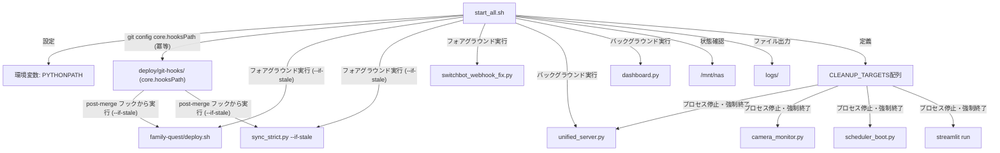

## 1. 解析メタ情報

| 項目 | 内容 |
| --- | --- |
| 対象ファイル | start_all.sh |
| 言語 | Bash (Shell Script) ※指定フォーマット外ですが実態に合わせて記載 |
| 解析対象 | 提供されたコードのみ |
| 推測・補完 | 一切なし |
| 解析基準コミット | `5111d08` (+同一PR内の Issue #646 `--prepare` モード追加、+ Issue #700 の Phase 2.5 追加) |

## 関連ドキュメント

- [unified_server.md](./unified_server.md) — 呼び出し先(バックグラウンド起動)。起動後、内部で`scheduler_boot.py`と`monitors/camera_monitor.py`をさらにサブプロセス起動する
- [dashboard.md](./dashboard.md) — 呼び出し先(バックグラウンド起動、Streamlitダッシュボード)
- [dashboard_router.md](./dashboard_router.md) / [dashboard_proxy_service.md](./dashboard_proxy_service.md) — **（スマホ対応で追加）** 本スクリプトが`--server.baseUrlPath`付きで起動したStreamlitを、8000番側で中継する側。ベースパスは`config.DASHBOARD_BASE_PATH`と一致している必要がある
- [switchbot_webhook_fix.md](./switchbot_webhook_fix.md) — 呼び出し先(フォアグラウンド実行)
- [scheduler_boot.md](./scheduler_boot.md) — 間接的な起動対象。`unified_server.py`のライフサイクル内でサブプロセスとして起動される
- [sync_strict.md](./sync_strict.md) — **（Issue #700 で追加）** Phase 2.5 が呼ぶ`sync_strict.py --if-stale`(クエストマスタの冪等同期)
- [quest_master_sync_marker.md](./quest_master_sync_marker.md) — **（Issue #700 で追加）** Phase 2.5 の鮮度判定の実体

## 2. ファイルの概要

* システム全体において、`MY_HOME_SYSTEM`のクリーンアップ、初期設定、および関連するプロセス群の起動を統括するスクリプト。環境変数の設定、`CLEANUP_TARGETS`配列に列挙された既存プロセス群への段階的な終了処理（優しい停止→最大5秒待機→対象ごとの強制終了フォールバック）、NASのマウント確認（自動マウントのトリガーとExponential Backoffによるリトライ）、Python依存関係の鮮度チェック（`requirements.txt`と`DDD/requirements.txt`を連結したSHA256ハッシュ比較による冪等`pip install`、Issue #483 / #736）、gitフックの登録（リポジトリ管理の`deploy/git-hooks/`を`core.hooksPath`として冪等に設定）、family-questフロントエンドの鮮度チェック（`deploy.sh --if-stale`による冪等リビルド）、Webhookの修正スクリプト実行、そしてコアサーバーとダッシュボードのバックグラウンド起動を担っている。引数`--prepare`を付けると前処理(Phase 0〜3)だけを実行してサーバー本体は起動しない(Issue #646。実機の`deploy/systemd/home_system.service`は`ExecStartPre`でこのモードを呼び、`unified_server.py`本体は`Type=simple`+`Restart=on-failure`の`ExecStart`としてsystemdがフォアグラウンド起動する。ダッシュボードは`home_dashboard.service`が別ユニットで起動する)。
* 根拠: スクリプト全体 (行番号: 4〜151 / 抜粋: "MY_HOME_SYSTEM 起動スクリプト")

## 3. 外部依存関係

### インポート一覧

| 名称 | 種類 | 用途 | 根拠 |
| --- | --- | --- | --- |
| 該当なし | 該当なし | Bashスクリプト内のコマンド実行のみであり、`source`等による外部ファイルのインポートはない | ファイル全体に該当構文なし (行番号: 1-115 / 抜粋: 該当行なし) |

### ブラックボックスとなる外部要素

| 名称 | 理由 | 根拠 |
| --- | --- | --- |
| `switchbot_webhook_fix.py` | スクリプト内で実行されているが、処理内容の実装が提供されていないため | `switchbot_webhook_fix.py` (行番号: 98 / 抜粋: "$PYTHON_EXEC switchbot_webhook_fix.py") |
| `unified_server.py` | スクリプト内で実行および停止対象となっているが、実装内容が不明なため | `unified_server.py` (行番号: 105 / 抜粋: "$PYTHON_EXEC unified_server.py") |
| `dashboard.py` | スクリプト内で実行されているが、実装内容が不明なため | `dashboard.py` (行番号: 111 / 抜粋: "run dashboard.py") |
| `/mnt/nas` | マウント状況の確認先となっているが、システム上の具体的なNAS構成が不明なため | `MOUNT_POINT` (行番号: 70 / 抜粋: "MOUNT_POINT="/mnt/nas"") |
| `family-quest/deploy.sh` | Phase 2で`--if-stale`引数付きで実行されるが、冪等判定・ビルドの実装内容は本ファイル外のため | `bash "$QUEST_DIR/deploy.sh" --if-stale` (行番号: 103 / 抜粋: "bash "$QUEST_DIR/deploy.sh" --if-stale") |
| `sync_strict.py` | **（Issue #700 で追加）** Phase 2.5で`--if-stale`付きで実行されるが、鮮度判定・同期の実装内容は本ファイル外のため | `$PYTHON_EXEC sync_strict.py --if-stale` (行番号: 203 / 抜粋: "$PYTHON_EXEC sync_strict.py --if-stale > logs/quest_master_sync.log 2>&1") |
| 停止対象の各スクリプト群 | `camera_monitor.py`, `scheduler_boot.py`など`CLEANUP_TARGETS`配列に列挙されたプロセス停止対象の実装内容が不明なため | `CLEANUP_TARGETS`配列定義 (行番号: 31〜36 / 抜粋: "CLEANUP_TARGETS=(") |

## 4. 主要要素の定義（関数 / エンドポイント / コンポーネント）

※本ファイルはBashスクリプトであり、関数等の明確な定義ブロックはないため、ロジック上の「処理フェーズ（Phase）」を要素として定義する。

---

### [要素名1：環境セットアップ]

* **役割**: `PYTHONPATH`とディレクトリ変数(`DEVELOP_ROOT`=リポジトリルート、それを基点にした`PROJECT_DIR`・`QUEST_DIR`)を設定し、対象ディレクトリへ移動する。その後、仮想環境のPython実行ファイルの有無を判定してパスを決定し、ログ用ディレクトリを作成する。
* 根拠: 環境変数および初期処理 (行番号: 8〜22 / 抜粋: "export PYTHONPATH="..."")

* **引数/リクエスト**: なし
* 根拠: 引数受け取り処理なし (行番号: 8-22)

* **戻り値/レスポンス**: なし
* 根拠: 戻り値返却なし (行番号: 8-22)

* **副作用**: 環境変数`PYTHONPATH`, `DEVELOP_ROOT`, `PROJECT_DIR`, `QUEST_DIR`, `PYTHON_EXEC`の設定。カレントディレクトリの変更。`logs`ディレクトリの作成。
* 根拠: コマンド群 (行番号: 8〜22 / 抜粋: "mkdir -p logs")

* **エラーハンドリング**: プロジェクトディレクトリへの移動(`cd`)に失敗した場合、スクリプトをステータスコード1で異常終了(`exit 1`)する。
* 根拠: ディレクトリ移動処理 (行番号: 12 / 抜粋: "cd "$PROJECT_DIR" || exit 1")

### [要素名2：Phase 0: クリーンアップ処理]

* **役割**: 停止対象プロセス名の配列`CLEANUP_TARGETS`(`unified_server.py`, `camera_monitor.py`, `scheduler_boot.py`, `streamlit run`)を定義し、各対象へ`pkill`でSIGTERMを送って優しく停止させる。以前は`scheduler.py`という実在しないプロセス名を対象にしており実体の`scheduler_boot.py`にマッチしないため旧schedulerプロセスが再起動のたびに生き残っていた点と、存在しない`bluetooth_monitor.py`を対象にしていた点を修正し、実ファイル名の配列に置き換えている。
* 根拠: クリーンアップ処理ブロックおよび修正コメント (行番号: 44〜64 / 抜粋: "CLEANUP_TARGETS=(")
* **（Issue #360 で修正）** `CLEANUP_TARGETS` に scheduler が起動する監視スクリプト6本に限定した正規表現（`python.*monitors/(switchbot_power_monitor|...|nas_monitor)\.py`）と `ffmpeg.*hls_streams`（ライブ配信/VOD 生成の ffmpeg）を追加。旧世代が孤児化して残ると、新世代と同じ HLS パスへ二重書き込みしたり古い設定で DB 書き込み・保持期間削除を続けたりするため。
* **（Issue #738 / AUDIT-008 で更新）** 同正規表現に`routine_deadline_job`が加わり、対象は scheduler が起動する監視スクリプト7本になった（`scheduler_boot.TASKS`にルーティンの締切処理タスクを60秒間隔で追加したため）。`tests/test_start_all_sh.py`の`TestStartAllShCleanupTargets`が、このパターンが`TASKS`の全スクリプトに一致し、かつ cron/systemd で独立に動くスクリプト（`health_watch`等）には一致しないことを検査する。
* 根拠: `CLEANUP_TARGETS=(` (行番号: 57〜64)
* **（Issue #646 で追加）** `--prepare`モード(`PREPARE_ONLY=true`)では、ダッシュボード(`streamlit run`)を`CLEANUP_TARGETS`から除外する。ダッシュボードは`home_dashboard.service`が別ユニットで管理しており、ここでSIGTERMするとsystemd側が予期しない停止と扱うため。`unified_server.py`・子プロセス・ffmpegは引き続き掃除する(旧来の`nohup`起動が残っている場合の回収、および前世代の孤児の掃除)。
* 根拠: `if [ "$PREPARE_ONLY" = true ]; then` 〜 `CLEANUP_TARGETS=("${filtered_targets[@]}")` (行番号: 66〜78 / 抜粋: "if [ "$target" != "streamlit run" ]; then")

* **引数/リクエスト**: なし
* 根拠: 引数受け取り処理なし (行番号: 41-108)

* **戻り値/レスポンス**: なし
* 根拠: 戻り値返却なし (行番号: 41-108)

* **副作用**: `CLEANUP_TARGETS`内の各プロセスを停止・強制終了させる。標準出力へのログ表示。
* 根拠: `for target in "${CLEANUP_TARGETS[@]}"; do pkill -f "$target"; done` (行番号: 81〜83 / 抜粋: "pkill -f "$target"")

* **エラーハンドリング**: 最大5秒間、`CLEANUP_TARGETS`内のいずれかがまだ実行中かを`pgrep`でループ確認し、5秒経過後もなお生存している対象に対しては、対象ごとに個別に強制終了(`pkill -9 -f "$target"`)を実施する（以前は強制終了ループが`unified_server.py`のみを対象としており、他プロセスが生き残る余地があった）。
* 根拠: 待機ループおよび強制終了ループ (行番号: 85〜108 / 抜粋: "pkill -9 -f "$target"")

### [要素名3：Phase 1: NASマウント確認]

* **役割**: `mountpoint`コマンドが存在するか確認し、存在する場合は指定したマウントポイント（`/mnt/nas`）が正しくマウントされているかを最大5回、Exponential Backoff（1秒→2秒→4秒→8秒→16秒）付きでチェックする。各試行の直前に`ls "$MOUNT_POINT"`でパスへアクセスし、autofs等の自動マウントをトリガーしてから`mountpoint -q`で判定する。以前は1回チェックして未マウントなら警告を出すだけで即座に後続フェーズへ進んでいたが、起動直後はautofsのアイドルアンマウント後の自動マウント完了まで数秒かかることがある（`config.py`の`verify_and_initialize_storage`が遭遇するENOENTと同種の一過性の遅延）ため、リトライして待ち合わせる方式に変更された。
* 根拠: NASマウント確認ブロック (行番号: 68〜94 / 抜粋: "echo "--- Check NAS Mount ---"")

* **引数/リクエスト**: なし
* 根拠: 引数受け取り処理なし (行番号: 68-94)

* **戻り値/レスポンス**: なし
* 根拠: 戻り値返却なし (行番号: 68-94)

* **副作用**: `ls "$MOUNT_POINT"`によるパスアクセス（自動マウントのトリガー、最大5回）、リトライ間隔分の`sleep`によるブロッキング待機、および標準出力へのマウント状態の警告・確認メッセージ出力。
* 根拠: `ls "$MOUNT_POINT" >/dev/null 2>&1` (行番号: 80 / 抜粋: "ls "$MOUNT_POINT" >/dev/null 2>&1")、`sleep "$MOUNT_WAIT"` (行番号: 86 / 抜粋: "sleep "$MOUNT_WAIT"")、`echo`コマンド (行番号: 85, 90, 92 / 抜粋: "echo "✅ NAS Mounted."")

* **エラーハンドリング**: 5回のリトライを尽くしてもマウントされない場合、警告文を表示するのみでスクリプトの実行停止（異常終了）は行わず後続フェーズへ進む（アプリ側の`verify_and_initialize_storage`等によるバックオフ・フォールバックに委ねる設計）。
* 根拠: if分岐内 (行番号: 91〜93 / 抜粋: "echo "⚠️ NAS is still NOT mounted after retries...."")

### [要素名4：Phase 1.5: Python依存関係の鮮度チェック]

* **役割**: `REQ_FILES`配列（`requirements.txt` と `$DEVELOP_ROOT/DDD/requirements.txt`）のうち実在するものを連結したSHA256ハッシュを算出し、`.venv/.requirements-sha256`に記録済みのハッシュと比較する。一致しなければ依存定義が変更されたと判断し、各ファイルについて`$PYTHON_EXEC -m pip install -r "$req"`を順に実行して`.venv`を追従させ、**すべて成功した場合のみ**新しいハッシュを記録する。family-questの`deploy.sh --if-stale`と同じ冪等チェックの思想をバックエンドの依存関係にも適用したもの（Issue #483: `requirements.txt`変更後に`.venv`が追従しないと`ImportError`で起動失敗しうる問題への対応）。**（Issue #736 / AUDIT-006 で対象拡張）** `deploy/cron/crontab`はDDDのスクリプトも`MY_HOME_SYSTEM/.venv`のpythonで実行する（`run_task.sh`が`"${PROJECT_ROOT}/.venv/bin/python3"`を使い、`newface_monitor.py`の行は`.../MY_HOME_SYSTEM/.venv/bin/python`を明示している）のに、以前はMY_HOME_SYSTEM側の`requirements.txt`しか見ていなかった。そのためDDD固有の実行時依存（`yt-dlp` / `curl_cffi`）は「過去に手で`pip install`した」痕跡としてしか`.venv`に存在せず、`.venv`を作り直す・新しいホストへ移ると無音で失敗する状態だった。単一venvを共有しているという実態をこの配列で明示している。
* 根拠: Phase 1.5ブロック (行番号: 138〜185 / 抜粋: "# --- Phase 1.5: Python依存関係の鮮度チェック ---")、[対象ファイル定義] (行番号: 156 / 抜粋: "REQ_FILES=(\"requirements.txt\" \"$DEVELOP_ROOT/DDD/requirements.txt\")")

* **引数/リクエスト**: なし
* 根拠: 引数受け取り処理なし (行番号: 138-183)

* **戻り値/レスポンス**: なし
* 根拠: 戻り値返却なし (行番号: 138-183)

* **副作用**: 依存定義変更時の`pip install`実行（`.venv`へのパッケージインストール。対象ファイルごとに1回ずつ）。`logs/pip_install.log`の切り詰めと、各実行の標準出力・標準エラー出力の同ファイルへの追記（ファイルごとに`=== pip install -r <path> ===`の見出しを書く）。全ファイル成功時のみ`.venv/.requirements-sha256`への書き込み。
* 根拠: 実行・リダイレクト処理 (行番号: 176, 180〜181 / 抜粋: '"$PYTHON_EXEC" -m pip install -r "$req" >> logs/pip_install.log 2>&1')

* **エラーハンドリング**: `pip install`が失敗しても警告を表示するのみでスクリプトは続行する（既存の`.venv`のまま起動を続ける方がサーバー未起動よりマシという設計判断で、Phase 2のfamily-quest鮮度チェックと同じ方針）。1ファイルでも失敗すれば`install_ok=false`となりハッシュファイルを更新しないため、次回起動時にも再度`pip install`が試みられる（片方だけ成功した状態を「追従済み」として記録すると、欠けた依存が永続してしまうため）。
* 根拠: if-else分岐 (行番号: 185〜192 / 抜粋: 'echo "⚠️ pip install failed. Starting with existing .venv. See logs/pip_install.log" >&2')

### [要素名4.5：Phase 1.6: git フックの登録 (core.hooksPath)]

* **役割**: リポジトリ管理のgitフックディレクトリ`$DEVELOP_ROOT/deploy/git-hooks`(post-mergeフック: `git pull`後に`family-quest/deploy.sh --if-stale`を自動実行)を、`git config core.hooksPath`でリポジトリに登録する。コメントに、以前は`.git/hooks/post-merge`へのローカル設置でgit管理外だったためclone後に手で再設置が必要だった経緯と、`core.hooksPath`を設定すると`.git/hooks/`配下のフックは実行されなくなる注意が明記されている。
* 根拠: Phase 1.6ブロック (行番号: 129〜148 / 抜粋: "# --- Phase 1.6: git フックの登録 (core.hooksPath) ---")

* **引数/リクエスト**: なし
* 根拠: 引数受け取り処理なし (行番号: 129-148)

* **戻り値/レスポンス**: なし
* 根拠: 戻り値返却なし (行番号: 129-148)

* **副作用**: ディレクトリが存在し`$DEVELOP_ROOT`がgitリポジトリである場合に限り、現在の`core.hooksPath`が`$HOOKS_DIR`と異なるときだけ`git -C "$DEVELOP_ROOT" config core.hooksPath "$HOOKS_DIR"`を実行する(冪等。既に登録済みなら何もしない)。標準出力へのログ表示。
* 根拠: 判定と設定処理 (行番号: 137〜141 / 抜粋: 'git -C "$DEVELOP_ROOT" config core.hooksPath "$HOOKS_DIR"')

* **エラーハンドリング**: ディレクトリ不在・gitリポジトリでない・`git config`失敗のいずれも警告を標準エラー出力へ表示するのみでスクリプトは続行する(フック登録の失敗でサーバー起動を止めない)。
* 根拠: else分岐 (行番号: 142〜148 / 抜粋: "Skipping hook registration.")

### [要素名5：Phase 2: family-quest フロントエンド鮮度チェック]

* **役割**: サーバー起動前に`family-quest/deploy.sh --if-stale`を実行し、配信用ビルド成果物`dist/`が現在のチェックアウト(HEAD)の`family-quest`ツリーからビルドされたものかを冪等チェックさせ、古ければ再ビルドさせる。コメントに、`git pull`以外の経路(`git reset --hard`等)での更新では`post-merge`フックが発火せず、`dist/`が旧世代のままサーバーだけ新コードで起動してAPIスキーマ不整合を起こした障害(2026-09-01)の再発防止である旨が明記されている。
* 根拠: Phase 2ブロック (行番号: 150〜159 / 抜粋: "# --- Phase 2: family-quest フロントエンドの鮮度チェック ---")

* **引数/リクエスト**: なし
* 根拠: 引数受け取り処理なし (行番号: 122-131)

* **戻り値/レスポンス**: なし
* 根拠: 戻り値返却なし (行番号: 122-131)

* **副作用**: `family-quest/deploy.sh --if-stale`の実行（`dist/`が古い場合はnpm install/buildによる`dist/`の再生成が発生する）。その標準出力・標準エラー出力の`logs/quest_deploy.log`への書き込み。標準出力へのログ表示。
* 根拠: 実行・リダイレクト処理 (行番号: 128 / 抜粋: "bash "$QUEST_DIR/deploy.sh" --if-stale > logs/quest_deploy.log 2>&1")

* **エラーハンドリング**: `deploy.sh`が失敗しても警告を表示するのみでスクリプトは続行する（既存の`dist/`を配信し続ける方がサーバー未起動よりマシという設計判断がコメントに明記されている）。
* 根拠: if分岐と設計コメント (行番号: 126, 128〜130 / 抜粋: "# ビルド失敗でもサーバー起動は続行する(旧distを配信し続ける方がマシなため)")

### [要素名5.5：Phase 2.5: クエストマスタの鮮度チェック（Issue #700で追加）]

* **役割**: サーバー起動前に`sync_strict.py --if-stale`を実行し、`quest_data.py`/`routine_data.py`に差分があるときだけ`quest_master`/`reward_master`をDBへ同期させる。コメントに、マスタ同期が`POST /api/quest/sync_master`か`sync_strict.py`を手で叩いたときにしか走らず実機DBが古いまま残っていたこと(2026-09-19に退役済みクエスト6件が残り、移設先のすごろくステップ報酬と二重取得になっていた障害)、`post-merge`フックからも同じコマンドを呼ぶが`git reset --hard`等の経路の回収としてサーバー起動前にも必ず通すこと(family-questのdist鮮度チェックと同じ思想)、`--if-stale`のため破壊的操作が毎起動では走らないことが明記されている。
* 根拠: Phase 2.5ブロック (行番号: 192〜205 / 抜粋: "# --- Phase 2.5: クエストマスタ(quest_master/reward_master)の鮮度チェック ---")

* **引数/リクエスト**: なし
* 根拠: 引数受け取り処理なし (行番号: 192〜205)

* **戻り値/レスポンス**: なし
* 根拠: 戻り値返却なし (行番号: 192〜205)

* **副作用**: `$PYTHON_EXEC sync_strict.py --if-stale`の実行（差分がある場合のみDBの`quest_master`/`reward_master`が更新される）。その標準出力・標準エラー出力の`logs/quest_master_sync.log`への書き込み。標準出力へのログ表示。
* 根拠: 実行・リダイレクト処理 (行番号: 203 / 抜粋: "$PYTHON_EXEC sync_strict.py --if-stale > logs/quest_master_sync.log 2>&1")

* **エラーハンドリング**: 同期が失敗しても警告を表示するのみでスクリプトは続行する（旧マスタで動かす方が起動失敗よりマシという、Phase 1.5/2と同じ設計判断がコメントに明記されている）。
* 根拠: if分岐と設計コメント (行番号: 199〜205 / 抜粋: "# (旧マスタで動かす方が停止よりマシ。Phase 1.5/2 と同じ判断)")

### [要素名6：Phase 3 & 4: 初期化およびサーバー起動]

* **役割**: Webhook修正スクリプト(`switchbot_webhook_fix.py`)を実行し、その後`unified_server.py`と`dashboard.py`(Streamlit)をバックグラウンドで起動する。各プロセスの標準出力・標準エラー出力は`logs/`ディレクトリ内のログファイルにリダイレクトする。`--prepare`モードではPhase 3の直後に`exit 0`で終了し、Phase 4(サーバー起動)は実行しない。
* **（スマホ対応で追加）** Streamlitは `--server.address 127.0.0.1` に加えて `--server.baseUrlPath "${DASHBOARD_BASE_PATH#/}"` を付けて起動する。`DASHBOARD_BASE_PATH` は同名の環境変数（未設定時は `dashboard`）から取り、先頭のスラッシュを落として渡す。コメントに、スマートフォン等からの閲覧は `unified_server.py`(8000番)のこのパス配下へのリバースプロキシ経由で行うこと、`config.DASHBOARD_BASE_PATH` と一致していないと静的アセットのURLが合わず画面が真っ白になることが記されている。
* 根拠: 起動処理ブロック (行番号: 203〜221 / 抜粋: "echo "--- Start Home System Server ---"")、Streamlitの起動行 (行番号: 217〜218 / 抜粋: "DASHBOARD_BASE_PATH=\"${DASHBOARD_BASE_PATH:-dashboard}\"")

* **引数/リクエスト**: なし
* 根拠: 引数受け取り処理なし (行番号: 203-221)

* **戻り値/レスポンス**: なし（`--prepare`時は`exit 0`）
* 根拠: `exit 0` (行番号: 200)

* **副作用**: 3つのPythonスクリプトの実行（うち2つはバックグラウンドプロセスとして常駐。`--prepare`時は`switchbot_webhook_fix.py`のみ）。`logs/webhook_fix.log`, `logs/server_boot.log`, `logs/dashboard_boot.log` ファイルの作成および上書き。
* 根拠: 実行・リダイレクト処理 (行番号: 194, 208, 214 / 抜粋: "> logs/server_boot.log 2>&1 &")

* **エラーハンドリング**: なし（各Pythonスクリプト内のエラーはログファイルへ書き込まれるが、本スクリプト側でのプロセス起動失敗時のハンドリングはない）。
* 根拠: バックグラウンド実行処理 (行番号: 208, 214 / 抜粋: "&")

### [要素名7：`--prepare` モード（systemd ExecStartPre 経路、Issue #646）]

* **役割**: 第1引数が`--prepare`のとき`PREPARE_ONLY=true`とし、(1) Phase 0の掃除対象から`streamlit run`を外し、(2) Phase 3の直後に`exit 0`して Phase 4(サーバー/ダッシュボードの`nohup`起動)を行わない。実機の`deploy/systemd/home_system.service`はこのモードを`ExecStartPre`で呼び、`unified_server.py`本体を`ExecStart`(`Type=simple`)としてフォアグラウンド起動し、異常終了時は`Restart=on-failure`で自動復旧する。以前は`Type=oneshot`+`RemainAfterExit=yes`のもとで本スクリプトが`nohup ... & disown`でサーバーを起動しており、サーバー本体がsystemdの管理外にあった(落ちても通知のみ・人手復旧)。引数なしの従来経路(手動運用・開発用)は残している。

### [要素名7.5：手動起動ガード（Issue #824で追加）]

* **役割**: 引数解析の直後（`cd` と Phase 0 の掃除より前）で、`--prepare` なしの実行かつ `systemctl` が存在し、`home_system.service` / `home_dashboard.service` の**いずれか**が `systemctl is-enabled --quiet` で有効と判定された場合、`exit 1` で実行を拒否する。拒否メッセージは標準エラーへ出し、正しい手順（`sudo systemctl restart home_system.service home_dashboard.service`）と、上書き方法（`ALLOW_MANUAL_START=1`）を案内する。
* 根拠: `if [ "$PREPARE_ONLY" != true ] && command -v systemctl >/dev/null 2>&1; then` から `# --- end 手動起動ガード ---` まで
* **なぜ必要か**: systemd がユニットを管理している実機でフルモードを実行すると、(1) Phase 0 の掃除が systemd 管理下のプロセスへ SIGTERM を送る（フルモードでは `streamlit run` も対象）、(2) SIGTERM による終了は systemd から見て正常終了なので `Restart=on-failure` は再起動せず `home_system.service` は inactive になる、(3) Phase 4 が `nohup` で起動し直し、プロセスは systemd の管理外（親 PID 1 の孤児）になる、(4) `home_dashboard.service` は孤児が 8501 を握っているため起動に失敗し続ける。サイトは孤児が応答するので普通に動いて見え、**#646 の自動復旧だけが黙って止まる**。2026-09-21 09:54 に実機で起き、約1時間半 `NRestarts=344` のまま放置された。`docs/runbooks/ラズパイデプロイ前動作検証手順.md` には以前から「引数なしで直接実行しないこと」と書かれていたが防げなかったため、コードで拒否する
* **判定に `is-enabled` を使う理由**: `is-active` だと、この事故で既に inactive に落ちた状態から再度叩いたときに素通りしてしまう。`is-enabled` は「このホストは systemd が面倒を見る設定になっている」ことを表す
* **影響を受けない経路**: `--prepare`（systemd の `ExecStartPre`）、`systemctl` の無い環境（開発機・CI）、ユニットを disable した実機
* **上書き**: 環境変数 `ALLOW_MANUAL_START` がちょうど `1` のときだけ、警告（起動後のプロセスは systemd 管理外になり自動再起動されない旨）を出して続行する。`true` / `yes` / `0` / 空文字は上書きとみなさない
* **配置の制約**: 掃除（Phase 0）より後ろに置くと、拒否した時点で既にプロセスを止めている。`cd "$PROJECT_DIR"` より前に置いているのは、`cd` の失敗（CI 等）とガードによる拒否を取り違えないため。`tests/test_start_all_manual_start_guard.py` がこの配置を検査する
* **テスト**: スクリプトを `# --- end 手動起動ガード ---` の行で切り出して末尾に `echo GUARD_PASSED` を足したものを、`systemctl` のスタブだけを置いた PATH で実行する。本物のガードのコードを検証しつつ、ガードを通過してもその先（掃除・NAS待ち・サーバー起動）は一切実行されないため、実機上で走らせても安全
* 根拠: `PREPARE_ONLY=false` / `if [ "${1:-}" = "--prepare" ]; then` (行番号: 18〜21 / 抜粋: "PREPARE_ONLY=true")、掃除対象の絞り込み (行番号: 66〜78)、`exit 0` (行番号: 196〜201 / 抜粋: "Preparation finished (--prepare)")

* **引数/リクエスト**: `$1`（`--prepare`のみ解釈。それ以外・省略時は従来動作）
* 根拠: `if [ "${1:-}" = "--prepare" ]; then` (行番号: 19)

* **戻り値/レスポンス**: `--prepare`時はPhase 3完了後に`exit 0`
* 根拠: `exit 0` (行番号: 200)

* **副作用**: Phase 0〜3の副作用のみ（サーバー・ダッシュボードは起動しない）
* 根拠: 行番号: 196〜201

* **エラーハンドリング**: なし（Phase 0〜3の各処理は従来どおり失敗しても警告のみで続行し、最終的に`exit 0`する。`ExecStartPre`の失敗でサーバー起動を止めない設計）
* 根拠: 行番号: 138〜157（pip install失敗時の警告）、187〜190（deploy.sh失敗時の警告）

## 5. 処理フロー図

```mermaid
flowchart TD
    Start([Start]) --> Env[環境変数設定]
    Env --> CD[cd PROJECT_DIR]
    CD -- 失敗 --> Exit1([End: exit 1])
    CD -- 成功 --> PyCheck{venvのPythonが存在するか?}
    PyCheck -- Yes --> SetVenv["PYTHON_EXEC=.venv/bin/python3"]
    PyCheck -- No --> SetSysPy["PYTHON_EXEC=python3"]
    SetVenv --> MkdirLogs[logsディレクトリ作成]
    SetSysPy --> MkdirLogs
    MkdirLogs --> PkillSoft["CLEANUP_TARGETS配列の各対象へpkill(SIGTERM)実行"]
    PkillSoft --> WaitLoop{最大5秒待機・CLEANUP_TARGETS全対象の終了確認}
    WaitLoop -- "全対象終了確認" --> CheckNAS
    WaitLoop -- "5秒経過でも残存" --> PkillHard["残存する対象ごとにpkill -9で強制終了"]
    PkillHard --> CheckNAS[NASマウントポイント確認]
    CheckNAS --> MountLoop{最大5回・自動マウントトリガー+Exponential Backoffでリトライ}
    MountLoop --> ReqHashCheck{"requirements.txt + DDD/requirements.txt の連結SHA256が<br/>.venv/.requirements-sha256と一致するか?"}
    ReqHashCheck -- 一致 --> HooksCheck
    ReqHashCheck -- 不一致 --> PipInstall["各 requirements について pip install<br/>(全て成功したときのみハッシュ更新)"]
    PipInstall -- "成功/失敗いずれでも続行" --> HooksCheck{core.hooksPath が deploy/git-hooks を指しているか?}
    HooksCheck -- 一致 --> QuestDeploy
    HooksCheck -- "不一致/未設定" --> SetHooks["git config core.hooksPath deploy/git-hooks (失敗しても警告のみ)"]
    SetHooks --> QuestDeploy["外部：family-quest/deploy.sh --if-stale (dist鮮度チェック・必要ならリビルド)"]
    QuestDeploy -- "成功/失敗いずれでも続行" --> MasterSync["外部：sync_strict.py --if-stale (クエストマスタ鮮度チェック・差分があれば同期)"]
    MasterSync -- "成功/失敗いずれでも続行" --> WebhookFix["外部：switchbot_webhook_fix.py()"]
    WebhookFix --> ServerBoot["外部：unified_server.py() バックグラウンド起動"]
    ServerBoot --> DashboardBoot["外部：dashboard.py() バックグラウンド起動"]
    DashboardBoot --> End([End])

```

## 6. 依存関係図

```mermaid
graph TD
    start_all["start_all.sh"]
    PYTHONPATH["環境変数: PYTHONPATH"]
    QuestDeploy["family-quest/deploy.sh"]
    MasterSync["sync_strict.py --if-stale"]
    GitHooks["deploy/git-hooks/ (core.hooksPath)"]
    WebhookFix["switchbot_webhook_fix.py"]
    Server["unified_server.py"]
    Dashboard["dashboard.py"]
    NAS["/mnt/nas"]
    Logs["logs/"]
    Targets["CLEANUP_TARGETS配列"]
    Proc1["camera_monitor.py"]
    Proc3["scheduler_boot.py"]
    Proc4["streamlit run"]

    start_all -->|設定| PYTHONPATH
    start_all -->|"git config core.hooksPath (冪等)"| GitHooks
    GitHooks -->|"post-merge フックから実行 (--if-stale)"| QuestDeploy
    start_all -->|"フォアグラウンド実行 (--if-stale)"| QuestDeploy
    start_all -->|"フォアグラウンド実行 (--if-stale)"| MasterSync
    GitHooks -->|"post-merge フックから実行 (--if-stale)"| MasterSync
    start_all -->|フォアグラウンド実行| WebhookFix
    start_all -->|バックグラウンド実行| Server
    start_all -->|バックグラウンド実行| Dashboard
    start_all -->|状態確認| NAS
    start_all -->|ファイル出力| Logs
    start_all -->|定義| Targets
    Targets -->|プロセス停止・強制終了| Server
    Targets -->|プロセス停止・強制終了| Proc1
    Targets -->|プロセス停止・強制終了| Proc3
    Targets -->|プロセス停止・強制終了| Proc4

```

## 7. 次のステップ（リバースエンジニアリングの提案）

| 優先度 | ファイル名(推測可) | 理由 | 根拠 |
| --- | --- | --- | --- |
| 高 | `unified_server.py` | システム全体のコアとしてバックグラウンドで起動され、コメント上で`scheduler_boot.py`の起動も担うと記載されているため、全体ロジックの把握に必須。 | `unified_server.py` (行番号: 105 / 抜粋: "$PYTHON_EXEC unified_server.py") |
| 中 | `dashboard.py` | フロントエンド（ダッシュボード）の表示内容と、サーバーとの連携方法を把握するため。 | `dashboard.py` (行番号: 111 / 抜粋: "run dashboard.py") |
| 中 | `switchbot_webhook_fix.py` | 起動時に毎回実行されており、外部API(SwitchBot/Cloudflare Tunnel)との通信や設定更新を担っていると推測されるため。 | `switchbot_webhook_fix.py` (行番号: 98 / 抜粋: "$PYTHON_EXEC switchbot_webhook_fix.py") |
| 低 | `camera_monitor.py`, `scheduler_boot.py` | `CLEANUP_TARGETS`配列に列挙されているプロセス。システムの一部を構成している可能性がある。 | クリーンアップ処理 (行番号: 31〜36 / 抜粋: "CLEANUP_TARGETS=(") |

## 8. 保守上の注意点

* **ハードコードされた絶対パス**: 環境変数 `PYTHONPATH`, `DEVELOP_ROOT`(およびそれを基点にした `PROJECT_DIR`, `QUEST_DIR`, `HOOKS_DIR`) が `/home/masahiro/develop/...` としてハードコードされているため、実行環境（ユーザー名やディレクトリ構成）が変わると動作しない。
* **[修正済み] 未使用変数だった`QUEST_DIR`**: 以前は`QUEST_DIR`変数が定義のみで一度も参照されていなかったが、Phase 2(family-quest鮮度チェック)の追加により`bash "$QUEST_DIR/deploy.sh" --if-stale`(103行目)で使用されるようになった。
* **Phase 2はビルド失敗を握りつぶす設計**: `deploy.sh --if-stale`が失敗しても警告表示のみで後続フェーズへ進むため、フロントのビルドが壊れている場合は旧`dist/`が配信され続ける(Issue #650で`deploy.sh`が`dist.next/`にビルドして成功時だけ`dist/`と入れ替えるアトミック方式になったため、この「旧`dist/`が配信され続ける」は実際に成立する。以前はviteが`dist/`を先に空にしていたため、ビルド中・失敗時に`index.html`が存在しない窓があった)。ビルド失敗の検知は`logs/quest_deploy.log`の確認に依存する。また、鮮度判定は`dist/.built-tree`に記録されたgitツリーハッシュとHEADの比較であり、未コミットのローカル変更は検知対象外(詳細は`family-quest/deploy.sh`のコメントを参照)。
* **影響範囲の広いプロセス停止 (`pkill -f`)**: `pkill -f "streamlit run"` などは部分一致でプロセスを終了させるため、このシステムとは無関係の別プロジェクトのStreamlitプロセスが実行中の場合、巻き込んで終了させてしまう危険性がある(`--prepare`モードでは`streamlit run`は対象外)。
* **（スマホ対応）Streamlitの`--server.baseUrlPath`は3箇所で一致している必要がある**: 本スクリプト(Phase 4、手動・開発用経路)、`deploy/systemd/home_dashboard.service`(実機経路)、そして`config.DASHBOARD_BASE_PATH`(中継側)の3つ。どれか1つがずれると、8000番の中継先で静的アセットが404になり画面が表示されない。本スクリプト側は環境変数`DASHBOARD_BASE_PATH`で上書きできるが、`home_dashboard.service`側は`dashboard`を直書きしている。
* **[修正済み] プロセスの起動監視漏れ (Issue #646)**: 以前は`unified_server.py`および`dashboard.py`を`nohup`でバックグラウンド起動するだけで、即座にクラッシュしていないかの死活監視・エラー検知のロジックが存在しなかった。現在、実機経路では`deploy/systemd/home_system.service`(`Type=simple`+`Restart=on-failure`)が`unified_server.py`を、`home_dashboard.service`が`dashboard.py`をそれぞれフォアグラウンドで管理し、本スクリプトは`--prepare`で前処理のみ行う。引数なしの手動経路では従来どおり死活監視は無い。
* **[修正済み] pkill対象名の実体不一致**: 以前は`CLEANUP_TARGETS`に相当する停止対象が`scheduler.py`という実在しないプロセス名で個別に`pkill`されており、実体`scheduler_boot.py`にマッチしないため再起動のたびに旧schedulerプロセスが生き残り、`unified_server.py`起動時に新しいschedulerプロセスと重複起動する不具合があった。存在しない`bluetooth_monitor.py`への`pkill`も無害だが無意味であった。現在は実ファイル名を用いた`CLEANUP_TARGETS`配列に置き換えられ、この2点は解消されている。
* **[修正済み] NASマウント確認が待たずに次フェーズへ進んでいた**: 以前のPhase 1は`mountpoint -q`を1回チェックするのみで、未マウントでも警告を表示するだけで即座にPhase 3(Webhook修正)・Phase 4(サーバー起動)へ進んでいた。起動直後はautofsのアイドルアンマウント後の自動マウント完了まで数秒かかることがあり、これは`config.py`の`verify_and_initialize_storage`（Exponential Backoffで自己修復）が扱う遅延と同種の事象であるにもかかわらず、本スクリプト側にはリトライが一切なかった。現在はパスアクセスによる自動マウントのトリガーと、最大5回・Exponential Backoff（1s/2s/4s/8s/16s）のリトライへ変更されている（74〜99行目）。ただしリトライを尽くしても未マウントの場合は依然として警告のみで後続フェーズへ進む点（アプリ側のバックオフ・フォールバックに委ねる設計）は変わらない。
* **[修正済み] requirements.txt変更時に.venvが追従しない問題(Issue #483)**: 以前は本スクリプトにPython依存関係を更新する経路が一切なく、`requirements.txt`を変更するPRをマージして実機で`git pull`しても`.venv`は古いままだった。新規パッケージをimportするコードが含まれていれば`unified_server.py`が`ImportError`で起動失敗し、2026-09-01のfamily-quest dist不整合障害と同型の穴がバックエンド側に残っていた。現在はPhase 1.5で`requirements.txt`と`DDD/requirements.txt`を連結したSHA256ハッシュを`.venv/.requirements-sha256`と比較し、不一致なら各ファイルについて`pip install`を実行してハッシュを更新するようになっている（138〜193行目）。**（Issue #736 / AUDIT-006）** DDD側を対象に含めたのは、cronがDDDのスクリプトも`MY_HOME_SYSTEM/.venv`のpythonで実行しているのに`yt-dlp`/`curl_cffi`がどのインストール経路にも含まれておらず、`.venv`を作り直すとDDDのバッチが無音で失敗する状態だったため。**副作用としてPhase 1.5の所要時間が延びる**（`yt-dlp`は更新頻度が高い）ので、`home_system.service`の`TimeoutStartSec`（Issue #731で900秒を明示）と併せて見ること。`requirements.txt`変更後の初回起動はpipインストール分だけ遅くなる点、およびネットワーク断時は`pip install`が失敗し既存の`.venv`のまま起動を続行する点に留意。

* **（2026-09-06 品質監査で修正）** `CLEANUP_TARGETS` の監視スクリプト用パターンを `"python.*monitors/[a-z_]*\.py"` から `scheduler_boot.py` の `TASKS` が起動する6本(`switchbot_power_monitor|nature_remo_monitor|server_watchdog|tv_lock_monitor|memory_monitor|nas_monitor`)に限定した。以前のパターンは systemd の `network_logger.service` や cron 起動の `health_watch.py`/`daily_timelapse_job.py`(ffmpeg を伴い長時間走る)/`log_analyzer.py` まで巻き添えで SIGTERM していた。`TASKS` を変更したらここも更新すること(`tests/test_start_all_sh.py` が両者の整合を検証する)。
* 根拠: (行番号: 38〜45 / 抜粋: "\"python.*monitors/(switchbot_power_monitor|nature_remo_monitor|server_watchdog|tv_lock_monitor|memory_monitor|nas_monitor)\\.py\"")
* **（Issue #700）Phase 2.5 も失敗を握りつぶす設計**: `sync_strict.py --if-stale`が失敗しても警告表示のみで後続フェーズへ進むため、マスタ同期が壊れている場合は旧マスタのまま配信され続ける。検知は`logs/quest_master_sync.log`の確認と、`monitors/health_watch.py`のチェック8(コードとDBの乖離をDiscordへ通知)に依存する。鮮度判定は`quest_data.py`/`routine_data.py`の**内容ハッシュ**と`logs/.quest_master_sync_marker`の比較であり、Phase 2(gitツリーハッシュ)とは判定方法が異なる(未コミットのローカル変更も検知する)。

## 9. 不明事項一覧

| 項目 | 理由 | 必要なファイル |
| --- | --- | --- |
| `switchbot_webhook_fix.py`の仕様 | 当該スクリプト内でどのような修正・通信処理が行われているか不明 | `switchbot_webhook_fix.py` |
| `unified_server.py`の仕様 | サーバーの責務、提供エンドポイント、およびコメントにある`scheduler_boot.py`起動処理の実態が不明 | `unified_server.py`, `scheduler_boot.py` |
| `dashboard.py`の仕様 | Streamlitで立ち上がるポート8501のダッシュボード機能詳細が不明 | `dashboard.py` |
| 未起動スクリプトの用途 | `camera_monitor.py`が`CLEANUP_TARGETS`(クリーンアップ対象)にあるが、本ファイル自体には起動処理が存在しないため、いつどこで起動されるか不明（`scheduler_boot.py`は85行目のコメントで`unified_server.py`が内部で起動する旨が本ファイル上でも明記されている） | 全体アーキテクチャ資料 または `camera_monitor.py`起動元のスクリプト |
| `deploy.sh --if-stale`の冪等判定の詳細 | `dist/.built-tree`への記録・比較ロジックの実装は`family-quest/deploy.sh`側にあり、本ファイルからは読み取れない | `family-quest/deploy.sh` |

## 相互参照による補足情報

| 元の不明事項 | 判明した内容 | 参照元ドキュメント |
| --- | --- | --- |
| `switchbot_webhook_fix.py`の仕様 | `switchbot_webhook_fix.md`の解析によれば、環境変数`WEBHOOK_BASE_URL`を用いてSwitchBotおよびLINE BotのWebhookエンドポイントURLを問い合わせ、現状と異なる場合のみ削除・再登録(SwitchBot)または更新(LINE)を行い、実際に更新が発生した場合のみ`services.notification_service.send_push`で通知するスクリプトとされる。 | switchbot_webhook_fix.md |
| `unified_server.py`の仕様 | `unified_server.md`の解析によれば、FastAPI製のAPIサーバーであり、`lifespan`内で`monitors/camera_monitor.py`と`scheduler_boot.py`をサブプロセスとして起動し、終了時にはそれらを停止させる構成になっているとされる。以前は`camera_monitor.py`の起動が`try-except`で保護されておらず起動失敗時にアプリ全体が起動できない可能性が`unified_server.md`の保守上の注意点として挙げられていたが、Issue #360で両子プロセスの起動が共通の`_spawn_child_process`内で保護され、Issue #646で30秒ごとの死活監視・自動再起動(`restart_dead_children`)も加わった。 | unified_server.md, scheduler_boot.md |
| `dashboard.py`の仕様 | `dashboard.md`の解析によれば、Streamlit製のダッシュボードアプリであり、`services.analysis_service`からセンサー・子供・食事等のデータを読み込み、各タブを`views.dashboard`配下の各ビューモジュールに委譲してレンダリングするとされる。**（スマホ対応で更新）** タブは5個(ホーム/おでかけ/見守り/くらし/システム)に再編され、スマートフォンからは`unified_server.py`(8000番)の`/dashboard`配下への中継経由で閲覧する。 | dashboard.md, dashboard_router.md, dashboard_proxy_service.md |
| 未起動スクリプトの用途 | `unified_server.md`の解析によれば、`camera_monitor.py`は`start_all.sh`自体ではなく`unified_server.py`の`lifespan`によってサブプロセスとして起動されることが判明した(`start_all.sh`側の`pkill`対象と`unified_server.py`側の起動元が一致)。以前は`bluetooth_monitor.py`と`scheduler.py`(`scheduler_boot.py`とは別名で実在しないプロセス名)についても対応する起動元の記述が見つからず不明であったが、修正コミット(`fix(H-9)`)により`start_all.sh`の`CLEANUP_TARGETS`から存在しない`bluetooth_monitor.py`は削除され、`scheduler.py`は本ファイル85行目のコメント("unified_server.py が内部で scheduler_boot.py を起動します")および`unified_server.md`の解析結果と一致する実名`scheduler_boot.py`に修正されたため、この2点の不明点は解消された。 | unified_server.md |
| `deploy.sh --if-stale`の冪等判定の詳細 | `family-quest/deploy.sh`を直接確認した。判定材料は**`git rev-parse HEAD:family-quest` で得られる「family-questディレクトリのツリーハッシュ」**で、ビルド成功時に`dist/.built-tree`へ記録される(59行目〜)。`--if-stale`(33〜41行目)は`current_tree_hash()`の値と`dist/.built-tree`の内容を比較し、**(1) 現在のハッシュが取得できる (2) 記録済みハッシュが存在する (3) 両者が一致する (4) `dist/index.html`が実在する** の4条件がすべて成立したときだけ`exit 0`でビルドをスキップする。どれか1つでも欠ければ再ビルドに倒れる(`current_tree_hash()`はgitが使えない等で取得失敗した場合に空文字を返し、26行目のコメントどおり「常にビルド」へフォールバックする)。ツリーハッシュを使うため、`git pull`だけでなく`git reset --hard`やファイルの直接編集でもソースが変われば必ず再ビルドされる。`dist/.built-tree`を更新できなかった場合は警告を出したうえで記録をスキップし、以後`--if-stale`は常にビルドすることになる(64行目)。ビルド本体は`npm ci`(CIの`frontend`ジョブと同じ。Issue #489: `npm install`だとlockfileを書き換えて実機のgitツリーがdirtyになり次回のpullが失敗する)を用いる。**（Issue #757 / AUDIT-028 で変更）** ただし`npm ci`は毎回実行されるのではなく、`package-lock.json`のSHA256を`node_modules/.package-lock-sha256`と比較し、**変化があったとき(または`node_modules`が存在しないとき)だけ**実行する。`npm ci`は仕様上`node_modules`を削除してから入れ直すため、ネットワークが無いときに実行すると`node_modules`を失ったままビルド不能になり、ネットワークが回復するまで新しいフロントを一切デプロイできなくなる(旧`dist/`はアトミック差し替えで無傷なので配信自体は継続する)。lockfileが変わったときだけ`npm ci`する以上、Issue #489 の「lockfileを厳密に守る」意図は損なわれない。副次的に、TS/TSX だけを変えた大多数のケースで`ExecStartPre`の所要時間が大幅に縮む(Issue #731 の`TimeoutStartSec`の見積もりに影響する)。 | 直接ソース確認: `family-quest/deploy.sh:9-14,26-41,59-64` |

## 10. 自己検証結果

* [x] 推測・外部ファイルの仕様を一切含んでいない
* [x] 全関数・全クラス・全コンポーネントを列挙した（Bashにおける主要処理ブロックとして網羅）
* [x] 全てのインポート要素を列挙した（該当なしとして明記）
* [x] すべての仕様説明に「根拠（行番号・抜粋）」を明記した
* [x] 根拠漏れが0件である
* [x] Mermaid構文にエラーの原因となる記号（エスケープ漏れ）がない
* [x] 不明事項を漏れなく列挙した

完了