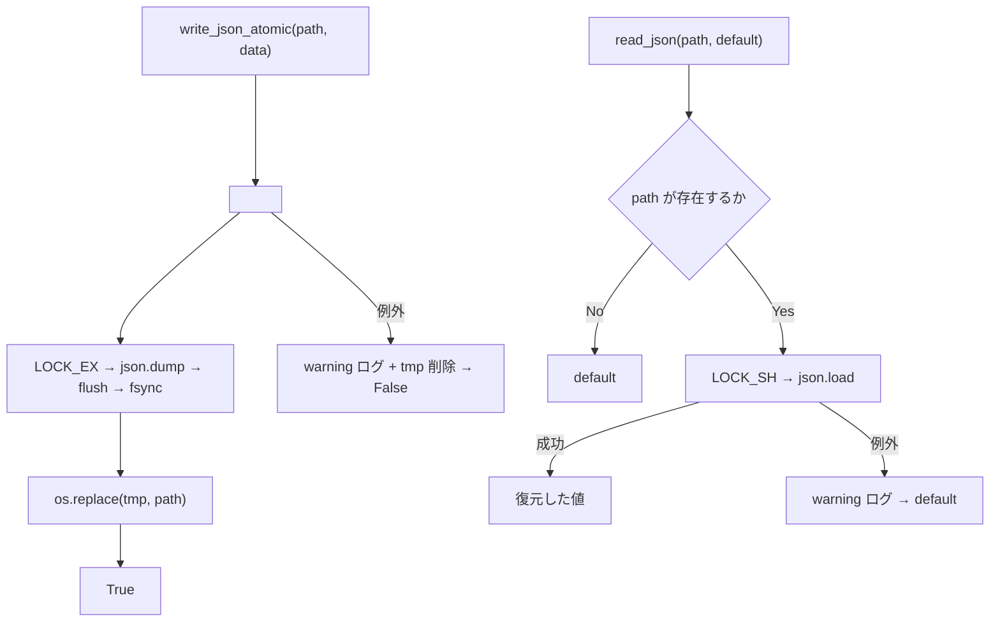
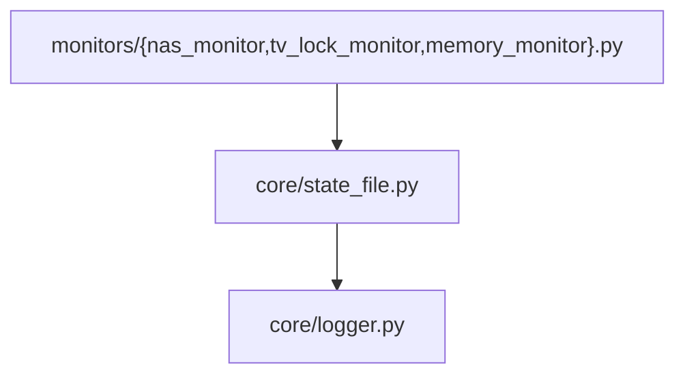

## 1. 解析メタ情報

| 項目 | 内容 |
| --- | --- |
| 対象ファイル | core/state_file.py |
| 解析基準コミット | Issue #661 での新規作成時点(2026-09-16) |
| 言語 | Python |
| 解析対象 | 提供されたコードのみ |
| 推測・補完 | 一切なし |

## 関連ドキュメント

* [nas_monitor.md](./nas_monitor.md) - 呼び出し元(NAS の死活状態 `nas_monitor_state.json`)
* [tv_lock_monitor.md](./tv_lock_monitor.md) - 呼び出し元(当日実行済みを示す日付ファイル)
* [memory_monitor.md](./memory_monitor.md) - 呼び出し元(通知クールダウンの最終通知時刻)
* [logger.md](./logger.md) - `core.logger.get_logger` の実装元

## 2. ファイルの概要

監視スクリプトの状態ファイル(JSON / 1行テキスト)を安全に読み書きする共通ヘルパー。Issue #661 の調査で、状態ファイルの読み書きが `monitors/` を中心に7箇所で個別実装されており、アトミック性・ロック・破損時の扱いがばらばら(素の `open('w')` で書くものから flock + tmp + `os.replace` まで)であることが分かったため、最も堅い方式(`switchbot_power_monitor` の実装)に揃えて集約した。

書き込みは一時ファイルへ書いてから `flush` + `fsync` し、`os.replace` で原子的に差し替える。読み手は常に「旧の完全な内容」か「新の完全な内容」のどちらかだけを見る。読み込みは共有ロック(`LOCK_SH`)を取ってから行い、ファイルが無い・壊れている場合は呼び出し側が渡した `default` を返す(何を安全側とみなすかは用途によって違うため、ここでは決めない。例: `nas_monitor` は破損時に「障害継続」側へ倒す)。いずれの関数も例外を送出せず、失敗は warning ログにして長時間走る監視ループを落とさない。

## 3. 外部依存関係

### インポート一覧

| 名称 | 種類 | 用途 | 根拠 |
| --- | --- | --- | --- |
| `fcntl` | 標準ライブラリ | `flock` による共有/排他ロック | `import fcntl` (行番号: 23) |
| `json` | 標準ライブラリ | 状態の直列化・復元 | `import json` (行番号: 24) |
| `os` | 標準ライブラリ | `fsync` / `replace` / ディレクトリ作成 | `import os` (行番号: 25) |
| `core.logger.get_logger` | 内部モジュール | 失敗時の warning ログ | `from core.logger import get_logger` (行番号: 28) |

### ブラックボックスとなる外部要素

| 項目 | 理由 |
| --- | --- |
| 実際の状態ファイルの内容 | 呼び出し側が渡す任意の JSON 値であり、本ファイルからは不明。 |

## 4. 主要要素の定義（関数 / エンドポイント / コンポーネント）

### `read_json`

* **役割**: 状態ファイルを共有ロック下で読み、JSON として復元して返す。存在しない・壊れている・読めない場合は `default` を返す。
* **引数/リクエスト**: `path: str`、`default: Any = None`
* **戻り値/レスポンス**: 復元した値、または `default`
* **副作用**: なし(読み取りのみ)。失敗時に warning ログ。
* **エラーハンドリング**: 全例外を捕捉して `default` を返す。
* 根拠: `read_json` (行番号: 32 / 抜粋: "def read_json(path: str, default: Any = None) -> Any:")

### `write_json_atomic`

* **役割**: 一時ファイルへ書き、`flush` + `fsync` のうえ `os.replace` で原子的に差し替える。親ディレクトリが無ければ作る。
* **引数/リクエスト**: `path: str`、`data: Any`
* **戻り値/レスポンス**: `bool`(成功なら `True`)
* **副作用**: ファイル書き込み、ディレクトリ作成。失敗時は一時ファイルを削除し warning ログ。
* **エラーハンドリング**: 全例外を捕捉して `False` を返す(呼び出し元を落とさない)。
* 根拠: `write_json_atomic` (行番号: 48 / 抜粋: "def write_json_atomic(path: str, data: Any) -> bool:")

### `read_text` / `write_text_atomic`

* **役割**: 1行だけの状態(最終実行日・最終通知時刻のタイムスタンプ等)を読み書きする JSON 版の対。書き込みは同じく tmp + `fsync` + `os.replace`。
* **戻り値/レスポンス**: `read_text` は `Optional[str]`、`write_text_atomic` は `bool`
* 根拠: `read_text` (行番号: 74 / 抜粋: "def read_text(path: str, default: Optional[str] = None) -> Optional[str]:")、`write_text_atomic` (行番号: 86 / 抜粋: "def write_text_atomic(path: str, text: str) -> bool:")

## 5. 処理フロー図

## 6. 依存関係図

## 7. 次のステップ（リバースエンジニアリングの提案）

| 優先度 | ファイル名 | 理由 |
| --- | --- | --- |
| 中 | `monitors/health_watch.py` / `monitors/server_watchdog.py` / `weekly_analyze_report.py` | Issue #661 の対象のうち、まだ個別実装のまま残っている状態ファイル読み書き。ここへ寄せられる。 |

## 8. 保守上の注意点

* **破損時のフォールバック方針は呼び出し側が決める**: `read_json` は「読めなかった」ことを `default` で表現するだけで、それを「正常」とみなすか「異常継続」とみなすかは用途次第(Issue #653 の経緯)。`default` に sentinel オブジェクトを渡せば「読めなかった」ことを厳密に判定できる。
* **同一プロセス内の多重書き込み**: 一時ファイル名に PID を含めるため、別プロセス間では衝突しないが、同一プロセスの複数スレッドが同じパスへ同時に書くと一時ファイル名が衝突しうる。現在の呼び出し元はいずれも単一スレッドの cron/監視ループ。

## 9. 不明事項一覧

| 項目 | 理由 | 必要なファイル |
| --- | --- | --- |
| 実機での状態ファイルの配置 | `config.FALLBACK_ROOT` 等の解決結果に依存し、本ファイルからは不明。 | config.py |

## 10. 自己検証結果

* 本ファイル内に記載した行番号・シグネチャは `core/state_file.py` の現物と照合済み。
* 呼び出し元(`nas_monitor` / `tv_lock_monitor` / `memory_monitor`)の移行は Issue #661 の同一 PR で実施。
