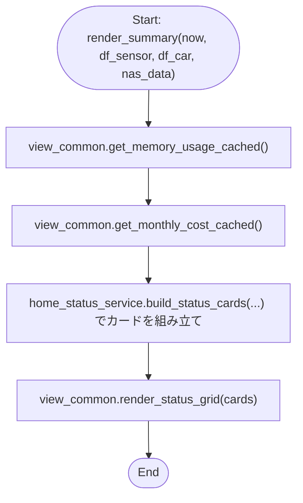
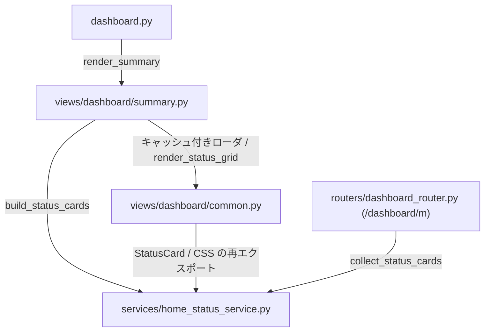

## 1. 解析メタ情報

| 項目 | 内容 |
| --- | --- |
| 対象ファイル | `views/dashboard/summary.py` |
| 言語 | Python |
| 解析対象 | 提供されたコードのみ |
| 推測・補完 | 一切なし |

> **（スマホ対応で大幅に変更）** 本ファイルが持っていた各カードの判定ロジック（実家の動き・在宅・炊飯器・サーバー・NAS等）とカードHTMLの組み立ては、`services/home_status_service.py` へ移動した。Streamlit を介さない軽量ページ `/dashboard/m` が同じカードを出すためで、判定を2箇所に持たないようにしたもの。以前の判定ロジックの解析内容は [home_status_service.md](./home_status_service.md) を参照。

## 関連ドキュメント

* [home_status_service.md](./home_status_service.md) - **（スマホ対応で追加）** カードの判定ロジック・HTML組み立て・CSSの実体。本ファイルと `routers/dashboard_router.py`（軽量ページ）の両方がここを呼ぶ
* [dashboard.md](./dashboard.md) - 呼び出し元。「🏠 ホーム」タブで `summary.render_summary(now, df_sensor, df_car, nas_data)` を呼ぶ
* [dashboard_common.md](./dashboard_common.md) - キャッシュ付きローダ（`get_memory_usage_cached` / `get_monthly_cost_cached`）とグリッド描画（`render_status_grid`）の提供元

## 2. ファイルの概要

* Streamlitダッシュボードの「🏠 ホーム」タブで、ステータスカードを描画する唯一の関数 `render_summary` のみで構成される。
* 根拠: `def render_summary(` (行番号: 19 / 抜粋: "def render_summary(")
* 本ファイル自身はカードの内容を判定しない。判定は `home_status_service.build_status_cards` に委譲し、そこへ渡す材料（センサー・車・NASのデータは引数、メモリ使用率・今月と先月の電気代・ディスク使用量は `view_common` のキャッシュ付きローダ）を集める役割だけを持つ。
* 根拠: `cards = home_status_service.build_status_cards(` (行番号: 26 / 抜粋: "cards = home_status_service.build_status_cards(")
* カードの上に「気になること」の1行を出すが、どのカードを拾うかも判定せず `home_status_service.summarize_alerts` に委譲する。軽量ページ（`/dashboard/m`）と同じ関数を使うため、2画面で「気になること」が食い違わない。異常が無いときも `st.success` で1行出す。
* 根拠: `alerts = home_status_service.summarize_alerts(cards)` (行番号: 44 / 抜粋: "alerts = home_status_service.summarize_alerts(cards)")
* メモリ使用率・今月の電気代を素のサービスではなくキャッシュ付きラッパー経由で取るのは、いずれも1回の描画の中で他のタブからも呼ばれうる重い処理（psutil・集計SQL）であり、素で呼ぶと同じ描画で取り直しになるため。
* 根拠: `memory=view_common.get_memory_usage_cached(),` (行番号: 33 / 抜粋: "memory=view_common.get_memory_usage_cached(),")
* 描画は `view_common.render_status_grid` に渡すだけで、列数の決定はCSS Grid側（`.status-grid` の auto-fit）にある。以前は `st.columns(3)` を3段重ねており、Streamlitの列は画面幅が足りなくても横並びを維持するため、スマートフォンでは1枚あたり約100pxまで潰れて値が読めなかった。
* 根拠: `view_common.render_status_grid(cards)` (行番号: 55 / 抜粋: "view_common.render_status_grid(cards)")

## 3. 外部依存関係

### インポート一覧

| 名称 | 種類 | 用途 | 根拠 |
| --- | --- | --- | --- |
| `datetime.datetime` | 標準ライブラリ | `render_summary` の引数 `now` の型注釈 | `from datetime import datetime` (行番号: 9 / 抜粋: "from datetime import datetime") |
| `pandas` | 外部ライブラリ | 引数の型注釈（`pd.DataFrame` / `pd.Series`） | `import pandas as pd` (行番号: 11 / 抜粋: "import pandas as pd") |
| `streamlit` | 外部ライブラリ | 「気になること」の1行（`st.warning` / `st.success`） | `import streamlit as st` (行番号: 12 / 抜粋: "import streamlit as st") |
| `services.home_status_service` | 内部モジュール | カードの組み立て（`build_status_cards`）と要約（`summarize_alerts`） | `from services import home_status_service` (行番号: 13 / 抜粋: "from services import home_status_service") |
| `views.dashboard.common` (`view_common`) | 内部モジュール | キャッシュ付きローダとグリッド描画 | `from . import common as view_common` (行番号: 15 / 抜粋: "from . import common as view_common") |

**（スマホ対応で削除）** `services.analysis_service` と `services.train_service`（後者はモジュールごと退役）の直接インポート、および `.common` からの `StatusCard` / `render_status_grid` の名前インポートは、判定ロジックの移動とキャッシュ経由化に伴い不要になった。

### ブラックボックスとなる外部要素

| 名称 | 理由 | 根拠 |
| --- | --- | --- |
| `home_status_service.build_status_cards` | 各カードの判定内容・並び順の実装は [home_status_service.md](./home_status_service.md) 側にある。 | `cards = home_status_service.build_status_cards(` |
| `view_common.get_memory_usage_cached` / `get_monthly_cost_cached` / `get_last_month_cost_cached` / `get_disk_usage_cached` | キャッシュのTTL・クリアの契機は [dashboard_common.md](./dashboard_common.md) 側にある。 | `memory=view_common.get_memory_usage_cached(),` |
| `view_common.render_status_grid` | グリッドのHTML・CSSの適用は [dashboard_common.md](./dashboard_common.md) と [home_status_service.md](./home_status_service.md) 側にある。 | `view_common.render_status_grid(cards)` |

## 4. 主要要素の定義（関数 / エンドポイント / コンポーネント）

### `render_summary`

* **役割**: ホームタブの「気になること」の1行とステータスカードを描画する。材料を集めて `home_status_service.build_status_cards` に渡し、`summarize_alerts` の結果を1行で出したうえで、カードを `view_common.render_status_grid` で描く。カードの並び自体は動かさない（どの位置に何があるかで覚えている画面で順番が入れ替わると読み違えるため、並べ替えではなく要約で解決する）。
* 根拠: `def render_summary(` (行番号: 19〜55 / 抜粋: "def render_summary(")

* **引数/リクエスト**: `now` (型: `datetime`。JSTのaware datetime)、`df_sensor` (型: `pd.DataFrame`)、`df_car` (型: `pd.DataFrame`)、`nas_data` (型: `pd.Series | None`)
* 根拠: `nas_data: pd.Series | None,` (行番号: 19〜23 / 抜粋: "nas_data: pd.Series | None,")

* **戻り値/レスポンス**: なし
* 根拠: `view_common.render_status_grid(cards)` (行番号: 55 / 抜粋: "view_common.render_status_grid(cards)")

* **副作用**: `view_common` のキャッシュ付きローダ経由でのデータ取得（メモリ使用率・今月の電気代の集計SQL。いずれもTTL 60秒のキャッシュ越し）と、`view_common.render_status_grid` 経由のStreamlit画面への描画。
* 根拠: `monthly_cost=view_common.get_monthly_cost_cached(),` (行番号: 34 / 抜粋: "monthly_cost=view_common.get_monthly_cost_cached(),")

* **エラーハンドリング**: なし（`try/except` は存在しない）。取得・判定で例外が送出された場合は呼び出し元へ伝播し、`dashboard.py` 側の `view_common.safe_section("サマリー")` がセクション単位で隔離する（Issue #438）。
* 根拠: `cards = home_status_service.build_status_cards(` (行番号: 26 / 抜粋: "cards = home_status_service.build_status_cards(")

## 5. 処理フロー図

## 6. 依存関係図

## 7. 次のステップ（リバースエンジニアリングの提案）

| 優先度 | ファイル名(推測可) | 理由 | 根拠 |
| --- | --- | --- | --- |
| 高 | `services/home_status_service.py` | 各カードの判定内容そのものがこちらに移ったため。 | `cards = home_status_service.build_status_cards(` (行番号: 26 / 抜粋: "cards = home_status_service.build_status_cards(") |
| 中 | `views/dashboard/common.py` | キャッシュのTTL・グリッド描画の実装を把握するため。 | `view_common.render_status_grid(cards)` (行番号: 55 / 抜粋: "view_common.render_status_grid(cards)") |

## 8. 保守上の注意点

* **判定ロジックを本ファイルへ書き戻さないこと**: 書き戻すと、軽量ページ `/dashboard/m` と本体で同じカードの内容が食い違い、片方だけ直した状態が生まれる。`tests/test_mobile_status_page.py` の `TestOneSourceOfTruth` が、本ファイルに判定（`theme-green` 等の文字列）が戻っていないことを検査する。
* 根拠: `cards = home_status_service.build_status_cards(` (行番号: 26 / 抜粋: "cards = home_status_service.build_status_cards(")

* **キャッシュ付きラッパーを素のサービス呼び出しへ戻さないこと**: 画面の見た目は変わらないが、1回の描画で集計SQL・psutil の取得が余分に走る。気づけるのは実機のスマートフォンだけになる。`tests/test_dashboard_cache.py` の `TestViewsDoNotBypassTheCache` が固定している。
* 根拠: `memory=view_common.get_memory_usage_cached(),` (行番号: 33 / 抜粋: "memory=view_common.get_memory_usage_cached(),")

## 9. 不明事項一覧

| 項目 | 理由 | 必要なファイル |
| --- | --- | --- |
| 各カードの判定内容・しきい値 | 本ファイルからは `build_status_cards` の呼び出ししか見えないため。 | `services/home_status_service.py` |
| キャッシュのTTLとクリアの契機 | `view_common` 側にあるため。 | `views/dashboard/common.py` |

## 10. 自己検証結果

* [x] 推測・外部ファイルの仕様を一切含んでいない
* [x] 全関数・全クラス・全コンポーネントを列挙した
* [x] 全てのインポート要素を列挙した
* [x] すべての仕様説明に「根拠（行番号・抜粋）」を明記した
* [x] 根拠漏れが0件である
* [x] Mermaid構文にエラーの原因となる記号（エスケープ漏れ）がない
* [x] 不明事項を漏れなく列挙した
