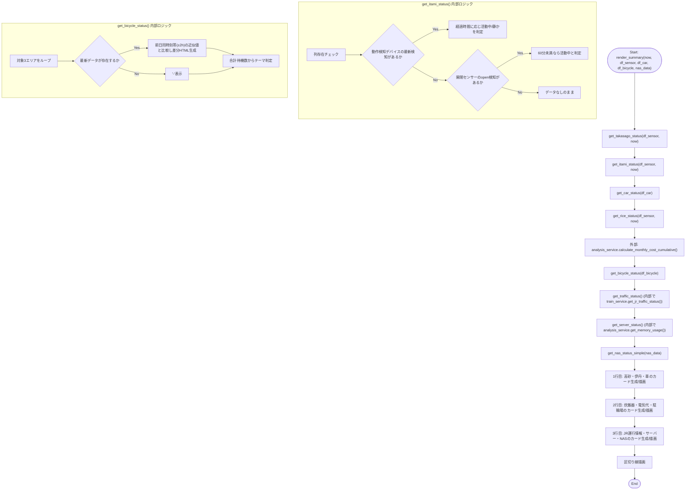
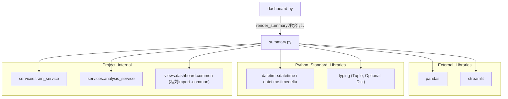

## 1. 解析メタ情報

| 項目 | 内容 |
| --- | --- |
| 対象ファイル | `views/dashboard/summary.py` |
| 言語 | Python |
| 解析対象 | 提供されたコードのみ |
| 推測・補完 | 一切なし |

## 関連ドキュメント

* [train_service.md](./train_service.md) - `services.train_service`の実体。`get_jr_traffic_status`を提供
* [analysis_service.md](./analysis_service.md) - `services.analysis_service`の実体。`get_memory_usage`, `calculate_monthly_cost_cumulative`を提供
* [dashboard_common.md](./dashboard_common.md) - `views.dashboard.common`の実体（相対インポート`.common`）。`render_status_card_html`を提供
* [dashboard.md](./dashboard.md) - 呼び出し元。`views.dashboard.summary`をインポートし、トップ画面サマリーとして`summary.render_summary(now, df_sensor, df_car, df_bicycle, nas_data)`を呼び出す

## 2. ファイルの概要

* Streamlitダッシュボードのトップ画面に表示される「サマリー」部分（9個のステータスカード）を描画するモジュール。各ステータスの判定ロジック（8個の`get_*_status`ヘルパー関数）と、それらをカードとして並べる`render_summary`関数で構成される。
* 根拠: `# === Status Helpers ===` と `# === Render Function ===` の2セクション構成 (行番号: 11, 198 / 抜粋: "# === Status Helpers ===")
* 高砂（実家）・伊丹（自宅）の在宅/活動状況、車の外出状況、炊飯器の稼働状況、今月の電気代、駐輪場の待機数、JR運行情報、サーバーのメモリ使用率、NASの死活状態の9項目をそれぞれ判定し、3列×3行のカードレイアウトで表示する。
* 根拠: `c1, c2, c3 = st.columns(3)` から `c9.markdown(...)` までの3回のカラム生成 (行番号: 221〜234 / 抜粋: "c1, c2, c3 = st.columns(3)")
* 各ステータス判定関数は、渡された`DataFrame`が空または必要な列を欠く場合に「データなし」等のデフォルト値を返すガード節を持つ。
* 根拠: `if df_sensor.empty or "location" not in df_sensor.columns or "contact_state" not in df_sensor.columns:\n        return val, theme` (行番号: 16〜17 / 抜粋: "if df_sensor.empty or \"location\" not in df_sensor.columns")

## 3. 外部依存関係

### インポート一覧

| 名称 | 種類 | 用途 | 根拠 |
| --- | --- | --- | --- |
| `pandas` | 外部ライブラリ | 各関数の引数型注釈（`pd.DataFrame`, `pd.Series`）およびフィルタ・型変換処理 | `import pandas as pd` (行番号: 2 / 抜粋: "import pandas as pd") |
| `streamlit` | 外部ライブラリ | `render_summary`内でのカラムレイアウト生成・Markdown描画 | `import streamlit as st` (行番号: 3 / 抜粋: "import streamlit as st") |
| `datetime`, `timedelta` | 標準ライブラリ | 経過時間の計算（`now`との差分）、前日比較のための日時オフセット計算 | `from datetime import datetime, timedelta` (行番号: 4 / 抜粋: "from datetime import datetime, timedelta") |
| `Tuple`, `Optional`, `Dict` | 標準ライブラリ(`typing`) | `Tuple`, `Optional`は各関数の戻り値・引数型注釈に使用。`Dict`はインポートされているが本ファイル内では使用されていない | `from typing import Tuple, Optional, Dict` (行番号: 5 / 抜粋: "from typing import Tuple, Optional, Dict") |
| `train_service` | 内部モジュール | JR運行状況の取得 (`get_jr_traffic_status`) | `from services import train_service` (行番号: 7 / 抜粋: "from services import train_service") |
| `analysis_service` | 内部モジュール | サーバーメモリ使用率・月次電気代累計の取得 | `from services import analysis_service` (行番号: 8 / 抜粋: "from services import analysis_service") |
| `render_status_card_html` | 内部モジュール | `views.dashboard.common`（相対インポート`.common`）から提供される、ステータスカードのHTML生成関数 | `from .common import render_status_card_html` (行番号: 9 / 抜粋: "from .common import render_status_card_html") |

### ブラックボックスとなる外部要素

| 名称 | 理由 | 根拠 |
| --- | --- | --- |
| `train_service.get_jr_traffic_status()` | `services.train_service`の実装が提供されておらず、返却される辞書のキー（`宝塚線`, `神戸線`以下の`is_suspended`, `is_delay`）の取得元が不明。 | `jr_status = train_service.get_jr_traffic_status()` (行番号: 87 / 抜粋: "jr_status = train_service.get_jr_traffic_status()") |
| `analysis_service.get_memory_usage()` | `services.analysis_service`の実装が提供されておらず、メモリ使用率の取得元・実装が不明。 | `mem = analysis_service.get_memory_usage()` (行番号: 98 / 抜粋: "mem = analysis_service.get_memory_usage()") |
| `analysis_service.calculate_monthly_cost_cumulative()` | 月次電気代累計の計算ロジック（単価・対象データ範囲等）が不明。 | `cost = analysis_service.calculate_monthly_cost_cumulative()` (行番号: 213 / 抜粋: "cost = analysis_service.calculate_monthly_cost_cumulative()") |
| `render_status_card_html()` | `views.dashboard.common`の実装が本ファイルには含まれておらず、生成されるHTML構造の詳細（本ファイル視点では）は不明。 | `render_status_card_html("👵 高砂 (実家)", taka_val, taka_theme)` (行番号: 222 / 抜粋: "render_status_card_html(\"👵 高砂 (実家)\", taka_val, taka_theme)") |

## 4. 主要要素の定義（関数 / エンドポイント / コンポーネント）

### `get_takasago_status`

* **役割**: 高砂（実家）の`location`に紐づくセンサーで、`contact_state`が`open`または`detected`の最新レコードの経過時間から、実家の活動状況（元気/静か/動きなし）を判定する。
* 根拠: `def get_takasago_status(df_sensor: pd.DataFrame, now: datetime) -> Tuple[str, str]:` (行番号: 13〜34 / 抜粋: "def get_takasago_status(df_sensor: pd.DataFrame, now: datetime) -> Tuple[str, str]:")

* **引数/リクエスト**: `df_sensor` (型: `pd.DataFrame`。`location`, `contact_state`, `timestamp`列を含む) 、`now` (型: `datetime`。基準時刻)
* 根拠: `def get_takasago_status(df_sensor: pd.DataFrame, now: datetime) -> Tuple[str, str]:` (行番号: 13 / 抜粋: "def get_takasago_status(df_sensor: pd.DataFrame, now: datetime) -> Tuple[str, str]:")

* **戻り値/レスポンス**: `Tuple[str, str]` (ステータス表示文字列, テーマ名文字列。60分未満: `theme-green`、180分未満: `theme-yellow`、それ以上: `theme-red`、データなし: `theme-gray`)
* 根拠: `if diff_min < 60:\n            val = "🟢 元気 (1h以内)"\n            theme = "theme-green"` (行番号: 25〜27 / 抜粋: "if diff_min < 60:")

* **副作用**: なし（純粋な判定関数。UI描画・外部I/Oは行わない）
* 根拠: 関数本体全体 (行番号: 13〜34 / 抜粋: "def get_takasago_status(df_sensor: pd.DataFrame, now: datetime) -> Tuple[str, str]:")

* **エラーハンドリング**: なし（`df_sensor.empty`または必要列の欠如を明示的にチェックする早期`return`のみで、例外捕捉は行われていない）
* 根拠: `if df_sensor.empty or "location" not in df_sensor.columns or "contact_state" not in df_sensor.columns:\n        return val, theme` (行番号: 16〜17 / 抜粋: "if df_sensor.empty or \"location\" not in df_sensor.columns")

### `get_itami_status`

* **役割**: 伊丹（自宅）に関し、動作検知デバイス（`Motion`を含むまたは`Webhook`）による検知、次いで開閉センサー（`contact_state == "open"`）の順で最新の活動時刻を判定し、活動状況（活動中/静か）を判定する。
* 根拠: `def get_itami_status(df_sensor: pd.DataFrame, now: datetime) -> Tuple[str, str]:` (行番号: 36〜84 / 抜粋: "def get_itami_status(df_sensor: pd.DataFrame, now: datetime) -> Tuple[str, str]:"), `"""伊丹（自宅）のステータス判定（修正版）"""` (行番号: 37 / 抜粋: "\"\"\"伊丹（自宅）のステータス判定（修正版）\"\"\"")

* **引数/リクエスト**: `df_sensor` (型: `pd.DataFrame`。`location`, `device_type`, `movement_state`, `contact_state`, `timestamp`列を含む)、`now` (型: `datetime`。基準時刻)
* 根拠: `def get_itami_status(df_sensor: pd.DataFrame, now: datetime) -> Tuple[str, str]:` (行番号: 36 / 抜粋: "def get_itami_status(df_sensor: pd.DataFrame, now: datetime) -> Tuple[str, str]:")

* **戻り値/レスポンス**: `Tuple[str, str]` (動作検知が10分未満: `"🟢 活動中 (今)"`/`theme-green`、60分未満: 分前表示/`theme-green`、それ以上: 時間前表示/`theme-yellow`。動作検知なしの場合、開閉センサーが60分未満で`open`なら`"🟢 活動中"`/`theme-green`、それ以外は初期値`"⚪ データなし"`/`theme-gray`のまま)
* 根拠: `if diff_m < 10:\n            val = "🟢 活動中 (今)"` (行番号: 65〜66 / 抜粋: "if diff_m < 10:"), `if diff_c < 60:\n                val = f"🟢 活動中 ({int(diff_c)}分前)"` (行番号: 81〜82 / 抜粋: "if diff_c < 60:")

* **副作用**: なし（純粋な判定関数）
* 根拠: 関数本体全体 (行番号: 36〜84 / 抜粋: "def get_itami_status(df_sensor: pd.DataFrame, now: datetime) -> Tuple[str, str]:")

* **エラーハンドリング**: なし（`required_cols`（`location`, `device_type`, `movement_state`, `contact_state`）の存在チェックによる早期`return`のみ）
* 根拠: `required_cols = ["location", "device_type", "movement_state", "contact_state"]\n    if df_sensor.empty or not all(col in df_sensor.columns for col in required_cols):\n        return val, theme` (行番号: 40〜42 / 抜粋: "required_cols = [\"location\", \"device_type\", \"movement_state\", \"contact_state\"]")

### `get_traffic_status`

* **役割**: JR宝塚線・神戸線の運行状況（`train_service.get_jr_traffic_status()`）から、運休・遅延・平常運転の3段階でステータスを判定する。
* 根拠: `def get_traffic_status() -> Tuple[str, str]:` (行番号: 86〜95 / 抜粋: "def get_traffic_status() -> Tuple[str, str]:")

* **引数/リクエスト**: なし
* 根拠: `def get_traffic_status() -> Tuple[str, str]:` (行番号: 86 / 抜粋: "def get_traffic_status() -> Tuple[str, str]:")

* **戻り値/レスポンス**: `Tuple[str, str]` (いずれかの路線が運休中: `"⛔ 運休発生"`/`theme-red`、遅延あり: `"⚠️ 遅延あり"`/`theme-yellow`、それ以外: `"🟢 平常運転"`/`theme-green`)
* 根拠: `if line_g.get("is_suspended") or line_a.get("is_suspended"):\n        return "⛔ 運休発生", "theme-red"` (行番号: 90〜91 / 抜粋: "if line_g.get(\"is_suspended\") or line_a.get(\"is_suspended\"):")

* **副作用**: `train_service.get_jr_traffic_status()`経由の外部データ取得。
* 根拠: `jr_status = train_service.get_jr_traffic_status()` (行番号: 87 / 抜粋: "jr_status = train_service.get_jr_traffic_status()")

* **エラーハンドリング**: なし（明示的な例外捕捉は行われていない。`line_g.get("is_suspended")`は`get`によるキー欠如への耐性があるが、`line_g["is_delay"]`は直接インデックス参照であり`KeyError`となりうる）
* 根拠: `elif line_g["is_delay"] or line_a["is_delay"]:` (行番号: 92 / 抜粋: "elif line_g[\"is_delay\"] or line_a[\"is_delay\"]:")

### `get_server_status`

* **役割**: `analysis_service.get_memory_usage()`から取得したメモリ使用率をパーセンテージ表示し、80%未満か以上かでテーマ色を切り替える。
* 根拠: `def get_server_status() -> Tuple[str, str]:` (行番号: 97〜101 / 抜粋: "def get_server_status() -> Tuple[str, str]:")

* **引数/リクエスト**: なし
* 根拠: `def get_server_status() -> Tuple[str, str]:` (行番号: 97 / 抜粋: "def get_server_status() -> Tuple[str, str]:")

* **戻り値/レスポンス**: `Tuple[str, str]` (`mem`が真値の場合: `"💻 RAM: {割合}%"`/`theme-green`（80%未満）または`theme-red`（80%以上）。それ以外: `"⚪ 取得失敗"`/`theme-gray`)
* 根拠: `return f"💻 RAM: {int(mem['percent'])}%", "theme-green" if mem["percent"] < 80 else "theme-red"` (行番号: 100 / 抜粋: "return f\"💻 RAM: {int(mem['percent'])}%\", \"theme-green\" if mem[\"percent\"] < 80 else \"theme-red\"")

* **副作用**: `analysis_service.get_memory_usage()`経由の外部データ取得。
* 根拠: `mem = analysis_service.get_memory_usage()` (行番号: 98 / 抜粋: "mem = analysis_service.get_memory_usage()")

* **エラーハンドリング**: なし（明示的な例外捕捉は行われていない）
* 根拠: `def get_server_status() -> Tuple[str, str]:` 全体 (行番号: 97〜101 / 抜粋: "def get_server_status() -> Tuple[str, str]:")

### `get_nas_status_simple`

* **役割**: 渡された`nas_data`（`Optional[pd.Series]`）の`status_ping`フィールドから、NASの稼働状態（稼働中/応答なし）を判定する。
* 根拠: `def get_nas_status_simple(nas_data: Optional[pd.Series]) -> Tuple[str, str]:` (行番号: 103〜111 / 抜粋: "def get_nas_status_simple(nas_data: Optional[pd.Series]) -> Tuple[str, str]:")

* **引数/リクエスト**: `nas_data` (型: `Optional[pd.Series]`。`status_ping`フィールドを含むことを期待するNASステータスデータ)
* 根拠: `def get_nas_status_simple(nas_data: Optional[pd.Series]) -> Tuple[str, str]:` (行番号: 103 / 抜粋: "def get_nas_status_simple(nas_data: Optional[pd.Series]) -> Tuple[str, str]:")

* **戻り値/レスポンス**: `Tuple[str, str]` (`nas_data`が`None`: `"⚪ データなし"`/`theme-gray`。`status_ping == "OK"`: `"🗄️ NAS: 稼働中"`/`theme-green`。それ以外: `"⚠️ NAS: 応答なし"`/`theme-red`。`KeyError`発生時: `"⚠️ NAS: データ異常"`/`theme-yellow`)
* 根拠: `if nas_data["status_ping"] == "OK":\n            return "🗄️ NAS: 稼働中", "theme-green"` (行番号: 106〜107 / 抜粋: "if nas_data[\"status_ping\"] == \"OK\":")

* **副作用**: なし（純粋な判定関数）
* 根拠: 関数本体全体 (行番号: 103〜111 / 抜粋: "def get_nas_status_simple(nas_data: Optional[pd.Series]) -> Tuple[str, str]:")

* **エラーハンドリング**: `nas_data["status_ping"]`アクセス時の`KeyError`を`try...except KeyError:`で捕捉し、`"⚠️ NAS: データ異常"`を返す。
* 根拠: `try:\n        if nas_data["status_ping"] == "OK":\n            ...\n    except KeyError:\n        return "⚠️ NAS: データ異常", "theme-yellow"` (行番号: 105〜111 / 抜粋: "except KeyError:")

### `get_car_status`

* **役割**: 渡された`df_car`（車の入出庫ログ）の最新レコードの`action`が`"LEAVE"`であれば外出中、それ以外は在宅と判定する。
* 根拠: `def get_car_status(df_car: pd.DataFrame) -> Tuple[str, str]:` (行番号: 113〜116 / 抜粋: "def get_car_status(df_car: pd.DataFrame) -> Tuple[str, str]:")

* **引数/リクエスト**: `df_car` (型: `pd.DataFrame`。`action`列を含む車の状態ログ。先頭行が最新であることを前提とする)
* 根拠: `def get_car_status(df_car: pd.DataFrame) -> Tuple[str, str]:` (行番号: 113 / 抜粋: "def get_car_status(df_car: pd.DataFrame) -> Tuple[str, str]:")

* **戻り値/レスポンス**: `Tuple[str, str]` (`df_car`が空でなくかつ先頭行の`action`が`"LEAVE"`: `"🚗 外出中"`/`theme-yellow`。それ以外: `"🏠 在宅"`/`theme-green`)
* 根拠: `if not df_car.empty and df_car.iloc[0]["action"] == "LEAVE":\n        return "🚗 外出中", "theme-yellow"\n    return "🏠 在宅", "theme-green"` (行番号: 114〜116 / 抜粋: "if not df_car.empty and df_car.iloc[0][\"action\"] == \"LEAVE\":")

* **副作用**: なし（純粋な判定関数）
* 根拠: 関数本体全体 (行番号: 113〜116 / 抜粋: "def get_car_status(df_car: pd.DataFrame) -> Tuple[str, str]:")

* **エラーハンドリング**: なし（明示的な例外捕捉は行われていない）
* 根拠: `def get_car_status(df_car: pd.DataFrame) -> Tuple[str, str]:` 全体 (行番号: 113〜116 / 抜粋: "def get_car_status(df_car: pd.DataFrame) -> Tuple[str, str]:")

### `get_rice_status`

* **役割**: `device_name`に「炊飯器」を含み、本日分の`power_watts`が500W以上のレコードがあれば「ご飯あり」と判定する。
* 根拠: `def get_rice_status(df_sensor: pd.DataFrame, now: datetime) -> Tuple[str, str]:` (行番号: 119〜140 / 抜粋: "def get_rice_status(df_sensor: pd.DataFrame, now: datetime) -> Tuple[str, str]:")

* **引数/リクエスト**: `df_sensor` (型: `pd.DataFrame`。`device_name`, `power_watts`, `timestamp`列を含む)、`now` (型: `datetime`。基準時刻)
* 根拠: `def get_rice_status(df_sensor: pd.DataFrame, now: datetime) -> Tuple[str, str]:` (行番号: 119 / 抜粋: "def get_rice_status(df_sensor: pd.DataFrame, now: datetime) -> Tuple[str, str]:")

* **戻り値/レスポンス**: `Tuple[str, str]` (本日の最大電力が500W以上: `"🍚 ご飯あり"`/`theme-green`。それ以外（初期値）: `"🍚 炊いてない"`/`theme-red`)
* 根拠: `if max_watts is not None and max_watts >= 500:\n            val = "🍚 ご飯あり"\n            theme = "theme-green"` (行番号: 137〜139 / 抜粋: "if max_watts is not None and max_watts >= 500:")

* **副作用**: なし（純粋な判定関数）
* 根拠: 関数本体全体 (行番号: 119〜140 / 抜粋: "def get_rice_status(df_sensor: pd.DataFrame, now: datetime) -> Tuple[str, str]:")

* **エラーハンドリング**: なし（`device_name`, `power_watts`列の存在チェックによる早期`return`のみ）
* 根拠: `if "device_name" not in df_sensor.columns or "power_watts" not in df_sensor.columns:\n        return val, theme` (行番号: 123〜124 / 抜粋: "if \"device_name\" not in df_sensor.columns or \"power_watts\" not in df_sensor.columns:")

### `get_bicycle_status`

* **役割**: 3つの対象駐輪場エリアの最新待機台数を集計し、前日同時刻帯（±2時間）との差分を矢印記号付きHTMLとして整形、合計待機数に応じたテーマを判定する。
* 根拠: `def get_bicycle_status(df_bicycle: pd.DataFrame) -> Tuple[str, str]:` (行番号: 142〜196 / 抜粋: "def get_bicycle_status(df_bicycle: pd.DataFrame) -> Tuple[str, str]:")

* **引数/リクエスト**: `df_bicycle` (型: `pd.DataFrame`。`area_name`, `timestamp`, `waiting_count`列を含む駐輪場データ)
* 根拠: `def get_bicycle_status(df_bicycle: pd.DataFrame) -> Tuple[str, str]:` (行番号: 142 / 抜粋: "def get_bicycle_status(df_bicycle: pd.DataFrame) -> Tuple[str, str]:")

* **戻り値/レスポンス**: `Tuple[str, str]` (`df_bicycle`が空、または対象エリアにデータなし: `"⚪ データなし"`/`theme-gray`。データありの場合: 各エリアの現在値・前日比を含むHTML文字列、合計待機数が0: `theme-green`、10未満: `theme-yellow`、それ以上: `theme-red`)
* 根拠: `theme = "theme-green" if total_wait == 0 else ("theme-yellow" if total_wait < 10 else "theme-red")\n    return val, theme` (行番号: 195〜196 / 抜粋: "theme = \"theme-green\" if total_wait == 0 else (\"theme-yellow\" if total_wait < 10 else \"theme-red\")")

* **副作用**: `df_bicycle`の`timestamp`列が`datetime64`型でない場合に`.copy()`とタイムゾーン変換(`tz_convert("Asia/Tokyo")`)を行う（渡された引数自体は変更せず、コピー上で操作する）。
* 根拠: `if not pd.api.types.is_datetime64_any_dtype(df_bicycle["timestamp"]):\n        df_bicycle = df_bicycle.copy()\n        df_bicycle["timestamp"] = pd.to_datetime(df_bicycle["timestamp"]).dt.tz_convert("Asia/Tokyo")` (行番号: 152〜154 / 抜粋: "if not pd.api.types.is_datetime64_any_dtype(df_bicycle[\"timestamp\"]):")

* **エラーハンドリング**: なし（明示的な例外捕捉は行われていない）
* 根拠: `def get_bicycle_status(df_bicycle: pd.DataFrame) -> Tuple[str, str]:` 全体 (行番号: 142〜196 / 抜粋: "def get_bicycle_status(df_bicycle: pd.DataFrame) -> Tuple[str, str]:")

### `render_summary`

* **役割**: 上記8個の`get_*_status`関数（およびグローバル関数`analysis_service.calculate_monthly_cost_cumulative`）を呼び出してステータス値・テーマを収集し、`render_status_card_html`でHTML化した9枚のカードを3列×3行のレイアウトで描画する。
* 根拠: `def render_summary(...):` および `"""トップ画面サマリー描画"""` (行番号: 200〜207 / 抜粋: "\"\"\"トップ画面サマリー描画\"\"\"")

* **引数/リクエスト**: `now` (型: `datetime`。基準時刻)、`df_sensor` (型: `pd.DataFrame`。センサーデータ)、`df_car` (型: `pd.DataFrame`。車データ)、`df_bicycle` (型: `pd.DataFrame`。駐輪場データ)、`nas_data` (型: `Optional[pd.Series]`。NASステータス)
* 根拠: `def render_summary(\n    now: datetime,\n    df_sensor: pd.DataFrame,\n    df_car: pd.DataFrame,\n    df_bicycle: pd.DataFrame,\n    nas_data: Optional[pd.Series],\n):` (行番号: 200〜206 / 抜粋: "def render_summary(")

* **戻り値/レスポンス**: なし
* 根拠: `def render_summary(...):` (行番号: 200 / 抜粋: "def render_summary(")

* **副作用**:
    * 各`get_*_status`関数呼び出し、および`analysis_service.calculate_monthly_cost_cumulative()`, `train_service.get_jr_traffic_status()`, `analysis_service.get_memory_usage()`経由の外部データ取得（間接的に、内部で呼び出す関数を通じて）。
    * `st.columns(3)`によるカラム生成（3回）と、`markdown(..., unsafe_allow_html=True)`によるHTML描画（9回）。
    * `st.markdown("---")`による区切り線の描画。
* 根拠: `c1, c2, c3 = st.columns(3)` (行番号: 221 / 抜粋: "c1, c2, c3 = st.columns(3)"), `cost = analysis_service.calculate_monthly_cost_cumulative()` (行番号: 213 / 抜粋: "cost = analysis_service.calculate_monthly_cost_cumulative()")

* **エラーハンドリング**: なし（明示的な例外捕捉は行われていない。内部で呼び出す`get_*_status`関数のいずれかが例外を送出した場合、`render_summary`もそのまま呼び出し元に伝播させる）
* 根拠: `def render_summary(...):` 全体 (行番号: 200〜236 / 抜粋: "def render_summary(")

## 5. 処理フロー図

## 6. 依存関係図

## 7. 次のステップ（リバースエンジニアリングの提案）

| 優先度 | ファイル名(推測可) | 理由 | 根拠 |
| --- | --- | --- | --- |
| 高 | `services/analysis_service.py` | `get_memory_usage`, `calculate_monthly_cost_cumulative`の正確な計算ロジック・取得元を把握するため。 | `cost = analysis_service.calculate_monthly_cost_cumulative()` (行番号: 213 / 抜粋: "cost = analysis_service.calculate_monthly_cost_cumulative()") |
| 高 | `services/train_service.py` | `get_jr_traffic_status()`が返す`is_suspended`, `is_delay`の判定ロジックとデータ取得元を把握するため。 | `jr_status = train_service.get_jr_traffic_status()` (行番号: 87 / 抜粋: "jr_status = train_service.get_jr_traffic_status()") |
| 中 | `views/dashboard/common.py` | `render_status_card_html`が生成するHTML構造・CSSクラス（`theme-*`）との対応関係を確認するため。 | `render_status_card_html("👵 高砂 (実家)", taka_val, taka_theme)` (行番号: 222 / 抜粋: "render_status_card_html(\"👵 高砂 (実家)\", taka_val, taka_theme)") |

## 8. 保守上の注意点

* **未使用インポート**: `typing.Dict`がインポートされているが、本ファイル内では使用されていない。
* 根拠: `from typing import Tuple, Optional, Dict` (行番号: 5 / 抜粋: "from typing import Tuple, Optional, Dict")

* **キー欠如への耐性が関数間で不統一**: `get_traffic_status`は`line_g.get("is_suspended")`（`.get`で安全にアクセス）と`line_g["is_delay"]`（直接インデックス、`KeyError`のリスクあり）が混在している。同様に、多くの関数（`get_car_status`, `get_rice_status`等）は列存在チェックを持つが、チェック方法・粒度が関数ごとに異なる。
* 根拠: `if line_g.get("is_suspended") or line_a.get("is_suspended"):` (行番号: 90 / 抜粋: "if line_g.get(\"is_suspended\") or line_a.get(\"is_suspended\"):"), `elif line_g["is_delay"] or line_a["is_delay"]:` (行番号: 92 / 抜粋: "elif line_g[\"is_delay\"] or line_a[\"is_delay\"]:")

* **HTMLインジェクションの潜在リスク**: `get_bicycle_status`が生成する`details`のHTML文字列（``）はエスケープなしで構築され、最終的に`unsafe_allow_html=True`で描画される。データが外部サービス由来の場合、想定外の文字列混入リスクがある。
* 根拠: `diff_str = f" (🔺{diff})"` (行番号: 180 / 抜粋: "diff_str = f\" (🔺{diff})\"")

* **マジックナンバーのハードコード**: 活動判定の閾値（10分、60分、180分）、炊飯器の稼働判定電力（500W）、駐輪場待機数のテーマ切り替え閾値（0, 10）が各関数内に直接埋め込まれている。
* 根拠: `if diff_min < 60:` (行番号: 25 / 抜粋: "if diff_min < 60:"), `if max_watts is not None and max_watts >= 500:` (行番号: 137 / 抜粋: "if max_watts is not None and max_watts >= 500:")

* **`get_nas_status_simple`以外は例外処理を持たない**: 9個の関数のうち`get_nas_status_simple`のみ`try...except KeyError:`を持つが、他8関数（特に直接インデックス参照を行う`get_traffic_status`, `get_car_status`）は例外に対して無防備であり、`render_summary`全体の描画が中断するリスクがある。
* 根拠: `except KeyError:\n        return "⚠️ NAS: データ異常", "theme-yellow"` (行番号: 110〜111 / 抜粋: "except KeyError:")

## 9. 不明事項一覧

| 項目 | 理由 | 必要なファイル |
| --- | --- | --- |
| `train_service.get_jr_traffic_status`, `analysis_service.get_memory_usage`, `calculate_monthly_cost_cumulative`の実装 | 各サービスモジュールの実装が提供されていないため。 | `services/train_service.py`, `services/analysis_service.py` |
| `render_status_card_html`が生成するHTML/CSS構造の詳細 | 本ファイル単体では、呼び出し先の`views.dashboard.common`の実装内容が確認できないため（`dashboard_common.md`側で別途解析）。 | `views/dashboard/common.py` |
| `df_sensor`, `df_car`, `df_bicycle`, `nas_data`の生成元・正確なスキーマ | 呼び出し元（`dashboard.py`）でどのように構築されるかが本ファイルからは不明。 | `dashboard.py`, `services/analysis_service.py` |

## 10. 自己検証結果

* [x] 推測・外部ファイルの仕様を一切含んでいない
* [x] 全関数・全クラス・全コンポーネントを列挙した
* [x] 全てのインポート要素を列挙した
* [x] すべての仕様説明に「根拠（行番号・抜粋）」を明記した
* [x] 根拠漏れが0件である
* [x] Mermaid構文にエラーの原因となる記号（エスケープ漏れ）がない
* [x] 不明事項を漏れなく列挙した
