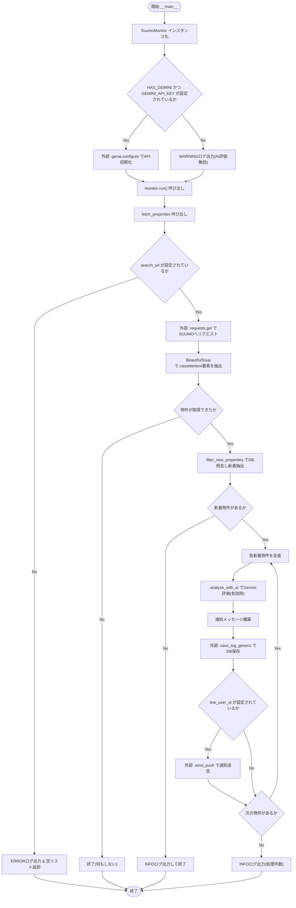
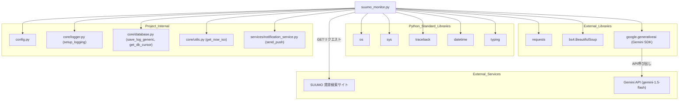

## 1. 解析メタ情報

| 項目 | 内容 |
| --- | --- |
| 対象ファイル | `monitors/old/suumo_monitor.py` |
| 言語 | Python |
| 解析対象 | 提供されたコードのみ |
| 推測・補完 | 一切なし |

## 関連ドキュメント

* [logger.md](./logger.md) - `setup_logging`の提供元
* [config.md](./config.md) - `SUUMO_SEARCH_URL`, `LINE_USER_ID`, `GEMINI_API_KEY`等の設定値を提供
* [database.md](./database.md) - `save_log_generic`, `get_db_cursor`の提供元
* [notification_service.md](./notification_service.md) - `send_push`の提供元
* [utils.md](./utils.md) - `get_now_iso`の提供元
* [ai_service.md](./ai_service.md) - 本ファイルと同様にLLM（Gemini等）を利用した推論を行うモジュール（推測: 用途の近さによる。本ファイルは`google.generativeai`を直接利用しており`ai_service.py`との直接の依存関係は確認できない）

## 2. ファイルの概要

SUUMOの新着賃貸物件情報をスクレイピングし、DBに未記録の新着物件をGemini API（`google.generativeai`）で評価した上でLINE/Discordへ通知するモニタースクリプトである。
根拠: [クラスDocstring] (行番号: 30〜31 / 抜粋: "SUUMOの新着物件を監視し、AIによる評価を添えて通知するクラス。")

Gemini関連ライブラリ(`google.generativeai`)は`try/except ImportError`でインポートされ、未インストール環境でも本ファイル自体はエラーなく動作するようになっている(`HAS_GEMINI`フラグで制御)。
根拠: [import文] (行番号: 20〜24 / 抜粋: "try:\n    import google.generativeai as genai\n    HAS_GEMINI = True\nexcept ImportError:\n    HAS_GEMINI = False")

`__init__`では`HAS_GEMINI`かつ`config.GEMINI_API_KEY`が設定されている場合のみGemini APIを初期化し(`ai_enabled=True`)、それ以外はAI評価を無効化してWARNINGログを出力する。
根拠: [__init__] (行番号: 40〜46 / 抜粋: "if HAS_GEMINI and config.GEMINI_API_KEY:\n            genai.configure(api_key=config.GEMINI_API_KEY)")

`fetch_properties`は`.cassetteitem`セレクタで物件カードを抽出し、物件名・賃料・広さ・リンクをパースする。個別カードのパースエラーは`except Exception: continue`で握りつぶし、他の物件の処理を継続する。
根拠: [fetch_properties] (行番号: 63〜84 / 抜粋: "items = soup.select('.cassetteitem')")

`filter_new_properties`はDB上の`property_logs`テーブル(`self.table_name`)に`device_id`が存在するかで新着判定を行う。
根拠: [filter_new_properties] (行番号: 93〜106 / 抜粋: "cur.execute(f\"SELECT id FROM {self.table_name} WHERE device_id = ?\", (p['id'],))")

`analyze_with_ai`は35歳・共働き・子供2人という固定の家庭属性を前提としたプロンプトをGeminiモデル(`gemini-1.5-flash`)に送信し、評価コメントを取得する。
根拠: [analyze_with_ai] (行番号: 113〜121 / 抜粋: "prompt = (\n            f\"以下の不動産物件について、35歳・共働き・2人の子供（5歳, 2歳）がいる家庭の視点で、\"")

`run`は取得→新着判定→（新着があれば）各物件についてAI評価・DB保存・通知送信、を順に行う。
根拠: [run] (行番号: 126〜168 / 抜粋: "def run(self) -> None:")

## 3. 外部依存関係

### インポート一覧

| 名称 | 種類 | 用途 | 根拠 |
| --- | --- | --- | --- |
| `os` | 標準ライブラリ | プロジェクトルートへのパス解決 | 根拠: `[import os]` (行番号: 2 / 抜粋: "import os") |
| `sys` | 標準ライブラリ | プロジェクトルートへのパス追加 | 根拠: `[import sys]` (行番号: 3 / 抜粋: "import sys") |
| `requests` | 外部ライブラリ | SUUMOへのHTTP GETリクエスト送信 | 根拠: `[import requests]` (行番号: 4 / 抜粋: "import requests") |
| `traceback` | 標準ライブラリ | インポートされているが、本ファイル内での呼び出し箇所が確認できない | 根拠: `[import traceback]` (行番号: 5 / 抜粋: "import traceback") |
| `BeautifulSoup` | 外部ライブラリ(`bs4`) | 取得したHTMLのパースおよび物件カード要素の抽出 | 根拠: `[from bs4 import BeautifulSoup]` (行番号: 6 / 抜粋: "from bs4 import BeautifulSoup") |
| `datetime` | 標準ライブラリ | インポートされているが、本ファイル内での明示的な呼び出し箇所が確認できない | 根拠: `[from datetime import datetime]` (行番号: 7 / 抜粋: "from datetime import datetime") |
| `List`, `Dict`, `Any`, `Optional`, `Tuple` | 標準ライブラリ(`typing`) | 型ヒントの定義 | 根拠: `[from typing import List, Dict, Any, Optional, Tuple]` (行番号: 8 / 抜粋: "from typing import List, Dict, Any, Optional, Tuple") |
| `config` | 内部モジュール | 検索URL・LINEユーザーID・Gemini APIキー等の設定値の提供 | 根拠: `[import config]` (行番号: 13 / 抜粋: "import config") |
| `setup_logging` | 内部モジュール(`core.logger`) | ロガーインスタンスの初期化 | 根拠: `[from core.logger import setup_logging]` (行番号: 14 / 抜粋: "from core.logger import setup_logging") |
| `save_log_generic`, `get_db_cursor` | 内部モジュール(`core.database`) | 汎用ログレコードのDB保存、DBカーソルの取得 | 根拠: `[from core.database import save_log_generic, get_db_cursor]` (行番号: 15 / 抜粋: "from core.database import save_log_generic, get_db_cursor") |
| `get_now_iso` | 内部モジュール(`core.utils`) | ISO形式の現在時刻取得 | 根拠: `[from core.utils import get_now_iso]` (行番号: 16 / 抜粋: "from core.utils import get_now_iso") |
| `send_push` | 内部モジュール(`services.notification_service`) | 新着物件の通知送信 | 根拠: `[from services.notification_service import send_push]` (行番号: 17 / 抜粋: "from services.notification_service import send_push") |
| `google.generativeai` (`genai`) | 外部ライブラリ | Gemini APIによる物件評価テキストの生成（未インストール時は`ImportError`をキャッチし機能を無効化） | 根拠: `[try: import google.generativeai as genai]` (行番号: 21 / 抜粋: "import google.generativeai as genai") |

### ブラックボックスとなる外部要素

| 名称 | 理由 | 根拠 |
| --- | --- | --- |
| `config.SUUMO_SEARCH_URL` / `config.LINE_USER_ID` / `config.GEMINI_API_KEY` | `config`モジュールの実装が提供されておらず、実際の値が不明であるため。 | 根拠: `[config直接参照]` (行番号: 35〜36, 40 / 抜粋: "self.search_url: Optional[str] = config.SUUMO_SEARCH_URL") |
| SUUMOサイトの実際のHTML構造(`.cassetteitem`等のクラス名) | 外部サイトの実際のレスポンス内容・構造は本ファイルからは確認できないため。 | 根拠: `[soup.select('.cassetteitem')]` (行番号: 63 / 抜粋: "items = soup.select('.cassetteitem')") |
| `google.generativeai`(Gemini API)の内部実装 | 外部ライブラリであり、`GenerativeModel.generate_content`の内部処理・実際のAPIレスポンス仕様は提供コードから読み取れないため。 | 根拠: `[self.model.generate_content(prompt)]` (行番号: 120 / 抜粋: "response = self.model.generate_content(prompt)") |
| `get_db_cursor`, `save_log_generic`の内部実装 | `core.database`モジュールの実装が本ファイルに含まれていないため。 | 根拠: `[get_db_cursor / save_log_generic呼び出し]` (行番号: 97, 158〜162 / 抜粋: "with get_db_cursor() as cur:") |
| `send_push`の内部実装 | `services.notification_service`モジュールの実装が本ファイルに含まれていないため。 | 根拠: `[send_push呼び出し]` (行番号: 166 / 抜粋: "send_push(self.line_user_id, [{\"type\": \"text\", \"text\": msg}], target=\"discord\")") |

## 4. 主要要素の定義（関数 / エンドポイント / コンポーネント）

### `SuumoMonitor`

* **役割**: SUUMOの新着物件を監視し、AIによる評価を添えて通知するクラス。
* 根拠: `[クラスDocstring]` (行番号: 29〜31 / 抜粋: "SUUMOの新着物件を監視し、AIによる評価を添えて通知するクラス。")

### `SuumoMonitor.__init__`

* **役割**: `config`から検索URL・LINEユーザーIDを読み込み、Gemini APIが利用可能な場合は初期化する。
* 根拠: `[__init__]` (行番号: 34〜46 / 抜粋: "def __init__(self) -> None:")
* **引数/リクエスト**: `self`のみ。
* 根拠: `[__init__シグネチャ]` (行番号: 34 / 抜粋: "def __init__(self) -> None:")
* **戻り値/レスポンス**: なし(`None`)。
* 根拠: `[__init__シグネチャ]` (行番号: 34 / 抜粋: "def __init__(self) -> None:")
* **副作用**: インスタンス属性(`search_url`, `line_user_id`, `table_name`, `model`, `ai_enabled`等)の設定。`HAS_GEMINI`かつAPIキー設定時は`genai.configure`によるGemini APIのグローバル設定を行う。
* 根拠: `[genai.configure]` (行番号: 41 / 抜粋: "genai.configure(api_key=config.GEMINI_API_KEY)")
* **エラーハンドリング**: なし（明示的な例外捕捉は行わず、Gemini利用不可時はWARNINGログのみ出力）。
* 根拠: `[elseブロック]` (行番号: 44〜46 / 抜粋: "logger.warning(\"⚠️ Gemini API is disabled (Key missing or library not installed).\")")

### `SuumoMonitor.fetch_properties`

* **役割**: SUUMOをスクレイピングして物件リストを取得する。
* 根拠: `[fetch_properties]` (行番号: 48〜49 / 抜粋: "SUUMOをスクレイピングして物件リストを取得する。")
* **引数/リクエスト**: `self`のみ。
* 根拠: `[シグネチャ]` (行番号: 48 / 抜粋: "def fetch_properties(self) -> List[Dict[str, Any]]:")
* **戻り値/レスポンス**: `List[Dict[str, Any]]` (物件情報の辞書のリスト。`id`, `name`, `price`, `layout`, `link`を含む。URL未設定時・エラー時は空リスト)。
* 根拠: `[戻り値型ヒントおよび各return]` (行番号: 48, 52, 87, 91 / 抜粋: "return properties")
* **副作用**: `requests.get`によるHTTP通信。
* 根拠: `[requests.get]` (行番号: 58 / 抜粋: "res = requests.get(self.search_url, headers=headers, timeout=15)")
* **エラーハンドリング**: 物件カード単位の`Exception`は`continue`で無視、全体の`Exception`はERRORログを出力し空リストを返す。URL未設定時はERRORログを出力し空リストを返す。
* 根拠: `[except節]` (行番号: 83〜84, 89〜91 / 抜粋: "except Exception:\n                    continue")

### `SuumoMonitor.filter_new_properties`

* **役割**: 既知の物件（DBに記録済み）を除外し、新着のみを返す。
* 根拠: `[filter_new_properties]` (行番号: 93〜94 / 抜粋: "既知の物件を除外し、新着のみを返す。")
* **引数/リクエスト**: `properties` (型: `List[Dict[str, Any]]`。判定対象の物件リスト)。
* 根拠: `[シグネチャ]` (行番号: 93 / 抜粋: "def filter_new_properties(self, properties: List[Dict[str, Any]]) -> List[Dict[str, Any]]:")
* **戻り値/レスポンス**: `List[Dict[str, Any]]` (新着物件のみのリスト。カーソル取得失敗時は入力`properties`をそのまま返す)。
* 根拠: `[各return]` (行番号: 98, 106 / 抜粋: "if not cur: return properties")
* **副作用**: `get_db_cursor`によるDB接続・クエリ実行(`SELECT`)。
* 根拠: `[cur.execute]` (行番号: 102 / 抜粋: "cur.execute(f\"SELECT id FROM {self.table_name} WHERE device_id = ?\", (p['id'],))")
* **エラーハンドリング**: なし（明示的な例外捕捉なし）。
* 根拠: `[filter_new_properties全体]` (行番号: 93〜106 / 抜粋: "def filter_new_properties(self, properties: List[Dict[str, Any]]) -> List[Dict[str, Any]]:")

### `SuumoMonitor.analyze_with_ai`

* **役割**: Gemini APIを使用して物件の魅力を分析する。
* 根拠: `[analyze_with_ai]` (行番号: 108〜109 / 抜粋: "Gemini APIを使用して物件の魅力を分析する。")
* **引数/リクエスト**: `prop` (型: `Dict[str, Any]`。分析対象の物件情報)。
* 根拠: `[シグネチャ]` (行番号: 108 / 抜粋: "def analyze_with_ai(self, prop: Dict[str, Any]) -> str:")
* **戻り値/レスポンス**: `str` (AI評価コメント。無効時は"（AI評価スキップ）"、エラー時は"（AI評価エラー）"の固定文字列)。
* 根拠: `[各return]` (行番号: 111, 121, 124 / 抜粋: "return \"（AI評価スキップ）\"")
* **副作用**: `self.model.generate_content`によるGemini APIへの外部通信。
* 根拠: `[generate_content呼び出し]` (行番号: 120 / 抜粋: "response = self.model.generate_content(prompt)")
* **エラーハンドリング**: `Exception`全般をキャッチしWARNINGログを出力、固定のエラーメッセージ文字列を返す。
* 根拠: `[except Exception]` (行番号: 122〜124 / 抜粋: "except Exception as e:\n            logger.warning(f\"⚠️ Gemini Analysis failed: {e}\")\n            return \"（AI評価エラー）\"")

### `SuumoMonitor.run`

* **役割**: メイン実行ルーチン。物件取得、新着判定、AI評価、DB保存、通知送信を統括する。
* 根拠: `[run]` (行番号: 126〜127 / 抜粋: "メイン実行ルーチン。")
* **引数/リクエスト**: `self`のみ。
* 根拠: `[runシグネチャ]` (行番号: 126 / 抜粋: "def run(self) -> None:")
* **戻り値/レスポンス**: なし(`None`)。取得結果・新着結果が空の場合は早期`return`。
* 根拠: `[早期return]` (行番号: 132, 136〜138 / 抜粋: "if not all_props: return")
* **副作用**: `fetch_properties`/`filter_new_properties`/`analyze_with_ai`の呼び出しに伴う外部通信（SUUMOへのHTTP、DB、Gemini API）、`save_log_generic`によるDB書き込み、`send_push`によるLINE/Discord通知送信。
* 根拠: `[save_log_genericとsend_push]` (行番号: 158〜166 / 抜粋: "save_log_generic(\n                self.table_name,")
* **エラーハンドリング**: 自身では明示的な`try/except`を持たない（内部で呼び出す各メソッド側で個別に例外処理される設計）。
* 根拠: `[run全体]` (行番号: 126〜168 / 抜粋: "def run(self) -> None:")

## 5. 処理フロー図

## 6. 依存関係図

## 7. 次のステップ（リバースエンジニアリングの提案）

| 優先度 | ファイル名(推測可) | 理由 | 根拠 |
| --- | --- | --- | --- |
| 高 | `config.py` | `SUUMO_SEARCH_URL`, `GEMINI_API_KEY`, `LINE_USER_ID`の実際の設定値を確認するため。 | 根拠: `[config直接参照]` (行番号: 35〜36, 40 / 抜粋: "self.search_url: Optional[str] = config.SUUMO_SEARCH_URL") |
| 中 | `core/database.py` | `get_db_cursor`, `save_log_generic`の実装（`property_logs`テーブルのスキーマ含む）を確認するため。 | 根拠: `[self.table_name定義とDB操作]` (行番号: 37, 102, 158〜162 / 抜粋: "self.table_name: str = \"property_logs\" # 物件監視用テーブル") |
| 低 | `services/notification_service.py` | `send_push`の実際の通知先(`target=\"discord\"`)や失敗時挙動を確認するため。 | 根拠: `[send_push呼び出し]` (行番号: 166 / 抜粋: "send_push(self.line_user_id, [{\"type\": \"text\", \"text\": msg}], target=\"discord\")") |

## 8. 保守上の注意点

* `traceback`（行5）と`datetime`（行7）がインポートされているが、本ファイル内で明示的に使用されている箇所が確認できない（未使用インポートの可能性）。
* 根拠: `[import文]` (行番号: 5, 7 / 抜粋: "import traceback")
* `fetch_properties`内の物件カードパースにおいて`except Exception: continue`で個別カードのエラーを完全に握りつぶしており、パース失敗の件数や原因がログに一切残らない。
* 根拠: `[except Exception: continue]` (行番号: 83〜84 / 抜粋: "except Exception:\n                    continue")
* 家庭属性（35歳・共働き・子供2人（5歳, 2歳））がプロンプト内にハードコードされており、汎用性がなく特定の家庭専用の実装となっている。
* 根拠: `[プロンプト文字列]` (行番号: 114 / 抜粋: "f\"以下の不動産物件について、35歳・共働き・2人の子供（5歳, 2歳）がいる家庭の視点で、\"")
* `filter_new_properties`は`get_db_cursor()`が`cur`として偽値（`None`等）を返した場合、新着判定を一切行わずに全件を新着として扱う(`return properties`)ため、DB接続障害時に既知物件への重複通知が発生するリスクがある。
* 根拠: `[if not cur: return properties]` (行番号: 98 / 抜粋: "if not cur: return properties")
* `Gemini`モデル名(`gemini-1.5-flash`)がハードコードされており、モデルの非推奨化・変更時にはコード修正が必要になる。
* 根拠: `[GenerativeModelインスタンス化]` (行番号: 42 / 抜粋: "self.model = genai.GenerativeModel('gemini-1.5-flash')")
* `monitors/old/`ディレクトリに配置されており、後継または現行版の同等モジュールが別途存在する可能性がある（本ファイル単体では判別不可）。
* 根拠: `[ファイルパス]` (行番号: 該当なし / 抜粋: "monitors/old/suumo_monitor.py")

## 9. 不明事項一覧

| 項目 | 理由 | 必要なファイル |
| --- | --- | --- |
| `config.SUUMO_SEARCH_URL` / `config.GEMINI_API_KEY` / `config.LINE_USER_ID`の実際の設定値 | `config`モジュールの実装が本ファイルに含まれていないため。 | `config.py` |
| `get_db_cursor` / `save_log_generic`の内部実装（`property_logs`テーブルのスキーマ） | `core.database`モジュールの実装が本ファイルに含まれていないため。 | `core/database.py` |
| `send_push`の内部実装（LINE/Discord通知の実際の送信方法） | `services.notification_service`モジュールの実装が本ファイルに含まれていないため。 | `services/notification_service.py` |
| SUUMOサイトの実際のHTML構造 | 外部サイトの内容は本ファイルからは確認できないため。 | 対象Webサイトの実際のレスポンス（動的にしか取得不可） |
| `traceback`/`datetime`インポートの実際の用途（未使用か、削除漏れか） | 本ファイル内で該当インポートの明示的な呼び出し箇所が確認できないため。 | 本ファイルの変更履歴・関連コミット |
| `monitors/old/`ディレクトリの位置づけ（現行版との関係） | ディレクトリ名から旧版の可能性が示唆されるが、本ファイル単体では現行版の有無や移行状況を判断できないため。 | `monitors/`配下の他ファイル一覧 |

## 10. 自己検証結果

* [x] 推測・外部ファイルの仕様を一切含んでいない（完了）
* [x] 全関数・全クラス・全コンポーネントを列挙した（完了）
* [x] 全てのインポート要素を列挙した（完了）
* [x] すべての仕様説明に「根拠（行番号・抜粋）」を明記した（完了）
* [x] 根拠漏れが0件である（完了）
* [x] Mermaid構文にエラーの原因となる記号（エスケープ漏れ）がない（完了）
* [x] 不明事項を漏れなく列挙した（完了）
