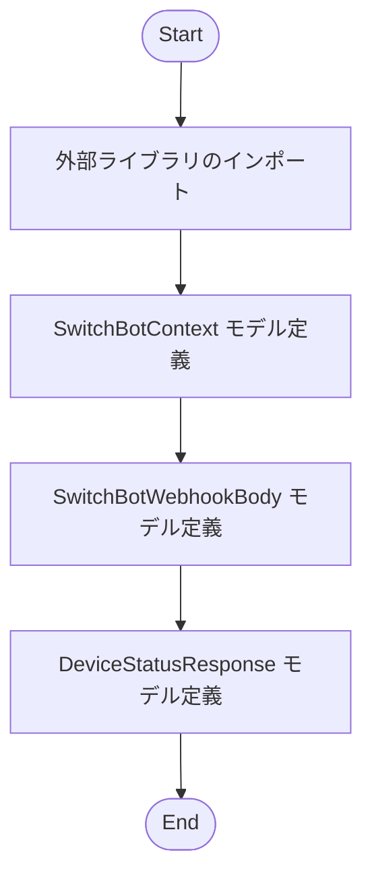
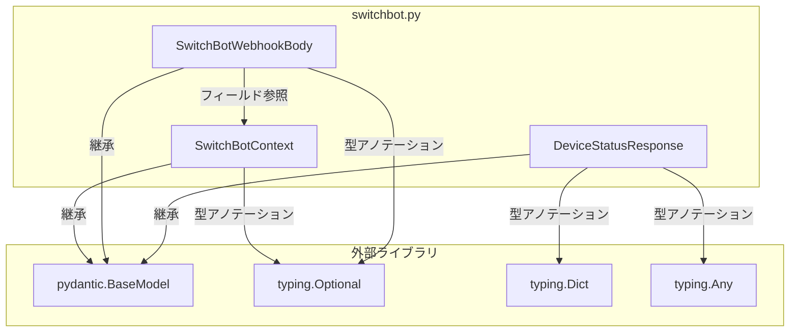

## 1. 解析メタ情報

| 項目 | 内容 |
| --- | --- |
| 対象ファイル | `switchbot.py` |
| 言語 | Python |
| 解析対象 | 提供されたコードのみ |
| 推測・補完 | 一切なし |

## 2. ファイルの概要

SwitchBotに関連するWebhookペイロードおよびAPI経由のデバイス状態レスポンスのデータ構造を、Pydanticのデータモデルとして定義している。

## 3. 外部依存関係

### インポート一覧

| 名称 | 種類 | 用途 | 根拠 |
| --- | --- | --- | --- |
| `BaseModel` | クラス | データモデルの基底クラス | 根拠: `from pydantic import BaseModel, Field` (行番号: 2 / 抜粋: "from pydantic import BaseModel") |
| `Field` | 関数 | ファイル内での利用なし | 根拠: `from pydantic import BaseModel, Field` (行番号: 2 / 抜粋: "import BaseModel, Field") |
| `Optional` | 型 | Null（None）許容型の定義 | 根拠: `from typing import Optional, Union, Dict, Any` (行番号: 3 / 抜粋: "import Optional, Union, Dict") |
| `Union` | 型 | ファイル内での利用なし | 根拠: `from typing import Optional, Union, Dict, Any` (行番号: 3 / 抜粋: "Union, Dict, Any") |
| `Dict` | 型 | 辞書型の定義 | 根拠: `from typing import Optional, Union, Dict, Any` (行番号: 3 / 抜粋: "Union, Dict, Any") |
| `Any` | 型 | 任意の型の定義 | 根拠: `from typing import Optional, Union, Dict, Any` (行番号: 3 / 抜粋: "Union, Dict, Any") |

### ブラックボックスとなる外部要素

該当なし

## 4. 主要要素の定義（関数 / エンドポイント / コンポーネント）

### `SwitchBotContext`

* **役割**: Webhookで送られてくる詳細コンテキストのデータ構造を定義するPydanticモデル。
* 根拠: `class SwitchBotContext(BaseModel):` (行番号: 5-15 / 抜粋: '"""Webhookで送られてくる詳細コンテキスト"""')

* **引数/リクエスト**: 該当なし（クラス定義のため）
* 根拠: データモデルの定義であり関数ではないため (行番号: 5 / 抜粋: "class SwitchBotContext(BaseMod")

* **戻り値/レスポンス**: 該当なし
* 根拠: データモデルの定義であり関数ではないため (行番号: 5 / 抜粋: "class SwitchBotContext(BaseMod")

* **副作用**: なし
* 根拠: ロジックを持たないデータモデルの定義であるため (行番号: 5-15 / 抜粋: "class SwitchBotContext(BaseMod")

* **エラーハンドリング**: なし
* 根拠: クラス内に例外処理が存在しないため (行番号: 5-15 / 抜粋: "class SwitchBotContext(BaseMod")

### `SwitchBotWebhookBody`

* **役割**: SwitchBot Webhookのエントリポイントのデータ構造を定義するPydanticモデル。
* 根拠: `class SwitchBotWebhookBody(BaseModel):` (行番号: 17-22 / 抜粋: '"""SwitchBot Webhookのエントリポイント"""')

* **引数/リクエスト**: 該当なし
* 根拠: データモデルの定義であり関数ではないため (行番号: 17 / 抜粋: "class SwitchBotWebhookBody(Bas")

* **戻り値/レスポンス**: 該当なし
* 根拠: データモデルの定義であり関数ではないため (行番号: 17 / 抜粋: "class SwitchBotWebhookBody(Bas")

* **副作用**: なし
* 根拠: ロジックを持たないデータモデルの定義であるため (行番号: 17-22 / 抜粋: "class SwitchBotWebhookBody(Bas")

* **エラーハンドリング**: なし
* 根拠: クラス内に例外処理が存在しないため (行番号: 17-22 / 抜粋: "class SwitchBotWebhookBody(Bas")

### `DeviceStatusResponse`

* **役割**: API経由で取得したデバイス状態のデータ構造を定義するPydanticモデル。
* 根拠: `class DeviceStatusResponse(BaseModel):` (行番号: 24-28 / 抜粋: '"""API経由で取得したデバイス状態（GET /v1.1/')

* **引数/リクエスト**: 該当なし
* 根拠: データモデルの定義であり関数ではないため (行番号: 24 / 抜粋: "class DeviceStatusResponse(Bas")

* **戻り値/レスポンス**: 該当なし
* 根拠: データモデルの定義であり関数ではないため (行番号: 24 / 抜粋: "class DeviceStatusResponse(Bas")

* **副作用**: なし
* 根拠: ロジックを持たないデータモデルの定義であるため (行番号: 24-28 / 抜粋: "class DeviceStatusResponse(Bas")

* **エラーハンドリング**: なし
* 根拠: クラス内に例外処理が存在しないため (行番号: 24-28 / 抜粋: "class DeviceStatusResponse(Bas")

## 5. 処理フロー図

本ファイルはデータモデル（スキーマ）の宣言のみを行っており、実行可能な処理ロジックや条件分岐が存在しないため、モデル定義のフローとして記述する。

## 6. 依存関係図

## 7. 次のステップ（リバースエンジニアリングの提案）

| 優先度 | ファイル名(推測可) | 理由 | 根拠 |
| --- | --- | --- | --- |
| 高 | Webhookのエンドポイント/ルーター定義ファイル | `SwitchBotWebhookBody` をリクエストボディとして受け取って処理する具体的なフローを把握するため。 | 根拠: `class SwitchBotWebhookBody` のドキュメント文字列 (行番号: 18 / 抜粋: '"""SwitchBot Webhookのエントリポイント"""') |
| 高 | APIクライアント/外部通信ファイル | `GET /v1.1/devices/{id}/status` に対してリクエストを行い、`DeviceStatusResponse` を処理するコードを特定するため。 | 根拠: `class DeviceStatusResponse` のドキュメント文字列 (行番号: 25 / 抜粋: '"""API経由で取得したデバイス状態（GET /v1.1/') |

## 8. 保守上の注意点

* **未使用コード**: `pydantic` からの `Field`、および `typing` からの `Union` のインポート文が存在するが、ファイル内で一度も使用されていない。
* **型定義の曖昧さ**: `DeviceStatusResponse` の `body` プロパティは `Any` を含んで定義されており、デバイスによって中身が大きく変わるため、利用側で動的な型判定やキーの存在チェック（安全なアクセス）が必要になる構造となっている。

## 9. 不明事項一覧

| 項目 | 理由 | 必要なファイル |
| --- | --- | --- |
| `DeviceStatusResponse.body` の正確なデータ構造と内訳 | 「デバイスにより中身が激しく変わるため一旦Any」と記述されており、本ファイル単独では各デバイスの具体的なプロパティ名や型が判明しないため。 | 各デバイスの仕様が記載された公式ドキュメント、またはAPIレスポンスの処理ロジック実装ファイル |
| モデルの利用用途（実際のビジネスロジック） | 本ファイルはデータモデルの定義のみであり、これらがどこでインスタンス化され、どのようにデータベース等に保存・利用されるか不明なため。 | ルーター、サービス、コントローラーなどの機能実装ファイル |

## 10. 自己検証結果

* [x] 推測・外部ファイルの仕様を一切含んでいない
* [x] 全関数・全クラス・全コンポーネントを列挙した
* [x] 全てのインポート要素を列挙した
* [x] すべての仕様説明に「根拠（行番号・抜粋）」を明記した
* [x] 根拠漏れが0件である
* [x] Mermaid構文にエラーの原因となる記号（エスケープ漏れ）がない
* [x] 不明事項を漏れなく列挙した

完了