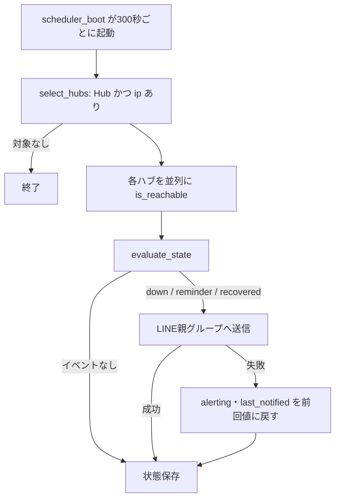
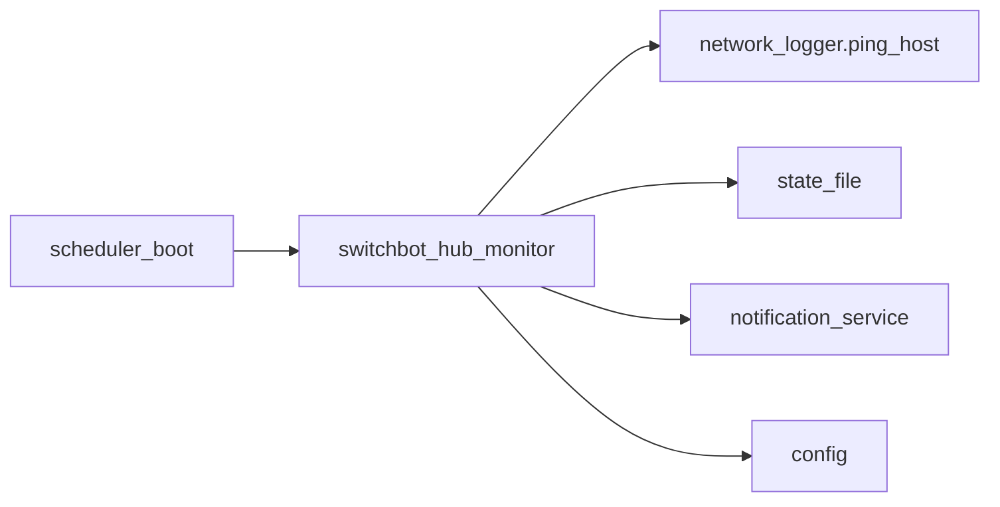

## 1. 解析メタ情報

| 項目 | 内容 |
| --- | --- |
| 対象ファイル | `monitors/switchbot_hub_monitor.py` |
| 言語 | Python |
| 解析対象 | 提供されたコードのみ |
| 推測・補完 | 一切なし |
| 解析基準 | SwitchBotハブ死活監視の新規追加時に作成 |

## 関連ドキュメント

- [scheduler_boot.md](./scheduler_boot.md) — 本スクリプトを`TASKS`に300秒間隔で登録し、サブプロセスとして起動する呼び出し元
- [network_logger.md](./network_logger.md) — 本スクリプトが流用する`ping_host`の定義元(カメラ向けのping監視)
- [switchbot_power_monitor.md](./switchbot_power_monitor.md) — 同じ`devices.json`の`monitor_devices`を読む兄弟スクリプト。こちらの`TARGET_DEVICE_TYPES`は`"Hub 2"`のみで、`"Hub Mini"`は部分一致しないため取得対象外
- [state_file.md](./state_file.md) — 状態JSONの読み書き(`read_json`/`write_json_atomic`)
- [notification_service.md](./notification_service.md) — `send_push`(LINE送信)の定義元
- [config.md](./config.md) — `DeviceConfig.ip`・`MONITOR_DEVICES`・`LINE_PARENTS_GROUP_ID`の定義元
- [start_all.md](./start_all.md) — 本スクリプトを`CLEANUP_TARGETS`の監視スクリプトパターンに含め、再起動時に孤児を残さないようにしている

## 2. ファイルの概要

* SwitchBotハブ(Hub Mini等)がWi-Fiから切断された、または電源が落ちたことをローカルpingで検知し、LINEの親グループへ通知するスケジューラの定期タスク。
* 従来はハブを見ておらず、ハブが止まっても配下のセンサーが無言で止まるだけだった。
* **対象**は`devices.json`の`monitor_devices`のうち、`type`に`"Hub"`を含み、かつ`ip`が設定されているもの。`ip`が無いハブは対象外(ラズパイと別LANのハブはここからpingが届かないため、`ip`を設定しない)。
* **検知しないもの**: SwitchBotクラウド側の断(Wi-Fiは生きているがクラウドに繋がらない状態)。ハブ停止時のAPI応答を実機で確認できていないため未実装である。
* 判定: 実行ごとに最大`PING_ATTEMPTS`回pingし、全滅なら「失敗1回」。連続`FAILURE_THRESHOLD`回で異常通知、継続中は`REMINDER_INTERVAL_SEC`ごとに再通知、復旧時に復旧通知(異常を通知していない一時的な失敗では復旧通知しない)。
* 本スクリプトは実行のたびに新しいプロセスとして起動されるため、連続失敗回数などは`switchbot_hub_monitor_state.json`に保存する。
* 通知はLINE親グループのみ。`logger.error`は`core.logger`によりDiscordへ自動送信されるため、検知ログは`warning`に留めている(ip不正の設定ミスのみ`error`)。
* 根拠: [モジュールdocstring] (行番号: 2-24 / 抜粋: "SwitchBotハブ(Hub Mini 等)の死活監視。")

## 3. 外部依存関係

### インポート一覧

| 名称 | 種類 | 用途 | 根拠 |
| --- | --- | --- | --- |
| `asyncio` | 標準ライブラリ | ping実行・複数ハブの並列チェック | 根拠: [インポート宣言] (行番号: 26 / 抜粋: "import asyncio") |
| `ipaddress` | 標準ライブラリ | `ip`がIPアドレスとして妥当かの検証(pingの引数にそのまま渡すため) | 根拠: [インポート宣言] (行番号: 27 / 抜粋: "import ipaddress") |
| `time` | 標準ライブラリ | 通知時刻(UNIX時刻)の取得 | 根拠: [インポート宣言] (行番号: 30 / 抜粋: "import time") |
| `config` | ローカルモジュール | `MONITOR_DEVICES`・`LINE_PARENTS_GROUP_ID`・`BASE_DIR`の参照 | 根拠: [インポート宣言] (行番号: 36 / 抜粋: "import config") |
| `core.state_file` | ローカルモジュール | 状態JSONの原子的な読み書き | 根拠: [インポート宣言] (行番号: 37 / 抜粋: "from core import state_file") |
| `monitors.network_logger.ping_host` | ローカルモジュール | ICMP ping(カメラ監視と同じ実装を流用) | 根拠: [インポート宣言] (行番号: 39 / 抜粋: "from monitors.network_logger import ping_host") |
| `services.notification_service.send_push` | ローカルモジュール | LINE送信 | 根拠: [インポート宣言] (行番号: 40 / 抜粋: "from services.notification_service import send_push") |

### ブラックボックスとなる外部要素

| 名称 | 理由 | 根拠 |
| --- | --- | --- |
| 実機の`devices.json`の`ip`の値 | gitignore対象で、リポジトリからは見えない。`devices.json.example`にはプレースホルダのみ。 | [対象抽出] (行番号: 106-127 / 抜粋: "def select_hubs(") |
| ハブがWi-FiのAP省電力等でICMPに応答しない可能性 | 機種・環境依存で、コードからは判断できない。誤検知は3回リトライ+3回連続失敗で緩和している。 | [定数宣言] (行番号: 45 / 抜粋: "PING_ATTEMPTS: int = 3") |

## 4. 主要要素の定義（関数 / エンドポイント / コンポーネント）

### 定数

* `HUB_TYPE_KEYWORD`("Hub")・`PING_ATTEMPTS`(3)・`PING_RETRY_INTERVAL_SEC`(2.0)・`FAILURE_THRESHOLD`(3)・`REMINDER_INTERVAL_SEC`(6時間)・状態ファイル`_STATE_FILE`(`config.BASE_DIR`直下)。
* 根拠: [定数宣言] (行番号: 44 / 抜粋: "HUB_TYPE_KEYWORD: str = \"Hub\"")、[定数宣言] (行番号: 47 / 抜粋: "FAILURE_THRESHOLD: int = 3")

### `evaluate_state`

* **役割**: 前回状態と今回のping結果から、新しい状態と通知イベント(`down`/`reminder`/`recovered`/`None`)を返す純関数。
* **状態**: `failures`(連続失敗回数)・`alerting`(異常通知済みか)・`last_notified`(最終通知UNIX時刻)。
* **副作用**: なし。前回状態が欠落・空でも安全に初期値で扱う。
* 根拠: [関数定義] (行番号: 56-85 / 抜粋: "def evaluate_state(")

### `build_message`

* **役割**: イベントごとの家族向け文面(`server_watchdog`の文体)を組み立てる。拠点名とハブ名を含める。
* 根拠: [関数定義] (行番号: 88-103 / 抜粋: "def build_message(")

### `select_hubs`

* **役割**: 監視対象のハブを抽出する。`type`に`"Hub"`を含み、`ip`が設定されたもののみ。`ip`が無ければinfoログを出して対象外、IPアドレスとして不正なら`error`ログを出してスキップする(`ping`コマンドのオプション注入を防ぐ)。
* 根拠: [関数定義] (行番号: 106-127 / 抜粋: "def select_hubs(")

### `is_reachable`

* **役割**: 最大`PING_ATTEMPTS`回、`PING_RETRY_INTERVAL_SEC`間隔でpingし、1回でも応答があればTrue。
* 根拠: [関数定義] (行番号: 130-138 / 抜粋: "async def is_reachable(")

### `_notify`

* **役割**: `config.LINE_PARENTS_GROUP_ID`宛にLINEで送る。未設定ならwarningを出してFalseを返す。
* 根拠: [関数定義] (行番号: 141-152 / 抜粋: "def _notify(")

### `main`

* **役割**: 対象ハブを複数並列にpingし、`evaluate_state`で判定、イベントがあれば通知して状態を保存する。**通知に失敗した場合は「通知済み」にせず**(`alerting`/`last_notified`を前回値に戻す)、次回の実行で再試行する。監視対象から外れたハブの状態は保存時に削除する。
* 根拠: [関数定義] (行番号: 154-194 / 抜粋: "async def main(")

## 5. 処理フロー図

## 6. 依存関係図

## 7. 次のステップ

* ハブ停止時のSwitchBot API応答を実機で確認し、クラウド断の検知(特に別LANの高砂のハブ)が可能か判断する。
* 実機の`devices.json`の伊丹のハブに`ip`を追加する(ルーターでDHCP予約して固定しておくこと)。

## 8. 保守上の注意点

* `scheduler_boot.TASKS`に登録し、`start_all.sh`の`CLEANUP_TARGETS`パターンにも追加済み(`tests/test_start_all_sh.py`が整合を検証する)。`TASKS`から外すときは両方を戻すこと。
* `network_logger`をimportしているため、`ping_host`のシグネチャ・戻り値(`status == "OK"`)を変えるときは本スクリプトも確認すること。
* しきい値(3回・約15分)を変える場合は、`tests/test_switchbot_hub_monitor.py`が定数を参照しているため、定数の変更だけで追従する。

## 9. 不明事項一覧

| 不明事項 | 理由 |
| --- | --- |
| ハブ停止時のAPI応答 | 実機で確認できていない。クラウド断の検知を実装していない理由でもある。 |
| 実機のハブがICMPに安定して応答するか | 実機での運用結果待ち。 |

## 10. 自己検証結果

* `tests/test_switchbot_hub_monitor.py`で、状態遷移(しきい値・一時的失敗・リマインド・復旧)、対象抽出(`ip`なし・不正IP)、通知失敗時の再試行、`scheduler_boot.TASKS`への登録、`DeviceConfig.ip`の任意性を検証している。
