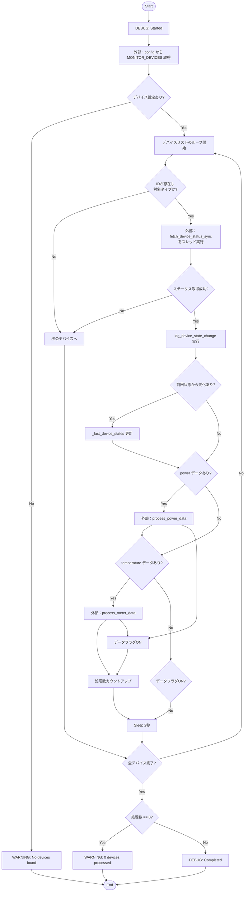
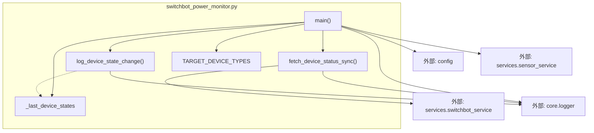

## 1. 解析メタ情報

| 項目 | 内容 |
| --- | --- |
| 対象ファイル | `switchbot_power_monitor.py` |
| 言語 | Python |
| 解析対象 | 提供されたコードのみ |
| 推測・補完 | 一切なし |

## 2. ファイルの概要

本ファイルは、設定された監視対象のSwitchBotデバイスからAPI経由で定期的にステータス（電力、温湿度、電源状態など）を取得し、状態変化の有無に応じて適切なログを出力するとともに、取得したセンサーデータを後続の処理サービス（電力データ処理、温湿度データ処理）へ連携するためのデバイス監視スクリプトである。

## 3. 外部依存関係

### インポート一覧

| 名称 | 種類 | 用途 | 根拠 |
| --- | --- | --- | --- |
| `asyncio` | 標準ライブラリ | 非同期処理の実行と制御 | 根拠: [インポート宣言] (行番号: 2 / 抜粋: "`import asyncio`") |
| `sys` | 標準ライブラリ | モジュール検索パスの操作 | 根拠: [インポート宣言] (行番号: 3 / 抜粋: "`import sys`") |
| `os` | 標準ライブラリ | パスの絶対パス解決・操作 | 根拠: [インポート宣言] (行番号: 4 / 抜粋: "`import os`") |
| `time` | 標準ライブラリ | 未使用（インポートのみ） | 根拠: [インポート宣言] (行番号: 5 / 抜粋: "`import time`") |
| `json` | 標準ライブラリ | 未使用（インポートのみ） | 根拠: [インポート宣言] (行番号: 6 / 抜粋: "`import json`") |
| `typing` | 標準ライブラリ | 型アノテーションの提供 | 根拠: [インポート宣言] (行番号: 7 / 抜粋: "`from typing import Dict, Any, Optional, List, Set`") |
| `config` | 外部モジュール | デバイスリスト設定の取得 | 根拠: [インポート宣言] (行番号: 12 / 抜粋: "`import config`") |
| `sb_tool` | 外部モジュール | SwitchBot APIからの状態取得 | 根拠: [インポート宣言] (行番号: 13 / 抜粋: "`from services import switchbot_service as sb_tool`") |
| `sensor_service` | 外部モジュール | センサーデータの処理依頼 | 根拠: [インポート宣言] (行番号: 14 / 抜粋: "`from services import sensor_service`") |
| `setup_logging` | 外部モジュール | ロガーの初期化処理 | 根拠: [インポート宣言] (行番号: 15 / 抜粋: "`from core.logger import setup_logging`") |

### ブラックボックスとなる外部要素

| 名称 | 理由 | 根拠 |
| --- | --- | --- |
| `config.MONITOR_DEVICES` | 設定値の具体的なデータ構造や内容が提供コード外のため不明。 | 根拠: [`main`内の変数代入] (行番号: 120 / 抜粋: "`devices: List[Dict[str, Any]] = getattr(config, "MONITOR_DEVICES", [])`") |
| `sb_tool.get_device_status` | SwitchBot API通信の内部実装およびAPIからのレスポンスの厳密な仕様が不明。 | 根拠: [`fetch_device_status_sync`内のAPI呼出] (行番号: 31 / 抜粋: "`status: Optional[Dict[str, Any]] = sb_tool.get_device_status(device_id)`") |
| `sensor_service.process_power_data` | 電力データ処理（保存や通知など）の内部実装が不明。 | 根拠: [`main`内の非同期呼出] (行番号: 157-159 / 抜粋: "`await sensor_service.process_power_data(...)`") |
| `sensor_service.process_meter_data` | 温湿度データ処理の内部実装が不明。 | 根拠: [`main`内の非同期呼出] (行番号: 163-165 / 抜粋: "`await sensor_service.process_meter_data(...)`") |
| `setup_logging` | ログの出力先、フォーマット設定の内部実装が不明。 | 根拠: [ロガー初期化処理] (行番号: 17 / 抜粋: "`logger = setup_logging("device_monitor")`") |

## 4. 主要要素の定義（関数 / エンドポイント / コンポーネント）

### `TARGET_DEVICE_TYPES`

* **役割**: 監視対象として許可するデバイスの種類のリストを定義する。
* 根拠: [変数定義] (行番号: 19-23 / 抜粋: "`TARGET_DEVICE_TYPES: List[str] = [...]`")

### `_last_device_states`

* **役割**: 各デバイスの直前の状態を保持し、状態変化の比較検知に用いるインメモリキャッシュ。
* 根拠: [変数定義] (行番号: 26 / 抜粋: "`_last_device_states: Dict[str, Dict[str, Any]] = {}`")

### `fetch_device_status_sync`

* **役割**: 指定されたデバイスIDを用いて外部APIからステータスを取得し、電力、温湿度、電源状態（ON/OFF）を抽出・加工して辞書として返す。
* 根拠: [関数定義] (行番号: 28-77 / 抜粋: "`def fetch_device_status_sync(device_id: str, device_type: str) -> Optional[Dict[str, Any]]:`")

* **引数/リクエスト**: `device_id` (str: デバイスID), `device_type` (str: デバイスのタイプ)
* 根拠: [関数の引数定義] (行番号: 28 / 抜粋: "`(device_id: str, device_type: str)`")

* **戻り値/レスポンス**: `Optional[Dict[str, Any]]` (抽出されたステータスデータ辞書。取得失敗やエラー時は `None`)
* 根拠: [関数の戻り値型定義] (行番号: 28 / 抜粋: "`-> Optional[Dict[str, Any]]:`")

* **副作用**: `sb_tool.get_device_status` を呼び出し外部APIと通信を行う。
* 根拠: [外部モジュールの関数呼出] (行番号: 31 / 抜粋: "`status: Optional[Dict[str, Any]] = sb_tool.get_device_status(device_id)`")

* **エラーハンドリング**: APIの `statusCode` が100以外の場合にエラーログを出力し `None` を返す。また、処理全体を `try-except` で囲み、予期せぬ例外発生時にエラーログを出力して `None` を返す。
* 根拠: [ステータスコード判定と例外捕捉] (行番号: 36, 75 / 抜粋: "`if status.get("statusCode") != 100:`" および "`except Exception as e:`")

### `log_device_state_change`

* **役割**: 前回の状態と現在の状態を比較し、状態の変化がない場合やデジタルな変化（電源ON/OFF等）かアナログな変化（温湿度の微少変動等）かに応じて出力するログレベル（INFO / DEBUG）を制御する。
* 根拠: [関数定義] (行番号: 79-114 / 抜粋: "`def log_device_state_change(...) -> None:`")

* **引数/リクエスト**: `dname` (str: デバイス名), `did` (str: デバイスID), `last_status` (Optional[Dict[str, Any]]: 前回の状態), `current_status` (Dict[str, Any]: 現在の状態)
* 根拠: [関数の引数定義] (行番号: 80-83 / 抜粋: "`dname: str, did: str, last_status: Optional[Dict[str, Any]], current_status: Dict[str, Any]`")

* **戻り値/レスポンス**: `None`
* 根拠: [関数の戻り値型定義] (行番号: 84 / 抜粋: "`-> None:`")

* **副作用**: なし（ロガーへの出力のみ）
* 根拠: [関数内の処理] (行番号: 79-114 / 抜粋: "`logger.info(...)`, `logger.debug(...)`")

* **エラーハンドリング**: なし
* 根拠: [関数内の処理] (行番号: 79-114 / 抜粋: "関数内にtry-except文は存在しない")

### `main`

* **役割**: 設定ファイルから監視対象デバイス一覧を取得し、非同期に各デバイスのステータス取得、状態変化のログ出力、キャッシュ更新、およびセンサーサービスへのデータ処理依頼をループで実行する監視のメイン処理。
* 根拠: [関数定義] (行番号: 116-173 / 抜粋: "`async def main() -> None:`")

* **引数/リクエスト**: なし
* 根拠: [関数の引数定義] (行番号: 116 / 抜粋: "`()`")

* **戻り値/レスポンス**: `None`
* 根拠: [関数の戻り値型定義] (行番号: 116 / 抜粋: "`-> None:`")

* **副作用**: グローバル変数 `_last_device_states` の更新、および `sensor_service` 内の非同期関数呼び出し。
* 根拠: [状態代入と外部呼出] (行番号: 154, 157, 163 / 抜粋: "`_last_device_states[did] = status`" および "`await sensor_service.process_power_data(...)`")

* **エラーハンドリング**: なし（例外処理は呼び出し元の `if __name__ == "__main__":` ブロック内で実施）
* 根拠: [関数内の処理] (行番号: 116-173 / 抜粋: "関数内にtry-except文は存在しない")

## 5. 処理フロー図

## 6. 依存関係図

## 7. 次のステップ（リバースエンジニアリングの提案）

| 優先度 | ファイル名(推測可) | 理由 | 根拠 |
| --- | --- | --- | --- |
| 高 | `config.py` | `MONITOR_DEVICES` 内の辞書の構造（特に `notify_settings` などのキーの有無）を把握することで、設定起因の不具合調査が可能になるため。 | 根拠: [`main`内の参照] (行番号: 120, 158 / 抜粋: "`getattr(config, "MONITOR_DEVICES", [])`" および "`device.get("notify_settings", {})`") |
| 高 | `services/sensor_service.py` | 取得した電力や温湿度データが最終的にどのようにDB保存・通知されているかを追跡し、データ損失時の調査範囲を明確にするため。 | 根拠: [`main`内の呼出] (行番号: 157, 163 / 抜粋: "`await sensor_service.process_power_data(...)`") |
| 中 | `services/switchbot_service.py` | SwitchBot APIへのリクエストパラメータやレスポンスの生データ形式を把握し、新しいセンサー値に対応させる際の設計方針を決めるため。 | 根拠: [`fetch_device_status_sync`内の呼出] (行番号: 31 / 抜粋: "`sb_tool.get_device_status(device_id)`") |

## 8. 保守上の注意点

* **グローバル変数の状態保持**: `_last_device_states` はインメモリの辞書として実装されているため、プロセスが再起動すると過去の状態はすべて失われる。再起動直後の初回取得時は強制的にDEBUGログとなる。
* **同期関数の非同期呼び出し**: `fetch_device_status_sync` は同期関数として実装されており、メインループ内で `asyncio.to_thread` を介して実行されている。
* **未使用のインポートモジュール**: `time` と `json` モジュールがインポートされているが、提供されたコードの範囲内では使用箇所が存在しない。
* **広範な例外の捕捉**: `fetch_device_status_sync` 内で `except Exception as e:` として全ての例外を捕捉しているため、予期せぬシステム例外（メモリ不足等）も包含して `None` を返す挙動となっている。

## 9. 不明事項一覧

| 項目 | 理由 | 必要なファイル |
| --- | --- | --- |
| 設定デバイスの構造定義 | `config.MONITOR_DEVICES`に格納されている各デバイス辞書が持つキーと値の完全な構造が本ファイルからは特定できないため。 | `config.py`（または設定を定義しているJSON/YAML等） |
| SwitchBot APIのレスポンス仕様 | `sb_tool.get_device_status()` が返す `body` の構造詳細、およびエラー時の具体的な `message` 仕様が不明なため。 | `services/switchbot_service.py` |
| データ処理時のエラー制御 | `sensor_service.process_power_data` および `process_meter_data` 側でエラーが発生した場合の例外送出有無や再試行ロジックが不明なため。 | `services/sensor_service.py` |
| ログの出力先・フォーマット | `logger.info` などの出力がコンソールのみか、ファイルや外部監視サービスへ転送されているかが不明なため。 | `core/logger.py` |

## 10. 自己検証結果

* [x] 推測・外部ファイルの仕様を一切含んでいない
* [x] 全関数・全クラス・全コンポーネントを列挙した
* [x] 全てのインポート要素を列挙した
* [x] すべての仕様説明に「根拠（行番号・抜粋）」を明記した
* [x] 根拠漏れが0件である
* [x] Mermaid構文にエラーの原因となる記号（エスケープ漏れ）がない
* [x] 不明事項を漏れなく列挙した

完了