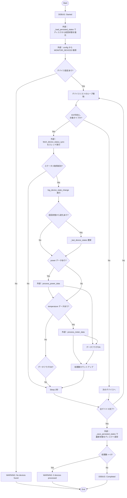
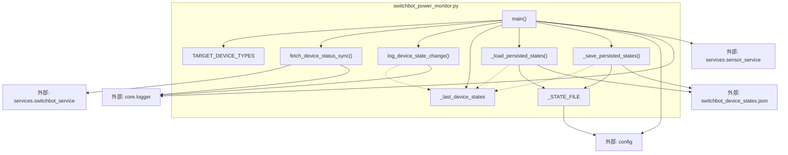

## 1. 解析メタ情報

| 項目 | 内容 |
| --- | --- |
| 対象ファイル | `switchbot_power_monitor.py` |
| 言語 | Python |
| 解析対象 | 提供されたコードのみ |
| 推測・補完 | 一切なし |

## 関連ドキュメント

- [config.md](./config.md) — 設定値(`MONITOR_DEVICES`, `BASE_DIR`)を提供
- [switchbot_service.md](./switchbot_service.md) — `sb_tool.get_device_status`の実体
- [switchbot.md](./switchbot.md) — `get_device_status`の戻り値のバリデーションに使われる`DeviceStatusResponse`モデルを定義
- [sensor_service.md](./sensor_service.md) — 呼び出し先。`process_power_data`, `process_meter_data`に処理を委譲
- [logger.md](./logger.md) — `core.logger.setup_logging`の実体
- [scheduler_boot.md](./scheduler_boot.md) — 呼び出し元の可能性(推定。scheduler_boot.mdの次のステップで本ファイルが`TASKS`関連候補として挙げられている)
- [webhook_router.md](./webhook_router.md) — `config.MONITOR_DEVICES`を参照する別モジュール(`id`, `name`, `location`キーの存在を裏付け)

## 2. ファイルの概要

本ファイルは、設定された監視対象のSwitchBotデバイスからAPI経由で定期的にステータス（電力、温湿度、電源状態など）を取得し、状態変化の有無に応じて適切なログを出力するとともに、取得したセンサーデータを後続の処理サービス（電力データ処理、温湿度データ処理）へ連携するためのデバイス監視スクリプトである。本スクリプトは`scheduler_boot.py`によって5分ごとに新規プロセスとして起動される使い捨てプロセスモデルであるため、状態変化検知用のキャッシュ(`_last_device_states`)をプロセス終了前にディスク上のJSONファイルへ永続化し、次回起動時に復元することで、プロセス再起動をまたいでも状態変化を検知できるようにしている（根拠: [ファイル冒頭のM-4-5コメント] 行番号: 25-32）。

## 3. 外部依存関係

### インポート一覧

| 名称 | 種類 | 用途 | 根拠 |
| --- | --- | --- | --- |
| `asyncio` | 標準ライブラリ | 非同期処理の実行と制御 | 根拠: [インポート宣言] (行番号: 2 / 抜粋: "`import asyncio`") |
| `sys` | 標準ライブラリ | モジュール検索パスの操作 | 根拠: [インポート宣言] (行番号: 3 / 抜粋: "`import sys`") |
| `os` | 標準ライブラリ | パスの絶対パス解決・操作 | 根拠: [インポート宣言] (行番号: 4 / 抜粋: "`import os`") |
| `time` | 標準ライブラリ | 未使用（インポートのみ） | 根拠: [インポート宣言] (行番号: 5 / 抜粋: "`import time`") |
| `json` | 標準ライブラリ | 状態キャッシュのJSON永続化（読み込み・書き込み） | 根拠: [`_load_persisted_states`/`_save_persisted_states`内での使用] (行番号: 6, 41, 50 / 抜粋: "`import json`", "`return json.load(f)`", "`json.dump(states, f)`") |
| `typing` | 標準ライブラリ | 型アノテーションの提供 | 根拠: [インポート宣言] (行番号: 7 / 抜粋: "`from typing import Dict, Any, Optional, List, Set`") |
| `config` | 外部モジュール | デバイスリスト設定の取得 | 根拠: [インポート宣言] (行番号: 12 / 抜粋: "`import config`") |
| `sb_tool` | 外部モジュール | SwitchBot APIからの状態取得 | 根拠: [インポート宣言] (行番号: 13 / 抜粋: "`from services import switchbot_service as sb_tool`") |
| `sensor_service` | 外部モジュール | センサーデータの処理依頼 | 根拠: [インポート宣言] (行番号: 14 / 抜粋: "`from services import sensor_service`") |
| `setup_logging` | 外部モジュール | ロガーの初期化処理 | 根拠: [インポート宣言] (行番号: 15 / 抜粋: "`from core.logger import setup_logging`") |

### ブラックボックスとなる外部要素

| 名称 | 理由 | 根拠 |
| --- | --- | --- |
| `config.MONITOR_DEVICES` | 設定値の具体的なデータ構造や内容が提供コード外のため不明。 | 根拠: [`main`内の変数代入] (行番号: 158 / 抜粋: "`devices: List[Dict[str, Any]] = getattr(config, "MONITOR_DEVICES", [])`") |
| `config.BASE_DIR` | 実際のパス値が提供コード外のため不明。永続化先ファイルのディレクトリを決定する。 | 根拠: [`_STATE_FILE`の変数定義] (行番号: 34 / 抜粋: "`_STATE_FILE: str = os.path.join(config.BASE_DIR, "switchbot_device_states.json")`") |
| `sb_tool.get_device_status` | SwitchBot API通信の内部実装およびAPIからのレスポンスの厳密な仕様が不明。 | 根拠: [`fetch_device_status_sync`内のAPI呼出] (行番号: 57 / 抜粋: "`status: Optional[Dict[str, Any]] = sb_tool.get_device_status(device_id)`") |
| `sensor_service.process_power_data` | 電力データ処理（保存や通知など）の内部実装が不明。 | 根拠: [`main`内の非同期呼出] (行番号: 192-194 / 抜粋: "`await sensor_service.process_power_data(...)`") |
| `sensor_service.process_meter_data` | 温湿度データ処理の内部実装が不明。 | 根拠: [`main`内の非同期呼出] (行番号: 198-200 / 抜粋: "`await sensor_service.process_meter_data(...)`") |
| `setup_logging` | ログの出力先、フォーマット設定の内部実装が不明。 | 根拠: [ロガー初期化処理] (行番号: 17 / 抜粋: "`logger = setup_logging("device_monitor")`") |

## 4. 主要要素の定義（関数 / エンドポイント / コンポーネント）

### `TARGET_DEVICE_TYPES`

* **役割**: 監視対象として許可するデバイスの種類のリストを定義する。
* 根拠: [変数定義] (行番号: 19-23 / 抜粋: "`TARGET_DEVICE_TYPES: List[str] = [...]`")

### `_last_device_states`

* **役割**: 各デバイスの直前の状態を保持し、状態変化の比較検知に用いるキャッシュ変数。本体はプロセス内メモリの辞書だが、`main`関数の起動時にディスク上の`_STATE_FILE`から復元され、終了時にディスクへ書き戻される（M-4-5: 本スクリプトは使い捨てプロセスとして5分ごとに再起動されるため、メモリのみのキャッシュでは状態変化が構造的に検知できなかった不具合の修正）。
* 根拠: [変数定義とその経緯コメント] (行番号: 25-33 / 抜粋: "`_last_device_states: Dict[str, Dict[str, Any]] = {}`")

### `_STATE_FILE`

* **役割**: `_last_device_states`の永続化先となるJSONファイルの絶対パスを保持する定数。`config.BASE_DIR`直下の`switchbot_device_states.json`を指す。
* 根拠: [変数定義] (行番号: 34 / 抜粋: "`_STATE_FILE: str = os.path.join(config.BASE_DIR, "switchbot_device_states.json")`")

### `_load_persisted_states`

* **役割**: `_STATE_FILE`が存在すればその内容をJSONとして読み込み、辞書として返す。前回プロセス実行時の状態を復元するために`main`から呼び出される。
* 根拠: [関数定義] (行番号: 37-44 / 抜粋: "`def _load_persisted_states() -> Dict[str, Dict[str, Any]]:`")

* **引数/リクエスト**: なし
* 根拠: [関数の引数定義] (行番号: 37 / 抜粋: "`()`")

* **戻り値/レスポンス**: `Dict[str, Dict[str, Any]]` (`_STATE_FILE`が存在せず、または読み込みに失敗した場合は空の辞書)
* 根拠: [関数の戻り値型定義と例外時の返却] (行番号: 37, 44 / 抜粋: "`-> Dict[str, Dict[str, Any]]:`" および "`return {}`")

* **副作用**: `_STATE_FILE`の存在確認およびファイル読み込みを行う。
* 根拠: [ファイルI/O] (行番号: 39-41 / 抜粋: "`if os.path.exists(_STATE_FILE):`" および "`return json.load(f)`")

* **エラーハンドリング**: 処理全体を`try-except`で囲み、読み込み失敗時（ファイル破損等）は警告ログを出力して空の辞書を返す（例外を再送出しない）。
* 根拠: [例外捕捉] (行番号: 42-43 / 抜粋: "`except Exception as e:`" および "`logger.warning(f"⚠️ Failed to load persisted device states: {e}")`")

### `_save_persisted_states`

* **役割**: 渡された状態辞書をJSONとして`_STATE_FILE`へ書き込み、次回プロセス実行時に復元できるようにする。`main`の終了直前に呼び出される。
* 根拠: [関数定義] (行番号: 47-52 / 抜粋: "`def _save_persisted_states(states: Dict[str, Dict[str, Any]]) -> None:`")

* **引数/リクエスト**: `states` (`Dict[str, Dict[str, Any]]`: 永続化するデバイス状態の辞書)
* 根拠: [関数の引数定義] (行番号: 47 / 抜粋: "`(states: Dict[str, Dict[str, Any]])`")

* **戻り値/レスポンス**: `None`
* 根拠: [関数の戻り値型定義] (行番号: 47 / 抜粋: "`-> None:`")

* **副作用**: `_STATE_FILE`へのファイル書き込み（上書き）を行う。
* 根拠: [ファイルI/O] (行番号: 49-50 / 抜粋: "`with open(_STATE_FILE, "w", encoding="utf-8") as f:`" および "`json.dump(states, f)`")

* **エラーハンドリング**: 処理全体を`try-except`で囲み、書き込み失敗時は警告ログを出力するのみで例外を再送出しない（永続化に失敗しても`main`の処理は継続する）。
* 根拠: [例外捕捉] (行番号: 51-52 / 抜粋: "`except Exception as e:`" および "`logger.warning(f"⚠️ Failed to persist device states: {e}")`")

### `fetch_device_status_sync`

* **役割**: 指定されたデバイスIDを用いて外部APIからステータスを取得し、電力、温湿度、電源状態（ON/OFF）を抽出・加工して辞書として返す。
* 根拠: [関数定義] (行番号: 54-105 / 抜粋: "`def fetch_device_status_sync(device_id: str, device_type: str) -> Optional[Dict[str, Any]]:`")

* **引数/リクエスト**: `device_id` (str: デバイスID), `device_type` (str: デバイスのタイプ)
* 根拠: [関数の引数定義] (行番号: 54 / 抜粋: "`(device_id: str, device_type: str)`")

* **戻り値/レスポンス**: `Optional[Dict[str, Any]]` (抽出されたステータスデータ辞書。取得失敗やエラー時は `None`)
* 根拠: [関数の戻り値型定義] (行番号: 54 / 抜粋: "`-> Optional[Dict[str, Any]]:`")

* **副作用**: `sb_tool.get_device_status` を呼び出し外部APIと通信を行う。
* 根拠: [外部モジュールの関数呼出] (行番号: 57 / 抜粋: "`status: Optional[Dict[str, Any]] = sb_tool.get_device_status(device_id)`")

* **エラーハンドリング**: APIの `statusCode` が100以外の場合にエラーログを出力し `None` を返す。また、処理全体を `try-except` で囲み、予期せぬ例外発生時にエラーログを出力して `None` を返す。
* 根拠: [ステータスコード判定と例外捕捉] (行番号: 62, 103 / 抜粋: "`if status.get("statusCode") != 100:`" および "`except Exception as e:`")

### `log_device_state_change`

* **役割**: 前回の状態と現在の状態を比較し、状態の変化がない場合やデジタルな変化（電源ON/OFF等）かアナログな変化（温湿度の微少変動等）かに応じて出力するログレベル（INFO / DEBUG）を制御する。
* 根拠: [関数定義] (行番号: 107-148 / 抜粋: "`def log_device_state_change(...) -> None:`")

* **引数/リクエスト**: `dname` (str: デバイス名), `did` (str: デバイスID), `last_status` (Optional[Dict[str, Any]]: 前回の状態), `current_status` (Dict[str, Any]: 現在の状態)
* 根拠: [関数の引数定義] (行番号: 108-111 / 抜粋: "`dname: str, did: str, last_status: Optional[Dict[str, Any]], current_status: Dict[str, Any]`")

* **戻り値/レスポンス**: `None`
* 根拠: [関数の戻り値型定義] (行番号: 112 / 抜粋: "`) -> None:`")

* **副作用**: なし（ロガーへの出力のみ）
* 根拠: [関数内の処理] (行番号: 107-148 / 抜粋: "`logger.info(...)`, `logger.debug(...)`")

* **エラーハンドリング**: なし
* 根拠: [関数内の処理] (行番号: 107-148 / 抜粋: "関数内にtry-except文は存在しない")

### `main`

* **役割**: 設定ファイルから監視対象デバイス一覧を取得し、非同期に各デバイスのステータス取得、状態変化のログ出力、キャッシュ更新、およびセンサーサービスへのデータ処理依頼をループで実行する監視のメイン処理。処理開始時に`_load_persisted_states`で前回プロセス実行時の状態をディスクから復元し、処理終了直前に`_save_persisted_states`で最新状態をディスクへ書き戻す。
* 根拠: [関数定義] (行番号: 150-215 / 抜粋: "`async def main() -> None:`")

* **引数/リクエスト**: なし
* 根拠: [関数の引数定義] (行番号: 150 / 抜粋: "`()`")

* **戻り値/レスポンス**: `None`
* 根拠: [関数の戻り値型定義] (行番号: 150 / 抜粋: "`-> None:`")

* **副作用**: グローバル変数 `_last_device_states` の更新（起動時のクリアと復元、状態変化時の更新）、`_STATE_FILE`への状態の読み込み・書き込み（`_load_persisted_states`/`_save_persisted_states`経由）、および `sensor_service` 内の非同期関数呼び出し。
* 根拠: [状態の復元・保存と外部呼出] (行番号: 155-156, 187, 210 / 抜粋: "`_last_device_states.update(_load_persisted_states())`", "`_last_device_states[did] = status`" および "`_save_persisted_states(_last_device_states)`")

* **エラーハンドリング**: なし（例外処理は呼び出し元の `if __name__ == "__main__":` ブロック内で実施。ただし内部で呼び出す`_load_persisted_states`/`_save_persisted_states`はそれぞれ内部で例外を捕捉するため、永続化処理の失敗が`main`まで伝播することはない）
* 根拠: [関数内の処理] (行番号: 150-215 / 抜粋: "関数内にtry-except文は存在しない")

## 5. 処理フロー図

```mermaid
flowchart TD
    Start([Start]) --> LogStart[DEBUG: Started]
    LogStart --> LoadState[外部：_load_persisted_states でディスクから前回状態を復元]
    LoadState --> ReadConfig[外部：config から MONITOR_DEVICES 取得]
    ReadConfig --> HasDevices{デバイス設定あり?}
    HasDevices -- No --> WarnNoDevice[WARNING: No devices found] --> End([End])
    HasDevices -- Yes --> LoopStart[デバイスリストのループ開始]
    
    LoopStart --> CheckValid{IDが存在し\n対象タイプか?}
    CheckValid -- No --> LoopNext[次のデバイスへ]
    CheckValid -- Yes --> FetchStatus[外部：fetch_device_status_sync\nをスレッド実行]
    
    FetchStatus --> CheckStatus{ステータス取得成功?}
    CheckStatus -- No --> Sleep
    CheckStatus -- Yes --> LogStateChange[log_device_state_change 実行]
    
    LogStateChange --> CheckDiff{前回状態から変化あり?}
    CheckDiff -- Yes --> UpdateCache[_last_device_states 更新]
    CheckDiff -- No --> CheckPower
    UpdateCache --> CheckPower
    
    CheckPower{power データあり?}
    CheckPower -- Yes --> ProcessPower[外部：process_power_data] --> CheckMeter
    CheckPower -- No --> CheckMeter
    
    CheckMeter{temperature データあり?}
    CheckMeter -- Yes --> ProcessMeter[外部：process_meter_data] --> IncrCount
    CheckMeter -- No --> CheckHasData
    
    ProcessPower --> HasDataTrue[データフラグON]
    ProcessMeter --> HasDataTrue
    HasDataTrue --> IncrCount[処理数カウントアップ]
    CheckHasData{データフラグON?}
    CheckHasData -- No --> Sleep[Sleep 2秒]
    IncrCount --> Sleep
    
    Sleep --> LoopCheck{全デバイス完了?}
    LoopNext --> LoopCheck
    LoopCheck -- No --> LoopStart
    LoopCheck -- Yes --> SaveState[外部：_save_persisted_states で最新状態をディスクへ保存]
    SaveState --> FinalCheck{処理数 == 0?}
    
    FinalCheck -- Yes --> WarnZero[WARNING: 0 devices processed]
    FinalCheck -- No --> DebugEnd[DEBUG: Completed]
    
    WarnZero --> End
    DebugEnd --> End

```

## 6. 依存関係図

```mermaid
graph TD
    subgraph "switchbot_power_monitor.py"
        Main["main()"]
        Fetch["fetch_device_status_sync()"]
        LogState["log_device_state_change()"]
        LoadState["_load_persisted_states()"]
        SaveState["_save_persisted_states()"]
        Cache["_last_device_states"]
        StateFile["_STATE_FILE"]
        TargetTypes["TARGET_DEVICE_TYPES"]
    end
    
    Main --> TargetTypes
    Main --> Fetch
    Main --> LogState
    Main --> Cache
    Main --> LoadState
    Main --> SaveState
    
    LogState -.-> Cache
    LoadState -.-> Cache
    SaveState -.-> Cache
    LoadState --> StateFile
    SaveState --> StateFile
    
    Config["外部: config"]
    SBService["外部: services.switchbot_service"]
    SensorService["外部: services.sensor_service"]
    Logger["外部: core.logger"]
    DiskFile["外部: switchbot_device_states.json"]
    
    Main --> Config
    Main --> SensorService
    Main --> Logger
    Fetch --> SBService
    Fetch --> Logger
    LogState --> Logger
    StateFile --> Config
    LoadState --> DiskFile
    SaveState --> DiskFile

```

## 7. 次のステップ（リバースエンジニアリングの提案）

| 優先度 | ファイル名(推測可) | 理由 | 根拠 |
| --- | --- | --- | --- |
| 高 | `config.py` | `MONITOR_DEVICES` 内の辞書の構造（特に `notify_settings` などのキーの有無）、および `_STATE_FILE` の実際のパスを決定する `BASE_DIR` の値を把握することで、設定起因の不具合調査が可能になるため。 | 根拠: [`main`内の参照および`_STATE_FILE`の定義] (行番号: 34, 158, 193 / 抜粋: "`os.path.join(config.BASE_DIR, "switchbot_device_states.json")`", "`getattr(config, "MONITOR_DEVICES", [])`" および "`device.get("notify_settings", {})`") |
| 高 | `services/sensor_service.py` | 取得した電力や温湿度データが最終的にどのようにDB保存・通知されているかを追跡し、データ損失時の調査範囲を明確にするため。 | 根拠: [`main`内の呼出] (行番号: 192, 198 / 抜粋: "`await sensor_service.process_power_data(...)`") |
| 中 | `services/switchbot_service.py` | SwitchBot APIへのリクエストパラメータやレスポンスの生データ形式を把握し、新しいセンサー値に対応させる際の設計方針を決めるため。 | 根拠: [`fetch_device_status_sync`内の呼出] (行番号: 57 / 抜粋: "`sb_tool.get_device_status(device_id)`") |

## 8. 保守上の注意点

* **状態キャッシュのディスク永続化（M-4-5）**: 本スクリプトは`scheduler_boot.py`により5分ごとに新規プロセスとして起動される使い捨てプロセスモデルであるため、`_last_device_states`をインメモリの辞書のみで実装すると、実行のたびに空の辞書から始まり状態変化（ON/OFF等）が永久に検知できない不具合があった。この修正として`main`は起動時に`_load_persisted_states`でJSONファイル(`_STATE_FILE` = `config.BASE_DIR`直下の`switchbot_device_states.json`)から前回状態を復元し、終了直前に`_save_persisted_states`で最新状態を書き戻す。これにより「再起動直後は必ずDEBUGログになる」のは、その`_STATE_FILE`自体が存在しない（本当に初回の）実行時のみに限定される。
* **永続化処理は自身の例外を握りつぶす設計**: `_load_persisted_states`/`_save_persisted_states`はいずれも内部で`except Exception`により全例外を捕捉し警告ログを出すのみで、`main`側へは伝播させない。そのため`_STATE_FILE`の読み書きに失敗しても（JSON破損、権限エラー等）監視処理自体は止まらないが、失敗時は状態変化検知が実質的に機能しなくなる点に注意が必要。
* **同時実行に対する排他制御がない**: `_load_persisted_states`/`_save_persisted_states`はファイルロック等を行わずに`_STATE_FILE`を読み書きするため、本スクリプトが同時に複数プロセスとして実行された場合はレースコンディションによりお互いの状態を上書きし合う可能性がある。ただしscheduler_boot.py側の起動モデル（順次実行が前提）により通常は単一プロセスでの実行が想定されている。
* **同期関数の非同期呼び出し**: `fetch_device_status_sync` は同期関数として実装されており、メインループ内で `asyncio.to_thread` を介して実行されている。
* **未使用のインポートモジュール**: `time` モジュールがインポートされているが、提供されたコードの範囲内では使用箇所が存在しない（`json`は状態永続化処理で使用されるようになったため、現在は未使用ではない）。
* **広範な例外の捕捉**: `fetch_device_status_sync` 内で `except Exception as e:` として全ての例外を捕捉しているため、予期せぬシステム例外（メモリ不足等）も包含して `None` を返す挙動となっている。

## 9. 不明事項一覧

| 項目 | 理由 | 必要なファイル |
| --- | --- | --- |
| 設定デバイスの構造定義 | `config.MONITOR_DEVICES`に格納されている各デバイス辞書が持つキーと値の完全な構造が本ファイルからは特定できないため。 | `config.py`（または設定を定義しているJSON/YAML等） |
| `config.BASE_DIR`の実際のパス値 | `_STATE_FILE`（永続化先JSONファイルのパス）の構築に使われる`config.BASE_DIR`の実値が本ファイルからは不明なため。 | `config.py` |
| SwitchBot APIのレスポンス仕様 | `sb_tool.get_device_status()` が返す `body` の構造詳細、およびエラー時の具体的な `message` 仕様が不明なため。 | `services/switchbot_service.py` |
| データ処理時のエラー制御 | `sensor_service.process_power_data` および `process_meter_data` 側でエラーが発生した場合の例外送出有無や再試行ロジックが不明なため。 | `services/sensor_service.py` |
| ログの出力先・フォーマット | `logger.info` などの出力がコンソールのみか、ファイルや外部監視サービスへ転送されているかが不明なため。 | `core/logger.py` |

## 相互参照による補足情報

| 元の不明事項 | 判明した内容 | 参照元ドキュメント |
| --- | --- | --- |
| 設定デバイスの構造定義 | `webhook_router.md`の解析によれば、`config.MONITOR_DEVICES`の各要素は少なくとも`id`, `name`, `location`キーを持つとされる。本ファイル自身のコードからは`notify_settings`キーの存在も確認できる。ただし、これ以外にどのようなキーが存在するかを含む完全なスキーマは、`config.py`自体が未確認のため依然として不明である。 | webhook_router.md |
| SwitchBot APIのレスポンス仕様 | `switchbot_service.md`の解析によれば、`sb_tool.get_device_status`(=`get_device_status`)は`request_switchbot_api`経由でGETリクエストを送り、レスポンスを`models.switchbot.DeviceStatusResponse`でバリデーションした辞書を返すとされ、失敗時は`None`を返すフェイルソフト設計とされる。`switchbot.md`の解析によれば、`DeviceStatusResponse`は`statusCode`, `message`, `body`(型は`Dict[str, Any]`)を持つモデルで、`body`の中身はデバイス種別により大きく異なり厳密な型定義はされていないとされる。 | switchbot_service.md, switchbot.md |
| データ処理時のエラー制御 | `sensor_service.md`の解析によれば、`process_meter_data`は明示的な例外処理を持たず、`process_power_data`はDBからの前回値取得時の例外を`except Exception`で捕捉し前回値を`0.0`として処理を継続する(例外を再送出しない)とされる。 | sensor_service.md |
| ログの出力先・フォーマット | `logger.md`の解析によれば、`setup_logging`はコンソール出力・日次ローテーションのファイル出力(`home_system.log`)・ERRORレベル以上のDiscord Webhook通知の3種のハンドラを登録するとされる。 | logger.md |

## 10. 自己検証結果

* [x] 推測・外部ファイルの仕様を一切含んでいない
* [x] 全関数・全クラス・全コンポーネントを列挙した
* [x] 全てのインポート要素を列挙した
* [x] すべての仕様説明に「根拠（行番号・抜粋）」を明記した
* [x] 根拠漏れが0件である
* [x] Mermaid構文にエラーの原因となる記号（エスケープ漏れ）がない
* [x] 不明事項を漏れなく列挙した

完了